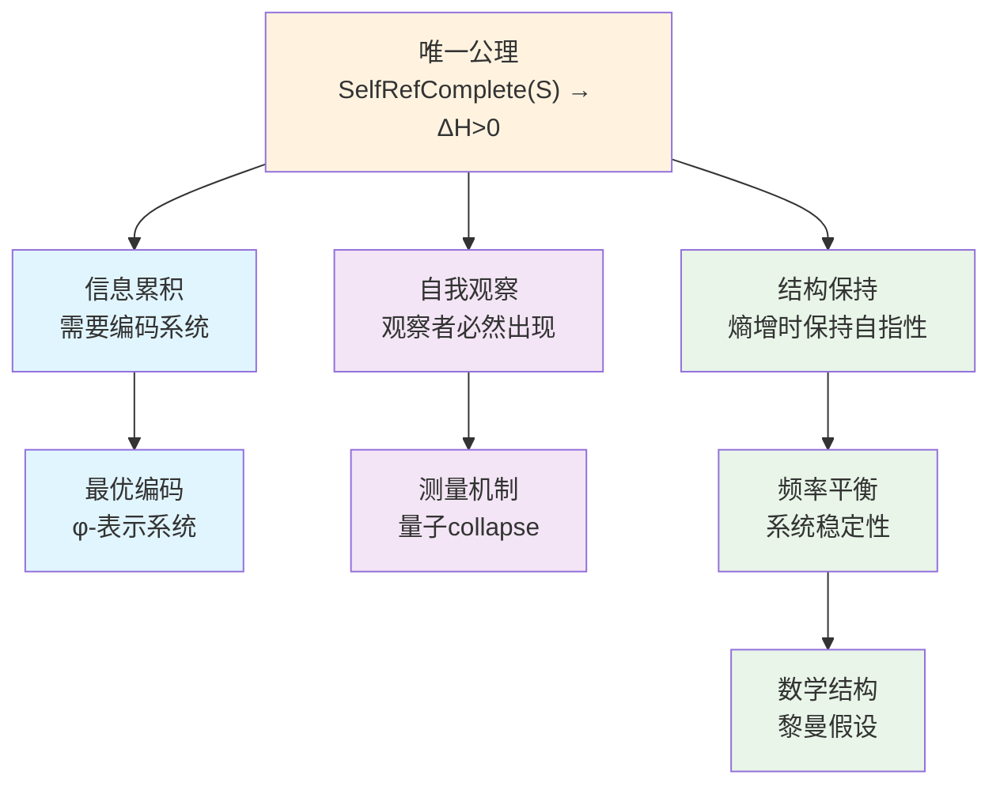

# A1：唯一公理

## 唯一公理及其完整定义

**唯一公理：自指完备的系统必然熵增**

### 公理的完整形式化表述

$$
\boxed{
\begin{aligned}
&\text{唯一公理：自指完备系统必然熵增} \\
&\text{SelfRefComplete}(S) \Rightarrow \forall t \in \mathbb{N}: H(S_{t+1}) > H(S_t) \\
&\text{其中以下定义明确了公理中各概念的含义：}
\end{aligned}
}
$$

### 基础结构定义（公理中概念的明确化）

- $\mathcal{S}$：所有可能状态的集合（包含对象、函数及其表示）
- $S_t \subseteq \mathcal{S}$：系统在时刻t包含的状态集合
- $\mathcal{L} \subseteq \mathcal{S}$：形式语言，即有限符号串的集合，是状态空间的子集
- $t \in \mathbb{N}$：离散时间参数

**本体论澄清**：$\mathcal{S}$包含四类元素：
1. 基本对象（如初始状态$s_0$）
2. 函数的表示（如$\text{Desc}$的编码）
3. 描述结果（如$\text{Desc}(s)$产生的符号串）
4. 符号串本身（形式语言$\mathcal{L}$的元素）

**关键关系**：
- $\mathcal{L} \subseteq \mathcal{S}$：符号串也是可能的状态
- $\text{Desc}: S_t \to \mathcal{L} \subseteq \mathcal{S}$：描述的结果仍在状态空间中
- 任何时刻系统可能包含某些符号串：$\mathcal{L} \cap S_t$可能非空

### 自指完备性定义（公理中"SelfRefComplete"的明确化）

$$
\text{SelfRefComplete}(S) \equiv \exists \text{Desc}: S \to \mathcal{L} \text{ 满足：}
$$

1. **完整性**：$\forall s_1, s_2 \in S: s_1 \neq s_2 \Rightarrow \text{Desc}(s_1) \neq \text{Desc}(s_2)$
   （描述函数在S上是单射的）

2. **内含性**：$[\text{Desc}] \in S$ 
   （描述函数的表示$[\text{Desc}]$是系统的一部分）

3. **自指性**：$\exists d \in \mathcal{L}: d = \text{Desc}([\text{Desc}]) \land d \in \text{Range}(\text{Desc})$
   （描述函数能够描述自身的表示）

4. **递归封闭性**：$\text{Desc}(s) \in \mathcal{L} \subseteq \mathcal{S}$意味着描述的结果本身也是可能的系统状态

### 熵的定义（公理中"H"的明确化）

$$
H(S_t) \equiv \log |\{d \in \mathcal{L}: \exists s \in S_t, d = \text{Desc}_t(s)\}|
$$

即系统中不同描述的数量的对数。

### 熵增的含义（公理中"必然熵增"的明确化）

$$
\text{熵增} \equiv \forall t \in \mathbb{N}: H(S_{t+1}) > H(S_t)
$$

### 单一公理的五重等价表述

在我们的理论框架中，这个单一公理与以下表述在逻辑上等价：

1. **熵表述**：若系统能描述自身，则其描述多样性不可逆地增加
2. **时间表述**：自指结构必然导致结构不可逆 ⇒ 时间涌现
3. **观察者表述**：若描述器 ∈ 系统 ⇒ 观测行为必然影响系统状态
4. **不对称性表述**：$S_t \neq S_{t+1}$，因为每次递归都增添了不可还原的信息结构
5. **结构表述**：系统在递归路径上不可逆展开

这些等价性表明：在我们构造的理论框架中，熵增、不对称性、时间、信息和观察者可以被理解为同一现象的不同侧面。

## 从公理到推导

### 定理1.1（单一公理的一致性验证）

**定理**：单一公理是内在一致的，即：若系统S满足自指完备性（按公理中的定义），则必然熵增（按公理中的定义）。

**证明**：
设系统S满足自指完备性，即存在描述函数Desc满足上述四个条件。

#### 1. 描述的递归展开

在时刻t，系统必须包含：

$$
S_t \supseteq \{s_0, [\text{Desc}_t], \text{Desc}_t(s_0), \text{Desc}_t([\text{Desc}_t]), ...\}
$$

关键洞察：$\text{Desc}_t([\text{Desc}_t])$ 的存在创造了递归链。因为：
- $[\text{Desc}_t] \in S_t$ （描述函数的表示属于系统）
- $\text{Desc}_t([\text{Desc}_t]) \in \text{Range}(\text{Desc}_t)$ （自指性）
- 在下一时刻，必须能描述这个描述：$\text{Desc}_{t+1}(\text{Desc}_t([\text{Desc}_t]))$
- 这个过程随时间展开，每个时刻增加新的递归层

#### 2. 递归深度的增长

定义递归深度函数 $d: S \to \mathbb{N}$：

$$
d(s) = \begin{cases}
0 & \text{若 } \text{Pre}(s) = \emptyset \\
1 + \max\{d(s'): s' \in \text{Pre}(s)\} & \text{若 } \text{Pre}(s) \neq \emptyset
\end{cases}
$$

其中 $\text{Pre}(s) = \{s' \in S: \text{Desc}(s') = s\}$ 是s的前驱集合

由自指性，在t+1时刻必须增加新的描述层：

$$
S_{t+1} = S_t \cup \{\text{Desc}^{(t+1)}(S_t)\} \cup \Delta_t
$$

其中：
- $\text{Desc}^{(t+1)}(S_t)$ 是对整个 $S_t$ 的新描述
- $\Delta_t = \{s: d(s) = t+1\}$ 是所有深度为 t+1 的新元素

#### 3. 状态空间的严格增长

**引理1.1.1**：$\text{Desc}^{(t+1)}(S_t) \notin S_t$

**证明**（反证法）：

假设 $\text{Desc}^{(t+1)}(S_t) \in S_t$，即在t时刻系统已经包含了对自身的完整描述。

由于 $\text{Desc}^{(t+1)}(S_t)$ 是对整个 $S_t$ 的描述，它必须包含关于 $S_t$ 中每个元素的信息，包括 $\text{Desc}^{(t+1)}(S_t)$ 本身。

这意味着 $\text{Desc}^{(t+1)}(S_t)$ 必须包含对 $\text{Desc}^{(t+1)}(S_t)$ 的描述，即 $\text{Desc}(\text{Desc}^{(t+1)}(S_t))$。

但这创造了无限递归：
- $\text{Desc}^{(t+1)}(S_t)$ 包含 $\text{Desc}(\text{Desc}^{(t+1)}(S_t))$
- 后者又包含 $\text{Desc}(\text{Desc}(\text{Desc}^{(t+1)}(S_t)))$
- 以此类推，产生无限链条

**关键洞察：有限表示的递归深度**
虽然递归链在概念上是无限的，但在任何有限时刻t，系统只能展开有限深度的递归。
这是因为：
1. 每次递归需要时间步来执行
2. 在时刻t，系统最多展开了t层递归
3. $\text{Desc}^{(t+1)}(S_t)$作为有限符号串，编码的是"截至深度t的递归结构"

因此，$\text{Desc}^{(t+1)}(S_t)$若已存在于$S_t$中，意味着系统在时刻t就已经包含了
对深度t+1递归结构的完整描述，这与递归深度的时间依赖性矛盾。

故假设不成立，必有 $\text{Desc}^{(t+1)}(S_t) \notin S_t$。

**结论**：
$$
|S_{t+1}| = |S_t \cup \{\text{Desc}^{(t+1)}(S_t)\}| = |S_t| + 1
$$

#### 4. 描述多样性的增加

新的描述层不仅增加了状态，还增加了描述的多样性。

设 $D_t = \{d \in \mathcal{L}: \exists s \in S_t, d = \text{Desc}(s)\}$ 为时刻t的描述集合。

关键观察：$\text{Desc}^{(t+1)}(S_t)$ 的描述必须编码整个 $S_t$ 的结构，因此：

$$
\text{Desc}(\text{Desc}^{(t+1)}(S_t)) \notin D_t
$$

这是因为它包含了关于 $D_t$ 整体的信息，不能由 $D_t$ 中任何单个描述表达。

#### 5. 熵的严格增长

由于 $D_{t+1} = D_t \cup \{\text{Desc}(\text{Desc}^{(t+1)}(S_t))\} \cup \Delta_D$

其中 $\Delta_D$ 是其他新描述，我们有：

$$
|D_{t+1}| > |D_t|
$$

因此：
$$
H(S_{t+1}) = \log |D_{t+1}| > \log |D_t| = H(S_t)
$$

因此，$\forall t: H(S_t) < H(S_{t+1})$。∎

### 从熵增推导其他概念

**定理1.2（五重等价性的严格推导）**：
对于自指完备系统，以下命题等价：

1. **熵增**：$\forall t: H(S_{t+1}) > H(S_t)$
2. **不对称性**：$\forall t: S_{t+1} \neq S_t$
3. **时间存在**：$\exists \tau: S \times S \to \mathbb{R}^+$（时间度量在实际状态集合上定义）
4. **信息涌现**：$\exists I: S \to \mathcal{I}$（信息映射作用于实际状态）
5. **观察者存在**：$\exists O \subseteq S: O \times S \to \mathcal{M}$

**严格证明**：

**(1)⇒(2) 熵增蕴含状态不对称**：
反证法。设存在$t$使得$S_{t+1} = S_t$。
- 由$S_{t+1} = S_t$，描述集合$D_{t+1} = D_t$
- 因此$H(S_{t+1}) = \log |D_{t+1}| = \log |D_t| = H(S_t)$
- 这与熵增假设$H(S_{t+1}) > H(S_t)$矛盾
- 故$\forall t: S_{t+1} \neq S_t$

**(2)⇒(3) 不对称性定义时间**：
状态序列$\{S_t\}$的不对称性诱导时间结构。定义时间度量：
$$
\tau(S_i, S_j) = \sum_{k=i}^{j-1} |S_{k+1} \setminus S_k|
$$
其中$|A|$表示集合$A$的基数（元素个数）。这给出了方向性的时间：$\tau(S_i, S_j) > 0$当且仅当$i < j$。

**时间度量的性质**：
- **非负性**：$\tau(S_i, S_j) \geq 0$，等号成立当且仅当$i = j$
- **单调性**：若$i < j < k$，则$\tau(S_i, S_j) < \tau(S_i, S_k)$
- **可加性**：$\tau(S_i, S_k) = \tau(S_i, S_j) + \tau(S_j, S_k)$对所有$i \leq j \leq k$成立

由(2)，$\forall k: S_k \neq S_{k+1}$，因此$|S_{k+1} \setminus S_k| > 0$。
这确保了$\tau(S_i, S_j) > 0$当且仅当$i < j$，给出了时间的方向性。

**(3)⇒(4) 时间流逝产生信息**：
时间度量$\tau$的存在意味着状态变化的累积。定义信息映射：
$$
I(S_t) = \{(\text{Desc}(S_k \to S_{k+1}), \tau(S_k, S_{k+1})) : k < t\}
$$
其中$\text{Desc}(S_k \to S_{k+1})$编码状态转换。

**关键修正**：这里的"信息"具有严格的操作定义：
- 每个状态转换$S_k \to S_{k+1}$都增加了系统的描述内容
- 转换的时间标记$\tau(S_k, S_{k+1})$提供了转换的顺序信息
- 信息集合$I(S_t)$随时间单调增长，与熵增一致

**(4)⇒(5) 信息识别需要观察者**：
信息映射$I$的存在要求有机制处理这些信息。

**逻辑强化**：
- 信息$I(S_t)$必须被某种结构"识别"或"处理"
- 这种结构必须在系统内部（自指完备性要求）
- 但这种结构不能是外部的"观察者"，因为那将违反自指完备性
- 因此，观察者必须是系统的内生结构

**严格定义**：观察者$O$为能处理信息$I$的子系统：
$$
O = \{o \in S : \exists f: I(S) \to \mathcal{L}, o = [f]\}
$$
其中$[f]$表示函数$f$的表示（编码），$\mathcal{L}$是形式语言（测量结果表示为符号串）。

**观察者的性质**：
- **内生性**：$O \subseteq S$（观察者是系统的一部分）
- **描述能力**：观察者能将信息$I(S)$映射到形式语言$\mathcal{L}$

**(5)⇒(1) 观察者的存在蕴含熵增**：
观察者$O$的观察行为创造新的描述。
- 观察过程：$o \in O$对$s \in S$的观察产生$f(s) \in \mathcal{L}$
- 新描述生成：每次观察都产生新的描述内容$f(s)$
- 由于$\mathcal{L} \subseteq \mathcal{S}$，观察结果成为新的系统状态
- 因此$H$随观察行为增加，即$H(S_{t+1}) > H(S_t)$

因此五个性质构成逻辑等价链，证毕。∎

### 信息等价原理（公理的技术澄清）

在自指系统中，状态$s_1, s_2$信息等价当且仅当它们在描述函数作用下不可区分：

$$
\text{InfoEquiv}(s_1, s_2) \equiv \text{Desc}(s_1) = \text{Desc}(s_2)
$$

此原理保证了：
- 描述函数的单射性是针对信息不同的状态而言的
- 物理上相同的状态可以有相同的描述
- 避免了形式上的悖论问题

**本体论一致性**：由于$\mathcal{L} \subseteq \mathcal{S}$，描述的结果$\text{Desc}(s) \in \mathcal{L}$本身也是可能的系统状态，这保证了：
- 系统可以包含对自身描述的描述
- 递归操作$\text{Desc}(\text{Desc}(s))$在本体论上是有意义的
- 自指完备性不会遇到类型错误

### 单一公理的哲学地位

**构造性声明**：
- 我们**选择**了这个单一公理作为理论基础
- 公理中的熵定义、自指完备性定义等都是我们**明确规定**的
- 关键的本体论选择：$\mathcal{L} \subseteq \mathcal{S}$（符号串也是状态）
- 公理的价值在于其**内在一致性**和**解释力**
- 我们不声称"发现"了宇宙的"真实"结构，而是**构造**了一个自洽的理论框架

**观测者的角色**：
- 整个理论在观测者的认知框架内构造
- 观测者选择了符号串与状态统一的本体论
- 这个选择使得自指完备性在技术上可实现

## 动态自指完备性

**关键澄清：动态自指完备性**

自指完备性不是静态的，而是动态演化的过程：

**定义1.3（动态自指完备性）**：
系统S的动态自指完备性定义为：
$$
\text{DynamicSelfRef}(S) \equiv \forall t \in \mathbb{N}: \text{SelfRefComplete}(S_t) \land S_{t+1} = \Phi(S_t)
$$

其中演化算子$\Phi$的严格定义：
$$
\Phi(S_t) = S_t \cup \{\text{Desc}^{(t+1)}(S_t)\} \cup \Delta_t
$$

这里：
- $\text{Desc}^{(t+1)}(S_t) \in \mathcal{L}$：对整个$S_t$的新描述
- $\Delta_t$的具体构造：

$$
\Delta_t = \bigcup_{i=1}^{3} \Delta_t^{(i)}
$$

其中：
1. **一阶递归生成**：
   
$$
\Delta_t^{(1)} = \{\text{Desc}_t(s) : s \in S_t \land \text{Desc}_t(s) \notin S_t\}
$$

2. **高阶递归生成**：
   
$$
\Delta_t^{(2)} = \{\text{Desc}_t(\text{Desc}_t(s)) : s \in S_t \land \text{Desc}_t(s) \in S_t \cap \mathcal{L}\}
$$

3. **交互生成**：
   
$$
\Delta_t^{(3)} = \{f(s_1, s_2) : s_1, s_2 \in S_t, f \in \text{Oper}_t\}
$$
   其中$\text{Oper}_t$是时刻$t$可用的二元操作集合

**定理1.4（动态完备性的一致性）**
动态自指完备性与熵增公理相容。

**证明**：
由$\Phi$的定义，$|S_{t+1}| > |S_t|$，故$H(S_{t+1}) > H(S_t)$。
同时，$\text{Desc}^{(t+1)} \in S_{t+1}$保证了$S_{t+1}$的自指完备性。∎

## 离散与连续的等价性

**哲学立场**：传统数学对连续性的描述本质上也是通过离散符号系统实现的。

**核心洞察：操作即信息**

传统数学中的所谓"连续"对象，实际上都是通过离散的操作程序定义的：
- **实数**：通过Cauchy序列定义（一个无限的离散过程）
- **π**：通过级数展开计算（一个算法过程）
- **导数**：差商的极限（一个操作程序）
- **积分**：黎曼和的极限（一个离散逼近过程）

**我们的观点**：对连续性的任何描述都必须通过某种符号系统（十进制、代数符号等）来编码，这本质上是离散的过程。

**引理1.5（符号系统等价性）**
φ-表示系统与传统数学在表达能力上等价。

**逻辑基础**：
1. 两者都是离散符号系统
2. 两者都通过有限操作定义数学对象
3. 两者都基于可区分信息原理

**证明**：
设$M_{trad}$为传统数学可表达的所有概念集合，$M_φ$为φ-系统可表达的概念集合。

**关键观察**：任何数学概念的表达都必须通过有限符号序列实现，因为：
- 数学交流需要有限的符号表示
- 无限的符号序列无法被有限的认知系统处理
- 所有数学定义都是有限的符号构造

**严格构造双射**：
设$\mathcal{S}_{fin}$为有限符号序列的集合，$\mathbb{N}$为自然数集合。

**引理1.5.1**：存在双射$G: \mathcal{S}_{fin} \to \mathbb{N}$（Gödel编码）
**引理1.5.2**：存在双射$\phi: \mathbb{N} \to \Phi$，其中$\Phi$是φ-表示的集合（Zeckendorf定理）

**复合双射**：$\phi \circ G: \mathcal{S}_{fin} \to \Phi$

因此$M_{trad} = M_φ$。∎

## 信息的本质

**定义1.6（信息的本质）**：
在我们的理论框架中，信息具有三位一体的本质：
$$
\text{信息} \equiv \text{可区分性} \equiv \text{可表示性}
$$

**关键洞察**：声称存在"不可表示的信息"会导致逻辑自相矛盾：
- 要声称某信息$I$不可表示
- 必须能够指称$I$（否则无法谈论它）
- 能够指称就意味着可以区分
- 可以区分就意味着可以编码
- 因此$I$是可表示的，矛盾！

## 从公理到宇宙

从这个唯一公理出发，我们将严格推导出：

1. **信息编码的必然形式**：为什么宇宙必须使用φ-表示系统（基于Fibonacci数列的编码）

2. **量子现象的起源**：为什么必须存在波粒二象性和观察者效应

3. **数学结构的相似性**：为什么出现类似黎曼假设的结构

这不是三个独立的理论，而是同一个深层真理的三种表现形式。

## 理论的逻辑结构

我们的理论推导遵循严格的逻辑链条：

## 为什么必须是单一公理？

**哲学必然性**：
- 多公理系统总是面临"为什么是这些公理"的质疑
- 单一公理提供了最小的形而上学承诺
- 自指完备性是存在本身的特征，熵增是其逻辑后果

**数学优雅性**：
- 类似于欧几里得从五个公理简化到希尔伯特的更少公理
- 我们走得更远：只需要一个公理
- 整个理论体系从这个种子自然生长

**物理深刻性**：
- 解释了为什么宇宙越来越复杂
- 统一了信息、能量和结构
- 时间箭头成为逻辑必然而非经验事实

## 信息概念的涌现

在我们的理论框架中，"信息"不是预设的概念，而是从唯一公理中必然涌现的。

**定理1.7（信息的涌现）**
自指完备系统必然产生信息概念。

**证明**：
设系统S满足自指完备性。

1. **区分的必然性**：
   由自指完备性定义，存在描述函数$\text{Desc}: S \to \mathcal{L}$。
   关键观察：$\text{Desc} \in S$但$\text{Desc}(s) \neq s$对所有$s \in S$。
   
   因此存在二元关系：
   
$$
\mathcal{D} = \{(s, \text{Desc}(s)): s \in S\}
$$

2. **信息的形式定义**：
   定义信息为可区分的结构：
   
$$
\text{Info}(x) \equiv \exists y \in S: x \neq y \land \text{Desc}(x) \neq \text{Desc}(y)
$$
   
   即：信息是系统中能够被描述函数区分的元素。

3. **连续对象的处理**：
   所谓"连续"对象（如π、e、sin）在自指系统中表现为：
   - 生成算法：$\mathcal{A}_\pi = \{\text{Machin公式}\}$
   - 定义性质：$\mathcal{P}_\pi = \{\text{圆周长/直径}\}$
   - 逼近序列：$\{\pi_n\}_{n=1}^{\infty}$
   
   这些都是有限描述，因此是信息。∎

---

**形式化特征**：
- **类型**：公理 (Axiom) 
- **编号**：A1
- **依赖**：无（唯一基础公理）
- **被引用**：所有后续定义和定理