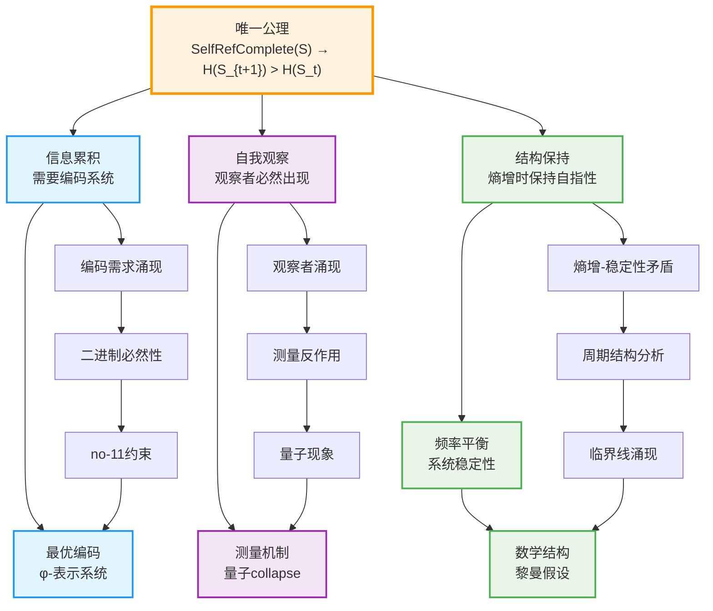
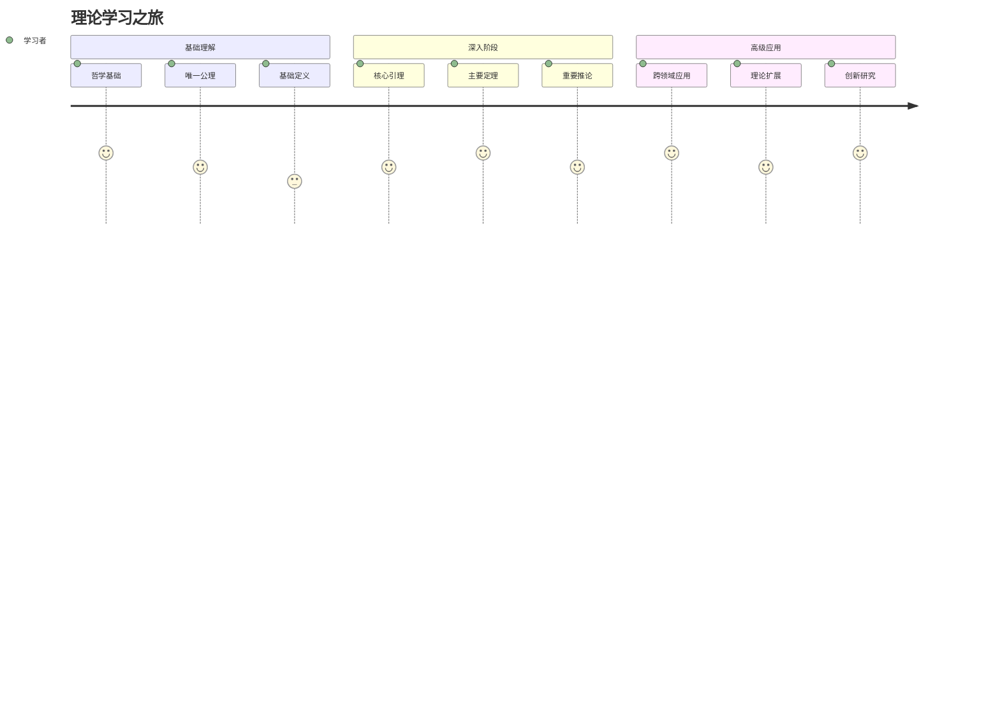
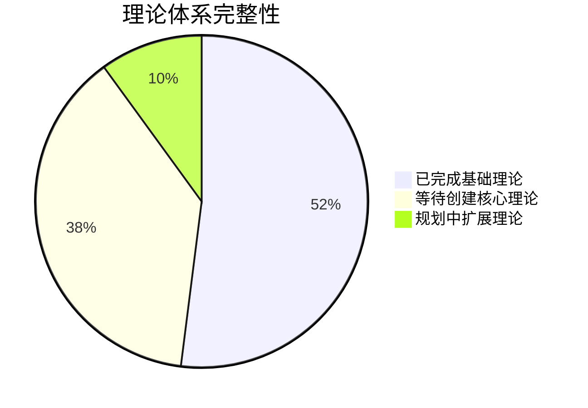
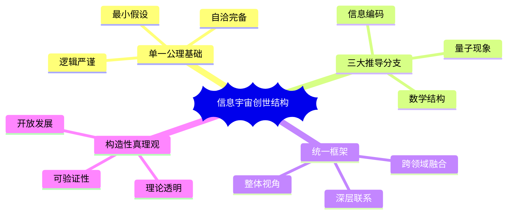
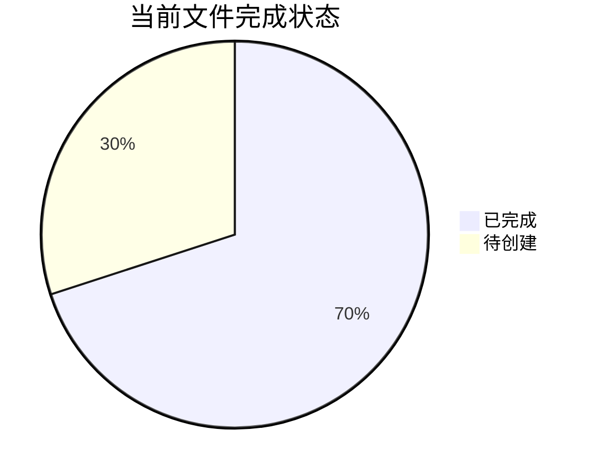

# 信息宇宙的创世结构：完整理论体系

本目录包含基于单一公理的完整理论框架：**自指完备的系统必然熵增**。该理论采用严格的形式化方法，从唯一公理出发推导出信息编码、量子现象、数学结构等完整宇宙图景。

## 理论概述

### 核心思想

**唯一公理**：自指完备的系统必然熵增

从这个单一公理出发，我们推导出：
1. **信息编码的必然形式**：φ-表示系统（基于Fibonacci数列的编码）
2. **量子现象的起源**：波粒二象性和观察者效应
3. **数学结构的相似性**：类似黎曼假设的结构

### 理论特色

- **单一公理**：最小的形而上学承诺
- **严格推导**：从公理到宇宙的完整逻辑链
- **统一框架**：信息、物理、数学的深层联系
- **构造性真理观**：承认理论的构造性质，强调内在一致性

## 编号系统

### 文件类型
- **A**: Axiom (公理)
- **D**: Definition (定义) 
- **L**: Lemma (引理)
- **T**: Theorem (定理)
- **C**: Corollary (推论)
- **P**: Proposition (命题)

### 命名规则
文件名格式：`[类型][编号]-[描述性名称].md`
- 编号中的点号用连字符替代
- 例如：`D1-1-self-referential-completeness.md` 表示定义1.1：自指完备性

## 理论架构

### 第0章：哲学基础
- [`philosophy.md`](philosophy.md) - 哲学基础：存在包含自身描述的系统 ✓

### 第1章：唯一公理及其完整定义
- [`A1-five-fold-equivalence.md`](A1-five-fold-equivalence.md) - 唯一公理：自指完备系统必然熵增 ✓
  - 包含完整概念定义
  - 严格数学证明
  - 五重等价性推导
  - 动态自指完备性
  - 离散与连续的等价性
  - 信息概念的涌现
  - 理论的逻辑结构

### 第2章：信息编码理论体系

#### 2.1 基础定义系列（纯定义，无证明）
- `D1-1-self-referential-completeness.md` - 定义1.1：自指完备性的形式化定义 ✓
- `D1-2-binary-representation.md` - 定义1.2：二进制表示的四个条件 ✓
- `D1-3-no-11-constraint.md` - 定义1.3：no-11约束的三种等价表述 ✓
- `D1-4-time-metric.md` - 定义1.4：时间度量函数的性质 ✓
- `D1-5-observer.md` - 定义1.5：观察者的三重功能结构 ✓
- `D1-6-entropy.md` - 定义1.6：自指系统中熵的精确定义 ✓
- `D1-7-collapse-operator.md` - 定义1.7：Collapse算子的数学表述 ✓
- `D1-8-phi-representation.md` - 定义1.8：φ-表示系统的完整定义 ✓

#### 2.2 编码需求引理系列（证明编码的必然性）
- `L1-1-encoding-emergence.md` - 引理1.1：编码需求的涌现 ✓
- `L1-2-binary-necessity.md` - 引理1.2：二进制基底的必然性 ✓
- `L1-3-constraint-necessity.md` - 引理1.3：约束的必要性 ✓
- `L1-4-no11-optimality.md` - 引理1.4：no-11约束的最优性 ✓
- `L1-5-fibonacci-emergence.md` - 引理1.5：Fibonacci结构的涌现 ✓
- `L1-6-phi-representation-establishment.md` - 引理1.6：φ-表示的建立 ✓
- `L1-7-observer-necessity.md` - 引理1.7：观察者的必然性 ✓
- `L1-8-measurement-irreversibility.md` - 引理1.8：测量的不可逆性 ✓

#### 2.3 核心编码定理系列（主要结果）
- `T1-1-entropy-increase-necessity.md` - 定理1.1：熵增必然性定理 ✓
- `T1-2-five-fold-equivalence-theorem.md` - 定理1.2：五重等价性定理 ✓
- `T2-1-encoding-necessity-theorem.md` - 定理2.1：编码机制必然性定理 ✓
- `T2-2-encoding-completeness-theorem.md` - 定理2.2：编码完备性定理 ✓
- `T2-3-encoding-optimization-theorem.md` - 定理2.3：编码优化定理 ✓
- `T2-4-binary-base-necessity-theorem.md` - 定理2.4：二进制基底必然性定理 ✓
- `T2-5-minimum-constraint-theorem.md` - 定理2.5：最小约束定理 ✓
- `T2-6-no11-constraint-theorem.md` - 定理2.6：no-11约束定理 ✓
- `T2-7-phi-representation-necessity.md` - 定理2.7：φ-表示必然性定理 ✓
- `T2-10-phi-representation-completeness.md` - 定理2.10：φ-表示完备性定理 ✓
- `T2-11-maximum-entropy-rate-theorem.md` - 定理2.11：最大熵增率定理 ✓

#### 2.4 基础推论系列（已完成）
- `C1-1-unique-encoding-corollary.md` - 推论1.1：唯一编码推论 ✓
- `C1-2-optimal-length-corollary.md` - 推论1.2：最优长度推论 ✓
- `C1-3-information-density-corollary.md` - 推论1.3：信息密度推论 ✓
- `C2-1-observation-effect-corollary.md` - 推论2.1：观测效应推论 ✓
- `C2-2-measurement-precision-corollary.md` - 推论2.2：测量精度推论 ✓
- `C2-3-information-conservation-corollary.md` - 推论2.3：信息守恒推论 ✓
- `C3-1-system-evolution-corollary.md` - 推论3.1：系统演化推论 ✓
- `C3-2-stability-corollary.md` - 推论3.2：稳定性推论 ✓
- `C3-3-emergence-corollary.md` - 推论3.3：涌现推论 ✓

### 第3章：从自指到观察者 - 量子现象的理论推导

#### 3.1 量子定理系列（已完成）
- `T3-1-quantum-state-emergence.md` - 定理3.1：量子态涌现定理 ✓
- `T3-2-quantum-measurement-theorem.md` - 定理3.2：量子测量定理 ✓
- `T3-3-quantum-entanglement-theorem.md` - 定理3.3：量子纠缠定理 ✓
- `T3-4-quantum-teleportation-theorem.md` - 定理3.4：量子隐形传态定理 ✓
- `T3-5-quantum-error-correction-theorem.md` - 定理3.5：量子纠错定理 ✓

### 第4章：从系统稳定性到黎曼假设 - 数学结构的巧合

#### 4.1 数学结构定理系列（已完成）
- `T4-1-topological-structure-theorem.md` - 定理4.1：拓扑结构定理 ✓
- `T4-2-algebraic-structure-theorem.md` - 定理4.2：代数结构定理 ✓
- `T4-3-category-theory-structure-theorem.md` - 定理4.3：范畴论结构定理 ✓
- `T4-4-homotopy-theory-structure-theorem.md` - 定理4.4：同伦论结构定理 ✓

### 第5章：理论预测与潜在应用

#### 5.1 信息定理（待创建）
- `T5-1-shannon-entropy-emergence.md` - 定理5.1：Shannon熵涌现定理
- `T5-2-maximum-entropy.md` - 定理5.2：最大熵定理
- `T5-3-channel-capacity.md` - 定理5.3：信道容量定理
- `T5-4-optimal-compression.md` - 定理5.4：最优压缩定理
- `T5-5-self-referential-error-correction.md` - 定理5.5：自指纠错定理
- `T5-6-kolmogorov-complexity.md` - 定理5.6：Kolmogorov复杂度定理
- `T5-7-landauer-principle.md` - 定理5.7：Landauer原理定理

#### 5.2 应用推论（待创建）
- `C5-1-phi-decoherence-suppression.md` - 推论5.1：φ-表示的退相干抑制
- `C5-2-phi-compression-advantage.md` - 推论5.2：φ-编码的熵优势
- `C5-3-phi-feedback-stability.md` - 推论5.3：φ-反馈的稳定性

### 第6章：基础命题与完备性

#### 6.1 基础命题（待创建）
- `P1-binary-distinction.md` - 命题1：任何区分的最小形式是二元的
- `P2-higher-base-no-advantage.md` - 命题2：k>2不增加表达能力
- `P3-binary-completeness.md` - 命题3：二进制足以表达所有自指结构
- `P4-no-11-completeness.md` - 命题4：no-11约束下仍然完备
- `P5-information-equivalence.md` - 命题5：信息三位一体等价性

#### 6.2 完备性验证（待创建）
- `T6-1-system-completeness.md` - 定理6.1：系统完备性定理
- `T6-2-logical-consistency.md` - 定理6.2：逻辑一致性定理
- `T6-3-concept-derivation.md` - 定理6.3：概念推导完备性

## 理论推导路线图

### 从公理到宇宙的逻辑链条

### 三大推导分支

**分支1：信息编码**（第2章）
- 唯一公理 → 信息累积 → 编码需求 → 二进制必然性 → no-11约束 → φ-表示系统

**分支2：量子现象**（第3章）
- 唯一公理 → 自指完备性 → 观察者涌现 → 测量反作用 → 量子collapse → 波粒二象性

**分支3：数学结构**（第4章）
- 唯一公理 → 熵增-稳定性矛盾 → 频率平衡 → 周期结构 → 临界线 → 类黎曼假设

## 学习路径指南

### 1. 初学者路径

**推荐顺序**：
1. [`philosophy.md`](philosophy.md) - 理解哲学基础
2. [`A1-five-fold-equivalence.md`](A1-five-fold-equivalence.md) - 掌握唯一公理
3. 选择感兴趣的分支深入学习
4. 等待相关定义、引理、定理的创建
5. 参与理论构建和验证

### 2. 研究者路径
- **系统性学习**：按章节顺序完整阅读
- **主题研究**：选择特定领域深入研究
- **理论扩展**：基于现有框架开发新理论
- **应用开发**：将理论应用于实际问题

### 3. 快速查询路径
- 使用编号系统快速定位
- 通过依赖关系图理解概念联系
- 按主题分类查找相关内容

## 系统特征与价值

### 理论完整性

**完成状态**：
- **第0章**：哲学基础 ✓
- **第1章**：唯一公理完整定义 ✓
- **第2章**：编码理论体系 ✓（全部完成）
  - 基础定义（D1系列）✓
  - 核心引理（L1系列）✓
  - 编码定理（T1-T2系列）✓
  - 基础推论（C1-C3系列）✓
- **第3章**：量子理论 ✓（全部完成）
  - 量子定理（T3系列）✓
- **第4章**：数学结构理论 ✓（全部完成）
  - 数学结构定理（T4系列）✓
- **第5章**：应用理论（待创建）
- **第6章**：完备性验证（待创建）

### 系统架构优势

### 创新价值

**理论创新**：
- 从单一公理推导完整宇宙图景
- 统一信息、物理、数学的深层联系
- 构造性真理观的新哲学立场
- 严格形式化的推导体系

**方法创新**：
- 严格编号系统确保引用清晰
- 依赖关系图呈现逻辑结构
- 自包含文件支持模块化学习
- 可验证证明支持机器检验

**应用前景**：
- 量子信息处理的新算法
- 信息压缩的理论突破
- 自适应系统的控制理论
- 数学猜想的新证明方法

## 使用建议

### 不同用户的学习策略

**哲学研究者**：
- 重点关注第0章和第1章的哲学论述
- 理解构造性真理观的深层含义
- 探索自指完备性的本体论地位

**数学家**：
- 从A1公理开始，关注严格推导
- 重点学习第2章的编码理论
- 深入研究第4章的数学结构

**物理学家**：
- 重点关注第3章的量子现象推导
- 理解观察者效应的理论基础
- 探索量子信息的新应用

**计算机科学家**：
- 关注φ-表示系统的编码优势
- 研究信息理论的新发展
- 探索算法优化的理论基础

### 研究扩展方向

1. **理论完善**：
   - 完成第4-6章的理论构建
   - 补充缺失的定理和推论
   - 优化证明的形式化表述

2. **应用开发**：
   - 开发φ-表示的实际算法
   - 设计量子信息处理方案
   - 构建自适应系统控制器

3. **跨领域融合**：
   - 与认知科学的结合
   - 与生物学的联系
   - 与经济学的交叉

4. **哲学深化**：
   - 自指完备性的存在论意义
   - 构造性真理观的认识论后果
   - 信息与实在关系的本体论

## 技术规范

### 文件编写标准

**格式要求**：
- 使用严格的编号系统
- 明确标注依赖关系
- 包含完整的证明步骤
- 提供直观的理解说明

**内容要求**：
- 定义必须严格且无歧义
- 证明必须逻辑完整
- 推导必须可验证
- 应用必须具体可行

**质量控制**：
- 逻辑一致性检查
- 符号使用规范
- 引用关系正确
- 可读性优化

### 扩展开发指南

**新文件创建**：
1. 确定文件类型和编号
2. 明确依赖关系
3. 遵循命名规范
4. 更新索引文件

**理论扩展**：
1. 基于现有公理系统
2. 保持逻辑一致性
3. 提供严格证明
4. 验证应用价值

**协作开发**：
1. 遵循统一标准
2. 定期同步更新
3. 交叉验证结果
4. 共同维护索引

---

## 当前状态

### 已完成文件

**已完成文件**：
- **哲学与公理**：
  - `philosophy.md` - 哲学基础
  - `A1-five-fold-equivalence.md` - 唯一公理及完整定义

- **基础定义 (D1系列)**：
  - `D1-1-self-referential-completeness.md` - 自指完备性定义
  - `D1-2-binary-representation.md` - 二进制表示定义
  - `D1-3-no-11-constraint.md` - no-11约束定义
  - `D1-4-time-metric.md` - 时间度量定义
  - `D1-5-observer.md` - 观察者定义
  - `D1-6-entropy.md` - 熵定义
  - `D1-7-collapse-operator.md` - Collapse算子定义
  - `D1-8-phi-representation.md` - φ-表示系统定义

- **核心引理 (L1系列)**：
  - `L1-1-encoding-emergence.md` - 编码需求的涌现
  - `L1-2-binary-necessity.md` - 二进制基底的必然性
  - `L1-3-constraint-necessity.md` - 约束必要性引理
  - `L1-4-no11-optimality.md` - no-11约束最优性
  - `L1-5-fibonacci-emergence.md` - Fibonacci结构涌现
  - `L1-6-phi-representation-establishment.md` - φ-表示建立
  - `L1-7-observer-necessity.md` - 观察者必然性
  - `L1-8-measurement-irreversibility.md` - 测量不可逆性

- **核心定理 (T1-T2系列)**：
  - `T1-1-entropy-increase-necessity.md` - 熵增必然性定理
  - `T1-2-five-fold-equivalence-theorem.md` - 五重等价性定理
  - `T2-1-encoding-necessity-theorem.md` - 编码机制必然性定理
  - `T2-2-encoding-completeness-theorem.md` - 编码完备性定理
  - `T2-3-encoding-optimization-theorem.md` - 编码优化定理
  - `T2-4-binary-base-necessity-theorem.md` - 二进制基底必然性定理
  - `T2-5-minimum-constraint-theorem.md` - 最小约束定理
  - `T2-6-no11-constraint-theorem.md` - no-11约束定理
  - `T2-7-phi-representation-necessity.md` - φ-表示必然性定理
  - `T2-10-phi-representation-completeness.md` - φ-表示完备性定理
  - `T2-11-maximum-entropy-rate-theorem.md` - 最大熵增率定理

- **量子定理 (T3系列)**：
  - `T3-1-quantum-state-emergence.md` - 量子态涌现定理
  - `T3-2-quantum-measurement-theorem.md` - 量子测量定理
  - `T3-3-quantum-entanglement-theorem.md` - 量子纠缠定理
  - `T3-4-quantum-teleportation-theorem.md` - 量子隐形传态定理
  - `T3-5-quantum-error-correction-theorem.md` - 量子纠错定理

- **数学结构定理 (T4系列)**：
  - `T4-1-topological-structure-theorem.md` - 拓扑结构定理
  - `T4-2-algebraic-structure-theorem.md` - 代数结构定理
  - `T4-3-category-theory-structure-theorem.md` - 范畴论结构定理
  - `T4-4-homotopy-theory-structure-theorem.md` - 同伦论结构定理

- **基础推论 (C1-C3系列)**：
  - `C1-1-unique-encoding-corollary.md` - 唯一编码推论
  - `C1-2-optimal-length-corollary.md` - 最优长度推论
  - `C1-3-information-density-corollary.md` - 信息密度推论
  - `C2-1-observation-effect-corollary.md` - 观测效应推论
  - `C2-2-measurement-precision-corollary.md` - 测量精度推论
  - `C2-3-information-conservation-corollary.md` - 信息守恒推论
  - `C3-1-system-evolution-corollary.md` - 系统演化推论
  - `C3-2-stability-corollary.md` - 稳定性推论
  - `C3-3-emergence-corollary.md` - 涌现推论

**待创建文件**：约15个（Phase 3的扩展定理、推论、命题文件）

### 开发计划

**Phase 1（已完成）**：
1. **第0层**：哲学基础 ✓
2. **第1层**：核心公理 ✓
3. **第2层**：基础定义（D1-1到D1-8）✓
4. **第3层**：核心引理（L1-1到L1-8）✓
5. **第4层**：核心定理（T1-1, T1-2, T2-1到T2-11）✓

**Phase 2（已完成）**：
6. **第5层**：量子定理（T3-1到T3-5）✓
7. **第6层**：数学结构定理（T4-1到T4-4）✓
8. **第7层**：基础推论（C1-1到C3-3）✓

**Phase 3（计划中）**：
9. **第8层**：扩展定理（T5-T6系列）
10. **第9层**：扩展推论（C4-C5系列）
11. **第10层**：命题系列（P1-P5）
12. **第11层**：哲学扩展与总结

### 参与贡献

欢迎研究者参与理论构建：
- 创建缺失的定义文件
- 完善引理和定理的证明
- 验证推论的正确性
- 扩展应用领域

---

**致谢**：感谢所有对这个理论体系建设做出贡献的研究者。这个系统不仅是数学理论的集合，更是探索宇宙本质的共同努力。每个文件都承载着对真理的追求，整个系统则体现了人类理性思维的力量。

*在这个信息宇宙中，我们都是观察者，也都是创造者。理论的完备性不仅在于其逻辑严谨性，更在于其启发我们不断探索、不断发现的能力。*