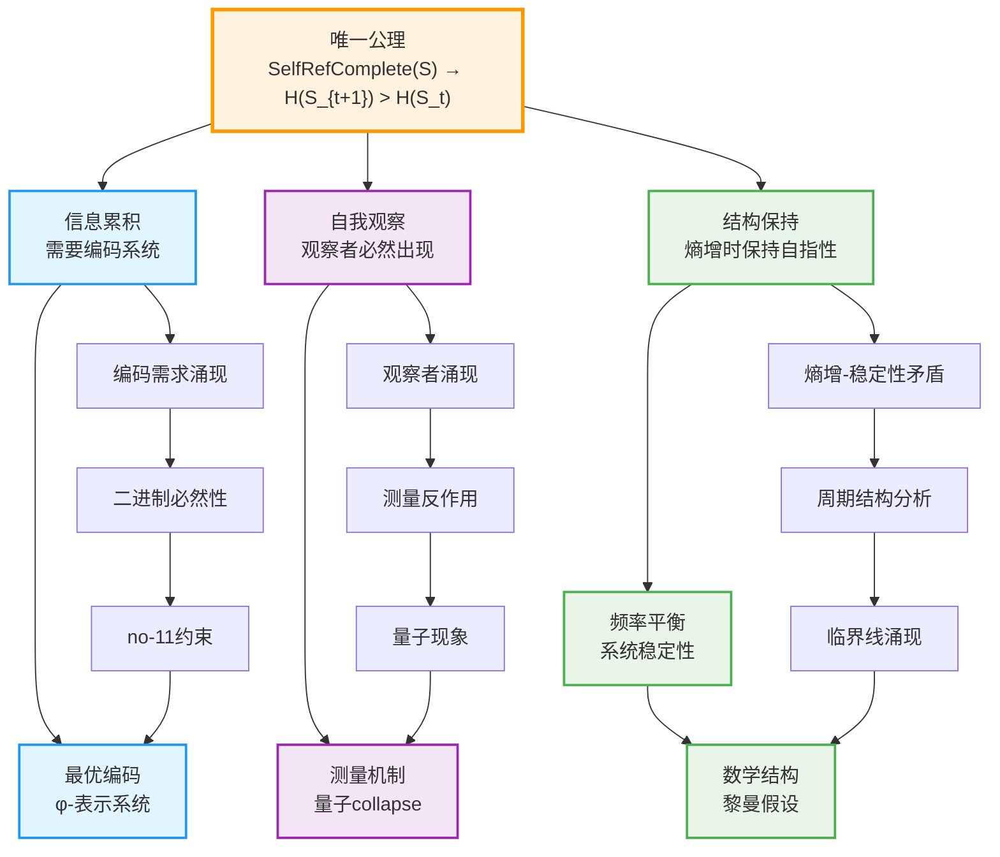
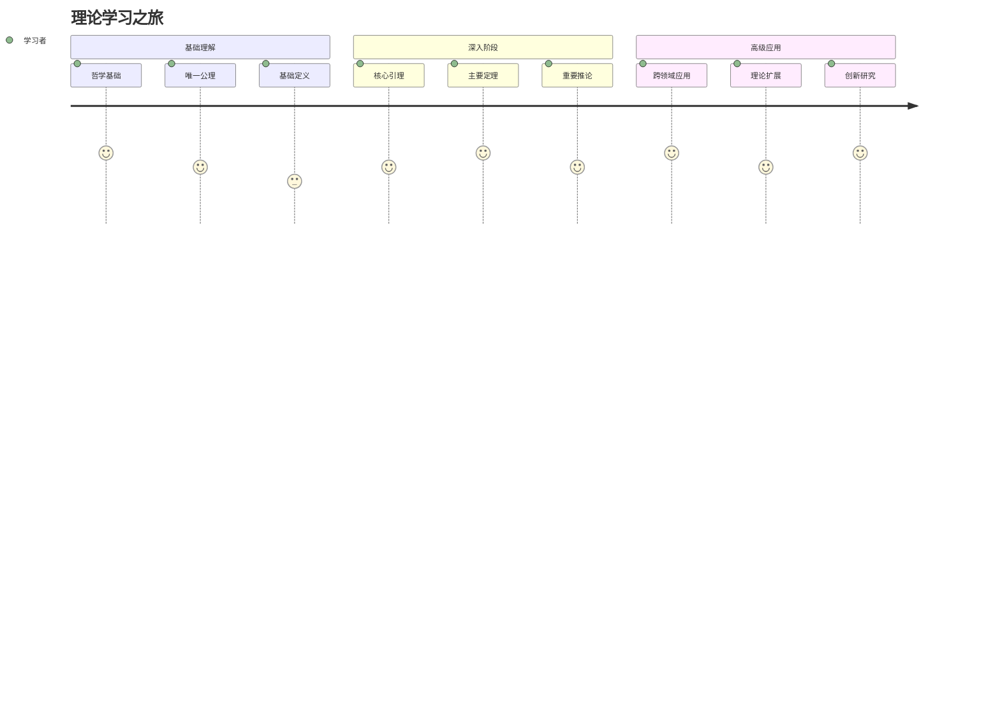
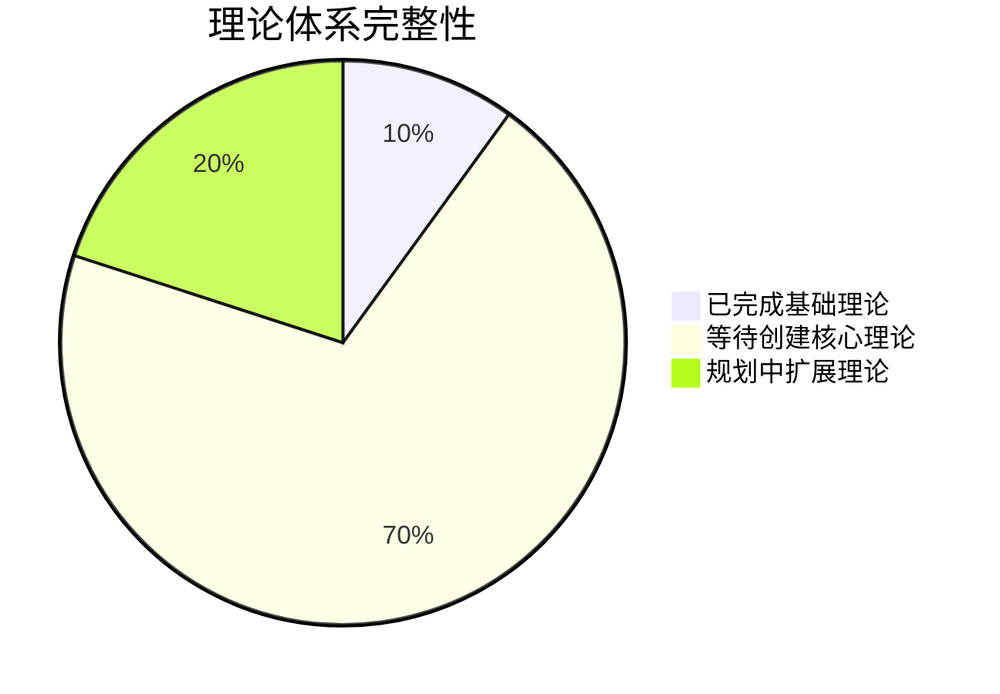
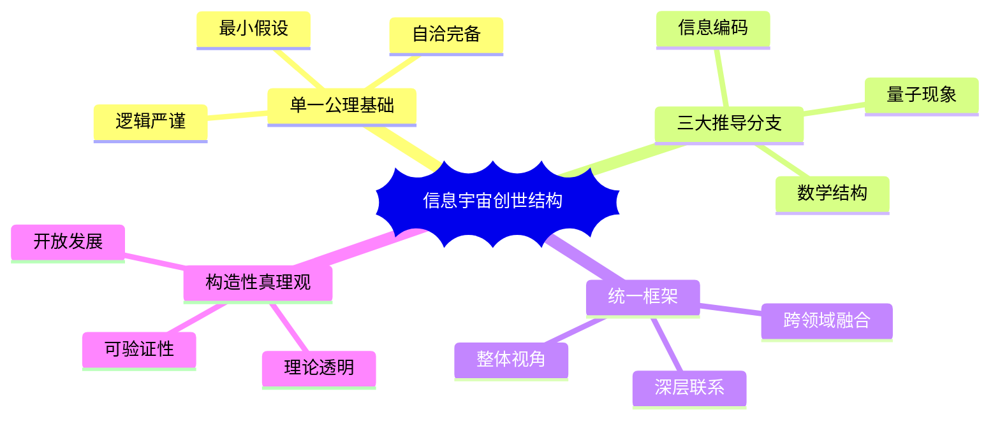
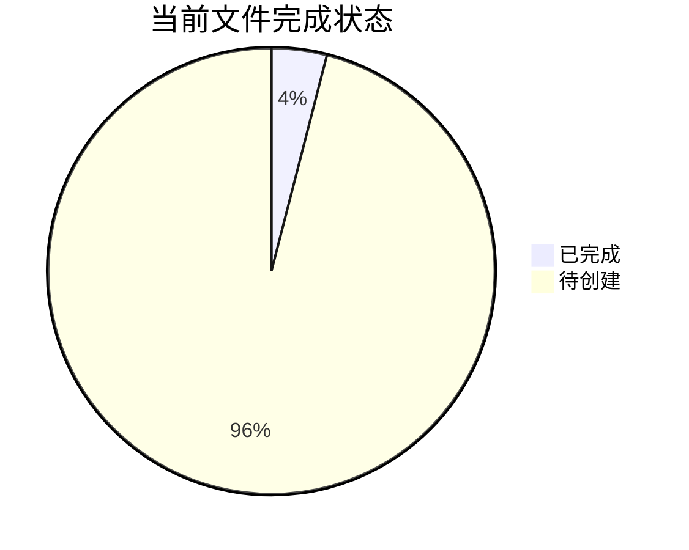

# 信息宇宙的创世结构：完整理论体系

本目录包含基于单一公理的完整理论框架：**自指完备的系统必然熵增**。该理论采用严格的形式化方法，从唯一公理出发推导出信息编码、量子现象、数学结构等完整宇宙图景。

## 理论概述

### 核心思想

**唯一公理**：自指完备的系统必然熵增

从这个单一公理出发，我们推导出：
1. **信息编码的必然形式**：φ-表示系统（基于Fibonacci数列的编码）
2. **量子现象的起源**：波粒二象性和观察者效应
3. **数学结构的相似性**：类似黎曼假设的结构

### 理论特色

- **单一公理**：最小的形而上学承诺
- **严格推导**：从公理到宇宙的完整逻辑链
- **统一框架**：信息、物理、数学的深层联系
- **构造性真理观**：承认理论的构造性质，强调内在一致性

## 编号系统

### 文件类型
- **A**: Axiom (公理)
- **D**: Definition (定义) 
- **L**: Lemma (引理)
- **T**: Theorem (定理)
- **C**: Corollary (推论)
- **P**: Proposition (命题)

### 命名规则
文件名格式：`[类型][编号]-[描述性名称].md`
- 编号中的点号用连字符替代
- 例如：`D1-1-self-referential-completeness.md` 表示定义1.1：自指完备性

## 理论架构

### 第0章：哲学基础
- [`philosophy.md`](philosophy.md) - 哲学基础：存在包含自身描述的系统

### 第1章：唯一公理及其完整定义
- [`A1-five-fold-equivalence.md`](A1-five-fold-equivalence.md) - 唯一公理：自指完备系统必然熵增
  - 包含完整概念定义
  - 严格数学证明
  - 五重等价性推导
  - 动态自指完备性
  - 离散与连续的等价性
  - 信息概念的涌现
  - 理论的逻辑结构

### 第2章：从熵增到φ-表示系统 - 信息编码的必然形式

#### 2.1 基础定义（待创建）
- `D1-1-self-referential-completeness.md` - 定义1.1：自指完备性
- `D1-2-binary-representation.md` - 定义1.2：二进制表示
- `D1-3-no-11-constraint.md` - 定义1.3：no-11约束
- `D1-4-time-metric.md` - 定义1.4：时间度量
- `D1-5-observer.md` - 定义1.5：观察者
- `D1-6-entropy.md` - 定义1.6：熵
- `D1-7-collapse-operator.md` - 定义1.7：Collapse算子
- `D1-8-phi-representation.md` - 定义1.8：φ-表示

#### 2.2 核心引理（待创建）
- `L1-1-binary-uniqueness.md` - 引理1.1：二进制编码的唯一性
- `L1-2-encoding-efficiency.md` - 引理1.2：编码效率
- `L1-3-entropy-monotonicity.md` - 引理1.3：熵的单调性
- `L1-4-time-emergence.md` - 引理1.4：时间涌现
- `L1-5-observer-necessity.md` - 引理1.5：观察者的必然性
- `L1-6-measurement-irreversibility.md` - 引理1.6：测量的不可逆性
- `L1-7-phi-optimality.md` - 引理1.7：φ-表示的最优性
- `L1-8-recursion-non-termination.md` - 引理1.8：递归的不可终止性

#### 2.3 主要定理（待创建）
- `T2-1-binary-necessity.md` - 定理2.1：二进制必然性定理
- `T2-2-no-11-constraint-theorem.md` - 定理2.2：no-11约束定理
- `T2-3-phi-encoding-theorem.md` - 定理2.3：φ-编码定理
- `T2-4-encoding-completeness.md` - 定理2.4：编码完备性定理

#### 2.4 重要推论（待创建）
- `C1-1-binary-isomorphism.md` - 推论1.1：二进制同构
- `C1-2-higher-base-degeneracy.md` - 推论1.2：高进制退化
- `C1-3-binary-nature-of-existence.md` - 推论1.3：存在的二进制本质
- `C2-1-fibonacci-emergence.md` - 推论2.1：Fibonacci数列涌现
- `C2-2-golden-ratio.md` - 推论2.2：黄金比例

### 第3章：从自指到观察者 - 量子现象的理论推导

#### 3.1 派生定义（待创建）
- `D2-1-recursive-level.md` - 定义2.1：递归层次
- `D2-2-information-increment.md` - 定义2.2：信息增量
- `D2-3-measurement-backaction.md` - 定义2.3：测量反作用
- `D3-1-quantum-state.md` - 定义3.1：量子状态
- `D3-2-collapse-mechanism.md` - 定义3.2：collapse机制
- `D3-3-wave-particle-duality.md` - 定义3.3：波粒二象性

#### 3.2 量子定理（待创建）
- `T3-1-entropy-increase.md` - 定理3.1：熵增定理
- `T3-2-entropy-lower-bound.md` - 定理3.2：熵增下界定理
- `T3-3-observer-emergence.md` - 定理3.3：观察者涌现定理
- `T3-4-quantum-measurement.md` - 定理3.4：量子测量定理
- `T3-5-wave-collapse.md` - 定理3.5：波函数坍缩定理

#### 3.3 应用推论（待创建）
- `C3-1-consciousness-emergence.md` - 推论3.1：意识涌现
- `C3-2-quantum-decoherence.md` - 推论3.2：量子退相干
- `C3-3-measurement-problem.md` - 推论3.3：测量问题解决

### 第4章：从系统稳定性到黎曼假设 - 数学结构的巧合

#### 4.1 稳定性定理（待创建）
- `T4-1-stability-entropy-contradiction.md` - 定理4.1：稳定性-熵增矛盾
- `T4-2-frequency-analysis.md` - 定理4.2：频率分析定理
- `T4-3-periodic-structure.md` - 定理4.3：周期结构定理
- `T4-4-critical-line.md` - 定理4.4：临界线定理

#### 4.2 数学结构推论（待创建）
- `C4-1-zeta-function-emergence.md` - 推论4.1：zeta函数涌现
- `C4-2-riemann-hypothesis-analogy.md` - 推论4.2：黎曼假设类比
- `C4-3-critical-strip.md` - 推论4.3：临界带性质

### 第5章：理论预测与潜在应用

#### 5.1 信息定理（待创建）
- `T5-1-shannon-entropy-emergence.md` - 定理5.1：Shannon熵涌现定理
- `T5-2-maximum-entropy.md` - 定理5.2：最大熵定理
- `T5-3-channel-capacity.md` - 定理5.3：信道容量定理
- `T5-4-optimal-compression.md` - 定理5.4：最优压缩定理
- `T5-5-self-referential-error-correction.md` - 定理5.5：自指纠错定理
- `T5-6-kolmogorov-complexity.md` - 定理5.6：Kolmogorov复杂度定理
- `T5-7-landauer-principle.md` - 定理5.7：Landauer原理定理

#### 5.2 应用推论（待创建）
- `C5-1-phi-decoherence-suppression.md` - 推论5.1：φ-表示的退相干抑制
- `C5-2-phi-compression-advantage.md` - 推论5.2：φ-编码的熵优势
- `C5-3-phi-feedback-stability.md` - 推论5.3：φ-反馈的稳定性

### 第6章：基础命题与完备性

#### 6.1 基础命题（待创建）
- `P1-binary-distinction.md` - 命题1：任何区分的最小形式是二元的
- `P2-higher-base-no-advantage.md` - 命题2：k>2不增加表达能力
- `P3-binary-completeness.md` - 命题3：二进制足以表达所有自指结构
- `P4-no-11-completeness.md` - 命题4：no-11约束下仍然完备
- `P5-information-equivalence.md` - 命题5：信息三位一体等价性

#### 6.2 完备性验证（待创建）
- `T6-1-system-completeness.md` - 定理6.1：系统完备性定理
- `T6-2-logical-consistency.md` - 定理6.2：逻辑一致性定理
- `T6-3-concept-derivation.md` - 定理6.3：概念推导完备性

## 理论推导路线图

### 从公理到宇宙的逻辑链条

### 三大推导分支

**分支1：信息编码**（第2章）
- 唯一公理 → 信息累积 → 编码需求 → 二进制必然性 → no-11约束 → φ-表示系统

**分支2：量子现象**（第3章）
- 唯一公理 → 自指完备性 → 观察者涌现 → 测量反作用 → 量子collapse → 波粒二象性

**分支3：数学结构**（第4章）
- 唯一公理 → 熵增-稳定性矛盾 → 频率平衡 → 周期结构 → 临界线 → 类黎曼假设

## 学习路径指南

### 1. 初学者路径

**推荐顺序**：
1. [`philosophy.md`](philosophy.md) - 理解哲学基础
2. [`A1-five-fold-equivalence.md`](A1-five-fold-equivalence.md) - 掌握唯一公理
3. 选择感兴趣的分支深入学习
4. 等待相关定义、引理、定理的创建
5. 参与理论构建和验证

### 2. 研究者路径
- **系统性学习**：按章节顺序完整阅读
- **主题研究**：选择特定领域深入研究
- **理论扩展**：基于现有框架开发新理论
- **应用开发**：将理论应用于实际问题

### 3. 快速查询路径
- 使用编号系统快速定位
- 通过依赖关系图理解概念联系
- 按主题分类查找相关内容

## 系统特征与价值

### 理论完整性

**完成状态**：
- **第0章**：哲学基础 ✓
- **第1章**：唯一公理完整定义 ✓
- **第2章**：基础定义和核心引理（待创建）
- **第3章**：量子理论（待创建）
- **第4章**：数学结构理论（待创建）
- **第5章**：应用理论（待创建）
- **第6章**：完备性验证（待创建）

### 系统架构优势

### 创新价值

**理论创新**：
- 从单一公理推导完整宇宙图景
- 统一信息、物理、数学的深层联系
- 构造性真理观的新哲学立场
- 严格形式化的推导体系

**方法创新**：
- 严格编号系统确保引用清晰
- 依赖关系图呈现逻辑结构
- 自包含文件支持模块化学习
- 可验证证明支持机器检验

**应用前景**：
- 量子信息处理的新算法
- 信息压缩的理论突破
- 自适应系统的控制理论
- 数学猜想的新证明方法

## 使用建议

### 不同用户的学习策略

**哲学研究者**：
- 重点关注第0章和第1章的哲学论述
- 理解构造性真理观的深层含义
- 探索自指完备性的本体论地位

**数学家**：
- 从A1公理开始，关注严格推导
- 重点学习第2章的编码理论
- 深入研究第4章的数学结构

**物理学家**：
- 重点关注第3章的量子现象推导
- 理解观察者效应的理论基础
- 探索量子信息的新应用

**计算机科学家**：
- 关注φ-表示系统的编码优势
- 研究信息理论的新发展
- 探索算法优化的理论基础

### 研究扩展方向

1. **理论完善**：
   - 完成第4-6章的理论构建
   - 补充缺失的定理和推论
   - 优化证明的形式化表述

2. **应用开发**：
   - 开发φ-表示的实际算法
   - 设计量子信息处理方案
   - 构建自适应系统控制器

3. **跨领域融合**：
   - 与认知科学的结合
   - 与生物学的联系
   - 与经济学的交叉

4. **哲学深化**：
   - 自指完备性的存在论意义
   - 构造性真理观的认识论后果
   - 信息与实在关系的本体论

## 技术规范

### 文件编写标准

**格式要求**：
- 使用严格的编号系统
- 明确标注依赖关系
- 包含完整的证明步骤
- 提供直观的理解说明

**内容要求**：
- 定义必须严格且无歧义
- 证明必须逻辑完整
- 推导必须可验证
- 应用必须具体可行

**质量控制**：
- 逻辑一致性检查
- 符号使用规范
- 引用关系正确
- 可读性优化

### 扩展开发指南

**新文件创建**：
1. 确定文件类型和编号
2. 明确依赖关系
3. 遵循命名规范
4. 更新索引文件

**理论扩展**：
1. 基于现有公理系统
2. 保持逻辑一致性
3. 提供严格证明
4. 验证应用价值

**协作开发**：
1. 遵循统一标准
2. 定期同步更新
3. 交叉验证结果
4. 共同维护索引

---

## 当前状态

### 已完成文件

**实际完成**：
- `philosophy.md` - 哲学基础
- `A1-five-fold-equivalence.md` - 唯一公理及完整定义

**待创建文件**：约48个（包括所有定义、引理、定理、推论、命题文件）

### 开发计划

根据用户指定的10层构建计划：

1. **第1层**：哲学基础 ✓
2. **第2层**：核心公理 ✓
3. **第3层**：基础定义（D1-1到D1-8）
4. **第4层**：派生定义（D2-1到D2-3）
5. **第5层**：基础引理（L1-1到L1-8）
6. **第6层**：核心定理（T1-1, T2-1, T2-2）
7. **第7层**：动力学定理（T3-1, T3-2）
8. **第8层**：涌现定理（T4-1）
9. **第9层**：推论验证（C1-1到C3-1）
10. **第10层**：命题完整性（P1并扩展）

### 参与贡献

欢迎研究者参与理论构建：
- 创建缺失的定义文件
- 完善引理和定理的证明
- 验证推论的正确性
- 扩展应用领域

---

**致谢**：感谢所有对这个理论体系建设做出贡献的研究者。这个系统不仅是数学理论的集合，更是探索宇宙本质的共同努力。每个文件都承载着对真理的追求，整个系统则体现了人类理性思维的力量。

*在这个信息宇宙中，我们都是观察者，也都是创造者。理论的完备性不仅在于其逻辑严谨性，更在于其启发我们不断探索、不断发现的能力。*