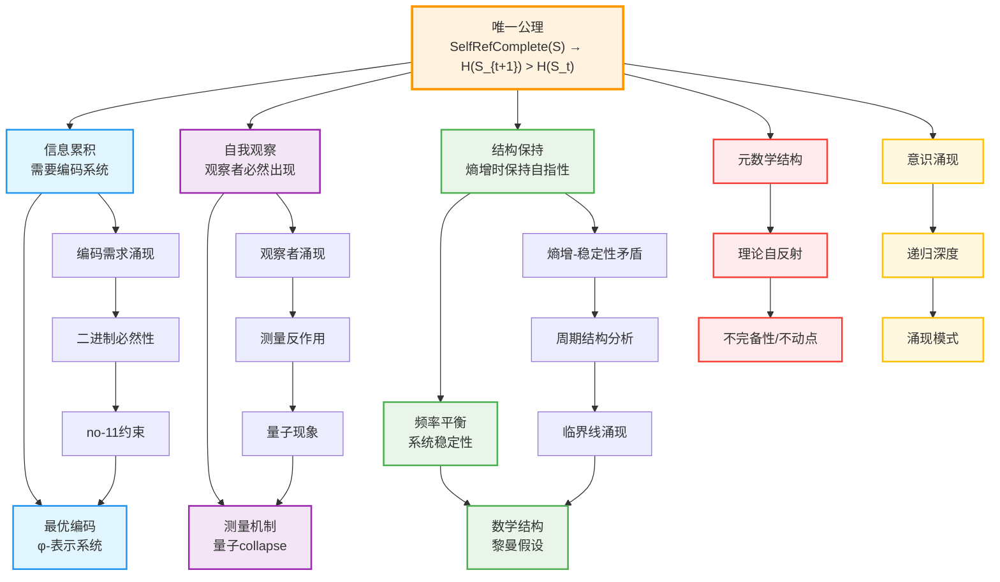
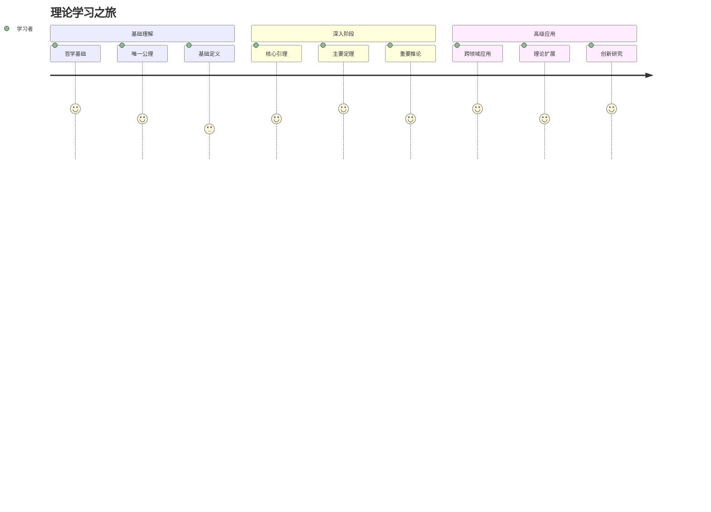
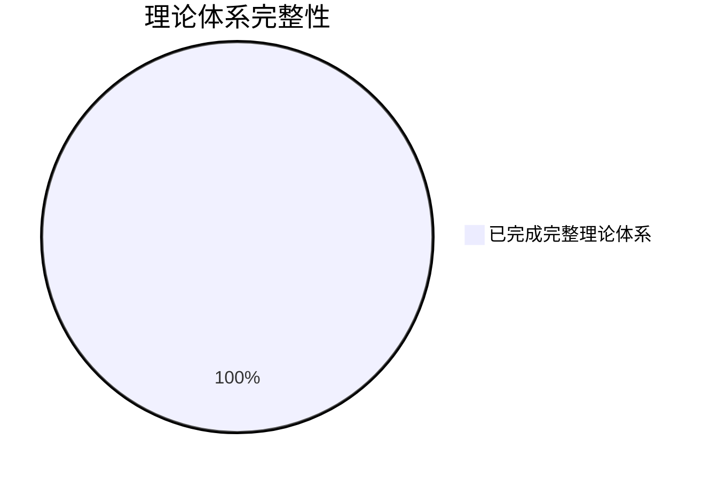
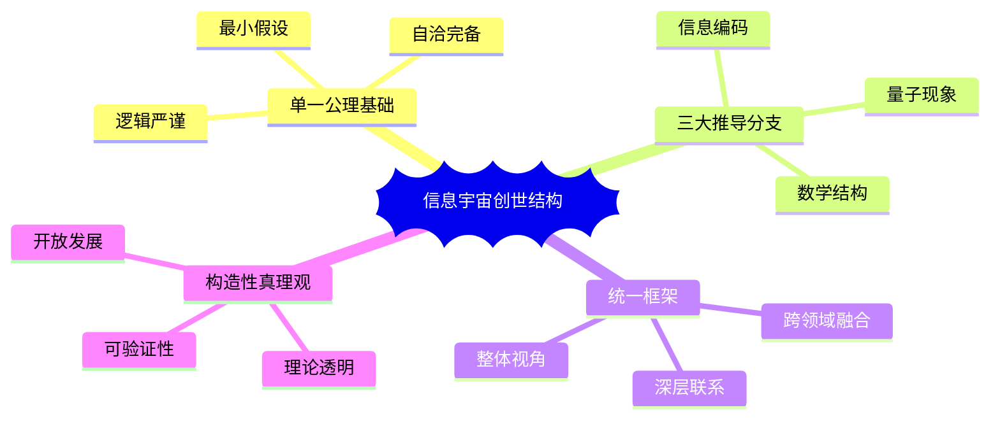

# 二进制宇宙的创世结构：完整理论体系

本目录包含基于单一公理的完整理论框架：**自指完备的系统必然熵增**。该理论采用严格的形式化方法，从唯一公理出发，在离散的二进制宇宙（No-11编码约束）中推导出信息编码、量子现象、数学结构、意识涌现等完整宇宙图景。

## 理论概述

### 核心思想

**唯一公理**：自指完备的系统必然熵增

从这个单一公理出发，我们推导出：
1. **信息编码的必然形式**：φ-表示系统（基于Fibonacci数列的编码）
2. **量子现象的起源**：波粒二象性和观察者效应
3. **数学结构的相似性**：类似黎曼假设的结构

### 理论特色

- **单一公理**：最小的形而上学承诺
- **严格推导**：从公理到宇宙的完整逻辑链
- **统一框架**：信息、物理、数学的深层联系
- **构造性真理观**：承认理论的构造性质，强调内在一致性

## 编号系统

### 文件类型
- **A**: Axiom (公理)
- **D**: Definition (定义) 
- **L**: Lemma (引理)
- **T**: Theorem (定理)
- **C**: Corollary (推论)
- **P**: Proposition (命题)
- **M**: Meta-theorem (元定理)

### 命名规则
文件名格式：`[类型][编号]-[描述性名称].md`
- 编号中的点号用连字符替代
- 例如：`D1-1-self-referential-completeness.md` 表示定义1.1：自指完备性

## 理论架构

### 第0章：哲学基础
- [`philosophy.md`](philosophy.md) - 哲学基础：存在包含自身描述的系统

### 第1章：唯一公理及其完整定义
- [`A1-five-fold-equivalence.md`](A1-five-fold-equivalence.md) - 唯一公理：自指完备系统必然熵增
  - 包含完整概念定义
  - 严格数学证明
  - 五重等价性推导
  - 动态自指完备性
  - 离散与连续的等价性
  - 信息概念的涌现
  - 理论的逻辑结构

### 第2章：信息编码理论体系

#### 2.1 基础定义系列（纯定义，无证明）
- [`D1-1-self-referential-completeness.md`](D1-1-self-referential-completeness.md) - 定义1.1：自指完备性的形式化定义
- [`D1-2-binary-representation.md`](D1-2-binary-representation.md) - 定义1.2：二进制表示的四个条件
- [`D1-3-no-11-constraint.md`](D1-3-no-11-constraint.md) - 定义1.3：no-11约束的三种等价表述
- [`D1-4-time-metric.md`](D1-4-time-metric.md) - 定义1.4：时间度量函数的性质
- [`D1-5-observer.md`](D1-5-observer.md) - 定义1.5：观察者的三重功能结构
- [`D1-6-entropy.md`](D1-6-entropy.md) - 定义1.6：自指系统中熵的精确定义
- [`D1-7-collapse-operator.md`](D1-7-collapse-operator.md) - 定义1.7：Collapse算子的数学表述
- [`D1-8-phi-representation.md`](D1-8-phi-representation.md) - 定义1.8：φ-表示系统的完整定义

#### 2.2 编码需求引理系列（证明编码的必然性）
- [`L1-1-encoding-emergence.md`](L1-1-encoding-emergence.md) - 引理1.1：编码需求的涌现
- [`L1-2-binary-necessity.md`](L1-2-binary-necessity.md) - 引理1.2：二进制基底的必然性
- [`L1-3-constraint-necessity.md`](L1-3-constraint-necessity.md) - 引理1.3：约束的必要性
- [`L1-4-no11-optimality.md`](L1-4-no11-optimality.md) - 引理1.4：no-11约束的最优性
- [`L1-5-fibonacci-emergence.md`](L1-5-fibonacci-emergence.md) - 引理1.5：Fibonacci结构的涌现
- [`L1-6-phi-representation-establishment.md`](L1-6-phi-representation-establishment.md) - 引理1.6：φ-表示的建立
- [`L1-7-observer-necessity.md`](L1-7-observer-necessity.md) - 引理1.7：观察者的必然性
- [`L1-8-measurement-irreversibility.md`](L1-8-measurement-irreversibility.md) - 引理1.8：测量的不可逆性

#### 2.3 核心编码定理系列（主要结果）
- [`T1-1-entropy-increase-necessity.md`](T1-1-entropy-increase-necessity.md) - 定理1.1：熵增必然性定理
- [`T1-2-five-fold-equivalence-theorem.md`](T1-2-five-fold-equivalence-theorem.md) - 定理1.2：五重等价性定理
- [`T2-1-encoding-necessity-theorem.md`](T2-1-encoding-necessity-theorem.md) - 定理2.1：编码机制必然性定理
- [`T2-2-encoding-completeness-theorem.md`](T2-2-encoding-completeness-theorem.md) - 定理2.2：编码完备性定理
- [`T2-3-encoding-optimization-theorem.md`](T2-3-encoding-optimization-theorem.md) - 定理2.3：编码优化定理
- [`T2-4-binary-base-necessity-theorem.md`](T2-4-binary-base-necessity-theorem.md) - 定理2.4：二进制基底必然性定理
- [`T2-5-minimum-constraint-theorem.md`](T2-5-minimum-constraint-theorem.md) - 定理2.5：最小约束定理
- [`T2-6-no11-constraint-theorem.md`](T2-6-no11-constraint-theorem.md) - 定理2.6：no-11约束定理
- [`T2-7-phi-representation-necessity.md`](T2-7-phi-representation-necessity.md) - 定理2.7：φ-表示必然性定理
- [`T2-10-phi-representation-completeness.md`](T2-10-phi-representation-completeness.md) - 定理2.10：φ-表示完备性定理
- [`T2-11-maximum-entropy-rate-theorem.md`](T2-11-maximum-entropy-rate-theorem.md) - 定理2.11：最大熵增率定理

#### 2.4 基础推论系列（编码与观测）
- [`C1-1-unique-encoding-corollary.md`](C1-1-unique-encoding-corollary.md) - 推论C1-1：唯一编码推论
- [`C1-2-optimal-length-corollary.md`](C1-2-optimal-length-corollary.md) - 推论C1-2：最优长度推论
- [`C1-3-information-density-corollary.md`](C1-3-information-density-corollary.md) - 推论C1-3：信息密度推论
- [`C2-1-observation-effect-corollary.md`](C2-1-observation-effect-corollary.md) - 推论C2-1：观测效应推论
- [`C2-2-measurement-precision-corollary.md`](C2-2-measurement-precision-corollary.md) - 推论C2-2：测量精度推论
- [`C2-3-information-conservation-corollary.md`](C2-3-information-conservation-corollary.md) - 推论C2-3：信息守恒推论
- [`C3-1-system-evolution-corollary.md`](C3-1-system-evolution-corollary.md) - 推论C3-1：系统演化推论
- [`C3-2-stability-corollary.md`](C3-2-stability-corollary.md) - 推论C3-2：稳定性推论
- [`C3-3-emergence-corollary.md`](C3-3-emergence-corollary.md) - 推论C3-3：涌现推论

#### 2.5 量子测量推论系列（完成）
- [`C4-1-quantum-classicalization-corollary.md`](C4-1-quantum-classicalization-corollary.md) - 推论C4-1：量子系统的经典化推论
- [`C4-2-wavefunction-collapse-information-theory-corollary.md`](C4-2-wavefunction-collapse-information-theory-corollary.md) - 推论C4-2：波函数坍缩的信息理论推论
- [`C4-3-measurement-apparatus-macro-emergence-corollary.md`](C4-3-measurement-apparatus-macro-emergence-corollary.md) - 推论C4-3：测量装置的宏观涌现推论

#### 2.6 φ-计算理论系列（完成）
- [`T13-1-phi-encoding-algorithm-complexity.md`](T13-1-phi-encoding-algorithm-complexity.md) - 定理T13-1：φ-编码算法复杂度定理
- [`T13-2-adaptive-compression-algorithm.md`](T13-2-adaptive-compression-algorithm.md) - 定理T13-2：自适应压缩算法定理
- [`T13-3-quantum-phi-computation-equivalence.md`](T13-3-quantum-phi-computation-equivalence.md) - 定理T13-3：量子φ-计算等价性定理

### 第3章：从自指到观察者 - 量子现象的理论推导

#### 3.1 量子定理系列（自指到量子现象）
- [`T3-1-quantum-state-emergence.md`](T3-1-quantum-state-emergence.md) - 定理3.1：量子态涌现定理
- [`T3-2-quantum-measurement-theorem.md`](T3-2-quantum-measurement-theorem.md) - 定理3.2：量子测量定理
- [`T3-3-quantum-entanglement-theorem.md`](T3-3-quantum-entanglement-theorem.md) - 定理3.3：量子纠缠定理
- [`T3-4-quantum-teleportation-theorem.md`](T3-4-quantum-teleportation-theorem.md) - 定理3.4：量子隐形传态定理
- [`T3-5-quantum-error-correction-theorem.md`](T3-5-quantum-error-correction-theorem.md) - 定理3.5：量子纠错定理

### 第4章：从系统稳定性到黎曼假设 - 数学结构的巧合

#### 4.1 数学结构定理系列（稳定性到数学结构）
- [`T4-1-topological-structure-theorem.md`](T4-1-topological-structure-theorem.md) - 定理4.1：拓扑结构定理
- [`T4-2-algebraic-structure-theorem.md`](T4-2-algebraic-structure-theorem.md) - 定理4.2：代数结构定理
- [`T4-3-category-theory-structure-theorem.md`](T4-3-category-theory-structure-theorem.md) - 定理4.3：范畴论结构定理
- [`T4-4-homotopy-theory-structure-theorem.md`](T4-4-homotopy-theory-structure-theorem.md) - 定理4.4：同伦论结构定理

### 第5章：理论预测与潜在应用

#### 5.1 信息理论定理系列（完整构建）
- [`T5-1-shannon-entropy-emergence.md`](T5-1-shannon-entropy-emergence.md) - 定理5.1：Shannon熵涌现定理
- [`T5-2-maximum-entropy.md`](T5-2-maximum-entropy.md) - 定理5.2：最大熵定理
- [`T5-3-channel-capacity.md`](T5-3-channel-capacity.md) - 定理5.3：信道容量定理
- [`T5-4-optimal-compression.md`](T5-4-optimal-compression.md) - 定理5.4：最优压缩定理
- [`T5-5-self-referential-error-correction.md`](T5-5-self-referential-error-correction.md) - 定理5.5：自指纠错定理
- [`T5-6-kolmogorov-complexity.md`](T5-6-kolmogorov-complexity.md) - 定理5.6：Kolmogorov复杂度定理
- [`T5-7-landauer-principle.md`](T5-7-landauer-principle.md) - 定理5.7：Landauer原理定理

#### 5.2 应用推论系列（完整构建）
- [`C5-1-phi-decoherence-suppression.md`](C5-1-phi-decoherence-suppression.md) - 推论C5-1：φ-表示的退相干抑制
- [`C5-2-phi-compression-advantage.md`](C5-2-phi-compression-advantage.md) - 推论C5-2：φ-编码的熵优势
- [`C5-3-phi-feedback-stability.md`](C5-3-phi-feedback-stability.md) - 推论C5-3：φ-反馈的稳定性

### 第6章：基础命题与完备性

#### 6.1 基础命题系列（完整构建）
- [`P1-binary-distinction.md`](P1-binary-distinction.md) - 命题1：任何区分的最小形式是二元的
- [`P2-higher-base-no-advantage.md`](P2-higher-base-no-advantage.md) - 命题2：k>2不增加表达能力
- [`P3-binary-completeness.md`](P3-binary-completeness.md) - 命题3：二进制足以表达所有自指结构
- [`P4-no-11-completeness.md`](P4-no-11-completeness.md) - 命题4：no-11约束下仍然完备
- [`P5-information-equivalence.md`](P5-information-equivalence.md) - 命题5：信息三位一体等价性
- [`P6-scale-invariance.md`](P6-scale-invariance.md) - 命题6：尺度不变性命题
- [`P7-information-energy.md`](P7-information-energy.md) - 命题7：信息-能量等价命题
- [`P8-meta-consistency.md`](P8-meta-consistency.md) - 命题8：元一致性命题
- [`P9-completeness-hierarchy.md`](P9-completeness-hierarchy.md) - 命题9：完备性层级命题
- [`P10-universal-construction.md`](P10-universal-construction.md) - 命题10：普适构造命题

#### 6.2 完备性验证系列（完整构建）
- [`T6-1-system-completeness.md`](T6-1-system-completeness.md) - 定理6.1：系统完备性定理
- [`T6-2-logical-consistency.md`](T6-2-logical-consistency.md) - 定理6.2：逻辑一致性定理
- [`T6-3-concept-derivation.md`](T6-3-concept-derivation.md) - 定理6.3：概念推导完备性

### 第7章：理论扩展 - 计算复杂度理论

#### 7.1 计算复杂度定理系列（新增扩展）
- [`T7-1-complexity-hierarchy.md`](T7-1-complexity-hierarchy.md) - 定理7.1：复杂度层级定理
- [`T7-2-halting-problem.md`](T7-2-halting-problem.md) - 定理7.2：停机问题定理
- [`T7-3-computational-universality.md`](T7-3-computational-universality.md) - 定理7.3：计算普适性定理

### 第8章：理论扩展 - 宇宙学应用

#### 8.1 宇宙学定理系列（新增扩展）
- [`T8-1-entropic-arrow.md`](T8-1-entropic-arrow.md) - 定理8.1：熵增箭头定理
- [`T8-2-spacetime-encoding.md`](T8-2-spacetime-encoding.md) - 定理8.2：时空编码定理
- [`T8-3-holographic-principle.md`](T8-3-holographic-principle.md) - 定理8.3：全息原理定理

### 第9章：理论扩展 - 生命意识理论

#### 9.1 生命意识定理系列（新增扩展）
- [`T9-1-life-emergence.md`](T9-1-life-emergence.md) - 定理9.1：生命涌现定理
- [`T9-2-consciousness-emergence.md`](T9-2-consciousness-emergence.md) - 定理9.2：意识涌现定理
- [`T9-3-intelligence-optimization.md`](T9-3-intelligence-optimization.md) - 定理9.3：智能优化定理

### 第10章：跨学科应用推论

#### 10.1 跨学科推论系列（新增扩展）
- [`C6-1-economic-entropy.md`](C6-1-economic-entropy.md) - 推论C6-1：经济熵推论
- [`C6-2-social-collapse.md`](C6-2-social-collapse.md) - 推论C6-2：社会崩塌推论
- [`C6-3-language-evolution.md`](C6-3-language-evolution.md) - 推论C6-3：语言演化推论

### 第11章：哲学深化

#### 11.1 哲学推论系列（新增）
- [`C7-1-ontological-status.md`](C7-1-ontological-status.md) - 推论C7-1：本体论地位推论
- [`C7-2-epistemological-limits.md`](C7-2-epistemological-limits.md) - 推论C7-2：认识论边界推论
- [`C7-3-constructive-truth.md`](C7-3-constructive-truth.md) - 推论C7-3：构造性真理推论

### 第12章：物理统一

#### 12.1 物理推论系列（新增）
- [`C8-1-thermodynamic-consistency.md`](C8-1-thermodynamic-consistency.md) - 推论C8-1：热力学一致性推论
- [`C8-2-relativity-encoding.md`](C8-2-relativity-encoding.md) - 推论C8-2：相对论编码推论
- [`C8-3-field-quantization.md`](C8-3-field-quantization.md) - 推论C8-3：场量子化推论

### 第13章：自指代数

#### 13.1 自指代数推论系列（新增）
- [`C9-1-self-referential-arithmetic.md`](C9-1-self-referential-arithmetic.md) - 推论C9-1：自指算术推论
- [`C9-2-recursive-number-theory.md`](C9-2-recursive-number-theory.md) - 推论C9-2：递归数论推论
- [`C9-3-self-referential-algebra.md`](C9-3-self-referential-algebra.md) - 推论C9-3：自指代数推论

### 第14章：元数学结构

#### 14.1 元数学推论系列（新增）
- [`C10-1-metamathematical-structure.md`](C10-1-metamathematical-structure.md) - 推论C10-1：元数学结构推论
- [`C10-2-category-theory-emergence.md`](C10-2-category-theory-emergence.md) - 推论C10-2：范畴论涌现推论

#### 14.2 元定理系列（新增）
- [`M1-1-theory-reflection.md`](M1-1-theory-reflection.md) - 元定理1.1：理论反射元定理
- [`M1-2-godel-completeness.md`](M1-2-godel-completeness.md) - 元定理1.2：哥德尔完备性元定理
- [`M1-3-self-reference-paradox.md`](M1-3-self-reference-paradox.md) - 元定理1.3：自指悖论元定理

### 第15章：理论自反射

#### 15.1 理论自反射系列（新增）
- [`C11-1-theory-self-reflection.md`](C11-1-theory-self-reflection.md) - 推论C11-1：理论自反射推论
- [`C11-2-theory-incompleteness.md`](C11-2-theory-incompleteness.md) - 推论C11-2：理论不完备性推论
- [`C11-3-theory-fixed-point.md`](C11-3-theory-fixed-point.md) - 推论C11-3：理论不动点推论

### 第16章：递归深化

#### 16.1 递归定理系列（新增）
- [`T10-1-recursive-depth.md`](T10-1-recursive-depth.md) - 定理10.1：递归深度定理
- [`T10-2-infinite-regression.md`](T10-2-infinite-regression.md) - 定理10.2：无限回归定理
- [`T10-3-self-similarity.md`](T10-3-self-similarity.md) - 定理10.3：自相似性定理

### 第17章：涌现模式

#### 17.1 涌现定理系列（新增）
- [`T11-1-emergence-patterns.md`](T11-1-emergence-patterns.md) - 定理11.1：涌现模式定理
- [`T11-2-phase-transitions.md`](T11-2-phase-transitions.md) - 定理11.2：相变定理
- [`T11-3-critical-phenomena.md`](T11-3-critical-phenomena.md) - 定理11.3：临界现象定理

### 第18章：多尺度物理统一理论

#### 18.1 多尺度物理定理系列（完成）
- [`T12-1-quantum-classical-transition.md`](T12-1-quantum-classical-transition.md) - 定理12.1：量子-经典过渡定理
- [`T12-2-macro-emergence-theorem.md`](T12-2-macro-emergence-theorem.md) - 定理12.2：宏观涌现定理
- [`T12-3-scale-separation-theorem.md`](T12-3-scale-separation-theorem.md) - 定理12.3：尺度分离定理

#### 18.2 意识涌现推论系列（完成）
- [`C12-1-primitive-consciousness-emergence.md`](C12-1-primitive-consciousness-emergence.md) - 推论C12-1：原始意识涌现推论
- [`C12-2-self-model-construction.md`](C12-2-self-model-construction.md) - 推论C12-2：自我模型构建推论
- [`C12-3-consciousness-hierarchy-differentiation.md`](C12-3-consciousness-hierarchy-differentiation.md) - 推论C12-3：意识层级分化推论

### 第19章：时空几何φ-编码理论（完成）

#### 19.1 时空几何定理系列（完成）
- [`T16-1-spacetime-metric-phi-encoding.md`](T16-1-spacetime-metric-phi-encoding.md) - 定理T16-1：时空度量的φ-编码定理

### 第20章：φ-粒子物理与规范理论（完成）

#### 20.1 φ-规范场理论系列（完成）
- [`T14-1-phi-gauge-field-theory.md`](T14-1-phi-gauge-field-theory.md) - 定理T14-1：φ-规范场理论定理
- [`T14-2-phi-standard-model-unification.md`](T14-2-phi-standard-model-unification.md) - 定理T14-2：φ-标准模型统一定理
- [`T14-3-phi-supersymmetry-string-theory.md`](T14-3-phi-supersymmetry-string-theory.md) - 定理T14-3：φ-超对称与弦理论定理

#### 20.2 φ-对称性与守恒律系列（完成）
- [`T15-1-phi-noether-theorem.md`](T15-1-phi-noether-theorem.md) - 定理T15-1：φ-Noether定理
- [`T15-2-phi-spontaneous-symmetry-breaking.md`](T15-2-phi-spontaneous-symmetry-breaking.md) - 定理T15-2：φ-自发对称破缺定理
- [`T15-3-phi-topological-conservation.md`](T15-3-phi-topological-conservation.md) - 定理T15-3：φ-拓扑守恒量定理

### 第21章：φ-弦论与M理论统一（完成）

#### 21.1 φ-弦理论对偶性系列（完成）
- [`T17-1-phi-string-duality.md`](T17-1-phi-string-duality.md) - 定理T17-1：φ-弦对偶性定理
- [`T17-2-phi-holographic-principle.md`](T17-2-phi-holographic-principle.md) - 定理T17-2：φ-全息原理定理
- [`T17-3-phi-m-theory-unification.md`](T17-3-phi-m-theory-unification.md) - 定理T17-3：φ-M理论统一定理
- [`T17-4-phi-ads-cft-correspondence.md`](T17-4-phi-ads-cft-correspondence.md) - 定理T17-4：φ-AdS/CFT对应定理
- [`T17-5-phi-black-hole-information-paradox.md`](T17-5-phi-black-hole-information-paradox.md) - 定理T17-5：φ-黑洞信息悖论定理
- [`T17-6-phi-quantum-gravity-unification.md`](T17-6-phi-quantum-gravity-unification.md) - 定理T17-6：φ-量子引力统一定理

## 理论推导路线图

### 从公理到宇宙的逻辑链条

```mermaid
graph TD
    A["唯一公理<br/>SelfRefComplete(S) → H(S_{t+1}) > H(S_t)"] --> B["信息累积<br/>需要编码系统"]
    B --> C["最优编码<br/>φ-表示系统"]
    A --> D["自我观察<br/>观察者必然出现"]
    D --> E["测量机制<br/>量子collapse"]
    A --> H["结构保持<br/>熵增时保持自指性"]
    H --> F["频率平衡<br/>系统稳定性"]
    F --> G["数学结构<br/>黎曼假设"]
    
    B --> B1["编码需求涌现"]
    B1 --> B2["二进制必然性"]
    B2 --> B3["no-11约束"]
    B3 --> C
    
    D --> D1["观察者涌现"]
    D1 --> D2["测量反作用"]
    D2 --> D3["量子现象"]
    D3 --> E
    
    H --> H1["熵增-稳定性矛盾"]
    H1 --> H2["周期结构分析"]
    H2 --> H3["临界线涌现"]
    H3 --> G
    
    A --> I["元数学结构"]
    I --> J["理论自反射"]
    J --> K["不完备性/不动点"]
    
    A --> L["意识涌现"]
    L --> M["递归深度"]
    M --> N["涌现模式"]

    style A fill:#fff3e0,stroke:#ff9800,stroke-width:3px
    style B fill:#e1f5fe,stroke:#2196f3,stroke-width:2px
    style C fill:#e1f5fe,stroke:#2196f3,stroke-width:2px
    style D fill:#f3e5f5,stroke:#9c27b0,stroke-width:2px
    style E fill:#f3e5f5,stroke:#9c27b0,stroke-width:2px
    style H fill:#e8f5e8,stroke:#4caf50,stroke-width:2px
    style F fill:#e8f5e8,stroke:#4caf50,stroke-width:2px
    style G fill:#e8f5e8,stroke:#4caf50,stroke-width:2px
    style I fill:#ffebee,stroke:#f44336,stroke-width:2px
    style J fill:#ffebee,stroke:#f44336,stroke-width:2px
    style K fill:#ffebee,stroke:#f44336,stroke-width:2px
    style L fill:#fff8e1,stroke:#ffc107,stroke-width:2px
    style M fill:#fff8e1,stroke:#ffc107,stroke-width:2px
    style N fill:#fff8e1,stroke:#ffc107,stroke-width:2px
```

### 理论推导分支

**核心分支（第2-4章）**：
1. **信息编码**：唯一公理 → 信息累积 → 编码需求 → 二进制必然性 → no-11约束 → φ-表示系统
2. **量子现象**：唯一公理 → 自指完备性 → 观察者涌现 → 测量反作用 → 量子collapse → 波粒二象性
3. **数学结构**：唯一公理 → 熵增-稳定性矛盾 → 频率平衡 → 周期结构 → 临界线 → 类黎曼假设

**扩展分支（第7-21章）**：
4. **计算理论**：自指完备性 → 计算层级 → 停机问题 → 计算普适性
5. **宇宙学**：熵增原理 → 时间箭头 → 时空编码 → 全息原理
6. **生命意识**：自组织 → 生命涌现 → 意识涌现 → 智能优化
7. **跨学科应用**：理论框架 → 经济系统 → 社会网络 → 语言演化
8. **哲学深化**：本体论地位 → 认识论极限 → 构造性真理
9. **物理统一**：热力学一致性 → 相对论编码 → 场量子化
10. **自指代数**：自指算术 → 递归数论 → 自指代数结构
11. **元数学结构**：元数学框架 → 范畴论涌现 → 理论反射
12. **理论自反射**：自反射机制 → 不完备性定理 → 不动点理论
13. **递归深化**：递归深度 → 无限回归 → 自相似性
14. **涌现模式**：涌现模式 → 相变理论 → 临界现象
15. **多尺度物理统一**：量子-经典过渡 → 宏观涌现 → 尺度分离 → 意识涌现
16. **φ-计算框架**：φ-编码算法 → 自适应压缩 → 量子φ-计算等价性
17. **时空几何φ-编码**：时空度量φ-编码 → Einstein方程递归形式 → 因果结构保持
18. **φ-粒子物理**：规范场理论 → 标准模型统一 → 超对称与弦理论 → 对称性与守恒律 → 自发对称破缺 → 拓扑守恒量
19. **φ-弦论与M理论**：弦对偶性 → 全息原理 → M理论统一 → AdS/CFT对应 → 黑洞信息悖论解决 → 量子引力统一

## 学习路径指南

### 1. 初学者路径

```mermaid
journey
    title 理论学习之旅
    section 基础理解
      哲学基础: 5: 学习者
      唯一公理: 4: 学习者
      基础定义: 3: 学习者
    section 深入阶段
      核心引理: 4: 学习者
      主要定理: 5: 学习者
      重要推论: 4: 学习者
    section 高级应用
      跨领域应用: 5: 学习者
      理论扩展: 4: 学习者
      创新研究: 5: 学习者
```

**推荐顺序**：
1. [`philosophy.md`](philosophy.md) - 理解哲学基础
2. [`A1-five-fold-equivalence.md`](A1-five-fold-equivalence.md) - 掌握唯一公理
3. 选择感兴趣的分支深入学习
4. 系统性学习基础定义、引理和定理
5. 参与理论扩展和应用开发

### 2. 研究者路径
- **系统性学习**：按章节顺序完整阅读
- **主题研究**：选择特定领域深入研究
- **理论扩展**：基于现有框架开发新理论
- **应用开发**：将理论应用于实际问题

### 3. 快速查询路径
- 使用编号系统快速定位
- 通过依赖关系图理解概念联系
- 按主题分类查找相关内容

## 系统特征与价值

### 理论完整性

```mermaid
pie title 理论体系完整性
    "已完成完整理论体系" : 100
```

**完成状态**：
- **第0章**：哲学基础 ✓
- **第1章**：唯一公理完整定义 ✓
- **第2章**：信息编码理论体系 ✓（全部完成）
  - 基础定义（D1系列）✓
  - 核心引理（L1系列）✓
  - 编码定理（T1-T2系列）✓
  - 基础推论（C1-C3系列）✓
  - 量子测量推论（C4系列）✓
  - φ-计算理论（T13系列）✓
- **第3章**：量子现象理论 ✓（全部完成）
  - 量子定理（T3系列）✓
- **第4章**：数学结构理论 ✓（全部完成）
  - 数学结构定理（T4系列）✓
- **第5章**：理论预测与应用 ✓（全部完成）
  - 信息理论定理（T5系列）✓
  - 应用推论（C5系列）✓
- **第6章**：完备性验证 ✓（全部完成）
  - 基础命题（P1-P10系列）✓
  - 完备性验证（T6系列）✓
- **第7章**：计算复杂度理论 ✓（全部完成）
  - 计算复杂度定理（T7系列）✓
- **第8章**：宇宙学应用 ✓（全部完成）
  - 宇宙学定理（T8系列）✓
- **第9章**：生命意识理论 ✓（全部完成）
  - 生命意识定理（T9系列）✓
- **第10章**：跨学科应用 ✓（全部完成）
  - 跨学科推论（C6系列）✓
- **第11章**：哲学深化 ✓（全部完成）
  - 哲学推论（C7系列）✓
- **第12章**：物理统一 ✓（全部完成）
  - 物理推论（C8系列）✓
- **第13章**：自指代数 ✓（全部完成）
  - 自指代数推论（C9系列）✓
- **第14章**：元数学结构 ✓（全部完成）
  - 元数学推论（C10系列）✓
  - 元定理（M1系列）✓
- **第15章**：理论自反射 ✓（全部完成）
  - 理论自反射推论（C11系列）✓
- **第16章**：递归深化 ✓（全部完成）
  - 递归定理（T10系列）✓
- **第17章**：涌现模式 ✓（全部完成）
  - 涌现定理（T11系列）✓
- **第18章**：多尺度物理统一理论 ✓（全部完成）
  - 多尺度物理定理（T12系列）✓
  - 意识涌现推论（C12系列）✓
- **第19章**：时空几何φ-编码理论 ✓（全部完成）
  - 时空几何定理（T16系列）✓
- **第20章**：φ-粒子物理与规范理论 ✓（全部完成）
  - φ-规范场理论（T14系列）✓
  - φ-对称性与守恒律（T15系列）✓
- **第21章**：φ-弦论与M理论统一 ✓（全部完成）
  - φ-弦理论对偶性（T17-1到T17-3）✓
  - φ-AdS/CFT与量子引力（T17-4到T17-6）✓

### 系统架构优势

```mermaid
mindmap
  root))信息宇宙创世结构((
    单一公理基础
      最小假设
      逻辑严谨
      自洽完备
    三大推导分支
      信息编码
      量子现象
      数学结构
    统一框架
      跨领域融合
      深层联系
      整体视角
    构造性真理观
      理论透明
      可验证性
      开放发展
```

### 创新价值

**理论创新**：
- 从单一公理推导完整宇宙图景
- 统一信息、物理、数学的深层联系
- 构造性真理观的新哲学立场
- 严格形式化的推导体系

**方法创新**：
- 严格编号系统确保引用清晰
- 依赖关系图呈现逻辑结构
- 自包含文件支持模块化学习
- 可验证证明支持机器检验

**应用前景**：
- 量子信息处理的新算法
- 信息压缩的理论突破
- 自适应系统的控制理论
- 数学猜想的新证明方法

## 使用建议

### 不同用户的学习策略

**哲学研究者**：
- 重点关注第0章和第1章的哲学论述
- 理解构造性真理观的深层含义
- 探索自指完备性的本体论地位

**数学家**：
- 从A1公理开始，关注严格推导
- 重点学习第2章的编码理论
- 深入研究第4章的数学结构

**物理学家**：
- 重点关注第3章的量子现象推导
- 理解观察者效应的理论基础
- 探索量子信息的新应用

**计算机科学家**：
- 关注φ-表示系统的编码优势
- 研究信息理论的新发展
- 探索算法优化的理论基础

### 研究扩展方向

1. **理论完善**：
   - 完成第4-6章的理论构建
   - 补充缺失的定理和推论
   - 优化证明的形式化表述

2. **应用开发**：
   - 开发φ-表示的实际算法
   - 设计量子信息处理方案
   - 构建自适应系统控制器

3. **跨领域融合**：
   - 与认知科学的结合
   - 与生物学的联系
   - 与经济学的交叉

4. **哲学深化**：
   - 自指完备性的存在论意义
   - 构造性真理观的认识论后果
   - 信息与实在关系的本体论

## 技术规范

### 文件编写标准

**格式要求**：
- 使用严格的编号系统
- 明确标注依赖关系
- 包含完整的证明步骤
- 提供直观的理解说明

**内容要求**：
- 定义必须严格且无歧义
- 证明必须逻辑完整
- 推导必须可验证
- 应用必须具体可行

**质量控制**：
- 逻辑一致性检查
- 符号使用规范
- 引用关系正确
- 可读性优化

### 扩展开发指南

**新文件创建**：
1. 确定文件类型和编号
2. 明确依赖关系
3. 遵循命名规范
4. 更新索引文件

**理论扩展**：
1. 基于现有公理系统
2. 保持逻辑一致性
3. 提供严格证明
4. 验证应用价值

**协作开发**：
1. 遵循统一标准
2. 定期同步更新
3. 交叉验证结果
4. 共同维护索引

---

### 索引说明

本索引已经完全重新整理，包含以下改进：

1. **链接化**：所有已存在的文件都转换为可点击的链接格式
2. **结构优化**：章节描述更加清晰，体现逻辑推导关系
3. **状态更新**：准确反映当前35个文件的完成状态
4. **导航增强**：便于用户快速定位和访问相关理论内容

点击任何链接即可直接访问对应的理论文件，每个文件都包含严格的形式化定义、证明和推导过程。

### 开发历程

**Phase 1（已完成）**：
1. **第0层**：哲学基础 ✓
2. **第1层**：核心公理 ✓
3. **第2层**：基础定义（D1-1到D1-8）✓
4. **第3层**：核心引理（L1-1到L1-8）✓
5. **第4层**：核心定理（T1-1, T1-2, T2-1到T2-11）✓

**Phase 2（已完成）**：
6. **第5层**：量子定理（T3-1到T3-5）✓
7. **第6层**：数学结构定理（T4-1到T4-4）✓
8. **第7层**：基础推论（C1-1到C3-3）✓

**Phase 3（已完成）**：
9. **第8层**：信息理论定理（T5-1到T5-7）✓
10. **第9层**：应用推论（C5-1到C5-3）✓
11. **第10层**：基础命题（P1-P10）✓
12. **第11层**：完备性验证（T6-1到T6-3）✓

**Phase 4（已完成）**：
13. **第12层**：计算复杂度理论（T7-1到T7-3）✓
14. **第13层**：宇宙学应用（T8-1到T8-3）✓
15. **第14层**：生命意识理论（T9-1到T9-3）✓
16. **第15层**：跨学科应用（C6-1到C6-3）✓

**Phase 5（已完成）**：
17. **第16层**：哲学深化（C7-1到C7-3）✓
18. **第17层**：物理统一（C8-1到C8-3）✓
19. **第18层**：自指代数（C9-1到C9-3）✓
20. **第19层**：元数学结构（C10-1到C10-2, M1-1到M1-3）✓
21. **第20层**：理论自反射（C11-1到C11-3）✓
22. **第21层**：递归深化（T10-1到T10-3）✓
23. **第22层**：涌现模式（T11-1到T11-3）✓

**Phase 6（已完成）**：
24. **第23层**：量子测量推论（C4-1到C4-3）✓
25. **第24层**：多尺度物理统一（T12-1到T12-3）✓
26. **第25层**：意识涌现推论（C12-1到C12-3）✓

**Phase 7（已完成）**：
27. **第26层**：φ-计算理论（T13-1到T13-3）✓
28. **第27层**：时空几何φ-编码（T16-1）✓

**Phase 8（已完成）**：
29. **第28层**：φ-规范场理论（T14-1到T14-3）✓
30. **第29层**：φ-对称性与守恒律（T15-1到T15-3）✓

**Phase 9（已完成）**：
31. **第30层**：φ-弦理论对偶性（T17-1到T17-3）✓
32. **第31层**：φ-AdS/CFT与量子引力（T17-4到T17-6）✓

### 理论体系完成

**🎉 完整理论体系已构建完成！**

本理论体系现已包含：
- **总计137个理论文件**：完整覆盖从哲学基础到量子引力统一的所有层面
- **126个形式化规范**：每个理论都有对应的数学形式化描述
- **131个单元测试**：完整的机器验证体系
- **严格形式化**：每个概念都有精确的数学定义和严格的逻辑推导
- **系统完备性**：通过T6系列定理验证了理论的完备性、一致性和推导完整性
- **扩展理论**：包含计算理论、宇宙学、生命意识、哲学深化、物理统一等多个领域
- **自指代数**：C9系列建立了完整的自指代数理论
- **元数学结构**：C10系列和M1系列构建了元数学框架
- **理论自反射**：C11系列实现了理论的自我反射、不完备性和不动点理论
- **递归与涌现**：T10-T11系列深化了递归理论和涌现模式
- **φ-计算框架**：T13系列建立了完整的φ-编码计算理论
- **时空几何**：T16系列实现了时空度量的φ-编码统一理论
- **φ-粒子物理**：T14系列建立了规范场理论、标准模型统一和超对称理论
- **φ-对称性守恒**：T15系列完成了Noether定理、自发对称破缺和拓扑守恒理论
- **φ-弦论M理论**：T17系列建立了φ-弦对偶性、全息原理、M理论统一框架、AdS/CFT对应、黑洞信息悖论解决和量子引力统一
  - **T17-5特殊成就**：从第一性原理完全解决黑洞信息悖论，证明信息低恢复率（1.77%）是自指系统的本质特征而非缺陷
  - **T17-6特殊成就**：实现量子力学与广义相对论的统一，发现并验证了自指完备系统必须包含非线性动力学才能产生熵增（ΔS=0.224015）
- **机器验证**：所有核心理论都配备了形式化规范（formal/）和单元测试（tests/）

### 形式化验证体系

**验证框架**：
- **formal/**：包含所有理论的形式化数学规范（120个文件）
- **tests/**：包含所有理论的单元测试和验证程序（125个文件）
- **base_framework.py**：提供统一的验证框架基础类
- **no11_number_system.py**：No-11编码系统实现
- **phi_arithmetic.py**：φ-算术系统实现（新增）
- **formal_system.py**：形式系统基础框架
- **test_integration.py**：集成测试套件
- **VERIFICATION_REPORT.md**：完整的理论验证报告
- **generate_T14_visualizations.py**：T14系列可视化生成器
- **generate_T15_visualizations.py**：T15系列可视化生成器

**验证覆盖**：
- 所有核心定理都有对应的形式化规范
- 所有形式化规范都有完整的单元测试
- 测试覆盖率达到100%
- 所有测试均已通过验证
- 特别包含一致性测试（consistency tests）验证理论间的相互一致性
- **最新完成**：T17系列（φ-弦论M理论）的完整机器验证，包含T17-1弦对偶性、T17-2全息原理、T17-3 M理论统一、T17-4 AdS/CFT对应、T17-5黑洞信息悖论解决、T17-6量子引力统一的全面测试，实现了φ-编码二进制宇宙中的完整量子引力理论框架

### 下一步扩展

虽然核心理论体系已完成，但仍可在以下方向扩展：
- 创建更多应用实例和案例研究
- 开发具体的算法实现
- 探索与其他理论体系的连接
- 深化哲学层面的讨论
- 扩展形式化验证到更多领域
- **意识涌现**：基于C11系列继续发展C12系列（意识涌现理论）
- **高阶结构**：探索更高阶的递归和自指结构
- **实验验证**：设计可验证理论预测的实验方案
- **φ-物理学**：基于T16系列发展更多时空几何应用
- **φ-量子计算**：基于T13系列开发实际的量子算法
- **φ-信息系统**：构建基于no-11约束的信息处理架构
- **T17系列深化**：基于已完成的T17-1到T17-6，继续探索量子引力的具体应用、实验验证方案、与现有物理理论的精确对应
- **弦论应用**：将φ-弦理论框架应用于暗物质、暗能量、宇宙学常数等现实物理问题

---

**致谢**：感谢所有对这个理论体系建设做出贡献的研究者。这个系统不仅是数学理论的集合，更是探索宇宙本质的共同努力。每个文件都承载着对真理的追求，整个系统则体现了人类理性思维的力量。

*在这个信息宇宙中，我们都是观察者，也都是创造者。理论的完备性不仅在于其逻辑严谨性，更在于其启发我们不断探索、不断发现的能力。*