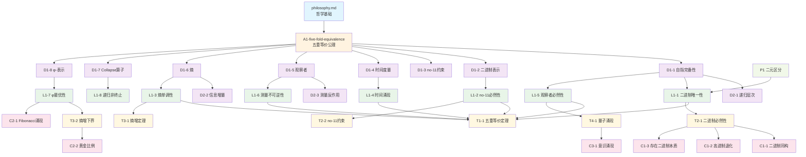
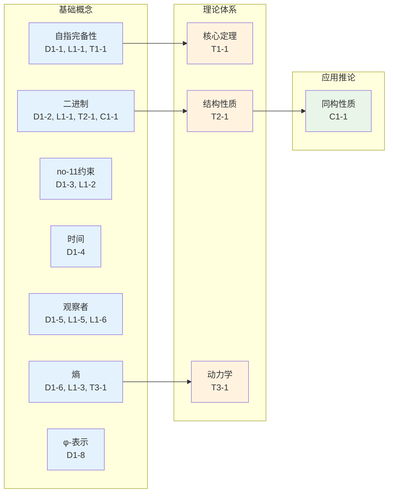
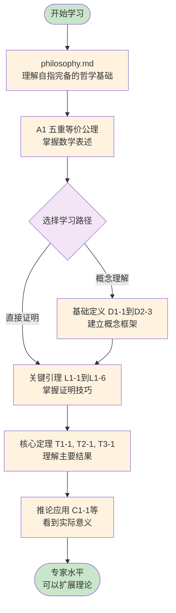
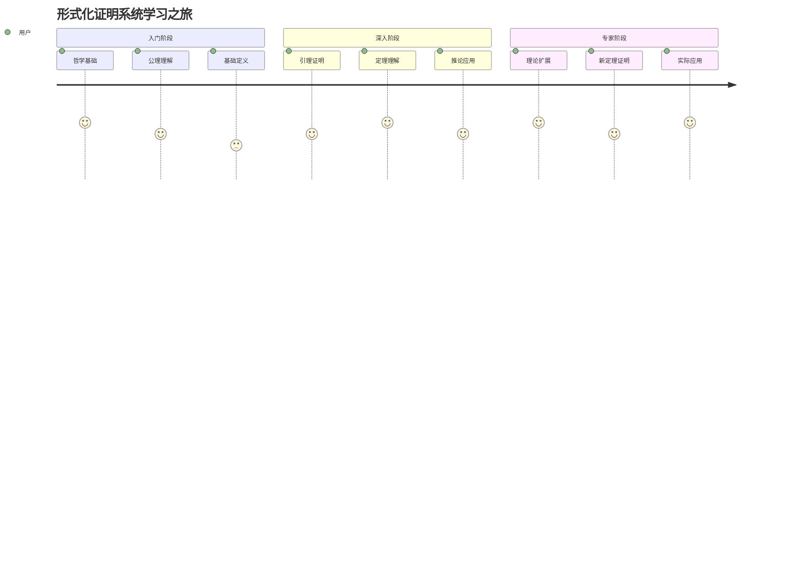
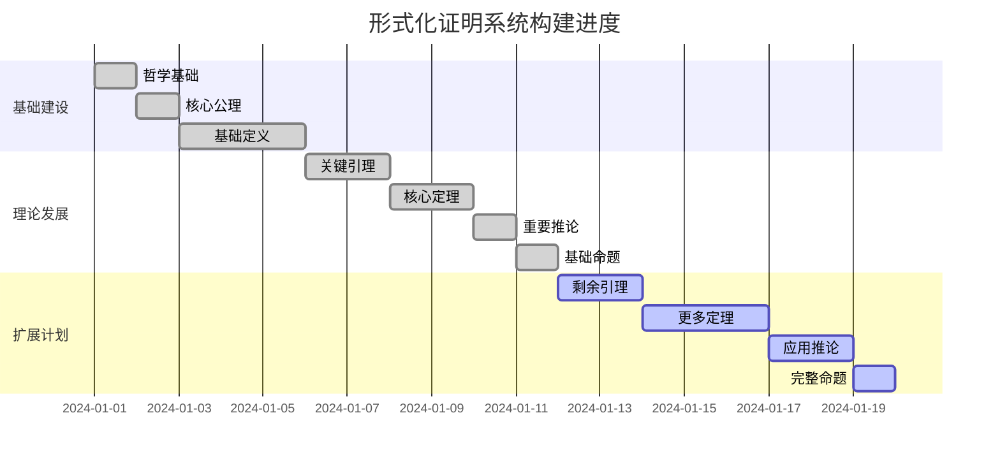
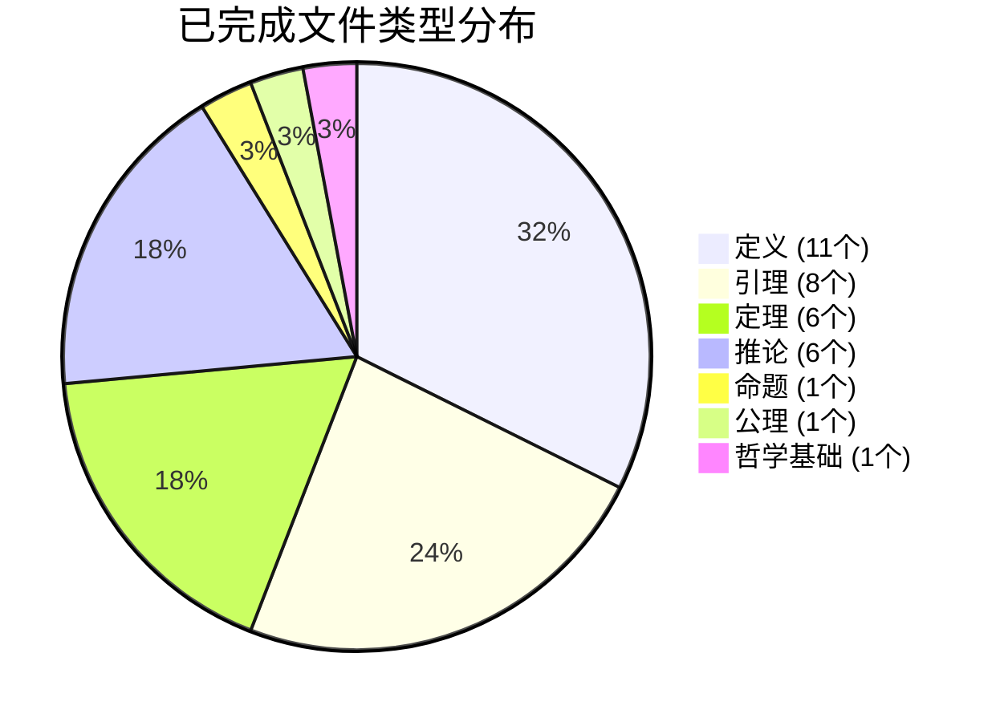
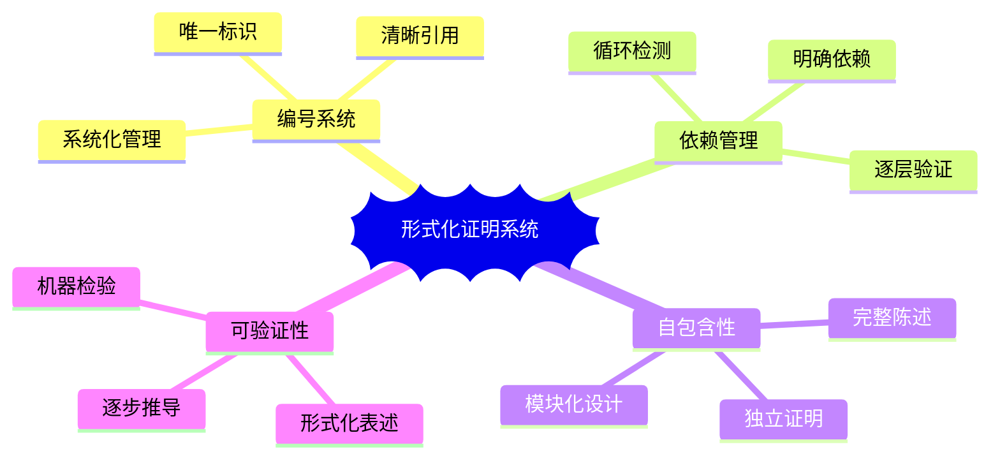
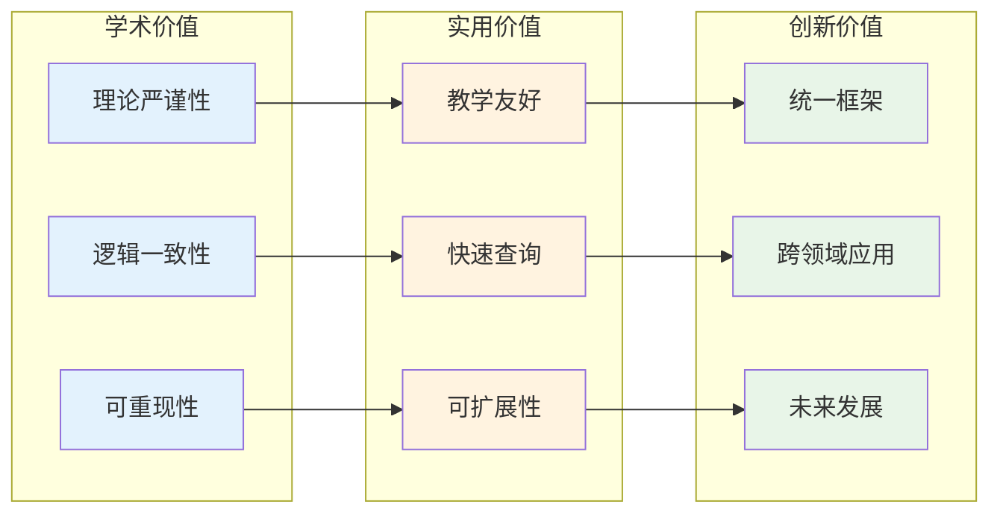

# 形式化证明系统

本目录包含从基础公理出发的完整数学证明体系，采用严格的编号系统组织。

## 编号规则

- **A**: Axiom (公理)
- **D**: Definition (定义)
- **L**: Lemma (引理)
- **T**: Theorem (定理)
- **C**: Corollary (推论)
- **P**: Proposition (命题)

## 文件命名规则

文件名格式：`[类型][编号]-[描述性名称].md`
- 编号中的点号用连字符替代
- 例如：`D1-1-self-referential-completeness.md` 表示定义1.1：自指完备性

## 公理体系

### 哲学层面
- `philosophy.md` - 哲学基础：存在包含自身描述的系统

### 数学层面
- [`A1-five-fold-equivalence.md`](A1-five-fold-equivalence.md) - 公理1：五重等价公理

## 定义

### 1. 基础定义（已创建）
- [`D1-1-self-referential-completeness.md`](D1-1-self-referential-completeness.md) - 定义1.1：自指完备性 ✓
- [`D1-2-binary-representation.md`](D1-2-binary-representation.md) - 定义1.2：二进制表示 ✓
- [`D1-3-no-11-constraint.md`](D1-3-no-11-constraint.md) - 定义1.3：no-11约束 ✓
- [`D1-4-time-metric.md`](D1-4-time-metric.md) - 定义1.4：时间度量 ✓
- [`D1-5-observer.md`](D1-5-observer.md) - 定义1.5：观察者 ✓
- [`D1-6-entropy.md`](D1-6-entropy.md) - 定义1.6：熵 ✓
- [`D1-7-collapse-operator.md`](D1-7-collapse-operator.md) - 定义1.7：Collapse算子 ✓
- [`D1-8-phi-representation.md`](D1-8-phi-representation.md) - 定义1.8：φ-表示 ✓

### 2. 派生定义（已创建）
- [`D2-1-recursive-level.md`](D2-1-recursive-level.md) - 定义2.1：递归层次 ✓
- [`D2-2-information-increment.md`](D2-2-information-increment.md) - 定义2.2：信息增量 ✓
- [`D2-3-measurement-backaction.md`](D2-3-measurement-backaction.md) - 定义2.3：测量反作用 ✓

## 引理

### 已创建的引理
- [`L1-1-binary-uniqueness.md`](L1-1-binary-uniqueness.md) - 引理1.1：二进制编码的唯一性 ✓
- [`L1-2-encoding-efficiency.md`](L1-2-encoding-efficiency.md) - 引理1.2：编码效率 ✓
- [`L1-3-entropy-monotonicity.md`](L1-3-entropy-monotonicity.md) - 引理1.3：熵的单调性 ✓
- [`L1-4-time-emergence.md`](L1-4-time-emergence.md) - 引理1.4：时间涌现 ✓
- [`L1-5-observer-necessity.md`](L1-5-observer-necessity.md) - 引理1.5：观察者的必然性 ✓
- [`L1-6-measurement-irreversibility.md`](L1-6-measurement-irreversibility.md) - 引理1.6：测量的不可逆性 ✓
- [`L1-7-phi-optimality.md`](L1-7-phi-optimality.md) - 引理1.7：φ-表示的最优性 ✓
- [`L1-8-recursion-non-termination.md`](L1-8-recursion-non-termination.md) - 引理1.8：递归的不可终止性 ✓

## 定理

### 1. 核心定理（已创建）
- [`T1-1-five-fold-equivalence.md`](T1-1-five-fold-equivalence.md) - 定理1.1：五重等价定理 ✓

### 2. 结构定理
- [`T2-1-binary-necessity.md`](T2-1-binary-necessity.md) - 定理2.1：二进制必然性定理 ✓
- [`T2-2-no-11-constraint-theorem.md`](T2-2-no-11-constraint-theorem.md) - 定理2.2：no-11约束定理 ✓

### 3. 动力学定理
- [`T3-1-entropy-increase.md`](T3-1-entropy-increase.md) - 定理3.1：熵增定理 ✓
- [`T3-2-entropy-lower-bound.md`](T3-2-entropy-lower-bound.md) - 定理3.2：熵增下界定理 ✓
- `T3-3-local-entropy-increase.md` - 定理3.3：局部熵增定理
- `T3-4-information-conservation.md` - 定理3.4：信息不灭定理

### 4. 涌现定理
- [`T4-1-quantum-emergence.md`](T4-1-quantum-emergence.md) - 定理4.1：量子结构涌现定理 ✓

### 5. 信息定理
- [`T5-1-shannon-entropy-emergence.md`](T5-1-shannon-entropy-emergence.md) - 定理5.1：Shannon熵涌现定理
- [`T5-2-maximum-entropy.md`](T5-2-maximum-entropy.md) - 定理5.2：最大熵定理
- [`T5-3-channel-capacity.md`](T5-3-channel-capacity.md) - 定理5.3：信道容量定理
- [`T5-4-optimal-compression.md`](T5-4-optimal-compression.md) - 定理5.4：最优压缩定理
- [`T5-5-self-referential-error-correction.md`](T5-5-self-referential-error-correction.md) - 定理5.5：自指纠错定理
- [`T5-6-kolmogorov-complexity.md`](T5-6-kolmogorov-complexity.md) - 定理5.6：Kolmogorov复杂度定理
- [`T5-7-landauer-principle.md`](T5-7-landauer-principle.md) - 定理5.7：Landauer原理定理

## 推论

### 已创建的推论
- [`C1-1-binary-isomorphism.md`](C1-1-binary-isomorphism.md) - 推论1.1：二进制同构 ✓
- [`C1-2-higher-base-degeneracy.md`](C1-2-higher-base-degeneracy.md) - 推论1.2：高进制退化 ✓
- [`C1-3-binary-nature-of-existence.md`](C1-3-binary-nature-of-existence.md) - 推论1.3：存在的二进制本质 ✓
- [`C2-1-fibonacci-emergence.md`](C2-1-fibonacci-emergence.md) - 推论2.1：Fibonacci数列涌现 ✓
- [`C2-2-golden-ratio.md`](C2-2-golden-ratio.md) - 推论2.2：黄金比例 ✓
- [`C3-1-consciousness-emergence.md`](C3-1-consciousness-emergence.md) - 推论3.1：意识涌现 ✓

## 命题

### 已创建的命题
- [`P1-binary-distinction.md`](P1-binary-distinction.md) - 命题1：任何区分的最小形式是二元的 ✓

### 待创建的命题
- `P2-higher-base-no-advantage.md` - 命题2：k>2不增加表达能力
- `P3-binary-completeness.md` - 命题3：二进制足以表达所有自指结构
- `P4-no-11-completeness.md` - 命题4：no-11约束下仍然完备

## 依赖关系图

### 整体架构

## 快速索引

### 按主题分类关系图

### 证明路径图

## 使用指南

### 学习路径导航

### 推荐学习路径

1. **新手入门**：[philosophy.md](philosophy.md) → [A1](A1-five-fold-equivalence.md) → [D1-1](D1-1-self-referential-completeness.md) → [T1-1](T1-1-five-fold-equivalence.md)
2. **严格推导**：按编号顺序阅读所有文件
3. **专题研究**：选择特定主题的相关文件
4. **快速查询**：通过编号或名称直接定位

## 当前状态

### 完成进度图

### 系统统计

**已完成**：
- 哲学基础：philosophy.md ✓
- 核心公理：A1 ✓
- 基础定义：D1.1-D1.8, D2.1-D2.3（共11个）✓
- 关键引理：L1.1-L1.8（共8个）✓
- 核心定理：T1.1, T2.1, T2.2, T3.1, T3.2, T4.1（共6个）✓
- 重要推论：C1.1-C1.3, C2.1-C2.2, C3.1（共6个）✓
- 基础命题：P1（共1个）✓

**形式化改进状态**：
- D1.1 自指完备性：已改进为更易理解的形式，已创建测试 ✓
- D1.2 二进制表示：已改进为更易理解的形式，已创建测试 ✓
- D1.3 no-11约束：已改进为更易理解的形式，已创建测试并修复 ✓
- D1.4-D2.3：待形式化改进
- 推论文件（C系列）：已完成严格形式化 ✓
- 引理文件（L系列）：待形式化改进
- 定理文件（T系列）：待形式化改进
- 命题文件（P系列）：待形式化改进

**系统特点**：
- 严格编号系统
- 清晰依赖关系
- 形式化证明
- 自包含文件
- 可扩展架构

## 形式化特点

### 系统架构特点

- **编号系统**：每个数学对象有唯一编号
- **依赖明确**：每个证明标注所用定义、引理、定理
- **自包含性**：每个文件包含完整陈述和证明
- **可验证性**：所有推导步骤形式化表述

### 系统价值

---

*这个形式化证明系统不仅仅是数学理论的集合，更是理解自指完备系统的活的工具。每个文件都是理论的一个微观世界，整个系统则是完整的宇宙。*