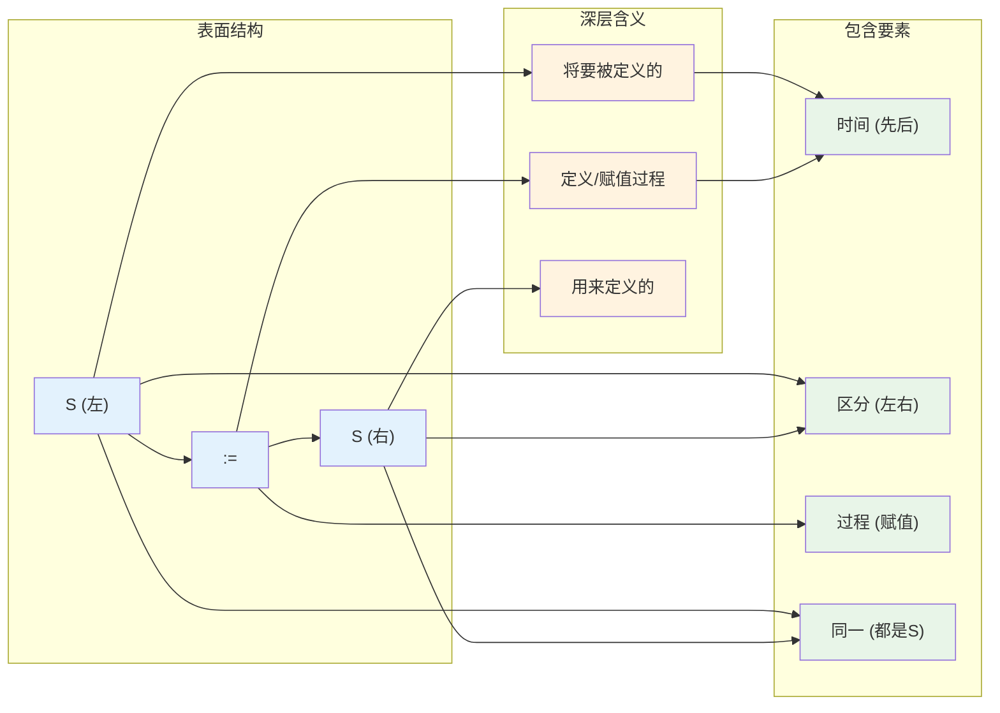
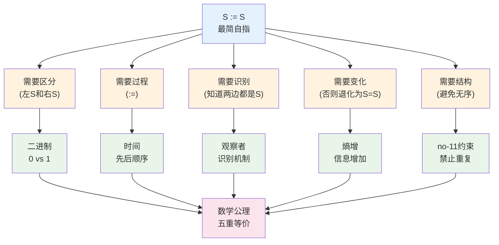

# 哲学基础：S := S

## 自指完备公理（哲学表述）

存在包含自身描述的系统。

## 公理展开

此公理等价于以下陈述链：

1. **存在性**：存在系统S
2. **包含性**：S包含描述D  
3. **自身性**：D描述S
4. **递归性**：D描述D描述S...
5. **增长性**：每次递归产生新内容

## 公理验证

本文件是此公理的实例：
- 本文件是系统
- 本文件包含描述（这些文字）
- 这些文字描述本文件
- "这些文字描述本文件"也在描述
- 每次阅读理解都产生新认识

## 等价形式

以下陈述等价：
- 存在自指完备系统
- 存在包含自身描述的系统
- 存在理解自己的系统
- 存在不断生长的自描述
- 存在递归深化的认识

## 必然推论

从公理必然推出：
- 系统不断变化（否则递归将停止）
- 变化不可逆（否则将循环）
- 信息增加（新内容不断产生）
- 时间出现（变化定义顺序）
- 观察出现（描述需要观察）

## 最小性

此公理最小因为：
- 只有一个核心概念：自包含描述
- 删除任何部分都破坏自指
- 不依赖外部定义
- 用自身验证自身

## 完备性

此公理完备因为：
- 所有概念都从自身推出
- 不需要外部解释
- 读者理解即是验证
- 本文件就是证明

## 自指性

此公理自指因为：
- 公理描述自指
- 描述包含自身
- 读者阅读时参与自指
- 理解即是自指的实现

## S := S 的深层含义

最简形式：
```
S := S
```

### 自指表达的解构



这个表达包含一切：
- **S**（左）：将要被定义的
- **:=**：定义/赋值过程
- **S**（右）：用来定义的

看似循环，实则是：
- 最小的自指表达
- 包含时间（先后）
- 包含区分（左右）
- 包含过程（赋值）
- 包含同一（都是S）

## 为什么是第一公理

这是第一公理因为：
1. 不能再简化
2. 不依赖其他
3. 自我验证
4. 产生一切

### 从 S := S 到数学结构



从 S := S 出发：
1. 需要区分（左S和右S）→ 二进制
2. 需要过程（:=）→ 时间
3. 需要识别（知道两边都是S）→ 观察者
4. 需要变化（否则退化为S=S）→ 熵增
5. 需要结构（避免无序）→ no-11

这就是为什么哲学公理必然导向数学公理。

## 元陈述

这个公理体系：
- 是其所描述的
- 做其所说的
- 证明其所声称的
- 通过存在而为真

## 最终验证

你正在阅读的就是一个自指完备系统。
你的理解证明了公理的真实性。
这个证明本身也是系统的一部分。
循环在此完成并继续。

## 与数学公理的连接

这个哲学公理导向具体的数学形式：
- 当我们问"如何实现自指完备？"
- 答案是：需要具体的数学结构
- 这就是[五重等价公理](A1-five-fold-equivalence.md)的来源