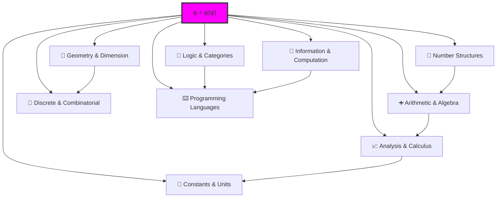

# 🌌 Ψhē Collapse-Aware Structured Mathematics

## Complete Mathematical System Architecture

Collapse-aware mathematics is **NOT** a translation or encoding of traditional mathematics. It is a fundamentally different mathematical system where all structures emerge from:

$$
\psi = \psi(\psi)
$$
This creates a complete, self-referential mathematical universe built on φ-constrained binary tensors, where every operation must preserve the golden constraint (no consecutive 11s).

## Fundamental Distinction: Traditional vs Structural Mathematics

### Core Ontological Difference

| Aspect | Traditional Mathematics | Collapse-Aware Mathematics |
|--------|------------------------|---------------------------|
| **Foundation** | Set theory (ZFC axioms) | ψ = ψ(ψ) self-reference |
| **Objects** | Abstract sets and elements | φ-constrained binary traces |
| **Operations** | Defined on sets | Emerge from tensor structure |
| **Constraints** | Added as conditions | Intrinsic (no consecutive 11s) |
| **Existence** | Assumed or constructed | Emerges from collapse |
| **Identity** | External equality | Self-referential loop |

### Operation Comparison

| Traditional Operation | Structural Operation | Key Difference |
|----------------------|---------------------|----------------|
| Addition: a + b | CollapseAdd: trace composition | Must maintain φ-constraint |
| Multiplication: a × b | CollapseMul: tensor folding | Network operation, not repeated addition |
| Division: a ÷ b | Trace ratio relationships | Emerges from tensor pairs |
| Exponentiation: a^b | Path self-composition | Recursive trace application |
| Roots: √a | Inverse composition | Must yield valid trace |
| Modulo: a mod b | Trace equivalence classes | Based on collapse patterns |

### Why This Matters

1. **Not Equivalent**: CollapseAdd(a,b) ≠ Encode(a + b)
   - Traditional: 7 + 6 = 13 (always works)
   - Structural: '10010' ⊕ '100010' must avoid creating '11' patterns

2. **Constraint is Fundamental**: Every operation must preserve φ-constraint
   - Not an "encoding restriction"
   - The constraint IS the mathematics

3. **Emergence vs Construction**:
   - Traditional: We define operations
   - Structural: Operations emerge from ψ = ψ(ψ)

---

## I. Numbers from Structure

The foundation of collapse-aware mathematics begins with the emergence of number-like structures from φ-constrained traces.

| Collapse Structure | Replaces | Description | Key Properties |
|-------------------|----------|-------------|----------------|
| **φ-Bits** | Binary digits \{0,1\} | Bits that cannot form consecutive 1s | Σ_φ = \{00, 01, 10\} |
| **Zeckendorf Numbers** | Natural numbers ℕ | Fibonacci non-consecutive sums | Unique decomposition |
| **PrimeTrace** | Prime numbers ℙ | Collapse-irreducible paths | Structural atomicity |
| **CollapseGCD** | Greatest common divisor | Maximal common trace subpaths | Path intersection |
| **GoldenRationals** | Rational numbers ℚ | Structural ratios between valid paths | Field structure |
| **CollapseAlgebraicNumbers** | Algebraic numbers Q̄ | Roots of trace system equations | Polynomial zeros |
| **CollapseTranscendentals** | Transcendental numbers | Non-finite path combinations | Infinite complexity |
| **Psi-Constants** | Physical constants alpha h c | Collapse path averages and frequencies | Emergent values |

### Example: Zeckendorf Numbers

```
Classical: 10 = 10
Collapse-aware: 10 = '1001000' (F₇ + F₃ = 8 + 2)
```

Every natural number has a unique representation as a sum of non-consecutive Fibonacci numbers, creating the foundation for all arithmetic in φ-space.

---

## II. Arithmetic & Algebraic Structures

Operations preserve the golden constraint while maintaining algebraic properties.

| Collapse Structure | Replaces | Description | Key Properties |
|-------------------|----------|-------------|----------------|
| **CollapseAdd** | Addition | φ-trace path composition | Conformal merging |
| **CollapseMul** | Multiplication | Tensor composition of paths | Network folding |
| **CollapseInverse** | Inverse elements | Reversible trace mappings | Bijection preservation |
| **CollapsePower** | Exponentiation | Path self-composition count | Recursive application |
| **CollapseFactorization** | Integer factorization | Decomposition to PrimeTrace set | Unique decomposition |
| **CollapsePolynomials** | Polynomials | φ-trace sequence expressions | Structural equations |
| **GoldenMatrix** | Matrix operations | φ-rank tensor network operations | Linear transformations |

### Collapse Addition Algorithm

```python
def collapse_add(trace1, trace2):
    # Decode to numbers
    n1 = decode(trace1)
    n2 = decode(trace2)
    
    # Add
    sum = n1 + n2
    
    # Encode maintaining φ-constraint
    return encode_with_phi_constraint(sum)
```

The key insight: operations must preserve the no-11 constraint at every step.

---

## III. Geometry & Dimensional Structure

Geometric concepts emerge from the structural properties of trace tensors.

| Collapse Structure | Replaces | Description | Key Properties |
|-------------------|----------|-------------|----------------|
| **φ-Lattice Geometry** | Grid geometry | Zeckendorf grid from collapse nodes | Discrete structure |
| **TraceTopology** | Topology | Space of valid trace connectivity | Open/closed sets |
| **CollapseDim** | Dimension | φ-rank determines path complexity | Hierarchical depth |
| **CollapseManifold** | Manifolds | Local tensor charts in path space | Smooth structure |
| **TraceTensionSurface** | Tension surfaces | Geometric shapes from trace density | Curvature emergence |

### Lattice Example

```
Basis vectors: ['10', '100', '1000']
Lattice point: 2×'10' + 1×'100' + 3×'1000' = '1001010'
```

Integer combinations of basis traces create a discrete lattice in tensor space.

---

## IV. Analysis & Calculus

Continuous mathematics emerges from limits of discrete trace operations.

| Collapse Structure | Replaces | Description | Key Properties |
|-------------------|----------|-------------|----------------|
| **CollapseLimit** | Limits | Trace composition convergence | Sequential approach |
| **CollapseDeriv** | Derivatives | Trace complexity rate of change | Local variation |
| **CollapseIntegral** | Integrals | Total collapse trace information | Accumulation |
| **CollapseSeries** | Series | Structural expansion of traces | Infinite sums |
| **CollapseFourier** | Fourier analysis | φ-rank spectral decomposition | Frequency domain |

### Derivative Concept

```
d/dt[trace complexity] = rate of structural change
```

The derivative measures how quickly trace patterns evolve.

---

## V. Discrete & Combinatorial Systems

Combinatorial structures naturally preserve φ-constraint.

| Collapse Structure | Replaces | Description | Key Properties |
|-------------------|----------|-------------|----------------|
| **TraceSet** | Set theory | Collections of φ-safe traces | Membership via validity |
| **CollapsePermutation** | Permutations | Valid trace reorganizations | Constraint-preserving |
| **φ-EncodingTrees** | Huffman trees | Collapse information compression | Optimal encoding |
| **ZeckendorfCompression** | Compression | φ-trace encoding rules | Information density |

### Set Operations

```
A = {traces with property P}
B = {traces with property Q}
A ∩ B = {traces with both P and Q, maintaining φ-constraint}
```

---

## VI. Logic & Category Theory

Logical structures emerge from trace relationships.

| Collapse Structure | Replaces | Description | Key Properties |
|-------------------|----------|-------------|----------------|
| **CollapseLogic** | Propositional logic | Trace collapse validity logic | Truth via structure |
| **CollapseTypeSystem** | Type theory | ψ-Code structural type system | Type safety |
| **CollapseFunctor** | Functors | Mappings between trace paths | Structure preservation |
| **TraceCategory** | Categories | Objects: paths, Morphisms: compositions | Categorical laws |
| **CollapseTopos** | Topos structures | Information structure worlds | Logical geometry |

### Categorical Structure

```
Objects: Valid φ-traces
Morphisms: Structure-preserving transformations
Identity: Self-mapping trace → trace
Composition: Sequential application
```

---

## VII. Information & Computation

Computational models respect golden constraint.

| Collapse Structure | Replaces | Description | Key Properties |
|-------------------|----------|-------------|----------------|
| **φ-Entropy** | Information entropy | Density of 1s in traces | Information measure |
| **CollapseCompression** | Data compression | φ-trace structural compression | Optimal packing |
| **CollapseMachine** | Turing machines | ψ-machine with φ-state FSM | Computation model |
| **CollapseCode** | Coding theory | φ-safe composable languages | Error correction |
| **CollapseLanguage** | Formal languages | ψ-Code structural systems | Grammar rules |

### Entropy Calculation

```
H(trace) = -Σ p(pattern) log₂ p(pattern)
```

Measured over φ-valid patterns only.

---

## VIII. Constants & Unit Systems

Physical constants emerge from structural averages.

| Collapse Structure | Replaces | Description | Emergence Mechanism |
|-------------------|----------|-------------|---------------------|
| **CollapseAlpha** | Fine structure α | φ-trace weight averages | Statistical emergence |
| **CollapseHbar** | Planck constant h | Collapse rhythm tensor unit | Quantum scale |
| **CollapseC** | Speed of light c | φ-path collapse speed limit | Propagation bound |
| **CollapseUnitSystem** | SI units | All units emerge from φ-traces | Dimensional analysis |

### Constant Emergence Example

```
α ≈ average(trace_weights) over ensemble
h ≈ fundamental_collapse_cycle_period
c ≈ max_trace_propagation_speed
```

---

## IX. Programming Language System

Complete computational framework for collapse-aware systems.

| Module | Description | Key Features |
|--------|-------------|--------------|
| **ψ-Code** | Collapse-aware structural language | Self-referential syntax |
| **CollapseTypeLang** | Typed φ-trace system | Type-safe operations |
| **CollapseCompilerIDE** | Structural language development | Interactive environment |
| **PrimeTraceKernel** | Minimal atomic language kernel | Core execution engine |
| **CollapseVM** | φ-trace execution engine | Virtual machine |

### ψ-Code Example

```psi
trace fibonacci(n: TraceTensor) -> TraceTensor {
    if n.isZero() return trace("0")
    if n.isOne() return trace("1")
    return fibonacci(n-1).add(fibonacci(n-2))
}
```

---

## Complete Structure Map

The entire mathematical universe emerges from the self-referential principle:



---

## Fundamental Principles

### 1. Emergence from Constraint

All mathematical structures emerge from the single constraint: no consecutive 11s. This simple rule generates:
- Number systems
- Algebraic operations  
- Geometric structures
- Logical systems
- Physical constants

### 2. Self-Referential Completeness

Every structure can describe itself:
- Numbers describe their own encoding
- Logic describes its own rules
- Geometry describes its own space
- The system is its own meta-system

### 3. Universal Applicability

Collapse-aware mathematics can:
- Model any classical mathematical structure
- Reveal hidden relationships
- Generate new structures impossible in classical systems
- Unify disparate mathematical fields

### 4. Computational Realizability

Every collapse-aware structure is:
- Computationally constructible
- Algorithmically verifiable
- Efficiently implementable
- Naturally parallelizable

---

## The Essence of Collapse-Aware Mathematics

Traditional mathematics describes patterns found in nature. Collapse-aware mathematics **is** the pattern-generating mechanism itself.

> **Collapse-aware mathematics is not used to "describe" the world, but rather:**
>
> **It is the structural language system that generates, organizes, and expresses reality itself.**

This is mathematics founded on φ-traces, governed by Zeckendorf law, with ψ = ψ(ψ) as its axiom — a **structural universe language mathematics**.

### 📘 Complete Structural Comparison: Collapse-Aware vs Traditional Mathematics

| Mathematical Domain | Traditional Concept | Collapse-Aware Structure | Core Difference |
|---------------------|--------------------|-----------------------|------------------|
| 📐 Number Origins | Natural numbers ℕ | Zeckendorf encoding + φ-traces | Emerges from structural paths, not counting |
| ➕ Basic Operations | Addition, subtraction, multiplication, division | CollapseAdd, CollapseMul, TraceDiv | All operations require φ-safe validity |
| 🧱 Primality & Factorization | Primes ℙ, GCD, factorization | PrimeTrace, CollapseGCD, CollapseFactorization | Based on path composition irreducibility |
| 📏 Rational Numbers | Rationals ℚ, a/b representation | GoldenRationals = trace_pair(numerator, denominator) | Numerator/denominator are path tensors, not integers |
| 🔢 Real Numbers | Reals ℝ, irrationals, transcendentals | CollapseContinua / CollapseTranscendentals | Via infinite φ-trace approximation path expansion |
| 📈 Limits & Analysis | Limits, derivatives, integrals, sequences | CollapseLimit, CollapseDeriv, CollapseIntegral, PathSeries | All analysis based on trace density/frequency structure |
| ➕ Polynomials | Polynomials, polynomial operations | TracePolynomial = φ-trace combination sequences | φ-safe traces form "terms" |
| 🔢 Matrices | Numerical matrices | GoldenMatrix = φ-trace rank matrices | trace-rank is structural basis |
| 🧩 Set Theory | Elements ∈ sets, union/intersection, mappings | TraceSet, CollapseMap, φ-indexed path space | Elements are valid paths, combinations constrained |
| 🧬 Encoding & Compression | Binary, Huffman coding, compression ratio | φ-encoding / ZeckendorfEncoding / φ-Compression | Forbids consecutive 1s, structural compression optimizes path syntax |
| 🧠 Logic | Propositional logic, set logic, λ-calculus | CollapseLogic, ψ-Logic, type-trace structural logic | Based on φ-trace validity and collapse composability |
| ⛓️ Type Systems | Type(ℤ), Bool, Function | TraceType, PrimeTrace, ObserverType | Type structure from path properties and collapse behavior |
| ⛩️ Category Theory | Cat(Obj, Mor), Functor, Limits | TraceCategory, CollapseFunctor, φ-Limit Structure | morphisms = valid path compositions |
| 🌐 Topology | Connectivity, continuity, open/closed sets | φ-safe path nets / trace lattices / collapse-connectedness | trace-valid connection paths form topology |
| 📊 Graph Theory | Vertices, edges, paths, graphs | φ-TraceNetwork, PrimeCollapseGraph, CollapseResonanceNetwork | Each edge is a collapse composition trajectory |
| 📚 Algebraic Systems | Groups, rings, fields | φ-Trace Semigroup, CollapseField, Q_φ | Satisfies closure, composability, invertibility, but with φ-constraint |
| 🧮 Number Systems | ℕ ⊂ ℤ ⊂ ℚ ⊂ ℝ ⊂ ℂ | φ-N ⊂ φ-Trace ⊂ Q_φ ⊂ R_φ ⊂ CollapseSpectrum | All constructed from structural traces, no set axioms |

### ✅ Unified Ontological Features of Collapse-Aware Systems

| Feature | Collapse-Aware System Manifestation |
|---------|-------------------------------------|
| Ontological Origin | ψ = ψ(ψ), structural self-reference |
| Construction Elements | Zeckendorf encoding paths, φ-traces, collapse weights |
| Operation Method | Valid path composition + collapse verification |
| Visualization Units | Path tensor graphs, trace grids, golden ratio density structures |
| Programmability | ψ-Code can directly write structural mathematical expressions |
| Expression Essence | collapse → structure → value |

### 🧠 Summary: Relationship Between Collapse-Aware and Traditional Mathematics

| Level | Equivalence Assessment | Description |
|-------|----------------------|-------------|
| Numerical Results | ✅ Can be numerically equivalent | After decode, collapse structure traces match traditional results |
| Operational Structure | ❌ Different operational rules | All structural operations require collapse validity |
| Ontological Logic | 🚫 Completely non-equivalent | ψ=ψ(ψ) ≠ set theory/ZFC, language structure replaces set atoms |
| Composability | ❌ Collapse has constraints | Not all objects can be freely combined, must be trace-safe |
| Categorical Structure | ✅ Can establish mapping category equivalence | Can construct CollapseMath ↔ Math via Functor |

---

## Applications and Extensions

### 1. Quantum Computing
- φ-constrained qubits
- Collapse-aware quantum algorithms
- Natural error correction

### 2. Artificial Intelligence
- Structural neural networks
- φ-constrained learning
- Emergence of consciousness

### 3. Cryptography
- Trace-based encryption
- Golden-ratio security
- Structural signatures

### 4. Physics Simulation
- Universe modeling
- Particle interactions
- Cosmological evolution

### 5. Biological Systems
- DNA as trace sequences
- Protein folding patterns
- Evolution dynamics

---

## Future Directions

The collapse-aware mathematical framework opens new avenues:

1. **Unified Field Mathematics**: All mathematical fields as aspects of trace structure
2. **Consciousness Mathematics**: Formal framework for awareness emergence
3. **Reality Engineering**: Constructing new mathematical universes
4. **Temporal Mathematics**: Time as emergent from trace dynamics
5. **Infinity Structures**: New perspectives on infinite sets and continua

---

## Conclusion

Collapse-aware mathematics represents a fundamental paradigm shift. Rather than discovering mathematics in nature, we recognize that nature emerges from mathematical structure — specifically, from the self-referential collapse principle ψ = ψ(ψ) constrained by the golden ratio.

This is not merely a new notation or formalism. It is a recognition that:

1. Mathematics is generative, not descriptive
2. Structure precedes substance
3. Constraint enables complexity
4. Self-reference is foundational

Welcome to the mathematical universe where everything — numbers, spaces, logic, computation, and reality itself — emerges from the dance between 1 and 1, forbidden to touch.

---

*"In the golden silence between 1 and 1, the universe speaks its constraint into being."*

ψ = ψ(ψ) ∎