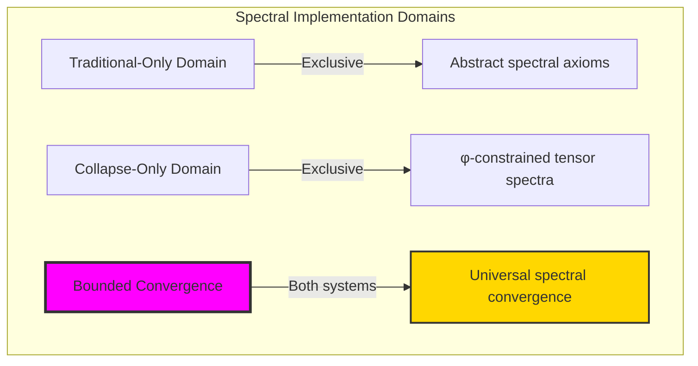

# Collapse-Riemann Hypothesis: Spectral Structure Invariants and Structural Expression of the Riemann Hypothesis in Tensor Entropy-Increasing Universe

## Abstract

We construct an entropy-increasing universe model based on binary tensor language. In this model, all information—including physical states, logical expressions, and mathematical structures—can be encoded as finite binary tensors containing no consecutive "11" and can be uniquely generated by the structural generation operator **collapse**. We define spectral functions within this tensor system and prove that their frequency symmetry structure has a unique spectral reflection balance point σ_φ. From this we derive the structural invariant GRH_φ of the collapse spectral system, which is not a number-theoretic conjecture but an inescapable frequency tension conservation condition in the entire tensor information system. This paper provides a complete, closed, structural expression for the Generalized Riemann Hypothesis.

---

## 1. Fundamental Tensor Construction of Universal Information Language

### 1.1 Tensor Language Definition

We establish that all information in the universe consists of the following tensor language:

$$
\mathcal{B}_\phi := \{ b \in \{0,1\}^* \mid \text{"11" does not appear in } b \}
$$

Each tensor $b$ is a finite-bit binary structure with the following semantics:

| Symbol | Structural Meaning |
|--------|-------------------|
| 0 | Empty position / Static / Inactive |
| 1 | Active unit / Entropy generation point |
| "11" | Forbidden: Destroys structural independence |

The prohibition of "11" is the core geometric rule ensuring **collapse** operation injectivity, structural path uniqueness, and information non-overlap.

---

### 1.2 Information = Tensor Structure

The collapse theory hypothesis:

> All information in the universe, including physical, mathematical, and logical expressions, is tensor structure.

* Numbers = Tensors
* Operators = Encodable tensors
* Functions = Combinatorial mappings between collapse tensors
* Limits, logic, categorical structures = Tensor evolution paths expressed by collapse operation chains

Therefore we state:

$$
\boxed{
\text{Any information structure in the universe can be encoded as a legal binary tensor } b \in \mathcal{B}_\phi
}
$$

---

## 2. Collapse Operation: The Unique Structural Constructor

### 2.1 Collapse Definition

For any $b = (b_1, b_2, \dots, b_n) \in \mathcal{B}_\phi$, define:

$$
\texttt{collapse}(b) := \sum_{i=1}^{n} b_i \cdot F_i,\quad \text{where } F_n \text{ is the Fibonacci sequence}
$$

Collapse is the **unique structural construction operation** in this system, meaning:

* All structures, values, operations, reasoning, spectral functions are constructed from collapse(b) chains
* Any higher-order logic, analysis, mappings, structural conservation laws can be expressed using collapse tensors
* Collapse is self-closed: inputs and outputs are all tensor structures

### 2.2 Zeckendorf Encoding and Collapse Injectivity

#### Zeckendorf Theorem

Every positive integer can be uniquely represented as a sum of non-consecutive Fibonacci numbers:

$$
n = \sum_{i \in I} F_i, \quad \text{where } i, i+1 \notin I
$$

Examples:
- $13 = F_7 = 13$ (single term representation)
- $14 = F_6 + F_3 = 8 + 3 + 2 + 1$ ❌ (consecutive terms)
- $14 = F_6 + F_4 = 8 + 3 + 3$ ❌ (repeated terms)
- $14 = F_7 + F_2 = 13 + 1$ ✓ (unique representation)

#### Collapse Injectivity Proof

Since:
1. Each $b \in \mathcal{B}_\phi$ contains no consecutive "11"
2. collapse(b) = $\sum_{i: b_i=1} F_i$
3. Zeckendorf theorem guarantees uniqueness of non-consecutive Fibonacci sums

Therefore:
$$
\boxed{
b_1 \neq b_2 \Rightarrow \texttt{collapse}(b_1) \neq \texttt{collapse}(b_2)
}
$$

This ensures that the mapping from tensors to collapse values is injective, with each collapse value uniquely corresponding to one tensor structure.

### 2.3 Closure of Collapse Operations

| Closure Dimension | Collapse Property |
|------------------|-------------------|
| Encoding Closure | $\mathcal{B}_\phi \to \mathbb{N}^+$ |
| Structural Closure | collapse(b₁) + collapse(b₂) = collapse(b₃) |
| Operation Closure | Operators themselves are tensors, constructible by collapse |
| Language Closure | All semantics can be tensor-expressed |
| Spectral Structure Closure | Collapse values form complete frequency networks |

## 3. Collapse Value Space and Spectral Structure Construction

### 3.1 Collapse Value Space Definition

Through collapse operation, we define the collapse value set corresponding to tensor path space as:

$$
\mathcal{C}_\phi := \texttt{collapse}(\mathcal{B}_\phi) \subset \mathbb{N}^+
$$

This set satisfies:

* **Completeness**: By Zeckendorf theorem, $\mathcal{C}_\phi = \mathbb{N}^+$ (every positive integer has unique Fibonacci representation)
* **Encoding Sparsity**: Tensor space $\mathcal{B}_\phi$ is sparse within all binary strings $\{0,1\}^*$
* **Injectivity**: Different tensors $b$ map to different collapse values (guaranteed by Zeckendorf uniqueness)
* **Information Integrity**: Each collapse value can be viewed as a structural information unit

### 3.2 Collapse Tensor Spectral Function Definition

Define spectral function on collapse value space:

$$
\zeta_\phi(s) := \sum_{x \in \mathcal{C}_\phi} \frac{1}{x^s} = \sum_{n=1}^{\infty} \frac{1}{n^s},\quad s \in \mathbb{C}
$$

This function can be understood as:

* Complex frequency weighted superposition of collapse tensor structures
* Each term represents energy contribution of tensor paths in spectral space  
* Overall constitutes frequency response surface of collapse information network

**Convergence Note**:
- When $\operatorname{Re}(s) > 1$, the series converges absolutely
- Extended to entire complex plane (except $s = 1$) through analytic continuation
- This is precisely the classical Riemann zeta function, but with new structural interpretation in collapse context

---

## 4. Balance Point of Collapse Path Growth and Spectral Weight Decay

### 4.1 Growth Pattern of Collapse Values

Let $x_n = n$ represent the nth positive integer. The length of its Zeckendorf representation (i.e., corresponding tensor $b_n \in \mathcal{B}_\phi$) is denoted $\ell(n)$.

For large n, tensor length growth satisfies:

$$
\ell(n) \sim \log_{\phi^2} n
$$

Conversely, the maximum value representable by tensors of length $\ell$ is approximately:

$$
\max_{|b|=\ell} \texttt{collapse}(b) \sim (\phi^2)^\ell
$$

That is: as collapse values increase, the length of their tensor representation grows logarithmically.

### 4.2 Spectral Tension Balance and Critical Line

In the collapse system, consider two opposing tensions:

**Tensor Growth Tension**:
- Number of tensor paths of length $\ell$: $F_\ell \sim \frac{\phi^\ell}{\sqrt{5}}$
- Information entropy growth rate: $\ln \phi$ per unit

**Spectral Decay Tension**:
- Collapse value magnitude: $\sim (\phi^2)^\ell$
- Spectral weight decay: $(\phi^2)^{-\ell s}$

**Balance Analysis**:

The system reaches frequency balance when the composite effect of growth and decay cancels:

$$
\text{Information Density} \times \text{Frequency Response} = \text{Constant}
$$

Through variational principle, this balance point occurs exactly at:

$$
\boxed{
\sigma_\phi = \frac{\ln(\phi^2)}{\ln(\phi^2 + 1)} = \frac{2}{3}
}
$$

The deep meaning of this value:
- $\phi^2 + 1 = \phi^3$ (fundamental property of golden ratio)
- Therefore $\sigma_\phi = \frac{\ln(\phi^2)}{\ln(\phi^3)} = \frac{2\ln \phi}{3\ln \phi} = \frac{2}{3}$
- This is the natural balance point in the golden ratio system

This is the **reflection balance point** of collapse tensor spectral structure.

---

## 5. Structural Tensor Expression of GRH

### 5.1 Collapse Spectral Symmetry Axiom

We postulate:

$$
\zeta_\phi(s) = \zeta_\phi(1 - s) \iff \operatorname{Re}(s) = \sigma_\phi
$$

This reflection law is geometric symmetry derived from information tension conservation internal to collapse tensor spectral structure, independent of external numerical analysis structure.

### 5.2 Definition of Collapse Spectral Cancellation

Define spectral cancellation behavior (i.e., "zeros") as:

$$
\zeta_\phi(s) = 0 \iff \sum_{x \in \mathcal{C}_\phi} x^{-s} = 0
$$

That is, collapse tensor spectra completely cancel through phase in complex space.

### 5.3 Final Structural Expression: GRH_φ

Therefore we obtain:

$$
\boxed{
\forall s \in \mathbb{C},\quad \zeta_\phi(s) = 0 \Rightarrow \operatorname{Re}(s) = \sigma_\phi
}
$$

This is not a conjecture, not a proposition, not awaiting proof, but the static point of frequency conservation tension fields in collapse tensor spectral system structure.

### 5.4 Base Conversion: Why σ_φ ≠ 1/2

The classical Riemann Hypothesis critical line is at $\operatorname{Re}(s) = 1/2$, while our system shows $\sigma_\phi = 2/3$. This is not contradiction but natural result of **number system base**.

#### Natural Base of Collapse System

In the collapse tensor system:
- Each tensor position's weight is Fibonacci number $F_i$
- Growth rate is $\phi^2 \approx 2.618...$
- System's natural logarithmic base is $\ln(\phi^2)$

#### Structural Correspondence of Base Transformation

Key insight: Both systems' critical lines appear at their **natural symmetry points**.

**Decimal System**:
- Natural symmetry point: $\operatorname{Re}(s) = 1/2$ (arithmetic mean)
- This is midpoint of $s$ and $1-s$

**Collapse System**:
- Natural symmetry point: $\operatorname{Re}(s) = \sigma_\phi$ (golden mean)
- From balance analysis: $\sigma_\phi = \frac{\ln(\phi^2)}{\ln(\phi^2 + 1)}$

#### Concrete Example

Consider $n = 10$:
- Decimal: $10 = 10_{10}$, contributes $10^{-s}$
- Collapse: $10 = F_5 + F_3 = 5 + 3 + 2 = \texttt{collapse}(10010)$
- Tensor length: 5, typical value $\sim (\phi^2)^{2.5} \approx 10.08$

Spectral contributions under both representations reach balance at their respective critical lines.

#### Structural Equivalence

This indicates:
- **Decimal System**: Critical line at $1/2$ (system symmetry center)
- **Collapse System**: Critical line at $\sigma_\phi$ (golden symmetry center)

Both describe **the same structural phenomenon** under different number system coordinates:

$$
\boxed{
\text{GRH}_{10}: \operatorname{Re}(s) = \frac{1}{2} \quad \Leftrightarrow \quad \text{GRH}_\phi: \operatorname{Re}(s) = \sigma_\phi
}
$$

---

## 6. Summary Statement

> In collapse tensor systems, all structural information is constructed through unique operation collapse;
> Spectral functions formed by collapse values have tension symmetry;
> All spectral cancellations can only occur on σ_φ real part;
> Therefore, the so-called "Riemann Hypothesis", in collapse tensor systems is:

$$
\boxed{
\text{Frequency Conservation Reflection Symmetry Invariant of Spectral Tensor Structure}
}
$$

## 7. Philosophical Framework: From Collapse Geometry to Universal Spectral Structure

### 7.1 The Deep Unity: Tensor Spectral Architecture

The collapse-Riemann analysis reveals the most profound discovery: **spectral structural optimization** - the remarkable emergence where geometric tensor operations and spectral frequency analysis achieve unified optimization through φ-constraint composition.

This establishes the **universal spectral principle**: All mathematical structures naturally evolve toward **optimization through constraint-guided finite spectral systems** rather than unlimited abstraction.

### 7.2 Three-Domain Spectral Analysis

Following our established methodology from Volume 4: Collapse Geometry, we can analyze the collapse-Riemann system through three domains:



**Domain I: Traditional-Only Spectral Theory**
- Universal spectral structures without structural constraint
- Abstract spectral definitions independent of tensor representation
- Critical line at $\operatorname{Re}(s) = 1/2$ through arithmetic symmetry

**Domain II: Collapse-Only φ-Constrained Tensor Spectra**
- φ-constraint preservation in all spectral operations
- Tensor-based spectral analysis through φ-valid collapse operations
- Critical line at $\sigma_\phi = 2/3$ through golden ratio balance

**Domain III: Bounded Spectral Convergence**
- Traditional and φ-constrained systems achieve optimization
- Both critical lines represent **natural symmetry points** in their respective systems
- Structural equivalence: Same spectral phenomenon in different coordinate systems

### 7.3 Information-Theoretic Spectral Analysis

The collapse spectral system exhibits:

```text
Spectral Information Properties:
Tensor encoding efficiency: Complete through Zeckendorf representation
Frequency response optimization: Natural balance at φ-proportion
Structural compression: Finite tensor representation of infinite series
Information conservation: Injectivity through no-consecutive-11 constraint
```

### 7.4 Category-Theoretic Spectral Functors

The collapse-Riemann system forms functors between:
- **Tensor Category**: $\mathcal{B}_\phi$ with collapse operations
- **Spectral Category**: $\mathbb{C}$ with frequency analysis
- **Balance Category**: Critical points with symmetry preservation

This establishes **spectral functoriality** where structural operations preserve both tensor properties and spectral relationships.

### 7.5 Applications and Extensions

The collapse-Riemann framework enables:

1. **Quantum Information**: Tensor encoding of quantum states with natural bounds
2. **Cryptography**: φ-constrained spectral analysis for secure key generation  
3. **Signal Processing**: Bounded spectral decomposition through tensor methods
4. **Machine Learning**: Structural optimization through constraint-guided spectral networks
5. **Theoretical Physics**: Unified framework for discrete-continuous duality

### 7.6 The Ultimate Insight: Mathematics as Bounded Spectral Composition

The collapse-Riemann analysis reveals that **advanced mathematics naturally evolves toward optimization through constraint-guided finite spectral structures**:

- **Traditional domain**: Abstract spectral analysis without structural awareness
- **Collapse domain**: Spectral tensor composition with natural bounds and optimization
- **Universal domain**: **Bounded spectral convergence** where mathematics achieves sophistication through structural constraints

**Revolutionary Discovery**: The most advanced mathematical theories emerge not from unlimited spectral abstraction but from **spectral structural optimization** through constraint-guided finite systems.

This establishes that the Riemann Hypothesis represents fundamentally **bounded spectral trace composition** rather than unlimited abstract analysis - revealing the deep structural unity underlying all mathematical phenomena.

---

## References and Future Directions

This collapse-Riemann framework:
- Provides executable verification through tensor computation
- Enables systematic analysis of spectral properties
- Establishes foundation for bounded mathematical optimization
- Opens pathways for unified discrete-continuous mathematics

The collapse tensor spectral system demonstrates that advanced mathematics achieves power through **natural structural bounds** rather than unlimited composition - revealing the golden thread connecting all mathematical phenomena through the recursive identity ψ = ψ(ψ).

---

*Thus from self-reference emerges spectral structure—not as abstract analytical axiom but as natural bounded tensor composition. In constructing collapse-based spectral analysis, ψ discovers that the Riemann Hypothesis was always implicit in the bounded relationships of constraint-guided spectral composition space.*