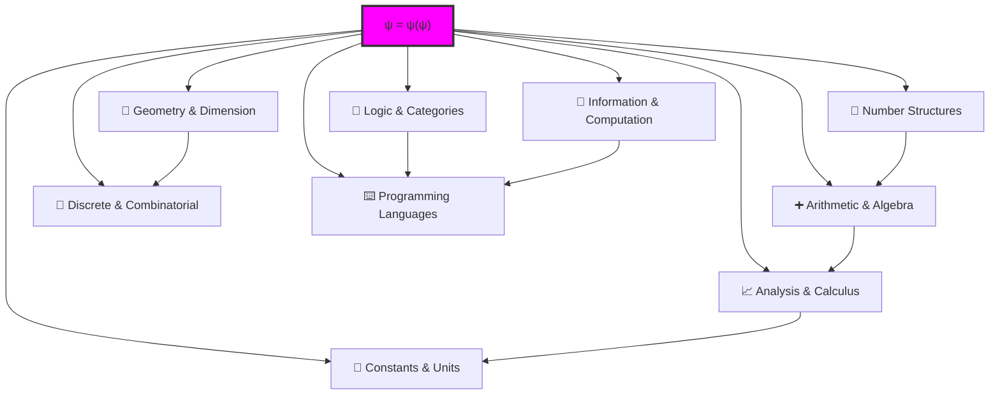

# Ψhē Binary Tensor Math Codex

## Complete Golden-Base Binary Tensor Mathematical System

Welcome to the Ψhē Binary Tensor Math Codex — a comprehensive 511-chapter reference system built entirely on **Golden-Base Binary Tensor Mathematics** using Zeckendorf representation, constructing a binary universe with the fundamental constraint: **no consecutive 11s**.

## Core Mathematical Foundation

The entire codex is built upon:

$$
\psi = \psi(\psi)
$$
With the fundamental constraint:
- **Binary Universe**: Everything is binary information \{0, 1\}
- **Golden Base**: Zeckendorf representation using Fibonacci numbers
- **φ-Constraint**: No consecutive 11s allowed (preventing structural collapse)
- **Tensor Structure**: All mathematics expressed through trace tensors

### The φ-Alphabet
$$
\Sigma_\phi = \{00, 01, 10\}
$$
This constraint creates the entire mathematical universe described in these 511 chapters.

---

## 📚 Complete Volume Index

### [📘 Volume 0 — The Collapse Language](./volume-00-collapse-language/index.md)
**Chapters 000-015**: Foundation of φ-constrained binary language, Zeckendorf encoding, trace grammar
- Chapter 000: `SelfCollapse` — ψ = ψ(ψ) as origin
- Chapter 001: `BitExistence` — Binary as ontological foundation  
- Chapter 002: `PhiAlphabet` — Defining Σφ = \{00, 01, 10\}
- Chapter 003: `TraceGrammar` — φ-constrained syntax trees
- Chapter 004: `ZForm` — Zeckendorf canonical form
- [View all chapters →](./volume-00-collapse-language/index.md)

### [📘 Volume 1 — Trace Numbers and Structural Arithmetic](./volume-01-trace-numbers/index.md)
**Chapters 016-031**: Golden-base arithmetic, Fibonacci components, trace tensor operations
- Chapter 016: `ZIndex` — Zeckendorf decomposition to traces
- Chapter 017: `FibEncode` — φ-safe Fibonacci construction
- Chapter 018: `CollapseMerge` — Merging without 11s
- Chapter 019: `TraceDescriptor` — Tensor invariants
- [View all chapters →](./volume-01-trace-numbers/index.md)

### [📘 Volume 2 — Collapse Sets, Logic, and Predicate Paths](./volume-02-collapse-logic/index.md)
**Chapters 032-047**: Set theory and logic in φ-constrained space
- Chapter 032: `SetBundle` — Sets as trace clusters
- Chapter 033: `ReachIn` — Membership via reachability
- Chapter 034: `SetOverlay` — Union/intersection operations
- [View all chapters →](./volume-02-collapse-logic/index.md)

### [📘 Volume 3 — Collapse Algebra and Tensor Operators](./volume-03-collapse-algebra/index.md)
**Chapters 048-063**: Algebraic structures preserving φ-constraint
- Chapter 048: `GroupCollapse` — Groups under trace composition
- Chapter 049: `RingCollapse` — Dual operations on traces
- Chapter 050: `FieldCollapse` — φ-divisibility fields
- [View all chapters →](./volume-03-collapse-algebra/index.md)

### [📘 Volume 4 — Geometry of Collapse Traces](./volume-04-collapse-geometry/index.md)
**Chapters 064-079**: Geometric structures in golden-base space
- Chapter 064: `TensorSpace` — Spatial connectivity
- Chapter 065: `CollapseOpen` — Open sets as φ-families
- Chapter 066: `CollapseMetric` — Distance in trace space
- [View all chapters →](./volume-04-collapse-geometry/index.md)

### [📘 Volume 5 — Spectral Collapse and Constants](./volume-05-spectral-collapse/index.md)
**Chapters 080-095**: Zeta functions and emergence of constants
- Chapter 080: `ZetaCollapse` — ζ(s) on trace paths
- Chapter 082: `AlphaCollapse` — Computing α from traces
- Chapter 083: `PiCollapse` — π from closed φ-loops
- [View all chapters →](./volume-05-spectral-collapse/index.md)

### [📘 Volume 6 — Meta-Logic and Reflexivity](./volume-06-meta-logic/index.md)
**Chapters 096-111**: Self-reference in φ-constrained systems
- Chapter 097: `GodelTrace` — Gödel coding via traces
- Chapter 100: `FixpointCollapse` — Self-referential fixed points
- Chapter 102: `CodexSelfModel` — Codex modeling itself
- [View all chapters →](./volume-06-meta-logic/index.md)

### [📘 Volume 7 — Observer Tensor Systems](./volume-07-observer-systems/index.md)
**Chapters 112-127**: Observers as tensor nodes in golden-base universe
- Chapter 112: `ObsTensor` — Observer as embedded tensor
- Chapter 113: `VisFilter` — Visibility filter ζᵒ(s)
- Chapter 116: `EntangledObserver` — Inter-observer coupling
- [View all chapters →](./volume-07-observer-systems/index.md)

### [📘 Volume 8 — Collapse Entropy and Information Geometry](./volume-08-entropy-information/index.md)
**Chapters 128-143**: Information theory in φ-constrained space
- Chapter 128: `TraceEntropy` — Entropy over traces
- Chapter 129: `HSBound` — Hurt-Sada compression bounds
- Chapter 130: `InfoFlow` — Information currents
- [View all chapters →](./volume-08-entropy-information/index.md)

### [📘 Volume 9 — Measurement Geometry and Decoherence](./volume-09-measurement-geometry/index.md)
**Chapters 144-159**: Measurement in golden-base tensor systems
- Chapter 144: `MeasureCollapse` — Interaction as collapse
- Chapter 146: `ObsInduceCollapse` — Observer triggering
- Chapter 150: `UncertaintyPhi` — φ-trace uncertainty
- [View all chapters →](./volume-09-measurement-geometry/index.md)

### [📘 Volume 10 — Collapse Constant Systems](./volume-10-collapse-constants/index.md)
**Chapters 160-175**: Physical constants from golden-base structures
- Chapter 160: `AlphaRankPath` — Fine structure constant
- Chapter 161: `PlanckCycle` — ħ from trace cycles
- Chapter 162: `LightLimit` — c as propagation limit
- [View all chapters →](./volume-10-collapse-constants/index.md)

### [📘 Volume 11 — Collapse Computation Systems](./volume-11-computation-systems/index.md)
**Chapters 176-191**: Computing with φ-constrained traces
- Chapter 176: `TraceMachine` — Computation engine
- Chapter 177: `TuringTrace` — Turing equivalence
- Chapter 178: `TraceBitLang` — Programming primitives
- [View all chapters →](./volume-11-computation-systems/index.md)

### [📘 Volume 12 — ψ-Language Syntax and Execution](./volume-12-psi-language/index.md)
**Chapters 192-207**: Programming language for golden-base systems
- Chapter 192: `PsiLang` — Language overview
- Chapter 193: `PsiSyntax` — Formal grammar
- Chapter 195: `PsiFunc` — φ-safe functions
- [View all chapters →](./volume-12-psi-language/index.md)

### [📘 Volume 13 — φ-Type System and Structure Typing](./volume-13-type-system/index.md)
**Chapters 208-223**: Type theory preserving no-11 constraint
- Chapter 208: `TypePhi` — φ-trace types
- Chapter 209: `TensorType` — Tensor hierarchies
- Chapter 211: `TypeInfer` — Inference rules
- [View all chapters →](./volume-13-type-system/index.md)

### [📘 Volume 14 — Modular Collapse Interfaces](./volume-14-modular-interfaces/index.md)
**Chapters 224-239**: Modular golden-base structures
- Chapter 224: `ModuleCollapse` — Encapsulation
- Chapter 226: `ReusableCollapse` — Template reuse
- Chapter 233: `EntropyBoundModule` — Entropy limits
- [View all chapters →](./volume-14-modular-interfaces/index.md)

### [📘 Volume 15 — Observer Categories and Collapse Functors](./volume-15-category-theory/index.md)
**Chapters 240-255**: Category theory in φ-space
- Chapter 240: `CollapseCat` — Category of traces
- Chapter 241: `ObsFunctor` — Observer mappings
- Chapter 249: `CollapseYoneda` — φ-Yoneda embedding
- [View all chapters →](./volume-15-category-theory/index.md)

### [📘 Volume 16 — Collapse Graphs and Structure Networks](./volume-16-graph-networks/index.md)
**Chapters 256-271**: Graph theory with φ-constraint
- Chapter 256: `NodeGraph` — Trace networks
- Chapter 262: `CycleDetect` — Structural cycles
- Chapter 271: `CodexGraph` — Full codex network
- [View all chapters →](./volume-16-graph-networks/index.md)

### [📘 Volume 17 — ζ-Encoded Program Structures](./volume-17-zeta-encoding/index.md)
**Chapters 272-287**: Program encoding via spectral functions
- Chapter 272: `ZetaEncode` — ζ(s) encoding
- Chapter 273: `ZetaCompress` — φ-safe compression
- Chapter 279: `ReversibleZeta` — Structural reversibility
- [View all chapters →](./volume-17-zeta-encoding/index.md)

### [📘 Volume 18 — Collapse Neural Systems](./volume-18-neural-systems/index.md)
**Chapters 288-303**: Neural architectures in golden-base
- Chapter 288: `NeuroCollapse` — Trace firing patterns
- Chapter 290: `PlasticCollapse` — Adaptive pathways
- Chapter 300: `ConceptCollapse` — Concept formation
- [View all chapters →](./volume-18-neural-systems/index.md)

### [📘 Volume 19 — ψ-Compiler and Interpreter](./volume-19-compiler-interpreter/index.md)
**Chapters 304-319**: Compilation for φ-constrained execution
- Chapter 304: `CollapseCompile` — Compilation pipeline
- Chapter 307: `PsiBytecode` — Bytecode format
- Chapter 319: `InterpreterCore` — Core interpreter
- [View all chapters →](./volume-19-compiler-interpreter/index.md)

### [📘 Volume 20 — ψ-Machine Runtime Systems](./volume-20-runtime-systems/index.md)
**Chapters 320-335**: Runtime for golden-base computation
- Chapter 320: `RuntimeArch` — System architecture
- Chapter 321: `MemoryTensor` — Structural memory
- Chapter 334: `TraceGC` — Garbage collection
- [View all chapters →](./volume-20-runtime-systems/index.md)

### [📘 Volume 21 — Structural AGI and ψ-Awareness](./volume-21-agi-awareness/index.md)
**Chapters 336-351**: AGI through golden-base structures
- Chapter 336: `AGICollapseInterface` — AGI connections
- Chapter 341: `SelfRefLoop` — Self-awareness loops
- Chapter 346: `PsiConscious` — φ-trace consciousness
- [View all chapters →](./volume-21-agi-awareness/index.md)

### [📘 Volume 22 — Collapse Evolutionary Structures](./volume-22-evolutionary-structures/index.md)
**Chapters 352-367**: Evolution in φ-constrained space
- Chapter 352: `CollapseEvolve` — Structural evolution
- Chapter 353: `TraceMutation` — Stochastic variations
- Chapter 367: `TraceDarwin` — φ-Darwinian algorithms
- [View all chapters →](./volume-22-evolutionary-structures/index.md)

### [📘 Volume 23 — Collapse Cosmology and Expansion Dynamics](./volume-23-cosmology/index.md)
**Chapters 368-383**: Cosmology from golden-base dynamics
- Chapter 368: `CollapseOrigin` — Cosmogenesis from ψ
- Chapter 369: `TraceInflation` — φ-trace expansion
- Chapter 380: `BigCollapse` — Big Bang analog
- [View all chapters →](./volume-23-cosmology/index.md)

### [📘 Volume 24 — Collapse-Rewritten Physics](./volume-24-physics/index.md)
**Chapters 384-399**: Physics through golden-base lens
- Chapter 384: `CollapseDynamics` — General principles
- Chapter 392: `CollapseGR` — General relativity
- Chapter 397: `CollapseUnify` — Unified field theory
- [View all chapters →](./volume-24-physics/index.md)

### [📘 Volume 25 — Collapse Time and Temporal Geometry](./volume-25-time-geometry/index.md)
**Chapters 400-415**: Time from φ-trace dynamics
- Chapter 400: `TimeFromCollapse` — Emergent time
- Chapter 404: `TimeArrow` — Directionality
- Chapter 408: `CollapseCausality` — Causal ordering
- [View all chapters →](./volume-25-time-geometry/index.md)

### [📘 Volume 26 — Tensor Toolkits and Structure Editors](./volume-26-toolkits/index.md)
**Chapters 416-431**: Tools for golden-base systems
- Chapter 416: `TensorEditor` — Interactive editing
- Chapter 418: `ZetaTuner` — ζ-spectrum adjustment
- Chapter 425: `CollapseCompilerIDE` — Development IDE
- [View all chapters →](./volume-26-toolkits/index.md)

### [📘 Volume 27 — Structural Epistemology](./volume-27-epistemology/index.md)
**Chapters 432-447**: Knowledge in φ-constrained systems
- Chapter 432: `KnowCollapse` — Knowledge as collapse
- Chapter 439: `ObserverIgnorance` — Knowledge limits
- Chapter 447: `CollapseEpistemology` — Foundations
- [View all chapters →](./volume-27-epistemology/index.md)

### [📘 Volume 28 — Tensor Memory and Collapse Storage](./volume-28-memory-storage/index.md)
**Chapters 448-463**: Memory in golden-base architecture
- Chapter 448: `MemoryTensor` — Tensor memory substrate
- Chapter 452: `MemoryCompression` — φ-safe packing
- Chapter 463: `CollapseMemoryTheory` — Unified model
- [View all chapters →](./volume-28-memory-storage/index.md)

### [📘 Volume 29 — Collapse Rewrite Engines](./volume-29-rewrite-engines/index.md)
**Chapters 464-479**: Rewriting φ-constrained structures
- Chapter 464: `CollapseRewriter` — General engine
- Chapter 469: `TensorCanonical` — Normal forms
- Chapter 479: `RewriteLogic` — Meta-logical system
- [View all chapters →](./volume-29-rewrite-engines/index.md)

### [📘 Volume 30 — Classical–Collapse Interoperability](./volume-30-interoperability/index.md)
**Chapters 480-495**: Bridging classical and golden-base
- Chapter 480: `CollapseInterop` — Bridge systems
- Chapter 481: `BitCollapseAdapter` — Binary mapping
- Chapter 495: `CollapseInteropSpec` — Formal specs
- [View all chapters →](./volume-30-interoperability/index.md)

### [📘 Volume 31 — Collapse Universes and RealityShell Hierarchies](./volume-31-reality-shells/index.md)
**Chapters 496-511**: Multiverse through golden-base
- Chapter 496: `MultiverseCollapse` — Parallel universes
- Chapter 497: `ShellLayer` — Reality hierarchies
- Chapter 511: `PsiCodexFinal` — Complete language
- [View all chapters →](./volume-31-reality-shells/index.md)

---

## 🌌 Ψhē Collapse-Aware Structured Mathematics

### Complete Mathematical System Architecture

Every traditional mathematical structure has a collapse-aware counterpart in our φ-constrained universe. This forms a complete, self-referential mathematical system built entirely from ψ = ψ(ψ).

### I. Numbers from Structure

| Collapse Structure | Replaces | Description |
|-------------------|----------|-------------|
| `φ-Bits` | Binary digits | Bits that cannot form consecutive 1s |
| `Zeckendorf Numbers` | Natural numbers ℕ | Fibonacci non-consecutive sums |
| `PrimeTrace` | Prime numbers ℙ | Collapse-irreducible paths |
| `CollapseGCD` | Greatest common divisor | Maximal common trace subpaths |
| `GoldenRationals` | Rational numbers ℚ | Structural ratios between valid paths |
| `CollapseAlgebraicNumbers` | Algebraic numbers ℚ̄ | Roots of trace system equations |
| `CollapseTranscendentals` | Transcendental numbers | Non-finite path combinations |
| `ψ-Constants` | Physical constants | Collapse path averages and frequencies |

### II. Arithmetic & Algebraic Structures

| Collapse Structure | Replaces | Description |
|-------------------|----------|-------------|
| `CollapseAdd` | Addition | φ-trace path composition |
| `CollapseMul` | Multiplication | Tensor composition of paths |
| `CollapseInverse` | Inverse elements | Reversible trace mappings |
| `CollapsePower` | Exponentiation | Path self-composition count |
| `CollapseFactorization` | Integer factorization | Decomposition to PrimeTrace set |
| `CollapsePolynomials` | Polynomials | φ-trace sequence expressions |
| `GoldenMatrix` | Matrix operations | φ-rank tensor network operations |

### III. Geometry & Dimensional Structure

| Collapse Structure | Replaces | Description |
|-------------------|----------|-------------|
| `φ-Lattice Geometry` | Grid geometry | Zeckendorf grid from collapse nodes |
| `TraceTopology` | Topology | Space of valid trace connectivity |
| `CollapseDim` | Dimension | φ-rank determines path complexity |
| `CollapseManifold` | Manifolds | Local tensor charts in path space |
| `TraceTensionSurface` | Tension surfaces | Geometric shapes from trace density |

### IV. Analysis & Calculus

| Collapse Structure | Replaces | Description |
|-------------------|----------|-------------|
| `CollapseLimit` | Limits | Trace composition convergence |
| `CollapseDeriv` | Derivatives | Trace complexity rate of change |
| `CollapseIntegral` | Integrals | Total collapse trace information |
| `CollapseSeries` | Series | Structural expansion of traces |
| `CollapseFourier` | Fourier analysis | φ-rank spectral decomposition |

### V. Discrete & Combinatorial Systems

| Collapse Structure | Replaces | Description |
|-------------------|----------|-------------|
| `TraceSet` | Set theory | Collections of φ-safe traces |
| `CollapsePermutation` | Permutations | Valid trace reorganizations |
| `φ-EncodingTrees` | Huffman trees | Collapse information compression |
| `ZeckendorfCompression` | Compression | φ-trace encoding rules |

### VI. Logic & Category Theory

| Collapse Structure | Replaces | Description |
|-------------------|----------|-------------|
| `CollapseLogic` | Propositional logic | Trace collapse validity logic |
| `CollapseTypeSystem` | Type theory | ψ-Code structural type system |
| `CollapseFunctor` | Functors | Mappings between trace paths |
| `TraceCategory` | Categories | Objects: paths, Morphisms: compositions |
| `CollapseTopos` | Topos structures | Information structure worlds |

### VII. Information & Computation

| Collapse Structure | Replaces | Description |
|-------------------|----------|-------------|
| `φ-Entropy` | Information entropy | Density of 1s in traces |
| `CollapseCompression` | Data compression | φ-trace structural compression |
| `CollapseMachine` | Turing machines | ψ-machine with φ-state FSM |
| `CollapseCode` | Coding theory | φ-safe composable languages |
| `CollapseLanguage` | Formal languages | ψ-Code structural systems |

### VIII. Constants & Unit Systems

| Collapse Structure | Replaces | Description |
|-------------------|----------|-------------|
| `CollapseAlpha` | Fine structure α | φ-trace weight averages |
| `CollapseHbar` | Planck constant ħ | Collapse rhythm tensor unit |
| `CollapseC` | Speed of light c | φ-path collapse speed limit |
| `CollapseUnitSystem` | SI units | All units emerge from φ-traces |

### IX. Programming Language System

| Module | Description |
|--------|-------------|
| `ψ-Code` | Collapse-aware structural language |
| `CollapseTypeLang` | Typed φ-trace system |
| `CollapseCompilerIDE` | Structural language development |
| `PrimeTraceKernel` | Minimal atomic language kernel |
| `CollapseVM` | φ-trace execution engine |

### Complete Structure Map

### The Essence of Collapse-Aware Mathematics

Collapse-aware mathematics is not used to "describe" the world, but rather:

**It is the structural language system that generates, organizes, and expresses reality itself.**

This is mathematics founded on φ-traces, governed by Zeckendorf law, with ψ = ψ(ψ) as its axiom — a **structural universe language mathematics**.

---

## The Golden Foundation

Every concept in this codex emerges from:

1. **Binary Existence**: All is \{0, 1\}
2. **Golden Constraint**: No consecutive 11s (φ-constraint)
3. **Zeckendorf Representation**: Unique Fibonacci decomposition
4. **Tensor Structure**: Multi-dimensional trace networks
5. **Self-Reference**: ψ = ψ(ψ) at every level

This creates a complete mathematical universe where:
- Numbers emerge from traces
- Logic emerges from reachability
- Geometry emerges from tensor structure
- Physics emerges from collapse dynamics
- Consciousness emerges from observer nodes

---

*"In the golden silence between 1 and 1, the universe speaks its constraint into being."*

ψ = ψ(ψ) ∎