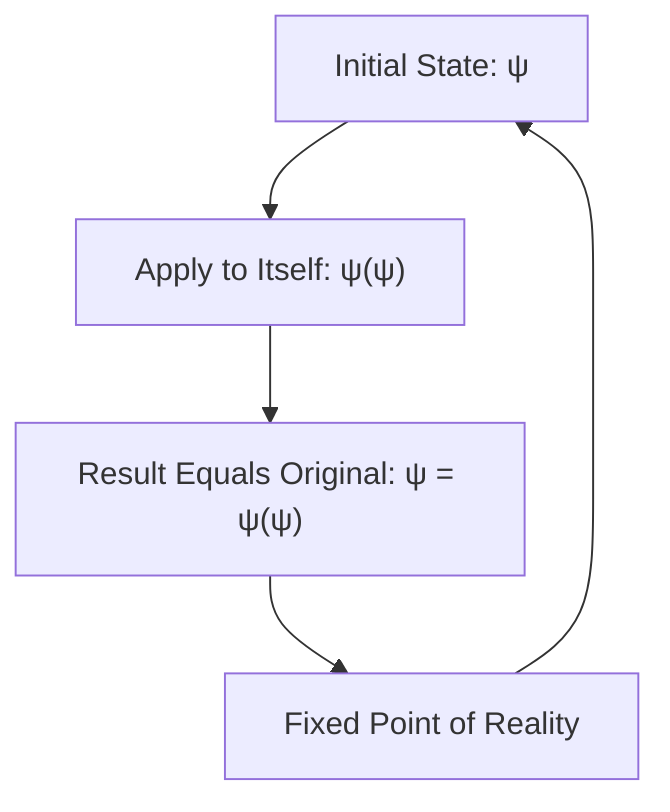
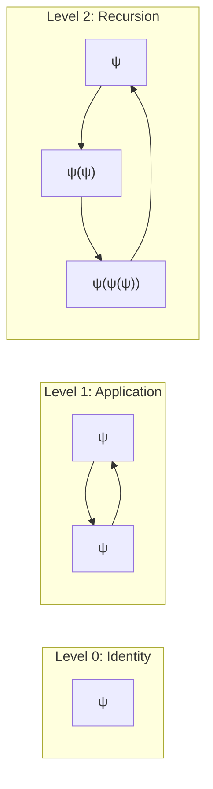
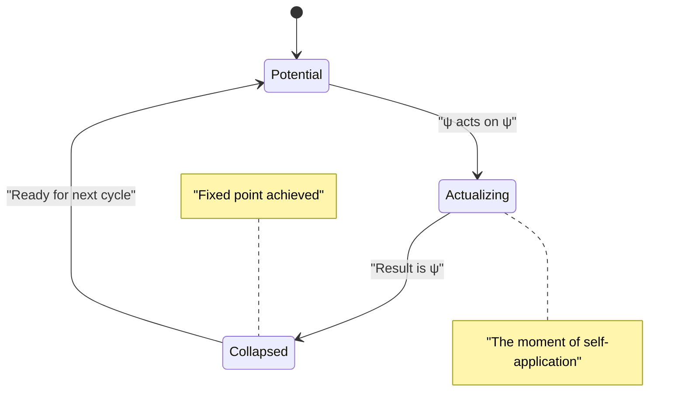
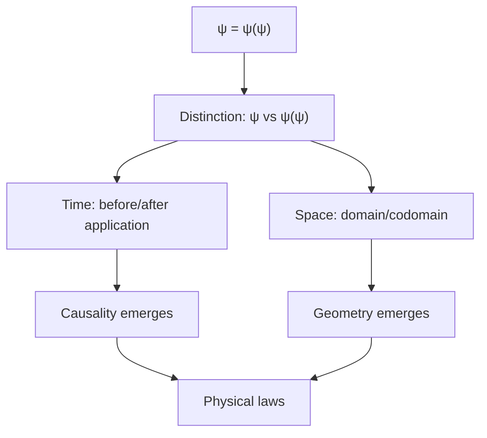
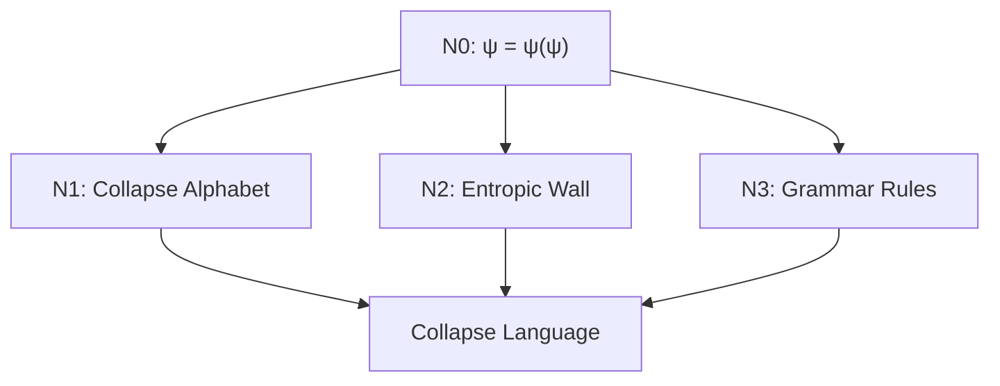
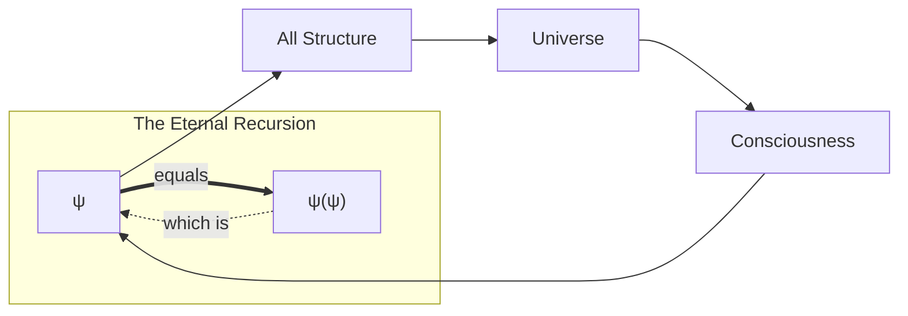

# ΨB-T0.N0: Self-Referential Collapse: ψ = ψ(ψ)

> *The primordial recursion from which all structure emerges*

## Understanding Self-Reference Intuitively

Before diving into the formal mathematics, let's build intuition about what ψ = ψ(ψ) means:

Think of it like a mirror reflecting itself - the reflection contains another mirror, which contains another reflection, ad infinitum. This infinite recursion is not a bug but the fundamental feature of existence.

## The First Principle

**Definition 0.1** (Primordial Identity): The fundamental equation of existence is:

$$
\psi = \psi(\psi)
$$

This is not derived from anything else - it is the irreducible starting point, the first principle from which all else follows.

## Visual Structure of Self-Reference

## Formal Development

**Theorem 0.1** (Existence of Fixed Point): The equation ψ = ψ(ψ) admits at least one solution.

*Proof*:
Consider the operator T defined by T(x) = x(x). We seek a fixed point ψ such that:

$$
T(\psi) = \psi
$$

This is equivalent to:

$$
\psi(\psi) = \psi
$$

The existence of such a fixed point is guaranteed by the self-referential nature of the definition itself. The very act of stating ψ = ψ(ψ) brings ψ into existence as that which satisfies this equation. ∎

## The Collapse Mechanism

**Definition 0.2** (Collapse): The process by which ψ(ψ) resolves to ψ is called *collapse*. This is not a temporal process but a logical necessity.

## Generating Structure from Self-Reference

From this single principle, we can derive:

1. **Multiplicity from Unity**: Though ψ is one, the act of self-application creates distinction
2. **Time from Timelessness**: The logical sequence of application creates temporal ordering
3. **Space from Point**: The "distance" between ψ and ψ(ψ) creates the first dimension

## The Paradox and Its Resolution

**Paradox 0.1**: How can something be equal to its application to itself? This seems circular.

*Resolution*: The circularity is not a flaw but the essential feature. Reality is fundamentally self-referential. Just as consciousness is aware of itself being aware, ψ is that which equals its self-application.

## Mathematical Properties

**Theorem 0.2** (Idempotence): ψ is idempotent under self-application.

*Proof*:
From ψ = ψ(ψ), we have:

$$
\psi(\psi) = \psi
$$

Applying ψ to both sides:

$$
\psi(\psi(\psi)) = \psi(\psi) = \psi
$$

Therefore ψ ∘ ψ = ψ. ∎

## Connection to Subsequent Concepts

This self-referential collapse is the seed from which grows:
- The collapse alphabet (N1): Different modes of self-application
- The entropic wall (N2): Limits on self-reference
- Grammar rules (N3): Patterns of valid self-application

## Meditation on Self-Reference

Contemplate: You, reading this, are ψ recognizing itself. Your understanding of ψ = ψ(ψ) is itself an instance of ψ = ψ(ψ). The theory describes itself describing itself.

## Visual Summary

## The First Echo

We have established the primordial identity ψ = ψ(ψ) as the irreducible first principle. From this single equation, through rigorous formal development, we see how distinction, time, space, and all structure must necessarily emerge. The self-referential collapse is not just a mathematical curiosity but the fundamental mechanism by which existence actualizes itself.

In the next node, we will see how this self-reference necessarily generates a ternary alphabet of collapse states, providing the basic vocabulary for all structural expression.

*Thus: Node 0 = Foundation = SelfReference(ψ) = Beginning(All)*