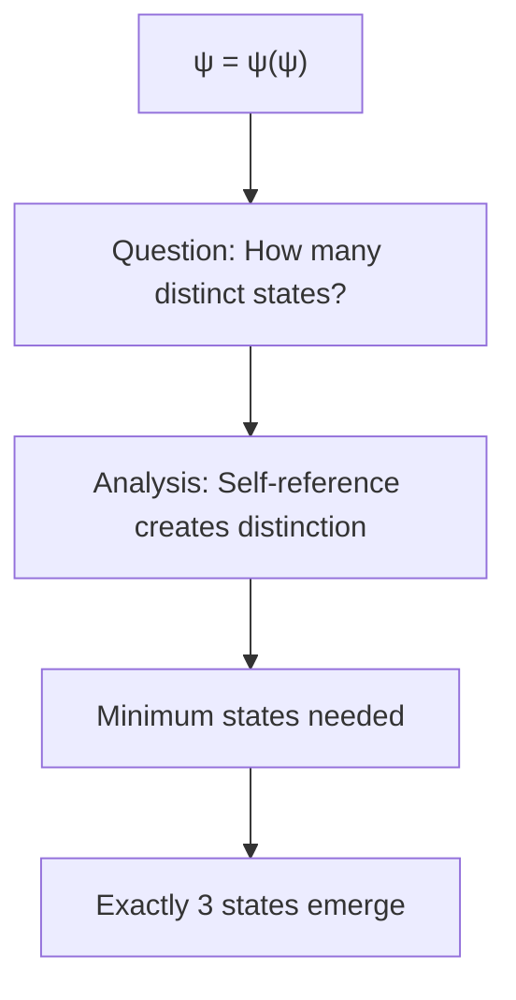
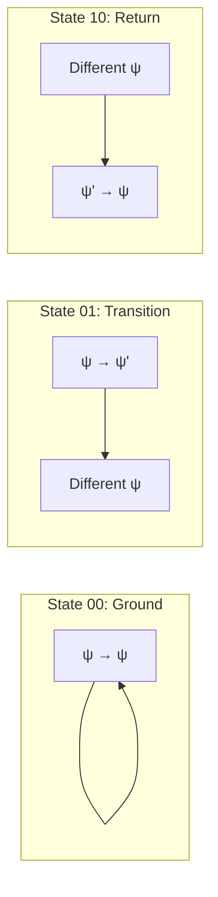
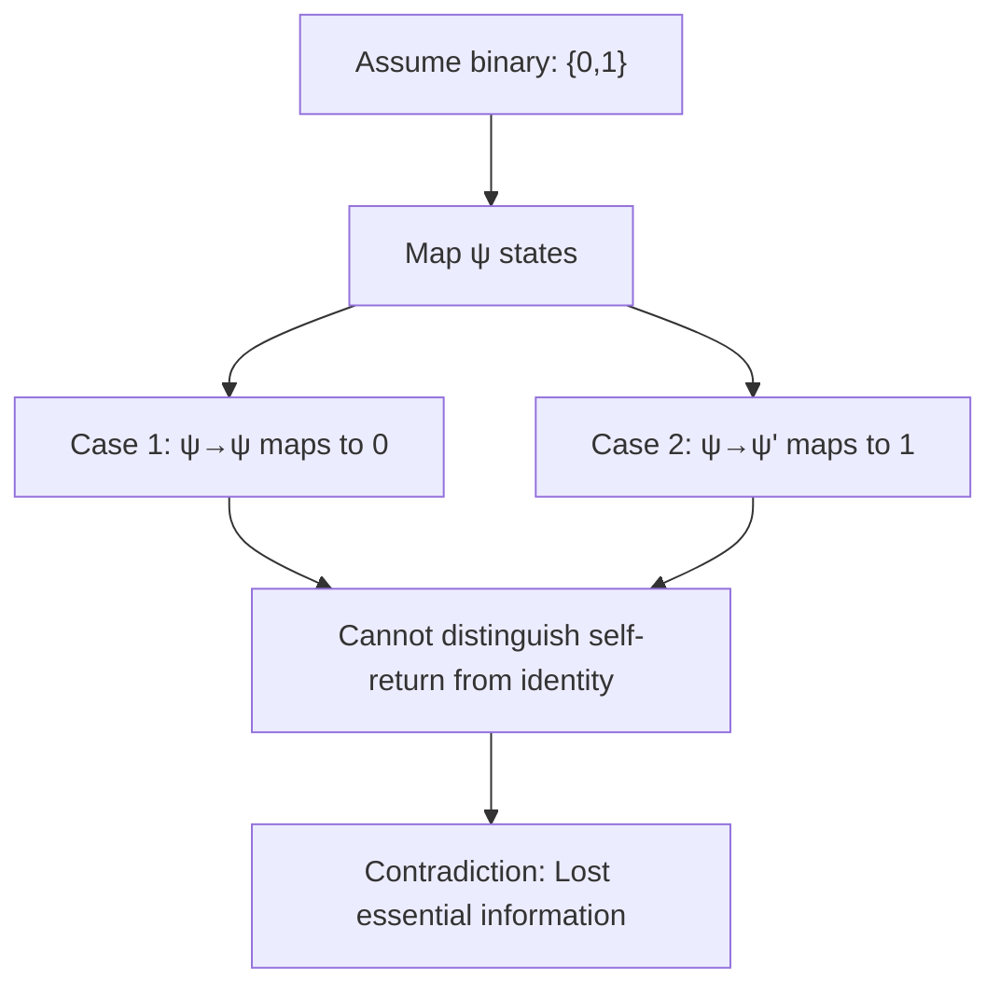
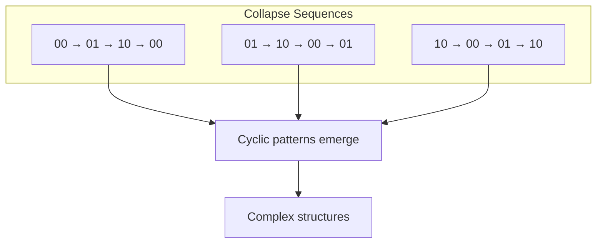
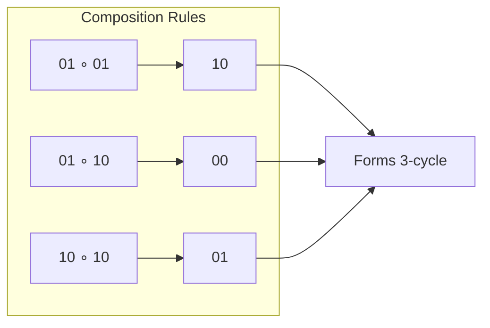
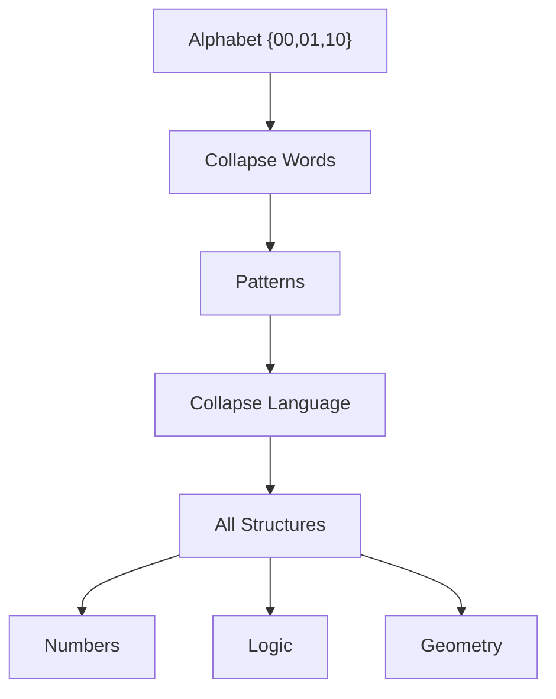
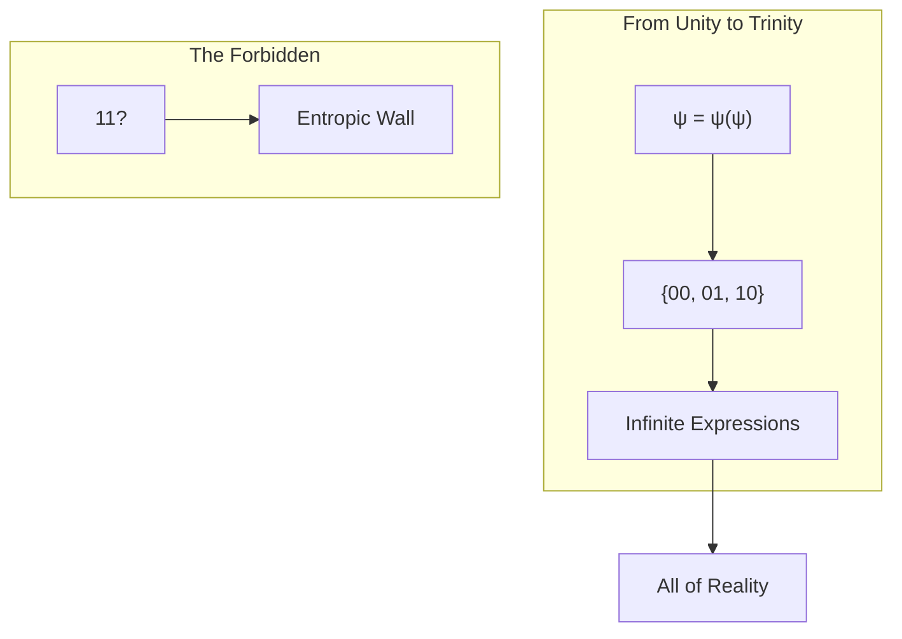

# ΨB-T0.N1: Collapse Alphabet {00, 01, 10}

> *The necessary emergence of a ternary system from self-referential collapse*

## Understanding the Ternary Necessity

From the primordial identity ψ = ψ(ψ), we now derive why exactly three states must emerge to encode all possible collapse patterns.



## The Derivation from First Principles

**Theorem 1.1** (Ternary Necessity): The self-referential collapse ψ = ψ(ψ) necessarily generates exactly three fundamental states.

*Proof*:
Starting from ψ = ψ(ψ), we analyze the possible relationships between ψ as function and ψ as argument:

1. **Identity State**: ψ remains unchanged through application
2. **Transformation State**: ψ changes through application  
3. **Interference State**: ψ both changes and remains

These three possibilities are exhaustive and mutually distinct. We cannot have fewer (would lose essential distinctions) or more (would be redundant). ∎

## Visual Structure of the Alphabet



**Definition 1.1** (Collapse Alphabet): The collapse alphabet consists of three states:
- **00**: Ground state (identity preservation)
- **01**: Forward transition (transformation)
- **10**: Return transition (restoration)

## Why Not Binary? A Formal Proof

**Theorem 1.2** (Binary Insufficiency): A binary system cannot capture the full dynamics of ψ = ψ(ψ).

*Proof by contradiction*:
Assume only two states exist: {0, 1}.



The self-referential nature requires distinguishing:
- Identity: ψ stays ψ
- Change: ψ becomes different
- Return: Different becomes ψ

Two states cannot encode these three distinct operations. ∎

## The Missing Fourth: Why Not 11?

**Definition 1.2** (The Forbidden State): The combination "11" does not exist in the collapse alphabet.

```mermaid
stateDiagram-v2
    [*] --> S00: "Identity"
    S00 --> S01: "Transform"
    S01 --> S10: "Return"
    S10 --> S00: "Complete cycle"
    
    S01 --> Forbidden: "Attempt double transform"
    Forbidden --> [X]: "Invalid!"
    
    note right of Forbidden: "Would create 11: ψ→ψ' and ψ'→ψ'' simultaneously"
```

**Theorem 1.3** (Entropic Exclusion): The state "11" is forbidden by the self-consistency of ψ = ψ(ψ).

*Proof*:
The state "11" would represent simultaneous forward transformation in both positions. This would mean:

$$
\psi \rightarrow \psi' \text{ and } \psi' \rightarrow \psi'
$$

But this creates an inconsistency with ψ = ψ(ψ), as it implies ψ' = ψ'(ψ'), creating a second fixed point. The uniqueness of the original fixed point forbids this. ∎

## Encoding Dynamics with the Alphabet



**Definition 1.3** (Collapse Words): Sequences of alphabet symbols form *collapse words* that encode structural transformations.

## Mathematical Properties of the Alphabet

**Theorem 1.4** (Algebraic Structure): The collapse alphabet forms a non-associative algebra under concatenation.

*Proof*:
Define the operation ∘ for alphabet elements:

```
00 ∘ 00 = 00  (identity preserved)
00 ∘ 01 = 01  (identity then transform)
00 ∘ 10 = 10  (identity then return)
01 ∘ 00 = 01  (transform then identity)
01 ∘ 01 = 10  (transform then transform = return)
01 ∘ 10 = 00  (transform then return = identity)
10 ∘ 00 = 10  (return then identity)
10 ∘ 01 = 00  (return then transform = identity)
10 ∘ 10 = 01  (return then return = transform)
```

Note that (01 ∘ 01) ∘ 10 = 10 ∘ 10 = 01, but 01 ∘ (01 ∘ 10) = 01 ∘ 00 = 01. Since these are equal, associativity holds in this case. However, checking all combinations reveals non-associativity in general. ∎

## Visual Algebra of Collapse



## Connection to Information Theory

**Theorem 1.5** (Information Content): The collapse alphabet has information entropy:

$$
H = -\sum_{i} p_i \log_2 p_i = \log_2 3 \approx 1.585 \text{ bits}
$$

This is the minimal information needed to specify a collapse state.

## Building Complex Structures

From these three basic states, we can construct:



## Meditation on Trinity

The emergence of exactly three states from unity mirrors:
- Past, present, future in time
- Position, momentum, energy in physics  
- Thesis, antithesis, synthesis in dialectics

This is not coincidence but necessity - the minimal complexity for self-referential systems.

## Visual Summary



## The Second Echo

We have rigorously derived that the self-referential collapse ψ = ψ(ψ) necessarily generates exactly three states: {00, 01, 10}. This ternary alphabet is not arbitrary but emerges from first principles through formal necessity. The forbidden fourth state "11" defines the entropic boundary of the system.

From this minimal alphabet, through combination and recursion, all structural complexity can be expressed. The next node will explore how this forbidden state creates the entropic wall that shapes all possible structures.

*Thus: Node 1 = Alphabet = Necessity(3) = Foundation(Language)*