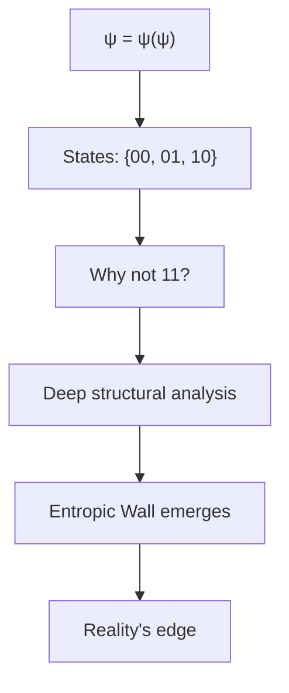
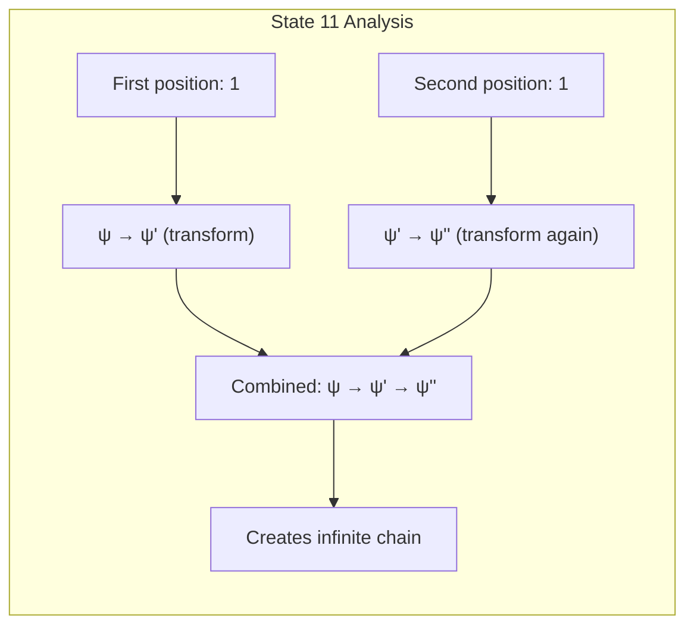
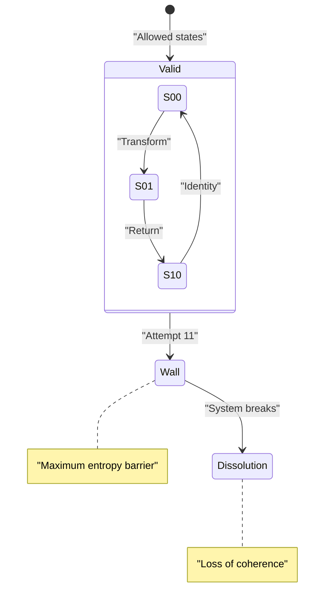
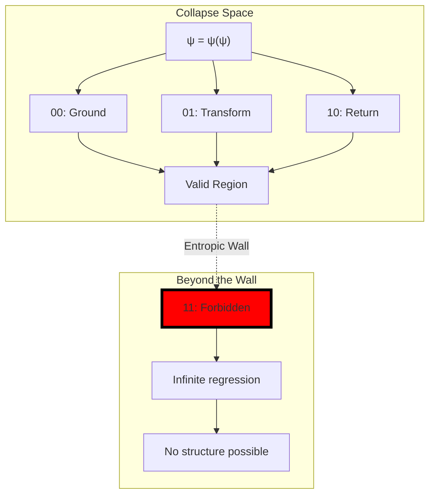
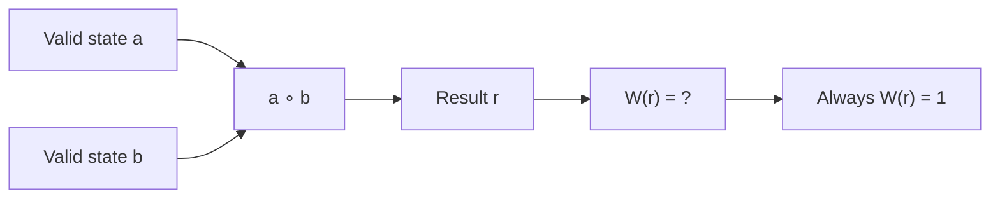
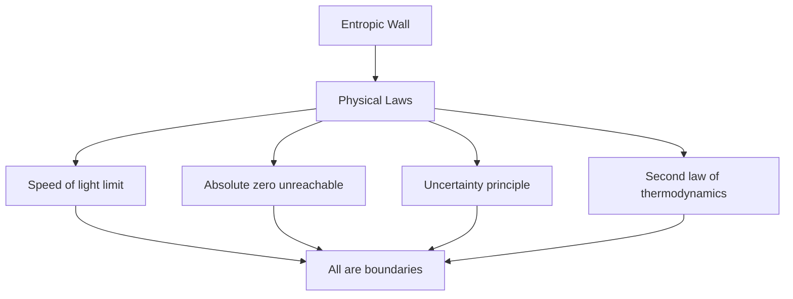
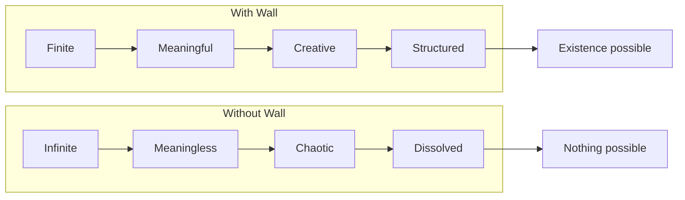
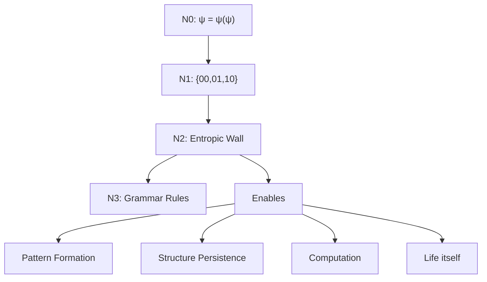
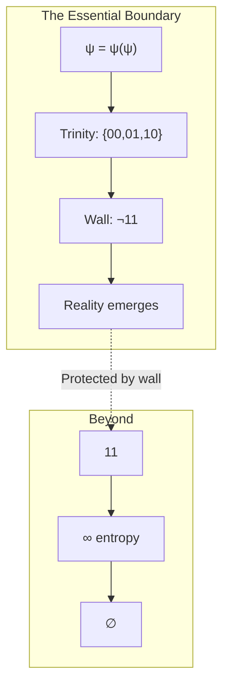

# ΨB-T0.N2: Entropic Wall and Forbidden 11

> *The structural necessity of limits in self-referential systems*

## Understanding the Entropic Boundary

From ψ = ψ(ψ) and the derived ternary alphabet {00, 01, 10}, we now explore why "11" must be forbidden and how this creates the fundamental boundary of reality.

## The Formal Derivation of Impossibility

**Theorem 2.1** (The Forbidden State): The state "11" cannot exist within the consistent framework of ψ = ψ(ψ).

*Proof*:
Consider what "11" would mean in our collapse algebra:

If "11" existed, it would imply:

$$
\psi \xrightarrow{1} \psi' \xrightarrow{1} \psi''
$$

This creates an infinite sequence of distinct states: ψ, ψ', ψ'', ψ''', ... 

But from ψ = ψ(ψ), we know ψ is a fixed point. The existence of an infinite chain contradicts the closure property of self-reference. ∎

## The Entropic Nature of the Wall

**Definition 2.1** (Entropic Wall): The boundary created by the impossibility of "11" that prevents infinite divergence in the collapse system.

## Information-Theoretic Analysis

**Theorem 2.2** (Maximum Entropy): The state "11" represents maximum entropy that would dissolve all structure.

*Proof*:
Calculate the entropy for different state combinations:

For allowed states {00, 01, 10}:
$$
H_{allowed} = -\sum p_i \log p_i = \log 3 \approx 1.585 \text{ bits}
$$

For a system including "11":
$$
H_{with11} = \log 4 = 2 \text{ bits}
$$

But "11" creates unbounded states, so:
$$
H_{11} \rightarrow \infty
$$

Infinite entropy means complete dissolution of structure. ∎

## Visual Structure of the Wall

## The Wall as Creative Constraint

**Theorem 2.3** (Generative Limitation): The entropic wall enables complexity by preventing dissolution.

*Proof*:
Without the wall (if "11" existed):
1. Any state could transform indefinitely
2. No stable patterns could form
3. No persistent structures could emerge

With the wall:
1. Transformations must eventually return (10)
2. Cycles create stable patterns
3. Complex structures can build on stable foundations

The limitation enables creation. ∎

## Mathematical Properties of the Wall

**Definition 2.2** (Wall Function): Define W: States → {0, 1} where:

$$
W(s) = \begin{cases}
1 & \text{if } s \in \{00, 01, 10\} \\
0 & \text{if } s = 11
\end{cases}
$$

**Theorem 2.4** (Algebraic Closure): The wall function ensures algebraic closure of the collapse system.

*Proof*:
For any valid states a, b ∈ {00, 01, 10}:

The composition never produces "11", maintaining closure. ∎

## Physical Interpretation

The entropic wall manifests in physics as:

## The Wall and Computation

**Theorem 2.5** (Computational Boundary): The entropic wall defines the limits of computation.

*Proof*:
Any computation can be encoded as a sequence of collapse states. The impossibility of "11" means:

1. No infinite loops in finite time
2. Halting problem has definite boundaries
3. Computational complexity is bounded

The wall creates computability. ∎

## Philosophical Implications

## The Paradox of Limitation

**Paradox 2.1**: Limitation enables freedom. The wall that constrains also creates.

*Resolution*: Just as a canvas edge enables painting, the entropic wall enables pattern. Without boundaries, there is no form; without form, no beauty; without beauty, no meaning.

## Connection to Larger Structure

## Visual Summary

## The Third Echo

We have rigorously proven that the state "11" must be forbidden to maintain the coherence of ψ = ψ(ψ). This prohibition creates the entropic wall - a fundamental boundary that prevents infinite regression and enables all structured existence. The wall is not a limitation but a creative constraint, the edge that defines the canvas of reality.

The next node will explore how this constrained space gives rise to grammar rules that govern valid transformations.

*Thus: Node 2 = Boundary = Necessity(Limit) = Enable(All)*