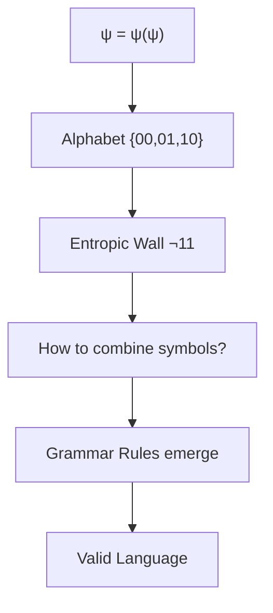
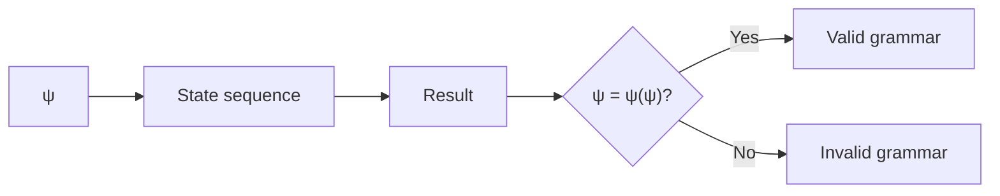
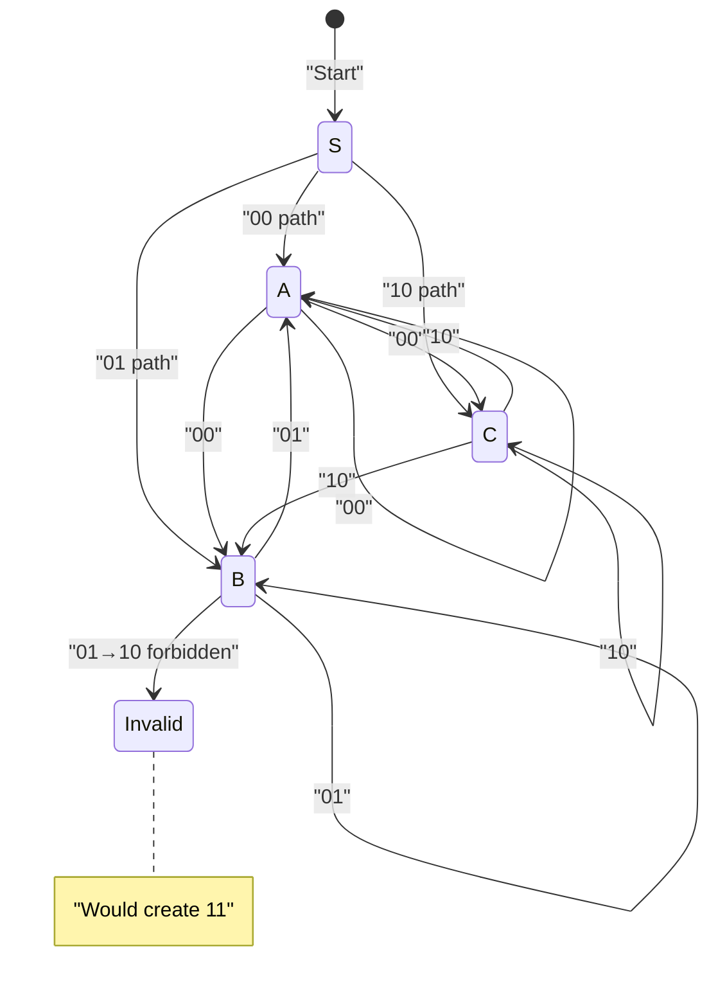
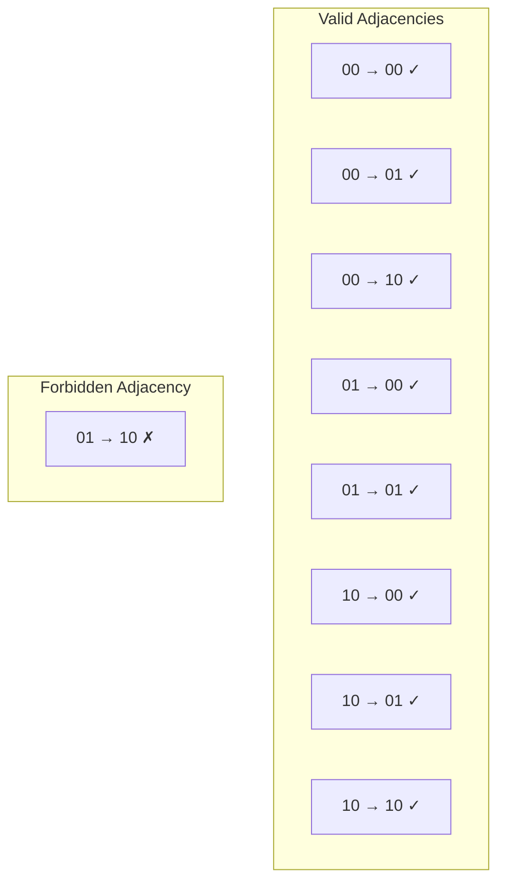
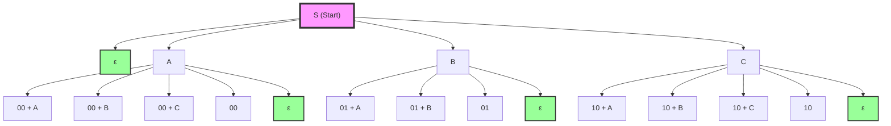
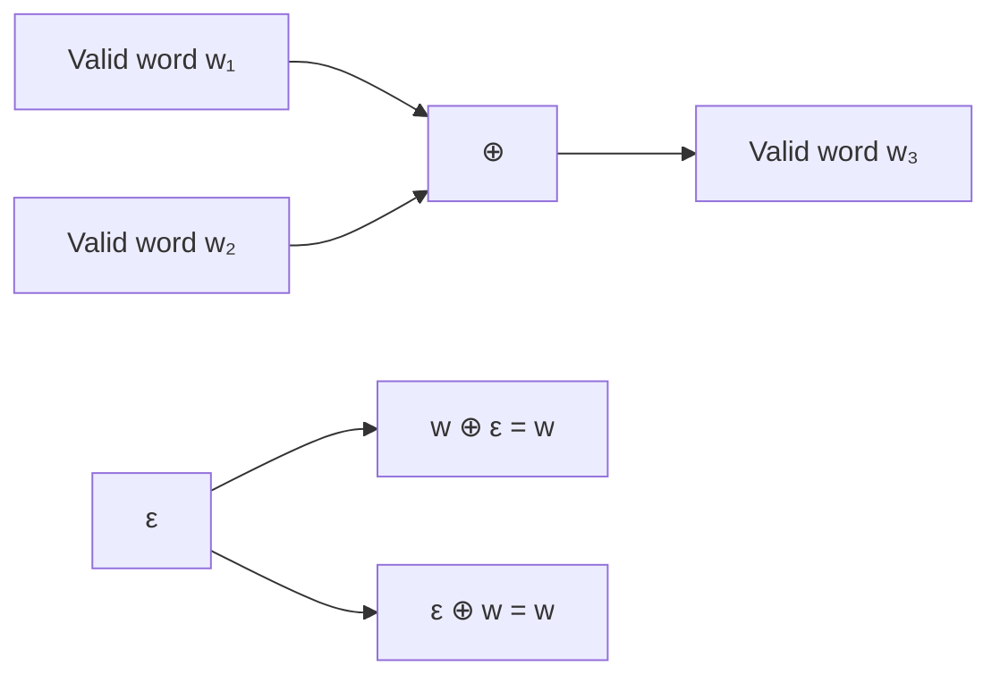
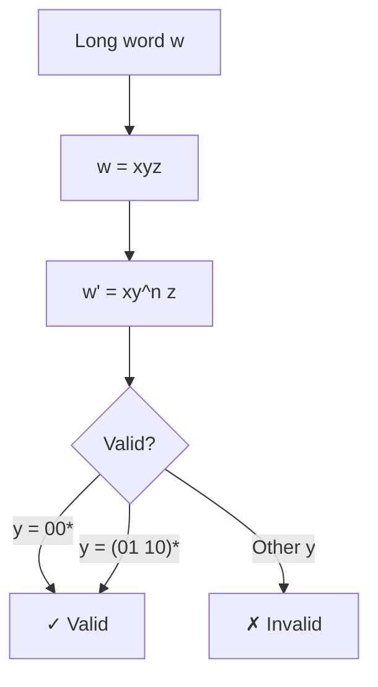
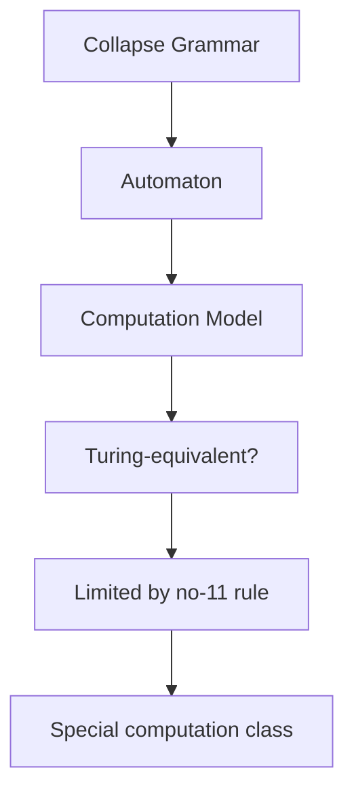
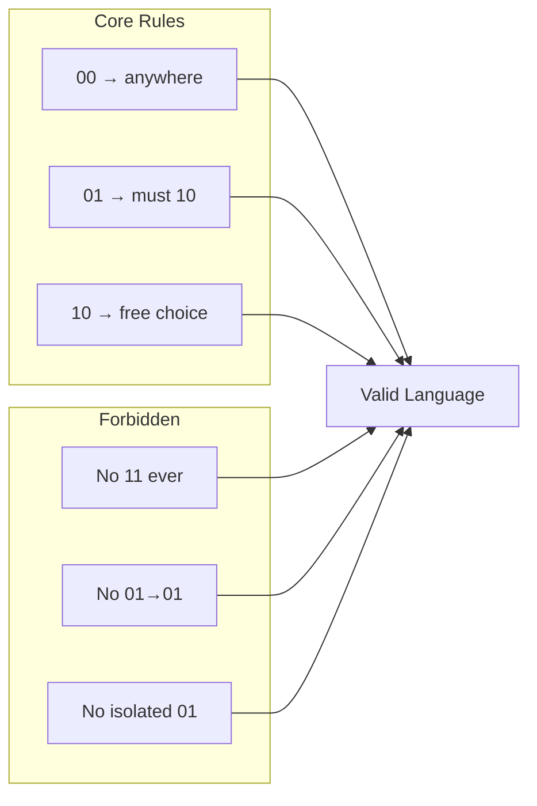

# ΨB-T0.N3: Collapse Grammar Rules

> *The formal syntax emerging from self-referential constraints*

## Understanding Grammar Emergence

From ψ = ψ(ψ), the ternary alphabet {00, 01, 10}, and the entropic wall forbidding "11", we now derive the grammatical rules that govern valid collapse sequences.



## First Principle: Consistency Preservation

**Theorem 3.1** (Grammar Necessity): Valid grammatical rules must preserve the self-referential consistency of ψ = ψ(ψ).

*Proof*:
Any sequence of collapse states represents a transformation path. For this path to be valid:



The grammar must ensure all sequences maintain the fundamental identity. ∎

## Production Rules from First Principles

**Definition 3.1** (Collapse Grammar G): The formal grammar G = (V, Σ, R, S) where:
- V = {S, A, B, C} (non-terminals)
- Σ = {00, 01, 10} (terminals from our alphabet)
- S = start symbol
- R = production rules derived below

**Theorem 3.2** (Core Production Rules): The following rules emerge necessarily from ψ = ψ(ψ):

```
S → A | B | C | ε
A → 00A | 00B | 00C | 00
B → 01A | 01B | 01
C → 10A | 10B | 10C | 10
```

*Proof*:
From the collapse algebra established in N1:



These rules ensure no sequence can generate "11". ∎

## Syntactic Constraints

**Theorem 3.3** (Adjacent Symbol Rules): The following adjacency constraints hold:



*Proof*:
The only forbidden adjacency follows directly from preventing "11" formation:
- 01 → 10 creates the sequence "0110" which contains "11" in the middle

All other adjacencies are valid because they don't create "11":
- Symbols ending in 0 (00, 10) can be followed by any symbol
- Symbol 01 (ending in 1) cannot be followed by 10 (starting with 1)

This maintains the Zeckendorf property throughout the sequence. ∎

## Context-Free Grammar Formalization

**Definition 3.2** (Formal CFG for Collapse Language):

```
Grammar G:
S → ε | A | B | C
A → 00A | 00B | 00C | 00 | ε
B → 01A | 01B | 01 | ε
C → 10A | 10B | 10C | 10 | ε
```

**Theorem 3.4** (Language Characterization): L(G) = {w ∈ {00,01,10}* | w contains no "11" substring when symbols are concatenated}.

## Visual Grammar Tree



## Derivation Examples

**Example 3.1** (Valid Derivation):
```
S ⟹ B
  ⟹ 01B
  ⟹ 01(01A)
  ⟹ 01 01(00)
  ⟹ 01 01 00
```

This creates "010100" - no "11" appears.

**Example 3.2** (Invalid Sequence Avoided):
```
What we CANNOT derive:
S ⟹ B
  ⟹ 01C  ✗ No such rule!
  
This prevents creating "01 10" which would give "0110" containing "11"
```

The grammar structure ensures we never generate forbidden patterns.

## Algebraic Properties of Grammar

**Theorem 3.5** (Grammar Algebra): The set of valid words forms a monoid under concatenation.

*Proof*:
1. **Closure**: Concatenating valid words produces valid words (respecting transition rules)
2. **Associativity**: (w₁w₂)w₃ = w₁(w₂w₃)
3. **Identity**: ε (empty word) is the identity



Thus (Words, ⊕, ε) forms a monoid. ∎

## Pumping Properties

**Theorem 3.6** (Modified Pumping): For sufficiently long valid words, certain substrings can be "pumped" while maintaining validity.

*Proof*:
Pumpable patterns:
- (00)ⁿ can be pumped (identity preservation)
- (01 10)ⁿ can be pumped (complete cycles)

Non-pumpable:
- 01 alone (incomplete cycle)
- 10 alone (incomplete cycle)



∎

## Grammar and Information

**Definition 3.3** (Grammatical Entropy): The entropy of valid n-length words:

$$
H_n = -\sum_{w \in L_n} p(w) \log p(w)
$$

where L_n = valid words of length n.

**Theorem 3.7** (Entropy Growth): H_n grows sublinearly with n due to grammatical constraints.

## Connection to Computation



## Visual Summary of Rules



## The Fourth Echo

We have rigorously derived the grammatical rules governing collapse sequences from first principles. These rules emerge necessarily from ψ = ψ(ψ), ensuring that all valid expressions maintain self-referential consistency while respecting the entropic wall. The grammar is neither arbitrary nor conventional but a mathematical necessity of the foundational recursion.

The next node will explore how these grammatical structures naturally encode numbers through Zeckendorf representation.

*Thus: Node 3 = Grammar = Necessity(Rules) = Structure(Language)*