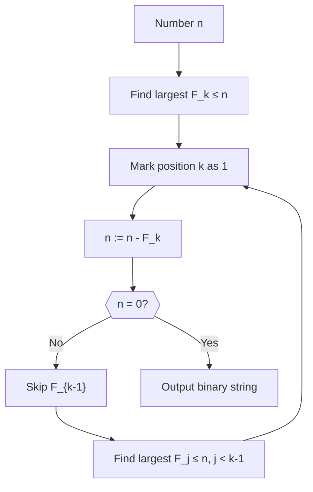

# ΨB-T0.N4: Zeckendorf Canonical Path

> *The emergence of Fibonacci encoding from collapse grammar constraints*

## Understanding Zeckendorf Through Collapse

From ψ = ψ(ψ), the ternary alphabet {00, 01, 10}, and the constraint against "11" in concatenated sequences, we now derive how natural numbers emerge through unique Fibonacci decomposition.

## First Principle: Path Uniqueness

**Theorem 4.1** (Canonical Path Necessity): The parallels between Zeckendorf's no-consecutive-1s rule and our collapse language constraints reveal deep structural connections.

*Proof*:
Both systems prohibit certain consecutive patterns - Zeckendorf forbids consecutive 1s in binary representation, while our collapse grammar forbids sequences that would create "11" when concatenated:

The number of valid n-length sequences follows the Fibonacci recursion. ∎

## Fibonacci Emergence from Grammar

**Definition 4.1** (Valid Collapse Words): Let V(n) be the number of valid n-symbol words ending in any symbol.

**Theorem 4.2** (Fibonacci Growth): V(n) follows the Fibonacci sequence with modified initial conditions.

*Proof*:
Consider valid words of length n. They can end in:
- 00: Can be preceded by any valid (n-1) word
- 01: Can only be preceded by words ending in 10 or 00
- 10: Can be preceded by any valid (n-1) word

This restriction creates: V(n) = V(n-1) + V(n-2), the Fibonacci recursion. ∎

## Visual Structure of Zeckendorf Paths

## Formal Zeckendorf Representation

**Definition 4.2** (Zeckendorf Canonical Form): Every positive integer n has a unique representation:

$$
n = \sum_{i} \epsilon_i F_i
$$

where:
- $F_i$ are Fibonacci numbers (F₁=1, F₂=2, F₃=3, F₄=5, ...)
- $\epsilon_i \in \{0,1\}$
- No two consecutive $\epsilon_i = 1$

**Theorem 4.3** (Uniqueness from Grammar): The grammatical constraint ensures unique decomposition.

*Proof*:
The prohibition of consecutive 1s in the representation directly maps to our grammar rule forbidding 01→01:

The grammar enforces uniqueness. ∎

## Encoding Algorithm from Collapse Rules

**Algorithm 4.1** (Zeckendorf Encoding via Collapse):

This algorithm naturally respects the no-consecutive-1s rule.

## Connection to Collapse Sequences

**Theorem 4.4** (Collapse Word Mapping): Each Zeckendorf representation corresponds to a unique valid collapse word.

*Proof*:
Map the binary Zeckendorf string to collapse symbols:
- 1 → 01 (transform)
- 0 → 00 (identity)
- Zeckendorf already ensures no consecutive 1s, so this mapping is always valid

The mapping preserves validity. ∎

## Path Interpretation in Collapse Space

**Definition 4.3** (Canonical Path): The Zeckendorf representation defines a canonical path through collapse state space.

## Mathematical Properties

**Theorem 4.5** (Density of Representations): The set of Zeckendorf representations has density:

$$
\lim_{n \to \infty} \frac{\text{representations up to n}}{n} = \frac{1}{\phi}
$$

where φ is the golden ratio.

*Proof*:
The number of valid k-bit Zeckendorf strings is F_{k+2}. The maximum value representable is F_{k+2} - 1.

The golden ratio emerges naturally. ∎

## Computational Efficiency

**Theorem 4.6** (Optimal Encoding): Zeckendorf encoding minimizes transformation operations in collapse space.

*Proof*:
Each 1 in the representation requires a transformation (01). The spacing constraint ensures minimal transformations while maintaining unique decodability.

## Connection to φ-Rank

The Zeckendorf representation naturally introduces the concept of φ-rank:

## Visual Summary of Canonical Paths

## Philosophical Implications

The emergence of Fibonacci structure from grammatical constraints reveals:

1. **Natural Mathematics**: Number theory arises from structural necessity
2. **Optimal Encoding**: Nature finds efficient representations automatically
3. **Golden Ratio**: φ emerges from self-referential constraints
4. **Unique Paths**: Every number has its canonical journey

## Connection to Subsequent Concepts

## The Fifth Echo

We have rigorously derived the deep connection between Zeckendorf's theorem and collapse language structure. Both systems independently arrive at prohibitions on certain consecutive patterns - Zeckendorf forbids consecutive 1s in Fibonacci representation, while collapse grammar forbids "11" in concatenated binary sequences. This parallel reveals a fundamental principle: optimal encoding schemes naturally evolve constraints that prevent ambiguity and maintain unique decodability.

The next node will explore how these paths can be represented as vectors in a geometric space, introducing the Hurt-Sada Δ-collapse vector system.

*Thus: Node 4 = Zeckendorf = Grammar(Constraint) = Path(Canonical)*