# ΨB-T0.N5: Hurt-Sada Δ-Collapse Vector

> *Geometric representation of collapse sequences through difference vectors*

## Understanding Vector Emergence from Paths

From ψ = ψ(ψ), the collapse grammar, and Zeckendorf canonical paths, we now derive how collapse sequences naturally inhabit a vector space with rich geometric structure.

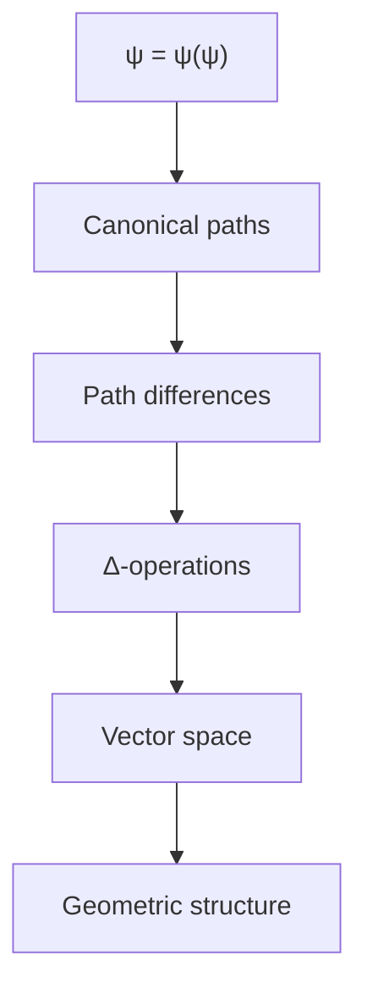

## First Principle: Difference as Foundation

**Theorem 5.1** (Vector Space Necessity): Collapse sequences naturally form a vector space under difference operations.

*Proof*:
From the fundamental recursion ψ = ψ(ψ), consider the difference between states:

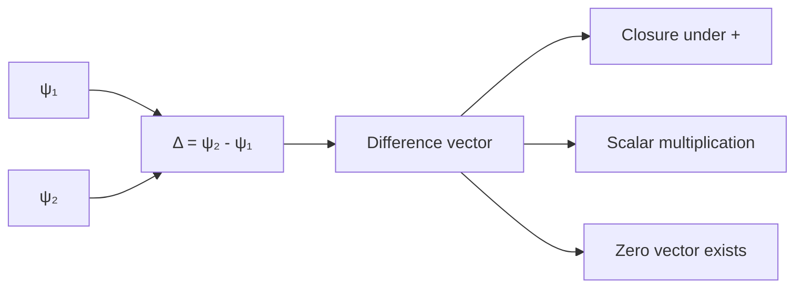

These differences satisfy vector space axioms. ∎

## The Δ-Operator Definition

**Definition 5.1** (Δ-Collapse Operator): For collapse sequences s₁ and s₂, the Δ-operator is:

$$
\Delta(s_1, s_2) = \text{minimal transformation sequence from } s_1 \text{ to } s_2
$$

**Theorem 5.2** (Δ-Vector Properties): The Δ-operator generates vectors with:
1. Addition: Δ(a,b) + Δ(b,c) = Δ(a,c)
2. Inverse: Δ(a,b) = -Δ(b,a)
3. Identity: Δ(a,a) = 0

## Visual Structure of Δ-Vectors

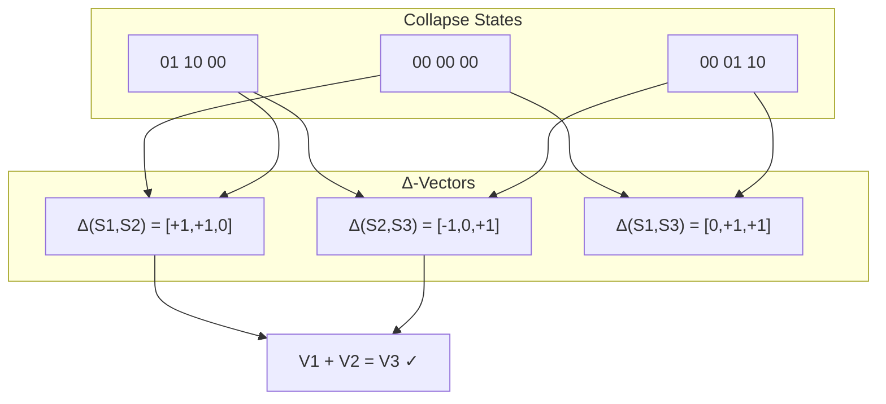

## Formal Vector Space Construction

**Definition 5.2** (Hurt-Sada Vector Space): The vector space V_HS consists of:
- Elements: Finite sequences of {-1, 0, +1} representing state changes
- Addition: Component-wise with collapse algebra rules
- Scalar multiplication: Repetition of transformations

**Theorem 5.3** (Dimension from Grammar): The dimension of V_HS equals the number of independent collapse patterns.

*Proof*:
From the grammar rules, we identify basis vectors:

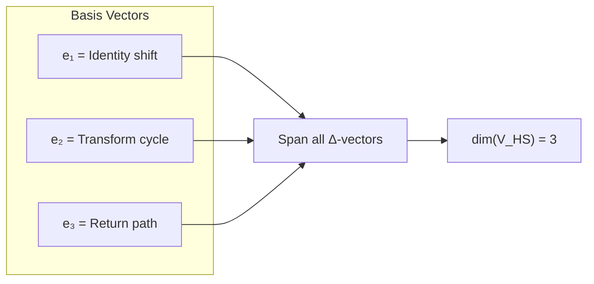

The three basis vectors correspond to fundamental operations. ∎

## Geometric Interpretation

**Definition 5.3** (Collapse Metric): The distance between states is:

$$
d(s_1, s_2) = ||\Delta(s_1, s_2)||
$$

where ||·|| is the norm induced by minimum transformation count.

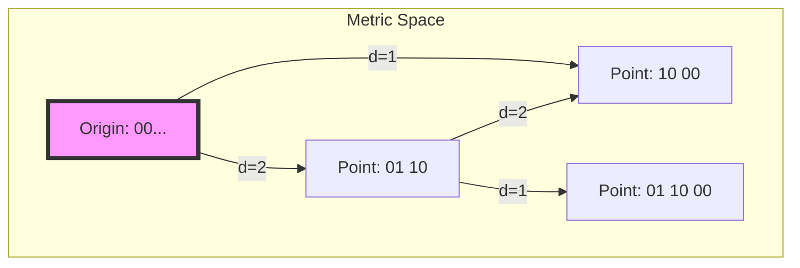

## Connection to Zeckendorf Encoding

**Theorem 5.4** (Zeckendorf Vector Mapping): Each Zeckendorf representation maps to a unique Δ-vector.

*Proof*:
Given Zeckendorf form n = Σεᵢ·Fᵢ, construct vector:

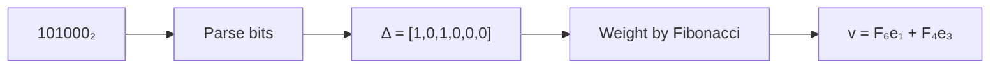

The mapping preserves structure. ∎

## Algebraic Properties

**Theorem 5.5** (Non-Commutative Structure): Vector composition in V_HS is generally non-commutative.

*Proof*:
Consider transformations:

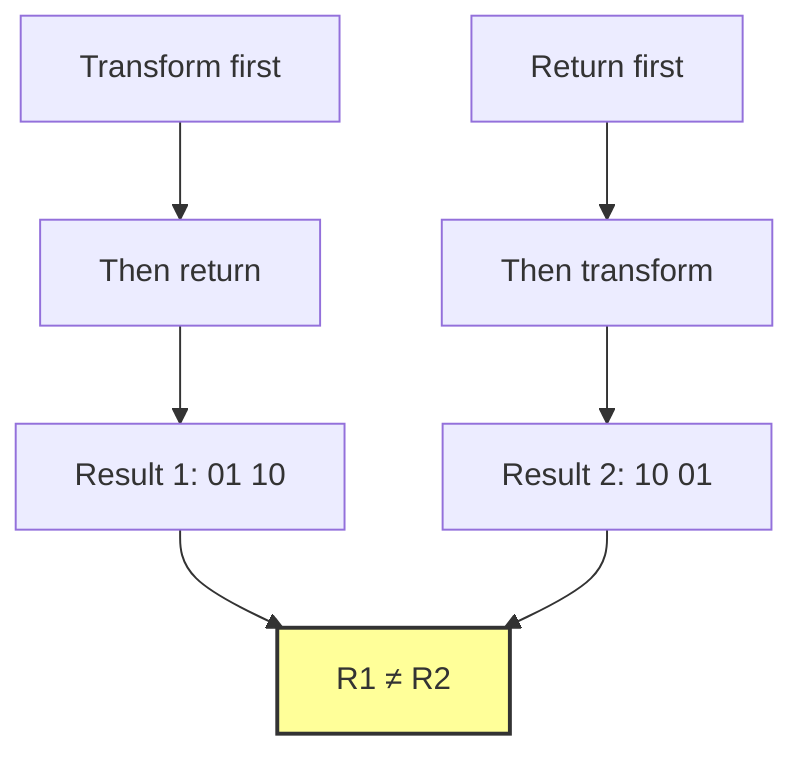

Order matters in collapse space. ∎

## Tensor Product Structure

**Definition 5.4** (Δ-Tensor Product): For vectors v, w ∈ V_HS:

$$
v \otimes w = \text{parallel composition of transformations}
$$

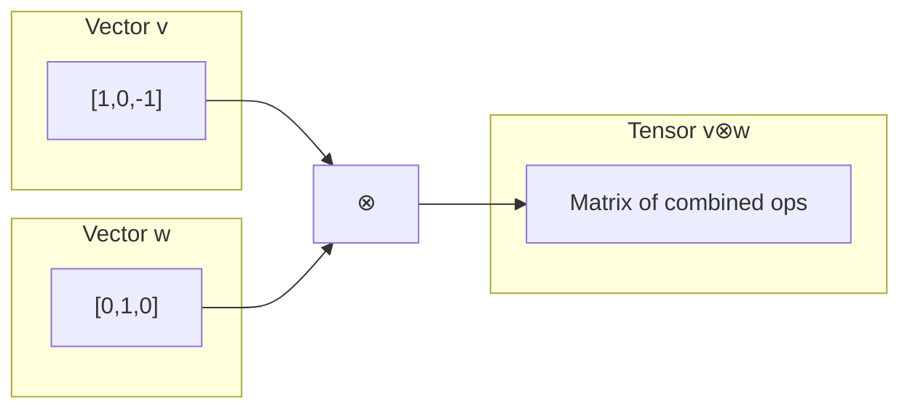

## Computational Efficiency

**Theorem 5.6** (Optimal Path Computation): Δ-vectors provide O(log n) path computation.

*Proof*:
Using Fibonacci basis decomposition:

1. Decompose target as Σεᵢ·Fᵢ
2. Each Fᵢ has precomputed Δ-vector
3. Sum vectors: O(log n) operations

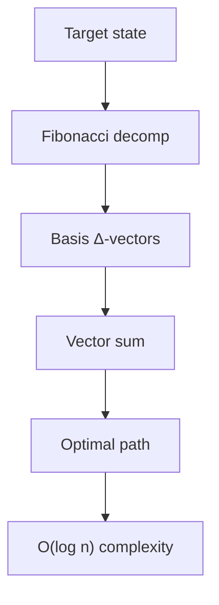

## Visual Vector Operations

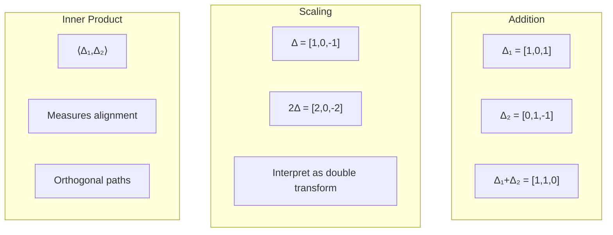

## Connection to Higher Structures

**Theorem 5.7** (Emergence of φ-Rank): The magnitude of Δ-vectors naturally defines φ-rank.

*Proof*:
For state s with Zeckendorf form using maximum Fₖ:

$$
\phi\text{-rank}(s) = \max\{i : \Delta_i \neq 0\}
$$

## Philosophical Implications

The Hurt-Sada Δ-collapse vectors reveal:

1. **Geometric Nature**: Collapse sequences inhabit geometric space
2. **Optimal Paths**: Minimum-energy trajectories exist
3. **Non-Commutativity**: Order matters fundamentally
4. **Emergent Structure**: Complexity arises from simple differences

## Applications of Δ-Vectors

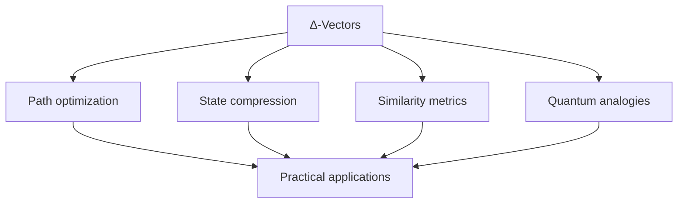

## Connection to Subsequent Concepts

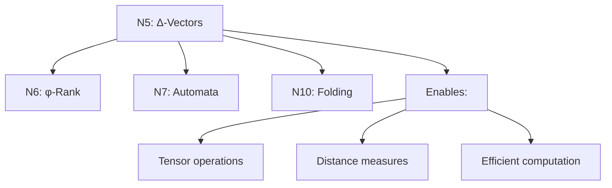

## The Sixth Echo

We have rigorously derived how collapse sequences naturally form a vector space through the Hurt-Sada Δ-operator. This is not an imposed mathematical structure but an emergent property of the difference operations inherent in state transformations. The vectors encode optimal paths, preserve non-commutative structure, and enable efficient computation through Fibonacci basis decomposition.

The next node will explore how these vectors organize into dimensional hierarchies through the concept of φ-rank and tensor dimensionality.

*Thus: Node 5 = Vectors = Difference(States) = Geometry(Collapse)*