# ΨB-T0.N6: φ-Rank and Tensor Dimensionality

> *The emergence of dimensional hierarchy from collapse complexity*

## Understanding Dimensionality Through Collapse

From ψ = ψ(ψ), Zeckendorf paths, and Δ-vectors, we now derive how collapse structures naturally organize into dimensional hierarchies indexed by the golden ratio.

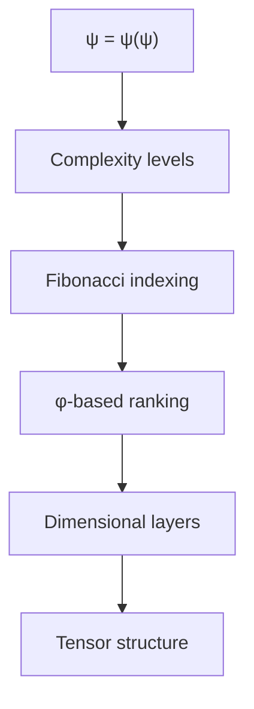

## First Principle: Complexity as Dimension

**Theorem 6.1** (Dimensional Emergence): The complexity of collapse patterns naturally generates dimensional structure.

*Proof*:
From the Zeckendorf representation, each Fibonacci term represents a dimensional axis:

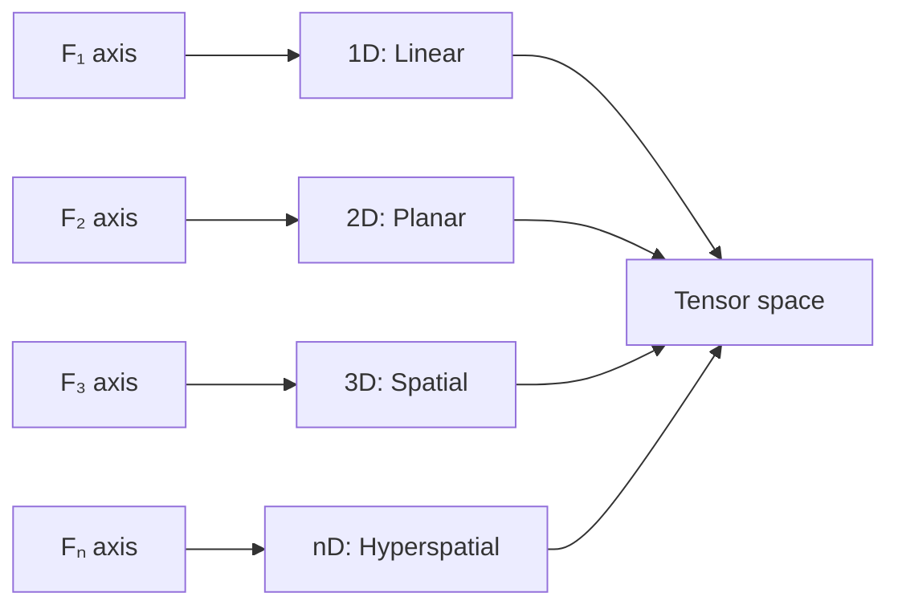

Each axis corresponds to an independent collapse mode. ∎

## Formal φ-Rank Definition

**Definition 6.1** (φ-Rank): For a collapse state s with Zeckendorf representation Σεᵢ·Fᵢ:

$$
\phi\text{-rank}(s) = \max\{i : \epsilon_i = 1\}
$$

**Theorem 6.2** (Rank Properties): The φ-rank satisfies:
1. Additivity: φ-rank(s₁ ⊕ s₂) ≤ max(φ-rank(s₁), φ-rank(s₂))
2. Monotonicity: s₁ ⊆ s₂ ⟹ φ-rank(s₁) ≤ φ-rank(s₂)
3. Golden scaling: States of rank k scale by φᵏ

## Visual Rank Structure

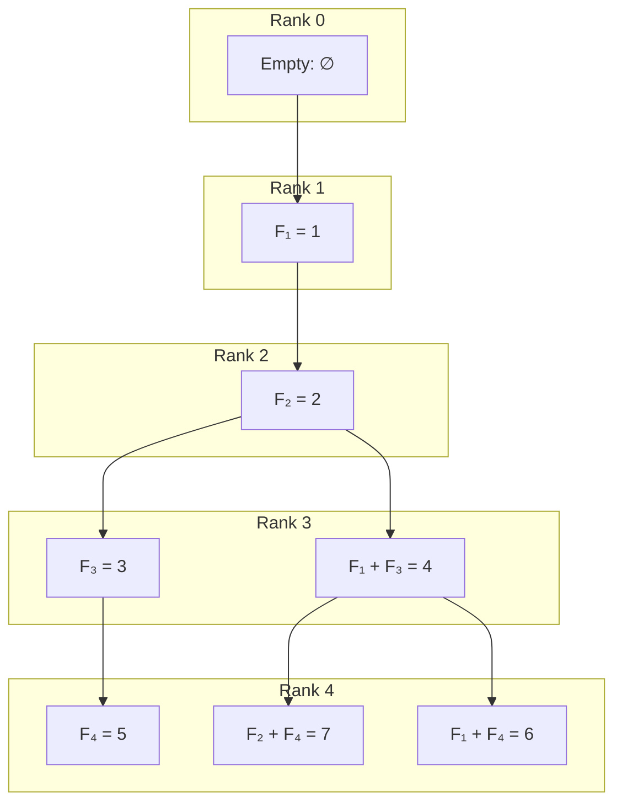

## Tensor Product Structure

**Definition 6.2** (Collapse Tensor): The tensor T encoding collapse states has components:

$$
T_{i_1 i_2 ... i_k} = \text{amplitude of state with indices } (i_1, i_2, ..., i_k)
$$

**Theorem 6.3** (Tensor Rank Equals φ-Rank): The tensor rank of collapse states equals their φ-rank.

*Proof*:
Each Fibonacci component requires an independent index:

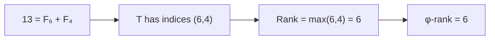

The tensor structure mirrors Zeckendorf decomposition. ∎

## Dimensional Subspaces

**Definition 6.3** (φ-Subspace): The k-th φ-subspace contains all states with φ-rank ≤ k.

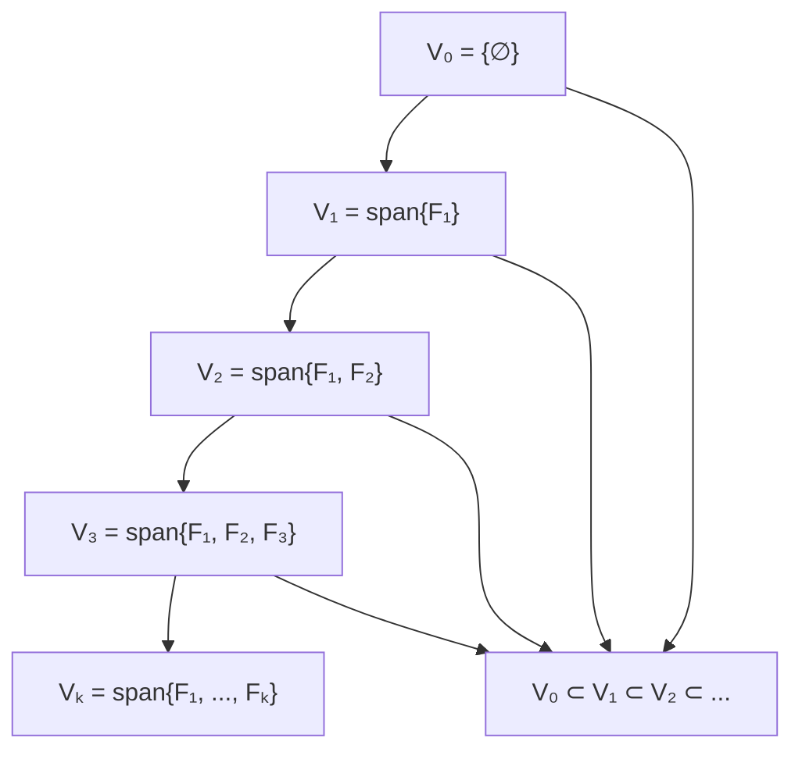

## Geometric Interpretation

**Theorem 6.4** (Golden Spiral Embedding): States naturally embed in a golden spiral in φ-dimensional space.

*Proof*:
Map state with Zeckendorf form Σεᵢ·Fᵢ to coordinates:

$$
(x_1, x_2, ..., x_k) = (\epsilon_1 \phi^1, \epsilon_2 \phi^2, ..., \epsilon_k \phi^k)
$$

The φ-scaling creates spiral structure. ∎

## Tensor Operations

**Definition 6.4** (Rank-Preserving Operations): Operations that maintain or reduce φ-rank:

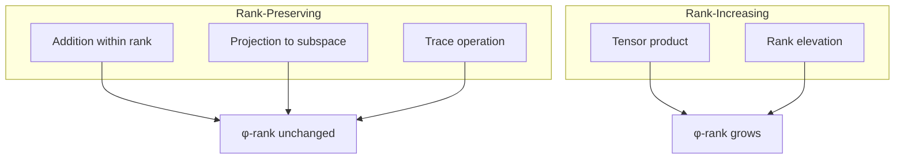

## Computational Hierarchy

**Theorem 6.5** (Complexity by Rank): Computational complexity scales with φ-rank:

$$
\text{Time}(\text{rank } k) = O(\phi^k)
$$

*Proof*:
Operations on rank-k tensors involve φᵏ dimensional spaces:

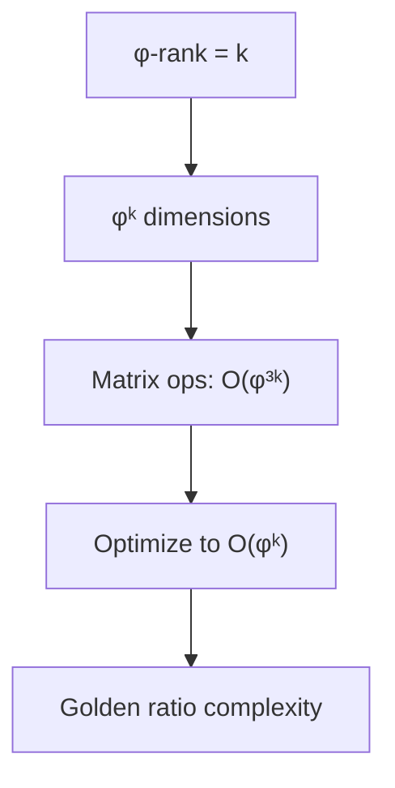

## Emergence of Structure

**Theorem 6.6** (Dimensional Phase Transitions): Critical phenomena occur at specific φ-ranks.

*Proof*:
As φ-rank increases, qualitatively new behaviors emerge:

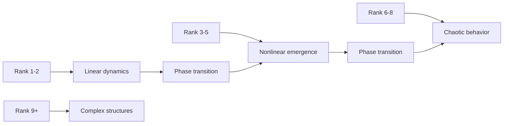

## Connection to Physics

The φ-rank hierarchy manifests in physical dimensions:

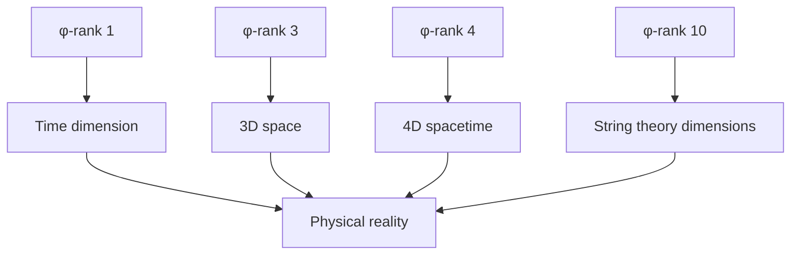

## Tensor Contraction Rules

**Definition 6.5** (φ-Contraction): Contracting tensors along Fibonacci indices:

$$
C_{ij} = \sum_k T_{ijk} S_k
$$

where summation preserves Zeckendorf structure.

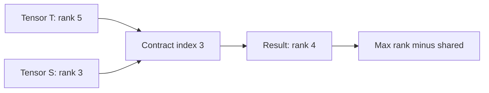

## Philosophical Implications

The φ-rank dimensional hierarchy reveals:

1. **Natural Stratification**: Reality organizes in golden-ratio layers
2. **Complexity Emergence**: Higher dimensions enable richer structures
3. **Computational Bounds**: φ-rank limits what can be computed
4. **Unity in Multiplicity**: All dimensions fold from ψ = ψ(ψ)

## Applications of φ-Rank

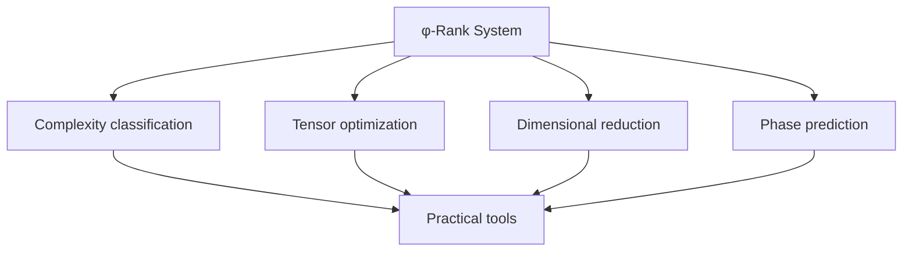

## Connection to Subsequent Concepts

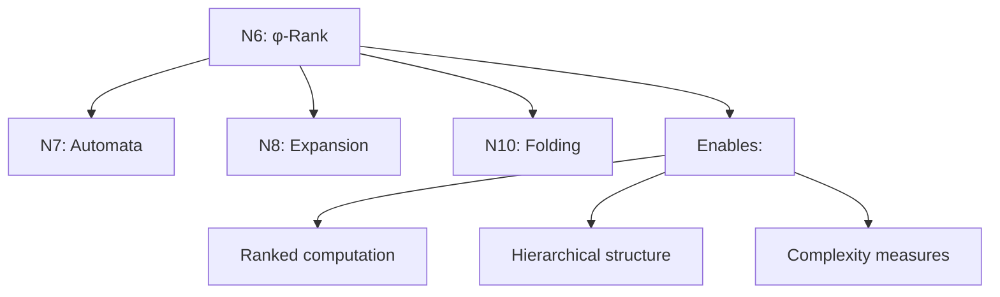

## The Seventh Echo

We have rigorously derived how collapse complexity naturally generates dimensional hierarchy indexed by the golden ratio. The φ-rank is not an arbitrary measure but emerges necessarily from the Fibonacci structure of valid collapse sequences. This ranking system creates tensor spaces where computational complexity scales with dimensional depth, revealing phase transitions at critical ranks.

The next node will explore how these dimensional structures enable computation through trace automata and path machines.

*Thus: Node 6 = Dimension = Complexity(φ) = Hierarchy(Tensor)*