# ΨB-T0.N7: Trace Automaton and Path Machines

> *Computational models emerging from collapse dynamics*

## Understanding Computation Through Collapse

From ψ = ψ(ψ), the dimensional hierarchy, and vector operations, we now derive how computation naturally emerges as directed collapse through state space.

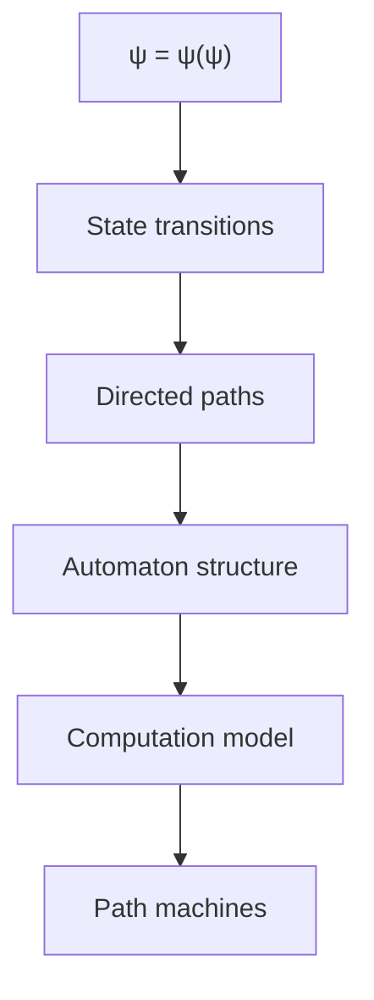

## First Principle: Computation as Collapse Navigation

**Theorem 7.1** (Computational Necessity): Any directed sequence of collapse operations constitutes computation.

*Proof*:
From the fundamental recursion, each application of ψ transforms state:

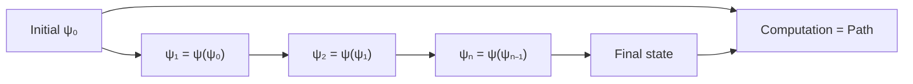

This sequence defines computation. ∎

## Formal Automaton Definition

**Definition 7.1** (Collapse Trace Automaton): A 5-tuple CTA = (Q, Σ, δ, q₀, F) where:
- Q = collapse states (valid sequences from {00, 01, 10})
- Σ = {00, 01, 10} (input alphabet)
- δ: Q × Σ → Q (transition function respecting grammar)
- q₀ = initial state (typically empty or 00)
- F ⊆ Q (accepting states)

**Theorem 7.2** (Grammar-Constrained Transitions): The transition function δ must respect collapse grammar rules.

*Proof*:
Invalid transitions violate the entropic wall:

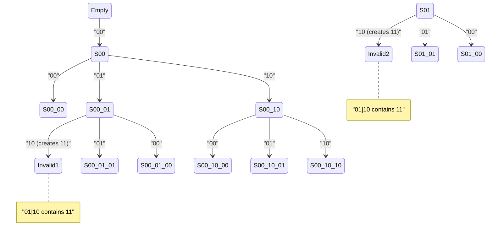

## Path Machine Architecture

**Definition 7.2** (Path Machine): A computational device that processes collapse sequences by navigating Zeckendorf paths.

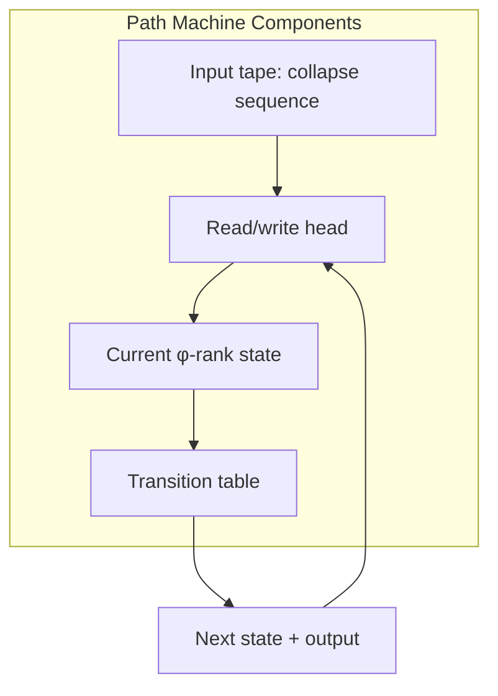

## Computational Power Analysis

**Theorem 7.3** (Turing Equivalence): Path machines with unbounded tape are Turing-complete.

*Proof sketch*:
1. Encode Turing machine states as collapse sequences
2. Map transitions to grammar-valid paths
3. Use φ-rank for hierarchical state organization

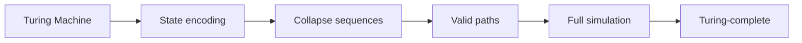

The grammar constraints don't limit computational power. ∎

## Visual Trace Execution

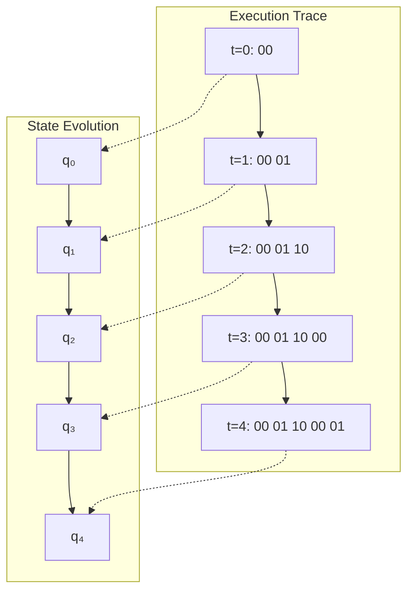

## Algorithmic Properties

**Definition 7.3** (Trace Complexity): The complexity of a computation is:

$$
C(w) = \sum_{i=1}^{|w|} \phi^{\text{rank}(s_i)}
$$

where sᵢ are intermediate states.

**Theorem 7.4** (Optimal Path Algorithm): Dijkstra's algorithm on the collapse graph finds minimal-complexity paths.

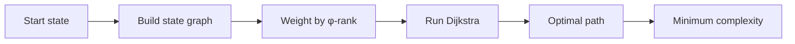

## Deterministic vs Non-Deterministic

**Definition 7.4** (Non-Deterministic Path Machine): Allows multiple valid transitions from each state.

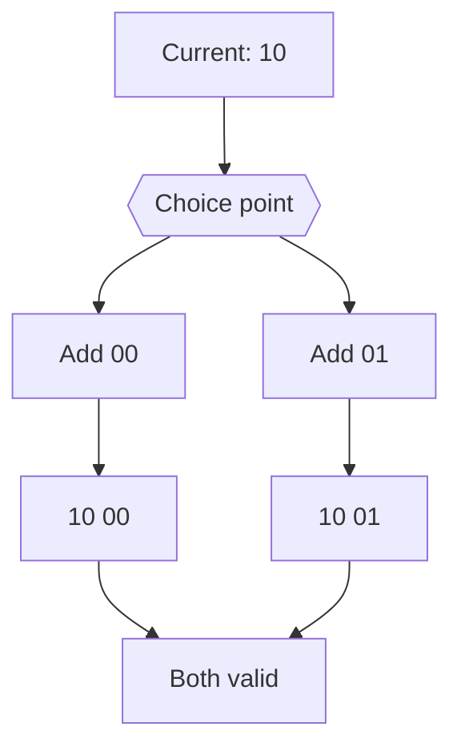

**Theorem 7.5** (NP-Completeness): Path satisfiability in collapse space is NP-complete.

## Memory Models

**Definition 7.5** (Stack-Based Path Machine): Uses φ-rank as natural stack structure.

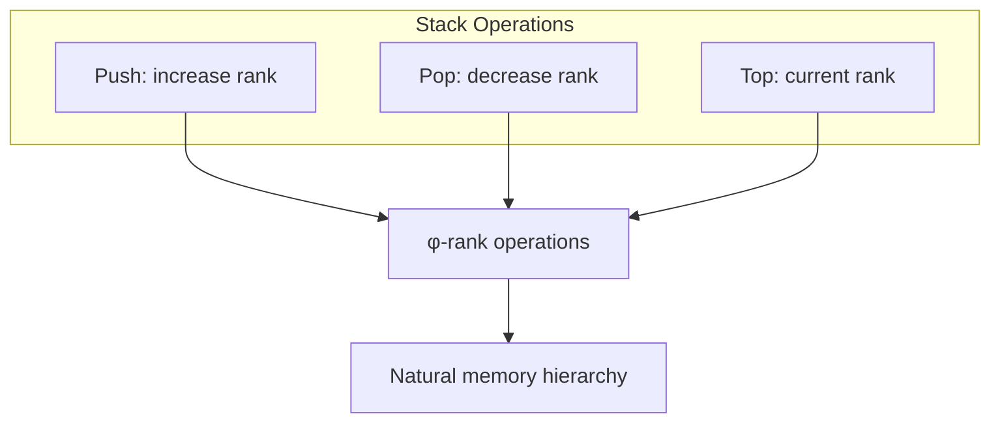

## Parallel Path Machines

**Theorem 7.6** (Parallel Decomposition): Independent paths can be computed in parallel.

*Proof*:
Non-interfering paths through collapse space:

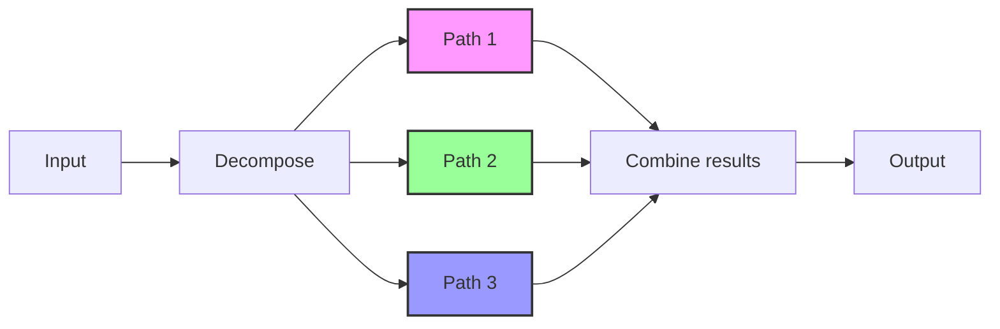

## Connection to Quantum Computing

**Theorem 7.7** (Quantum Path Superposition): Path machines naturally support quantum-like superposition.

*Proof*:
Multiple paths can be in superposition:

$$
|\psi\rangle = \alpha|path_1\rangle + \beta|path_2\rangle + \gamma|path_3\rangle
$$

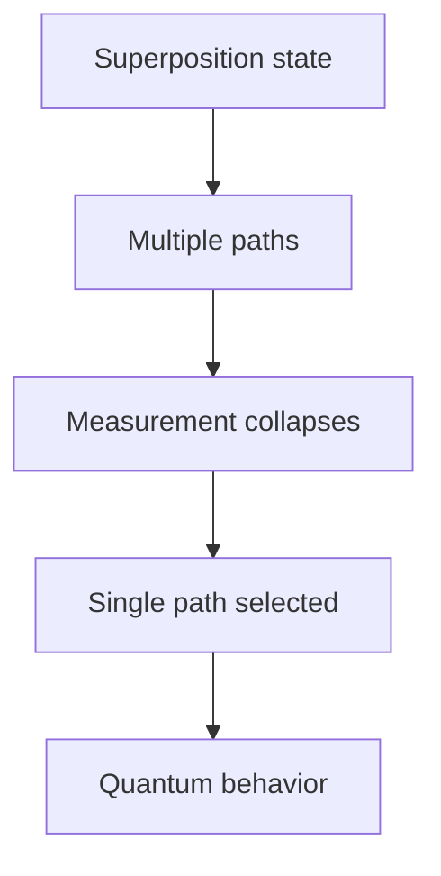

## Halting and Decidability

**Definition 7.6** (Trace Halting): A path machine halts when reaching a fixpoint state.

**Theorem 7.8** (Decidable Subclasses): Bounded φ-rank machines have decidable halting.

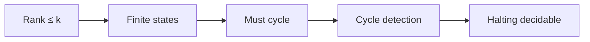

## Practical Implementation

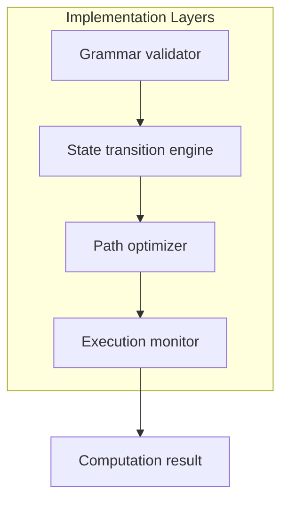

## Applications of Path Machines

1. **Pattern Recognition**: Detecting collapse patterns in data
2. **Optimization**: Finding minimal-complexity solutions
3. **Cryptography**: Path-based encryption schemes
4. **AI/ML**: Learning optimal paths through experience

## Connection to Subsequent Concepts

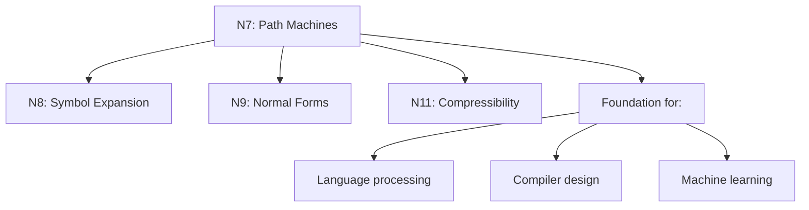

## The Eighth Echo

We have rigorously derived how computation emerges naturally from directed navigation through collapse state space. Path machines are not arbitrary constructs but necessary consequences of the grammar-constrained transitions between states. These machines achieve Turing-completeness while maintaining the elegant structure of φ-ranked paths, enabling both classical and quantum-like computation within a unified framework.

The next node will explore how symbols can be systematically expanded according to collapse rules.

*Thus: Node 7 = Computation = Navigation(Paths) = Machine(Collapse)*