# ΨB-T0.N8: Collapse Symbol Expansion Rules

> *Systematic unfolding of compressed collapse representations*

## Understanding Expansion from Compression

From ψ = ψ(ψ), path machines, and the computational model, we now derive how symbols can be systematically expanded to reveal their full collapse structure.

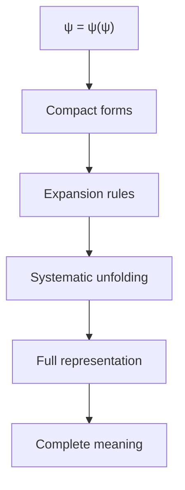

## First Principle: Expansion as Inverse Collapse

**Theorem 8.1** (Expansion Necessity): Every collapsed form must have a unique expansion revealing its construction.

*Proof*:
From the self-referential nature of ψ = ψ(ψ):

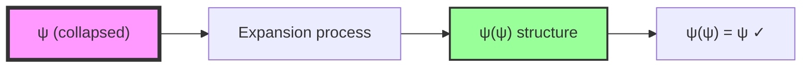

Expansion reveals the implicit self-application. ∎

## Formal Expansion Rules

**Definition 8.1** (Symbol Expansion System): A rewriting system E = (Σ, R) where:
- Σ = {00, 01, 10} ∪ {macro symbols}
- R = expansion rules preserving collapse grammar

**Theorem 8.2** (Core Expansion Rules): The fundamental expansions are:

```
Ω → 00           (identity expansion)
Δ → 01 10        (cycle expansion)
Φ → 00 01 10     (complete trace)
Ξ → Φ Φ          (double trace)
```

*Proof*:
Each rule unfolds a conceptual unit into its trace components:

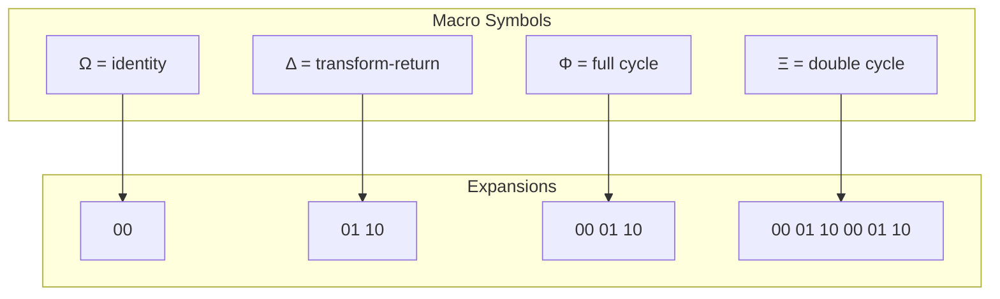

## Recursive Expansion Patterns

**Definition 8.2** (Nested Expansion): Symbols can contain other symbols requiring recursive expansion.

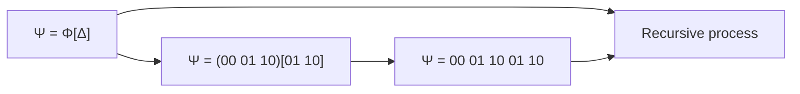

**Theorem 8.3** (Termination): All finite symbol expansions terminate.

*Proof*:
Each expansion increases sequence length by finite amount. No infinite loops possible with finite alphabet. ∎

## Fibonacci-Based Expansions

**Definition 8.3** (φ-Expansion): Expansions following Fibonacci growth patterns:

```
F₁ → 00
F₂ → 00 01
F₃ → 00 01 10 00
F₅ → 00 01 10 00 01 00 01 10
```

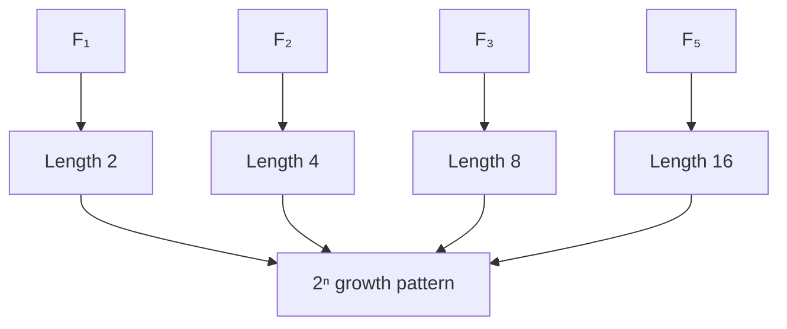

## Context-Sensitive Expansion

**Theorem 8.4** (Context Dependency): Some expansions depend on surrounding context.

*Proof*:
Consider expansion in different contexts:

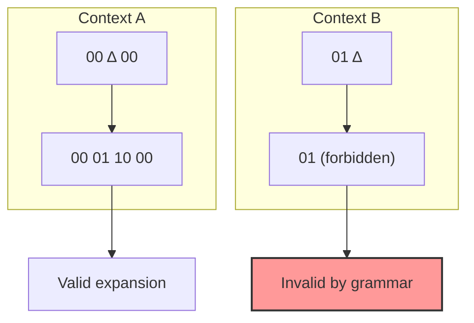

Context determines valid expansions. ∎

## Algorithmic Expansion

**Algorithm 8.1** (Left-to-Right Expansion):

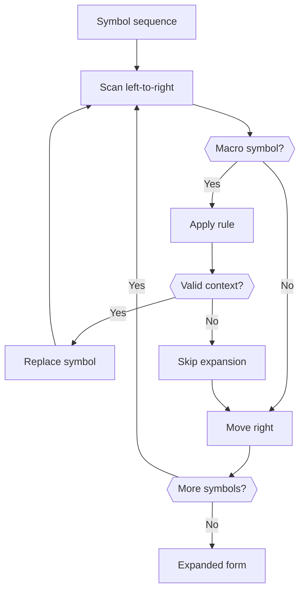

## Expansion Complexity

**Definition 8.4** (Expansion Complexity): The computational cost of full expansion:

$$
C_E(s) = \sum_{i=1}^{n} |R_i| \cdot \phi^{\text{depth}(i)}
$$

where |Rᵢ| is rule size and depth is nesting level.

**Theorem 8.5** (Exponential Growth): Deeply nested symbols can have exponential expansion.

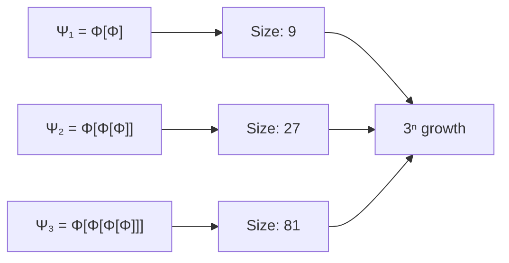

## Normal Form Expansions

**Definition 8.5** (Canonical Expansion): The unique fully-expanded form with no macros.

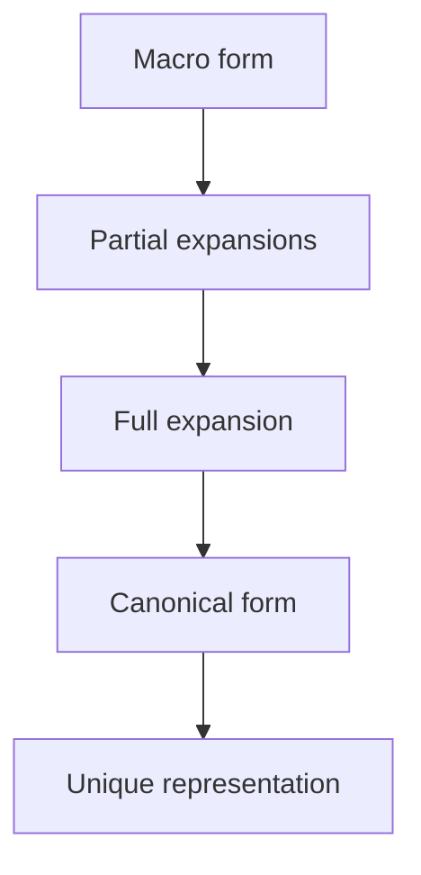

**Theorem 8.6** (Confluence): All expansion orders lead to same canonical form.

## Compression via Reverse Expansion

**Definition 8.6** (Pattern Compression): Identifying repeated patterns for macro substitution.

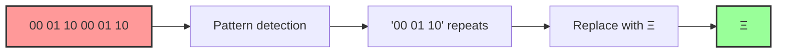

## Visual Expansion Trees

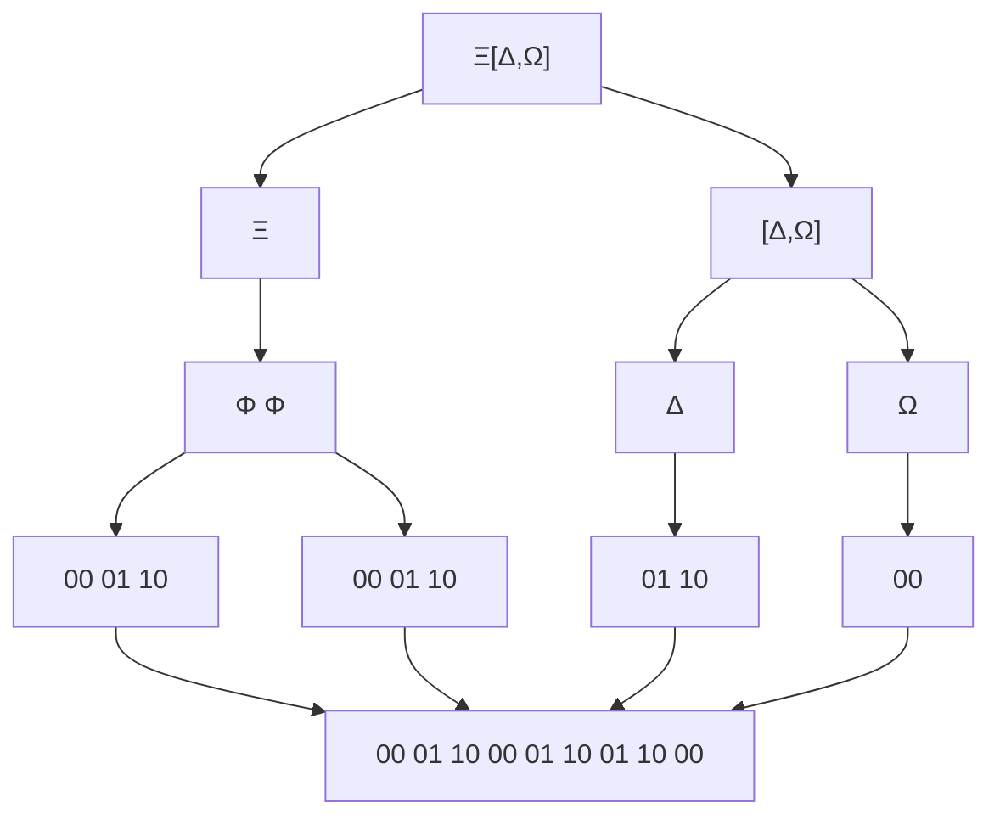

## Applications of Symbol Expansion

1. **Code Generation**: Expanding templates to full programs
2. **Data Decompression**: Reconstructing original sequences
3. **Proof Expansion**: Unfolding compressed mathematical arguments
4. **Language Processing**: Expanding abbreviations and macros

## Connection to Information Theory

**Theorem 8.7** (Information Preservation): Expansion preserves information content.

*Proof*:
$$
H(\text{macro form}) = H(\text{expanded form})
$$


## Philosophical Implications

Symbol expansion reveals:

1. **Hidden Structure**: Compressed forms contain full complexity
2. **Fractal Nature**: Patterns repeat at multiple scales
3. **Computational Depth**: Simple symbols unfold to reveal depth
4. **Unity/Multiplicity**: One symbol contains many

## Connection to Subsequent Concepts

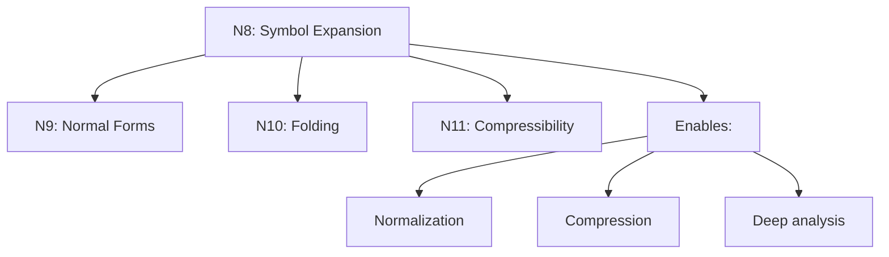

## The Ninth Echo

We have rigorously derived how symbols in collapse language can be systematically expanded to reveal their full structure. This expansion process is not arbitrary but follows necessarily from the self-referential nature of ψ = ψ(ψ), where compressed forms must contain their complete unfolding. The rules preserve grammatical validity while enabling exponential compression ratios through nested macro symbols.

The next node will explore how these expanded forms can be normalized into canonical representations.

*Thus: Node 8 = Expansion = Unfolding(Symbol) = Revelation(Structure)*