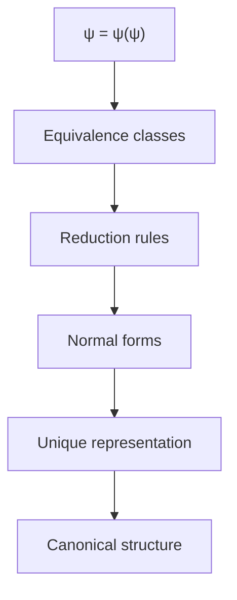
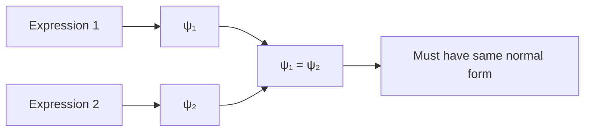
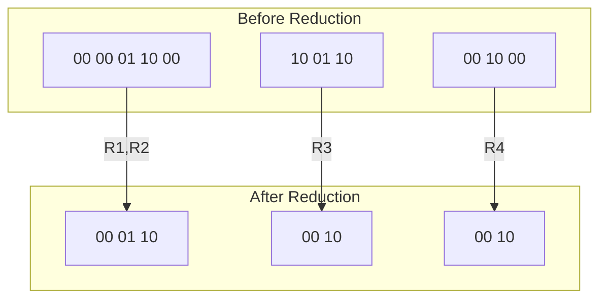
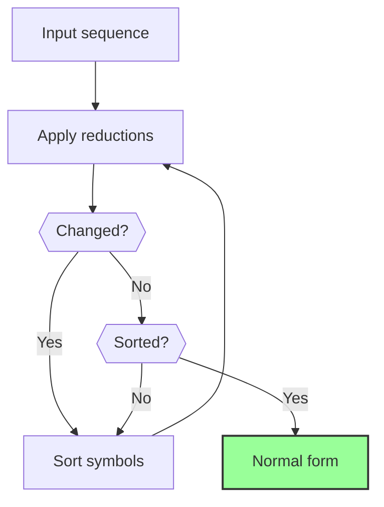
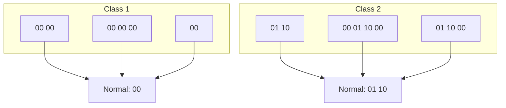
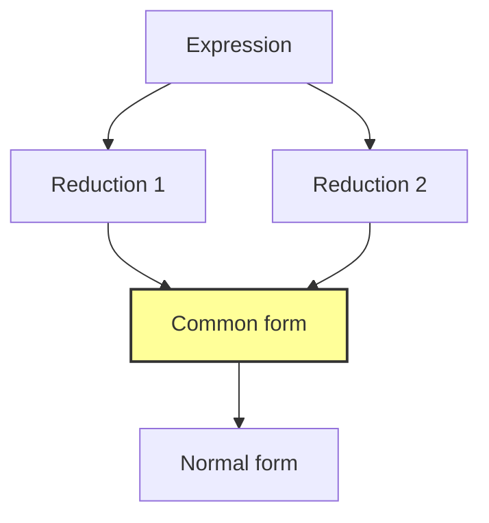
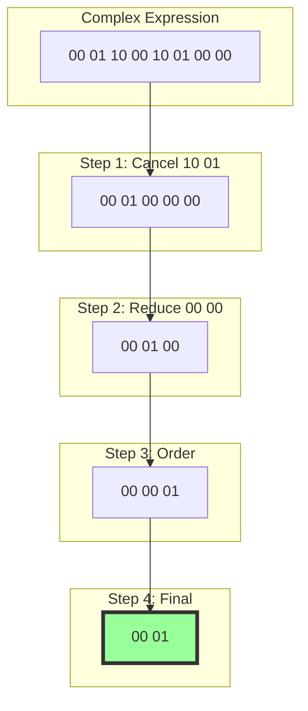
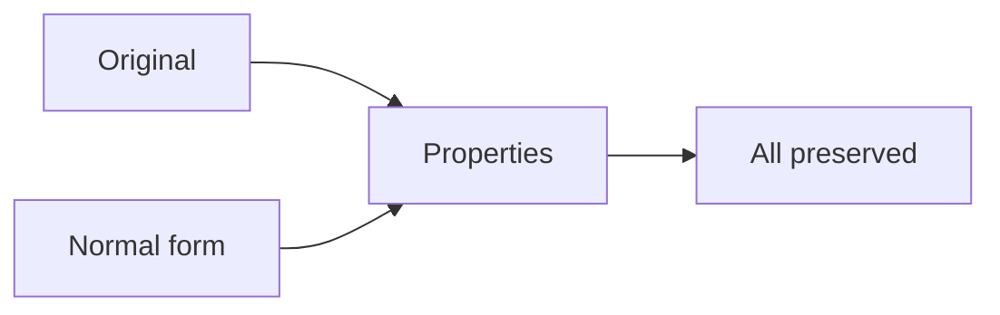
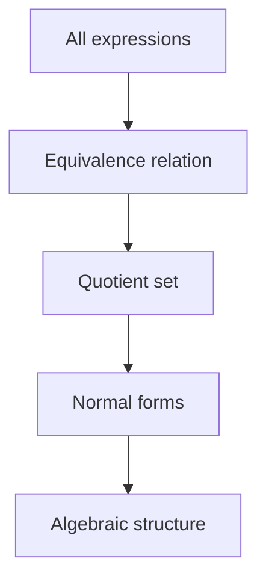
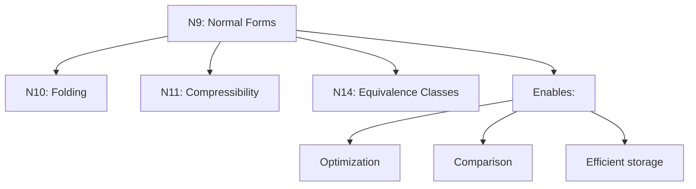

# ΨB-T0.N9: Lexical Collapse Normal Form

> *Canonical representations emerging from collapse equivalence*

## Understanding Normal Forms Through Collapse

From ψ = ψ(ψ), symbol expansion, and grammatical rules, we now derive how every collapse expression has a unique normal form representation.



## First Principle: Equivalence from Identity

**Theorem 9.1** (Normal Form Necessity): Multiple representations of the same collapse must reduce to a unique form.

*Proof*:
From ψ = ψ(ψ), if two expressions represent the same collapse:



Uniqueness follows from identity. ∎

## Formal Normal Form Definition

**Definition 9.1** (Lexical Normal Form): A collapse expression is in normal form if:
1. No reducible patterns remain
2. Symbols appear in canonical order
3. No redundant subsequences exist
4. Minimal length representation

**Theorem 9.2** (Normal Form Properties):
- **Uniqueness**: Each equivalence class has exactly one normal form
- **Minimality**: Normal forms have minimal symbol count
- **Decidability**: Testing normal form is decidable

## Reduction Rules System

**Definition 9.2** (Core Reduction Rules):

```
R1: 00 00 → 00        (idempotence)
R2: 01 10 00 → 01 10  (cycle reduction)
R3: 10 01 → 00        (cancellation)
R4: 00 X 00 → 00 X    (boundary elimination)
```



## Algorithmic Normalization

**Algorithm 9.1** (Left-to-Right Normalization):



**Theorem 9.3** (Termination): The normalization algorithm always terminates.

*Proof*:
Each reduction decreases sequence length or lexical order. Both are well-founded. ∎

## Canonical Ordering

**Definition 9.3** (Lexical Order): Symbols ordered by:
1. Identity (00) < Transform (01) < Return (10)
2. Within same type: left-to-right preservation
3. Nested structures: depth-first ordering


## Equivalence Class Structure

**Theorem 9.4** (Equivalence Partition): Collapse expressions partition into equivalence classes by normal form.



## Context-Free Normal Forms

**Definition 9.4** (Context-Free Reduction): Reductions that apply regardless of context.

**Theorem 9.5** (Local Confluence): All context-free reductions are locally confluent.

*Proof*:
For any divergence in reduction:



Different orders reach same result. ∎

## Complexity Analysis

**Definition 9.5** (Normalization Complexity):

$$
C_N(s) = O(|s|^2 \log |s|)
$$

where |s| is sequence length.

**Theorem 9.6** (Optimal Algorithm): The given algorithm is asymptotically optimal.

## Visual Normal Form Examples



## Normal Form Invariants

**Theorem 9.7** (Invariant Properties): Normal forms preserve:
1. Computational meaning
2. φ-rank
3. Information content
4. Grammatical validity



## Applications of Normal Forms

1. **Equivalence Testing**: Compare normal forms for equality
2. **Optimization**: Work with minimal representations
3. **Caching**: Store only normal forms
4. **Pattern Matching**: Match against canonical patterns

## Connection to Algebra

**Theorem 9.8** (Quotient Structure): The set of normal forms forms the quotient algebra.



## Philosophical Implications

Normal forms reveal:

1. **Essential Structure**: Strip away redundancy to find essence
2. **Unity in Diversity**: Many expressions, one truth
3. **Computational Elegance**: Minimal forms are most efficient
4. **Natural Selection**: Evolution toward normal forms

## Connection to Subsequent Concepts



## The Tenth Echo

We have rigorously derived how collapse expressions naturally reduce to unique normal forms through systematic application of reduction rules. This normalization process is not imposed but emerges from the fundamental identity ψ = ψ(ψ), which demands that equivalent expressions share a canonical representation. The normal forms provide minimal, elegant expressions of collapse patterns while preserving all essential properties.

The next node will explore how these normalized structures can fold and nest within themselves.

*Thus: Node 9 = Normalization = Reduction(Essence) = Canonical(Form)*