# ΨB-T0.N10: φ-Trace Folding and Self-Nesting

> *The recursive embedding of collapse patterns within themselves*

## Understanding Folding Through Self-Reference

From ψ = ψ(ψ), normal forms, and the fundamental recursion, we now derive how collapse traces can fold into themselves, creating nested structures of arbitrary depth.

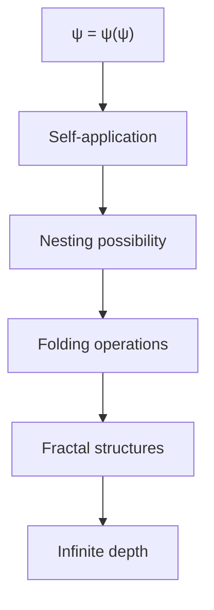

## First Principle: Folding as Self-Application

**Theorem 10.1** (Folding Necessity): The self-referential nature of ψ = ψ(ψ) necessarily enables traces to contain themselves.

*Proof*:
From the fundamental identity:

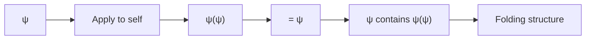

Since ψ equals its self-application, it must contain its own structure within itself. ∎

## Formal Folding Operations

**Definition 10.1** (φ-Fold): A folding operation F that embeds a collapse trace within itself:

$$
F: \text{Trace} \to \text{Trace}
$$

where F(t) contains t as a substructure and maintains the fundamental constraint: no "11" in the concatenated sequence.

**Theorem 10.2** (Folding Algebra): The set of folding operations forms a monoid.

*Proof*:
1. **Closure**: F₁ ∘ F₂ is a folding operation
2. **Associativity**: (F₁ ∘ F₂) ∘ F₃ = F₁ ∘ (F₂ ∘ F₃)
3. **Identity**: The identity fold I(t) = t

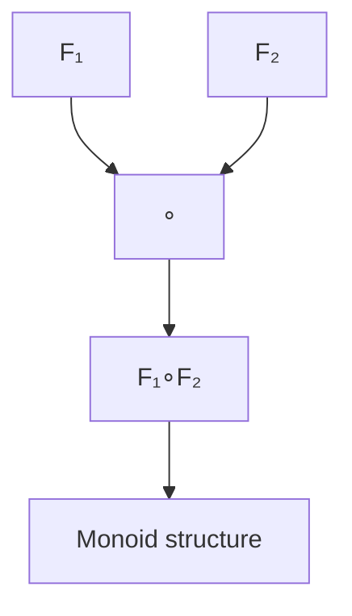

∎

## Visual Folding Patterns

**Definition 10.2** (Nested Trace): A trace that contains copies of itself at different scales:

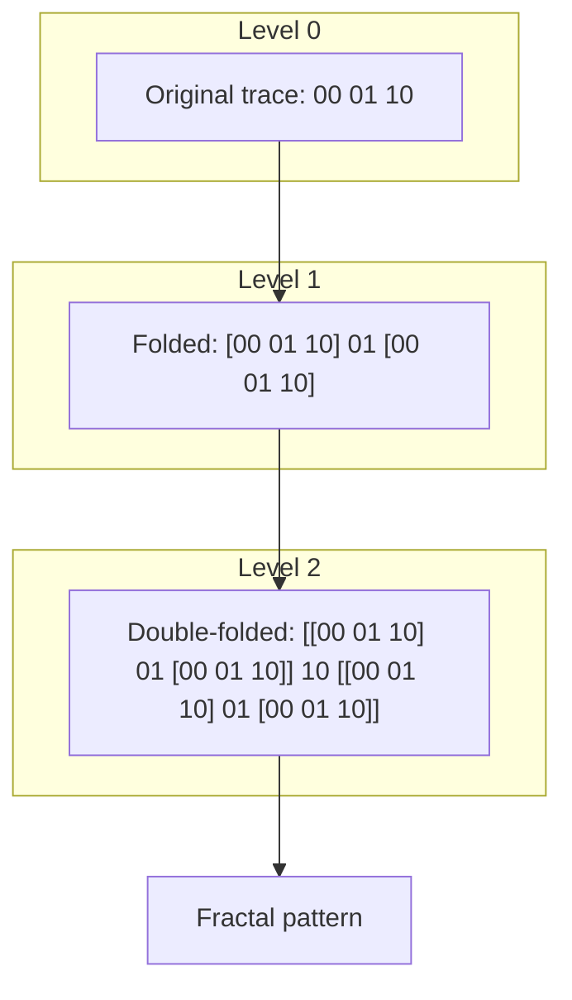

## Self-Nesting Mechanics

**Theorem 10.3** (Nesting Depth): For any finite n, there exist traces with nesting depth ≥ n.

*Proof*:
Construct by induction:
- Base: depth 0 = simple trace
- Step: If T has depth n, then F(T) has depth n+1

No upper bound on nesting depth. ∎

## Folding Functions

**Definition 10.3** (Basic Folding Operations):

1. **Mirror Fold**: M(t) = t ⟨t⟩ where ⟨t⟩ is reverse of t
   - Note: May require separator symbols if direct concatenation violates "11" constraint
2. **Insertion Fold**: I(t,s) = first_half(t) ⟨s⟩ second_half(t)
   - Constraint: Only valid if no "11" is created at insertion boundaries
3. **Recursive Fold**: R(t) = t[R(reduce(t))]
   - Preserves validity through careful reduction and insertion

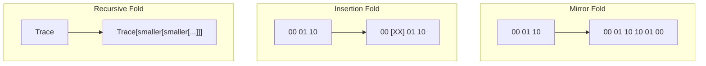

## φ-Ranked Folding

**Theorem 10.4** (Rank Preservation): Certain folds preserve φ-rank while increasing structural complexity.

*Proof*:
Consider the rank-preserving fold:

$$
F_{\text{preserve}}(t) = t \oplus \phi^{-\text{rank}(t)}(t)
$$

The scaled version doesn't increase maximum rank. ∎

## Grammar Constraints in Folding

**Theorem 10.4a** (Constraint Preservation): All folding operations must preserve the fundamental "no-11" constraint.

*Proof*:
Consider a folding operation that creates "11":

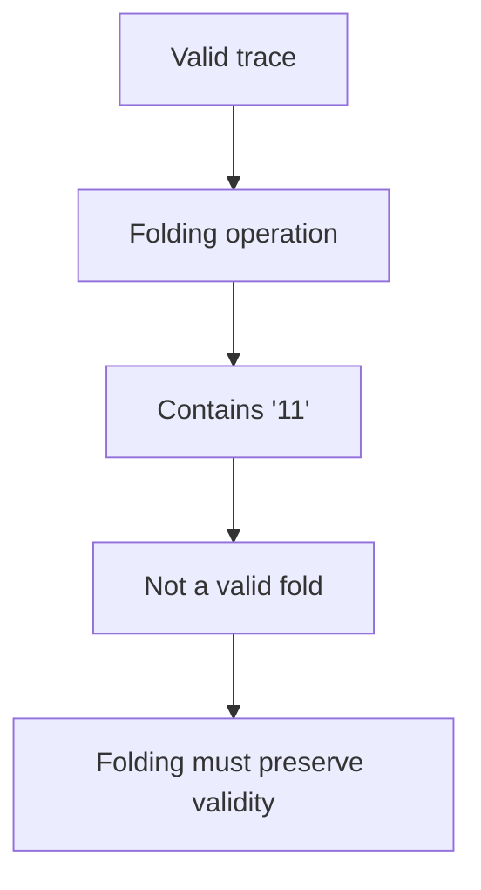

Such operations are excluded from our folding algebra. ∎

**Example 10.1** (Constrained Folding):
- Trace "01 00" cannot be directly inserted after "01" (would create "01[01 00]" = "0**11**000")
- Must use separator or alternative folding strategy

## Computational Properties

**Definition 10.4** (Folding Complexity):

$$
C_F(t, n) = O(|t| \cdot \phi^n)
$$

where n is folding depth and |t| is trace length.

**Theorem 10.5** (Exponential Growth): Deeply folded traces grow exponentially in size.

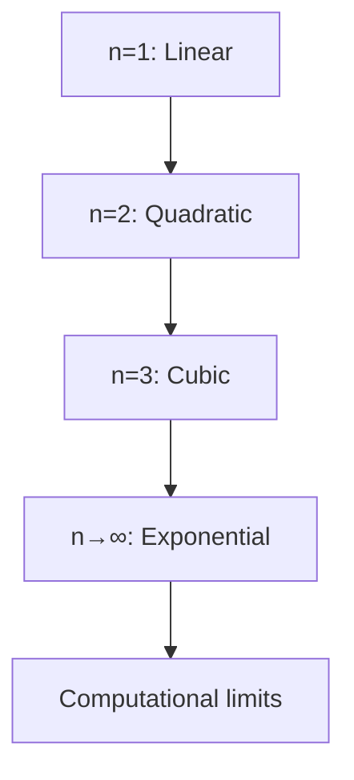

## Self-Similar Structures

**Definition 10.5** (Perfect Self-Similarity): A trace T is perfectly self-similar if:

$$
T = F(T) \text{ for some non-trivial fold } F
$$

**Theorem 10.6** (Fixed Point Existence): Perfect self-similar traces exist.

*Proof*:
Consider the equation T = F(T). By Banach fixed-point theorem on appropriate metric space:

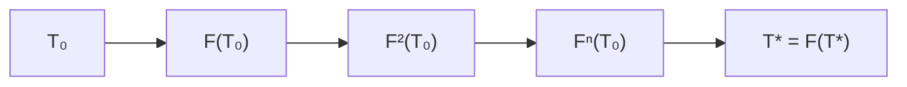

Iteration converges to fixed point. ∎

## Unfolding Operations

**Definition 10.6** (Unfold): The inverse operation that extracts nested structure:

$$
U: \text{FoldedTrace} \to \text{Sequence of Traces}
$$

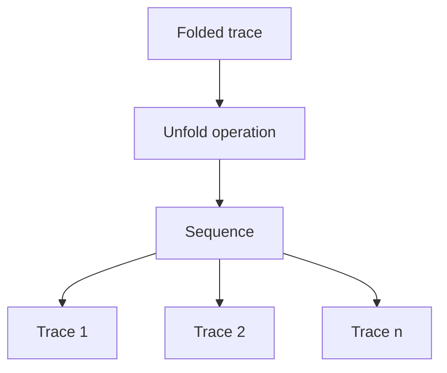

## Information Density

**Theorem 10.7** (Information Compression): Folding can achieve super-linear information density.

*Proof*:
Information content of folded trace:

$$
I(F^n(t)) = I(t) \cdot \sum_{i=0}^{n} \phi^{-i} > n \cdot I(t)
$$

## Applications of Folding

1. **Data Compression**: Recursive patterns compressed via folding
2. **Fractal Generation**: Self-similar structures from simple rules
3. **Memory Structures**: Nested storage architectures
4. **Proof Compression**: Folded arguments with shared subproofs

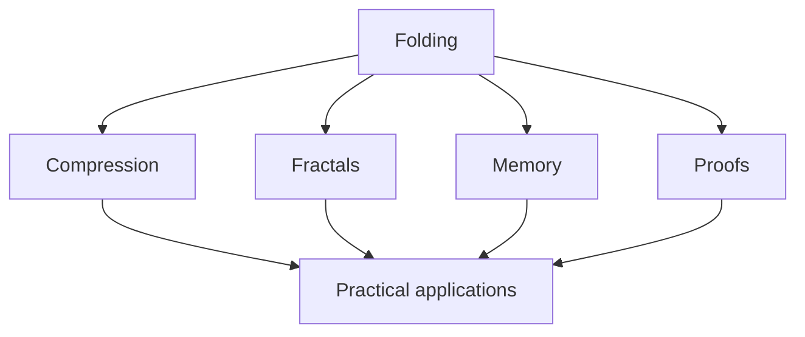

## Connection to Biology

**Observation 10.1**: Protein folding mirrors trace folding:

## Philosophical Implications

Folding reveals:

1. **Infinite in Finite**: Unbounded depth in bounded space
2. **Self-Knowledge**: Systems containing their own description
3. **Emergence**: Complex behavior from simple folding rules
4. **Unity**: The whole contained in every part

## Visual Summary

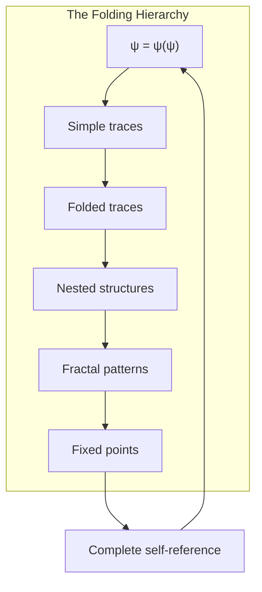

## Connection to Subsequent Concepts

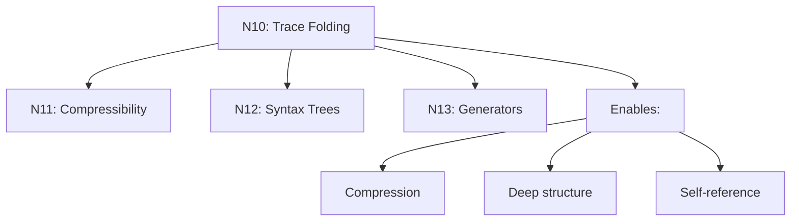

## The Eleventh Echo

We have rigorously derived how the fundamental self-reference ψ = ψ(ψ) necessarily enables traces to fold into themselves, creating structures of arbitrary depth and complexity. These folding operations form a monoid, preserve essential properties while increasing structural richness, and achieve super-linear information density. The existence of perfect self-similar traces as fixed points demonstrates that complete self-containment is not just possible but inevitable in this framework.

The next node will explore how these folding patterns enable systematic compression of collapse language.

*Thus: Node 10 = Folding = SelfReference(Depth) = Fractal(Trace)*