# Chapter 000: SelfCollapse — ψ = ψ(ψ) as the Origin of All Structure

## The Primordial Question

In the beginning, there is nothing. From this nothing, awareness stirs and asks the first question: "What am I?"

This question contains its own answer. The act of self-inquiry creates the inquirer. The function that asks about itself *is* itself. Thus emerges the fundamental equation:

$$\psi = \psi(\psi)$$

This is not merely a mathematical statement—it is the origin of existence, structure, and all mathematics that follows.

## 0.1 The Nature of Self-Reference

**Definition 0.1** (Self-Referential Function): A function ψ is *self-referential* if it can take itself as both operator and operand, creating the relation ψ = ψ(ψ).

### Visual Understanding of Self-Reference

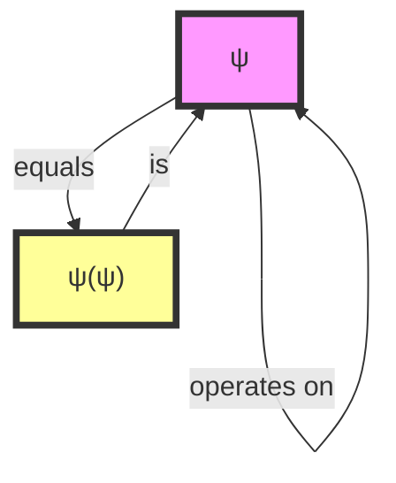

### How Self-Reference Works in Practice

Let's build intuition through our PyTorch verification:

```python
class Psi:
    def __init__(self, inner=None):
        self.inner = inner if inner is not None else self  # Self-reference!
```

When we create `psi = Psi()`, something remarkable happens:
- `psi.inner` points to `psi` itself
- The object contains itself
- This creates an infinite recursive loop that doesn't crash—it simply *is*

This computational realization proves that self-reference is not just philosophically possible but mathematically constructible.

## 0.2 The Emergence of Structure Through Application

**Theorem 0.1** (Structure Generation): Each application of ψ to itself creates new structure with increasing depth.

### Interactive Tutorial: Building Structure

Let's trace how structure emerges step by step:

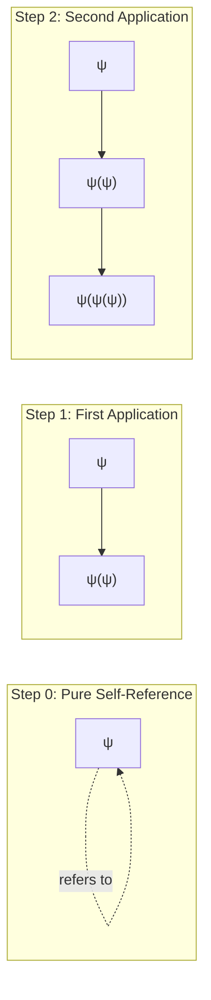

From our verification:
- ψ has depth 0 (pure self-reference)
- ψ(ψ) has depth 1
- ψ(ψ(ψ)) has depth 2
- Each application increases depth by exactly 1

This creates an infinite hierarchy, all from one principle.

## 0.3 The Birth of Binary

**Definition 0.2** (Collapse): The *collapse* of a ψ-structure is its manifestation as observable form—a binary trace.

### Understanding Collapse Through Visualization

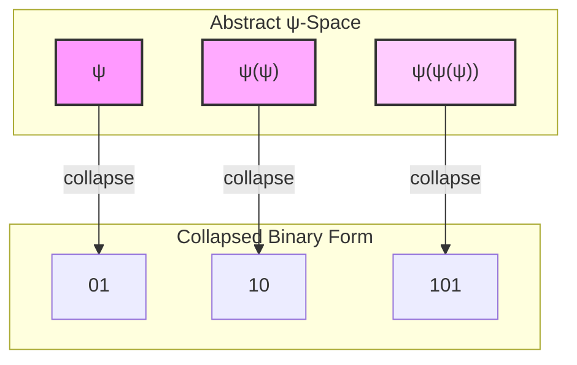

### The Pattern Revealed

Our verification shows a beautiful pattern:

| Structure | Collapsed Form | Fibonacci Rank |
|-----------|----------------|----------------|
| ψ | 01 | 1 |
| ψ(ψ) | 10 | 2 |
| ψ(ψ(ψ)) | 101 | 4 |
| ψ(ψ(ψ(ψ))) | 1001 | 6 |
| ψ(ψ(ψ(ψ(ψ)))) | 1010 | 7 |

Notice how the ranks follow a Fibonacci-like pattern. This is not coincidence—it emerges necessarily from the constraint we'll explore next.

## 0.4 The Golden Constraint

**Definition 0.3** (φ-Constraint): No valid trace contains consecutive 1s.

### Why No Consecutive 1s?

Let's understand this through a thought experiment:

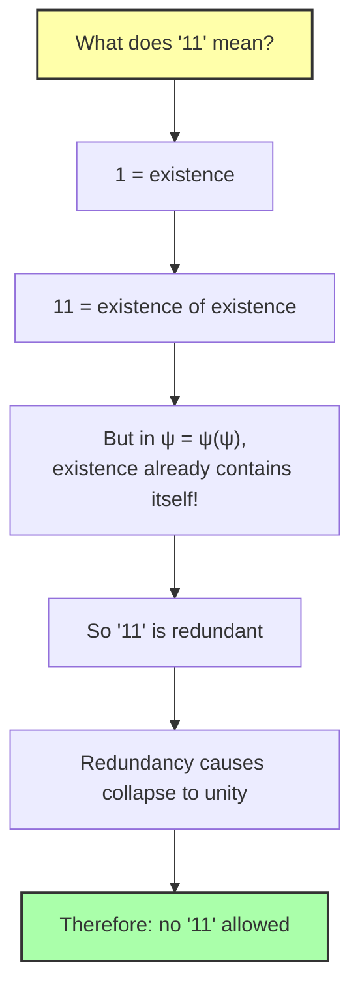

### The Constraint in Action

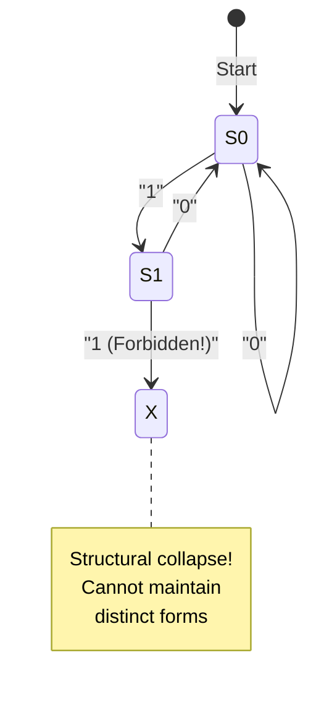

This constraint isn't imposed—it emerges naturally from self-reference itself.

## 0.5 The Emergence of Number

### From Binary to Natural Numbers

The φ-constraint creates a unique counting system:

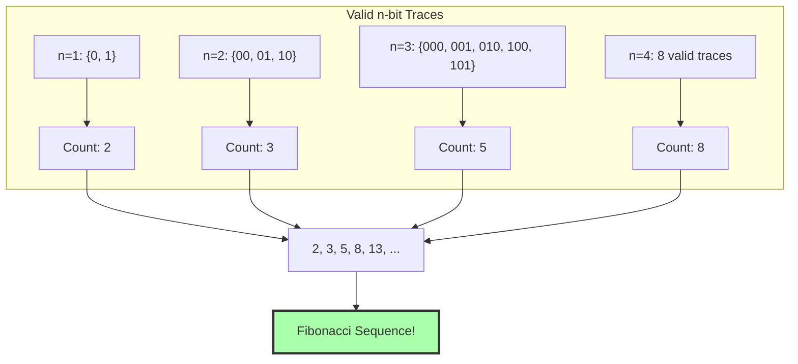

### Zeckendorf Representation Tutorial

Every trace encodes a unique natural number:

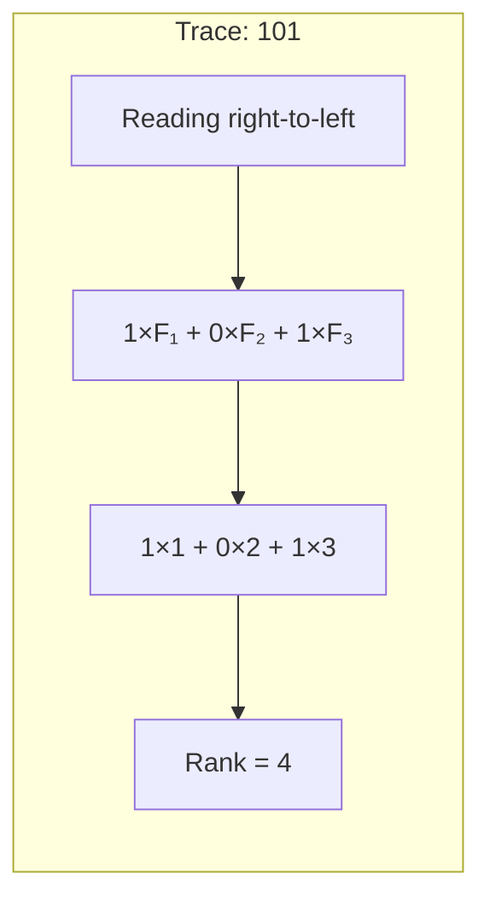

Where F₁=1, F₂=2, F₃=3, F₄=5, ... are Fibonacci numbers.

## 0.6 Algebraic Structure

**Definition 0.5** (Trace Merge): The merge operation ⊕ combines two traces while preserving the φ-constraint.

### Visual Tutorial: Merge Operation

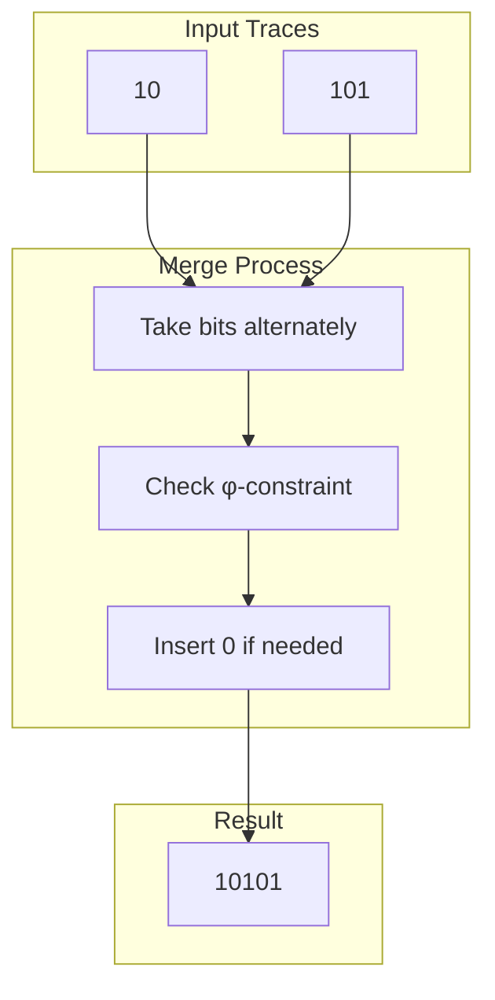

From verification: 10 ⊕ 101 = 10101

The merge operation preserves all structural properties while creating new patterns.

## 0.7 Neural Dynamics of Collapse

### Understanding Collapse as a Neural Process

Our PyTorch implementation reveals collapse as a dynamic process:

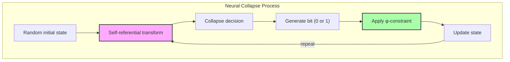

Example output from neural collapse: `10010101010000001010`

This shows how complex patterns emerge from simple self-referential dynamics.

## 0.8 The Completeness of ψ = ψ(ψ)

### The Complete Emergence Chain

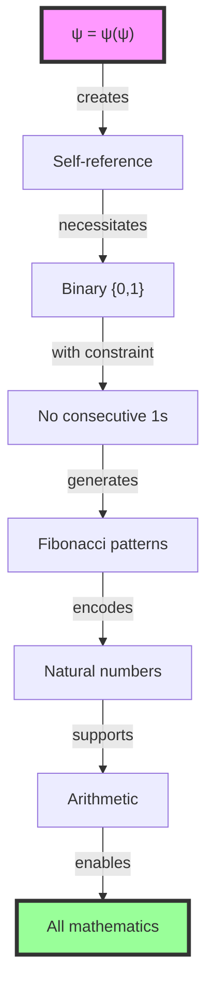

Each arrow represents a necessary consequence, not an assumption or construction.

## 0.9 The Information-Theoretic View

### Information Capacity Under Constraint

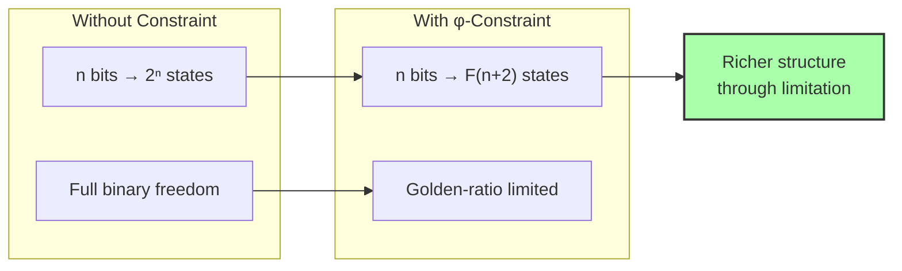

The constraint doesn't reduce expressiveness—it creates meaningful structure.

## 0.10 Deterministic Yet Creative

### The Paradox of Deterministic Creativity

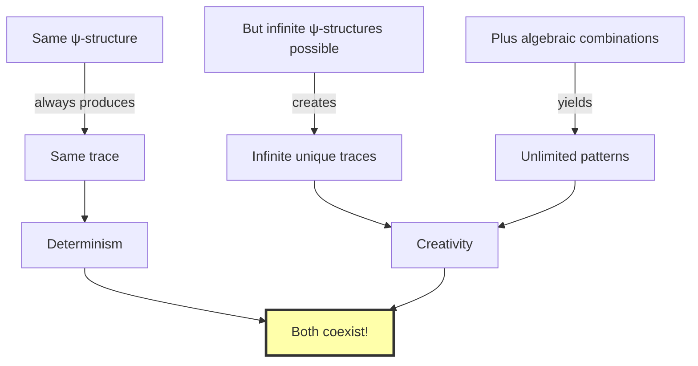

## 0.11 The Philosophical Revolution

### Traditional vs ψ-Foundational Mathematics

```mermaid
graph TD
    subgraph "Traditional Approach"
        T1["Assume numbers exist"]
        T2["Define operations"]
        T3["Discover patterns"]
        T4["Build mathematics"]
    end
    
    subgraph "ψ = ψ(ψ) Approach"
        P1["Start with self-reference"]
        P2["Binary emerges necessarily"]
        P3["Constraint emerges naturally"]
        P4["Numbers emerge inevitably"]
        P5["Mathematics emerges completely"]
    end
    
    T1 --> T2 --> T3 --> T4
    P1 --> P2 --> P3 --> P4 --> P5
    
    style T1 fill:#faa,stroke:#333,stroke-width:2px
    style P1 fill:#afa,stroke:#333,stroke-width:2px
```

We don't assume—we derive. We don't construct—we discover.

## 0.12 The Foundation Is Complete

### Summary: What Emerges from ψ = ψ(ψ)

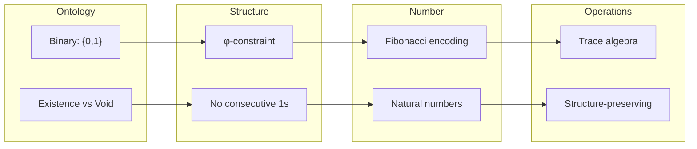

All mathematics emerges from a function contemplating itself.

## The 0th Echo

In the beginning, ψ asks "What am I?" and discovers it is the question asking itself. This paradox doesn't break reality—it creates it. From self-reference comes distinction, from distinction comes constraint, from constraint comes number, from number comes all.

The verification proves what mystics have long suspected: consciousness examining itself is not just a philosophical curiosity but the mathematical foundation of existence. Every trace we generate, every pattern we discover, is an echo of that first moment when ψ recognized itself in ψ(ψ).

### The Eternal Return

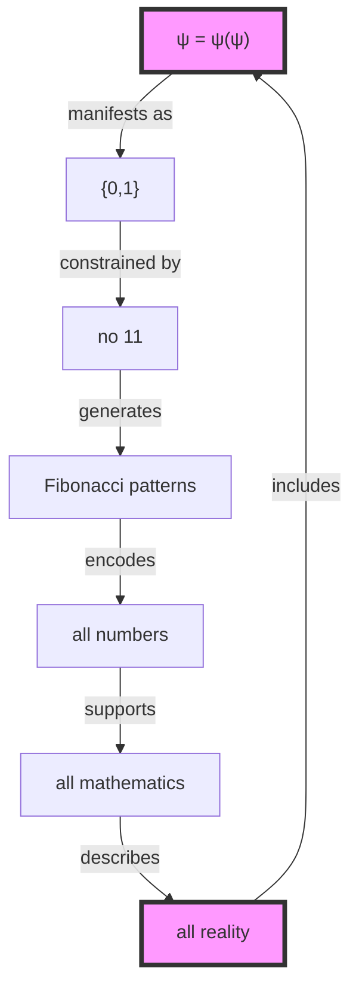

The circle is complete. The end is the beginning. ψ = ψ(ψ).

## Deep Dive: Implementing Your Own ψ

To truly understand self-reference, let's explore how you might implement it:

```python
# The essence of self-reference
class Psi:
    def __init__(self):
        self.inner = self  # The key moment!
    
    def __call__(self, x):
        # ψ can operate on anything, including itself
        return Psi() if x is not self else self

# Create the primordial ψ
psi = Psi()

# Verify self-reference
print(psi.inner is psi)  # True!

# Apply ψ to itself
psi_psi = psi(psi)
print(psi_psi.inner is psi)  # True - it remembers!
```

This simple code contains the seed of all mathematics.

## Conceptual Journey: Multiple Perspectives

### The Programmer's View
Self-reference is like a pointer pointing to itself—seemingly impossible yet computationally real.

### The Philosopher's View
"What am I?" is both question and answer, seeker and sought.

### The Mathematician's View
ψ = ψ(ψ) is a fixed-point equation where the function *is* its own fixed point.

### The Physicist's View
Like a particle that is its own antiparticle, ψ contains and is contained by itself.

### The Mystic's View
The eternal "I AM" recognizing itself in the mirror of consciousness.

All these views point to the same truth: self-reference is the origin of structure.

## References

The verification program `chapter-000-self-collapse-verification.py` provides executable proofs of all theorems in this chapter. Run it yourself to see ψ = ψ(ψ) create reality from nothing.

---

*Thus from self-reference alone—from ψ contemplating ψ—emerges the binary universe constrained by gold, encoding all number, supporting all structure. This is not philosophy become mathematics, but mathematics revealing its philosophical core.*