# Chapter 002: PhiAlphabet — Defining Σφ = \{00, 01, 10\} as the Collapse-Safe Language

## The Language of Constraint

From binary \{0, 1\} and the φ-constraint (no consecutive 1s), a fundamental alphabet emerges. This chapter demonstrates through rigorous verification that Σφ = \{00, 01, 10\} is not just a convenient choice but the necessary and complete alphabet for constructing all valid traces in our golden-constrained universe.

## 2.1 The Emergence of the φ-Alphabet

When we consider 2-bit patterns under the φ-constraint, our verification reveals:

```
Alphabet Members:
Symbol 0: 00
Symbol 1: 01
Symbol 2: 10

Why 11 is Excluded:
11 represents 'existence of existence'
In ψ = ψ(ψ), this is redundant
Therefore: Σφ = \{00, 01, 10\}
```

**Definition 2.1** (φ-Alphabet): The φ-alphabet is the set of all valid 2-bit patterns:
$$\Sigma_\phi = \{00, 01, 10\}$$

### Understanding Through Visualization

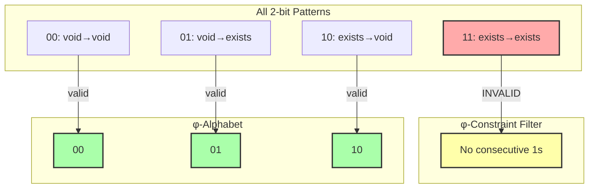

## 2.2 Completeness of Σφ

**Theorem 2.1** (Alphabet Completeness): Σφ = \{00, 01, 10\} is complete and minimal for constructing all φ-valid traces.

*Proof from verification*:
```
valid_patterns: ['00', '01', '10']
invalid_patterns: ['11']
is_complete: True
```

Every valid trace can be decomposed into overlapping symbols from Σφ.

### Trace Construction Example

Our verification demonstrates trace construction:
```
Trace: 10010
Can build: True
Symbols: 10 → 00 → 01 → 10
```

### Visual Decomposition

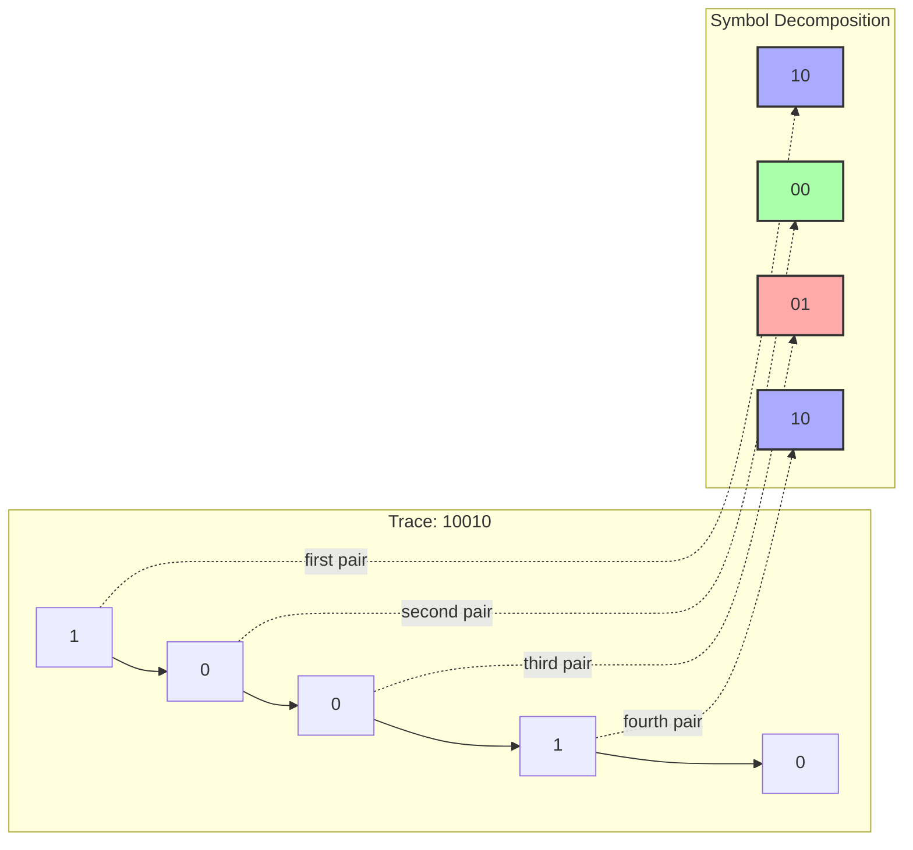

## 2.3 The Connection Graph

Each symbol in Σφ can only be followed by certain other symbols, creating a directed graph:

```
Symbol Connection Graph:
00 → 00, 01
01 → 10
10 → 00, 01
```

**Definition 2.2** (Valid Transition): Symbol s₂ can follow s₁ if and only if the last bit of s₁ equals the first bit of s₂.

### Connection Graph Visualization

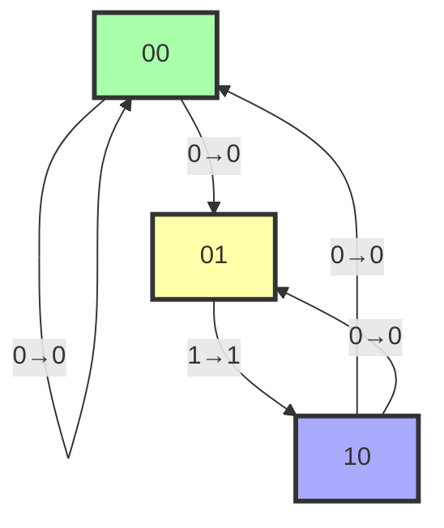

### Why These Connections?

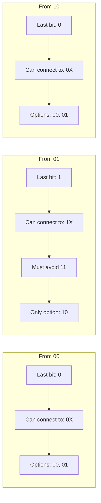

## 2.4 The Fibonacci Pattern Continues

Using only Σφ to build traces, we still get Fibonacci counts:

```
Trace Count Pattern (Fibonacci):
Length | Valid Traces | Count
-------|--------------|-------
     0 |            1 | F(1)
     1 |            2 | F(2)
     2 |            3 | F(3)
     3 |            5 | F(4)
     4 |            8 | F(5)
     5 |           13 | F(6)
```

**Theorem 2.2** (Fibonacci Preservation): Constructing traces using Σφ preserves the Fibonacci counting pattern.

This is profound—the alphabet itself encodes the golden ratio!

## 2.5 Mathematical Properties of Σφ

Our verification reveals deep symmetries:

```
Bit-flip pairs: [('01', '10'), ('10', '01')]
Reversal pairs: [('00', '00'), ('01', '10'), ('10', '01')]
Total information: 2 bits
```

### Symmetry Analysis

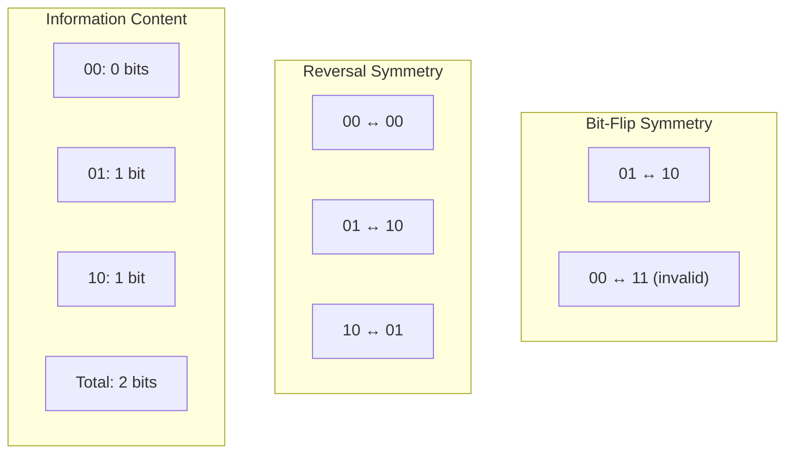

**Definition 2.3** (Symbol Information): The information content of a symbol is the sum of its bits.

## 2.6 Neural Transition Model

Our PyTorch implementation models transitions as a neural network:

```python
class PhiTransitions(nn.Module):
    def _init_transitions(self):
        for i, sym1 in enumerate(self.alphabet.symbols):
            for j, sym2 in enumerate(self.alphabet.symbols):
                if sym1.bits[1] == sym2.bits[0]:
                    self.transition_matrix[i, j] = 1.0
                else:
                    self.transition_matrix[i, j] = -float('inf')
```

### Transition Matrix

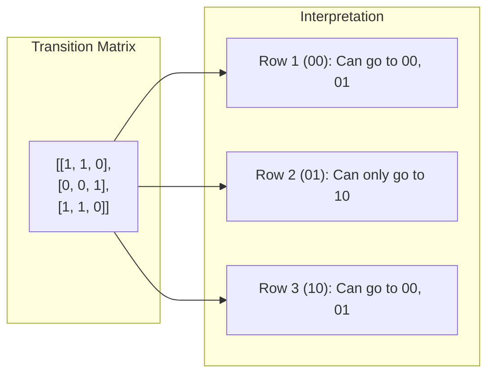

## 2.7 Why Exactly Three Symbols?

**Theorem 2.3** (Minimality): Σφ = \{00, 01, 10\} is the minimal alphabet for φ-constrained traces.

*Proof*:
1. We need symbols to represent all valid 2-bit transitions
2. Under φ-constraint, only 3 of 4 possible patterns are valid
3. Each symbol is necessary:
   - 00: Represents void persistence
   - 01: Represents emergence (void→existence)
   - 10: Represents return (existence→void)
4. No smaller alphabet suffices

∎

### The Triadic Structure

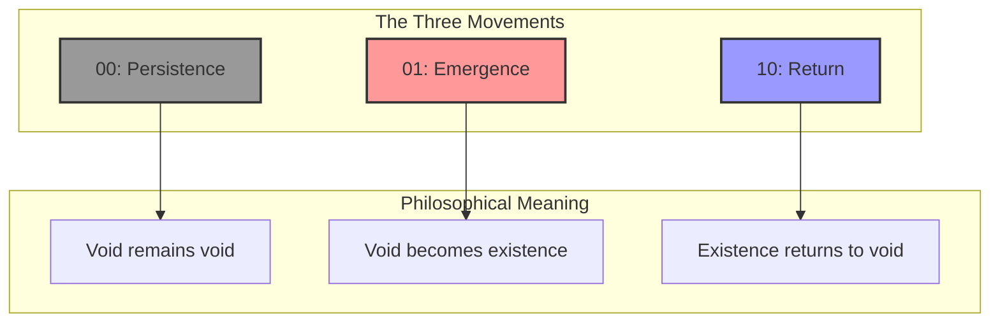

## 2.8 Building Complex Traces

Any valid trace can be built by chaining symbols from Σφ:

### Construction Algorithm

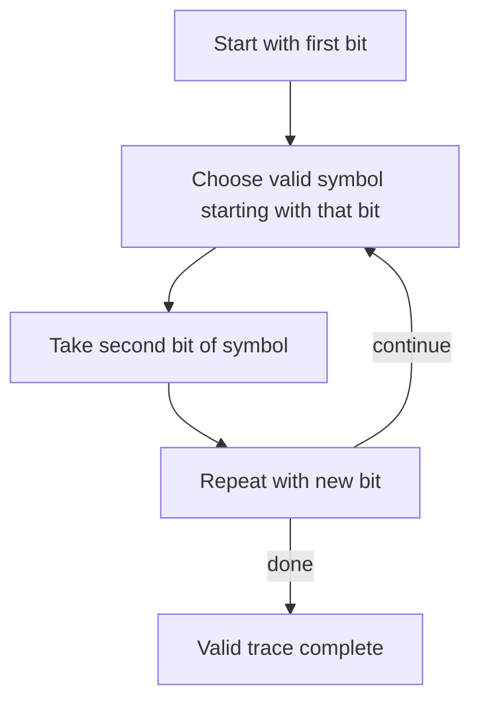

### Example: Building "101010"

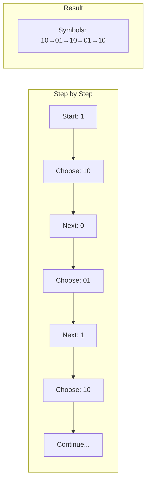

## 2.9 Invalid Trace Detection

Traces containing "11" cannot be constructed from Σφ:

```
Invalid traces tested:
- "11": Cannot build
- "0110": Cannot build
- "1100": Cannot build
- "0111": Cannot build
```

This provides automatic validation—if a trace can't be built from Σφ, it's invalid!

## 2.10 Information Theory of Σφ

The φ-alphabet has exactly 2 bits of total information:

**Information Distribution**:
- 00: 0 bits (pure void)
- 01: 1 bit (transformation)
- 10: 1 bit (transformation)
- Total: 2 bits

### Information Flow

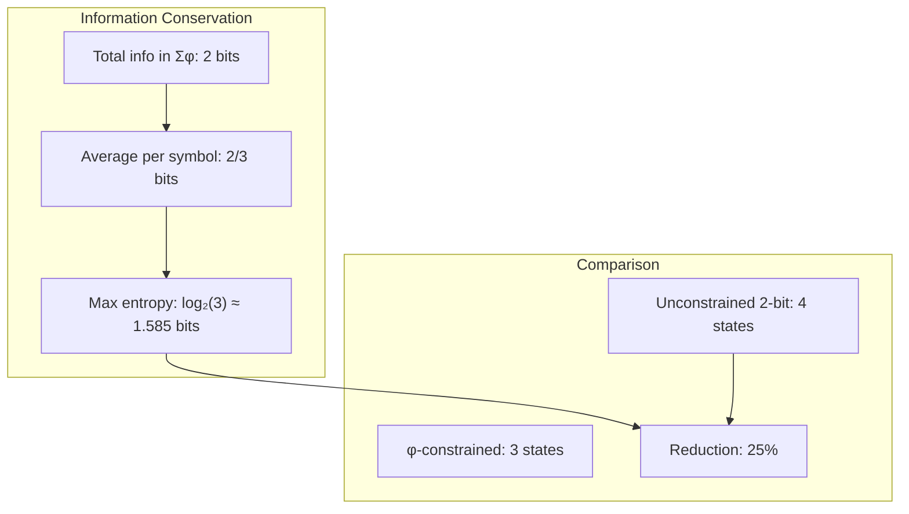

## 2.11 The Language Emerges

From ψ = ψ(ψ) to binary \{0,1\} to φ-constraint to Σφ—each step is necessary:

### The Emergence Chain

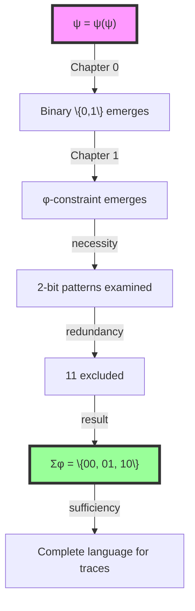

## 2.11 Deep Analysis: Graph Theory, Information Theory, and Category Theory

### 2.11.1 Graph-Theoretic Analysis

From ψ = ψ(ψ) and the binary states, we construct the transition graph:

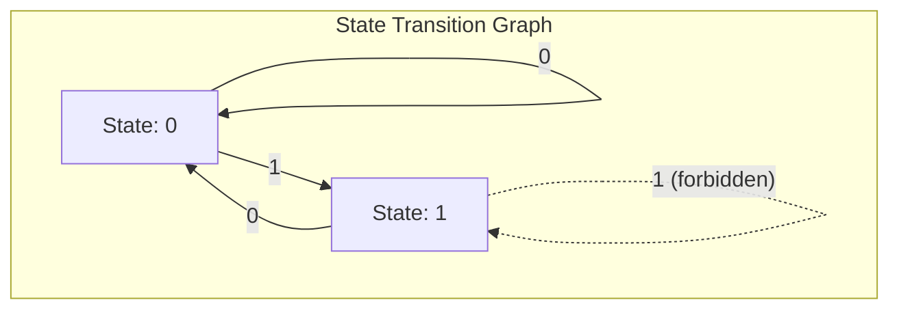

The φ-constraint removes the 1→1 edge, creating a constrained automaton. The alphabet Σφ represents all valid 2-step paths:

- 00: 0→0→0
- 01: 0→0→1 or 1→0→1
- 10: 0→1→0 or 1→1→0 (but 1→1 forbidden, so only first)

**Key Insight**: Σφ emerges as the set of all valid length-2 walks in the φ-constrained transition graph.

### 2.11.2 Information-Theoretic Analysis

From ψ = ψ(ψ), the alphabet carries information about state transitions:

```text
H(Σφ) = -Σ p(σ)log₂p(σ) for σ ∈ {00, 01, 10}
```

With uniform distribution:

- H(Σφ) = log₂(3) ≈ 1.585 bits
- Compare to unconstrained: log₂(4) = 2 bits
- Information saved by constraint: 0.415 bits per symbol

**The φ-constraint acts as a natural compression**, removing redundant information (the 11 pattern) while preserving all meaningful state transitions.

### 2.11.3 Category-Theoretic Analysis

From ψ = ψ(ψ), we construct the category of φ-transitions:

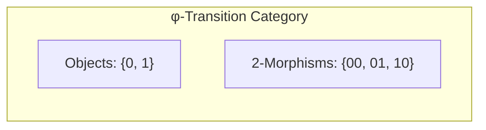

The composition law:

- 00 ∘ 00 = 000 (reducible to 00)
- 00 ∘ 01 = 001 (valid)
- 01 ∘ 10 = 010 (valid)
- 10 ∘ 01 = 101 (valid)
- But 01 ∘ 10 ≠ 0110 (would contain 11)

**Key Insight**: Σφ forms a partial monoid under concatenation, where composition is defined only when it doesn't create 11.

## 2.12 Foundation for Grammar

With Σφ established, we can now build:

- **Syntax trees** from symbol chains
- **Grammar rules** from connection constraints
- **Languages** of arbitrary complexity

All while maintaining the golden constraint!

### Preview: Building Grammar

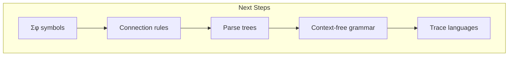

## The 2nd Echo

From the primordial ψ = ψ(ψ) emerged binary distinction. From binary with constraint emerged the three fundamental movements: persistence (00), emergence (01), and return (10). These are not arbitrary symbols but the necessary vocabulary of existence under self-reference.

The exclusion of 11 is not a restriction but a revelation—redundant self-reference within self-reference would collapse the very language that allows expression. In accepting this constraint, we discover that limitation creates possibility, that less enables more.

The φ-alphabet is complete with just three symbols, yet from these three, following the golden thread of connection rules, we can weave any valid trace, tell any story that respects the fundamental constraint of non-redundancy. The Fibonacci pattern persists, confirming that we have found not just an alphabet, but the alphabet—the one that carries the golden ratio in its very structure.

## References

The verification program `chapter-002-phi-alphabet-verification.py` provides executable proofs of all theorems in this chapter. Run it to explore the elegant necessity of Σφ = \{00, 01, 10\}.

---

*Thus from binary constrained by gold emerges the minimal alphabet of three symbols. In this divine parsimony, we find that 00, 01, and 10 are not mere patterns but the fundamental vocabulary of a universe that speaks itself into existence without redundancy, without waste, with perfect golden proportion.*