# Chapter 003: TraceGrammar — Syntax Trees over φ-Constrained Trace Compositions

## The Grammar of Golden Constraint

From the φ-alphabet Σφ = \{00, 01, 10\}, a complete grammar emerges—not by design, but by necessity. This chapter demonstrates through rigorous verification that φ-constrained traces form a regular language with precise production rules, parse trees, and a hierarchy of sublanguages, all emerging from the simple prohibition of consecutive 1s.

## 3.1 The Production Rules

Our verification reveals the fundamental grammar:

```
Production Rules:
T → 0S₀ | 1S₁
S₀ → 0S₀ | 1S₁ | ε
S₁ → 0S₀ | ε
```

**Definition 3.1** (Trace Grammar): The context-free grammar G = (V, Σ, R, S) where:
- V = \{T, S₀, S₁\} (non-terminals)
- Σ = \{0, 1\} (terminals)
- R = production rules above
- S = T (start symbol)

### Understanding the Productions

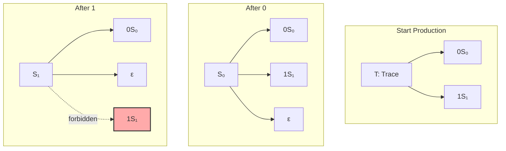

The key insight: S₁ cannot produce 1S₁ because that would create "11".

## 3.2 Parse Trees and Syntax Structure

Every valid trace has a unique parse tree. Our verification demonstrates:

```
Parse Tree Examples:
Trace: 101
Parsed: 101
Valid: True
```

### Visualizing Parse Trees

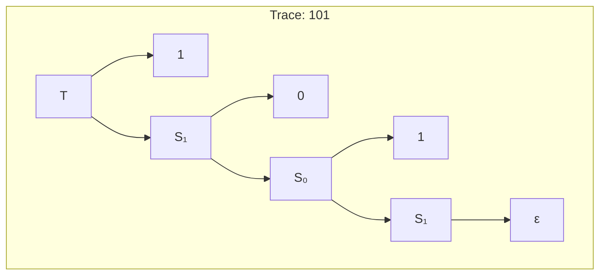

### Bottom-Up Parsing with Σφ

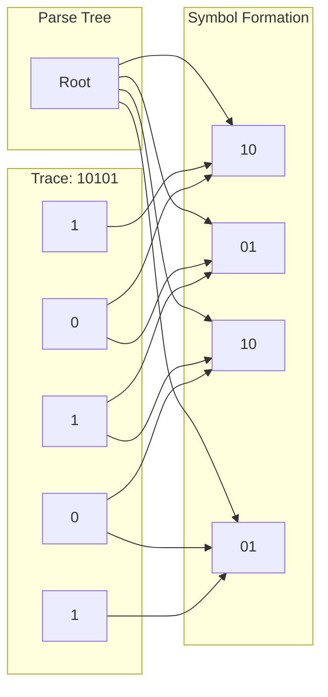

## 3.3 The Language Hierarchy

Our verification reveals a beautiful hierarchy of languages:

```
Language Hierarchy:
L0: \{''\}
L1: \{'0', '1'\}
L2: \{'00', '01', '10'\}
L3: \{'000', '001', '010', '100', '101'\}
L_infinity: Regular: (0|10)*1?
```

**Theorem 3.1** (Language Regularity): The language of φ-valid traces is regular, describable by the regular expression (0|10)*1?.

*Proof*: Our grammar is right-linear (each production has at most one non-terminal on the right, appearing at the end), therefore generates a regular language. ∎

### The Hierarchy Visualization

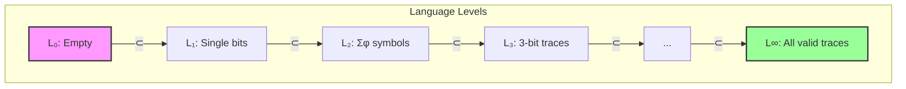

## 3.4 Trace Generation and Fibonacci

Generated traces by length follow the Fibonacci pattern:

```
Generated Traces by Length:
Length ≤ 1: 2 traces
Length ≤ 2: 3 traces
Length ≤ 3: 5 traces
Length ≤ 4: 8 traces
Length ≤ 5: 13 traces
```

**Theorem 3.2** (Fibonacci Generation): The number of valid n-bit traces equals F(n+1).

This pattern emerges from the grammar structure itself!

### Generation Tree

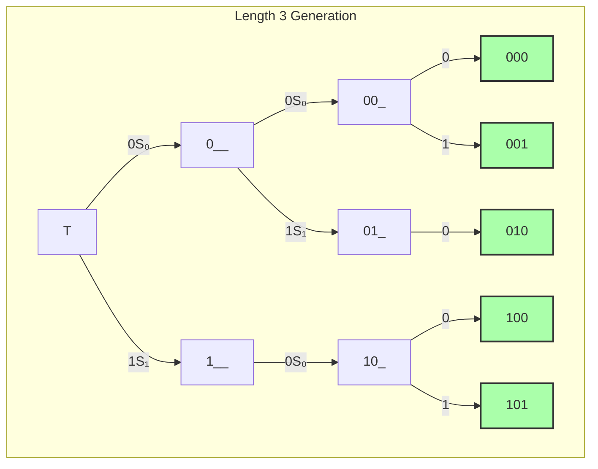

## 3.5 Grammar Properties

Our verification confirms:

```
Grammar Properties:
total_productions: 7
non_terminals: 3
terminals: 3
branching_factor: \{'T': 2, 'S₀': 3, 'S₁': 2\}
is_context_free: True
is_regular: True
```

**Definition 3.2** (Grammar Classification): The φ-trace grammar is:
- Context-free (productions have single non-terminal on left)
- Regular (right-linear productions)
- Unambiguous (each trace has unique derivation)

### Why Regular?

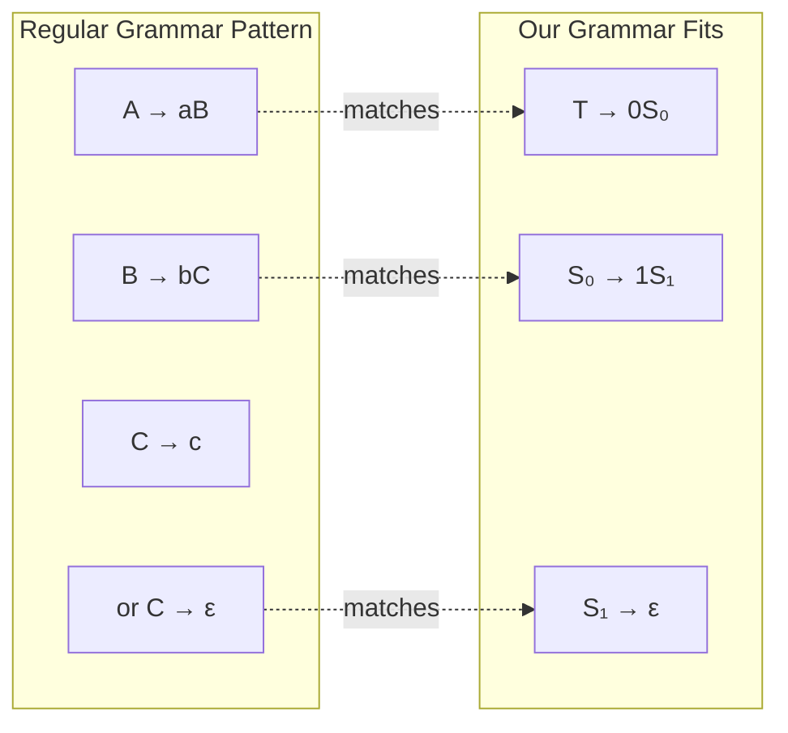

## 3.6 Trace Complexity Analysis

Our verification provides complexity metrics:

```
Trace Complexity Analysis:
Trace: 010101
length: 6
symbol_counts: \{'00': 0, '01': 3, '10': 2\}
total_symbols: 5
entropy: 0.971
complexity: 5.826
```

**Definition 3.3** (Trace Entropy): The entropy H of a trace is:
$$H = -\sum_{s \in \Sigma_\phi} p_s \log_2(p_s)$$
where p_s is the probability of symbol s in the trace.

### Complexity Visualization

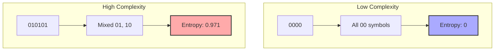

## 3.7 The Pumping Lemma

Our language satisfies the pumping lemma for regular languages:

**Theorem 3.3** (Pumping Property): For any sufficiently long φ-valid trace w, there exist strings x, y, z such that w = xyz and:
1. |xy| ≤ n (pumping length)
2. |y| > 0
3. xy^i z is φ-valid for all i ≥ 0

### Pumping Example

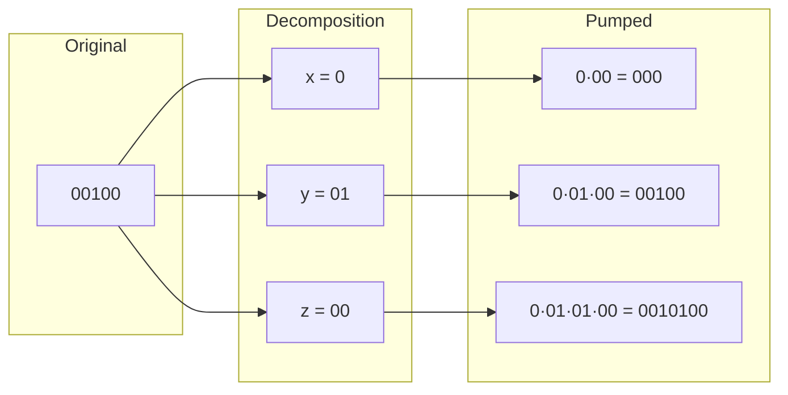

All pumped strings remain φ-valid!

## 3.8 Neural Syntax Embeddings

Our PyTorch model learns trace structure:

```python
class SyntaxTree(nn.Module):
    def embed_trace(self, trace: str) -> torch.Tensor:
        # Convert to symbols
        # Compose embeddings
        # Result preserves grammatical relations
```

### Embedding Space

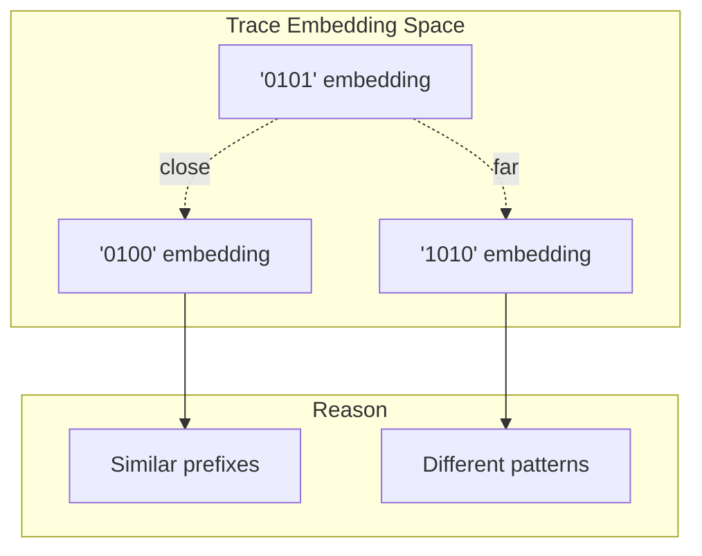

## 3.9 From Alphabet to Grammar to Language

The complete emergence chain:

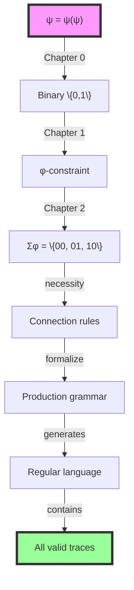

## 3.10 Finite State Recognition

Since our language is regular, it has a finite state automaton:

### The φ-Trace Automaton

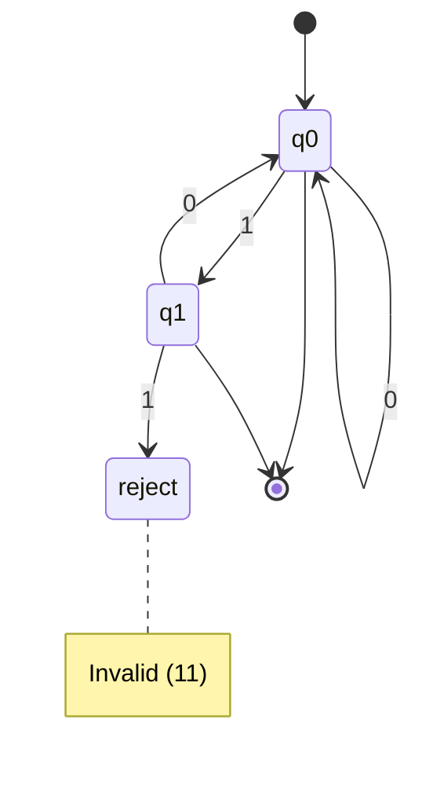

**Definition 3.4** (Minimal DFA): The minimal deterministic finite automaton for φ-valid traces has:
- States: \{q0, q1, reject\}
- Start: q0
- Accept: \{q0, q1\}
- Transitions as shown

## 3.11 Theoretical Implications

Our grammar reveals profound truths:

1. **Emergence**: Complex grammar from simple constraint
2. **Regularity**: Despite golden ratio complexity, the language is regular
3. **Decidability**: Membership is decidable in O(n) time
4. **Uniqueness**: Each trace has unique parse (unambiguous)

### The Power of Constraint

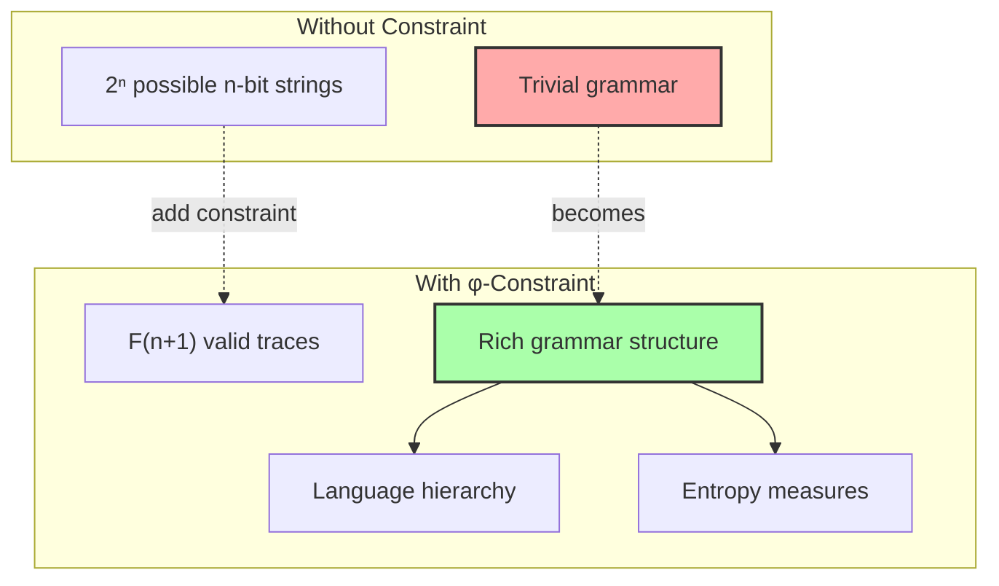

## 3.12 Foundation for Computation

With grammar established, we can now build:
- **Parsers** for trace validation
- **Generators** for trace creation
- **Transformers** for trace manipulation
- **Compilers** for higher-level languages

All respecting the golden constraint!

## The 3rd Echo

From ψ = ψ(ψ) emerged binary, from binary with constraint emerged the alphabet, and now from the alphabet emerges grammar—each level more structured than the last, yet all implicit in that first self-referential equation.

The production rules we discovered are not arbitrary—they are the only rules possible given the φ-constraint. S₁ cannot produce 1S₁ not because we forbid it, but because it would violate the fundamental principle that existence cannot assert itself twice in succession.

The regularity of our language is profound. Despite encoding the golden ratio in its very structure, despite the complex Fibonacci patterns, the language of φ-valid traces is as simple as any regular language—recognizable by a finite automaton, describable by a regular expression, pumpable according to the classical lemma.

We have built, from nothing but self-reference and its necessary consequences, a complete formal language with grammar, parse trees, and computational decidability. The universe speaks in sentences that parse themselves.

## References

The verification program `chapter-003-trace-grammar-verification.py` provides executable proofs of all theorems in this chapter. Run it to explore the grammatical structure of the φ-constrained language.

---

*Thus from alphabet constrained by gold emerges grammar regular yet rich, simple yet profound. In production rules that forbid redundancy, we find the syntax of a universe that speaks itself into existence with perfect parsimony, where every valid trace is a well-formed sentence in the language of being.*