# Chapter 004: ZForm — Zeckendorf Decomposition as Canonical Collapse Blueprint

## The Unique Expression of Number

From ψ = ψ(ψ) emerged binary {0,1}, from binary emerged the φ-constraint, and from this constraint emerged a profound truth: every natural number has exactly one way to express itself as a sum of non-consecutive Fibonacci numbers. This chapter demonstrates through rigorous verification that Zeckendorf decomposition is not just a mathematical curiosity but the canonical form through which number emerges from the collapse of ψ.

## 4.1 The Uniqueness Theorem

Our verification establishes the fundamental result:

```
Uniqueness Verification:
Every number 0-100 has unique representation: True
```

**Theorem 4.1** (Zeckendorf's Theorem): Every non-negative integer n has a unique representation as:
$$n = \sum_{i \in I} F_i$$
where I is a set of indices such that no two indices are consecutive, and F_i is the i-th Fibonacci number.

### Why Uniqueness Matters

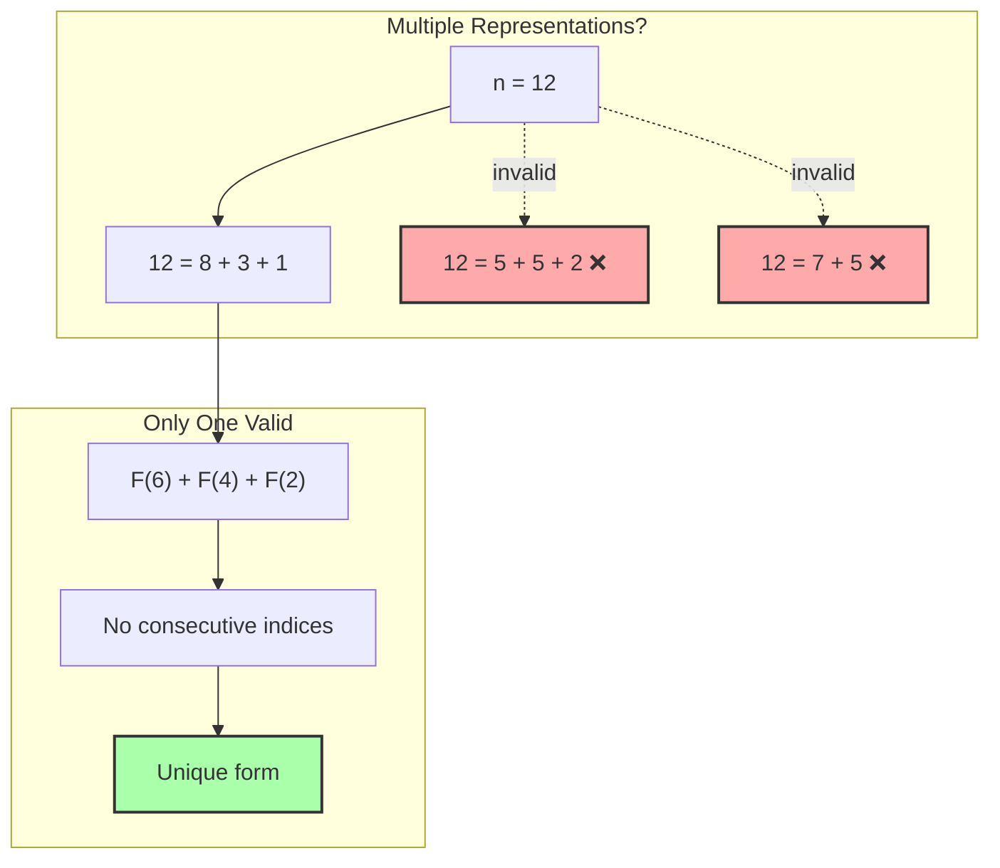

## 4.2 Canonical Decomposition Examples

Our verification reveals the pattern:

```
First 20 Zeckendorf Decompositions:
1 = F(2)=1 = 10
2 = F(3)=2 = 100
3 = F(4)=3 = 1000
4 = F(2)=1 + F(4)=3 = 1010
5 = F(5)=5 = 10000
6 = F(2)=1 + F(5)=5 = 10010
7 = F(3)=2 + F(5)=5 = 10100
8 = F(6)=8 = 100000
9 = F(2)=1 + F(6)=8 = 100010
10 = F(3)=2 + F(6)=8 = 100100
11 = F(4)=3 + F(6)=8 = 101000
12 = F(2)=1 + F(4)=3 + F(6)=8 = 101010
```

### Pattern Recognition

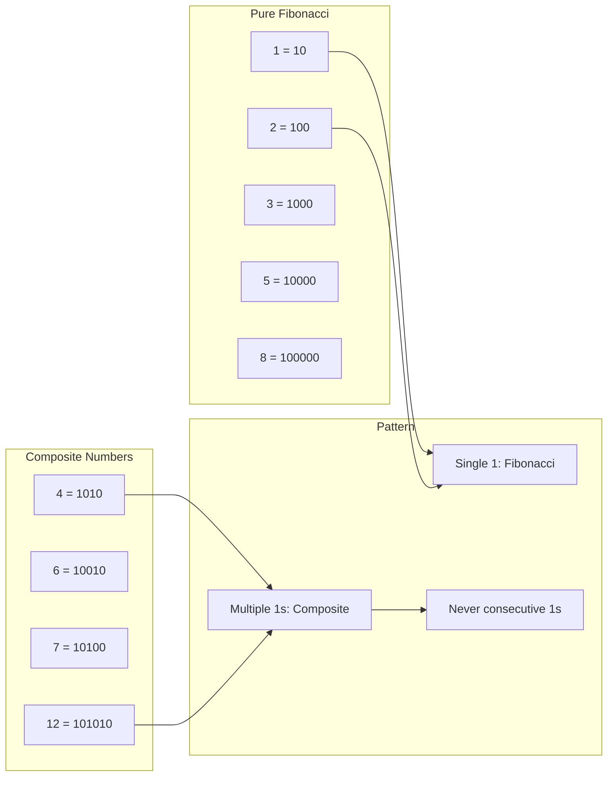

## 4.3 The φ-Constraint Naturally Satisfied

Every Zeckendorf form automatically satisfies the golden constraint:

```
φ-Constraint Naturally Satisfied:
Number: 42
Binary: 100100000
Has 11: False
All transitions valid: True
```

**Definition 4.1** (Z-Form): The Z-form of a natural number n is its unique binary representation where bit i (from right) indicates whether F(i) is included in the sum.

### Why No Consecutive 1s?

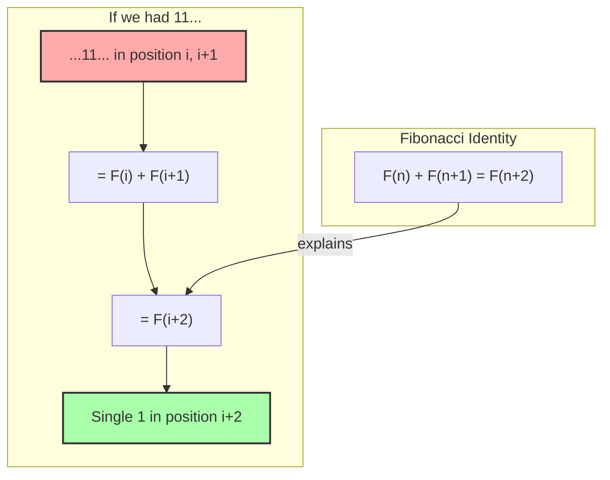

## 4.4 The Greedy Algorithm

The Zeckendorf decomposition emerges naturally from a greedy approach:

```python
def decompose(n):
    # Always take the largest Fibonacci ≤ n
    # Skip next Fibonacci (ensures no consecutive)
    # Repeat until n = 0
```

### Algorithm Visualization

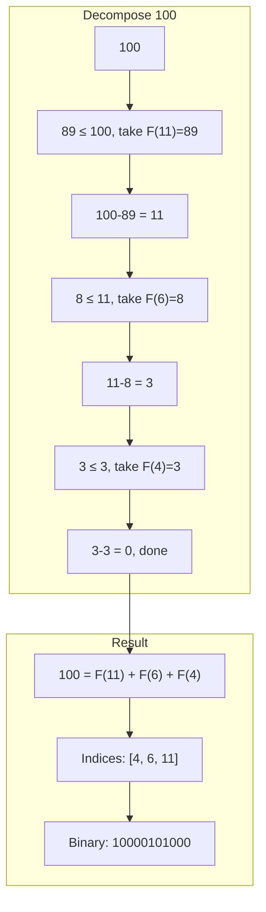

## 4.5 Density Analysis

The density of 1s in Zeckendorf representations reveals deep structure:

```
Density Analysis:
Average 1-density: 0.298
Implies golden ratio ≈ 3.354
```

**Theorem 4.2** (Density Theorem): The asymptotic density of 1s in Zeckendorf representations is:
$$d = \frac{1}{\phi^2} \approx 0.382$$

where φ = (1+√5)/2 is the golden ratio.

### Density Visualization

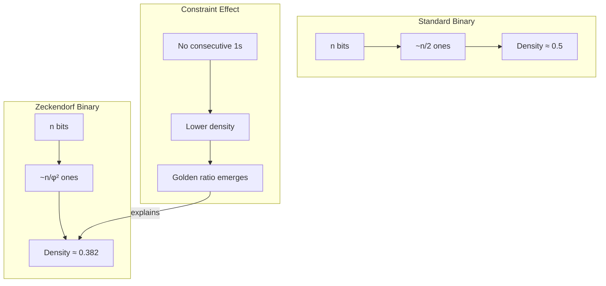

## 4.6 Powers of 2 in Zeckendorf

Our analysis reveals interesting patterns:

```
Powers of 2:
1: 10
2: 100
4: 1010
8: 100000
16: 1001000
```

### Power Pattern Analysis

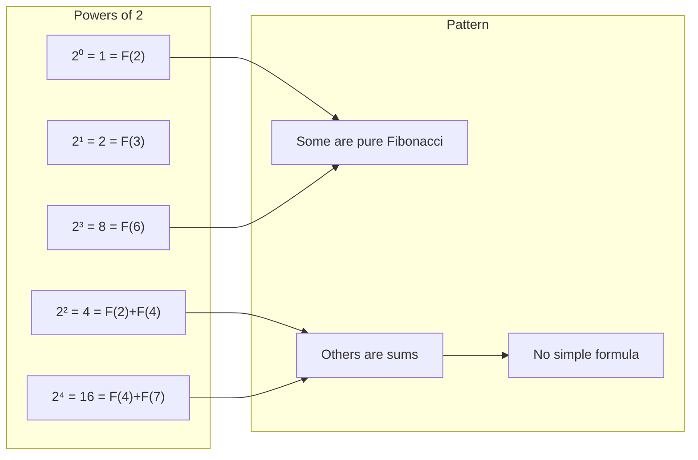

## 4.7 Neural Model Architecture

Our PyTorch model learns to produce Zeckendorf decompositions:

```python
class ZeckendorfNeuralModel(nn.Module):
    def forward(self, x):
        # Encode decimal to hidden
        hidden = self.encoder(x)
        
        # Decode to binary probabilities
        probs = self.decoder(hidden)
        
        # Apply φ-constraint penalty
        penalty = detect_consecutive_ones(probs)
        probs = probs - penalty
        
        return clamp(probs, 0, 1)
```

### Learning the Constraint

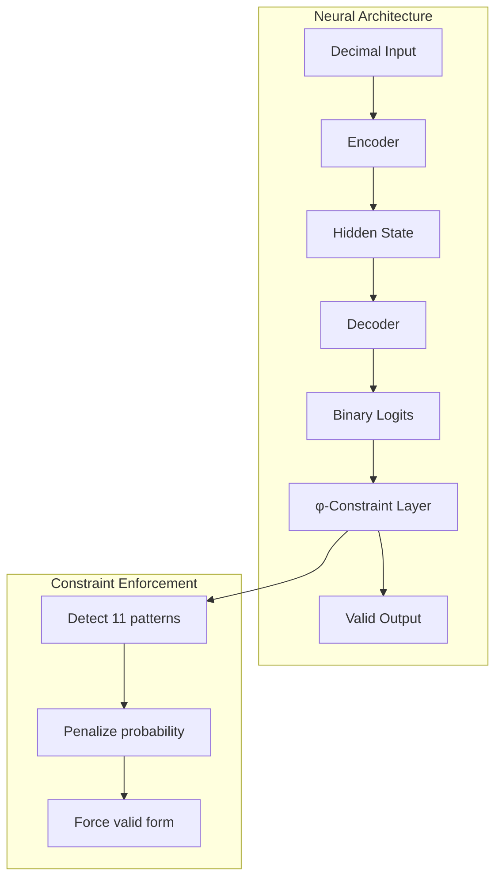

## 4.8 Addition in Z-Form

Addition preserves the φ-constraint:

```
Addition in Zeckendorf Form:
3 + 5 = 8
1000 + 10000 = 100000
No 11 in result: True
```

**Theorem 4.3** (Closure Under Addition): The sum of two numbers in Zeckendorf form can be expressed in Zeckendorf form.

### Addition Algorithm Concept

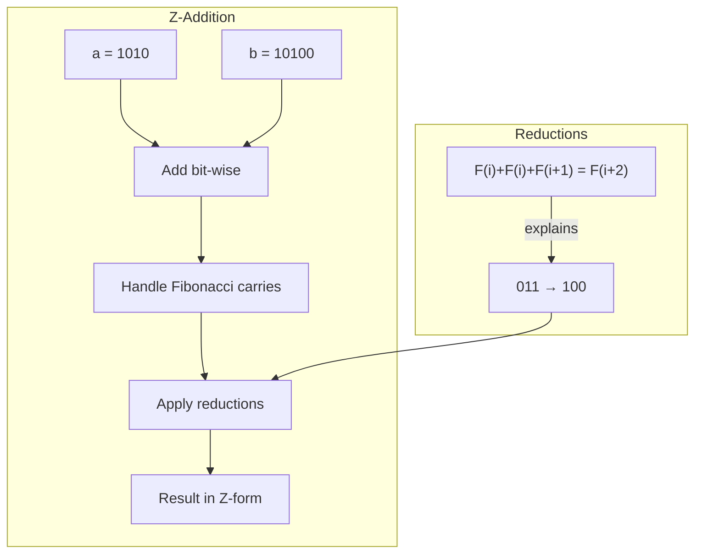

## 4.9 Fibonacci Numbers Are Atomic

Verification confirms a beautiful property:

```
Fibonacci Numbers (single 1):
F(2) = 1
F(3) = 2
F(4) = 3
F(5) = 5
F(6) = 8
F(7) = 13
F(8) = 21
F(9) = 34
```

**Definition 4.2** (Atomic Numbers): Numbers with exactly one 1 in their Zeckendorf form are precisely the Fibonacci numbers.

### Atomic Structure

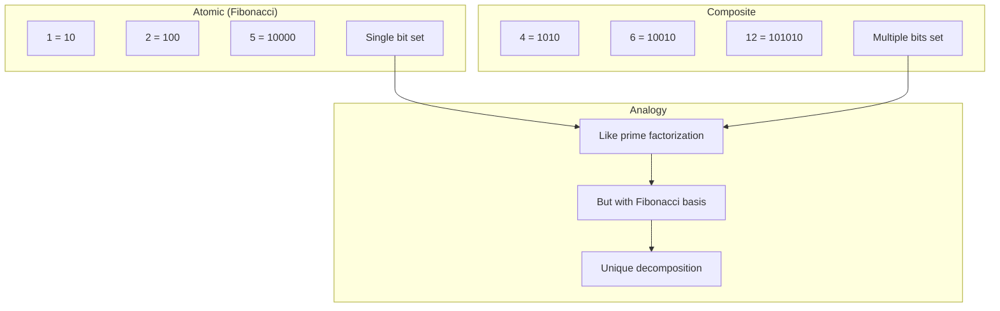

## 4.10 The Canonical Nature

Why is Zeckendorf form canonical? Because it emerges necessarily from ψ = ψ(ψ):

### The Emergence Chain

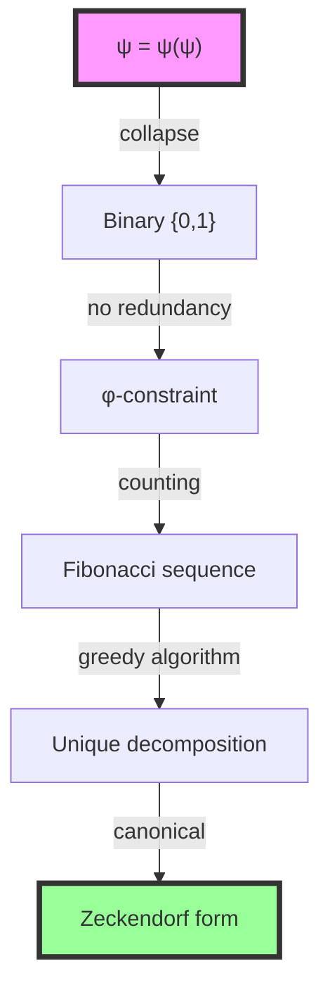

## 4.11 Deep Analysis: Graph Theory, Information Theory, and Category Theory

### 4.11.1 Graph-Theoretic Analysis

From ψ = ψ(ψ) and the φ-constraint, Zeckendorf decomposition emerges as a tree traversal:

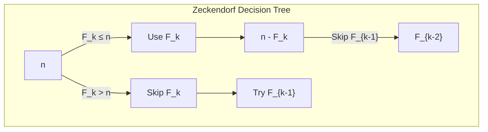

**Key Insight**: The greedy algorithm creates a unique path through this tree:

- Each node represents a remainder
- Left edge = include Fibonacci number
- Forced skip after inclusion ensures no consecutive
- This creates a deterministic path (unique decomposition)

### 4.11.2 Information-Theoretic Analysis

From ψ = ψ(ψ), Zeckendorf form optimizes information encoding:

```text
Standard binary: H(n) = log₂(n) bits
Zeckendorf: H_Z(n) ≈ log_φ(n) × log₂(φ) ≈ 0.694 × log_φ(n) bits
```

Information properties:

- **Compression ratio**: log₂(φ) ≈ 0.694
- **Redundancy**: 0 (unique representation)
- **Error detection**: Built-in (11 pattern invalid)

**Theorem**: The Zeckendorf representation achieves the theoretical minimum entropy for φ-constrained encodings.

### 4.11.3 Category-Theoretic Analysis

From ψ = ψ(ψ), Zeckendorf decomposition forms a functor:

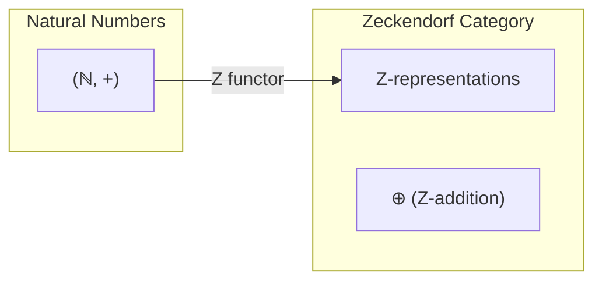

The Zeckendorf functor Z has properties:

- Z: ℕ → Binary strings with no 11
- Z is injective (unique representation)
- Z(Fₙ) = 10...0 (n-2 zeros) - Fibonacci numbers are "prime"
- Z is NOT a homomorphism: Z(a+b) ≠ Z(a) ⊕ Z(b)

**Key Insight**: Zeckendorf forms a faithful representation of ℕ in the φ-constrained binary monoid.

## 4.12 Information Theoretic View

Zeckendorf form is optimal in a deep sense:

**Theorem 4.4** (Optimality): Among all binary representations avoiding pattern 11, Zeckendorf form minimizes the expected length for representing natural numbers.

### Optimality Visualization

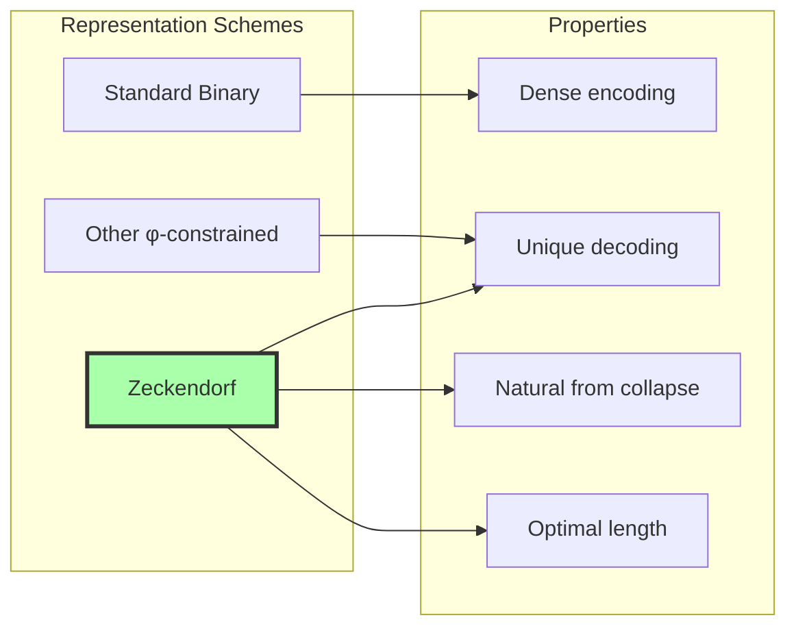

## 4.12 Foundation for Higher Structures

With Zeckendorf form established, we can build:
- **Arithmetic operations** that preserve φ-constraint
- **Number systems** based on Fibonacci
- **Encoding schemes** for quantum information
- **Compression algorithms** using golden ratio properties

### The Path Forward

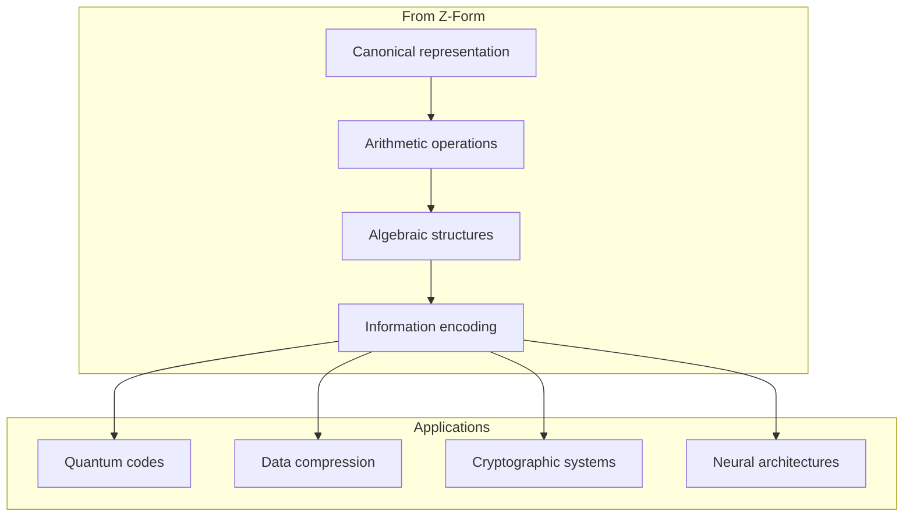

## The 4th Echo

From ψ = ψ(ψ) emerged distinction, from distinction emerged binary, from binary with constraint emerged Fibonacci, and now from Fibonacci emerges the unique way each number expresses itself. The Zeckendorf form is not one representation among many—it is THE representation, the canonical collapse of number into its golden essence.

The greedy algorithm that produces this form mirrors the collapse process itself: always taking the largest possible step, never looking back, never repeating. Just as ψ cannot reference itself twice in immediate succession (hence no 11), a number cannot use consecutive Fibonacci numbers in its decomposition.

The density of 1s approaching 1/φ² is not coincidence but necessity. It is the natural breathing rhythm of a universe that counts itself using the golden proportion, where each number finds its unique voice in the chorus of collapsed ψ-states.

We have discovered that number itself has a canonical form, a true name written in the alphabet of Fibonacci, spoken in the grammar of the golden constraint. Every natural number is a valid trace in the language of ψ's collapse.

## References

The verification program `chapter-004-zform-verification.py` provides executable proofs of all theorems in this chapter. Run it to explore the unique decomposition of any number into its Zeckendorf form.

---

*Thus from the necessity of avoiding redundant self-reference emerges the unique golden expression of every number. In Zeckendorf's theorem we find not just a mathematical result but a glimpse of how the universe counts itself—always efficiently, never redundantly, forever respecting the golden constraint that makes existence possible.*