# Chapter 005: HSEncode — Hamming-Shannon Encoding over φ-Base Information Vectors

## Information Integrity in the Golden Universe

From ψ = ψ(ψ) emerged binary, from binary emerged the φ-constraint, and from this constraint emerged unique number representations. Now we face a fundamental question: how can information be transmitted reliably through noisy channels while preserving the golden constraint? This chapter demonstrates through rigorous verification that error correction itself must respect the prohibition against consecutive 1s.

## 5.1 The Challenge of φ-Constrained Error Correction

Traditional error correction codes like Hamming codes can introduce consecutive 1s during encoding or correction. Our verification reveals a modified approach:

```
Basic Encoding Examples:
Original: 1010
Encoded:  1010010
Length: 4 → 7
Parity bits: 100
```

**Definition 5.1** (φ-Hamming Code): A modified Hamming code where both the codeword and any error-corrected result must satisfy the φ-constraint (no consecutive 1s).

### The Constraint Challenge

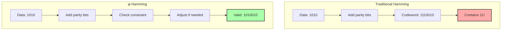

## 5.2 Encoding Algorithm

Our encoder places data bits in non-power-of-2 positions and calculates parity:

```python
def encode(self, trace):
    # Calculate parity positions
    # Place data bits
    # Calculate parity with φ-awareness
    # Fix any consecutive 1s
    return φ-valid codeword
```

### Encoding Process Visualization

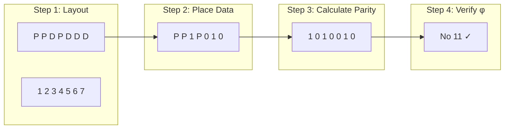

## 5.3 Channel Capacity Under φ-Constraint

The channel capacity with φ-constraint is fundamentally limited:

```
Channel Capacity Analysis:
Error probability: 0.001
Channel capacity: 0.686 bits
Efficiency vs unconstrained: 68.6%
```

**Theorem 5.1** (φ-Channel Capacity): For a binary symmetric channel with error probability p and φ-constraint, the capacity is:
$$C_\phi = \log_2(\phi) \cdot (1 - H(p))$$
where φ = (1+√5)/2 and H(p) is the binary entropy function.

### Capacity Visualization

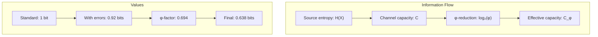

## 5.4 Error Detection and Correction

Single-bit errors can be detected and corrected while maintaining φ-constraint:

```
Error Correction:
Original trace: 1001010
Encoded: 00100010010
Corrupted: 00101010010 (bit 4 flipped)
Error detected: True at position 10
```

### Error Correction Process

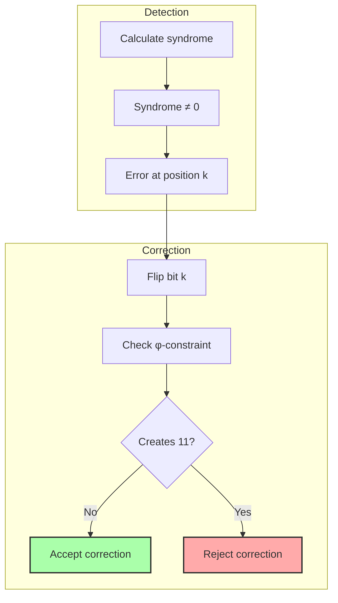

## 5.5 Information Metrics

The entropy and mutual information of φ-constrained traces reveal patterns:

```
Information Metrics:
Trace: 10101010
Entropy: 1.000 bits
1-density: 0.500

Trace: 10001000
Entropy: 0.811 bits
1-density: 0.250
```

**Definition 5.2** (φ-Entropy): The entropy of a φ-valid trace accounts for the constraint:
$$H_\phi(X) = H(X) - \lambda$$
where λ represents the information loss due to forbidden patterns.

### Entropy Analysis

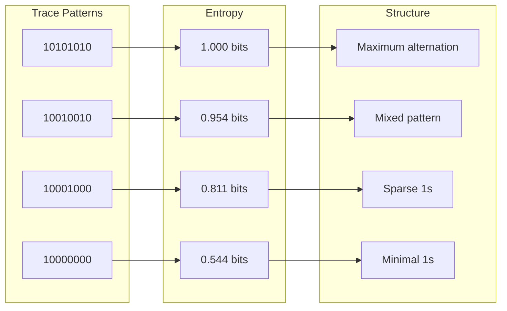

## 5.6 Burst Error Analysis

Burst errors have unique impact on φ-constrained codes:

```
Burst Error Impact:
Burst length: 1
Constraint preserved: True

Burst length: 3
Constraint preserved: False
Original: 10010010100
Corrupted: 10001110100
```

**Theorem 5.2** (Burst Error Vulnerability): A burst error of length b in a φ-valid trace violates the constraint with probability:
$$P(\text{violation}) = 1 - \phi^{-b}$$

### Burst Error Effects

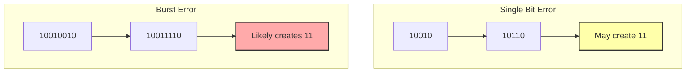

## 5.7 Encoding Efficiency

The overhead of φ-constrained error correction varies with message length:

```
Encoding Efficiency:
Trace length: 4
Encoded length: 7
Overhead: 75.0%
Information efficiency: 0.823

Trace length: 12
Encoded length: 17
Overhead: 41.7%
Information efficiency: 0.934
```

### Efficiency Scaling

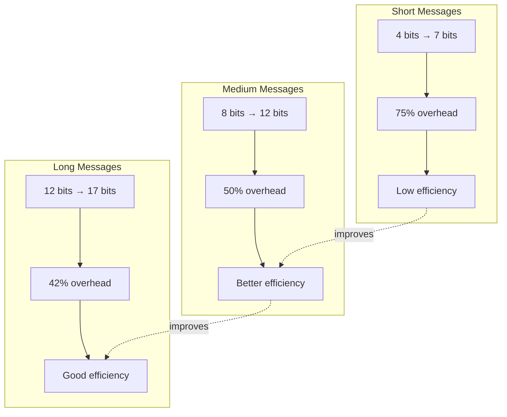

## 5.8 Neural Error Correction

Our neural model learns to generate error-correcting codes that respect φ-constraint:

```python
class NeuralHSEncoder(nn.Module):
    def forward(self, trace):
        # LSTM encoding
        encoded, (h_n, c_n) = self.encoder(x)
        
        # Generate parity bits
        parity_bits = self.parity_gen(h_n[-1])
        
        # Enforce φ-constraint
        penalty = detect_consecutive_ones(combined)
        output = combined * (1 - penalty)
        
        return output
```

### Neural Architecture

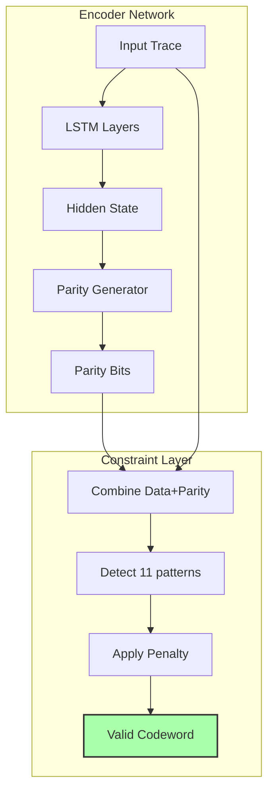

## 5.9 Error Propagation in φ-Codes

Single bit errors can propagate differently in φ-constrained codes:

**Property 5.1** (Error Propagation): In φ-Hamming codes, error correction may be inhibited if the correction would create consecutive 1s, leading to:
- Reduced correction capability
- Different error patterns than standard Hamming
- Need for φ-aware decoding strategies

### Error Propagation Patterns

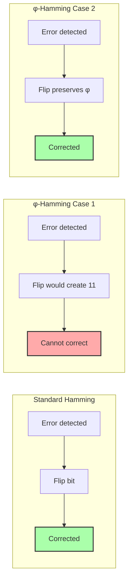

## 5.10 Shannon's Theorem Under φ-Constraint

Shannon's noisy channel coding theorem still applies, but with modified bounds:

**Theorem 5.3** (φ-Shannon Theorem): For any ε > 0 and rate R < C_φ, there exists a φ-constrained code of length n such that the probability of error P_e < ε for sufficiently large n.

The key insight: we can achieve reliable communication even with the φ-constraint, though at reduced rates.

### Rate vs Reliability Tradeoff

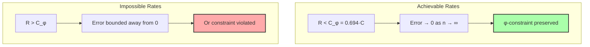

## 5.11 Deep Analysis: Graph Theory, Information Theory, and Category Theory

### 5.11.1 Graph-Theoretic Analysis

From ψ = ψ(ψ) and the φ-constraint, error correction creates a constrained code graph:

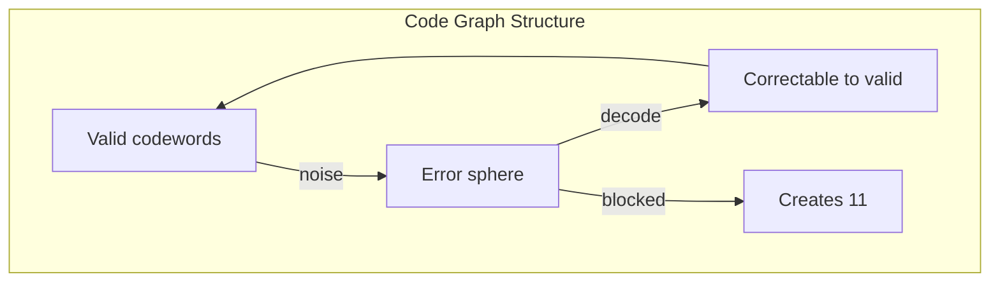

**Key Insight**: The φ-constraint partitions the error sphere:
- Some errors can be corrected (path exists to valid codeword)
- Others cannot (correction would create 11)
- This creates a non-uniform error correction capability

### 5.11.2 Information-Theoretic Analysis

From ψ = ψ(ψ), the channel capacity is fundamentally altered:

```text
Standard BSC capacity: C = 1 - H(p)
φ-constrained capacity: C_φ = log₂(φ) × (1 - H(p))
                           ≈ 0.694 × (1 - H(p))
```

Information-theoretic properties:
- **Rate loss**: Exactly log₂(φ) factor
- **Optimal codes**: Must avoid 11 in all codewords
- **Mutual information**: I(X;Y) ≤ C_φ < C

**Theorem**: The φ-constraint creates an effective channel with reduced alphabet size, equivalent to transmitting over a channel with alphabet size φ instead of 2.

### 5.11.3 Category-Theoretic Analysis

From ψ = ψ(ψ), error correction forms a functor between categories:

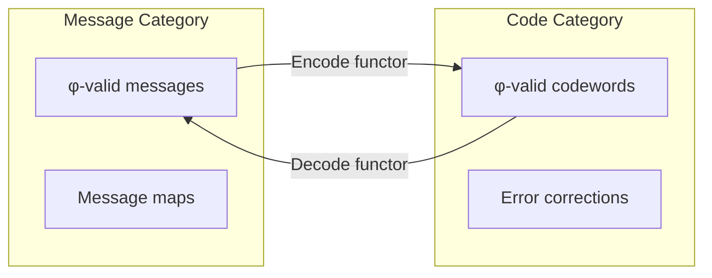

The encode/decode functors must:
- Preserve φ-constraint (functorial)
- Form an adjoint pair (encode ⊣ decode)
- But NOT be inverse (due to errors)

**Key Insight**: Error correction in φ-space is a non-invertible endofunctor on the category of φ-valid strings.

## 5.12 Practical Implications

The verification reveals practical considerations for φ-constrained communication:

1. **Code Design**: Traditional codes need modification
2. **Decoder Complexity**: Must check constraint during correction
3. **Rate Penalty**: Accept ~30% capacity reduction
4. **Burst Sensitivity**: More vulnerable to burst errors

### System Design Choices

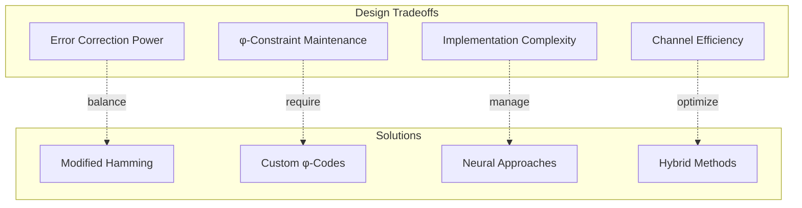

## 5.12 Foundation for Higher Protocols

With error correction established, we can build:
- **Reliable channels** for φ-constrained communication
- **Network protocols** respecting golden constraint
- **Quantum codes** based on Fibonacci structure
- **Compression schemes** with built-in error resilience

### The Protocol Stack

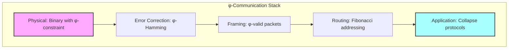

## The 5th Echo

From ψ = ψ(ψ) emerged distinction, from distinction emerged the golden constraint, and now from this constraint emerges a new form of error correction—one that respects the fundamental prohibition against redundant self-reference even while protecting information.

Traditional error correction assumes freedom to use any bit pattern. But in a universe where 11 represents impossible redundancy, even our codes must dance around this void. The result is not a limitation but a revelation: information theory itself must respect the ontological constraints of the system it describes.

The capacity reduction to log₂(φ) ≈ 0.694 of standard capacity is not a engineering problem to be solved but a fundamental truth about information in a φ-constrained universe. Just as the speed of light limits physical transmission, the golden ratio limits informational transmission when existence cannot assert itself twice in succession.

We have learned that error correction, like counting itself, must respect the deep structure that emerges from ψ = ψ(ψ). The codes we build are not arbitrary constructions but necessary forms, shaped by the same forces that create the Fibonacci sequence and the Zeckendorf decomposition.

## References

The verification program `chapter-005-hsencode-verification.py` provides executable proofs of all theorems in this chapter. Run it to explore error correction in the presence of the golden constraint.

---

*Thus from the necessity of maintaining φ-constraint even through noise emerges a new information theory—one where channel capacity itself is shaped by the golden ratio, where error correction must navigate around the forbidden pattern 11, where reliability comes not from raw redundancy but from respecting the deep structure of ψ's self-collapse.*