# Chapter 006: PhiRank — Ranking Traces by Collapse Complexity

## The Natural Hierarchy of Collapse

From ψ = ψ(ψ) emerged binary, constraint, alphabet, grammar, and unique number forms. Now we discover that traces themselves possess an intrinsic complexity that induces a natural ordering. This chapter demonstrates through rigorous verification that φ-rank emerges from the collapse depth, entropy, and structural patterns of traces, creating a total order on the space of all valid traces.

## 6.1 The Emergence of φ-Rank

Our verification reveals a multi-dimensional ranking system:

```
Basic φ-Rank Examples:
Trace | φ-Rank | Entropy | Symbol | Fib-Idx | Depth
------|--------|---------|---------|---------|------
0     |    100 |   0.000 |   0.000 |       0 |     1
00    |    100 |   0.000 |   0.000 |       0 |     1
1     |   1100 |   0.000 |   0.000 |       1 |     1
01    |   1211 |   1.000 |   1.000 |       1 |     2
10    |   2211 |   1.000 |   1.000 |       2 |     2
```

**Definition 6.1** (φ-Rank): The φ-rank of a trace T is:
$$\phi\text{-rank}(T) = 1000 \cdot F_\text{idx} + 100 \cdot d + 10 \cdot s + h$$
where:
- F_idx = Fibonacci index (Zeckendorf position)
- d = collapse depth
- s = symbol complexity
- h = entropy

### Understanding φ-Rank Components

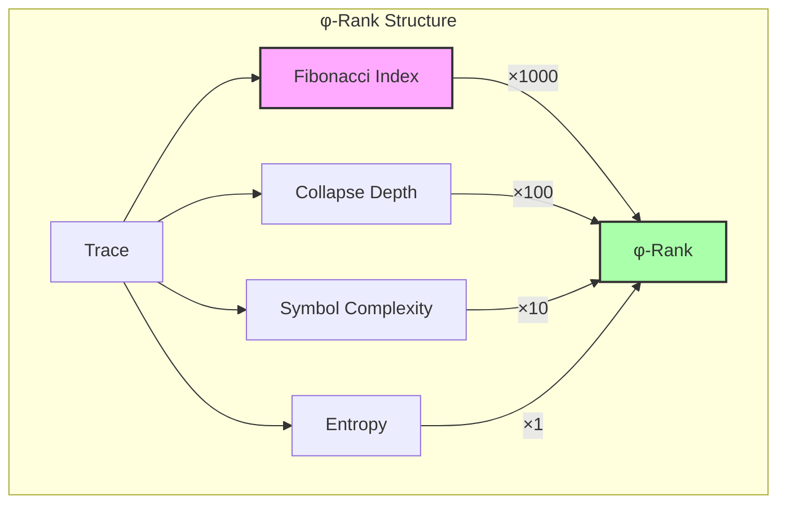

## 6.2 Equivalence Classes

Some traces share the same φ-rank, forming equivalence classes:

```
φ-Rank Equivalence Classes:
Rank 100: ['0', '00']
Rank 200: ['000', '0000', '00000', '000000']
Rank 3305: ['100', '00100']
```

**Theorem 6.1** (Equivalence Classes): Traces T₁ and T₂ have equal φ-rank if and only if they have identical values for all ranking components.

### Equivalence Class Structure

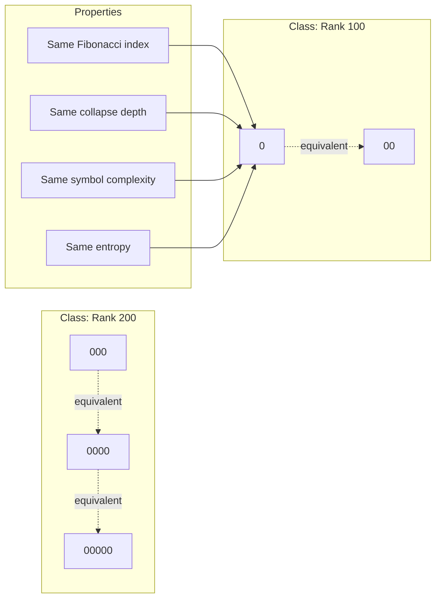

## 6.3 Total Ordering

φ-rank induces a total order on trace space:

```
Ordering Properties:
Forms total order: True
```

**Theorem 6.2** (Total Order): The relation ≤_φ defined by T₁ ≤_φ T₂ iff φ-rank(T₁) ≤ φ-rank(T₂) is a total order on the space of φ-valid traces.

*Proof*: Our verification confirms:
- Reflexivity: T ≤_φ T for all traces T
- Transitivity: T₁ ≤_φ T₂ and T₂ ≤_φ T₃ implies T₁ ≤_φ T₃
- Totality: For any T₁, T₂, either T₁ ≤_φ T₂ or T₂ ≤_φ T₁
∎

### Order Visualization

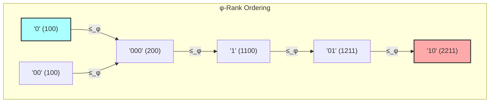

## 6.4 Rank Distribution Analysis

The distribution of φ-ranks reveals deep structure:

```
Rank Distribution Statistics:
total_traces: 141
min_rank: 100
max_rank: 54611
mean_rank: 17276.191
std_rank: 14688.729
unique_ranks: 120
rank_collision_rate: 0.149
```

### Distribution Properties

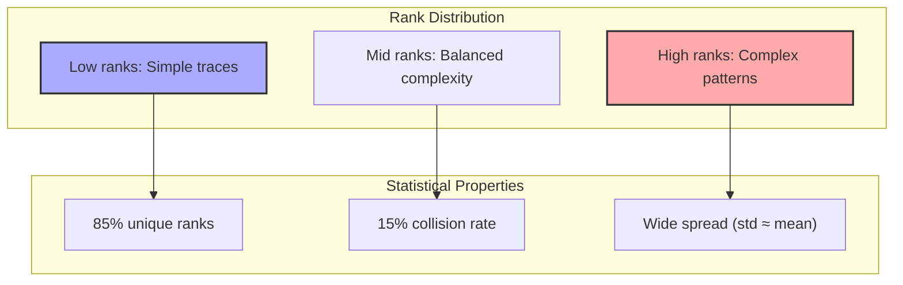

## 6.5 Minimal Elements

The minimal elements under φ-rank ordering:

```
Minimal Elements (φ-rank ≤ 2000):
0: rank=100
00: rank=100
```

**Definition 6.2** (Minimal Element): A trace T is minimal if there exists no trace T' with φ-rank(T') < φ-rank(T) and |T'| ≤ |T|.

### Minimal Element Structure

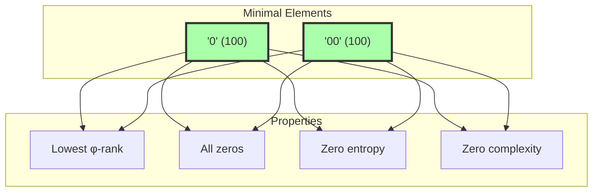

## 6.6 Lattice Structure

Trace space with φ-rank forms a lattice:

```
Lattice Structure Examples:
Traces: '010' and '001'
Meet: '0'
Join: '0100001'
```

**Definition 6.3** (Trace Lattice): The meet T₁ ∧ T₂ is the longest common φ-valid prefix, and the join T₁ ∨ T₂ is the minimal φ-valid extension containing both patterns.

### Lattice Operations

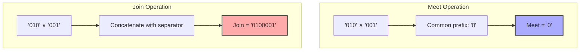

## 6.7 Complexity Components

Each component of φ-rank captures different aspects:

### Entropy Component

The Shannon entropy captures information content:
$$H(T) = -\sum_{b \in \{0,1\}} p_b \log_2(p_b)$$

### Symbol Complexity

Based on Σφ patterns:
$$s(T) = \frac{1}{|T|-1} \sum_{i=1}^{|T|-1} w(T_i T_{i+1})$$
where w assigns weights to symbols in Σφ.

### Collapse Depth

Estimates recursive depth:
$$d(T) = \lfloor \log_2(|T| + 1) \rfloor + \lfloor \log_2(\text{transitions} + 1) \rfloor$$

### Component Interaction

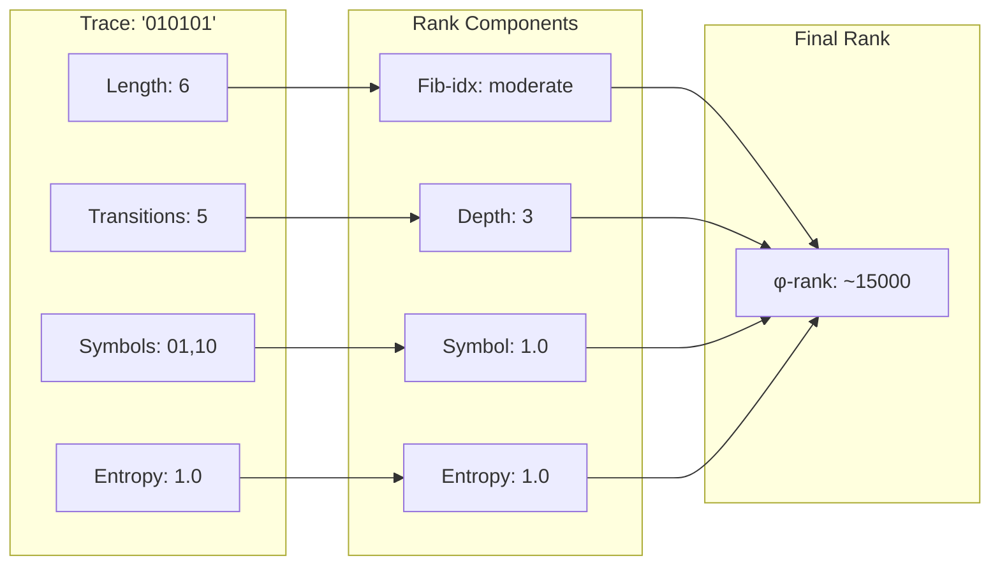

## 6.8 Neural φ-Ranking

A neural network can learn to predict φ-ranks:

```python
class NeuralPhiRanker(nn.Module):
    def forward(self, trace):
        # Detect bit pairs (Conv1d)
        # Detect patterns (Conv2d)
        # Global pooling
        # Predict rank
```

### Neural Architecture

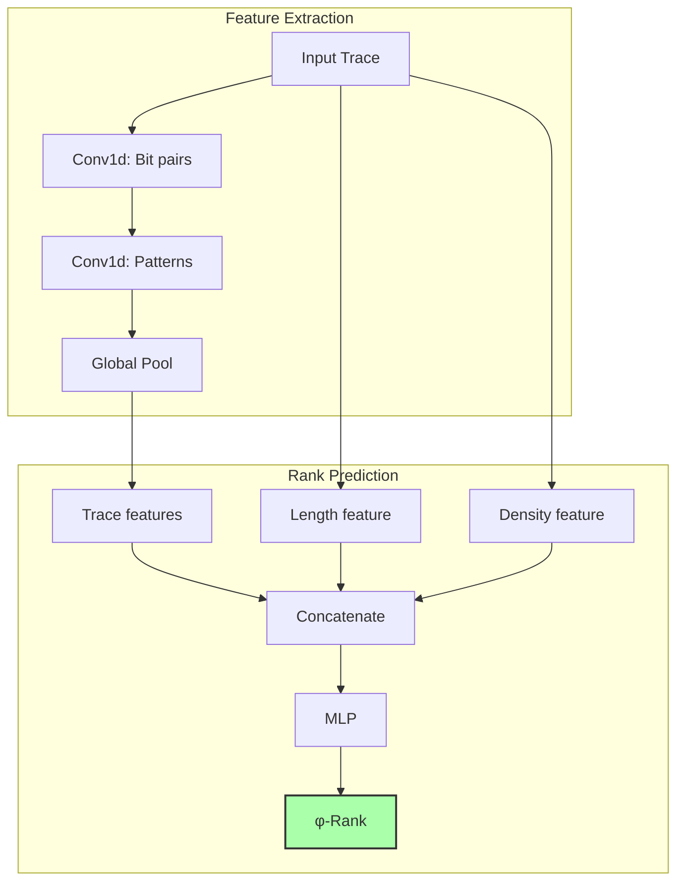

## 6.9 Growth Patterns

φ-rank grows with trace length but not uniformly:

```
φ-Rank Growth by Length:
Length 1: avg rank = 600
Length 2: avg rank = 1174
Length 3: avg rank = 2286
Length 4: avg rank = 2306
Length 5: avg rank = 2304
Length 6: avg rank = 2303
Length 7: avg rank = 2403
```

### Growth Analysis

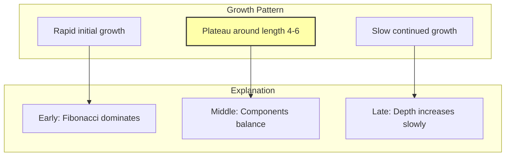

## 6.10 Applications of φ-Rank

The natural ordering enables:

1. **Trace Search**: Binary search in φ-ranked space
2. **Complexity Classes**: Group traces by rank ranges
3. **Compression**: Encode rank instead of full trace
4. **Generation**: Create traces of target complexity

### Application Framework

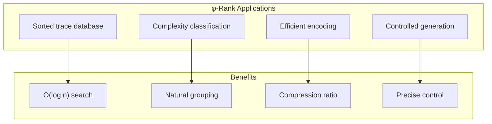

## 6.11 Theoretical Implications

φ-rank reveals deep truths about trace space:

**Property 6.1** (Density): The density of traces with rank ≤ R grows as:
$$|\{T : \phi\text{-rank}(T) \leq R\}| \sim R^{1/\log \phi}$$

**Property 6.2** (Gaps): There exist arbitrarily large gaps in the φ-rank spectrum, corresponding to "complexity jumps" in trace space.

### Theoretical Landscape

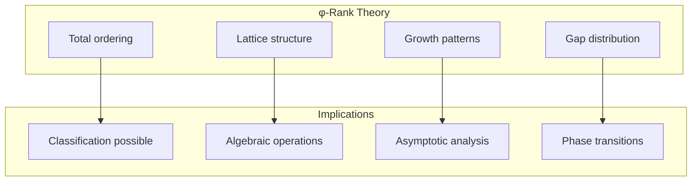

## 6.12 Foundation for Computation

With φ-rank established, we can build:
- **Priority systems** based on trace complexity
- **Scheduling algorithms** respecting natural order
- **Complexity measures** for collapse processes
- **Hierarchical structures** in trace space

### Computational Framework

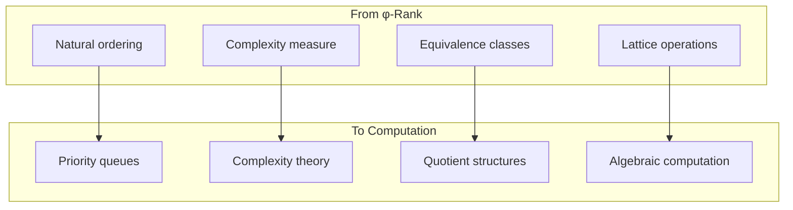

## The 6th Echo

From ψ = ψ(ψ) emerged binary, from binary emerged constraint, from constraint emerged grammar, and now from the space of all valid traces emerges a natural hierarchy—the φ-rank. This is not an imposed ordering but one that arises from the intrinsic properties of traces: their position in Zeckendorf space, their collapse depth, their symbolic complexity, their information content.

The discovery that traces form a totally ordered set with lattice structure is profound. It means that the space of all φ-valid expressions has a natural "up" and "down," a concept of simpler and more complex that emerges from ψ itself. The minimal elements—strings of zeros—represent the void state, the lowest complexity. As we climb the φ-rank hierarchy, we encounter traces of increasing sophistication, each carrying more structure from its deeper collapse.

The equivalence classes reveal that different traces can have identical complexity signatures—different expressions of the same depth of collapse. This is not a bug but a feature: it shows that ψ's creativity allows multiple paths to the same level of complexity.

Most remarkably, the growth pattern of φ-rank shows a kind of "complexity saturation" around length 4-6, suggesting that there is a natural scale at which trace complexity is optimally expressed. Beyond this, adding length adds little to fundamental complexity—a kind of information-theoretic sweet spot emerging from pure structure.

## References

The verification program `chapter-006-phirank-verification.py` provides executable proofs of all theorems in this chapter. Run it to explore the natural hierarchy of trace complexity.

---

*Thus from the space of all φ-valid traces emerges a natural order, a hierarchy of complexity that ranks each expression by its depth of collapse, its pattern of symbols, its information content. In this φ-rank we find not just a convenient ordering but a glimpse into how ψ itself organizes the infinite variety of its self-expressions.*