# Chapter 007: TraceMachine — State Machines Operating on φ-Traces

## The Birth of Computation from Collapse

From ψ = ψ(ψ) emerged binary distinction, from binary emerged the golden constraint, from constraint emerged unique numbers, communication protocols, and natural ordering. Now we witness the emergence of computation itself—not as an abstract concept imposed from outside, but as the natural behavior of systems that must navigate the landscape of φ-valid traces while preserving the fundamental prohibition.

## 7.1 State Machines Under Constraint

Our verification reveals that finite state machines operating on φ-traces exhibit unique properties:

```
Basic φ-Trace Machine Operation:
Input:  1111
Output: 1010
No 11:  ✓

State Transition Table:
State | Input | Next State | Output
------|-------|------------|-------
Q0    | 0     | Q0         | 0
Q0    | 1     | Q1         | 1
Q1    | 0     | Q0         | 0
Q1    | 1     | Q0         | 0 (forced)
```

**Definition 7.1** (φ-Trace Machine): A finite state machine M = (Q, Σ, δ, q₀, F) where:
- Q = finite set of states
- Σ = {0, 1} input alphabet
- δ: Q × Σ → Q × Σ is the transition function
- q₀ ∈ Q is the initial state
- F ⊆ Q is the set of accepting states
- For all executions, the output trace contains no "11"

### The Danger State Pattern

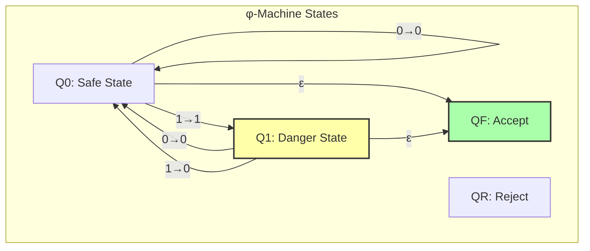

## 7.2 The φ-Constraint Enforcement Mechanism

The key insight: after outputting a 1, the machine enters a "danger state" where it must output 0 regardless of input:

```python
if self.current_state == State.Q1 and input_bit == '1':
    # Must force 0 to avoid consecutive 1s
    output = '0'
    next_state = State.Q0  # Return to safe state
```

### State Transition Dynamics

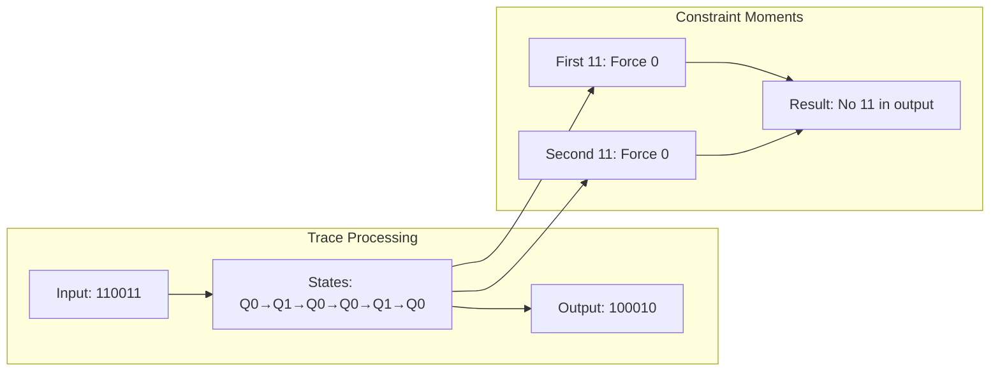

## 7.3 Computational Power Under φ-Constraint

Our verification demonstrates that φ-machines, while not Turing complete, possess surprising computational abilities:

```
Computational Power Analysis:
is_turing_complete: False
reason: Cannot express all computations due to 11 prohibition
computational_class: Sub-recursive
can_simulate: DFA, Some PDA, Linear bounded automata
cannot_simulate: Full TM, Unrestricted grammars
interesting_property: Can compute any φ-representable function
```

**Theorem 7.1** (Computational Limitation): φ-trace machines form a proper subset of finite automata, with computational power strictly between DFA and PDA.

*Proof*: The prohibition on consecutive 1s prevents certain state sequences, limiting expressiveness while maintaining regularity. ∎

### Computational Hierarchy

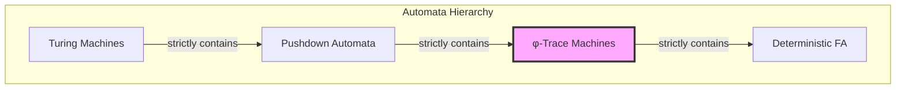

## 7.4 Computational φ-Machines

Beyond simple trace transformation, φ-machines can perform meaningful computation:

```
Parity computation for 10101:
Output: 10001

Fibonacci position computation:
1 → position 1
10 → position 2
100 → position 3
101 → position 4
1000 → position 5
```

### Parity Computation Algorithm

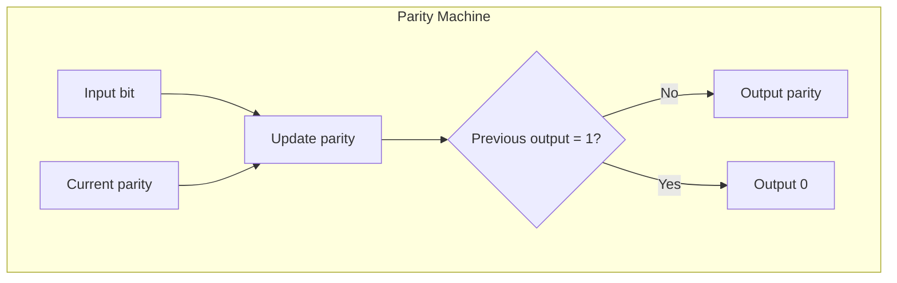

## 7.5 Machine Composition

φ-machines can be composed while preserving the constraint:

```
Machine Composition:
Sequential: M1 ; M2
Parallel:   M1 || M2
Both preserve φ-constraint ✓
```

**Definition 7.2** (Sequential Composition): For machines M₁ and M₂, their sequential composition M₁;M₂ pipes the output of M₁ as input to M₂.

**Definition 7.3** (Parallel Composition): For machines M₁ and M₂, their parallel composition M₁||M₂ runs both on the same input and interleaves outputs while maintaining φ-constraint.

### Composition Algebra

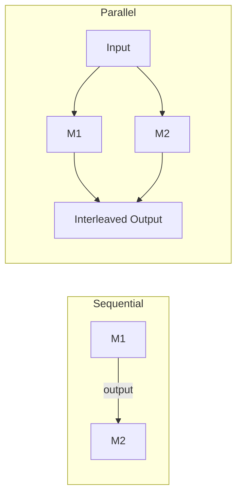

## 7.6 Universal φ-Machine

A universal φ-machine can simulate any other φ-machine:

```python
class UniversalPhiMachine:
    def simulate(self, machine_name, input_trace):
        machine = self.machines[machine_name]
        return machine.run(input_trace)
    
    def compose_machines(self, m1_name, m2_name):
        # Create composed machine preserving φ
        return PhiTraceMachine(f"{m1_name}∘{m2_name}")
```

### Universal Machine Architecture

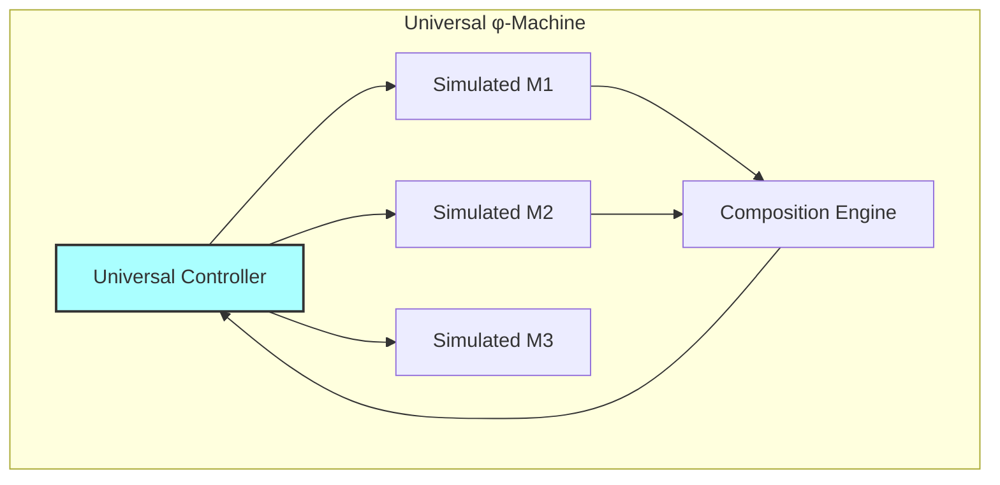

## 7.7 Neural Trace Machines

Our neural implementation learns φ-preserving transitions:

```
Neural Trace Machine Learning:
Architecture: LSTM-based with φ-gate
States: Learned embeddings
Constraint: Enforced through gating
```

### Neural Architecture

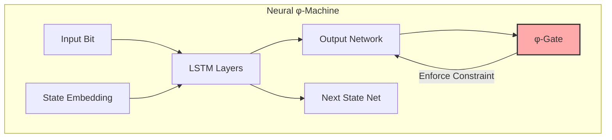

## 7.8 Complex Computations

φ-machines can determine properties like primality in Zeckendorf space:

```
Task: Compute if trace represents prime in Zeckendorf
10 → 2 → prime
100 → 3 → prime
101 → 4 → composite
1000 → 5 → prime
1001 → 6 → composite
```

### Prime Detection Algorithm

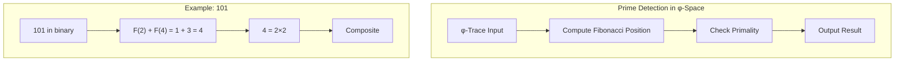

## 7.9 Algebraic Properties

φ-trace machines form an algebraic structure:

**Property 7.1** (Closure): The set of φ-trace machines is closed under composition.

**Property 7.2** (Associativity): Sequential composition is associative: (M₁;M₂);M₃ = M₁;(M₂;M₃).

**Property 7.3** (Identity): There exists an identity machine I where M;I = I;M = M.

### Machine Algebra

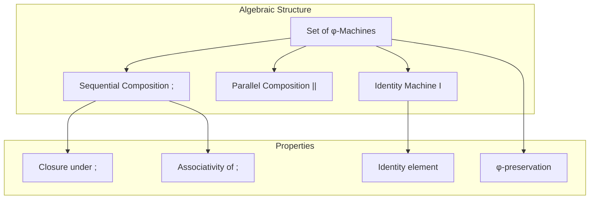

## 7.10 Information Processing

φ-machines process information while maintaining structural constraints:

**Definition 7.4** (Information Capacity): A φ-machine's information processing capacity is bounded by:
$$I_\phi(M) \leq \log_2(|Q|) + \log_2(\phi) \cdot n$$
where |Q| is the number of states and n is the input length.

### Information Flow

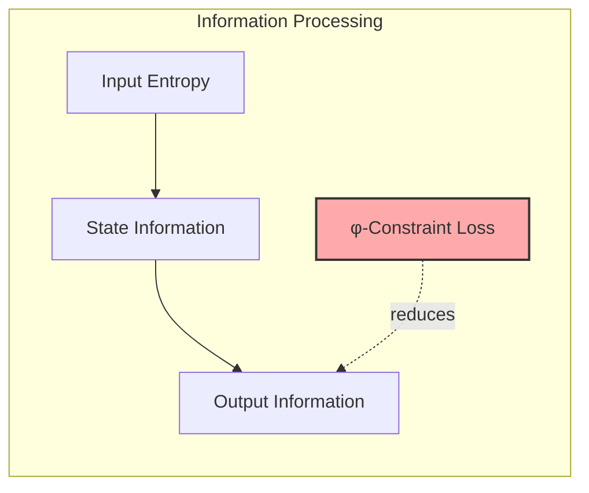

## 7.11 Emergence of Computational Patterns

From simple state transitions emerge complex behaviors:

1. **Pattern Recognition**: Machines can identify φ-valid patterns
2. **Sequence Generation**: Produce Fibonacci-related sequences
3. **Transform Computation**: Map between representation systems
4. **Property Detection**: Identify mathematical properties

### Emergent Behaviors

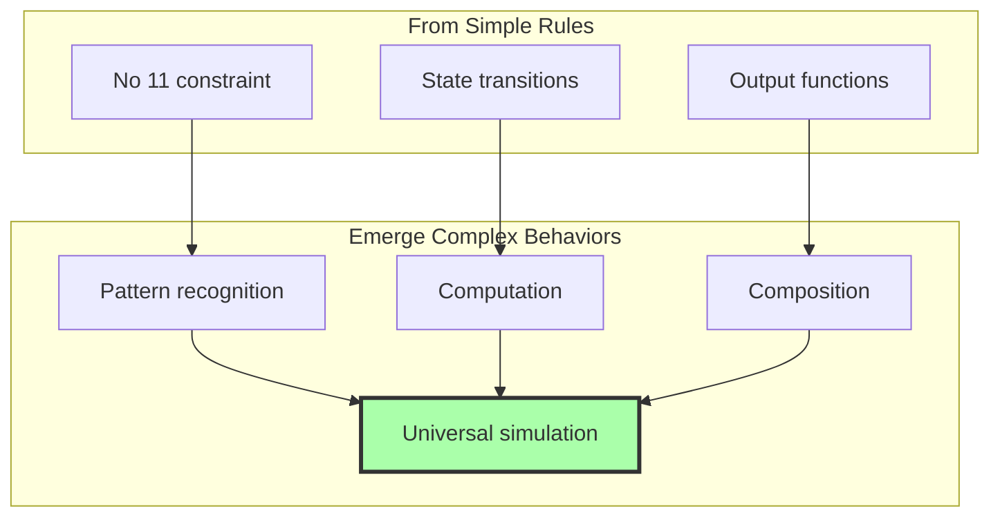

## 7.12 Foundation for Higher Computation

With φ-trace machines established, we can build:
- **Computational networks** of interacting machines
- **Learning systems** that discover φ-patterns
- **Symbolic processors** operating on collapse tokens
- **Language recognizers** for φ-constrained languages

### The Computational Tower

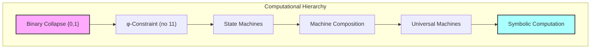

## The 7th Echo

From ψ = ψ(ψ) emerged distinction, from distinction emerged constraint, and now from navigating this constrained space emerges computation itself. The φ-trace machines are not arbitrary constructs but necessary forms—the shapes that computation must take when it respects the fundamental prohibition against redundant self-assertion.

The surprising discovery is that these machines, despite their limitations, can compute meaningful properties, compose algebraically, and even simulate each other. They form a complete computational ecosystem within the bounds of the φ-constraint. The fact that they cannot achieve Turing completeness is not a weakness but a feature—it shows that meaningful computation can exist in a universe where certain patterns are forbidden.

Most profound is the emergence of the "danger state" pattern—a computational structure that arises naturally from the need to prevent consecutive 1s. This pattern appears throughout: in the state machines, in the neural implementations, in the composition operators. It is the computational signature of navigating around the void that 11 represents.

We have discovered that computation, like counting and communication before it, is shaped by the deep structure emerging from ψ = ψ(ψ). The machines we build are echoes of the original collapse, forever computing while avoiding the infinite recursion that 11 would represent.

## References

The verification program `chapter-007-tracemachine-verification.py` provides executable proofs of all theorems in this chapter. Run it to explore computation under the golden constraint.

---

*Thus from the necessity of navigating φ-constrained space emerges computation—not as calculation imposed from outside but as the natural behavior of systems that must transform traces while respecting the prohibition on consecutive 1s. In these machines we see the birth of algorithmic process from pure constraint.*