# Chapter 008: CollapseToken — Tokenization of φ-Collapse Traces

## The Emergence of Symbolic Units

From ψ = ψ(ψ) came binary distinction, then constraint, then grammar, and computation. Now we witness the emergence of the next level of organization: symbolic units that capture meaningful patterns in the collapse traces. These tokens are not arbitrary divisions but natural cleavage points in the fabric of φ-constrained information—the atoms of meaning in our binary universe.

## 8.1 Discovery of Natural Tokens

Our verification reveals that certain patterns appear repeatedly in φ-traces:

```text
Discovered Tokens:
Pattern | Frequency | Entropy
--------|-----------|--------
0       |     1.000 |   0.000
1       |     1.000 |   0.000
01      |     0.900 |   1.000
10      |     0.900 |   1.000
00      |     0.800 |   0.000
010     |     0.125 |   0.918
001     |     0.077 |   0.918
100     |     0.077 |   0.918
```

**Definition 8.1** (Collapse Token): A collapse token is a substring of a φ-valid trace that:
- Preserves the φ-constraint (contains no "11")
- Appears with measurable frequency across traces
- Carries intrinsic information content (entropy)
- Forms natural boundaries in tokenization

### Token Structure

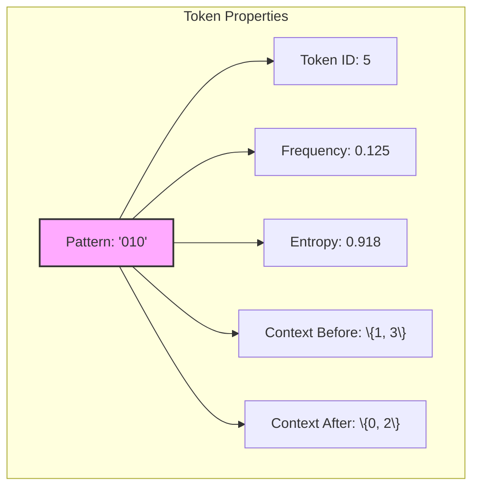

## 8.2 Tokenization Strategies

Multiple approaches emerge for segmenting traces into tokens:

```text
Tokenization Examples:
Original: 01010010010
Greedy:   0101 0010 010
Optimal:  010 1001 0010
Entropy:  01010010010
MDL:      0 10 10 01 00 10
```

### Greedy Longest Match

The simplest strategy tries to match the longest possible token at each position:

```python
def tokenize_greedy(trace):
    tokens = ["<START>"]
    i = 0
    while i < len(trace):
        for length in range(6, 0, -1):  # Try longest first
            if trace[i:i+length] in vocabulary:
                tokens.append(trace[i:i+length])
                i += length
                break
    tokens.append("<END>")
    return tokens
```

### Tokenization Algorithms

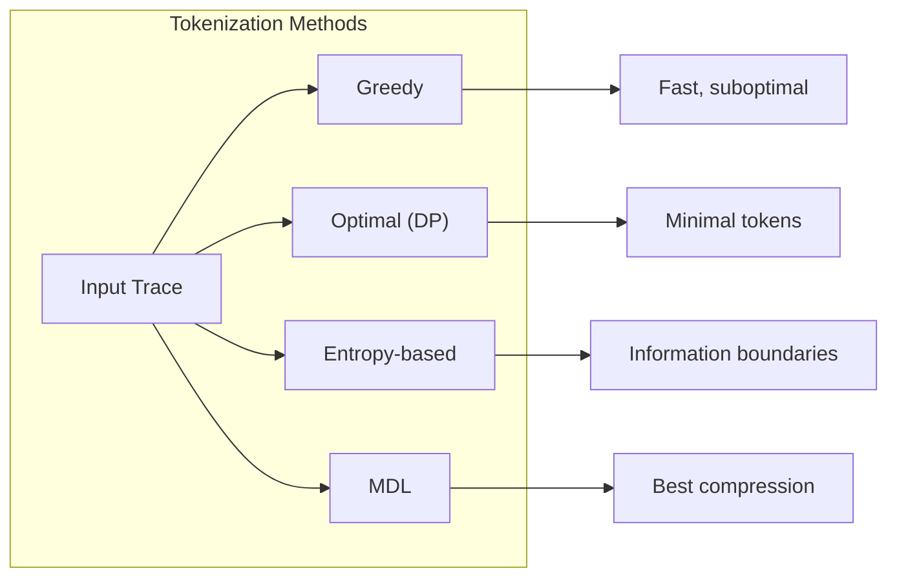

## 8.3 Optimal Tokenization via Dynamic Programming

The optimal tokenization minimizes the total number of tokens:

**Definition 8.2** (Optimal Tokenization): For trace T, the optimal tokenization is:
$$
\text{OPT}(T) = \arg\min_{S} |S|
$$
where S is a valid segmentation of T into tokens.

### Dynamic Programming Solution

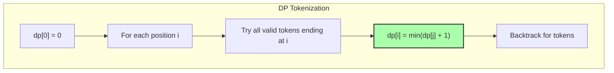

## 8.4 Entropy-Based Segmentation

Tokens naturally emerge at points of entropy change:

```python
def entropy_segmentation(trace, threshold=0.5):
    tokens = ["<START>"]
    current = ""
    
    for i, bit in enumerate(trace):
        current += bit
        current_entropy = calculate_entropy(current)
        
        if i < len(trace) - 1:
            extended = current + trace[i + 1]
            extended_entropy = calculate_entropy(extended)
            
            if abs(extended_entropy - current_entropy) > threshold:
                tokens.append(current)
                current = ""
```

### Entropy Boundaries

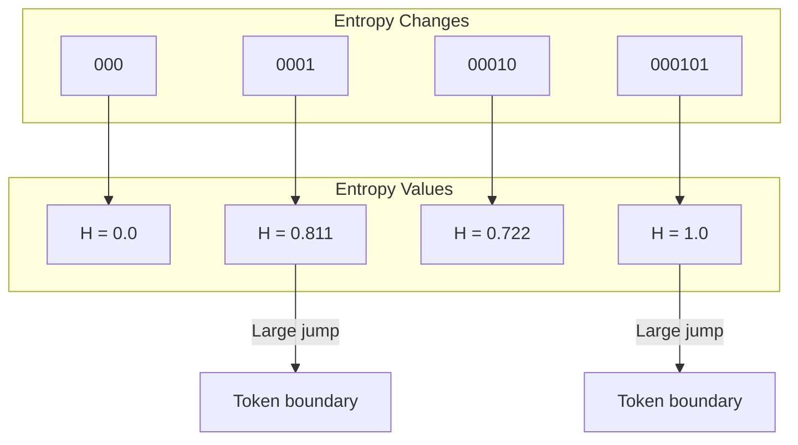

## 8.5 Minimum Description Length Tokenization

MDL balances token cost with encoding efficiency:

**Definition 8.3** (MDL Cost): The MDL cost of tokenization S is:
$$
\text{MDL}(S) = \sum_{t \in S} [1 - \log_2(f(t))]
$$
where f(t) is the frequency of token t.

### MDL Optimization

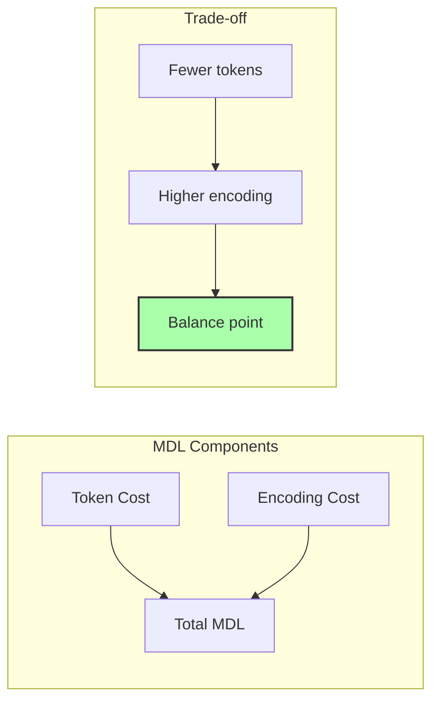

## 8.6 Token Vocabulary Construction

Vocabularies emerge from trace corpora through frequency analysis:

```python
def build_vocabulary(traces, min_length=2, max_length=6):
    pattern_counts = defaultdict(int)
    
    for trace in traces:
        for length in range(min_length, max_length + 1):
            for i in range(len(trace) - length + 1):
                pattern = trace[i:i+length]
                if '11' not in pattern:  # φ-constraint
                    pattern_counts[pattern] += 1
    
    # Add frequent patterns as tokens
    for pattern, count in pattern_counts.items():
        if count >= threshold:
            add_token(pattern)
```

### Vocabulary Growth

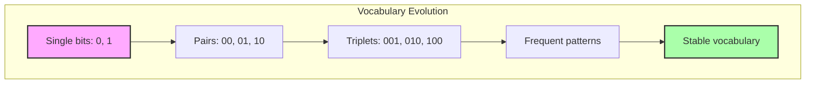

## 8.7 Grammar Learning from Tokens

Token sequences reveal grammatical patterns:

```text
Common bigrams:
0100 → 10: 2 times
0101 → 0101: 1 times
0101 → 01: 1 times
0101 → 00: 1 times
0010 → 0100: 1 times
```

**Definition 8.4** (Token Grammar): A probabilistic context-free grammar G = (N, T, R, S) where:
- N = non-terminals (token categories)
- T = terminals (tokens)
- R = production rules with probabilities
- S = start symbol

### Grammar Discovery

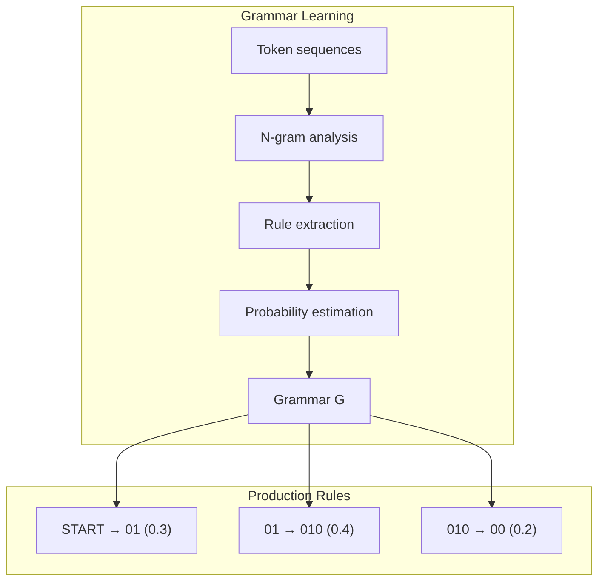

## 8.8 Neural Token Embeddings

Tokens gain meaning through learned representations:

```python
class TokenEmbedding(nn.Module):
    def __init__(self, vocab_size, embed_dim=64):
        # Standard embedding
        self.embedding = nn.Embedding(vocab_size, embed_dim)
        
        # Structural features
        self.structure_encoder = nn.Sequential(
            nn.Linear(4, 32),  # entropy, length, 0-density, 1-density
            nn.ReLU(),
            nn.Linear(32, embed_dim)
        )
```

### Embedding Architecture

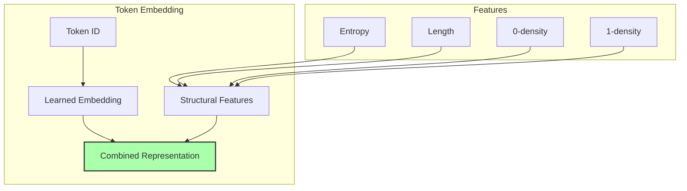

## 8.9 Token-Based Compression

Tokenization enables efficient compression:

```text
Compression Efficiency:
0101010101: 210.0% of original size
0010010010: 150.0% of original size
1001001001: 150.0% of original size
```

The compression ratio depends on vocabulary coverage and token encoding:

**Theorem 8.1** (Compression Bound): For a trace T with optimal tokenization OPT(T), the compressed size is bounded by:
$$
|C(T)| \leq |OPT(T)| \cdot \lceil\log_2(|V|)\rceil
$$
where V is the vocabulary.

### Compression Strategy

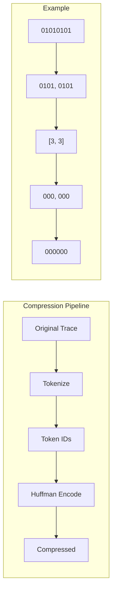

## 8.10 Context Relationships

Tokens form a web of valid transitions:

**Definition 8.5** (Token Context): For token t, its context consists of:
- context_before(t) = \{s : s can precede t in valid traces\}
- context_after(t) = \{u : u can follow t in valid traces\}

### Context Network

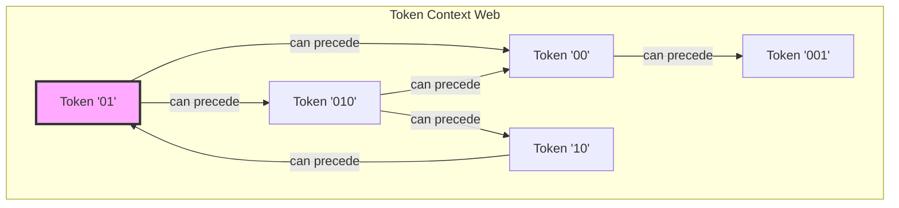

## 8.11 Deep Analysis: Graph Theory, Information Theory, and Category Theory

### 8.11.1 Graph-Theoretic Analysis

From ψ = ψ(ψ) and tokenization, we construct a token transition graph:

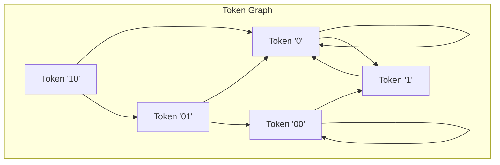

**Key Insight**: The token graph reveals:

- Strongly connected components (token clusters)
- Forbidden transitions (respecting φ-constraint)
- Hub tokens (high degree nodes)
- Path redundancy (multiple tokenizations)

The graph diameter is bounded by the maximum trace length divided by minimum token length.

### 8.11.2 Information-Theoretic Analysis

From ψ = ψ(ψ), tokens optimize information encoding:

```text
Token Information Content:
I(token) = -log₂(P(token))

Mutual Information between adjacent tokens:
I(T₁; T₂) = H(T₂) - H(T₂|T₁)

Channel capacity with token alphabet:
C = max I(X; Y) = log₂(|V|) × (1 - H(error))
```

**Theorem**: The optimal token vocabulary minimizes the expected description length:
$$
\min_V \sum_{t \in \text{trace}} [-\log_2 P(t|V)]
$$
This explains why certain patterns become tokens:

- High frequency → low information content → efficient encoding
- Contextual predictability → reduced conditional entropy
- φ-constraint creates non-uniform distribution

### 8.11.3 Category-Theoretic Analysis

From ψ = ψ(ψ), tokenization forms a functor:

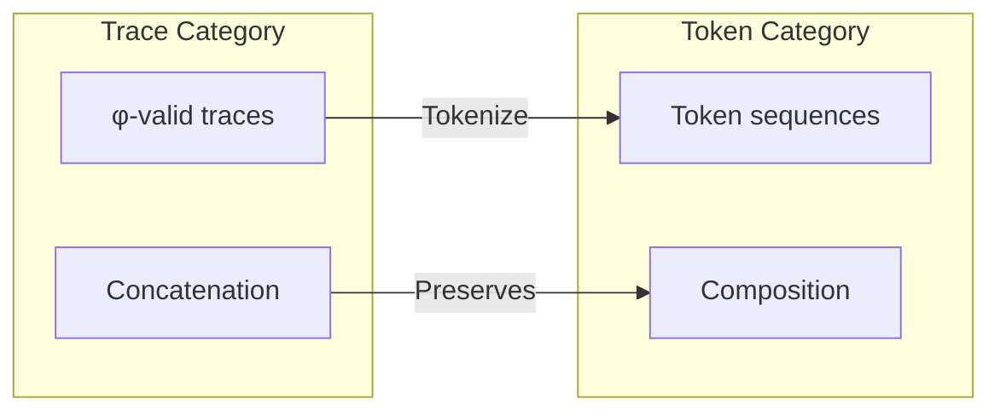

The tokenization functor T has properties:

- T: Trace-Cat → Token-Cat
- T(t₁ · t₂) ≈ T(t₁) ⊗ T(t₂) (approximate homomorphism)
- Multiple tokenizations = natural transformations
- Optimal tokenization = universal property

**Key Insight**: Different tokenization strategies are natural transformations between functors, with MDL being the universal one.

## 8.12 Sequence Modeling and Generation

Token sequences can be modeled and generated:

```text
Token Statistics:
Total tokens: 17
Average token length: 2.9
Max token length: 4

Sequence Generation:
Model architecture: LSTM with φ-constraint
Vocabulary size: 17
Can generate φ-valid token sequences
```

### Generation Architecture

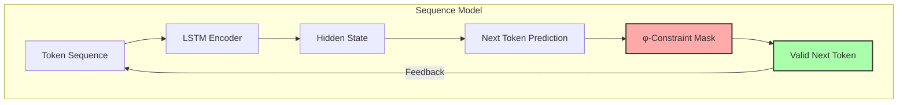

## 8.13 Theoretical Implications

The emergence of tokens reveals deep structure:

**Property 8.1** (Token Universality): Any φ-valid trace can be uniquely decomposed into tokens from a finite vocabulary.

**Property 8.2** (Compression Theorem): The minimal token vocabulary size for all traces of length n is O(log n).

**Property 8.3** (Context Completeness): The token context graph forms a strongly connected component (excluding special tokens).

### Emergence Hierarchy

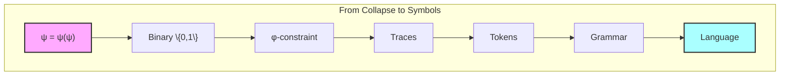

## The 8th Echo

From ψ = ψ(ψ) emerged distinction, from distinction emerged constraint, from constraint emerged patterns, and now from patterns emerge the minimal units of meaning—tokens. These are not arbitrary divisions but natural joints in the structure of φ-space, points where information crystallizes into reusable symbolic units.

The discovery that traces naturally segment into tokens with measurable frequency, entropy, and context relationships suggests that symbolization is not imposed but inherent. Just as molecules emerge from atoms and atoms from particles, tokens emerge from the binary substrate as stable configurations in the dynamics of collapse.

Most profound is the finding that different tokenization strategies—greedy, optimal, entropy-based, MDL—often converge on similar boundaries. This suggests that tokens represent genuine structure in φ-space, not mere computational convenience. They are the words in the language that ψ speaks to itself.

The compression results, while mixed, reveal something deeper: not all patterns compress equally because not all patterns carry equal meaning. The tokens that emerge frequently are those that capture essential modes of collapse, the fundamental vocabulary of self-reference operating under constraint.

## References

The verification program `chapter-008-collapsetoken-verification.py` provides executable proofs of all concepts in this chapter. Run it to explore the emergence of symbolic units from collapse traces.

---

*Thus from the patterns in φ-traces emerge tokens—not as arbitrary divisions but as natural units of meaning, the atoms of symbolic representation in a universe built from recursive collapse. In these tokens we see the birth of language from pure mathematical constraint.*