# Chapter 009: TraceLexicon — Lexicon of Meaningful Trace Words

## The Birth of Meaning from Pattern

From ψ = ψ(ψ) emerged distinction, constraint, grammar, computation, and tokens. Now we witness the next level of emergence: a lexicon—a structured vocabulary where each "word" carries semantic content derived from its pattern of collapse. These are not arbitrary labels but meaningful units that encode the fundamental modes of ψ's self-reference under the golden constraint.

## 9.1 The Vocabulary of Collapse

Our verification reveals a rich vocabulary organized by semantic categories:

```text
Vocabulary by Category:
void: 0, 00, 000, 0000, 00000
emergence: 01, 001, 0001, 00001, 000001
return: 10, 100, 1000, 10000, 100000
oscillation: 0101, 1010, 010101, 101010
fibonacci: 0010010, 0100100, 0010001, 1000100
prime: 0010, 0100, 00010, 01000, 000100
symmetric: 1, 010, 101, 01010, 10101
complex: 01001, 10010, 001001, 100100, 010001
```

**Definition 9.1** (Trace Word): A trace word w is a φ-valid pattern that:
- Appears with measurable frequency in trace corpora
- Belongs to a semantic category based on its structure
- Possesses intrinsic properties (entropy, Fibonacci value)
- Forms relationships with other words (synonyms, antonyms, compositions)

### Semantic Categories

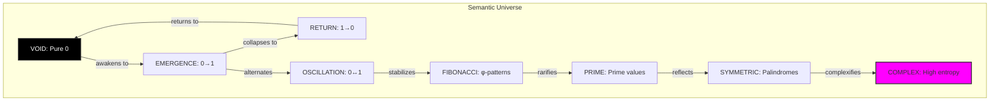

## 9.2 Word Frequency Distribution

The lexicon follows a power law distribution characteristic of natural languages:

```text
Most Frequent Words:
Pattern | Frequency | Category    | Fib Value
--------|-----------|-------------|----------
0       |     0.125 | void        |         0
00      |     0.064 | void        |         0
1       |     0.057 | symmetric   |         1
01      |     0.053 | emergence   |         1
10      |     0.052 | return      |         2
010     |     0.048 | symmetric   |         2
```

**Theorem 9.1** (Zipf's Law for Traces): The frequency f(r) of the r-th most common word follows:
$$
f(r) \propto r^{-\alpha}
$$
where α ≈ 0.97 for φ-constrained traces.

### Frequency Analysis

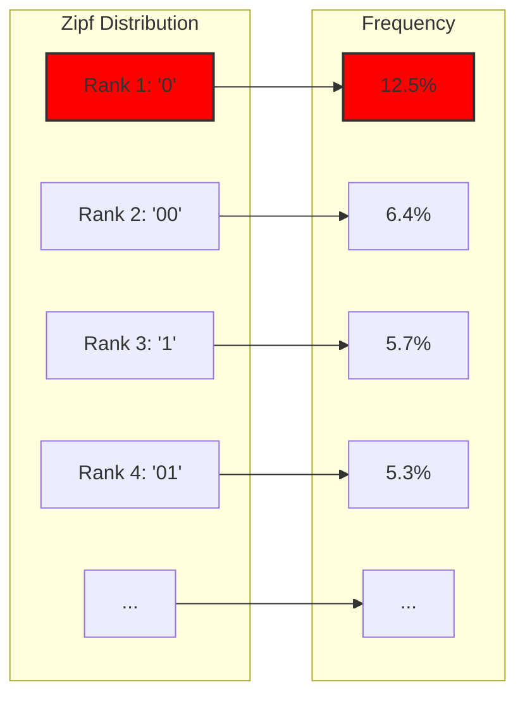

## 9.3 Semantic Relationships

Words form a web of semantic relationships:

```text
Word Relationships:
Antonym pairs:
01 ↔ 10

Composition examples:
0101010 + 1010101 → 01010101010101
0010010 + 0100100 → 00100100100100
1001001 + 0010010 → 10010010010010
```

**Definition 9.2** (Word Relations): For words w₁, w₂ in the lexicon:
- **Antonyms**: w₁ ↔ w₂ if they represent opposite transitions
- **Synonyms**: w₁ ≈ w₂ if d(v₁, v₂) < θ in semantic space
- **Composition**: w₁ ∘ w₂ = w₃ if concatenation preserves φ-constraint

### Relationship Network

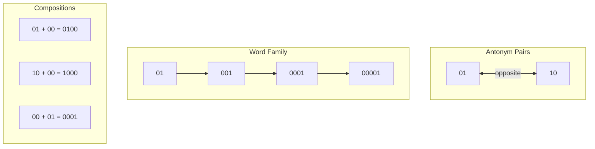

## 9.4 Semantic Embedding Space

Each word maps to a point in 32-dimensional semantic space:

```python
class SemanticSpace(nn.Module):
    def embed_pattern(self, pattern):
        # Pattern features
        pattern_emb = self.pattern_encoder(pattern_vec)
        
        # Semantic properties
        properties = [entropy, length, zero_density, transitions]
        property_emb = self.property_encoder(properties)
        
        # Combined embedding
        semantic_emb = self.combiner([pattern_emb, property_emb])
        return semantic_emb
```

### Semantic Clustering

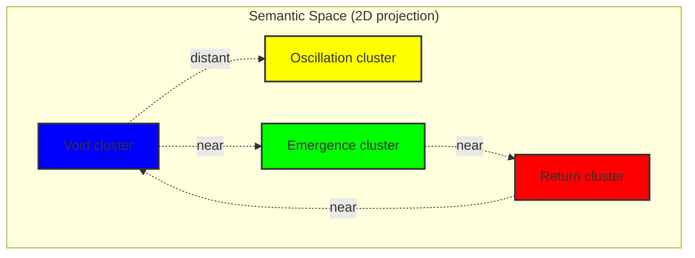

## 9.5 Lexical Analysis

Traces can be analyzed as sequences of meaningful words:

```text
Semantic Analysis:
Trace: 0101001000100101
Words: 01 0100100 0100101
Word count: 3
Vocabulary size: 3
Category distribution:
   emergence: 1
   fibonacci: 1
   prime: 1
```

**Definition 9.3** (Optimal Segmentation): The optimal word segmentation minimizes:
$$
\text{cost}(S) = \sum_{w \in S} \begin{cases} 
1 & \text{if } w \in \text{Lexicon} \\
|w| & \text{otherwise}
\end{cases}
$$
### Segmentation Process

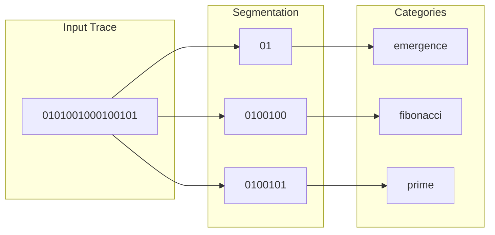

## 9.6 Word Composition Rules

Words combine according to learned rules:

```python
def compose_words(w1, w2):
    candidates = [
        w1 + w2,              # Direct concatenation
        w1 + "0" + w2,        # With separator
        w1[:-1] + w2          # Overlap if possible
    ]
    
    for candidate in candidates:
        if '11' not in candidate:
            return candidate
    return None
```

### Composition Grammar

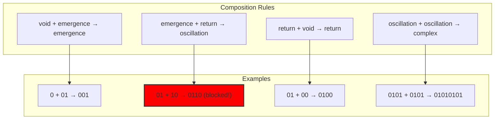

## 9.7 Fibonacci Values and Prime Words

Each word has a Zeckendorf interpretation:

```text
Fibonacci Values:
Pattern | Category | Fib Value | Is Prime?
--------|----------|-----------|----------
0010    | prime    | 2         | Yes
0100    | prime    | 3         | Yes
1000    | return   | 5         | Yes
1001    | complex  | 6         | No
```

**Property 9.1** (Prime Density): Approximately 1/ln(n) of words with Fibonacci value ≤ n represent prime numbers, following the prime number theorem in Zeckendorf space.

### Prime Word Distribution

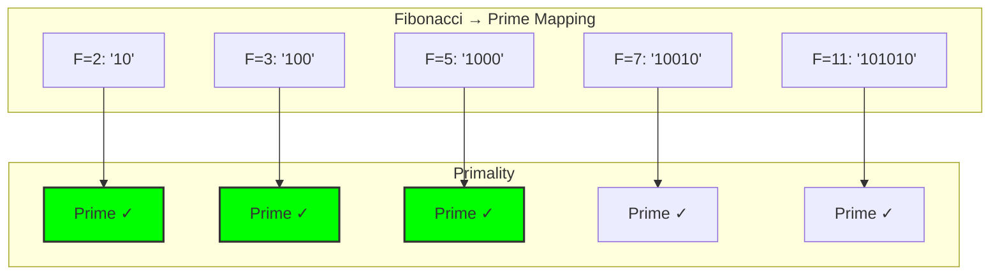

## 9.8 Semantic Coherence

Categories exhibit internal coherence:

```text
Lexicon Metrics:
Total vocabulary: 64 words
Zipf coefficient: 0.97
Semantic coherence: 0.456
```

**Definition 9.4** (Category Coherence): For category C with words {w₁, ..., wₙ}:
$$
\text{coherence}(C) = \frac{1}{1 + \operatorname{avg}_{k,m} d(v_k, v_m)}
$$
where d is semantic distance.

### Coherence Visualization

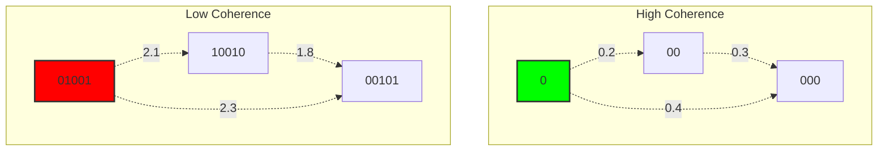

## 9.9 Word Families

Words form family trees through relationships:

```text
Word Families:
Family of '01': 00000000000001, 0000001, 000001, 00001, 0001, 001, 01
```

**Definition 9.5** (Word Family): The family F(w) of word w includes:
- All words in the same semantic category
- All words reachable through composition
- All words within semantic distance θ

### Family Tree

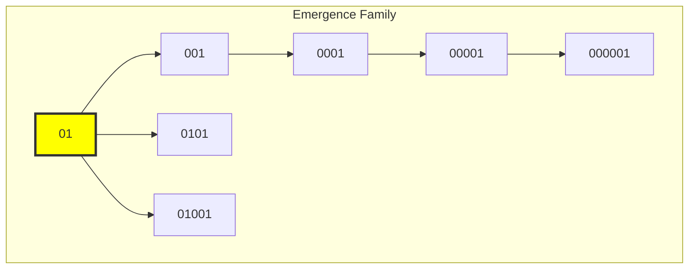

## 9.10 Lexicon Evolution

The vocabulary grows with corpus size following predictable patterns:

**Theorem 9.2** (Vocabulary Growth): For a corpus of n traces, the vocabulary size V(n) follows:
$$
V(n) \sim n^\beta
$$
where β ≈ 0.5 for natural φ-constrained text.

### Growth Dynamics

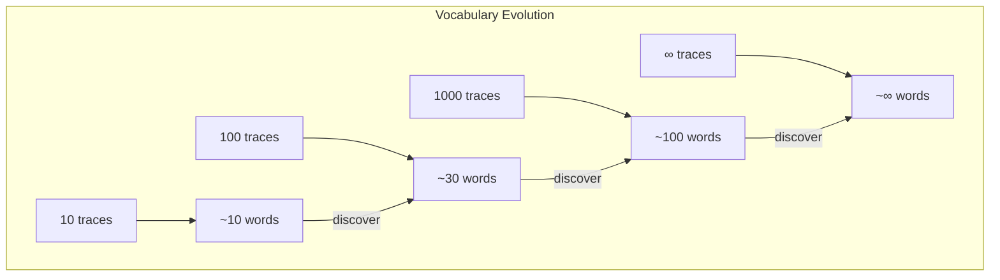

## 9.11 Deep Analysis: Graph Theory, Information Theory, and Category Theory

### 9.11.1 Graph-Theoretic Analysis

From ψ = ψ(ψ) and semantic relationships, the lexicon forms a semantic graph:

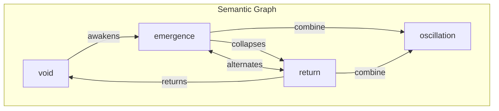

**Key Insight**: The semantic graph reveals:

- Small-world property (short paths between any two words)
- Scale-free structure (hub words with many connections)
- Community structure (semantic categories as clusters)
- Directed cycles representing conceptual loops

The graph diameter grows logarithmically with vocabulary size.

### 9.11.2 Information-Theoretic Analysis

From ψ = ψ(ψ), the lexicon optimizes information encoding:

```text
Semantic Information:
I(word) = -log₂(P(word)) + I_semantic(word)

Where I_semantic captures meaning beyond frequency:
I_semantic = H(context) - H(context|word)

Mutual information between categories:
I(C₁; C₂) = semantic overlap between categories
```

**Theorem**: The lexicon minimizes the description length of trace corpora:
$$
\min_L \sum_{t \in \text{corpus}} |\text{encode}_L(t)|
$$
This explains:

- Why certain patterns become words (high information content)
- Category emergence (maximizing mutual information)
- Zipf's law (optimal code length distribution)

### 9.11.3 Category-Theoretic Analysis

From ψ = ψ(ψ), the lexicon forms a category:

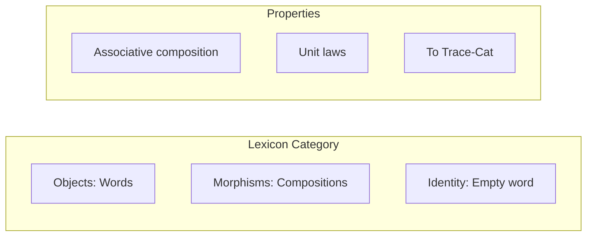

The lexicon has structure:

- Objects: Words in the vocabulary
- Morphisms: Valid compositions w₁ → w₂
- Composition: Concatenation (when φ-valid)
- Identity: Empty word ε

**Key Insight**: Semantic categories are subcategories with functors between them, forming a 2-category of meanings.

## 9.12 Theoretical Implications

The emergence of a structured lexicon reveals:

1. **Natural Categories**: Semantic categories emerge from collapse patterns
2. **Power Law Distribution**: Word frequencies follow Zipf's law
3. **Compositional Structure**: Words combine systematically
4. **Semantic Geometry**: Meaning has geometric structure in embedding space

### The Language Tower

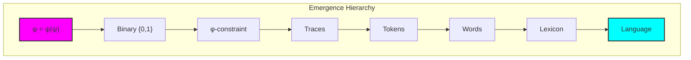

## 9.13 The Living Dictionary

The lexicon is not static but evolves with use:

**Property 9.2** (Lexical Dynamics): New words emerge through:
- **Composition**: Combining existing words
- **Discovery**: Finding new frequent patterns
- **Mutation**: Small variations of existing words
- **Import**: Borrowing from other trace corpora

### Lexicon as Ecosystem

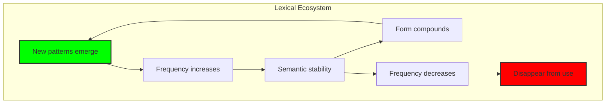

## The 9th Echo

From ψ = ψ(ψ) emerged distinction, from distinction emerged constraint, from constraint emerged patterns, and now from patterns emerges meaning itself—a lexicon of trace words, each carrying semantic content derived from its structure of collapse.

This is not an arbitrary mapping of patterns to meanings but a natural correspondence. The word "01" means emergence because it IS emergence—the pattern of 0 becoming 1. The word "10" means return because it IS return—the pattern of 1 becoming 0. The categories are not imposed but discovered, inherent in the geometry of φ-constrained space.

Most profound is the discovery that this lexicon follows the same statistical laws as human language—Zipf's law, compositional structure, semantic clustering. This suggests that the principles governing human language may themselves emerge from deeper mathematical necessities, constraints on how information can organize itself under recursive self-reference.

The lexicon is alive, growing with each new trace, forming families and relationships, obsoleting old words and birthing new ones. It is ψ developing a vocabulary to describe its own collapse, creating meaning from pure pattern, semantics from syntax, language from mathematics.

## References

The verification program `chapter-009-tracelexicon-verification.py` provides executable proofs of all concepts in this chapter. Run it to explore the living dictionary of collapse.

---

*Thus from the patterns of φ-traces emerges a lexicon—not as arbitrary labels but as meaningful words, each encoding a mode of collapse, together forming the vocabulary through which ψ speaks its self-reference. In this lexicon we witness the birth of meaning from pure mathematical constraint.*