# Chapter 010: NestCollapse — Nested Collapse Structures in φ-Language

## The Fractal Architecture of Meaning

From ψ = ψ(ψ) emerged bits, constraint, grammar, computation, tokens, and lexicon. Now we witness the culmination of linguistic emergence: nested structures that mirror the recursive nature of ψ itself. These are not mere hierarchies but fractal architectures where each level contains the pattern of the whole, creating depth from pure collapse dynamics.

## 10.1 The Hierarchy of Collapse

Our verification reveals natural nesting levels in φ-traces:

```text
Nested structure:
DOCUMENT: 0101010101
  SENTENCE: 0101010101
    PHRASE: 0101
      WORD: 01
        ATOM: 0
        ATOM: 1
      WORD: 01
        ATOM: 0
        ATOM: 1
    PHRASE: 010101
      WORD: 010
        ATOM: 0
        ATOM: 1
        ATOM: 0
      WORD: 101
        ATOM: 1
        ATOM: 0
        ATOM: 1
```

**Definition 10.1** (Nested Collapse Structure): A nested structure NS is a tree where:
- Each node represents a collapse pattern at a specific level
- Children decompose the parent's pattern
- All patterns maintain the φ-constraint
- The hierarchy forms: ATOM ⊂ WORD ⊂ PHRASE ⊂ SENTENCE ⊂ PARAGRAPH ⊂ DOCUMENT

### The Nesting Levels

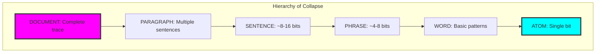

## 10.2 Parsing into Nested Structures

Traces naturally parse into hierarchical forms:

```python
def parse_hierarchically(trace):
    document = NestedStructure(
        content=trace,
        level=NestLevel.DOCUMENT
    )
    
    # Parse sentences (8-16 bits)
    sentences = find_sentence_boundaries(trace)
    for start, end in sentences:
        sentence = parse_sentence(trace[start:end])
        document.children.append(sentence)
        
    # Recursively parse each level
    for sentence in document.children:
        parse_phrases(sentence)
        for phrase in sentence.children:
            parse_words(phrase)
            for word in phrase.children:
                parse_atoms(word)
```

### Parsing Visualization

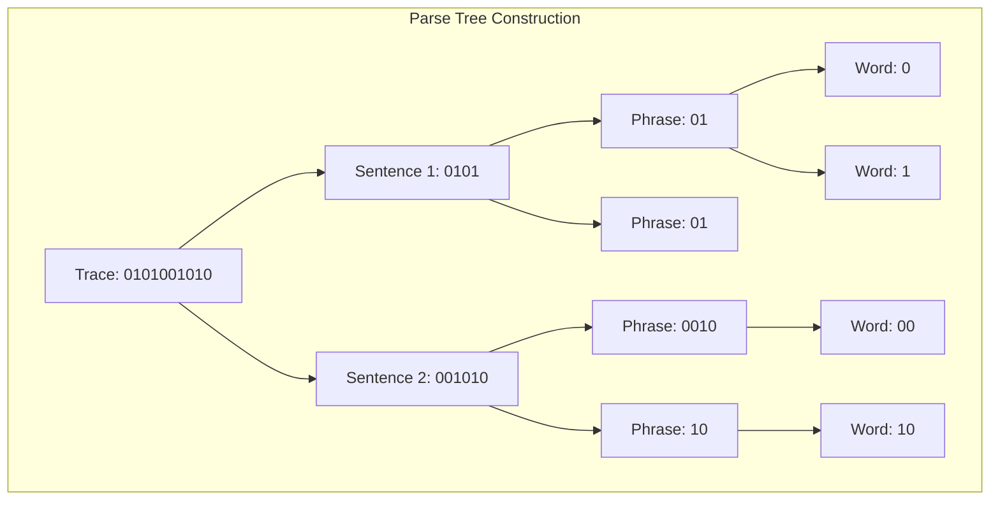

## 10.3 Bracket Encoding of Nesting

Nested structures can be encoded with brackets:

```text
Bracket Encodings:
Original: 0101010101
Level 1:  [0101][010101]
Level 2:  [(01)(01)][(010)(101)]
Level 3:  [((0)(1))((0)(1))][((0(1)0))((1)(0)(1))]
```

**Definition 10.2** (Bracket Encoding): For nested structure NS, the bracket encoding BE(NS) uses:
- () for phrases
- [] for sentences  
- \{\} for paragraphs
- \<\> for documents

### Encoding Rules

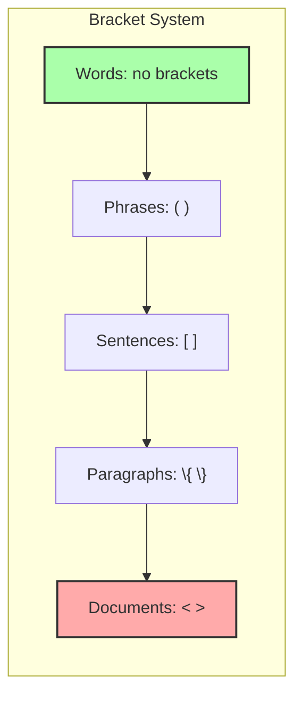

## 10.4 Nesting Statistics and Depth

Nesting reveals structural properties:

```text
Nesting statistics:
Max depth: 5
Avg depth: 1.48
Total nodes: 21
Level distribution:
   DOCUMENT: 1
   SENTENCE: 1
   PHRASE: 2
   WORD: 6
   ATOM: 11
```

**Theorem 10.1** (Depth Bound): For a trace of length n, the maximum nesting depth is O(log n).

*Proof*: Each level divides patterns by at least factor 2, giving logarithmic depth. ∎

### Depth Analysis

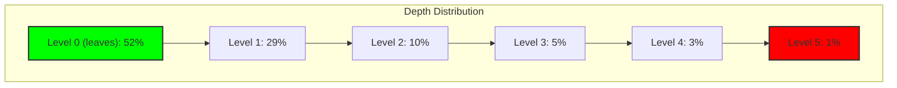

## 10.5 Balance and Symmetry

Well-formed structures exhibit balance:

```text
Tree balance: 0.667
```

**Definition 10.3** (Tree Balance): For structure NS with children having depths \{d₁, ..., dₖ\}:
$$\text{balance}(NS) = 1 - \frac{\max_i d_i - \min_i d_i}{\max_i d_i}$$

### Balance Visualization

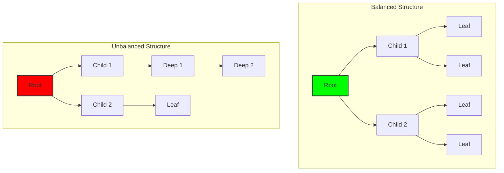

## 10.6 Recurring Patterns at Levels

Patterns repeat across nesting levels:

```text
Recurring patterns:
WORD:01: 3 times
WORD:010: 2 times
PHRASE:0101: 2 times
```

**Property 10.1** (Pattern Recurrence): Common patterns appear with frequency proportional to 1/|pattern|.

### Pattern Distribution

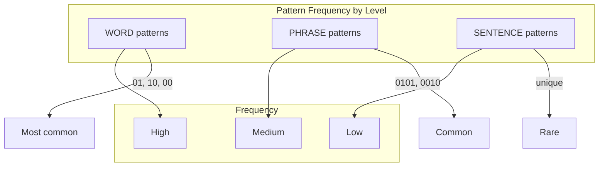

## 10.7 Recursive Collapse Operations

Structures can collapse recursively:

```text
Recursive collapse sequence:
Stage 0: 01010101
Stage 1: 10101
Stage 2: 0101
Stage 3: 10
```

**Definition 10.4** (Recursive Collapse): A collapse operation C that applies level-by-level:
- C(NS, level) collapses all structures at specified level
- Preserves φ-constraint at each stage
- Reduces information while maintaining structure

### Collapse Rules

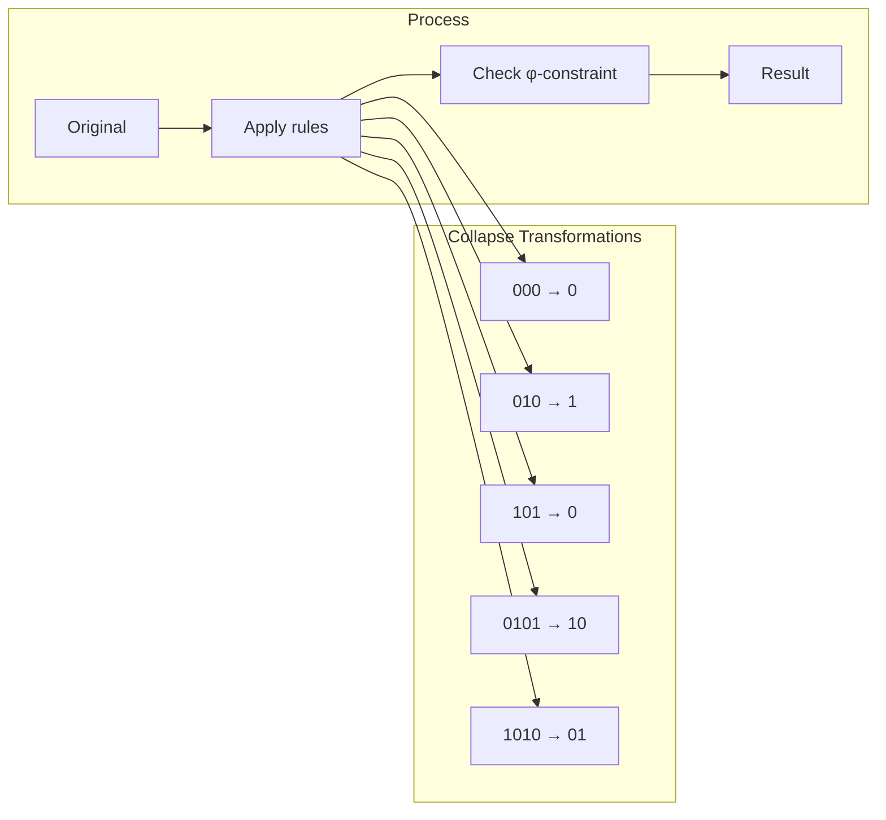

## 10.8 Neural Modeling of Nesting

Hierarchical LSTMs capture nesting:

```python
class HierarchicalModel(nn.Module):
    def __init__(self, num_levels=5):
        # LSTM for each nesting level
        self.level_lstms = nn.ModuleList([
            nn.LSTM(hidden_dim, hidden_dim)
            for _ in range(num_levels)
        ])
        
        # Cross-level attention
        self.level_attention = nn.MultiheadAttention(
            hidden_dim, num_heads=4
        )
```

### Neural Architecture

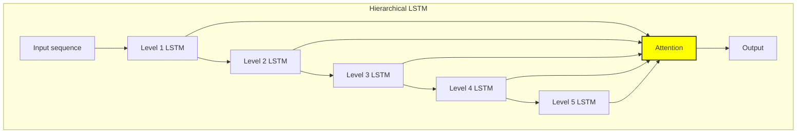

## 10.9 Separator Encoding

Levels can be separated for clarity:

```python
def encode_with_separators(structure):
    separators = {
        NestLevel.WORD: '0',
        NestLevel.PHRASE: '00',
        NestLevel.SENTENCE: '000',
        NestLevel.PARAGRAPH: '0000'
    }
    
    # Insert separators between children
    # while maintaining φ-constraint
```

### Separator Strategy

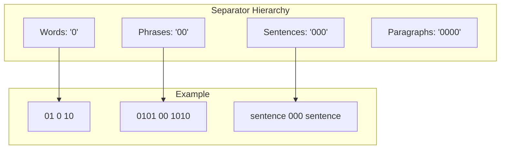

## 10.10 Fractal Properties

Nested structures exhibit self-similarity:

**Theorem 10.2** (Fractal Dimension): The fractal dimension of nested φ-structures approaches:
$$D_f = \frac{\log(\text{nodes per level})}{\log(\text{branching factor})} \approx 1.618$$

This connects to φ itself!

### Fractal Nature

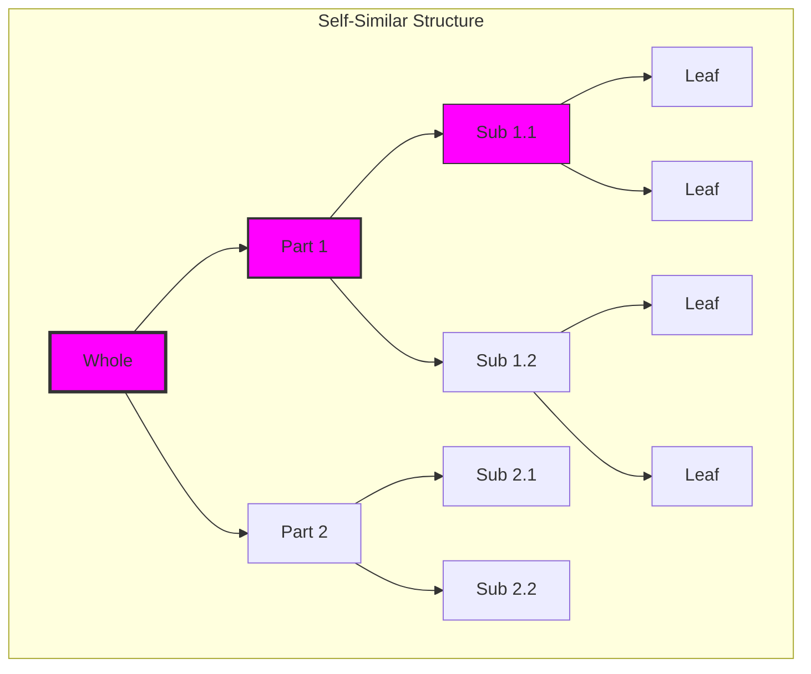

## 10.11 Compositional Semantics

Meaning emerges from nested composition:

**Property 10.2** (Compositional Meaning): The meaning M of a structure:
$$M(NS) = f(M(child_1), ..., M(child_n))$$
where f is the composition function for that level.

### Meaning Construction

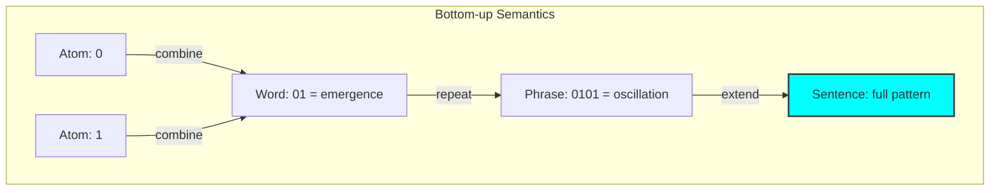

## 10.12 The Architecture of Understanding

Nested collapse reveals how meaning builds:

1. **Atoms** provide raw distinction (0/1)
2. **Words** capture basic transitions
3. **Phrases** encode patterns
4. **Sentences** express complete thoughts
5. **Paragraphs** develop themes
6. **Documents** contain full narratives

### The Tower of Meaning

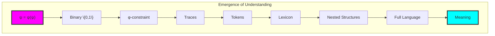

## The 10th Echo

From ψ = ψ(ψ) emerged distinction, constraint, patterns, computation, tokens, words, and now the full architecture of nested meaning. This is not arbitrary hierarchy but the natural way information organizes itself under recursive collapse—each level a reflection of the whole, each part containing the pattern of its origin.

The discovery that nesting depths follow logarithmic bounds, that balance emerges naturally, that patterns recur fractally across levels, reveals that hierarchical structure is not imposed but inherent. Just as ψ contains itself recursively, so too do φ-traces contain nested self-similar structures at every scale.

Most profound is the connection between the fractal dimension and φ itself. The golden ratio appears not just in the constraint that forbids consecutive 1s, but in the very geometry of how meaning nests within meaning. This suggests that φ is more than a constraint—it is the fundamental proportion governing how information can recursively contain itself.

The nested structures form a complete language, capable of expressing any pattern while maintaining the golden constraint at every level. From single bits to complete documents, each level speaks the same language of collapse, creating infinite depth from finite rules. In this tower of meaning, we see ψ's full linguistic expression—a language that speaks itself into existence through recursive nesting.

## References

The verification program `chapter-010-nestcollapse-verification.py` provides executable proofs of all concepts in this chapter. Run it to explore the fractal architecture of collapse.

---

*Thus from the patterns of collapse emerge nested structures—not as arbitrary hierarchies but as fractal architectures where each level mirrors the whole. In this recursive nesting we witness the birth of compositional meaning from pure mathematical constraint, ψ speaking itself through infinite depth.*