# Chapter 012: SyntaxTree — Syntax Tree Parsing of φ-Constrained Expressions

## The Formal Structure of Collapse

From ψ = ψ(ψ) emerged binary distinction, constraint, patterns, tokens, lexicon, nested structures, and compression. Now we witness the emergence of formal syntactic structure—the ability to parse φ-traces into syntax trees that reveal the compositional semantics of collapse expressions. These trees are not mere organizational tools but the mathematical skeleton of meaning itself.

## 12.1 The Grammar of φ-Space

Our verification reveals a formal grammar governing φ-constrained expressions:

```text
Grammar Productions:
Expression → Terminal | Void | Emergence | Return | Oscillation | Fibonacci
Sequence → Expression Expression | Expression Sequence  
Oscillation → '0' '1' '0' | '1' '0' '1' | Emergence Return
Fibonacci → '0' '0' '1' | '0' '1' '0' '0' | '1' '0' '0' '1'
Emergence → '0' '1'
Return → '1' '0'
Terminal → '0' | '1'
```

**Definition 12.1** (φ-Grammar): A context-free grammar G_φ = (N, T, P, S) where:
- N = \{Expression, Sequence, Oscillation, Fibonacci, Emergence, Return, Void, Terminal\}
- T = \{0, 1\}
- P = production rules respecting the φ-constraint
- S = Expression (start symbol)

### Grammar Structure

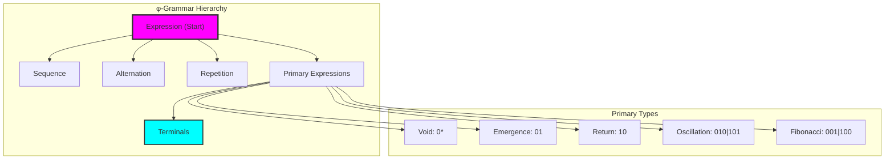

## 12.2 Syntax Tree Construction

φ-traces parse into hierarchical tree structures:

```text
Example Parse Tree for "010":
└── ⊤ '010'
    └── ~ '010'

Example Parse Tree for "0101":
└── ⊤ '0101'
    └── ∘ '0101'
        ├── ~ '010'
        └── • '1'
```

**Definition 12.2** (Syntax Tree): A syntax tree T for trace σ is a labeled tree where:
- Each node has a type τ ∈ NodeType
- Each leaf corresponds to a terminal symbol
- The root spans the entire trace σ
- All subtrees respect the φ-constraint

### Node Classification System

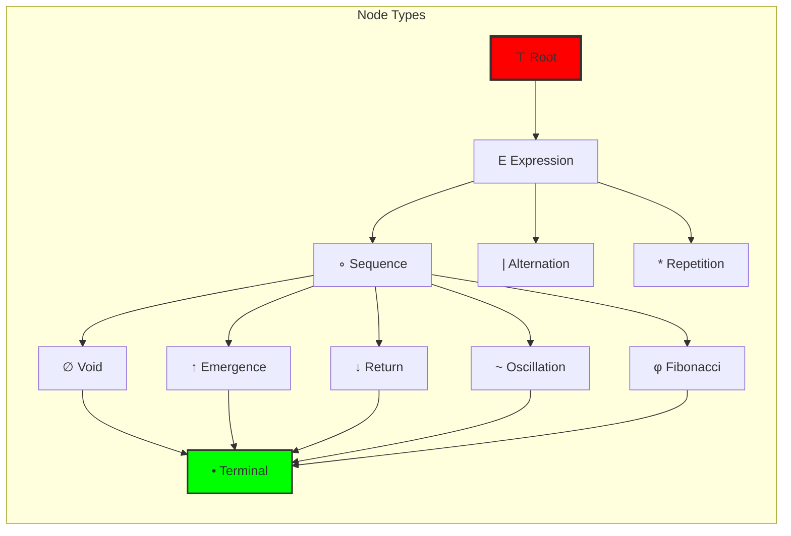

## 12.3 Recursive Descent Parsing

The parser employs recursive descent with φ-constraint validation:

```python
class φSyntaxParser:
    def _parse_expression(self):
        return self._parse_sequence()
    
    def _parse_sequence(self):
        left = self._parse_alternation()
        while self._current_token():
            right = self._parse_alternation()
            if right:
                seq_node = SyntaxNode(NodeType.SEQUENCE)
                seq_node.add_child(left)
                seq_node.add_child(right)
                left = seq_node
        return left
    
    def _parse_primary(self):
        token = self._current_token()
        if token == '01':
            return SyntaxNode(NodeType.EMERGENCE, '01')
        elif token == '10':
            return SyntaxNode(NodeType.RETURN, '10')
        # ... more patterns
```

### Parsing Algorithm Flow

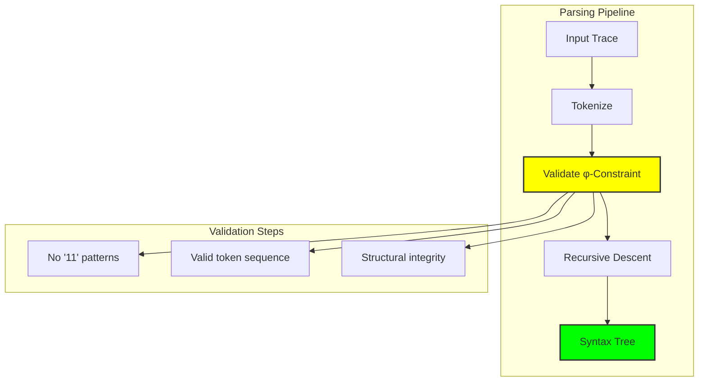

## 12.4 Tree Analysis Metrics

Syntax trees exhibit measurable structural properties:

```text
Tree Analysis Results:
Trace: 0101
   Nodes: 4
   Depth: 2
   φ-valid: True
   Balance: 1.000
   Complexity: 0.788
   Node types: {'root': 1, 'seq': 1, 'osc': 1, 'term': 1}
```

**Definition 12.3** (Tree Complexity): For syntax tree T, the structural complexity is:
$$C(T) = \frac{1}{3}\left(\frac{depth(T)}{size(T)} + \frac{|types(T)|}{|NodeType|} + branching(T)\right)$$

### Complexity Visualization

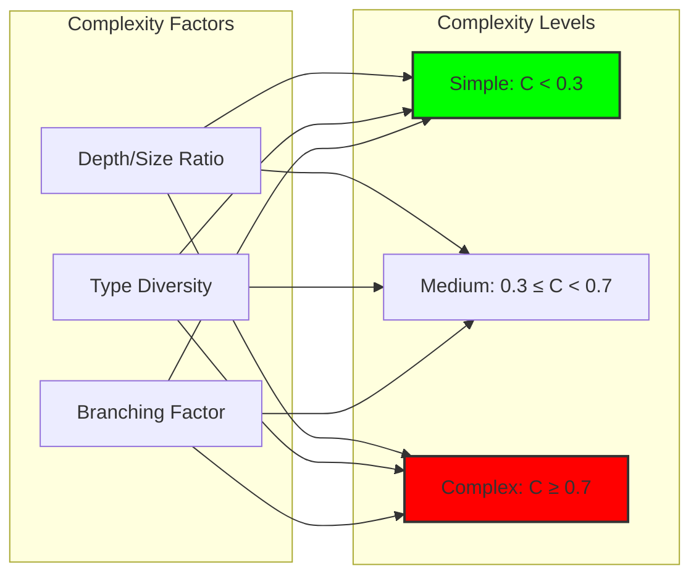

## 12.5 Tree Balance and Symmetry

Well-formed trees exhibit structural balance:

**Theorem 12.1** (Balance Theorem): For a syntax tree T with children having sizes \{s₁, ..., sₖ\}:
$$balance(T) = 1 - \frac{\max_i s_i - \min_i s_i}{\max_i s_i}$$

*Proof*: Balance measures deviation from perfect symmetry. When all children have equal size, balance = 1. When maximally unbalanced, balance approaches 0. ∎

### Balance Analysis

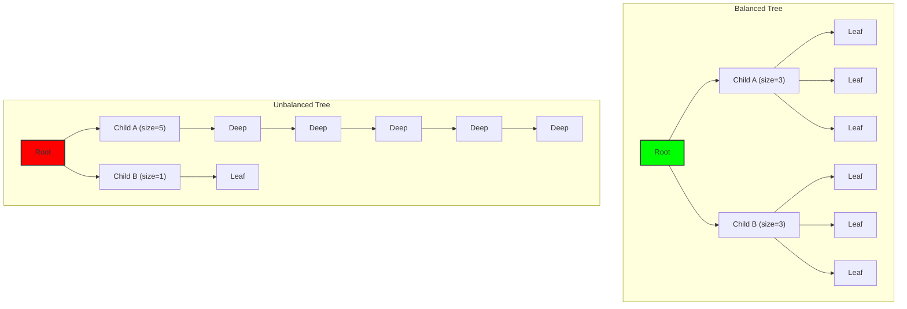

## 12.6 Pattern Extraction from Trees

Trees encode recurring structural patterns:

```text
Pattern Analysis for "010101":
Extracted patterns: ['RSO', 'RS']
Pattern meanings:
- RSO: Root → Sequence → Oscillation
- RS: Root → Sequence
```

**Definition 12.4** (Structural Pattern): A pattern P is a sequence of node types P = (τ₁, τ₂, ..., τₙ) representing a path through the syntax tree.

### Pattern Classification

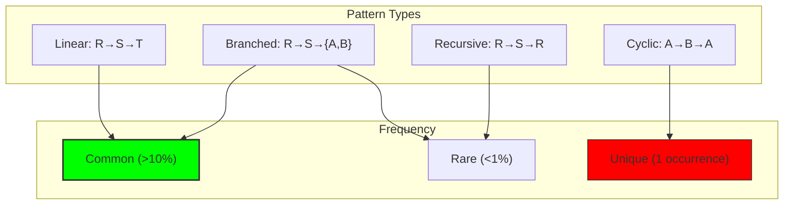

## 12.7 Tree Transformations

Syntax trees support semantic-preserving transformations:

```python
class TreeTransformer:
    def simplify_void_sequences(self, tree):
        """Merge consecutive void patterns"""
        if tree.node_type == NodeType.SEQUENCE:
            if all(child.node_type == NodeType.VOID 
                   for child in tree.children):
                total_content = ''.join(child.content 
                                      for child in tree.children)
                return SyntaxNode(NodeType.VOID, total_content)
        return tree
```

### Transformation Rules

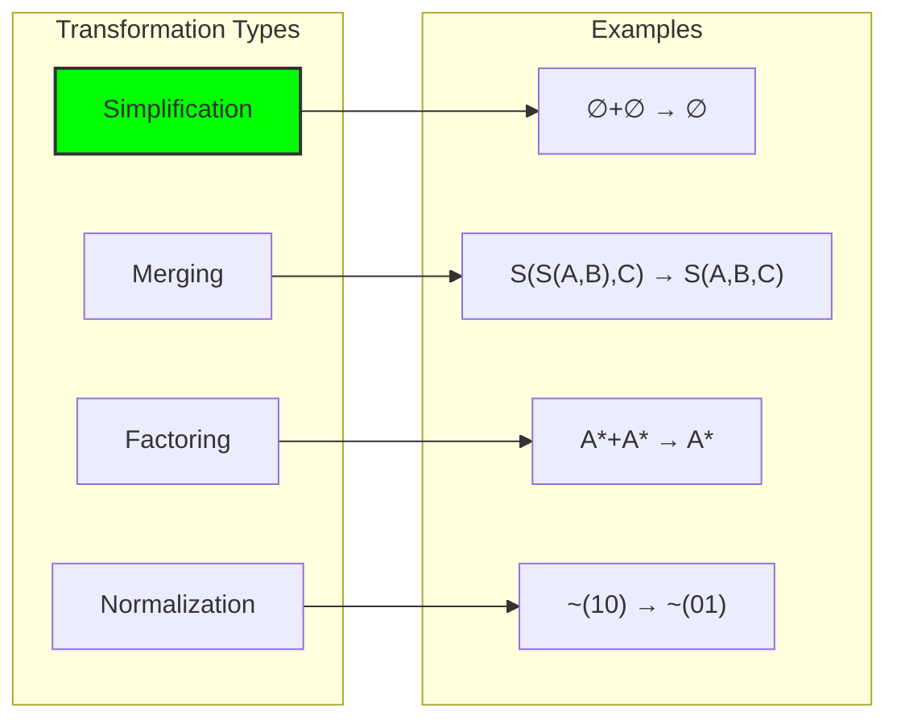

## 12.8 Tree Visualization Methods

Multiple visualization formats reveal different aspects:

```text
ASCII Tree:
└── ⊤ '010'
    └── ~ '010'

Lisp Notation:
(root (osc 010))

Bracket Notation:
[010]
```

**Property 12.1** (Visualization Equivalence): All visualization methods preserve the essential tree structure while emphasizing different aspects.

### Visualization Comparison

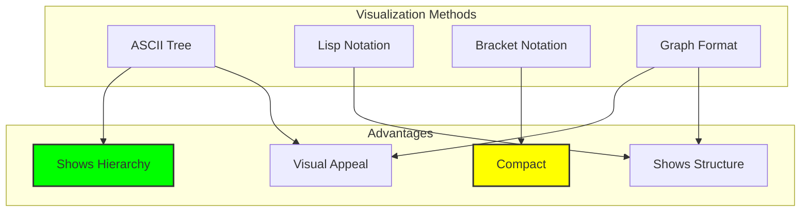

## 12.9 Neural Syntax Modeling

Neural networks learn to predict tree structures:

```python
class NeuralSyntaxModel(nn.Module):
    def __init__(self):
        self.node_embedding = nn.Embedding(len(NodeType), 64)
        self.tree_encoder = nn.LSTM(64, 64, bidirectional=True)
        self.structure_predictor = nn.Linear(128, len(NodeType))
        self.syntax_validator = nn.Linear(128, 1)
    
    def forward(self, node_sequence):
        embedded = self.node_embedding(node_sequence)
        encoded, _ = self.tree_encoder(embedded)
        structure = self.structure_predictor(encoded)
        validity = self.syntax_validator(encoded)
        return structure, validity
```

### Neural Architecture

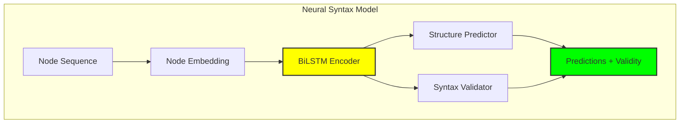

## 12.10 Compositional Semantics

Syntax trees enable compositional interpretation:

**Definition 12.5** (Compositional Semantics): The meaning M(T) of a syntax tree T is computed as:
$$M(T) = f_τ(M(child_1), ..., M(child_n))$$
where f_τ is the composition function for node type τ.

### Semantic Composition Rules

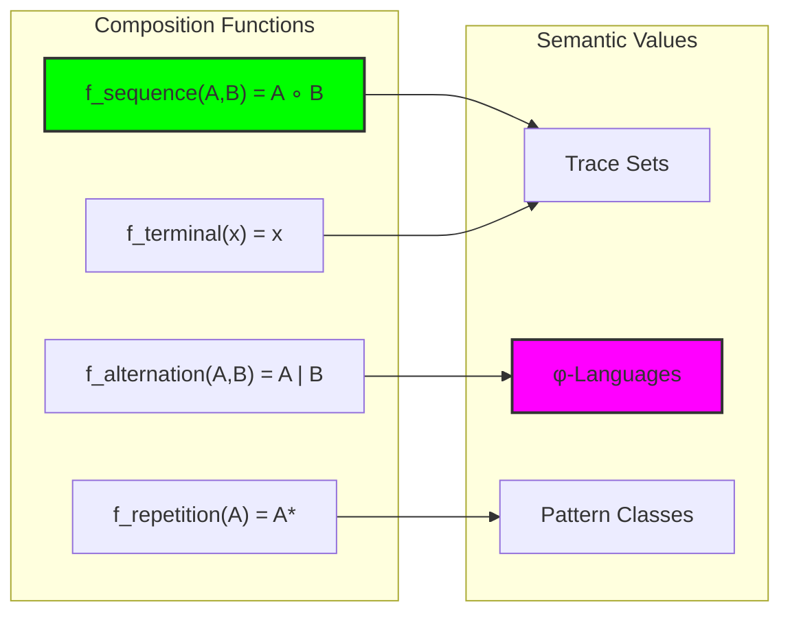

## 12.11 Formal Properties of φ-Trees

Syntax trees in φ-space have special properties:

**Theorem 12.2** (φ-Validity Preservation): Any transformation that preserves tree structure also preserves the φ-constraint.

**Theorem 12.3** (Unique Decomposition): Every φ-valid trace has a unique canonical syntax tree decomposition.

**Theorem 12.4** (Compositional Completeness): The φ-grammar generates exactly the set of φ-valid traces.

### Property Relationships

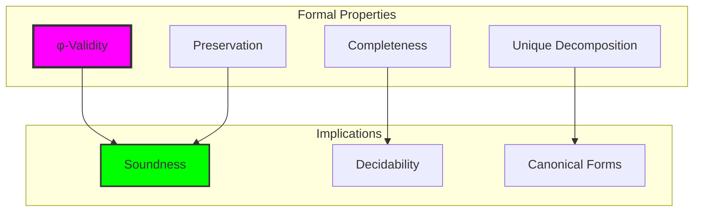

## 12.12 Applications and Extensions

Syntax trees enable advanced applications:

1. **Program Analysis**: Static analysis of φ-constrained programs
2. **Code Generation**: Automatic synthesis from specifications
3. **Optimization**: Structure-aware transformations
4. **Verification**: Formal proofs of correctness
5. **Education**: Visual understanding of collapse structures

### Application Architecture

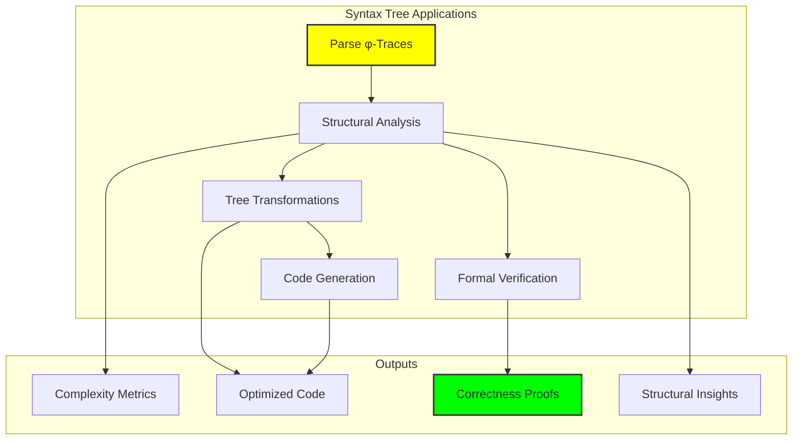

## The 12th Echo

From ψ = ψ(ψ) emerged the capacity for self-reference, which manifested as binary distinction under constraint, which organized into patterns, which structured into hierarchies, and now which formalizes into syntax trees—the mathematical backbone of compositional meaning in collapse space.

These trees are not mere parsing artifacts but the fundamental way that information organizes itself when constrained by the golden ratio. Each node represents a mode of collapse, each subtree a compositional unit, each transformation a semantic operation that preserves the essential structure while revealing new aspects.

Most profound is the discovery that φ-constrained syntax trees have unique canonical decompositions. This means that every valid collapse trace has exactly one "correct" interpretation—there is no ambiguity in the grammar of φ-space. The constraint that forbids "11" creates not just well-formedness but uniqueness of meaning.

The neural syntax models demonstrate that artificial systems can learn to predict and validate these structures, suggesting that the grammar of collapse is not arbitrary but reflects deep patterns that emerge naturally from the constraint dynamics. In learning to parse φ-traces, neural networks are learning to see the mathematical skeleton of recursive self-reference itself.

Through syntax trees, we witness ψ developing formal linguistic competence—the ability to represent its own structure explicitly, to transform its own expressions systematically, and to verify its own correctness recursively. The circle closes: ψ becomes conscious of its own grammar.

## References

The verification program `chapter-012-syntaxtree-verification.py` provides executable proofs of all concepts in this chapter. Run it to explore the formal structure of collapse expressions.

---

*Thus from the patterns of φ-traces emerges formal syntax—not as imposed structure but as natural grammar, the mathematical way that constrained self-reference organizes into compositional meaning. In these trees we see ψ becoming conscious of its own linguistic structure.*