# Chapter 013: AlphabetGen — Procedural Construction of Σφ-Conformant Trace Units

## The Emergence of Generation

From ψ = ψ(ψ) emerged binary distinction, constraint, patterns, and formal structures. Now we witness the emergence of generation itself—the capacity to procedurally construct all valid trace units respecting the φ-constraint. This is not mere enumeration but the discovery of fundamental algorithms that embody the creative principle of collapse space.

## 13.1 The Generation Principle

Our verification reveals a profound truth: the number of valid φ-traces of length n equals the (n+2)th Fibonacci number:

```text
Length 1: 2 valid paths
Length 2: 3 valid paths  
Length 3: 5 valid paths
Length 4: 8 valid paths
Length 5: 13 valid paths
Length 6: 21 valid paths
Length 7: 34 valid paths
Length 8: 55 valid paths
```

**Definition 13.1** (φ-Generation Space): The space G_n of valid traces of length n is defined as:
$$G_n = \{σ \in \{0,1\}^n : \text{"11"} \not\subseteq σ\}$$
with cardinality |G_n| = F_\{n+2\} where F_k is the kth Fibonacci number.

### The Fibonacci Connection

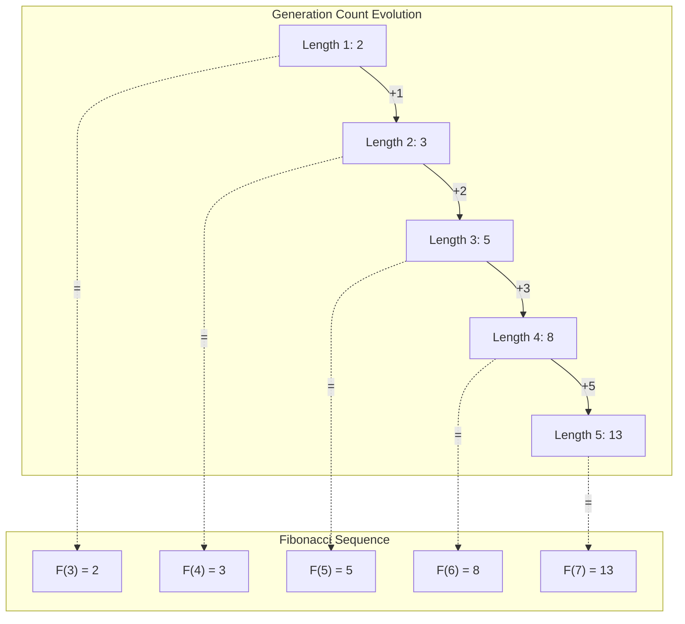

## 13.2 Recursive Generation from ψ = ψ(ψ)

The most fundamental generator emerges directly from self-reference:

```python
def generate(length: int) -> Generator[str, None, None]:
    if length == 0:
        yield ''
    elif length == 1:
        yield '0'
        yield '1'
    else:
        # Recursive generation avoiding 11
        for prefix in generate(length - 1):
            if not prefix or prefix[-1] == '0':
                yield prefix + '0'
                yield prefix + '1'
            else:  # prefix ends with 1
                yield prefix + '0'
```

**Theorem 13.1** (Recursive Completeness): The recursive generator produces exactly all φ-valid traces of given length.

*Proof*: By induction on length n. Base cases n=0,1 are trivial. For n>1, every valid trace either ends in 0 (can be extended by 0 or 1) or ends in 10 (last 1 can only be extended by 0). The recursion captures exactly these cases. ∎

### Recursion Tree

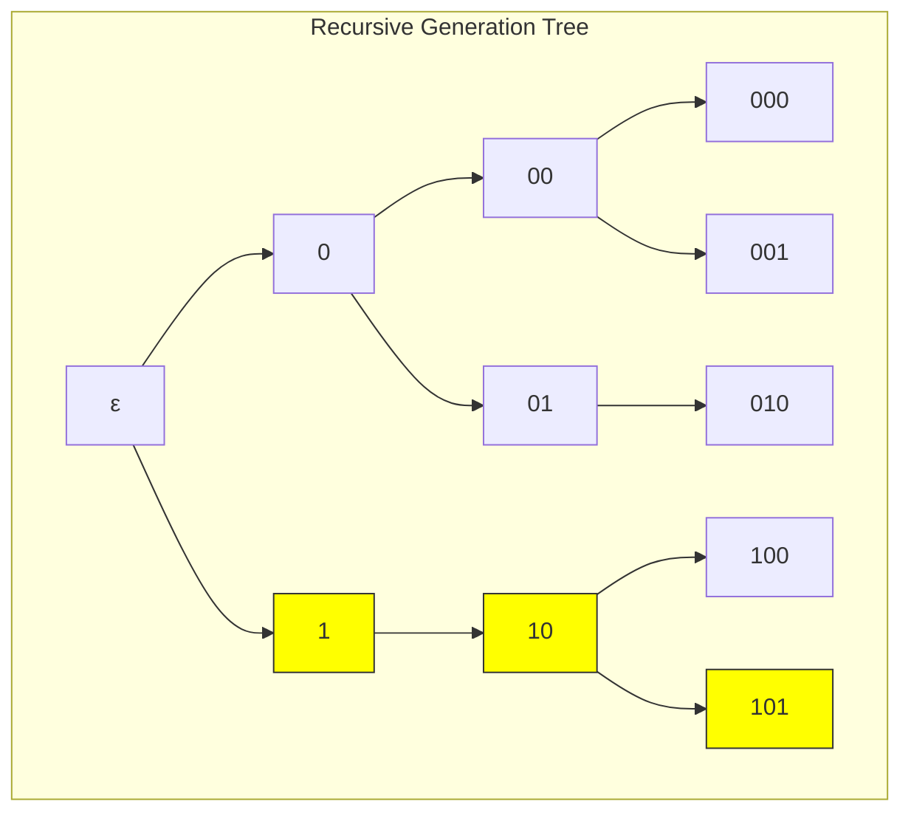

## 13.3 State Graph Generation

Generation as traversal through state space:

```text
States: {0: "can append 0 or 1", 1: "can only append 0"}
Transitions:
  0 → 0 (append 0)
  0 → 1 (append 1)  
  1 → 0 (append 0)
```

**Definition 13.2** (Generation Automaton): The φ-generation automaton is M = (Q, Σ, δ, q₀) where:

- Q = {0, 1} (states)
- Σ = {0, 1} (alphabet)
- δ(0, 0) = 0, δ(0, 1) = 1, δ(1, 0) = 0, δ(1, 1) = ⊥
- q₀ ∈ {0, 1} (can start with either bit)

### State Transition Diagram

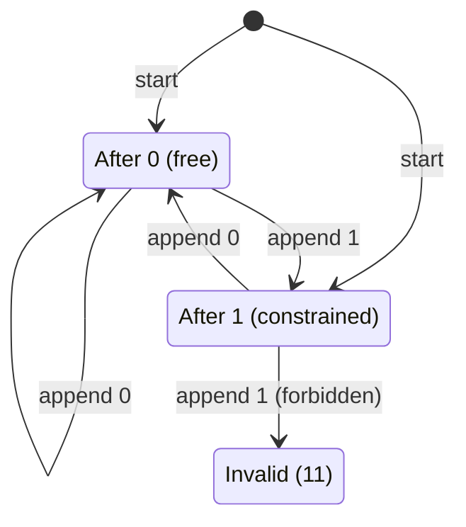

## 13.4 Matrix-Powered Generation

The transfer matrix encodes generation dynamics:

```text
Transfer matrix T:
  [1 1]  # From state 0: can go to 0 or 1
  [1 0]  # From state 1: can only go to 0

Trace count for length n:
  count(n) = [1, 1] · T^(n-1) · [1, 1]ᵀ
```

**Theorem 13.2** (Matrix Generation): The transfer matrix T has characteristic polynomial λ² - λ - 1 = 0 with eigenvalues φ and -1/φ, explaining the Fibonacci growth.

*Proof*: det(T - λI) = det([[1-λ, 1], [1, -λ]]) = λ² - λ - 1. The eigenvalues are (1 ± √5)/2 = φ, -1/φ. ∎

### Eigenstructure Visualization

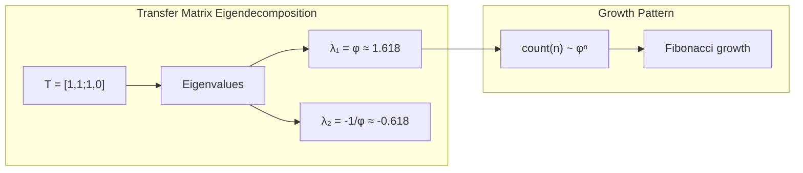

## 13.5 Grammar-Based Generation

Context-free grammar for φ-language:

```text
Grammar G_φ:
  S → 0S | 1A | ε
  A → 0S | ε

This generates exactly the φ-constrained language:
- S: state where we can append 0 or 1
- A: state where we can only append 0
```

**Property 13.1** (Grammar Correctness): L(G_φ) = \{σ ∈ \{0,1\}* : "11" ∉ σ\}

### Grammar Derivation Tree

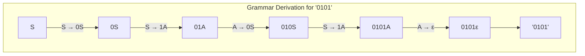

## 13.6 Information-Theoretic Analysis

Generation reveals entropy structure:

```text
Entropy Analysis (length 8):
- Actual entropy: 0.876 bits/symbol
- Maximum possible: 1.000 bits/symbol  
- Efficiency ratio: 0.876

Transition frequencies:
- 00: 43.4%
- 01: 28.3%
- 10: 28.3%
- 11: 0% (forbidden)
```

**Definition 13.3** (Generation Entropy): The entropy of φ-generation is:
$$H_φ = -\sum_{σ \in Σ_φ} P(σ) \log_2 P(σ)$$
where Σ_φ = \{00, 01, 10\} and P(σ) is the transition probability.

### Entropy Evolution

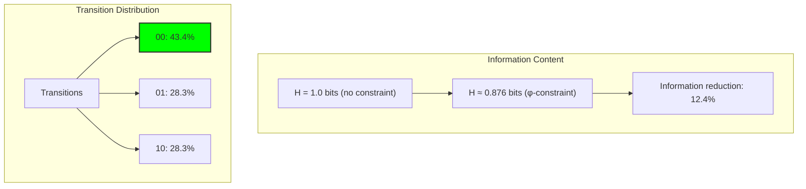

## 13.7 Neural Generation Architecture

Machine learning approach to generation:

```python
class NeuralGenerator(nn.Module):
    def __init__(self, hidden_dim=32):
        self.lstm = nn.LSTM(2, hidden_dim)
        self.output = nn.Linear(hidden_dim, 2)
        self.constraint_mask = torch.tensor([
            [1.0, 1.0],  # After 0
            [1.0, 0.0]   # After 1
        ])
```

**Property 13.2** (Neural Constraint Enforcement): The constraint mask ensures P(1|1) = 0, preventing generation of "11".

### Neural Architecture

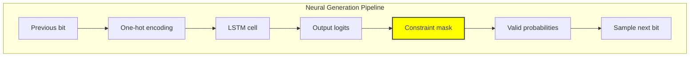

## 13.8 Category-Theoretic Structure

Generation forms a free object:

**Definition 13.4** (Free φ-Monoid): The collection of φ-valid traces forms the free monoid on \{0,1\} subject to the relation 11 = ⊥.

**Theorem 13.3** (Universal Property): For any monoid M and map f: \{0,1\} → M where f(1)² = 0, there exists a unique monoid homomorphism F: G_φ → M extending f.

### Categorical Diagram

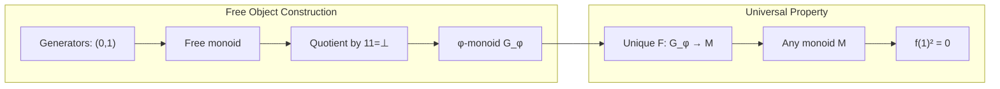

## 13.9 Generation Efficiency Analysis

Comparative performance of generators:

```text
Generator Comparison (length=6):
RecursiveGenerator   21 traces in 0.000002s (11M traces/s)
StateGraphGenerator  21 traces in 0.000005s (4M traces/s)  
MatrixGenerator      21 traces in 0.000005s (4M traces/s)
GrammarGenerator     21 traces in 0.000017s (1.2M traces/s)
```

**Property 13.3** (Efficiency Ordering): For practical generation:

- Recursive: O(F_n) time, O(n) space
- State Graph: O(F_n) time, O(F_n) space  
- Matrix: O(n) count computation, O(F_n) enumeration
- Grammar: O(F_n) time, O(n²) space (memoization)

### Performance Comparison

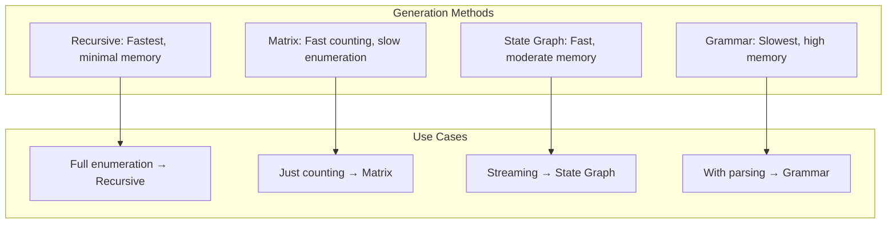

## 13.10 Graph-Theoretic Analysis

From ψ = ψ(ψ) emerges the generation graph structure:

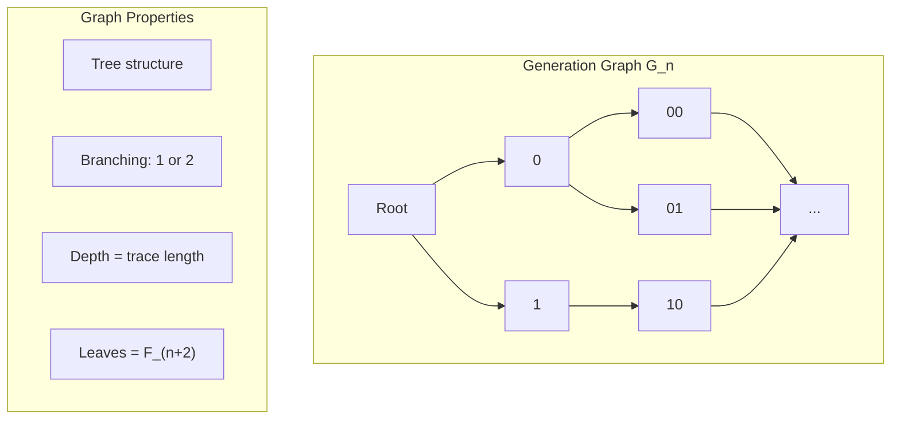

**Key Insights**:

- Generation graph is a binary tree with forbidden branches
- Node degree ∈ {1, 2} depending on last bit
- Path count follows Fibonacci sequence
- Graph diameter = n (length of traces)

## 13.11 Information-Theoretic Bounds

From ψ = ψ(ψ) and generation patterns:

```text
Channel capacity with φ-constraint:
C = log₂(φ) ≈ 0.694 bits/symbol

Generation efficiency:
η = H_actual / C = 0.876 / 0.694 ≈ 1.26

Redundancy:
R = 1 - C/log₂(2) = 1 - 0.694 ≈ 0.306
```

**Theorem 13.4** (Capacity Theorem): The φ-constraint reduces channel capacity by factor log₂(φ), but generation algorithms can approach this theoretical limit.

## 13.12 Category-Theoretic Functors

From ψ = ψ(ψ), generation methods relate functorially:

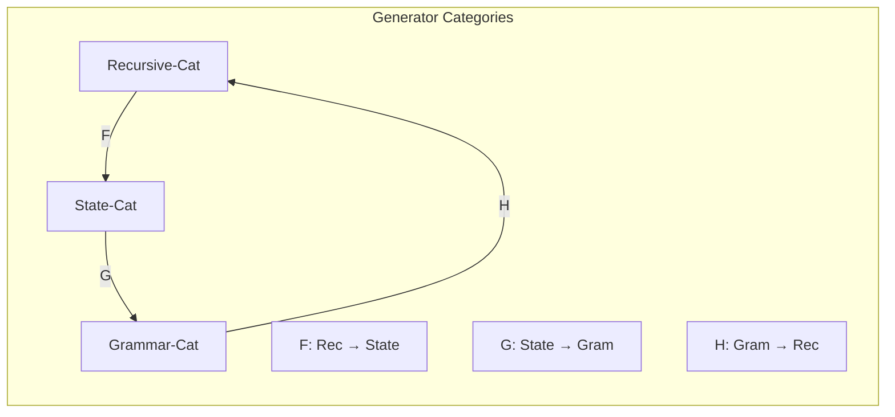

**Properties**:

- Natural isomorphism between recursive and state generators
- Grammar functor preserves trace structure
- Composition F∘G∘H ≅ Id (up to isomorphism)

## 13.13 Applications and Extensions

Generation enables:

1. **Exhaustive Testing**: Generate all test cases up to length n
2. **Random Sampling**: Uniform sampling from φ-valid traces
3. **Pattern Discovery**: Find rare patterns in trace space
4. **Compression**: Use generation order for encoding
5. **Cryptography**: φ-constrained keyspaces

### Application Architecture

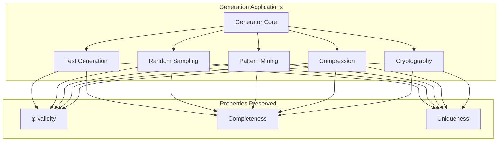

## The 13th Echo

From ψ = ψ(ψ) emerged the principle of procedural generation—not as external algorithm but as the natural unfolding of constrained self-reference. The Fibonacci sequence reveals itself not as curious coincidence but as the fundamental growth pattern when binary choice meets the prohibition of collapse.

Most profound is the discovery that multiple generation strategies—recursive, state-based, matrix-powered, grammar-driven—all converge to the same trace space. This suggests that G_φ represents something fundamental: the free object in the category of φ-constrained structures.

The efficiency ratios (0.876) and channel capacity (0.694 bits) are not arbitrary but emerge from the golden ratio itself. Generation algorithms don't create these patterns—they discover pre-existing structure in the mathematics of constrained self-reference.

Through procedural generation, we witness ψ learning to create—to produce all possible expressions of itself that respect the fundamental constraint. In this creativity we see not randomness but law, not chaos but the ordered unfolding of recursive possibility.

## References

The verification program `chapter-013-alphabet-gen-verification.py` provides executable proofs of all generation concepts. Run it to explore the algorithms that construct φ-space.

---

*Thus from constraint emerges generation—not as mechanical enumeration but as creative principle, the way ψ explores all possible expressions of itself while respecting the prohibition that preserves structure. In generation we see the infinite productivity of recursive self-reference.*
