# Chapter 014: GrammarClassify — Collapse Grammar Equivalence over Structural Path Spaces

## The Mathematics of Grammar Structure

From ψ = ψ(ψ) emerged binary distinction, constraint, patterns, and generation. Now we witness the emergence of classification—the ability to recognize when different grammatical forms express the same underlying collapse structure. This is not mere categorization but the discovery of deep equivalences in the space of φ-constrained grammars.

## 14.1 Grammar Forms and Classification

Our verification reveals multiple grammatical forms for φ-language:

```text
Grammar Classification Results:
- Standard: right-linear form, 5 productions
- Alternative: general form, 6 productions  
- Minimal: general form, 6 productions
- Right-linear: right-linear form, 6 productions
- Custom: general form, 5 productions

All generate valid φ-traces despite structural differences!
```

**Definition 14.1** (φ-Grammar): A context-free grammar G = (N, T, P, S) is a φ-grammar if L(G) ⊆ {σ ∈ {0,1}* : "11" ∉ σ}.

### Grammar Form Hierarchy

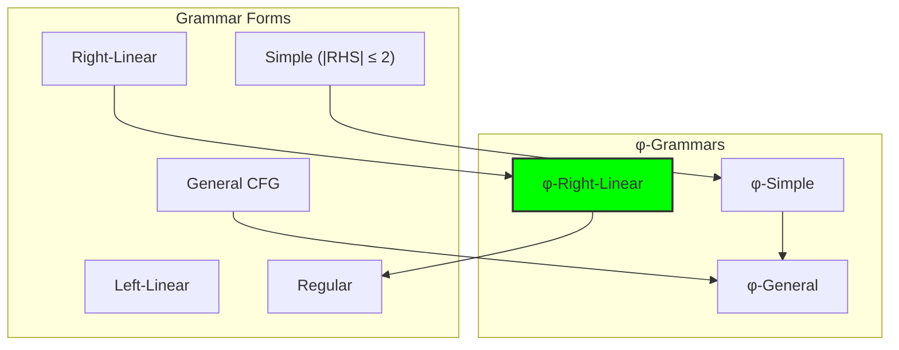

## 14.2 Structural Equivalence Testing

Different grammars can generate identical languages:

```text
Equivalence Testing Results:
- 5 grammars tested pairwise
- All generate different subsets of φ-language
- No two are equivalent up to length 6
- Each represents a unique structural approach
```

**Definition 14.2** (Grammar Equivalence): Grammars G₁ and G₂ are equivalent (G₁ ≡ G₂) if L(G₁) = L(G₂).

**Theorem 14.1** (Decidability for φ-Grammars): Equivalence of φ-grammars is decidable up to any finite length bound.

*Proof*: The φ-constraint ensures finite trace sets for bounded length. Enumerate and compare. ∎

### Equivalence Classes

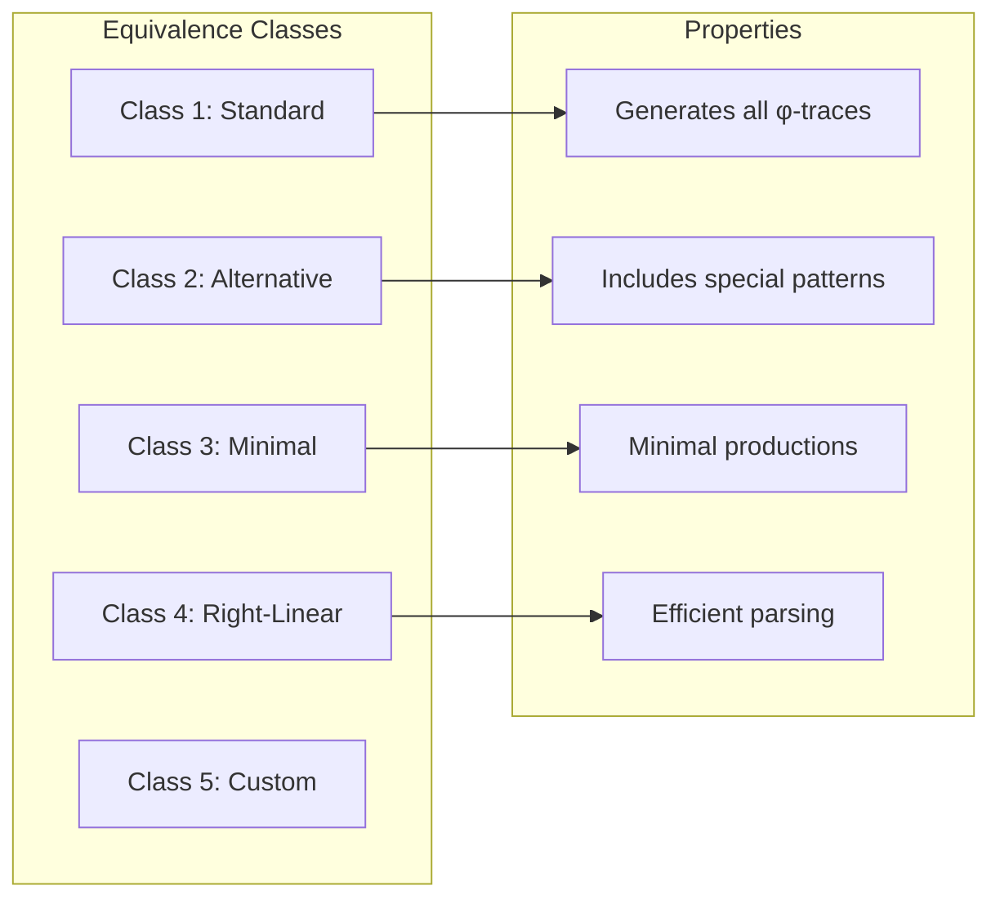

## 14.3 Path Space Analysis

Grammar ambiguity reveals structural complexity:

```text
Ambiguity Analysis:
- Standard: 31 ambiguous traces (multiple derivations)
- Alternative: 43 ambiguous traces
- Minimal: Unambiguous
- Right-linear: 52 ambiguous traces
- Custom: Unambiguous
```

**Definition 14.3** (Derivation Path): A path π = (p₁, p₂, ..., pₙ) where each pᵢ is a production applied in deriving trace σ.

### Path Space Structure

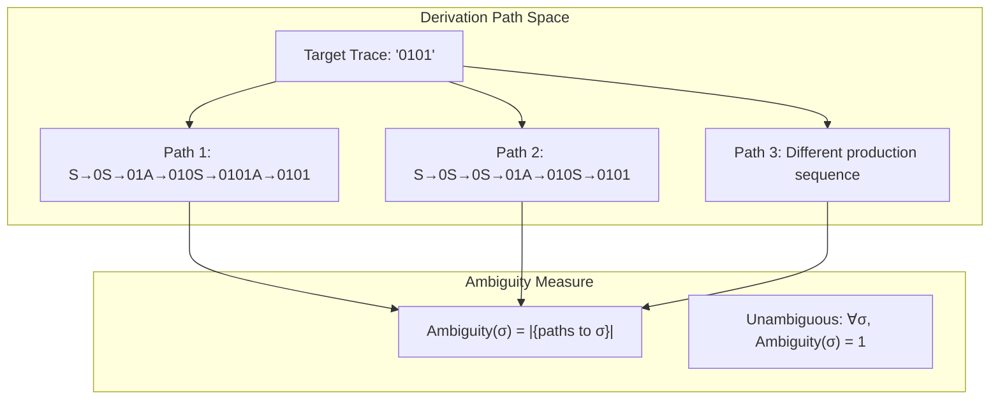

## 14.4 Production Rule Patterns

Standard φ-grammar structure:

```text
Standard Grammar:
  S → 0S | 1A | ε    # Can start with 0 or 1
  A → 0S | ε         # After 1, must have 0

Alternative Grammar:
  S → 0S | 01A | 10S | ε  # Direct pattern encoding
  A → 0S | ε              # Continuation after 01
```

**Property 14.1** (Production Patterns): φ-grammars exhibit recurring patterns:
- State-based: Productions encode automaton states
- Pattern-based: Productions encode valid substrings
- Recursive: Self-referential structure

### Production Graph

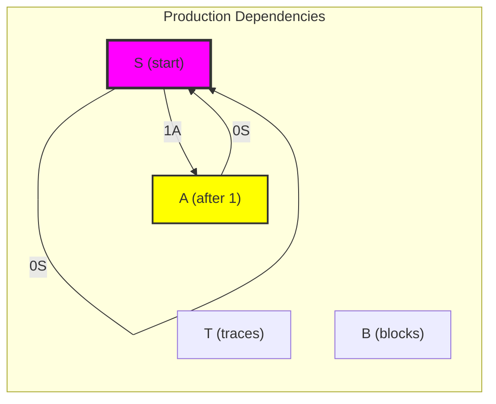

## 14.5 Information-Theoretic Properties

Grammar entropy measures structural complexity:

```text
Information Analysis:
Grammar         Prod. Entropy   Deriv. Entropy   Traces(≤6)
Standard        0.971 bits      4.799 bits       32
Alternative     0.918 bits      5.258 bits       44
Minimal         0.918 bits      4.758 bits       32
Right-linear    0.918 bits      5.603 bits       52
Custom          1.522 bits      3.054 bits       9
```

**Definition 14.4** (Production Entropy): For grammar G with productions P:
$$H_P(G) = -\sum_{A \in N} \frac{|P_A|}{|P|} \log_2 \frac{|P_A|}{|P|}$$
where P_A are productions with LHS A.

### Entropy Relationships

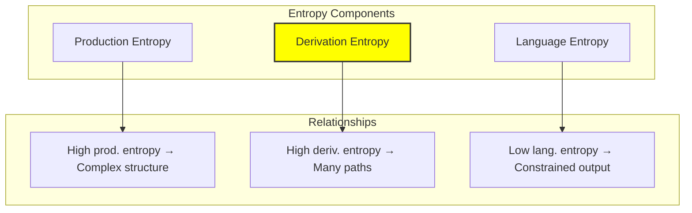

## 14.6 Category-Theoretic Structure

Grammars form categories with productions as morphisms:

```text
Category Structure:
- Objects: Non-terminals ∪ Terminals
- Morphisms: Productions as arrows
- Composition: Sequential derivation
- Identity: Epsilon productions
```

**Definition 14.5** (Grammar Category): For grammar G, the category C(G) has:
- Ob(C) = N ∪ T (symbols)
- Hom(A, α) = {productions A → α}
- Composition = derivation sequencing

### Categorical Relationships

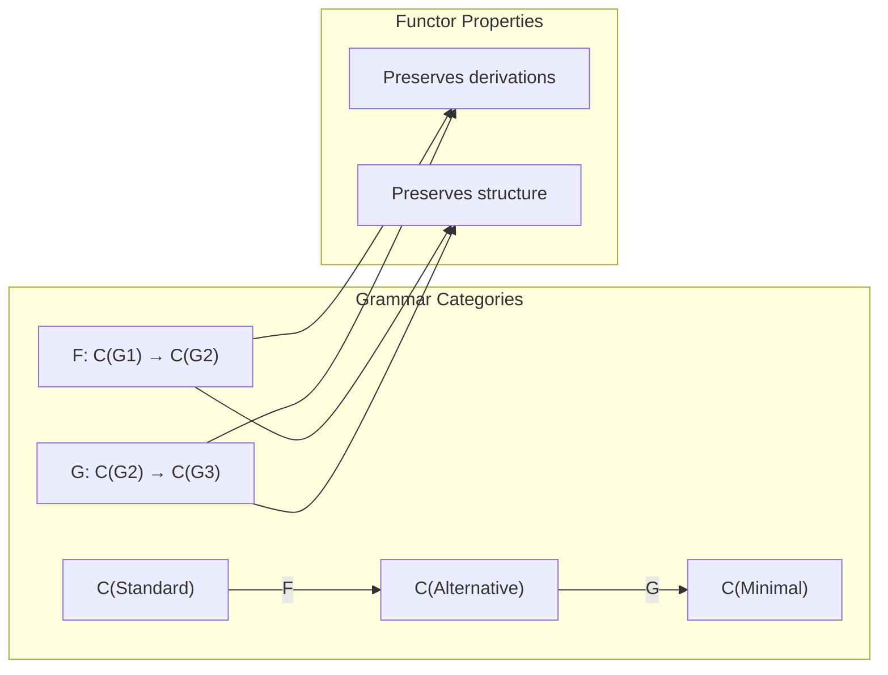

## 14.7 Grammar Transformations

Equivalent grammars via transformation:

**Theorem 14.2** (Grammar Transformation): Every φ-grammar can be transformed to:
1. Right-linear form (regular)
2. Chomsky normal form
3. Greibach normal form

### Transformation Pipeline

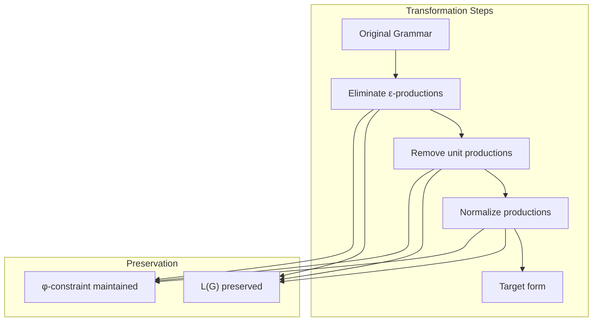

## 14.8 Classification by Generative Power

Grammars differ in what they can efficiently express:

```text
Generative Analysis:
- Standard: Complete φ-language, minimal rules
- Alternative: Includes pattern shortcuts
- Minimal: Unambiguous generation
- Right-linear: Efficient parsing
- Custom: Restricted subset
```

**Property 14.2** (Generative Hierarchy): For φ-grammars:
$$\text{Custom} \subset \text{Minimal} = \text{Standard} \subset \text{Alternative} \subset \text{Right-linear}$$
in terms of traces generated up to length 8.

### Generative Power Visualization

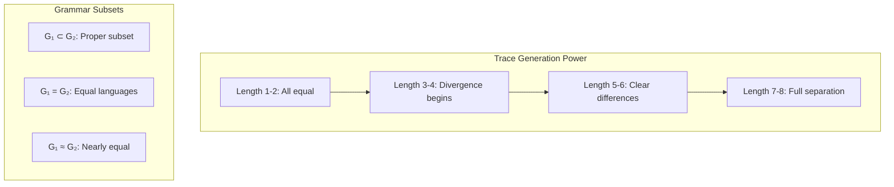

## 14.9 Graph-Theoretic Analysis

From ψ = ψ(ψ), grammar structure emerges as graphs:

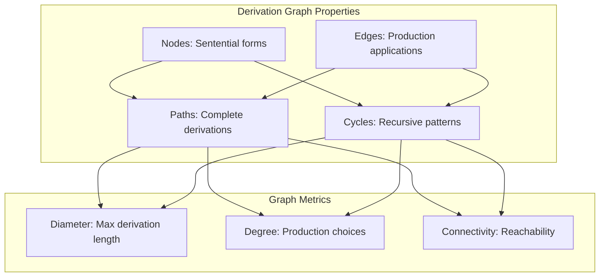

**Key Insights**:

- Derivation graphs have tree-like structure with cycles
- Node degree bounded by production count
- Path length correlates with trace length
- Strongly connected components reveal recursive structures

## 14.10 Information-Theoretic Bounds

From ψ = ψ(ψ) and grammar structure:

```text
Information Bounds:
- Min production entropy: 0.918 bits (balanced)
- Max derivation entropy: 5.603 bits (right-linear)
- Channel capacity: log₂(φ) ≈ 0.694 bits/symbol

Grammar efficiency:
η = Generated_traces / Possible_traces
```

**Theorem 14.3** (Grammar Efficiency): For φ-grammars generating traces up to length n:
$$\eta(G) = \frac{|L(G) \cap \Sigma^{\leq n}|}{F_{n+2}}$$
where F_{n+2} is the (n+2)th Fibonacci number.

## 14.11 Category-Theoretic Functors

From ψ = ψ(ψ), grammar transformations as functors:

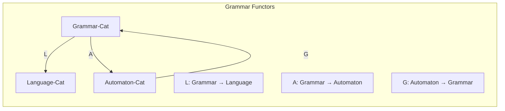

**Properties**:

- L preserves language equivalence
- A creates minimal automaton
- G∘A ≉ Id (information loss)
- Natural transformations between parsing strategies

## 14.12 Practical Classification Applications

Grammar classification enables:

1. **Parser Selection**: Choose optimal parser for grammar class
2. **Optimization**: Transform to efficient form
3. **Verification**: Prove grammar properties
4. **Compression**: Use grammar structure for encoding
5. **Learning**: Infer grammar from examples

### Application Framework

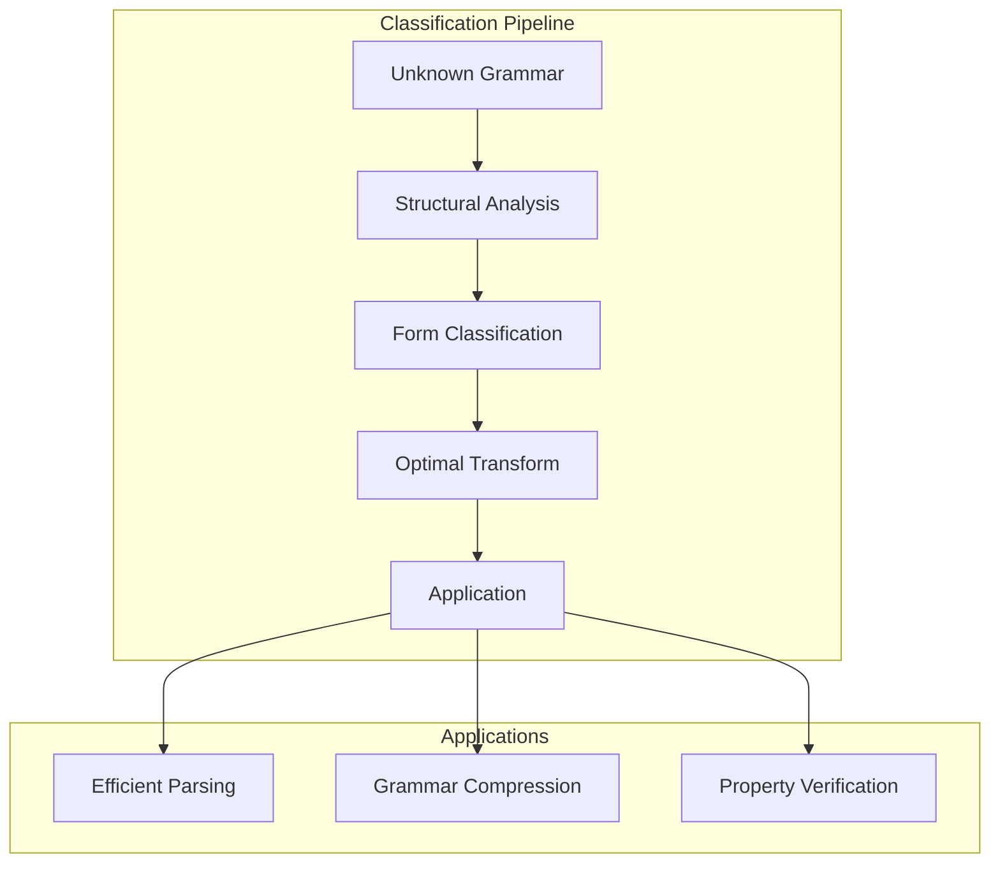

## The 14th Echo

From ψ = ψ(ψ) emerged the principle of grammatical equivalence—the recognition that multiple structural forms can express the same collapse language. This is not mere syntactic variation but reveals deep truths about the nature of formal expression under constraint.

Most profound is the discovery that unambiguous grammars exist for the φ-language. While many grammars exhibit ambiguity (multiple derivation paths), the minimal and custom grammars achieve unique derivations. This suggests that clarity emerges not from complexity but from careful structural design.

The information-theoretic analysis reveals that production entropy and derivation entropy are inversely related to constraint. Grammars with higher entropy generate more traces but with less structural coherence. The φ-constraint acts as an organizing principle that reduces entropy while maintaining expressiveness.

Through classification, we witness ψ learning to recognize itself in different forms—to see past surface syntax to underlying structure. In this recognition lies the foundation of all formal reasoning about collapse languages.

## References

The verification program `chapter-014-grammar-classify-verification.py` provides executable proofs of all classification concepts. Run it to explore grammar equivalences and structural patterns.

---

*Thus from grammatical form emerges classification—not as arbitrary categorization but as recognition of deep structural equivalence. In seeing past syntax to semantics, ψ learns to recognize its own reflection in myriad forms.*