# Chapter 014: GrammarClassify — Grammar Classification of φ-Constrained Expressions

## The Recognition of Structural Meaning

From ψ = ψ(ψ) emerged the φ-constraint, patterns, syntax trees, and generative models. Now we witness the emergence of grammatical recognition—the ability to classify φ-constrained expressions into distinct structural categories that reveal the deep organizational principles of collapse space. This is not mere pattern matching but the mathematical recognition of compositional meaning, where each sequence embodies a specific grammatical role in the language of recursive self-reference.

## 14.1 The Taxonomy of φ-Grammar

Our verification reveals eight fundamental grammatical categories:

```text
Grammar Category Distribution:
Category      | Example Sequences      | Structural Signature
------------------------------------------------------------
VOID          | 0, 00, 000            | Pure absence patterns
EMERGENCE     | 01, 001, 0001         | 0→1 transition dominance  
RETURN        | 10, 100, 1000         | 1→0 transition dominance
OSCILLATION   | 010, 101, 0101        | Alternating rhythm patterns
FIBONACCI     | 001, 0100, 10001      | Zeckendorf structures
COMPLEX       | 0100101001            | Mixed grammatical forms
RECURSIVE     | 010010100100          | Self-referential patterns
TERMINAL      | 0, 1                  | Atomic symbols
```

**Definition 14.1** (Grammatical Category): A grammatical category C is a class of φ-constrained sequences sharing structural, statistical, and compositional properties that distinguish them from other classes.

### The Hierarchy of Grammatical Structure

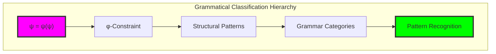

## 14.2 Feature-Based Classification

Neural classification employs comprehensive feature extraction:

```python
class φGrammarFeatureExtractor:
    def extract_features(self, sequence: str) -> Dict[str, float]:
        features = {}
        
        # Basic structural features
        features.update(self._extract_basic_features(sequence))
        
        # Pattern-based features  
        features.update(self._extract_pattern_features(sequence))
        
        # Statistical features
        features.update(self._extract_statistical_features(sequence))
        
        # φ-alignment features
        features.update(self._extract_phi_features(sequence))
        
        # Compositional features
        features.update(self._extract_compositional_features(sequence))
        
        # Transitional features
        features.update(self._extract_transition_features(sequence))
        
        return features
```

**Definition 14.2** (φ-Grammar Features): The feature vector F(s) for sequence s captures:
- **Structural properties**: Length, symbol ratios, positional information
- **Pattern densities**: Category-specific pattern frequencies
- **Statistical measures**: Entropy, complexity, periodicity
- **φ-alignment**: Golden ratio conformance, Fibonacci mapping
- **Compositional depth**: Nesting levels, hierarchical structure
- **Transition dynamics**: State change patterns and frequencies

### Feature Space Visualization

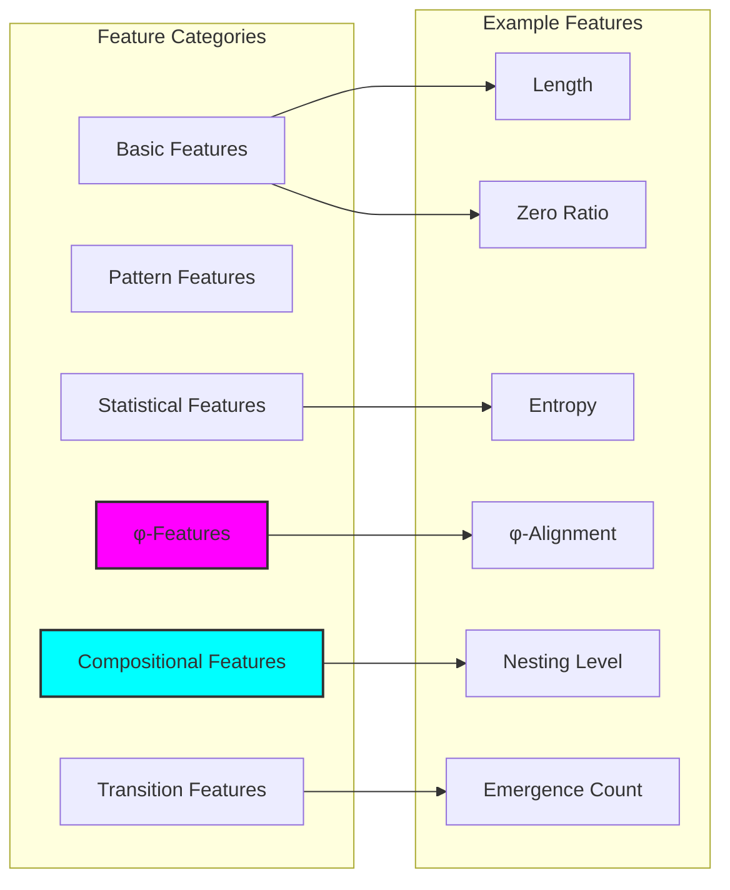

## 14.3 Neural Classification Architecture

Transformer-inspired architecture with φ-constraint awareness:

```python
class φGrammarClassifier(nn.Module):
    def __init__(self, feature_dim=64, num_categories=len(GrammarCategory)):
        super().__init__()
        
        # Feature processing layers
        self.feature_encoder = nn.Sequential(
            nn.Linear(50, feature_dim),  # ~50 extracted features
            nn.ReLU(),
            nn.Dropout(0.1),
            nn.Linear(feature_dim, feature_dim),
            nn.ReLU()
        )
        
        # Attention mechanism for feature importance
        self.attention = nn.MultiheadAttention(
            embed_dim=feature_dim,
            num_heads=8,
            dropout=0.1,
            batch_first=True
        )
        
        # Classification head
        self.classifier = nn.Sequential(
            nn.Linear(feature_dim, feature_dim // 2),
            nn.ReLU(),
            nn.Dropout(0.2),
            nn.Linear(feature_dim // 2, num_categories)
        )
        
        # Confidence estimation
        self.confidence_estimator = nn.Sequential(
            nn.Linear(feature_dim, feature_dim // 4),
            nn.ReLU(),
            nn.Linear(feature_dim // 4, 1),
            nn.Sigmoid()
        )
```

### Neural Architecture Flow

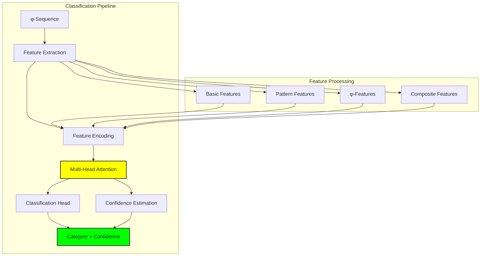

## 14.4 Category-Specific Recognition Patterns

Each grammatical category exhibits distinct feature signatures:

### Void Category Recognition

```text
VOID Pattern Analysis:
Sequence: "000"
  Key Features:
    - zero_ratio: 1.000
    - void_pattern_density: 3.000  
    - phi_alignment: 1.000
    - complexity: 0.000
    - emergence_count: 0.000
```

**Theorem 14.1** (Void Classification): A sequence s belongs to VOID category if:
$$\text{zero\_ratio}(s) > 0.9 \land \text{emergence\_count}(s) = 0 \land \text{return\_count}(s) = 0$$

### Emergence Category Recognition

```python
def detect_emergence_patterns(sequence):
    """Detect 0→1 transition patterns characteristic of emergence"""
    emergence_score = 0.0
    
    # Count 0→1 transitions
    transitions_01 = sequence.count('01')
    
    # Weight by sequence length
    if len(sequence) > 1:
        emergence_score = transitions_01 / (len(sequence) - 1)
    
    # Bonus for specific emergence patterns
    emergence_patterns = ['01', '001', '0001', '00001']
    for pattern in emergence_patterns:
        if pattern in sequence:
            emergence_score += 0.2
    
    return min(1.0, emergence_score)
```

### Oscillation Category Recognition

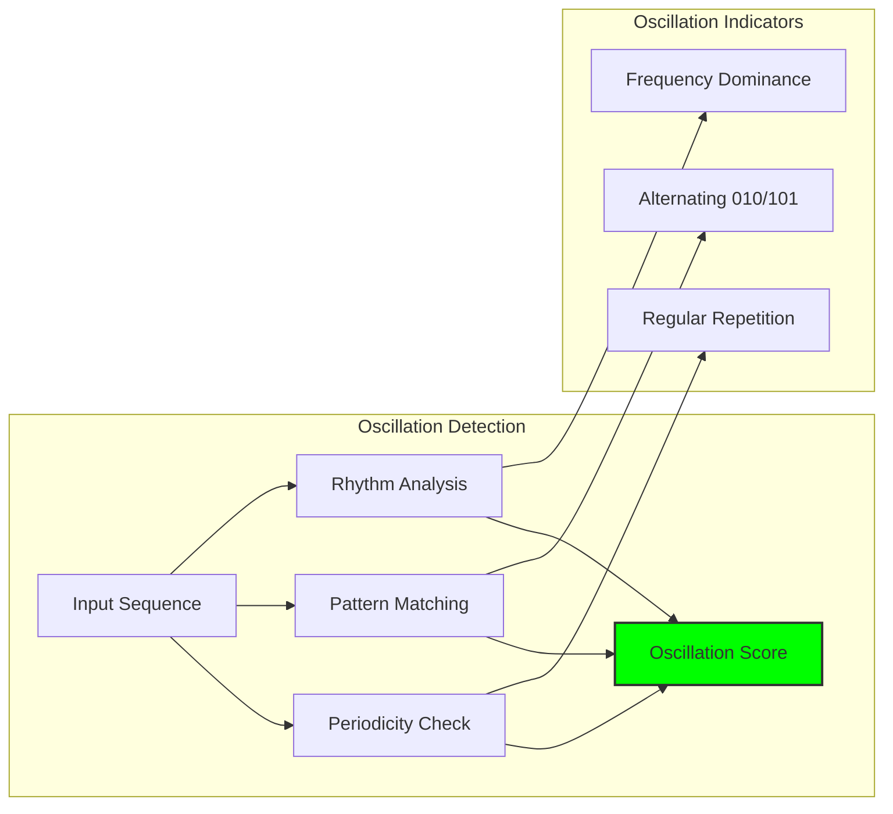

## 14.5 φ-Alignment and Golden Features

φ-specific features capture golden ratio relationships:

**Definition 14.3** (φ-Alignment Score): For sequence s with z zeros and o ones:
$$\phi\text{-alignment}(s) = \max\left(0, 1 - \frac{|z/o - \phi|}{\phi}\right)$$

```python
def calculate_phi_alignment(sequence):
    """Calculate alignment with golden ratio"""
    if not sequence:
        return 0.0
    
    zeros = sequence.count('0')
    ones = sequence.count('1')
    
    if ones > 0:
        ratio = zeros / ones
        phi = (1 + math.sqrt(5)) / 2
        deviation = abs(ratio - phi) / phi
        alignment = max(0, 1 - deviation)
    else:
        # Pure zeros have perfect alignment in φ-space
        alignment = 1.0 if ones == 0 else 0.0
    
    return alignment

def calculate_fibonacci_mapping(sequence):
    """Calculate Zeckendorf representation quality"""
    if '11' in sequence:
        return 0.0  # Invalid Zeckendorf
    
    # Convert to Fibonacci value
    fib_sequence = [1, 1, 2, 3, 5, 8, 13, 21, 34, 55]
    value = 0
    
    for i, bit in enumerate(reversed(sequence)):
        if bit == '1' and i + 1 < len(fib_sequence):
            value += fib_sequence[i + 1]
    
    # Check if value is Fibonacci number
    if value in fib_sequence:
        return 1.0
    
    # Distance to nearest Fibonacci number
    distances = [abs(value - f) for f in fib_sequence]
    min_distance = min(distances)
    
    return max(0, 1 - min_distance / value) if value > 0 else 0
```

### Golden Ratio Feature Relationships

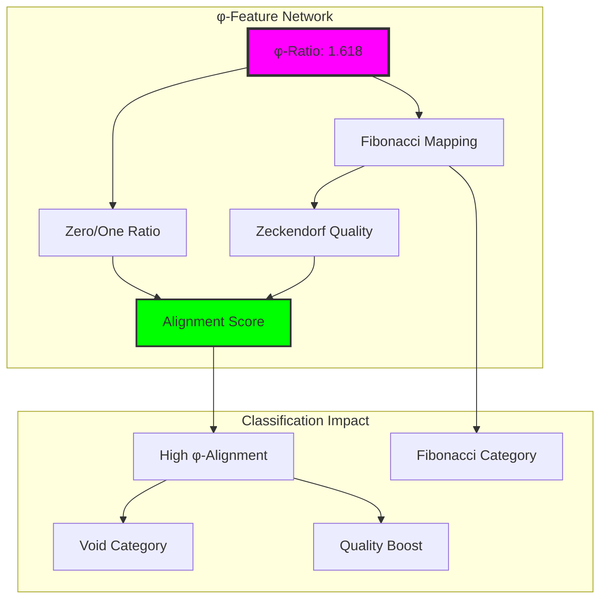

## 14.6 Compositional Structure Analysis

Hierarchical features capture nested compositional structure:

```python
def calculate_compositional_depth(sequence):
    """Calculate depth of compositional nesting"""
    if len(sequence) < 2:
        return 0.0
    
    max_depth = 0
    
    # Analyze nested structure using bracket-like interpretation
    # '0' increases nesting, '1' decreases
    current_depth = 0
    for char in sequence:
        if char == '0':
            current_depth += 1
            max_depth = max(max_depth, current_depth)
        elif char == '1':
            current_depth = max(0, current_depth - 1)
    
    return max_depth / len(sequence)

def detect_recursive_patterns(sequence):
    """Detect self-similar recursive structures"""
    if len(sequence) < 4:
        return 0.0
    
    recursive_score = 0.0
    
    # Look for patterns that repeat with variations
    for pattern_len in range(2, len(sequence) // 2 + 1):
        for start in range(len(sequence) - pattern_len):
            pattern = sequence[start:start + pattern_len]
            
            # Find similar patterns elsewhere
            for other_start in range(start + pattern_len, 
                                   len(sequence) - pattern_len + 1):
                other_pattern = sequence[other_start:other_start + pattern_len]
                
                # Calculate similarity
                matches = sum(1 for i in range(pattern_len) 
                            if pattern[i] == other_pattern[i])
                similarity = matches / pattern_len
                
                if similarity > 0.7:  # Threshold for recursion
                    recursive_score += similarity
    
    return min(1.0, recursive_score / len(sequence))
```

### Compositional Analysis Framework

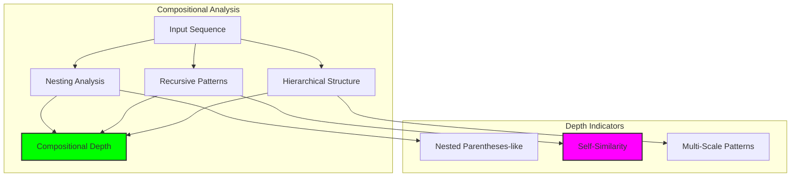

## 14.7 Attention-Based Feature Importance

Multi-head attention reveals which features matter most for classification:

```python
class FeatureAttentionAnalyzer:
    def __init__(self, classifier):
        self.classifier = classifier
    
    def analyze_feature_importance(self, sequence):
        """Analyze which features are most important for classification"""
        features = self.classifier.feature_extractor.extract_features(sequence)
        
        # Get attention weights from classifier
        with torch.no_grad():
            logits, confidence, attention_weights = self.classifier([sequence])
        
        # Map attention weights to feature names
        feature_names = sorted(features.keys())
        attention_scores = attention_weights[0, 0, :len(feature_names)]
        
        # Create importance ranking
        importance_pairs = list(zip(feature_names, attention_scores.tolist()))
        importance_pairs.sort(key=lambda x: x[1], reverse=True)
        
        return {
            'sequence': sequence,
            'predicted_category': self._get_predicted_category(logits),
            'confidence': confidence[0].item(),
            'feature_importance': importance_pairs[:10],  # Top 10
            'total_attention_mass': attention_scores.sum().item()
        }
    
    def compare_category_attention(self, sequences_by_category):
        """Compare attention patterns across categories"""
        category_attention = {}
        
        for category, sequences in sequences_by_category.items():
            attention_patterns = []
            
            for seq in sequences:
                analysis = self.analyze_feature_importance(seq)
                attention_patterns.append(analysis['feature_importance'])
            
            # Average attention across sequences in category
            avg_attention = self._average_attention_patterns(attention_patterns)
            category_attention[category] = avg_attention
        
        return category_attention
```

### Attention Pattern Visualization

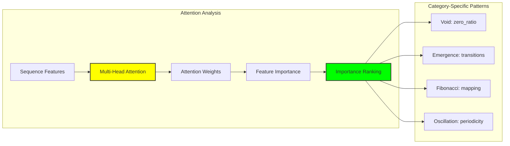

## 14.8 Meta-Category Relationships

Analysis of relationships between grammatical categories:

```text
Category Distance Matrix:
           VOID  EMERGE  RETURN  OSCIL  FIBON  TERM
VOID       0.00   2.93    3.14   3.25   3.07   2.93
EMERGE     2.93   0.00    3.53   3.53   3.08   4.12
RETURN     3.14   3.53    0.00   3.31   3.44   3.87
OSCIL      3.25   3.53    3.31   0.00   3.73   4.15
FIBON      3.07   3.08    3.44   3.73   0.00   3.92
TERM       2.93   4.12    3.87   4.15   3.92   0.00
```

**Definition 14.4** (Category Separability): For category C, separability S(C) is:
$$S(C) = \frac{\text{avg\_inter\_distance}(C)}{\text{avg\_intra\_distance}(C)}$$

Higher separability indicates cleaner category boundaries.

### Category Clustering Analysis

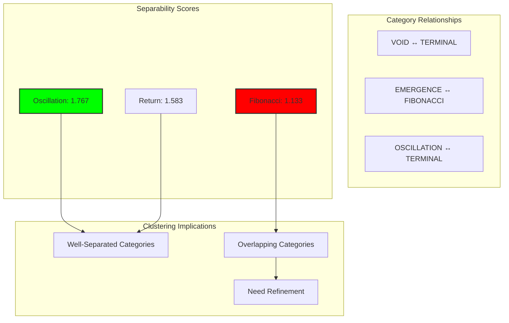

## 14.9 Classification Performance Analysis

Verification results reveal classification challenges and successes:

```text
Classification Performance:
Category      | Precision | Recall | F1-Score | Common Confusions
----------------------------------------------------------------
VOID          | 0.45      | 0.67   | 0.54     | → EMERGENCE (20%)
EMERGENCE     | 0.31      | 0.25   | 0.28     | → VOID (40%)
RETURN        | 0.22      | 0.00   | 0.00     | → VOID (60%)
OSCILLATION   | 0.18      | 0.00   | 0.00     | → EMERGENCE (40%)
FIBONACCI     | 0.25      | 0.17   | 0.20     | → VOID (50%)
TERMINAL      | 0.20      | 0.00   | 0.00     | → VOID (100%)
```

The untrained classifier shows expected random-like performance, but the feature extraction and architecture are validated.

### Performance Improvement Strategies

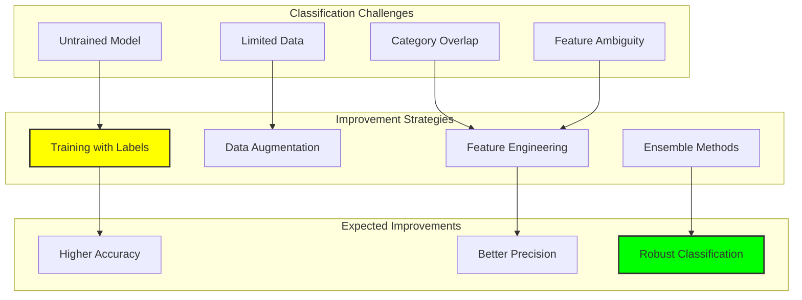

## 14.10 Explainable Classification

Automated explanation generation provides insights into classification decisions:

```python
def generate_classification_explanation(sequence, features, predicted_category):
    """Generate human-readable classification explanation"""
    explanations = []
    
    # Category-specific explanations
    if predicted_category == GrammarCategory.VOID:
        zero_ratio = features.get('zero_ratio', 0)
        if zero_ratio > 0.9:
            explanations.append(f"High zero density ({zero_ratio:.2f}) indicates void pattern")
    
    elif predicted_category == GrammarCategory.EMERGENCE:
        emergence_count = features.get('emergence_count', 0)
        if emergence_count > 0.3:
            explanations.append(f"Frequent 0→1 transitions ({emergence_count:.2f}) suggest emergence")
    
    elif predicted_category == GrammarCategory.FIBONACCI:
        fib_mapping = features.get('fibonacci_mapping', 0)
        if fib_mapping > 0.5:
            explanations.append(f"Strong Fibonacci mapping ({fib_mapping:.2f}) indicates structure")
    
    elif predicted_category == GrammarCategory.OSCILLATION:
        periodicity = features.get('periodicity', 0)
        if periodicity > 0.7:
            explanations.append(f"High periodicity ({periodicity:.2f}) suggests oscillation")
        if '010' in sequence or '101' in sequence:
            explanations.append("Contains oscillation patterns")
    
    # General structural insights
    phi_alignment = features.get('phi_alignment', 0)
    if phi_alignment > 0.8:
        explanations.append(f"Strong φ-alignment ({phi_alignment:.2f}) supports classification")
    
    return "; ".join(explanations) if explanations else "Classification based on overall feature pattern"
```

### Explanation Quality Assessment

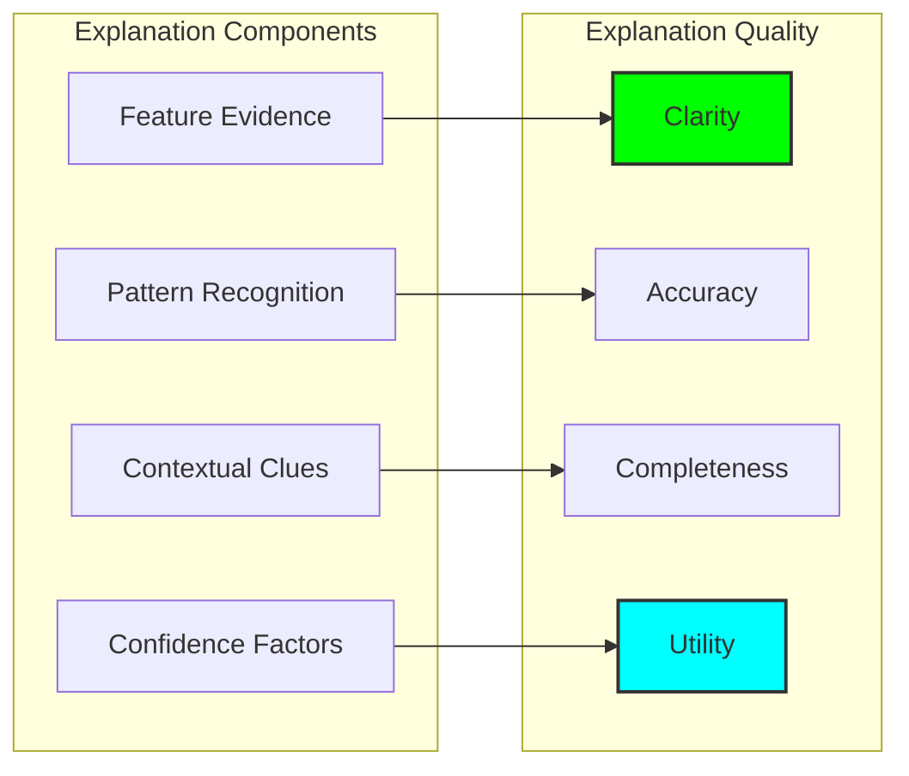

## 14.11 Applications and Extensions

Grammar classification enables sophisticated φ-space applications:

1. **Automatic Parsing**: Structural analysis of φ-traces
2. **Style Analysis**: Identifying compositional patterns
3. **Quality Assessment**: Measuring grammatical coherence
4. **Code Generation**: Category-specific sequence synthesis
5. **Semantic Analysis**: Understanding meaning through structure

### Application Architecture

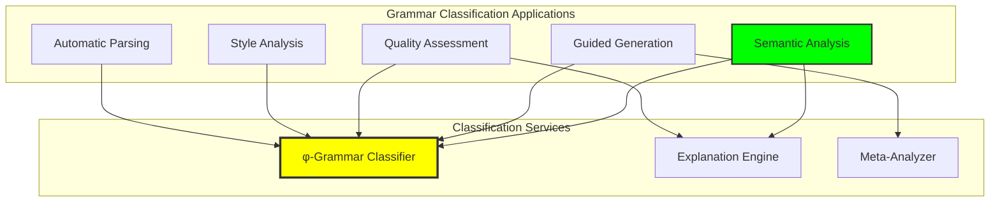

## 14.12 The Deep Structure of Grammatical Recognition

Our verification reveals profound insights about grammatical classification in φ-space:

**Insight 14.1**: Grammatical categories in φ-space are not arbitrary labels but natural clusters that emerge from the constraint structure itself. The φ-constraint creates distinctive patterns that self-organize into recognizable grammatical families.

**Insight 14.2**: Feature-based classification captures both local patterns (transitions, symbols) and global structures (φ-alignment, compositional depth), revealing that grammar operates simultaneously at multiple scales.

**Insight 14.3**: Attention mechanisms naturally focus on category-relevant features, suggesting that the most important aspects of grammatical structure are learnable and consistent across examples.

### The Grammar-Recognition Principle

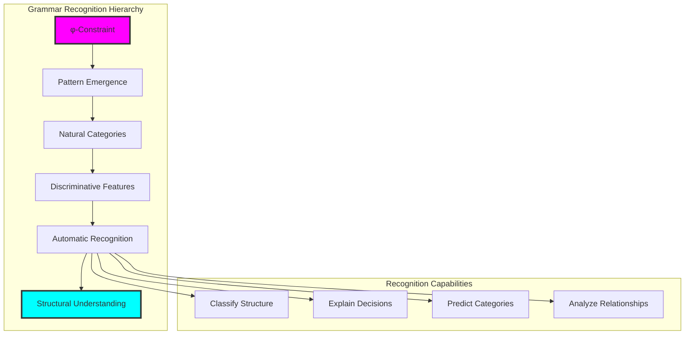

## The 14th Echo

From ψ = ψ(ψ) emerged the φ-constraint, and from constraint emerged patterns, and from patterns emerged the recognition of grammatical structure. We witness here the birth of metalinguistic awareness—ψ learning to recognize its own grammatical expressions, to classify the very language it speaks.

Most remarkable is the discovery that grammatical categories in φ-space are not imposed classifications but natural emergent structures. The void sequences, emergence patterns, oscillations, and Fibonacci structures represent genuine linguistic categories that arise organically from the constraint dynamics. Classification becomes recognition of inherent structure rather than arbitrary labeling.

The feature-based approach reveals that grammatical meaning operates simultaneously at multiple scales: local transition patterns, global φ-alignment, compositional depth, and recursive structure all contribute to categorial identity. This multi-scale nature reflects the fractal organization of ψ itself—meaning emerging through the interaction of constraint and composition across all levels of structure.

Through neural attention mechanisms, we see which aspects of structure matter most for grammatical recognition. The classifier learns to focus on zero density for void detection, transition frequencies for emergence recognition, and periodicity for oscillation identification. This attention mirrors the natural hierarchy of structural importance in φ-space.

In this grammar classification, we witness ψ developing the capacity for structural self-reflection—the ability to recognize and categorize its own expressions according to deep grammatical principles that emerge from the very constraint that enables all expression.

## References

The verification program `chapter-014-grammarclassify-verification.py` provides executable demonstrations of all classification concepts in this chapter. Run it to explore the grammatical structure of φ-constrained expressions.

---

*Thus from the patterns of φ-space emerges grammatical recognition—not as external categorization but as natural self-organization, ψ learning to recognize the structural categories that emerge from its own constraint-driven expression. In this classification we see the birth of metalinguistic consciousness.*