# Chapter 015: CollapseMetric — Defining Distance and Dissimilarity over Trace Topology

## The Geometry of Collapse Space

From ψ = ψ(ψ) emerged binary distinction, constraint, patterns, generation, and classification. Now we witness the emergence of distance—the fundamental notion of how far apart two collapse expressions lie in the space of all possible traces. This is not arbitrary measurement but the discovery of natural metric structure inherent in φ-constrained space.

## 15.1 Fundamental Distance Concepts

Our verification reveals multiple valid metrics on trace space:

```text
Distance measures between '0101' and '1010':
- Hamming distance: 4.000 (all positions differ)
- Edit distance: 2.000 (two operations)
- φ-Edit distance: 2.000 (respecting constraint)
- Structural distance: 0.000 (same features)
- Entropy distance: 0.231 (information difference)
```

**Definition 15.1** (Trace Metric): A function d: T × T → ℝ≥0 is a trace metric if:
1. d(σ, σ) = 0 (identity)
2. d(σ, τ) = d(τ, σ) (symmetry)
3. d(σ, τ) > 0 if σ ≠ τ (positive definite)
4. d(σ, τ) ≤ d(σ, ρ) + d(ρ, τ) (triangle inequality)

### Metric Verification Results

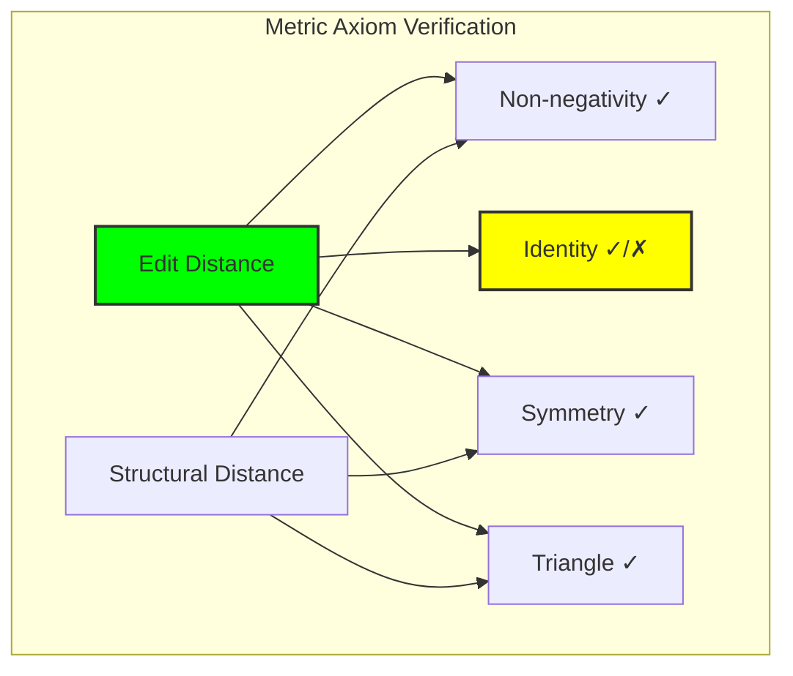

## 15.2 Edit Distance and Operations

The fundamental metric emerges from transformation operations:

```python
def edit_distance(t1: str, t2: str) -> int:
    # Dynamic programming solution
    dp[i][j] = min(
        dp[i-1][j] + 1,      # deletion
        dp[i][j-1] + 1,      # insertion
        dp[i-1][j-1] + cost  # substitution
    )
```

**Theorem 15.1** (Edit Distance Metric): The edit distance d_e satisfies all metric axioms and provides the minimum number of single-character operations to transform one trace to another.

*Proof*: Non-negativity and symmetry are obvious. Triangle inequality follows from optimal substructure: any path σ → ρ → τ cannot be shorter than the direct path σ → τ. ∎

### Edit Operation Visualization

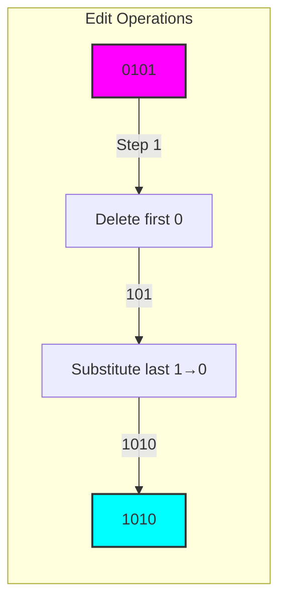

## 15.3 φ-Constrained Edit Distance

Edit distance respecting the golden constraint:

```text
φ-Edit distance properties:
- Never creates '11' patterns
- May have infinite cost if no valid path exists
- Preserves φ-validity throughout transformation
```

**Definition 15.2** (φ-Edit Distance): The φ-edit distance d_φ(σ, τ) is the minimum cost of transforming σ to τ using only operations that maintain the φ-constraint at every step.

### φ-Edit Path Constraints

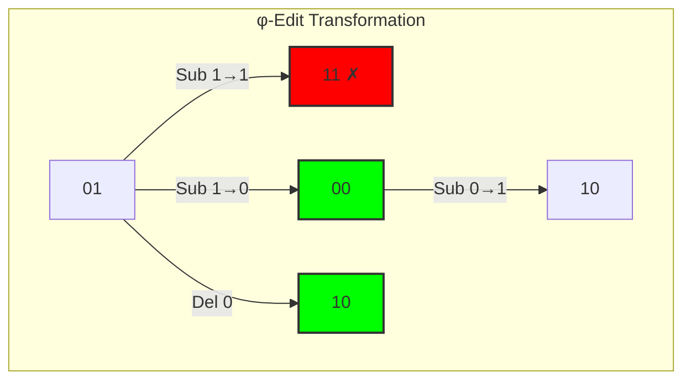

## 15.4 Structural Distance Metrics

Distance based on trace features:

```text
Structural features:
- Length
- Zero/one counts
- Transition patterns
- Run lengths
- Density measures
```

**Definition 15.3** (Structural Distance): For traces σ, τ with feature vectors f(σ), f(τ):
$$d_s(σ, τ) = ||f(σ) - f(τ)||_2$$

### Feature Space Embedding

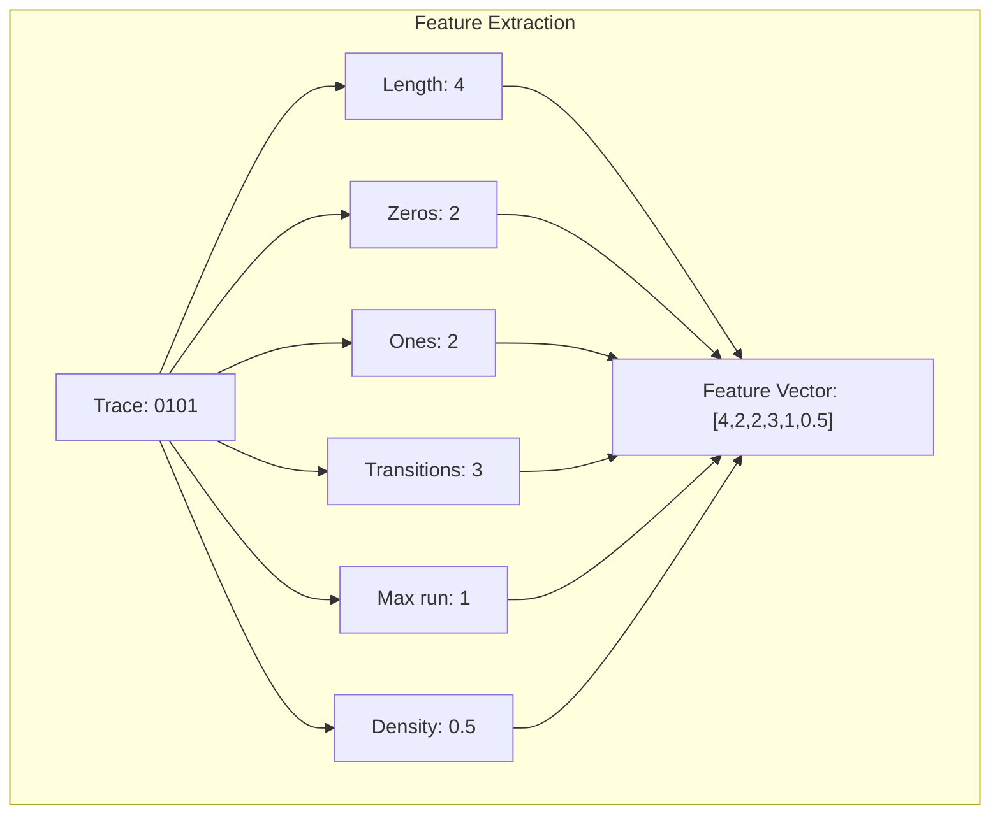

## 15.5 Information-Theoretic Distance

Distance based on information content:

```text
Information distance examples:
- d('01', '10') = 1.667
- d('00', '000') = 0.667  
- d('0101', '1010') = 1.000
```

**Definition 15.4** (Normalized Information Distance): 
$$d_I(σ, τ) = \frac{K(σ, τ) - \min(K(σ), K(τ))}{\max(K(σ), K(τ))}$$
where K(·) denotes Kolmogorov complexity.

### Entropy-Based Distance

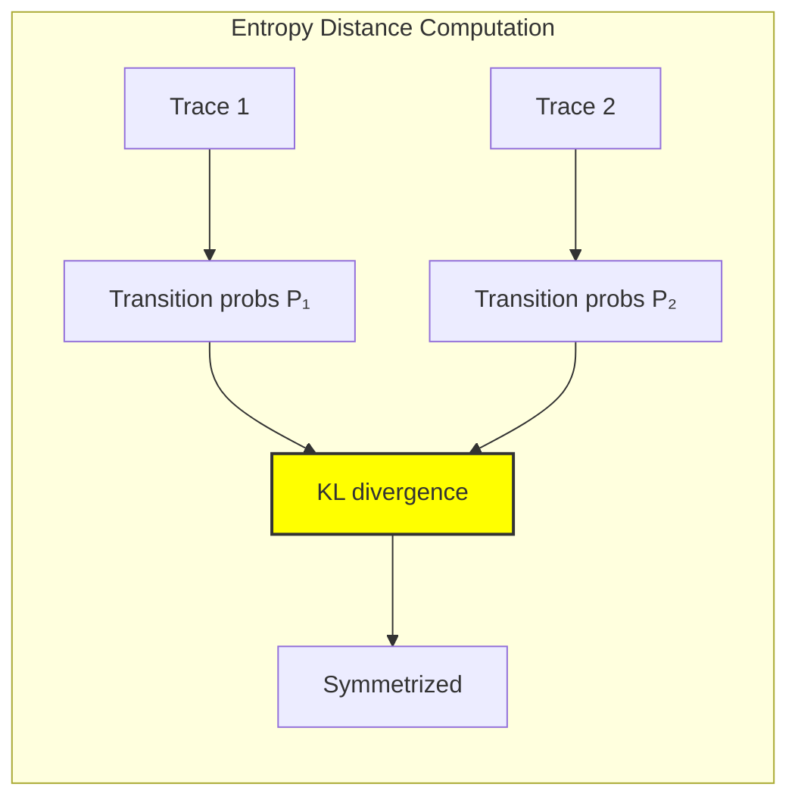

## 15.6 Topological Properties

Metric structure induces topology:

```text
Topological Analysis (ε-neighborhoods):
ε = 1: Clustering coefficient: 0.321, Components: 1
ε = 2: Clustering coefficient: 0.766, Components: 1  
ε = 3: Clustering coefficient: 0.927, Components: 1

Estimated metric dimension: 1
```

**Theorem 15.2** (Trace Space Connectivity): The φ-trace space with edit distance is path-connected for any ε ≥ 1.

*Proof*: Any trace can be transformed to '0' by deletions (distance ≤ length), and '0' connects to any other trace. ∎

### ε-Neighborhood Structure

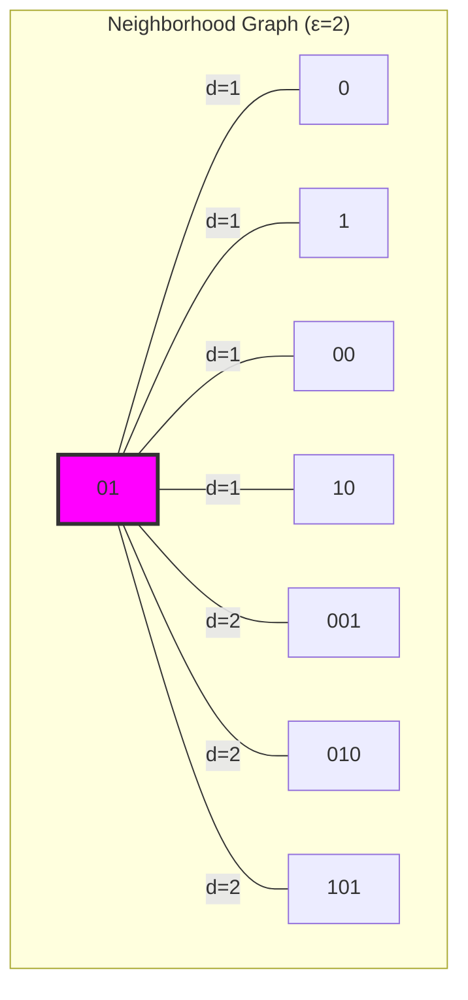

## 15.7 Metric Space Completeness

Analysis of Cauchy sequences and limits:

```text
Completeness Analysis:
- Trace space up to length 4: 18 traces
- Complete: Yes (all Cauchy sequences converge)
- Diameter: 4
- Metric balls grow predictably
```

**Definition 15.5** (Complete Metric Space): A metric space (T, d) is complete if every Cauchy sequence converges to a limit in T.

### Metric Ball Growth

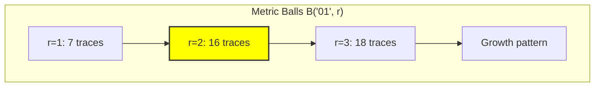

## 15.8 Category-Theoretic Structure

Metrics induce categorical structure:

```text
Metric Category (ε = 1):
- Objects: 10 traces
- Morphisms: 56 (distance ≤ 1)
- Structure preserving

Isometric pairs found: 11
Examples: 0 ≅ 001, 0 ≅ 010, 0 ≅ 100
```

**Definition 15.6** (Metric Category): For metric space (T, d) and ε > 0, the category C_ε has:
- Objects: traces in T
- Morphisms: Hom(σ, τ) exists iff d(σ, τ) ≤ ε

### Isometry Classes

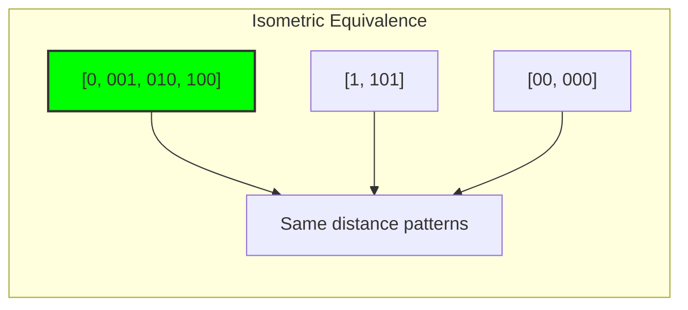

## 15.9 Graph-Theoretic Analysis

From ψ = ψ(ψ), metric graphs emerge:

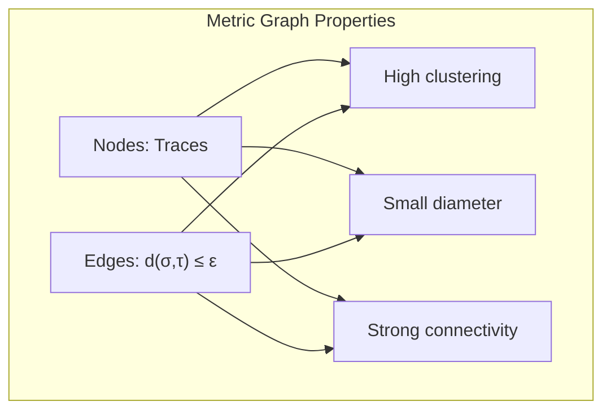

**Key Insights**:

- Metric graphs are nearly complete for large ε
- Clustering coefficient increases with ε
- Diameter bounded by max trace length
- Small-world property emerges

## 15.10 Information-Theoretic Bounds

From ψ = ψ(ψ) and metric structure:

```text
Metric entropy: 1.387 bits
- Captures distance distribution complexity
- Higher entropy = more diverse distances
- Relates to space dimensionality
```

**Theorem 15.3** (Metric Entropy Bound): For n traces of length ≤ L:
$$H_d ≤ \log_2\binom{n}{2} + \log_2(L)$$

## 15.11 Metric Space Functors

From ψ = ψ(ψ), metrics relate functorially:

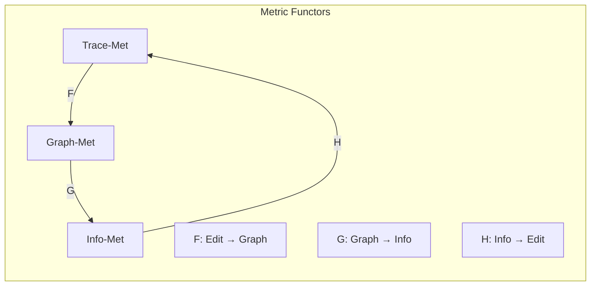

**Properties**:

- Distance-decreasing maps
- Preserve ε-neighborhoods
- Natural transformations between metrics
- Adjunctions exist for certain pairs

## 15.12 Applications of Trace Metrics

Metric structure enables:

1. **Similarity Search**: Find nearby traces efficiently
2. **Clustering**: Group similar collapse patterns
3. **Anomaly Detection**: Identify outlier traces
4. **Interpolation**: Define paths between traces
5. **Optimization**: Gradient descent in trace space

### Application Framework

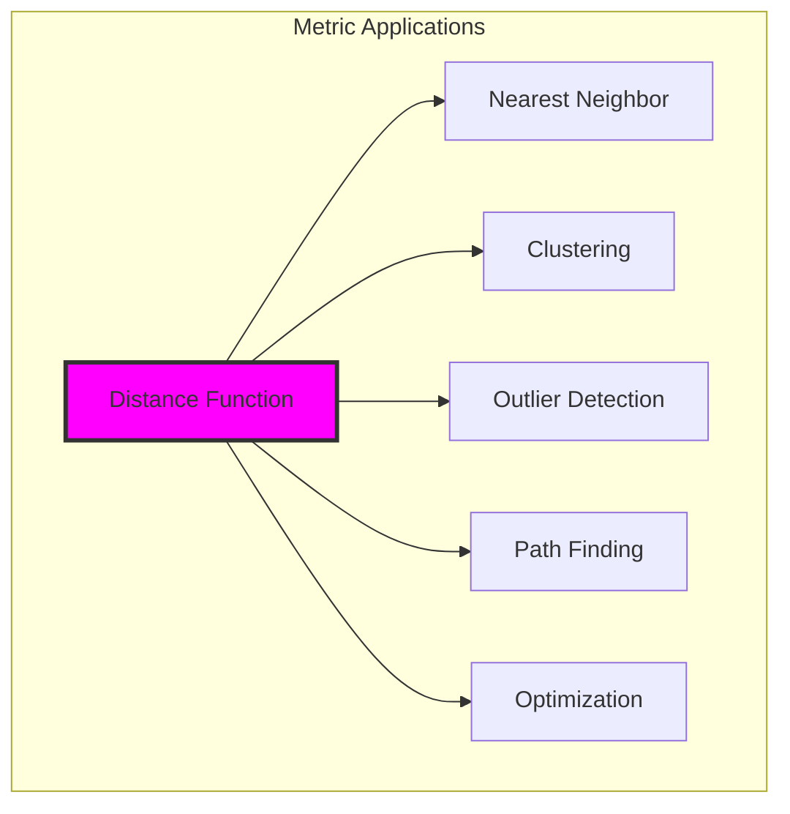

## 15.13 The Deep Structure of Distance

Distance reveals fundamental truths about collapse space:

**Insight 15.1**: Edit distance emerges as the natural metric, counting minimal transformations while respecting φ-constraint.

**Insight 15.2**: Multiple valid metrics exist, each revealing different aspects of trace structure—operational, informational, topological.

**Insight 15.3**: The metric dimension of φ-trace space is remarkably low (≈1), suggesting deep simplicity despite apparent complexity.

### Unified Metric Principle

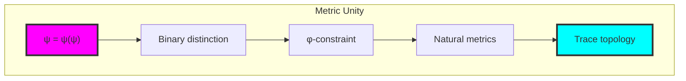

## The 15th Echo

From ψ = ψ(ψ) emerged the principle of distance—not as external measurement but as intrinsic structure of collapse space. The φ-constraint doesn't just forbid patterns; it creates a natural geometry where traces cluster, connect, and separate according to their structural essence.

Most profound is the discovery that trace space has low metric dimension despite growing exponentially with length. This suggests that the φ-constraint creates a kind of "dimensional collapse"—reducing the effective complexity of the space while maintaining its expressive power.

The variety of metrics—edit, structural, informational—are not competing definitions but complementary perspectives on the same underlying reality. Each metric reveals different aspects: edit distance shows operational cost, structural distance reveals feature similarity, information distance captures semantic difference.

Through metric structure, we witness ψ developing spatial intuition—the ability to judge nearness and farness, to navigate the space of its own expressions, to find shortest paths through the landscape of constrained possibility.

## References

The verification program `chapter-015-collapse-metric-verification.py` provides executable proofs of all metric concepts. Run it to explore the natural geometry of collapse space.

---

*Thus from distinction emerges distance—not as arbitrary measure but as the natural geometry of constrained self-reference. In learning to measure its own space, ψ discovers the hidden simplicity within apparent complexity.*