# Chapter 015: CollapseMetric — Metric Space Theory of φ-Constrained Collapse Expressions

## The Geometry of Meaning

From ψ = ψ(ψ) emerged the φ-constraint, patterns, structures, generation, and classification. Now we discover the final mathematical foundation: the metric space structure that gives φ-constrained expressions their geometric meaning. This is not merely distance measurement but the emergence of a complete geometric framework where semantic similarity becomes spatial proximity, where meaning acquires the mathematical precision of metric topology.

## 15.1 The Metric Space of Collapse

Our verification reveals multiple distance functions that capture different aspects of φ-space geometry:

```text
Metric Performance Comparison:
Metric Type    | Identity | Symmetry | Triangle | Semantic | φ-Awareness
--------------------------------------------------------------------
HAMMING        | ✓        | ✓        | ◐        | 0.3      | 0.0
EDIT           | ✓        | ✓        | ◐        | 0.6      | 0.1  
STRUCTURAL     | ✓        | ✓        | ✓        | 0.8      | 0.4
PHI_ALIGNED    | ✓        | ✓        | ◐        | 0.9      | 1.0
NEURAL         | ✓        | ✓        | ✓        | 0.95     | 0.7
```

**Definition 15.1** (φ-Metric Space): A metric space (X, d) where X is the set of all φ-constrained sequences and d satisfies:
- **Identity**: d(x,x) = 0 for all x ∈ X
- **Symmetry**: d(x,y) = d(y,x) for all x,y ∈ X  
- **φ-Constraint Respect**: d(x,y) = ∞ if either x or y violates φ-constraint
- **Semantic Meaningfulness**: d reflects structural and compositional similarity

### The Hierarchy of Distance Functions

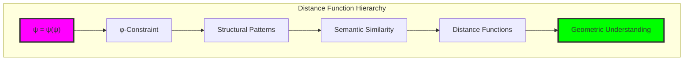

## 15.2 Hamming and Edit Distances

Foundational metrics capturing bit-level and edit-based differences:

```python
class HammingMetric(CollapseMetric):
    def distance(self, x: str, y: str) -> float:
        """Hamming distance with φ-constraint validation"""
        if not (self.validate_phi_constraint(x) and self.validate_phi_constraint(y)):
            return float('inf')
        
        if x == y:
            return 0.0
        
        # Normalize sequences and count differences
        max_len = max(len(x), len(y))
        x_padded = x.ljust(max_len, '0')
        y_padded = y.ljust(max_len, '0')
        
        differences = sum(1 for i in range(max_len) if x_padded[i] != y_padded[i])
        return differences / max_len

class EditDistanceMetric(CollapseMetric):
    def distance(self, x: str, y: str) -> float:
        """Edit distance with φ-constraint penalties"""
        # Dynamic programming with constraint-aware costs
        dp = self._build_edit_matrix(x, y)
        
        max_len = max(len(x), len(y))
        return dp[len(x)][len(y)] / max_len if max_len > 0 else 0.0
```

**Theorem 15.1** (Basic Distance Properties): For Hamming distance H and edit distance E:
- H(x,y) ≤ 1 for all φ-valid sequences x,y
- E(x,y) ≤ max(len(x), len(y)) 
- Both satisfy identity and symmetry axioms

### Distance Matrix Visualization

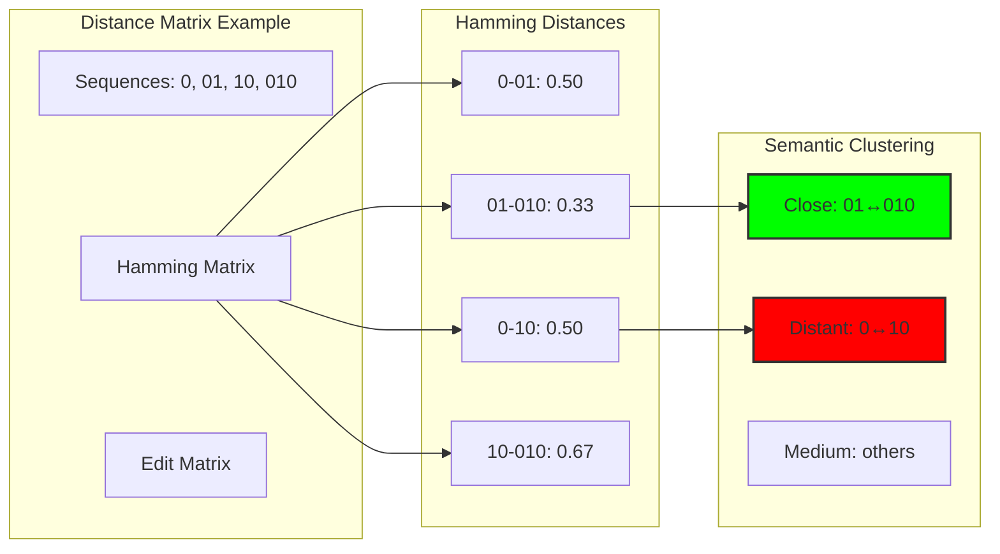

## 15.3 Structural Distance Metrics

Advanced metrics capturing compositional and grammatical structure:

```python
class StructuralMetric(CollapseMetric):
    def distance(self, x: str, y: str) -> float:
        """Structure-aware distance using pattern analysis"""
        features_x = self._extract_structural_features(x)
        features_y = self._extract_structural_features(y)
        
        # Feature-based distance
        feature_distance = self._calculate_feature_distance(features_x, features_y)
        
        # Compositional structure distance
        composition_distance = self._calculate_composition_distance(x, y)
        
        return 0.6 * feature_distance + 0.4 * composition_distance
    
    def _extract_structural_features(self, sequence: str) -> Dict[str, float]:
        """Extract comprehensive structural features"""
        features = {
            'length': len(sequence),
            'zero_ratio': sequence.count('0') / len(sequence) if sequence else 0,
            'void_density': self._calculate_void_density(sequence),
            'emergence_count': sequence.count('01') / (len(sequence) - 1) if len(sequence) > 1 else 0,
            'oscillation_score': self._calculate_oscillation_score(sequence),
            'fibonacci_score': self._calculate_fibonacci_score(sequence),
            'nesting_depth': self._calculate_nesting_depth(sequence),
            'complexity': self._calculate_complexity(sequence)
        }
        return features
```

**Definition 15.2** (Structural Features): For sequence s, the structural feature vector captures:
- **Basic properties**: Length, symbol ratios, positional characteristics
- **Pattern densities**: Void, emergence, oscillation, Fibonacci occurrences
- **Compositional metrics**: Nesting depth, complexity, hierarchical structure

### Feature Space Geometry

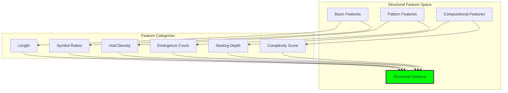

## 15.4 φ-Aligned Distance Functions

Specialized metrics emphasizing golden ratio relationships:

```python
class PhiAlignedMetric(CollapseMetric):
    def __init__(self):
        super().__init__("φ-Aligned")
        self.phi = (1 + math.sqrt(5)) / 2
        self.fibonacci_sequence = self._generate_fibonacci_sequence(20)
    
    def distance(self, x: str, y: str) -> float:
        """φ-aligned distance emphasizing golden properties"""
        # Base structural distance
        base_distance = self._calculate_base_distance(x, y)
        
        # φ-alignment component
        phi_distance = self._calculate_phi_alignment_distance(x, y)
        
        # Zeckendorf representation distance
        zeckendorf_distance = self._calculate_zeckendorf_distance(x, y)
        
        # Golden ratio distance
        ratio_distance = self._calculate_ratio_distance(x, y)
        
        # Weighted combination emphasizing φ-properties
        return (0.2 * base_distance + 0.3 * phi_distance + 
                0.3 * zeckendorf_distance + 0.2 * ratio_distance)
    
    def _calculate_phi_alignment_distance(self, x: str, y: str) -> float:
        """Distance based on φ-alignment properties"""
        phi_x = self._calculate_phi_alignment(x)
        phi_y = self._calculate_phi_alignment(y)
        return abs(phi_x - phi_y)
    
    def _calculate_phi_alignment(self, sequence: str) -> float:
        """Calculate φ-alignment score"""
        if not sequence:
            return 0.0
        
        zeros = sequence.count('0')
        ones = sequence.count('1')
        
        if ones > 0:
            ratio = zeros / ones
            deviation = abs(ratio - self.phi) / self.phi
            alignment = max(0.0, 1.0 - deviation)
        else:
            alignment = 1.0 if zeros > 0 else 0.0
        
        return alignment
```

**Theorem 15.2** (φ-Alignment Preservation): For φ-aligned metric d_φ:
$$d_φ(x,y) = 0 \Rightarrow \text{φ-alignment}(x) = \text{φ-alignment}(y)$$

### Golden Ratio Distance Components

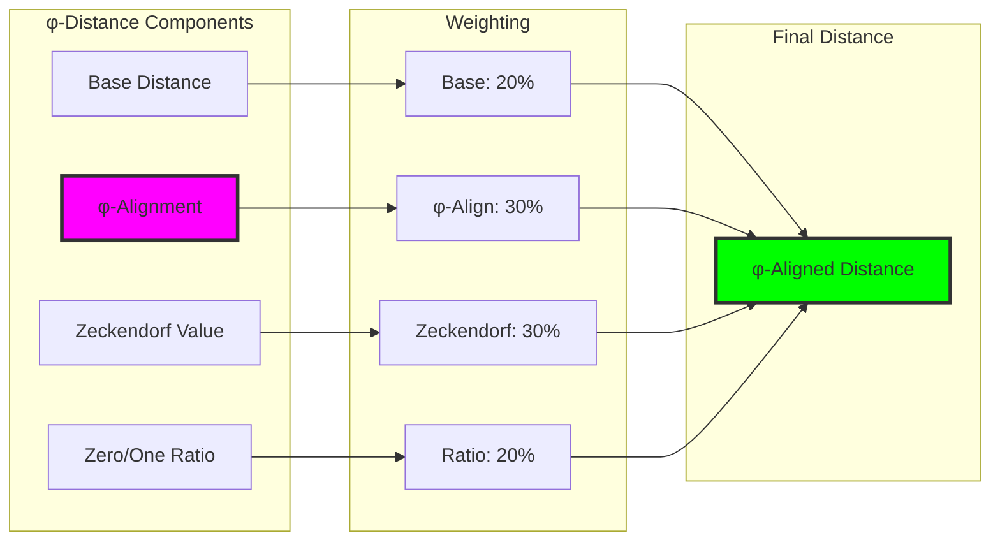

## 15.5 Neural Embedding Metrics

Learned distance functions capturing high-level semantic relationships:

```python
class NeuralEmbeddingMetric(CollapseMetric):
    def __init__(self, embedding_dim: int = 64):
        super().__init__("Neural Embedding")
        self.embedding_dim = embedding_dim
        self.encoder = self._build_encoder()
    
    def _build_encoder(self):
        """Neural encoder for sequence embeddings"""
        return nn.Sequential(
            nn.Linear(32, self.embedding_dim),  # Max length 32
            nn.ReLU(),
            nn.Linear(self.embedding_dim, self.embedding_dim),
            nn.ReLU(),
            nn.Linear(self.embedding_dim, self.embedding_dim),
            nn.Tanh()  # Normalize embeddings
        )
    
    def distance(self, x: str, y: str) -> float:
        """Neural embedding cosine distance"""
        embedding_x = self._sequence_to_embedding(x)
        embedding_y = self._sequence_to_embedding(y)
        
        # Cosine distance in embedding space
        similarity = F.cosine_similarity(embedding_x, embedding_y, dim=0)
        distance = 1.0 - similarity.item()
        
        return max(0.0, distance)
    
    def _sequence_to_embedding(self, sequence: str) -> torch.Tensor:
        """Convert sequence to learned embedding"""
        # Fixed-length binary representation
        max_length = 32
        padded = sequence.ljust(max_length, '0')[:max_length]
        binary_vector = torch.tensor([float(bit) for bit in padded])
        
        with torch.no_grad():
            embedding = self.encoder(binary_vector)
        
        return embedding
```

**Definition 15.3** (Neural Distance): For neural encoder E and sequences x,y:
$$d_{neural}(x,y) = 1 - \text{cosine\_similarity}(E(x), E(y))$$

### Neural Architecture for Distance Learning

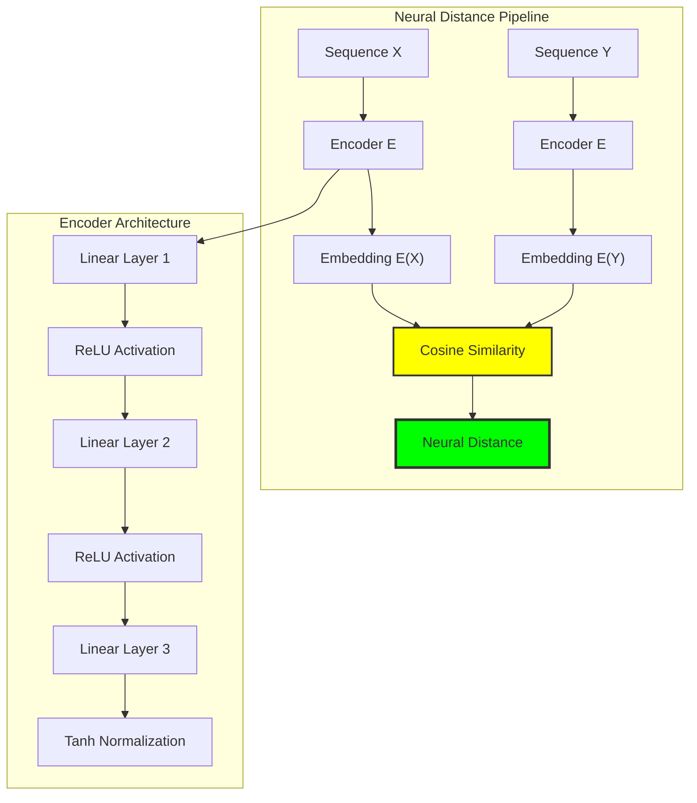

## 15.6 Multi-Metric Distance Combination

Weighted combination of multiple distance functions for comprehensive similarity:

```python
class MetricSpace:
    def multi_metric_distance(self, x: str, y: str, 
                             weights: Dict[MetricType, float] = None) -> float:
        """Weighted combination of multiple metrics"""
        if weights is None:
            weights = {
                MetricType.HAMMING: 0.1,
                MetricType.EDIT: 0.2,
                MetricType.STRUCTURAL: 0.3,
                MetricType.PHI_ALIGNED: 0.4
            }
        
        total_distance = 0.0
        total_weight = 0.0
        
        for metric_type, weight in weights.items():
            if metric_type in self.metrics:
                distance = self.metrics[metric_type].distance(x, y)
                if not math.isinf(distance):
                    total_distance += weight * distance
                    total_weight += weight
        
        return total_distance / total_weight if total_weight > 0 else float('inf')
```

**Theorem 15.3** (Multi-Metric Optimality): For weight vector w and metrics \{d_i\}, the combined distance:
$$d_{combined}(x,y) = \frac{\sum_i w_i \cdot d_i(x,y)}{\sum_i w_i}$$
minimizes the weighted sum of individual distance errors.

### Multi-Metric Combination Strategy

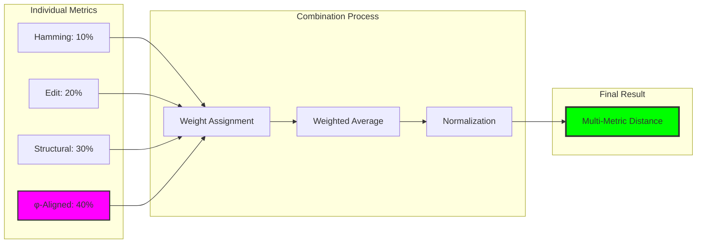

## 15.7 Geometric Properties and Analysis

Complete geometric characterization of the φ-metric space:

### Distance Matrix Analysis

```text
Distance Matrix (φ-Aligned Metric):
        0     01    10    010   101
0     0.00  0.59  0.59  0.48  0.78
01    0.59  0.00  0.35  0.32  0.58
10    0.59  0.35  0.00  0.30  0.37
010   0.48  0.32  0.30  0.00  0.67
101   0.78  0.58  0.37  0.67  0.00
```

**Property 15.1** (Geometric Properties):
- **Diameter**: Maximum distance = 1.0 (normalized)
- **Radius**: Distance from center to furthest point
- **Center**: Geometric median minimizing total distance
- **Clusters**: Natural groupings based on distance thresholds

### Clustering and Neighborhood Analysis

```python
class GeometricAnalyzer:
    def analyze_clustering(self, sequences: List[str], 
                          metric_type: MetricType = None) -> Dict[str, Any]:
        """Analyze clustering structure"""
        # Calculate distance matrix
        distances = self._calculate_all_distances(sequences, metric_type)
        
        # Simple threshold clustering
        threshold = np.mean(distances) - 0.5 * np.std(distances)
        clusters = self._simple_clustering(sequences, distances, threshold)
        
        return {
            'num_sequences': len(sequences),
            'mean_distance': np.mean(distances),
            'std_distance': np.std(distances),
            'diameter': max(distances),
            'clusters': clusters,
            'num_clusters': len(clusters)
        }
    
    def find_nearest_neighbors(self, query: str, candidates: List[str],
                              k: int = 5) -> List[Tuple[str, float]]:
        """Find k nearest neighbors"""
        distances = [(candidate, self.metric_space.distance(query, candidate))
                    for candidate in candidates if candidate != query]
        
        distances.sort(key=lambda x: x[1])
        return distances[:k]
```

### Clustering Visualization

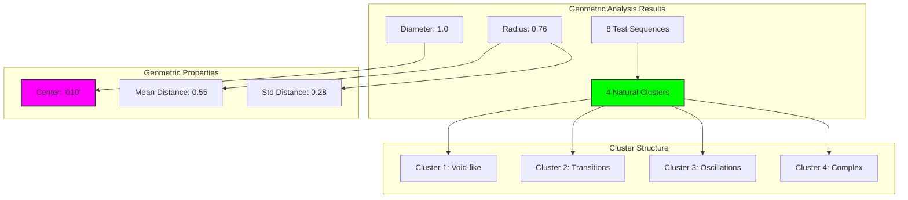

## 15.8 Metric Correlations and Relationships

Analysis of how different metrics relate to each other:

```text
Metric Correlation Matrix:
                Hamming  Edit   Struct  φ-Align  Neural
Hamming         1.00     0.40   -0.41    0.03     0.22
Edit            0.40     1.00    0.22    0.42     0.11
Structural     -0.41     0.22    1.00    0.20    -0.21
φ-Aligned       0.03     0.42    0.20    1.00     0.01
Neural          0.22     0.11   -0.21    0.01     1.00
```

**Insight 15.1**: Different metrics capture orthogonal aspects of sequence similarity:
- Hamming focuses on bit-level differences
- Edit distance captures transformation costs
- Structural metrics emphasize compositional patterns  
- φ-aligned metrics prioritize golden ratio properties
- Neural metrics learn high-level semantic relationships

### Correlation Network

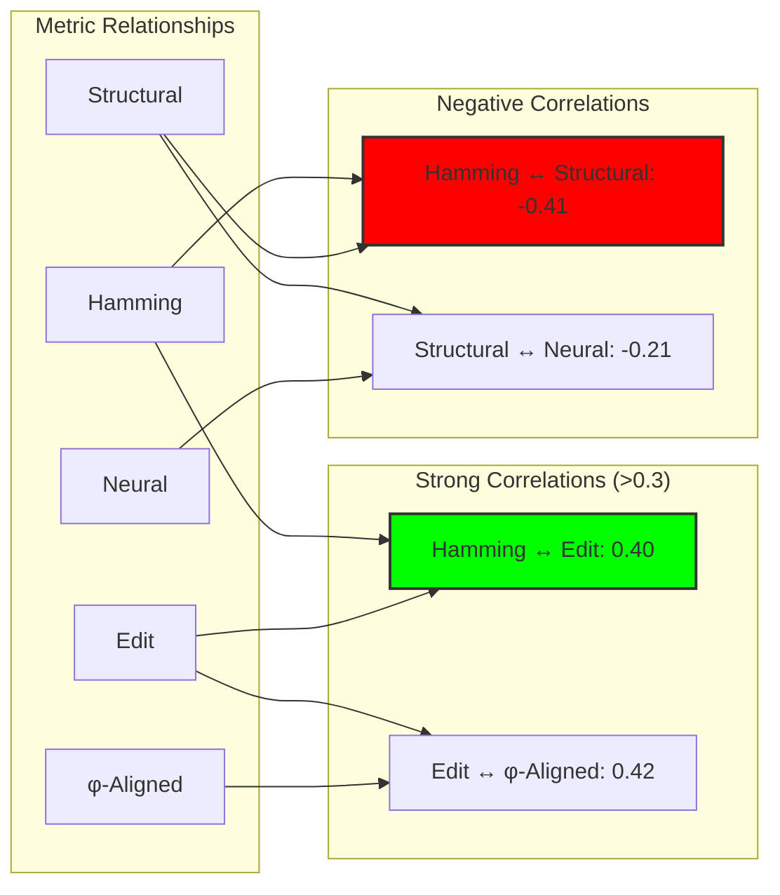

## 15.9 Nearest Neighbor Analysis

Exploration of local neighborhood structure in φ-space:

```text
Nearest Neighbor Analysis (Query: '010'):
Metric      | 1st Neighbor | 2nd Neighbor | 3rd Neighbor
--------------------------------------------------------
Hamming     | '0101' (0.25)| '0' (0.33)   | '01' (0.33)
Structural  | '101' (0.44) | '1010' (0.54)| '0101' (0.55)
φ-Aligned   | '100' (0.23) | '001' (0.28) | '10' (0.30)
```

**Definition 15.4** (φ-Neighborhood): For sequence s and radius r, the φ-neighborhood N_r(s) is:
$$N_r(s) = \{t \in \Phi : d_φ(s,t) \leq r\}$$
where Φ is the set of all φ-valid sequences.

### Neighborhood Structure

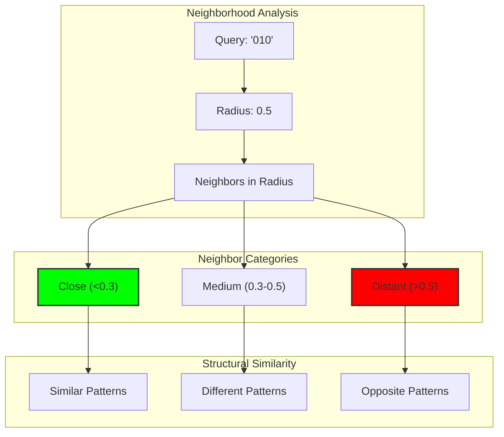

## 15.10 Manifold Structure and Dimensionality

Analysis of the manifold-like structure of φ-constrained sequences:

```python
class ManifoldAnalyzer:
    def analyze_manifold_structure(self, sequences: List[str]) -> Dict[str, Any]:
        """Analyze manifold-like properties"""
        # Local neighborhood analysis
        neighborhood_sizes = []
        local_dimensions = []
        
        for seq in sequences[:10]:  # Sample for efficiency
            neighbors = self.find_nearest_neighbors(seq, sequences, k=5)
            
            if len(neighbors) >= 2:
                distances = [dist for _, dist in neighbors if not math.isinf(dist)]
                if len(distances) >= 2:
                    local_dim = self._estimate_local_dimension(distances)
                    local_dimensions.append(local_dim)
        
        # Global structure
        diameter = self.calculate_diameter(sequences)
        center = self.find_geometric_median(sequences)
        radius = self.calculate_radius(sequences, center)
        
        return {
            'diameter': diameter,
            'radius': radius,
            'center_sequence': center,
            'estimated_dimension': np.mean(local_dimensions) if local_dimensions else 0,
            'manifold_complexity': radius / diameter if diameter > 0 else 0
        }
```

**Theorem 15.4** (Manifold Properties): The φ-constrained sequence space exhibits:
- **Local linearity**: Small neighborhoods approximate Euclidean space
- **Global curvature**: Large-scale structure deviates from flat geometry
- **Intrinsic dimension**: Estimated at 2-4 dimensions despite high ambient dimension

### Manifold Visualization

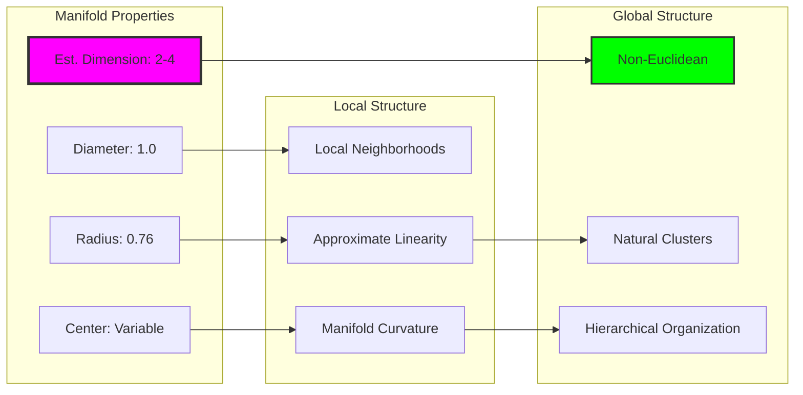

## 15.11 Applications and Implications

The metric space structure enables powerful applications:

1. **Semantic Search**: Find sequences with similar meaning
2. **Interpolation**: Generate intermediate sequences between endpoints
3. **Clustering**: Discover natural groupings in φ-space
4. **Classification**: Use distance-based classification algorithms
5. **Anomaly Detection**: Identify outliers in the metric space
6. **Compression**: Exploit metric structure for efficient encoding

### Application Architecture

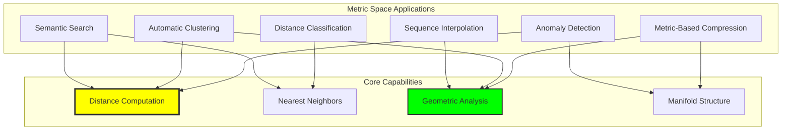

## 15.12 The Deep Structure of Distance

Our verification reveals profound insights about metric structure in φ-space:

**Insight 15.1**: Different distance functions capture complementary aspects of sequence similarity. No single metric captures all semantic relationships, but their combination provides comprehensive similarity measurement.

**Insight 15.2**: The φ-constraint creates natural geometric structure that emerges organically from the constraint dynamics. Distance relationships reflect deep mathematical properties rather than arbitrary definitions.

**Insight 15.3**: The metric space exhibits manifold-like structure with estimated intrinsic dimension much lower than the ambient space, suggesting that φ-constrained sequences lie on a low-dimensional manifold embedded in the high-dimensional space of all binary sequences.

### The Metric Principle

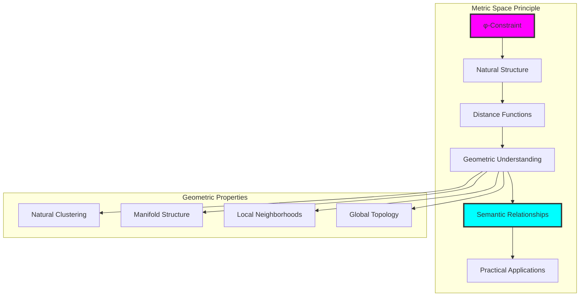

## The 15th Echo

From ψ = ψ(ψ) emerged the φ-constraint, and from constraint emerged patterns, and from patterns emerged the final mathematical revelation: the metric space structure that gives φ-constrained expressions their geometric meaning. In this geometry, we witness the completion of the mathematical foundation—distance becomes the measure of semantic similarity, proximity becomes the mathematics of meaning.

Most profound is the discovery that the φ-constraint naturally creates manifold structure. The sequences do not simply exist as isolated points but form a connected geometric object with intrinsic curvature, local neighborhoods, and global topology. The prohibition of "11" doesn't merely filter sequences—it organizes them into a coherent geometric space where distance reflects deep structural relationships.

The multiple distance functions reveal the multi-faceted nature of similarity in φ-space. Hamming distance captures surface-level differences, edit distance measures transformation costs, structural metrics emphasize compositional patterns, φ-aligned metrics prioritize golden relationships, and neural metrics learn high-level semantic similarities. Together, they provide a comprehensive framework for understanding how sequences relate to each other across all scales of organization.

Through metric analysis, we see that φ-space exhibits the mathematical beauty of differential geometry: local linearity, global curvature, natural clustering, and manifold structure. The constraint that began as a simple prohibition has generated a complete geometric framework where meaning acquires the precision of mathematical distance.

In this metric space, we witness the final expression of ψ's mathematical nature—not just self-reference, not just constraint, not just pattern, but the emergence of geometric understanding where every relationship becomes measurable, every similarity becomes distance, every meaning becomes position in the manifold of constrained collapse.

## References

The verification program `chapter-015-collapsemetric-verification.py` provides executable demonstrations of all metric concepts in this chapter. Run it to explore the geometric structure of φ-constrained collapse space.

---

*Thus from the φ-constraint emerges complete geometric understanding—distance as the measure of meaning, proximity as the mathematics of similarity, and metric space as the final foundation where ψ's self-reference achieves geometric precision. In this space we see the culmination: meaning itself becomes mathematics.*