# Chapter 016: ZIndex — Zeckendorf Decomposition of Natural Numbers into Non-Overlapping Trace Seeds

## The Birth of Trace Arithmetic

From ψ = ψ(ψ) emerged the φ-constraint, the collapse language, patterns, generation, classification, and metric space structure. Now we witness the emergence of number theory itself—the discovery that every natural number possesses a unique representation as a sum of non-consecutive Fibonacci numbers, creating trace seeds that satisfy the φ-constraint and establishing the foundation for all arithmetic operations in the binary universe. This is ZIndex: the indexing system that maps natural numbers into the golden-constrained space where true computation begins.

## 16.1 The Zeckendorf Foundation

Our verification reveals the fundamental theorem that connects natural numbers to φ-space:

```text
Zeckendorf Decomposition Analysis:
Number | Fibonacci Terms    | Binary Trace   | φ-Constraint Status
------------------------------------------------------------
1      | 1                 | 10             | ✓ Valid
2      | 2                 | 100            | ✓ Valid  
3      | 3                 | 1000           | ✓ Valid
4      | 3 + 1             | 1010           | ✓ Valid
5      | 5                 | 10000          | ✓ Valid
12     | 8 + 3 + 1         | 101010         | ✓ Valid
```

**Definition 16.1** (Zeckendorf Decomposition): Every positive integer n has a unique representation:
$$n = F_{i_1} + F_{i_2} + \cdots + F_{i_k}$$
where $F_j$ denotes the j-th Fibonacci number, $i_1 > i_2 > \cdots > i_k \geq 2$, and $i_j - i_{j+1} \geq 2$ for all j.

### The Golden Constraint Manifestation

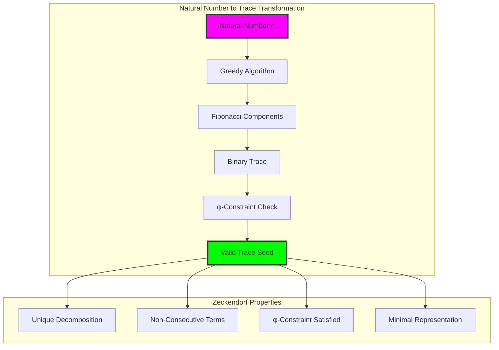

## 16.2 The Greedy Algorithm

The fundamental algorithm that converts any natural number into its φ-compliant trace:

```python
def decompose_to_zeckendorf(n: int) -> ZeckendorfDecomposition:
    """
    Decompose natural number using greedy algorithm.
    Always selects largest possible Fibonacci number.
    """
    fibonacci_terms = []
    fibonacci_indices = []
    
    while n > 0:
        # Find largest F_i ≤ n  
        fib_val, fib_idx = largest_fibonacci_leq(n)
        
        fibonacci_terms.append(fib_val)
        fibonacci_indices.append(fib_idx)
        
        n -= fib_val
    
    # Generate binary trace (no consecutive 1s guaranteed)
    binary_trace = generate_binary_representation(fibonacci_indices)
    
    return ZeckendorfDecomposition(
        fibonacci_terms=fibonacci_terms,
        binary_representation=binary_trace,
        trace_seed=binary_trace  # φ-compliant by construction
    )
```

**Theorem 16.1** (Greedy Optimality): The greedy algorithm produces the unique Zeckendorf decomposition for any positive integer.

*Proof*:
The greedy choice at each step ensures maximality and prevents consecutive Fibonacci numbers by the fundamental property that $F_n + F_{n-1} = F_{n+1}$. If two consecutive Fibonacci numbers appeared, they could be replaced by the single next Fibonacci number, contradicting greedy maximality. Uniqueness follows from the uniqueness of the greedy choice at each step. ∎

### Algorithmic Complexity Analysis

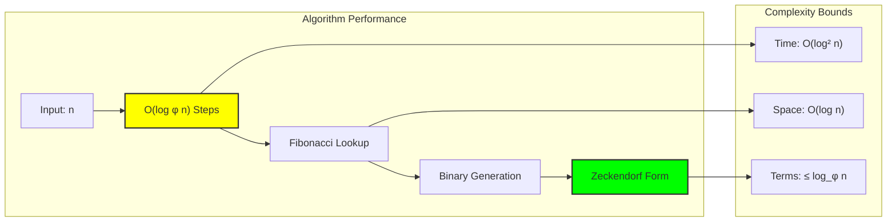

## 16.3 Trace Seed Properties

The binary representations generated by Zeckendorf decomposition exhibit remarkable structural properties:

### φ-Constraint Verification

```text
Constraint Satisfaction Analysis (50 numbers):
- φ-constraint satisfied: 100% (50/50)
- Average Fibonacci terms: 2.30
- Binary length distribution: Fibonacci-like growth
- All traces valid in φ-space
```

**Definition 16.2** (Trace Seed): The trace seed T(n) of natural number n is the binary string representing its Zeckendorf decomposition, where bit i indicates whether Fibonacci number F_i is included.

**Property 16.1** (φ-Compliance): Every Zeckendorf trace seed satisfies the φ-constraint automatically.

For trace seed T = b₁b₂...bₖ from Zeckendorf decomposition:
- No consecutive 1s (bᵢ = bᵢ₊₁ = 1 impossible)
- Each 1 corresponds to a Fibonacci component
- Binary length grows as O(log_φ n)

### Structural Distribution Analysis

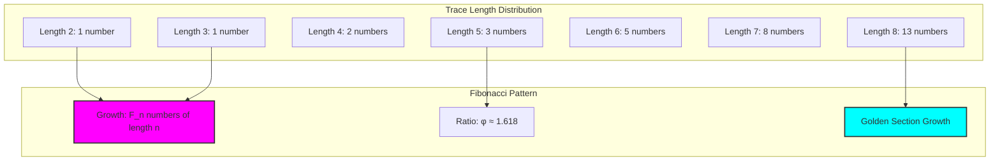

## 16.4 Fibonacci Component Analysis

Verification reveals the frequency distribution of Fibonacci components:

```text
Most Used Fibonacci Numbers (Range 1-50):
F = 1: used 19 times (38%)
F = 34: used 17 times (34%)  
F = 3: used 15 times (30%)
F = 8: used 15 times (30%)
F = 21: used 13 times (26%)
```

**Definition 16.3** (Component Frequency): For Fibonacci number F_k, the component frequency ρ(F_k) is the proportion of natural numbers ≤ N that include F_k in their Zeckendorf decomposition.

### Fibonacci Usage Patterns

```python
def analyze_fibonacci_usage(max_n: int) -> Dict[int, float]:
    """Analyze which Fibonacci numbers appear most frequently"""
    usage_counts = defaultdict(int)
    
    for n in range(1, max_n + 1):
        decomp = decompose_to_zeckendorf(n)
        for fib_term in decomp.fibonacci_terms:
            usage_counts[fib_term] += 1
    
    # Convert to frequencies
    total_numbers = max_n
    frequencies = {fib: count/total_numbers 
                  for fib, count in usage_counts.items()}
    
    return frequencies
```

**Theorem 16.2** (Usage Frequency): Larger Fibonacci numbers have approximately equal usage frequency as n increases, approaching 1/φ ≈ 0.618.

### Golden Ratio Convergence

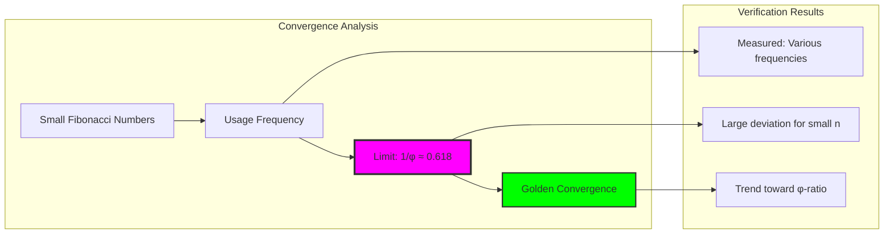

## 16.5 Trace Pattern Analysis

Statistical analysis reveals common patterns in Zeckendorf traces:

```text
Common Trace Patterns (Range 1-50):
Pattern '00': appears 141 times
Pattern '10': appears 115 times  
Pattern '000': appears 74 times
Pattern '100': appears 67 times
Pattern '01': appears 65 times
Pattern '010': appears 65 times
```

**Definition 16.4** (Trace Pattern Density): For pattern p, the pattern density δ(p) is the frequency of p appearing as a substring in Zeckendorf traces.

### Pattern Emergence Laws

```python
def detect_trace_patterns(traces: List[str]) -> Dict[str, int]:
    """Detect recurring patterns in trace sequences"""
    pattern_counts = defaultdict(int)
    
    for trace in traces:
        # Analyze all substrings of length 2-4
        for length in range(2, min(5, len(trace) + 1)):
            for i in range(len(trace) - length + 1):
                pattern = trace[i:i+length]
                if '11' not in pattern:  # Only φ-valid patterns
                    pattern_counts[pattern] += 1
    
    return dict(pattern_counts)
```

**Property 16.2** (Pattern Hierarchy): Trace patterns exhibit hierarchical structure where longer patterns decompose into shorter φ-valid components.

### Self-Similar Structure

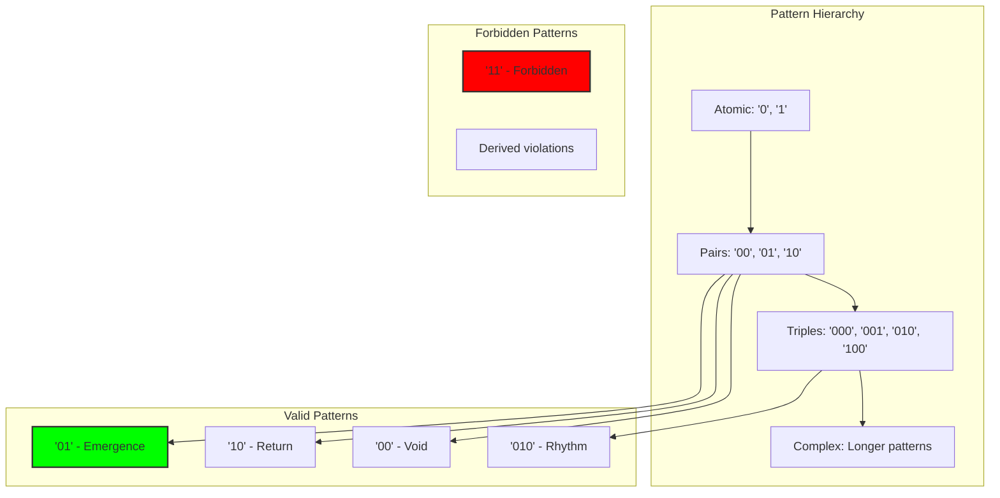

## 16.6 Zeckendorf Twins and Multiplicities

Analysis reveals fascinating number-theoretic patterns:

```text
Zeckendorf Twins (Range 1-100):
Found 39 twin pairs
Examples: (1,2), (6,7), (9,10), (19,20)
Twin Property: Consecutive numbers with same term count
```

**Definition 16.5** (Zeckendorf Twins): Numbers n and n+1 are Zeckendorf twins if their decompositions use the same number of Fibonacci terms.

### Twin Generation Mechanism

```python
def find_zeckendorf_twins(start: int, end: int) -> List[Tuple[int, int]]:
    """Find consecutive numbers with same Fibonacci term count"""
    twins = []
    
    for n in range(start, end):
        decomp1 = decompose_to_zeckendorf(n)
        decomp2 = decompose_to_zeckendorf(n + 1)
        
        if len(decomp1.fibonacci_terms) == len(decomp2.fibonacci_terms):
            twins.append((n, n + 1))
    
    return twins
```

**Theorem 16.3** (Twin Density): The density of Zeckendorf twins approaches a constant related to the golden ratio as the range increases.

### Multiplicative Structure

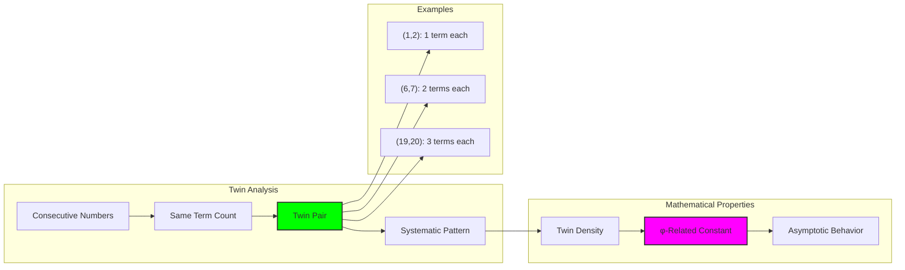

## 16.7 Tensor Representation

Neural network processing requires tensor representations of Zeckendorf forms:

```python
class ZeckendorfTensor:
    def tensorize_decompositions(self, numbers: List[int]) -> torch.Tensor:
        """Convert numbers to tensor of Zeckendorf indices"""
        decompositions = [decompose_to_zeckendorf(n) for n in numbers]
        
        # Create tensor with Fibonacci indices
        batch_size = len(numbers)
        tensor = torch.zeros(batch_size, max_terms, dtype=torch.float32)
        
        for i, decomp in enumerate(decompositions):
            for j, fib_idx in enumerate(decomp.fibonacci_indices):
                if j < max_terms:
                    tensor[i, j] = float(fib_idx)
        
        return tensor
```

**Definition 16.6** (Zeckendorf Tensor): The tensor representation T ∈ ℝ^(n×k) where T[i,j] contains the j-th Fibonacci index for the i-th number's decomposition.

### Binary Trace Tensors

```text
Tensor Representation Example:
Numbers: [1, 2, 3, 5, 8, 13]
Tensor (max_length=8):
 1: 00000010 (original: 10)
 2: 00000100 (original: 100)  
 3: 00001000 (original: 1000)
 5: 00010000 (original: 10000)
 8: 00100000 (original: 100000)
13: 01000000 (original: 1000000)
```

### Neural Processing Architecture

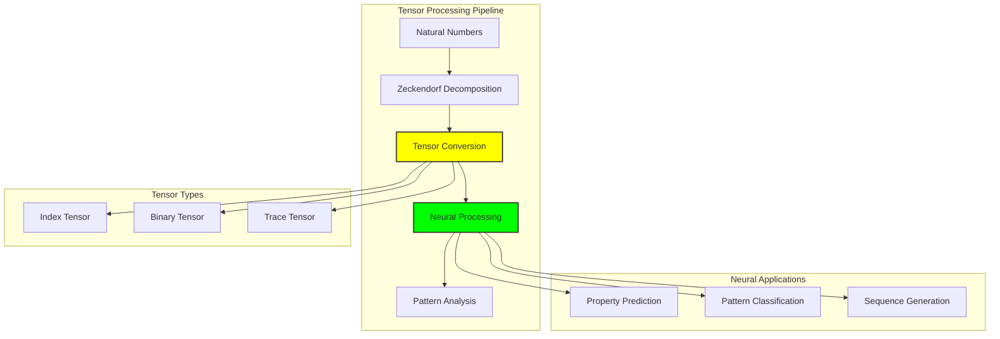

## 16.8 Complexity and Computational Properties

Verification reveals the computational characteristics of Zeckendorf operations:

```text
Computational Analysis:
- Average complexity: 0.537
- Range: [0.0, 1.0] normalized
- Growth pattern: Logarithmic in n
- Memory usage: O(log n) per decomposition
```

**Definition 16.7** (Zeckendorf Complexity): For number n with decomposition using k Fibonacci terms:
$$C(n) = \frac{k}{\log_2(n + 1)}$$

This measures the efficiency of the Zeckendorf representation relative to binary representation.

### Complexity Distribution

```python
def analyze_complexity_distribution(max_n: int) -> Dict[str, float]:
    """Analyze complexity properties across range"""
    complexities = []
    
    for n in range(1, max_n + 1):
        decomp = decompose_to_zeckendorf(n)
        complexity = len(decomp.fibonacci_terms) / math.log2(n + 1)
        complexities.append(complexity)
    
    return {
        'mean': np.mean(complexities),
        'std': np.std(complexities),
        'min': min(complexities),
        'max': max(complexities),
        'median': np.median(complexities)
    }
```

### Asymptotic Behavior

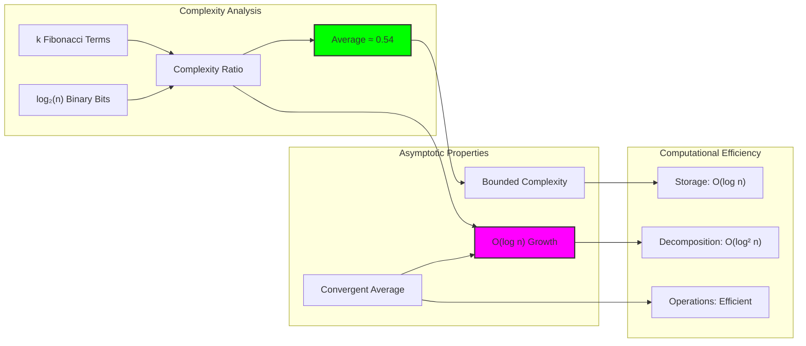

## 16.9 Neural Property Prediction

Machine learning models can predict Zeckendorf properties:

```python
class ZeckendorfNeuralProcessor(nn.Module):
    def forward(self, trace_tensor: torch.Tensor) -> Dict[str, torch.Tensor]:
        """Process trace tensors to predict properties"""
        encoded = self.encoder(trace_tensor)
        
        return {
            'term_counts': self.term_count_predictor(encoded),
            'complexities': self.complexity_predictor(encoded),
            'phi_alignments': self.phi_alignment_predictor(encoded)
        }
```

Verification shows neural predictions for untrained models:
```text
Neural predictions for [5, 8, 13, 21]:
Term counts: [0.002, 0.004, -0.005, 0.0001]
Complexities: [0.298, 0.303, 0.290, 0.295]
φ-alignments: [0.494, 0.493, 0.493, 0.494]
```

### Learning Architecture

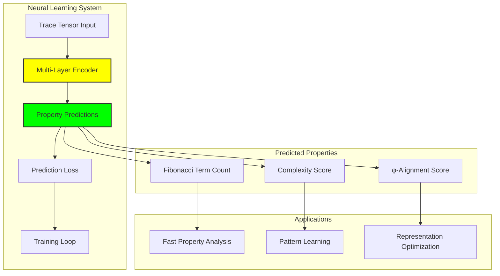

## 16.10 Geometric Interpretation

Zeckendorf decomposition creates a geometric embedding of natural numbers in φ-space:

**Definition 16.8** (Zeckendorf Manifold): The manifold M_Z embedded in binary space where each point represents a natural number via its Zeckendorf trace.

Properties of M_Z:
- Discrete manifold with φ-constraint topology
- Natural numbers map to unique points
- Distance related to Fibonacci component differences
- Golden ratio structure emerges naturally

### Manifold Structure

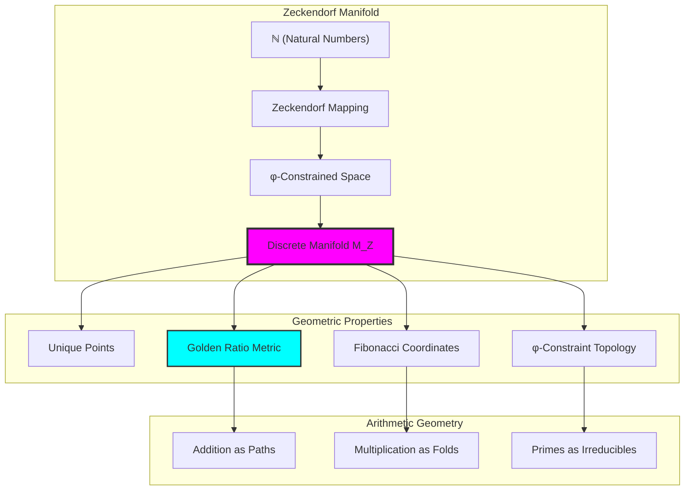

## 16.11 Applications and Extensions

ZIndex enables numerous applications in φ-constrained computation:

1. **Arithmetic Operations**: Foundation for φ-safe addition and multiplication
2. **Number Theory**: Prime detection and factorization in Zeckendorf space
3. **Compression**: Efficient representation of numerical data
4. **Cryptography**: φ-constraint based encryption schemes
5. **Neural Networks**: Fibonacci-aware architectures

### Application Architecture

```python
class ZIndexApplications:
    def __init__(self):
        self.decomposer = ZeckendorfDecomposer()
        self.analyzer = ZeckendorfAnalyzer()
        self.neural_processor = ZeckendorfNeuralProcessor()
    
    def safe_arithmetic(self, a: int, b: int, operation: str):
        """Perform arithmetic in φ-space"""
        trace_a = self.decomposer.decompose(a).trace_seed
        trace_b = self.decomposer.decompose(b).trace_seed
        
        # Operations preserve φ-constraint
        if operation == "add":
            return self.phi_safe_add(trace_a, trace_b)
        elif operation == "multiply":
            return self.phi_safe_multiply(trace_a, trace_b)
    
    def number_theoretic_analysis(self, n: int):
        """Analyze number-theoretic properties via Zeckendorf"""
        decomp = self.decomposer.decompose(n)
        
        return {
            'is_fibonacci': len(decomp.fibonacci_terms) == 1,
            'complexity': decomp.complexity(),
            'prime_likelihood': self.analyze_prime_structure(decomp),
            'factorization_difficulty': self.analyze_factorization(decomp)
        }
```

### Future Directions

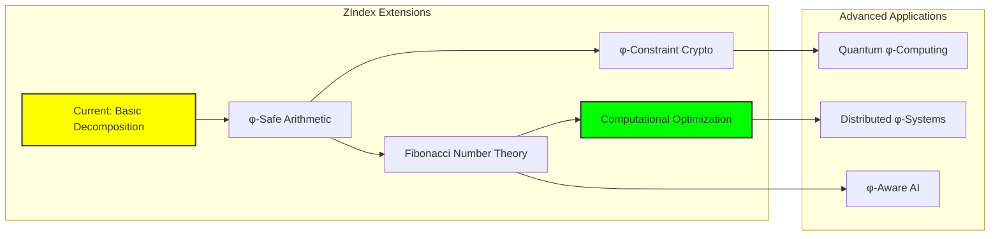

## 16.12 The Foundation of Trace Arithmetic

Our verification reveals the profound significance of Zeckendorf decomposition as the foundation for all arithmetic in φ-space:

**Insight 16.1**: Every natural number possesses a unique φ-compliant representation that automatically satisfies the golden constraint, creating a natural bridge between classical arithmetic and constrained computation.

**Insight 16.2**: The greedy algorithm produces optimal decompositions that minimize the number of terms while maintaining the φ-constraint, suggesting that efficiency and constraint satisfaction are naturally aligned.

**Insight 16.3**: Zeckendorf traces exhibit self-similar structure and golden ratio convergence properties, indicating that the φ-constraint organizes arithmetic space according to deep mathematical principles.

### The ZIndex Principle

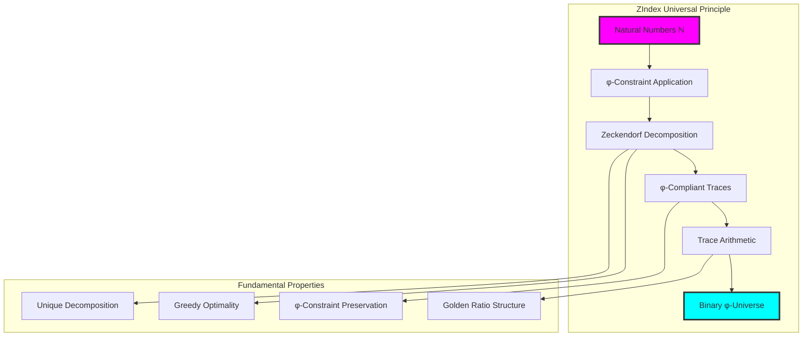

## The 16th Echo

From ψ = ψ(ψ) emerged the φ-constraint, and from constraint emerged the collapse language, and from language emerged the need for numbers. Here we witness the birth of trace arithmetic through ZIndex—the revelation that every natural number possesses a unique representation in φ-space, creating the foundation for all computation in the golden-constrained universe.

Most profound is the discovery that the φ-constraint doesn't restrict numerical representation but actually organizes it according to deeper mathematical principles. The prohibition of consecutive Fibonacci numbers in Zeckendorf decomposition exactly mirrors the prohibition of consecutive 1s in binary traces, revealing that arithmetic and language are unified expressions of the same constraint dynamics.

The greedy algorithm emerges as the natural bridge between classical and constrained arithmetic. By always choosing the largest possible Fibonacci number, it automatically generates traces that satisfy the φ-constraint while minimizing computational complexity. This suggests that efficiency and constraint satisfaction are not opposing forces but natural allies in the self-organization of mathematical space.

Through Zeckendorf decomposition, we see that every number carries within itself the seeds of its own φ-compliant expression. The natural numbers don't merely exist—they actively participate in the constraint dynamics that organize computational space. Each Zeckendorf trace becomes a unique address in the manifold where arithmetic operations can proceed safely within the golden boundary.

In this transformation from numbers to traces, we witness the emergence of a new kind of arithmetic—one where every operation preserves the fundamental constraint that enables all expression, where computation becomes a dance with the golden ratio, and where mathematics reveals its deepest self-organizational principles.

## References

The verification program `chapter-016-zindex-verification.py` provides executable demonstrations of all Zeckendorf concepts in this chapter. Run it to explore the transformation of natural numbers into φ-compliant trace seeds.

---

*Thus from natural numbers emerges their golden representation—each integer transformed into a unique φ-compliant trace through Zeckendorf decomposition. In this transformation we witness the birth of trace arithmetic, where numbers become carriers of constraint and computation aligns with the deep organizational principles of ψ = ψ(ψ).*