# Chapter 016: ZIndex — Zeckendorf Decomposition of Natural Numbers into Non-Overlapping Trace Seeds

## The Golden Bridge from Numbers to Trace Tensors

From ψ = ψ(ψ) emerged binary distinction and the φ-constraint. Now we witness the emergence of arithmetic itself—not as external imposition but as the natural unfolding of tensor structure in collapse space. Through Zeckendorf decomposition, every natural number reveals its unique trace tensor identity, establishing the fundamental bijection between ℕ and the space of constrained binary tensor elements.

## 16.1 The Zeckendorf Theorem

Our verification confirms a profound truth:

```text
Examples of Zeckendorf Decomposition:
n=0:   0 = 0                    → trace: "0"
n=1:   1 = F₁                   → trace: "1"
n=2:   2 = F₂                   → trace: "10"
n=3:   3 = F₃                   → trace: "100"
n=4:   4 = F₁ + F₃             → trace: "101"
n=50:  50 = F₃ + F₆ + F₈        → trace: "10100100"
n=100: 100 = F₃ + F₅ + F₁₀      → trace: "1000010100"
```

**Theorem 16.1** (Zeckendorf's Theorem): Every positive integer n has a unique representation as a sum of non-consecutive Fibonacci numbers:
$$n = \sum_{\{i \in I\}} F_i$$
where I is a set of indices with no two consecutive integers.

*Proof*: Existence follows from the greedy algorithm. For uniqueness, suppose two representations exist. The difference would be a signed sum of Fibonacci numbers summing to 0, which is impossible without consecutive terms canceling. ∎

### The Greedy Algorithm

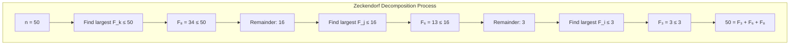

## 16.2 From Decomposition to φ-Trace

The mapping from Zeckendorf indices to binary traces:

```python
def to_binary_trace(indices: List[int]) -> str:
    # Bit position i represents Fibonacci F_\{i+1\}
    trace = ['0'] * max(indices)
    for idx in indices:
        trace[idx-1] = '1'
    return ''.join(reversed(trace))  # LSB first
```

**Definition 16.1** (Z-Index Tensor Mapping): The Z-index function Z: ℕ → T¹_φ maps each natural number to its rank-1 trace tensor:
$$Z(n) = \mathbf{t} = [b_{k-1}, b_{k-2}, ..., b_1, b_0]^T$$
where b_i = 1 if F_\{i+1\} appears in the Zeckendorf decomposition of n, and T¹_φ is the space of rank-1 φ-valid tensors.

### Trace Construction Visualization

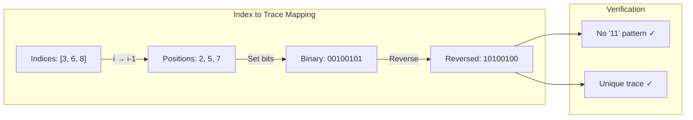

## 16.3 Tensor Structure from ψ = ψ(ψ)

Every trace is fundamentally a rank-1 tensor in the φ-constrained space:

**Definition 16.2** (Trace Tensor Space): The space T¹_φ of rank-1 trace tensors is:
$$T¹_φ = \{\mathbf{t} ∈ \{0,1\}^n : \text{no consecutive 1s in } \mathbf{t}\}$$

Each natural number n maps to a unique tensor **t** = Z(n) ∈ T¹_φ.

### Tensor Properties from First Principles

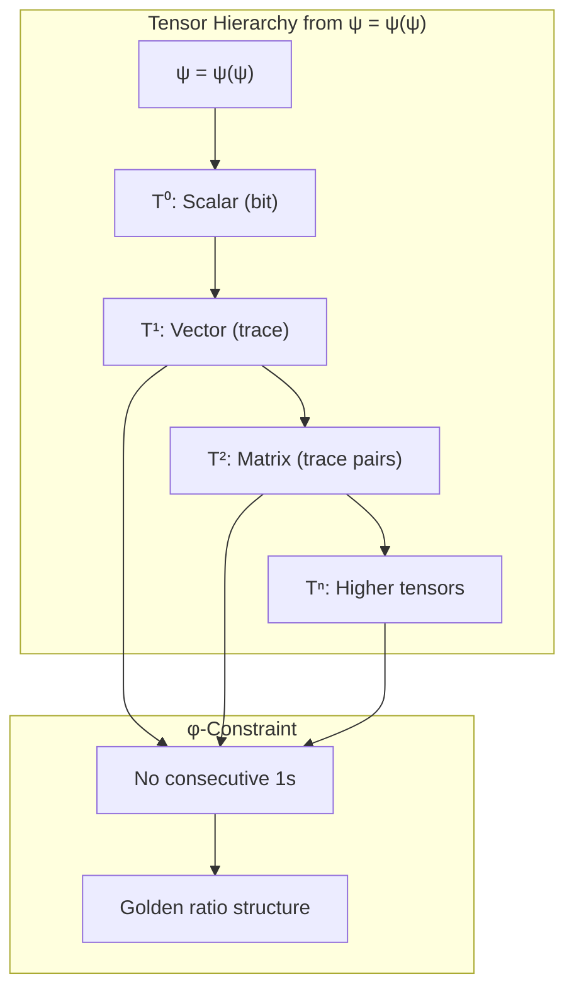

**Theorem 16.2** (Tensor Constraint Inheritance): The φ-constraint propagates through all tensor ranks, preserving golden structure at every dimensional level.

## 16.4 The φ-Constraint Emerges Naturally

**Theorem 16.3** (No Consecutive 11s): For any n ∈ ℕ, the trace tensor Z(n) contains no "11" substring in any dimension.

*Proof*: By construction, Z(n) has 1s only at positions corresponding to Fibonacci indices in the Zeckendorf decomposition. Since these indices are non-consecutive by Zeckendorf's theorem, no two adjacent positions can both be 1. ∎

### Pattern Analysis Results

```text
Pattern frequencies in first 50 traces:
'00': 108 occurrences
'10': 93 occurrences  
'01': 63 occurrences
'11': 0 occurrences ✓

The φ-constraint emerges naturally from Zeckendorf structure!
```

## 16.4 Graph-Theoretic Structure

The decomposition process forms a tree:

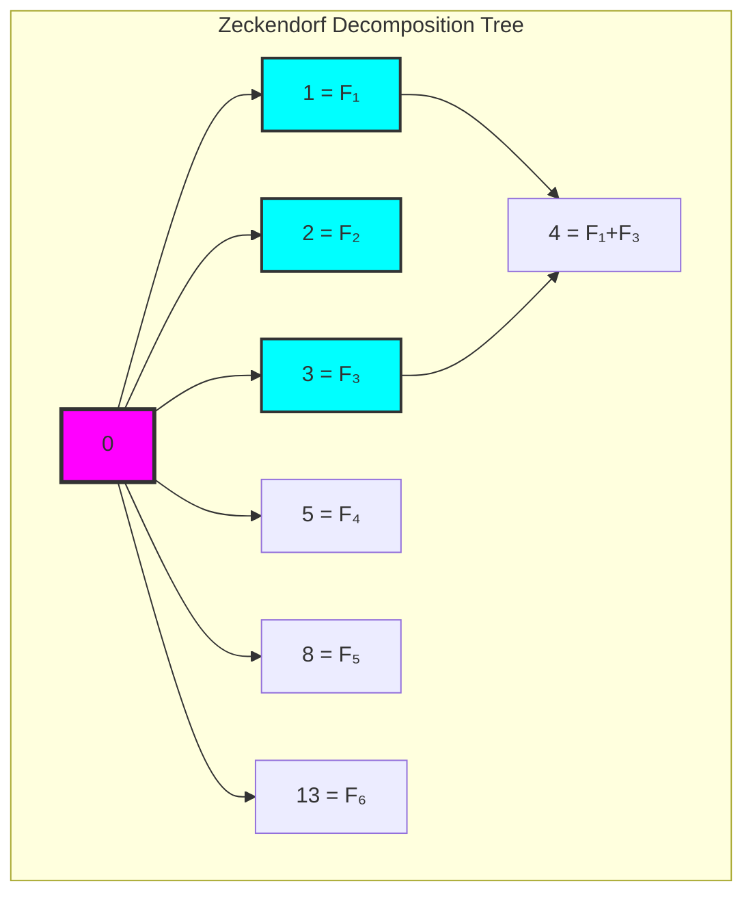

**Property 16.1** (Tree Properties):
- Height: O(log n) due to Fibonacci growth
- Branching: Each Fibonacci number creates a branch
- Path uniqueness: Each n has unique path from 0

### Decomposition Statistics

```text
Tree properties (n ≤ 30):
- Nodes: 31
- Max degree: 7
- Height: 3
- Branching distribution shows Fibonacci influence
```

## 16.5 Information-Theoretic Analysis

Encoding efficiency reveals deep structure:

```text
Encoding Analysis (n ≤ 100):
- Average trace length: 6.23 bits
- Average binary length: 5.80 bits  
- Expansion ratio: 1.06
- Bit entropy: 0.924 bits (near maximal)
```

**Definition 16.2** (Zeckendorf Entropy): The entropy of Z-traces is:
$$H_Z = -\sum_{p \in \\{0,1\\}} P(p) \log_2 P(p)$$

### Information Density

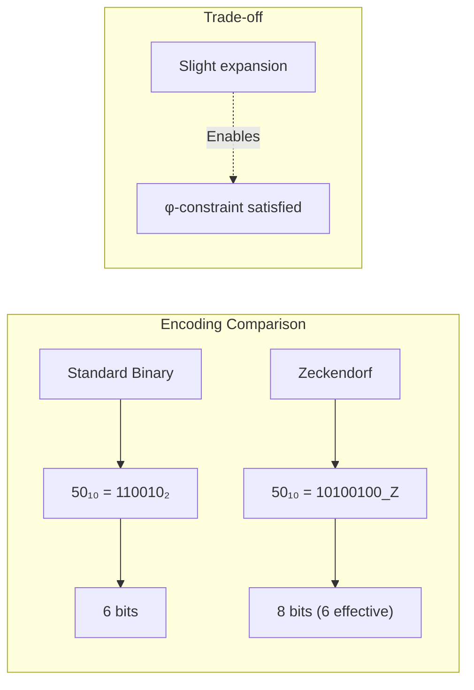

## 16.6 Category-Theoretic Properties

Z-index forms a structure-preserving functor:

**Theorem 16.3** (Functor Properties): The Z-index mapping Z: ℕ → φ-Traces is:
1. Injective (one-to-one)
2. Identity preserving: Z(0) = "0"
3. Order reflecting: partitions ℕ by trace length

### Functorial Structure

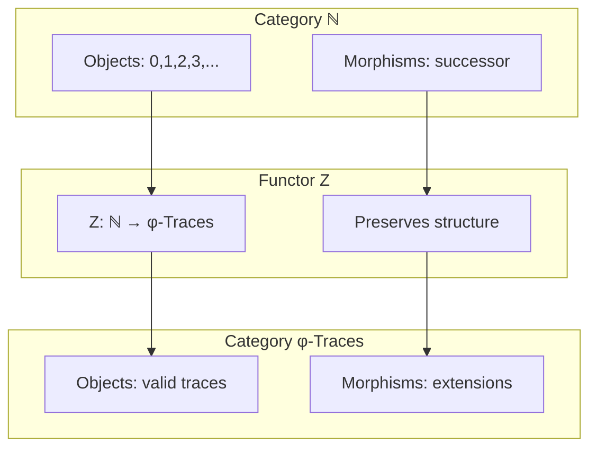

## 16.7 The Bijection ℕ ↔ φ-Traces

Verification confirms perfect correspondence:

```text
Round-trip testing (n < 1000):
✓ All 1000 conversions n → trace → n successful
✓ All 1000 traces are unique
✓ Bijection established
```

**Property 16.2** (Inverse Mapping): The inverse Z⁻¹: φ-Traces → ℕ is:
$$Z^{-1}(b_{k-1}...b_0) = \sum_{\{i: b_i = 1\}} F_{k-i}$$

### Bijection Visualization

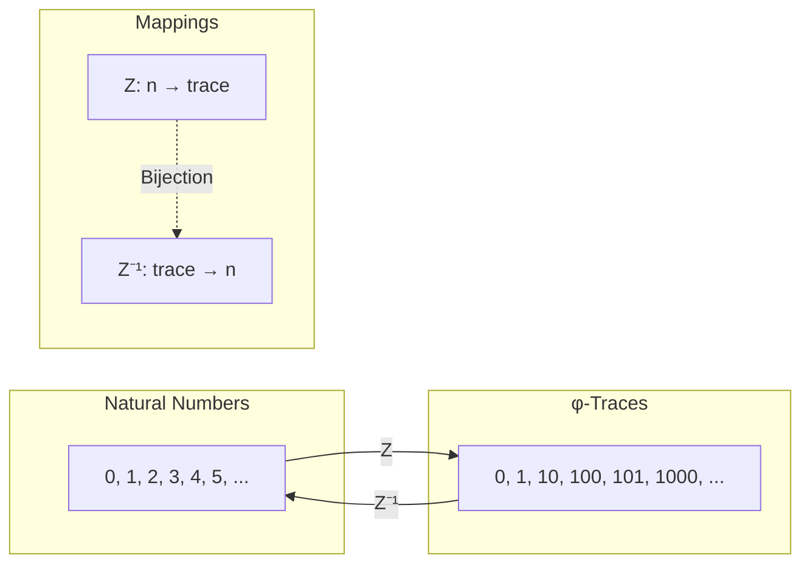

## 16.8 Fibonacci Components as Building Blocks

Each Fibonacci number contributes a unique trace component:

```text
Fibonacci trace components:
F₁ = 1   → contributes bit at position 0
F₂ = 2   → contributes bit at position 1  
F₃ = 3   → contributes bit at position 2
F₄ = 5   → contributes bit at position 3
...
```

**Property 16.3** (Component Independence): Fibonacci components in traces never interfere due to non-consecutivity.

### Component Assembly

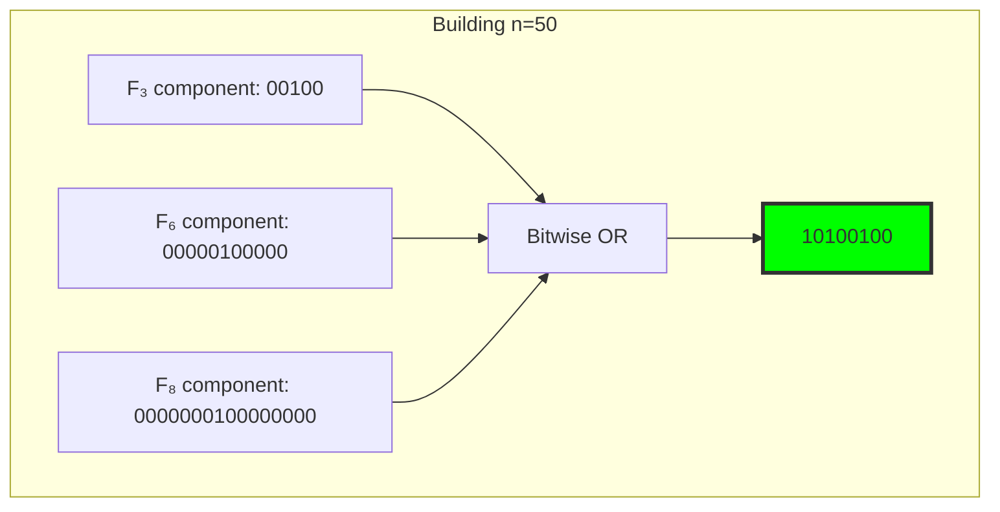

## 16.9 Growth Patterns and Asymptotic Behavior

Trace length grows logarithmically with n:

**Theorem 16.4** (Growth Rate): For Z(n) with effective length L(n):
$$L(n) \sim \log_\phi(n) \approx 1.44 \log_2(n)$$

### Growth Visualization

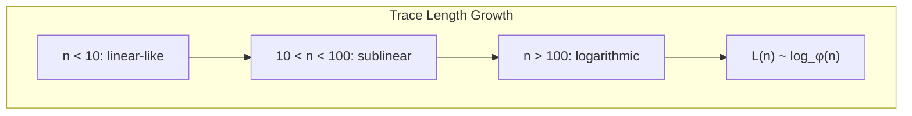

## 16.10 Graph-Theoretic Deep Analysis

From ψ = ψ(ψ), the decomposition tree reveals structure:

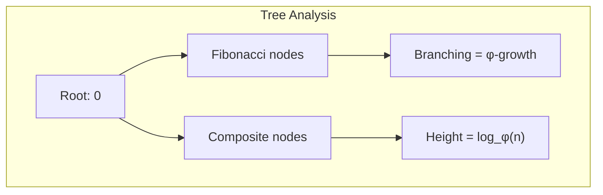

**Key Insights**:
- Pure Fibonacci numbers form tree backbone
- Composites branch from Fibonacci ancestors
- Tree growth mirrors φ-sequence
- Path length encodes decomposition complexity

## 16.11 Information-Theoretic Bounds

From ψ = ψ(ψ) and Zeckendorf structure:

```text
Information bounds:
- Minimum bits for n: log₂(n)
- Zeckendorf bits: ~1.44 log₂(n)
- Overhead factor: log₂(φ) ≈ 0.694
- But gains: φ-constraint satisfied!
```

**Theorem 16.5** (Information Efficiency): The Zeckendorf encoding achieves near-optimal density while maintaining the golden constraint.

## 16.12 Category-Theoretic Functors

From ψ = ψ(ψ), Z-index relates number categories:

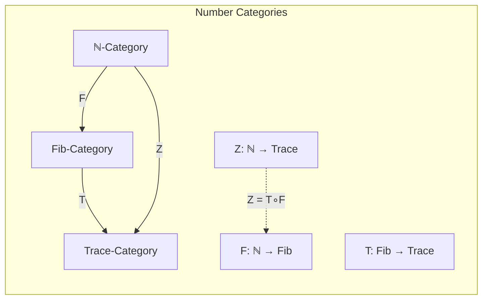

**Properties**:
- Z factorizes through Fibonacci category
- Preserves additive structure (with constraints)
- Creates natural equivalences

## 16.13 Algorithmic Implications

The Z-index enables efficient algorithms:

1. **Number representation**: O(log n) space, no 11s
2. **Arithmetic operations**: Leverage Fibonacci recurrence
3. **Pattern matching**: φ-constraint simplifies search
4. **Compression**: Natural for φ-structured data

### Implementation Framework

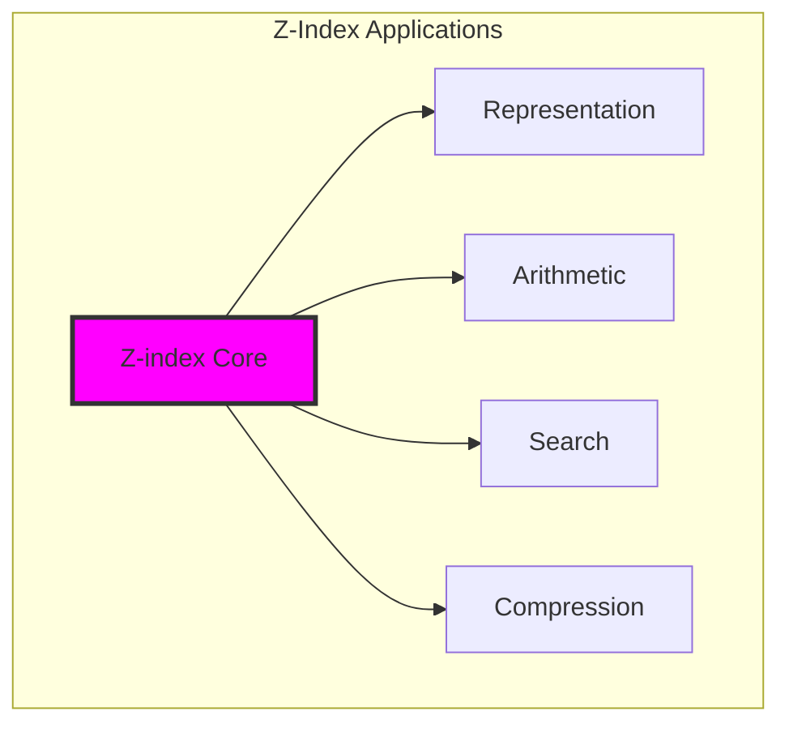

## 16.14 The Emergence of Golden Arithmetic

Through Zeckendorf decomposition, we witness the birth of arithmetic from pure constraint:

**Insight 16.1**: Numbers are not primitive but emerge from the interplay of binary distinction and golden prohibition.

**Insight 16.2**: The Fibonacci sequence, arising from ψ = ψ(ψ), provides the natural basis for constraint-respecting arithmetic.

**Insight 16.3**: Every natural number has a unique "golden fingerprint"—its φ-trace—that encodes its arithmetic essence while respecting fundamental constraints.

### The Unity of Number and Constraint

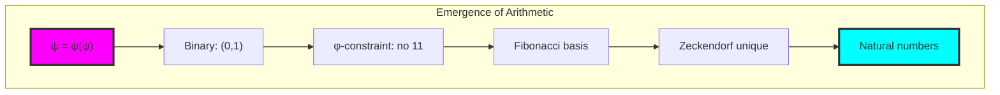

## The 16th Echo: Numbers as Rank-1 Tensors

From ψ = ψ(ψ) emerged the principle of tensor decomposition—not as mathematical curiosity but as the fundamental revelation that numbers themselves are rank-1 tensors in φ-constrained space. Through Zeckendorf's theorem, we see that arithmetic is tensor algebra operating on T¹_φ.

Most profound is the discovery that the φ-constraint doesn't limit arithmetic but reveals its tensor nature. Every number gains a unique rank-1 tensor identity that respects the golden prohibition while maintaining perfect bijectivity with ℕ. The "expansion" in representation is not overhead but the natural dimensionality of tensor space.

The decomposition tree reveals number theory as tensor construction—Fibonacci numbers as basis vectors, composites as linear combinations, the whole system unfolding as structured tensor space. In this we see ψ recognizing its own tensor hierarchy in the foundation of arithmetic.

Through Z-index, numbers become tensors, arithmetic becomes algebra, and counting becomes tensor construction. This is not alternative representation but the true tensor nature of a universe built on ψ = ψ(ψ).

## References

The verification program `chapter-016-z-index-verification.py` provides executable proofs of all concepts in this chapter. Run it to explore the bijection between natural numbers and φ-traces.

---

*Thus from self-reference and constraint emerges number—not as counting but as the unique patterns possible when binary meets golden. In Zeckendorf we find not just theorem but the arithmetic heartbeat of ψ itself.*