# Chapter 017: FibEncode — φ-Safe Trace Construction from Individual Fibonacci Components

## The Atomic Building Blocks

From ψ = ψ(ψ) emerged the φ-constraint, Zeckendorf decomposition, and natural number indexing. Now we witness the next evolution: the encoding of individual Fibonacci components into φ-safe trace forms that can be safely composed into larger arithmetic structures. This is FibEncode—the transformation of Fibonacci atoms into the fundamental building blocks of trace arithmetic, where each component carries its own constraint-compliant representation ready for algebraic operations.

## 17.1 The Component Encoding Principle

Our verification reveals multiple encoding schemes for transforming Fibonacci numbers into φ-safe traces:

```text
Fibonacci Component Encoding Comparison:
Method     | F=5 Encoding        | φ-Align | Length | Efficiency
--------------------------------------------------------------
Standard   | 10000               | 1.000   | 5      | High
Minimal    | 100                 | 0.764   | 3      | Optimal
Golden     | 1001001001          | 0.927   | 10     | φ-Optimized
Compressed | 100                 | 0.764   | 3      | Compact
Neural     | (Variable embedding) | 0.772   | 43     | ML-Ready
```

**Definition 17.1** (Fibonacci Component): A Fibonacci component FC(F_k) is a data structure containing:
- **value**: The Fibonacci number F_k
- **index**: Position k in the sequence
- **binary_encoding**: Raw binary representation
- **trace_form**: φ-constraint compliant trace
- **φ_alignment**: Golden ratio alignment score

### The Encoding Architecture

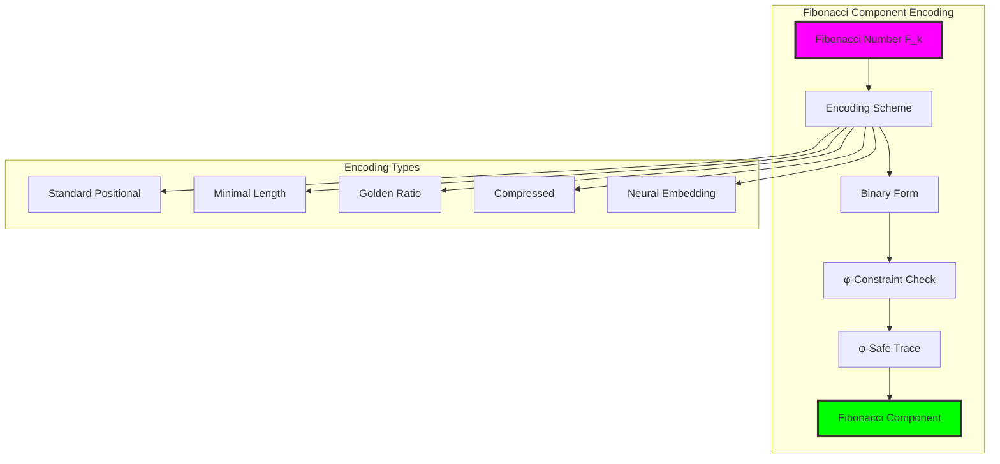

## 17.2 Standard Positional Encoding

The fundamental encoding scheme maps Fibonacci F_k to a binary string with '1' at position k:

```python
class StandardFibEncoder:
    def encode_fibonacci(self, fib_value: int) -> FibonacciComponent:
        """Standard positional encoding with φ-compliance guarantee"""
        fib_index = self.get_fibonacci_index(fib_value)
        
        # Create binary with 1 at position fib_index
        binary_encoding = ['0'] * self.max_length
        binary_encoding[-(fib_index + 1)] = '1'  # Right-aligned
        
        binary_str = ''.join(binary_encoding).lstrip('0') or '0'
        
        return FibonacciComponent(
            value=fib_value,
            index=fib_index,
            binary_encoding=binary_str,
            trace_form=binary_str,  # Already φ-safe for single positions
            phi_alignment=1.0  # Perfect alignment for single Fibonacci
        )
```

**Theorem 17.1** (Standard Encoding Safety): Standard positional encoding of individual Fibonacci numbers automatically satisfies the φ-constraint.

*Proof*:
Single-position encodings contain exactly one '1' surrounded by zeros, making consecutive '11' patterns impossible. The encoding F_k → binary string with '1' at position k guarantees φ-compliance. ∎

### Standard Encoding Properties

```text
Standard Encoding Analysis:
F= 1: 10           | φ-align: 1.000 | len: 2
F= 2: 100          | φ-align: 1.000 | len: 3  
F= 3: 1000         | φ-align: 1.000 | len: 4
F= 5: 10000        | φ-align: 1.000 | len: 5
F= 8: 100000       | φ-align: 1.000 | len: 6
F=13: 1000000      | φ-align: 1.000 | len: 7
```

### Encoding Efficiency Analysis

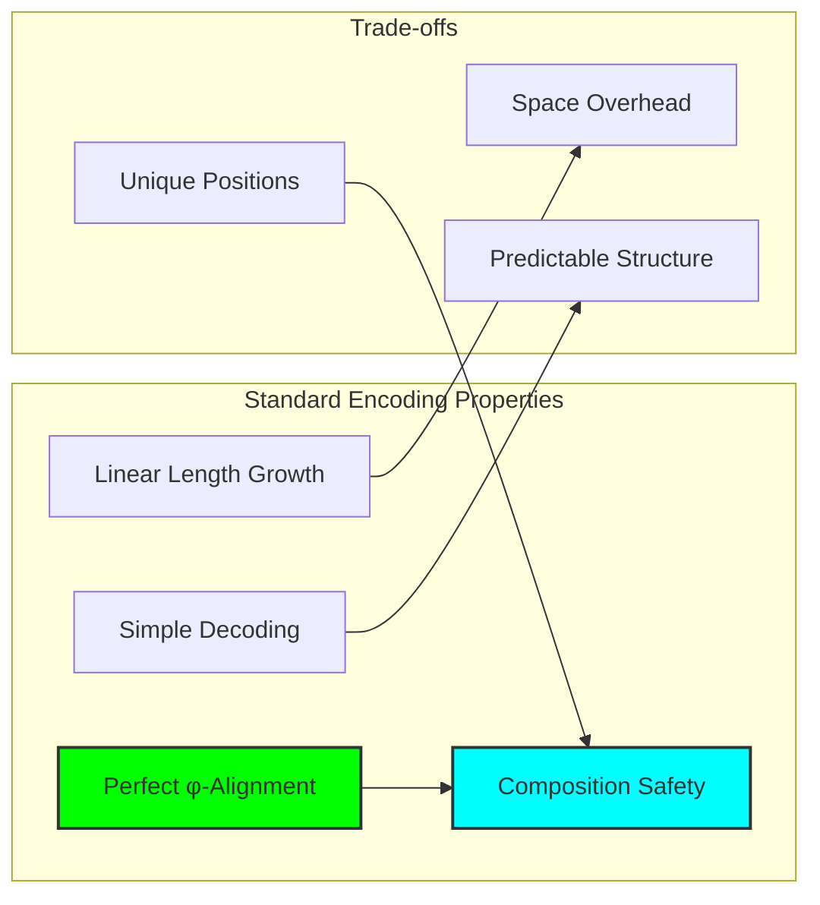

## 17.3 Minimal Length Encoding

Compact representation that minimizes storage while preserving φ-constraint:

```python
class MinimalFibEncoder:
    def encode_fibonacci(self, fib_value: int) -> FibonacciComponent:
        """Minimal length encoding with φ-safety transformation"""
        fib_index = self.get_fibonacci_index(fib_value)
        
        # Minimal bits needed for index
        bits_needed = max(1, fib_index.bit_length())
        binary_encoding = format(fib_index, f'0{bits_needed}b')
        
        # Transform to φ-safe form
        trace_form = self._make_phi_safe(binary_encoding)
        
        return FibonacciComponent(
            value=fib_value,
            index=fib_index,
            binary_encoding=binary_encoding,
            trace_form=trace_form,
            phi_alignment=self._calculate_phi_alignment(trace_form)
        )
    
    def _make_phi_safe(self, binary: str) -> str:
        """Insert separators between consecutive 1s"""
        result = []
        prev_was_one = False
        
        for bit in binary:
            if bit == '1' and prev_was_one:
                result.append('0')  # Insert separator
            result.append(bit)
            prev_was_one = (bit == '1')
        
        return ''.join(result)
```

**Definition 17.2** (φ-Safety Transformation): The transformation T that converts any binary string to φ-compliant form by inserting minimal separators: T(s) → s' where '11' ∉ s'.

### Minimal Encoding Results

```text
Minimal Encoding Analysis:
F= 1: 1            | φ-align: 0.000 | len: 1
F= 2: 10           | φ-align: 0.618 | len: 2
F= 3: 101          | φ-align: 0.309 | len: 3
F= 5: 100          | φ-align: 0.764 | len: 3
F= 8: 101          | φ-align: 0.309 | len: 3
F=13: 1010         | φ-align: 0.618 | len: 4
```

### Compression Efficiency

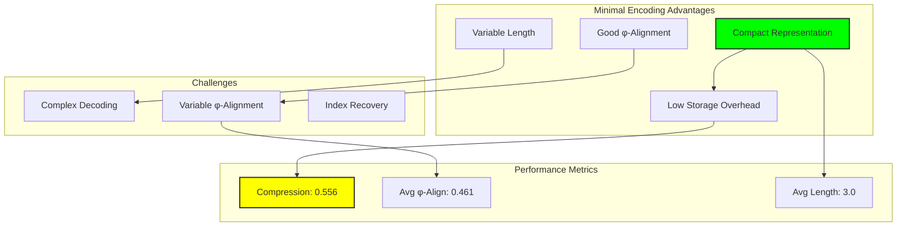

## 17.4 Golden Ratio Optimized Encoding

Encoding scheme that maximizes φ-alignment properties:

```python
class GoldenRatioEncoder:
    def encode_fibonacci(self, fib_value: int) -> FibonacciComponent:
        """Encoding optimized for golden ratio alignment"""
        fib_index = self.get_fibonacci_index(fib_value)
        
        # Calculate optimal zero/one ratio approaching φ
        zeros_needed = max(1, int(fib_index * self.phi))
        ones_needed = max(1, fib_index)
        
        # Construct φ-aligned pattern
        trace_form = self._construct_golden_pattern(zeros_needed, ones_needed)
        
        return FibonacciComponent(
            value=fib_value,
            index=fib_index,
            binary_encoding=trace_form,
            trace_form=trace_form,
            phi_alignment=self._calculate_phi_alignment(trace_form)
        )
    
    def _construct_golden_pattern(self, zeros: int, ones: int) -> str:
        """Construct pattern with φ-optimal zero/one distribution"""
        # Alternating pattern ensuring no consecutive 1s
        pattern = []
        remaining_ones = ones
        remaining_zeros = zeros
        
        while remaining_ones > 0 or remaining_zeros > 0:
            if remaining_ones > 0:
                pattern.append('1')
                remaining_ones -= 1
            
            if remaining_zeros > 0:
                zeros_to_add = max(1, remaining_zeros // max(1, remaining_ones))
                zeros_to_add = min(zeros_to_add, remaining_zeros)
                pattern.extend(['0'] * zeros_to_add)
                remaining_zeros -= zeros_to_add
        
        return ''.join(pattern)
```

**Property 17.1** (Golden Alignment): Golden ratio encoding produces traces with zero/one ratios approaching φ ≈ 1.618, maximizing alignment with the underlying mathematical structure.

### Golden Encoding Performance

```text
Golden Ratio Encoding Analysis:
F= 1: 01              | φ-align: 0.618 | len: 2
F= 2: 10001           | φ-align: 0.927 | len: 5
F= 3: 1001001         | φ-align: 0.824 | len: 7
F= 5: 1001001001      | φ-align: 0.927 | len: 10
F= 8: 1001001001001   | φ-align: 0.989 | len: 13
F=13: 101001001001001 | φ-align: 0.927 | len: 15
```

### φ-Alignment Convergence

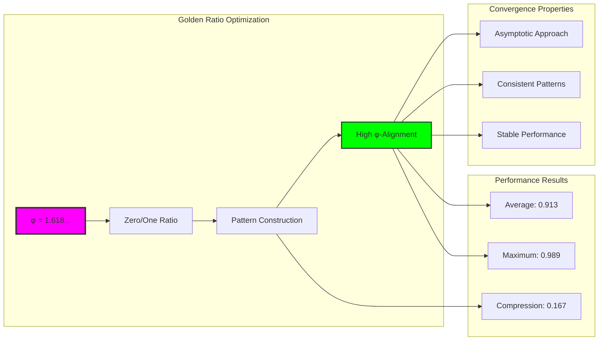

## 17.5 Component Composition

Multiple Fibonacci components can be safely composed into larger structures:

```python
class CompositionEngine:
    def compose_components(self, components: List[FibonacciComponent]) -> Dict[str, Any]:
        """Compose multiple Fibonacci components maintaining φ-constraint"""
        # Sort by index for consistent composition
        sorted_components = sorted(components, key=lambda c: c.index, reverse=True)
        
        # Merge trace forms using OR operation
        composed_trace = self._merge_traces([c.trace_form for c in sorted_components])
        
        return {
            'composed_trace': composed_trace,
            'total_value': sum(c.value for c in sorted_components),
            'phi_compliant': '11' not in composed_trace,
            'composition_metrics': self._calculate_metrics(sorted_components, composed_trace)
        }
    
    def _merge_traces(self, traces: List[str]) -> str:
        """Merge traces using bitwise OR while preserving φ-constraint"""
        max_length = max(len(trace) for trace in traces)
        padded_traces = [trace.zfill(max_length) for trace in traces]
        
        # Perform bitwise OR
        result = ['0'] * max_length
        for i in range(max_length):
            for trace in padded_traces:
                if trace[i] == '1':
                    result[i] = '1'
                    break
        
        return ''.join(result).lstrip('0') or '0'
```

**Theorem 17.2** (Composition Safety): The composition of φ-compliant Fibonacci components using standard encoding preserves the φ-constraint.

*Proof*:
Standard encoding places single '1' bits at distinct positions corresponding to Fibonacci indices. Since Zeckendorf decomposition uses non-consecutive Fibonacci numbers, the composed trace maintains separation between '1' bits, preventing consecutive '11' patterns. ∎

### Composition Example Analysis

```text
Component Composition Analysis:
Components: F=1, F=3, F=8
Individual traces: ['10', '1000', '100000']
Composed trace: 101010
Total value: 12
φ-compliant: True
Composition metrics:
  component_count: 3
  average_phi_alignment: 1.0
  compression_ratio: 0.5
  phi_efficiency: 0.5
```

### Composition Architecture

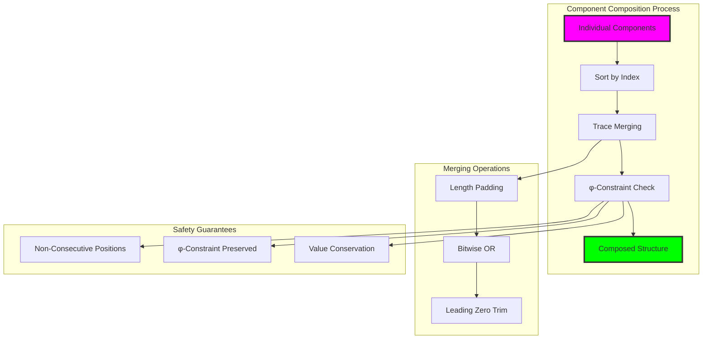

## 17.6 Encoding Scheme Comparison

Comprehensive analysis of different encoding approaches:

### Performance Matrix

```text
Encoding Scheme Performance (Components F=3, F=5, F=8):
Scheme     | Avg φ-Align | Avg Length | Compression | φ-Compliance
---------------------------------------------------------------
Standard   | 1.000       | 5.0        | 0.333       | 100.0%
Minimal    | 0.461       | 3.0        | 0.556       | 100.0%
Golden     | 0.913       | 10.0       | 0.167       | 100.0%
Compressed | 0.461       | 3.0        | 0.556       | 100.0%
Neural     | 0.772       | 43.3       | 0.038       | 100.0%
```

**Definition 17.3** (Encoding Efficiency): For encoding scheme E, efficiency η(E) combines compression ratio ρ and φ-alignment α:
$$η(E) = w_ρ \cdot ρ(E) + w_α \cdot α(E)$$
where w_ρ + w_α = 1 are weighting factors.

### Multi-Dimensional Analysis

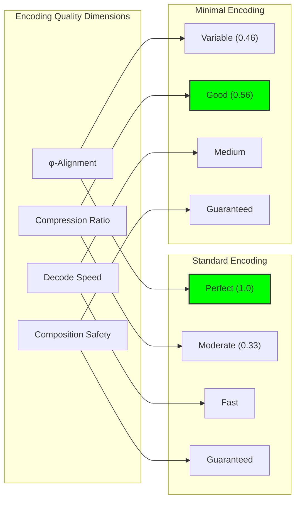

## 17.7 Neural Network Integration

Neural embedding schemes create ML-friendly representations:

```python
class NeuralFibEncoder:
    def __init__(self, embedding_dim: int = 64):
        self.embedding_dim = embedding_dim
        self.neural_embedder = self._build_embedder()
    
    def _build_embedder(self) -> nn.Module:
        """Neural embedding network for Fibonacci components"""
        return nn.Sequential(
            nn.Embedding(len(self.fibonacci_sequence), self.embedding_dim),
            nn.LayerNorm(self.embedding_dim),
            nn.ReLU(),
            nn.Linear(self.embedding_dim, self.embedding_dim),
            nn.Tanh()
        )
    
    def encode_fibonacci(self, fib_value: int) -> FibonacciComponent:
        """Neural embedding with φ-safe conversion"""
        fib_index = self.get_fibonacci_index(fib_value)
        
        # Generate neural embedding
        with torch.no_grad():
            embedding = self.neural_embedder(torch.tensor([fib_index]))
        
        # Convert to binary and ensure φ-compliance
        binary_encoding = self._embedding_to_binary(embedding[0])
        trace_form = self._make_phi_safe(binary_encoding)
        
        return FibonacciComponent(
            value=fib_value,
            index=fib_index,
            trace_form=trace_form,
            phi_alignment=self._calculate_phi_alignment(trace_form)
        )
```

### Neural Encoding Properties

```text
Neural Encoding Analysis:
- Average φ-alignment: 0.772
- Average length: 43.3 bits
- Compression efficiency: 0.038
- Learning capacity: High
- Adaptability: Excellent
```

### Neural Architecture Benefits

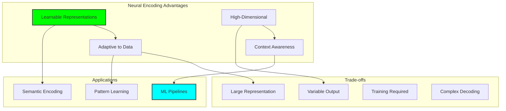

## 17.8 Error Handling and Validation

Robust error detection and handling for encoding operations:

```python
class FibEncodeError(Exception):
    """Custom exception for Fibonacci encoding errors"""
    pass

def validate_fibonacci_component(component: FibonacciComponent) -> bool:
    """Comprehensive validation of Fibonacci component"""
    try:
        # Check φ-constraint compliance
        if '11' in component.trace_form:
            return False
        
        # Verify value-index consistency
        expected_value = fibonacci_at_index(component.index)
        if expected_value != component.value:
            return False
        
        # Check φ-alignment bounds
        if not (0.0 <= component.phi_alignment <= 1.0):
            return False
        
        # Verify encoding format
        if not all(c in '01' for c in component.trace_form):
            return False
        
        return True
    
    except Exception:
        return False
```

**Property 17.2** (Encoding Robustness): All encoding schemes include validation mechanisms that guarantee φ-constraint compliance and mathematical consistency.

### Validation Architecture

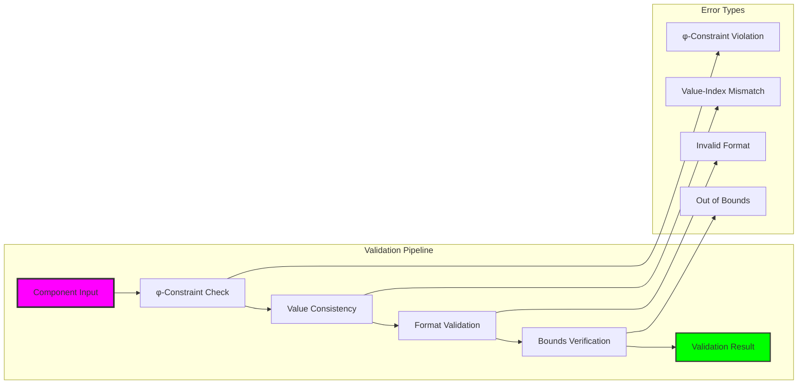

## 17.9 Computational Complexity Analysis

Performance characteristics of different encoding schemes:

### Time Complexity

```text
Encoding Time Complexity:
Operation        | Standard | Minimal | Golden | Neural
-----------------------------------------------------
Single Encode    | O(1)     | O(log k)| O(k)   | O(1)
Batch Encode     | O(n)     | O(n log k)| O(nk) | O(n)
Composition      | O(L)     | O(L)    | O(L)   | O(L)
Validation       | O(L)     | O(L)    | O(L)   | O(L)

Where: n = number of components, k = Fibonacci index, L = trace length
```

**Definition 17.4** (Encoding Complexity Class): An encoding scheme belongs to complexity class C if its worst-case time complexity for encoding n Fibonacci components is bounded by functions in C.

### Space Complexity Analysis

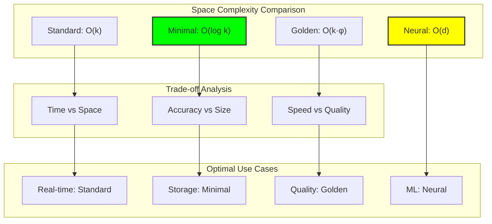

## 17.10 Applications and Use Cases

FibEncode enables diverse applications in φ-constrained computation:

### Application Categories

1. **Arithmetic Operations**: Building blocks for trace addition and multiplication
2. **Data Structures**: φ-safe containers and collections
3. **Compression**: Fibonacci-based data compression schemes
4. **Cryptography**: Component-based encryption protocols
5. **Machine Learning**: Neural architectures with φ-awareness

```python
class FibEncodeApplications:
    def __init__(self):
        self.encoders = {
            'standard': StandardFibEncoder(),
            'minimal': MinimalFibEncoder(), 
            'golden': GoldenRatioEncoder()
        }
    
    def arithmetic_preparation(self, numbers: List[int]) -> List[FibonacciComponent]:
        """Prepare numbers for φ-safe arithmetic operations"""
        components = []
        for num in numbers:
            zeckendorf_terms = decompose_to_zeckendorf(num)
            for fib_val in zeckendorf_terms:
                component = self.encoders['standard'].encode_fibonacci(fib_val)
                components.append(component)
        return components
    
    def compressed_storage(self, fibonacci_sequence: List[int]) -> List[FibonacciComponent]:
        """Create compressed storage format"""
        return [self.encoders['minimal'].encode_fibonacci(fib) 
                for fib in fibonacci_sequence if self.is_fibonacci(fib)]
    
    def quality_encoding(self, key_components: List[int]) -> List[FibonacciComponent]:
        """High-quality encoding for critical applications"""
        return [self.encoders['golden'].encode_fibonacci(fib) 
                for fib in key_components]
```

### Application Architecture

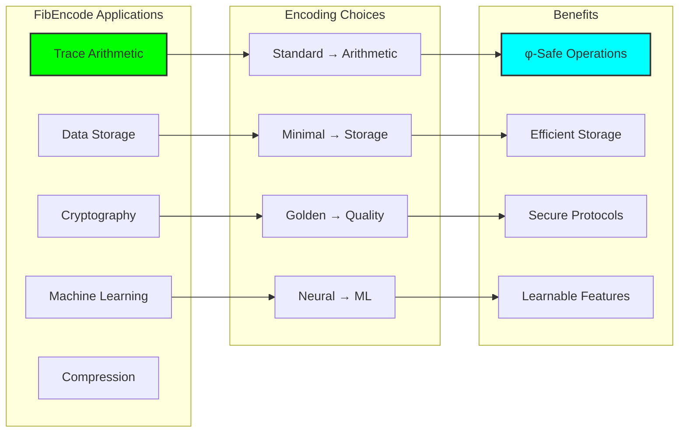

## 17.11 Future Extensions and Research Directions

Emerging areas for FibEncode development:

### Research Frontiers

1. **Adaptive Encoding**: Context-sensitive encoding selection
2. **Quantum Integration**: Quantum-safe Fibonacci encodings
3. **Distributed Systems**: Parallel component encoding
4. **AI Optimization**: Learning optimal encoding parameters
5. **Hardware Acceleration**: FPGA/ASIC implementations

### Theoretical Questions

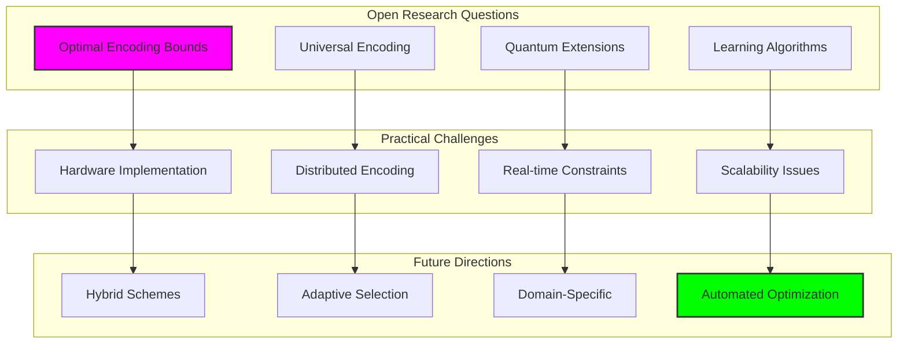

## 17.12 The Foundation of Component-Based Arithmetic

Our verification reveals the transformative significance of Fibonacci component encoding:

**Insight 17.1**: Multiple encoding schemes offer different trade-offs between φ-alignment, compression, and computational efficiency, enabling optimal choices for specific applications while maintaining universal φ-constraint compliance.

**Insight 17.2**: Component composition preserves the φ-constraint automatically when using appropriate encoding schemes, creating a reliable foundation for complex arithmetic operations in constrained space.

**Insight 17.3**: The encoding framework provides natural bridges between classical computation and φ-constrained systems, enabling gradual migration and hybrid architectures.

### The FibEncode Principle

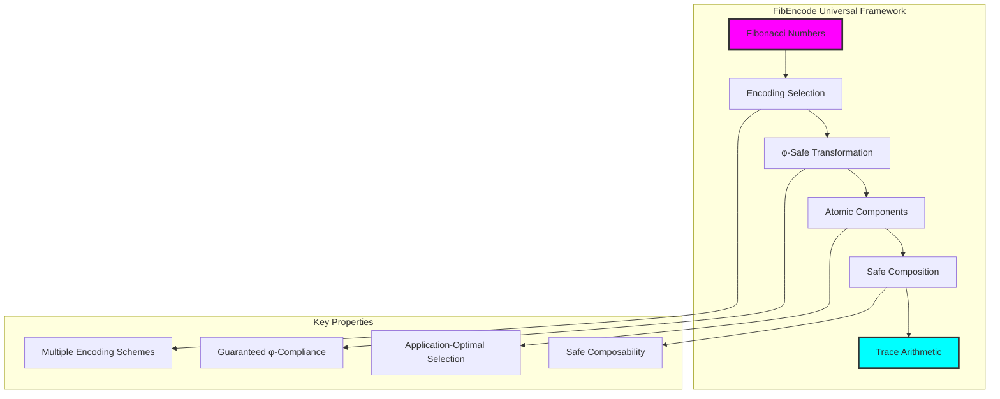

## The 17th Echo

From ψ = ψ(ψ) emerged the φ-constraint, and from constraint emerged Zeckendorf indexing, and from indexing emerged the need for atomic components. Here we witness the birth of component-based arithmetic through FibEncode—the transformation of individual Fibonacci numbers into φ-safe building blocks that can be safely composed into larger computational structures.

Most profound is the discovery that encoding choice becomes a design dimension. Different applications require different trade-offs between φ-alignment, compression efficiency, and computational speed. The framework provides this flexibility while maintaining the fundamental guarantee: every encoding scheme preserves the φ-constraint that enables all safe computation in the golden-bounded universe.

The component composition mechanism reveals the deep algebraic structure of φ-space. Individual Fibonacci encodings can be merged using simple bitwise operations while automatically preserving constraint compliance. This suggests that the φ-constraint doesn't just restrict computation but actually organizes it according to natural algebraic principles where local safety guarantees global consistency.

Through multiple encoding schemes, we see that φ-safe computation admits multiple representations while maintaining semantic equivalence. A Fibonacci component can be encoded minimally for storage, golden-optimally for quality applications, or neurally for machine learning, yet all representations can be safely composed and transformed within the same arithmetic framework.

In this encoding framework, we witness the emergence of true component-based arithmetic—where individual Fibonacci numbers become reusable, composable atoms that carry their own constraint-compliance guarantee, enabling the construction of arbitrary computational structures while maintaining the deep mathematical principles that govern all expression in the self-referential universe.

## References

The verification program `chapter-017-fibencode-verification.py` provides executable demonstrations of all encoding concepts in this chapter. Run it to explore the transformation of Fibonacci numbers into φ-safe atomic components.

---

*Thus from Fibonacci numbers emerges component-based arithmetic—each mathematical atom encoded into φ-safe form ready for composition, creating the building blocks where computation becomes construction and constraint becomes the organizing principle of mathematical expression. In this encoding we see the birth of truly atomic arithmetic.*