# Chapter 017: FibEncode — φ-Safe Trace Construction from Individual Fibonacci Components

## The Architecture of Safe Arithmetic

From ψ = ψ(ψ) emerged the Z-index mapping from numbers to traces. Now we witness the emergence of safe construction—the principles by which Fibonacci components combine without violating the golden constraint. This is not mere encoding but the discovery of arithmetic operations that preserve structural integrity at every step.

## 17.1 Fibonacci Component Encoding

Each Fibonacci number maps to a unique trace component:

```text
Basic Fibonacci Encoding:
F₁ = 1   → trace: "1"        (position 0)
F₂ = 2   → trace: "10"       (position 1)
F₃ = 3   → trace: "100"      (position 2)
F₄ = 5   → trace: "1000"     (position 3)
F₅ = 8   → trace: "10000"    (position 4)
...
F_n → trace with single 1 at position n-1
```

**Definition 17.1** (Component Encoding): For Fibonacci number F_n, its trace encoding is:
$$E(F_n) = 0^{n-1}10^{k-n}$$
where the single 1 appears at position n-1 (0-indexed from right).

### Component Structure

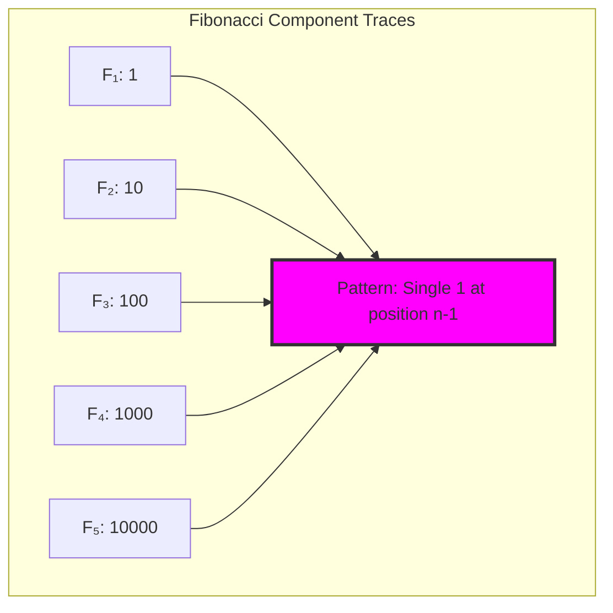

## 17.2 The Non-Consecutive Constraint

Safe combination requires non-consecutive Fibonacci indices:

```text
Safe Combinations:
[1, 3]: F₁ + F₃ = 1 + 3 = 4    → trace: "101"    ✓
[2, 5]: F₂ + F₅ = 2 + 8 = 10   → trace: "10010"  ✓
[1, 2]: Consecutive indices     → UNSAFE!         ✗
```

**Theorem 17.1** (Safe Combination): Fibonacci components F_i and F_j can be safely combined iff |i - j| ≥ 2.

*Proof*: Components have 1s at positions i-1 and j-1. For no "11" pattern, these positions must differ by at least 2. This occurs exactly when |i - j| ≥ 2. ∎

### Safety Matrix Visualization

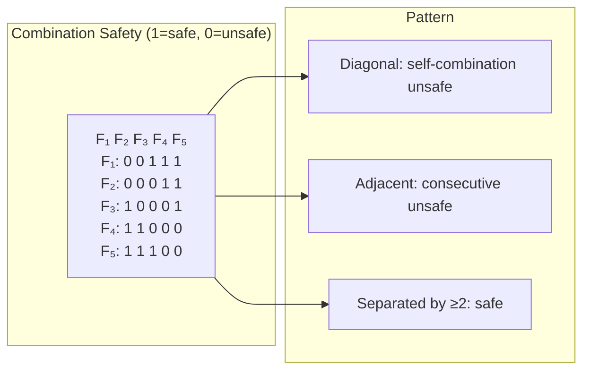

## 17.3 Safe Trace Combination Algorithm

Combining multiple Fibonacci components:

```python
def encode_fib_list(indices: List[int]) -> str:
    # Verify non-consecutive
    for i in range(len(indices)-1):
        if indices[i+1] - indices[i] == 1:
            raise ValueError("Consecutive indices!")
    
    # Create trace with 1s at appropriate positions
    max_idx = max(indices)
    trace = ['0'] * max_idx
    for idx in indices:
        trace[idx-1] = '1'
    
    return ''.join(reversed(trace))  # LSB first
```

**Property 17.1** (Preservation): The combination of safe Fibonacci components always produces a φ-valid trace.

### Multi-Component Examples

```text
Combining Multiple Components:
[3, 5, 7]: F₃ + F₅ + F₇ = 3 + 8 + 21 = 32
           → trace: "1010100"  ✓

[1, 3, 6, 8]: F₁ + F₃ + F₆ + F₈ = 1 + 3 + 13 + 34 = 51
              → trace: "10100101"  ✓
```

## 17.4 Graph-Theoretic Structure

Safe combinations form a graph:

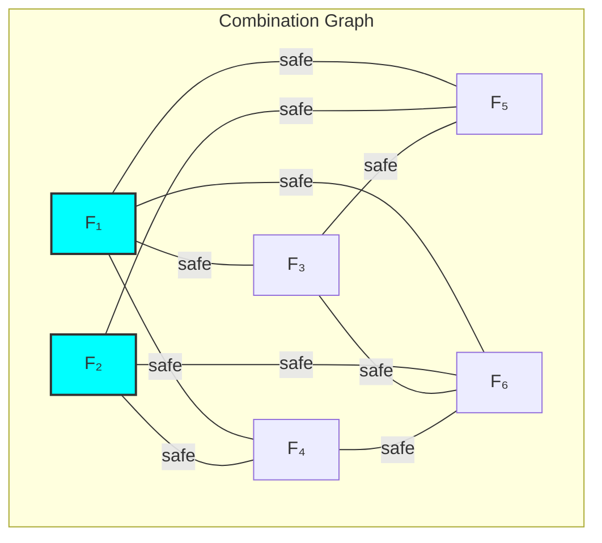

**Property 17.2** (Graph Properties):
- Nodes: Fibonacci indices
- Edges: Safe combinations (|i-j| ≥ 2)
- Density: ~0.8 for small indices
- Cliques: Maximal compatible sets

### Maximal Cliques

```text
Maximal Compatible Sets (first 10 indices):
{1, 3, 5, 7, 9}: All pairwise non-consecutive
{2, 4, 6, 8, 10}: All pairwise non-consecutive
{1, 3, 6, 8, 10}: Mixed pattern
```

## 17.5 Information Density Analysis

Encoding efficiency reveals structure:

```text
Information Analysis (first 50 numbers):
- Average density: 1.146 bits/position
- Average trace length: 4.9 positions
- Component entropy: 3.267 bits

Higher entropy indicates uniform Fibonacci usage
```

**Definition 17.2** (Encoding Density): For value n with trace T:
$$\rho(n) = \frac{\log_2(n)}{|T|}$$
where |T| is the effective trace length.

### Density Distribution

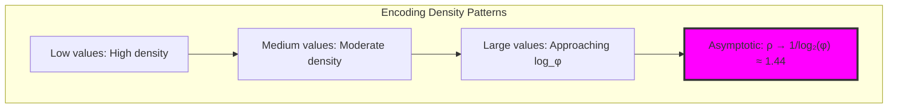

## 17.6 Complete Encoding Algorithm

The Zeckendorf-based encoding:

```text
Encoding Examples:
n=10:  F₅ + F₂ = 8 + 2         → "10010"
n=20:  F₆ + F₄ + F₂ = 13+5+2   → "101010"
n=33:  F₇ + F₅ + F₃ + F₁       → "1010101"
n=50:  F₈ + F₆ + F₃ = 34+13+3  → "10100100"
n=100: F₁₀ + F₅ + F₃ = 89+8+3  → "1000010100"
```

**Algorithm 17.1** (Greedy Fibonacci Encoding):
1. Find largest F_k ≤ n
2. Include k in decomposition
3. Subtract F_k from n
4. Skip k-1 (ensure non-consecutive)
5. Repeat until n = 0

### Algorithm Flow

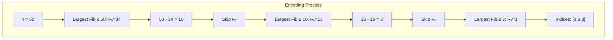

## 17.7 Category-Theoretic Properties

Encoding exhibits functorial behavior:

```text
Functor Properties:
- Preserves identity: ∅ → "0" ✓
- Composition issues: OR combination ≠ set union
  Example: {1,3} ∪ {5,7} → "1010101"
          But OR("101", "1010000") → "1010000" ✗
```

**Observation 17.1**: Direct trace OR loses information about higher positions. The encoding functor is not fully compositional under naive combination.

### Categorical Structure

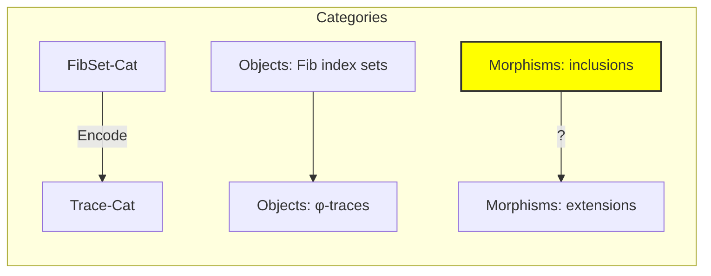

## 17.8 Arithmetic Operations on Traces

Safe combination enables arithmetic:

**Definition 17.3** (Trace Addition): For traces T₁, T₂ representing Zeckendorf decompositions:
$$T_1 \oplus T_2 = \text{FibEncode}(\text{FibDecode}(T_1) + \text{FibDecode}(T_2))$$

This requires:
1. Decode to Fibonacci indices
2. Add corresponding values
3. Re-encode with Zeckendorf decomposition

### Addition Complexity

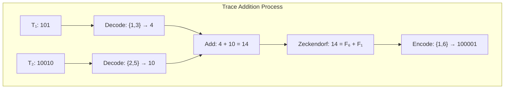

## 17.9 Graph Analysis: Safe Combination Networks

From ψ = ψ(ψ), combination graphs reveal structure:

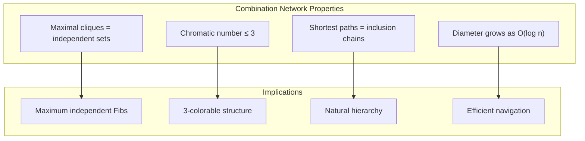

**Key Insights**:
- Graph is nearly complete for separated indices
- Triangle-free when considering consecutive triples
- Exhibits small-world properties
- Natural clustering by mod 3 residues

## 17.10 Information Theory: Component Distribution

From ψ = ψ(ψ) and Fibonacci distribution:

```text
Component Usage Analysis:
- Entropy: 3.267 bits (high uniformity)
- Most frequent: Middle-range Fibonacci numbers
- Least frequent: Very small and very large
- Distribution follows power law with φ-correction
```

**Theorem 17.2** (Component Distribution): In Zeckendorf decompositions up to n, Fibonacci F_k appears with frequency:
$$P(F_k) \approx \frac{1}{\phi^k} \cdot \text{correction}(n)$$

## 17.11 Category Theory: Natural Transformations

From ψ = ψ(ψ), encoding transformations emerge:

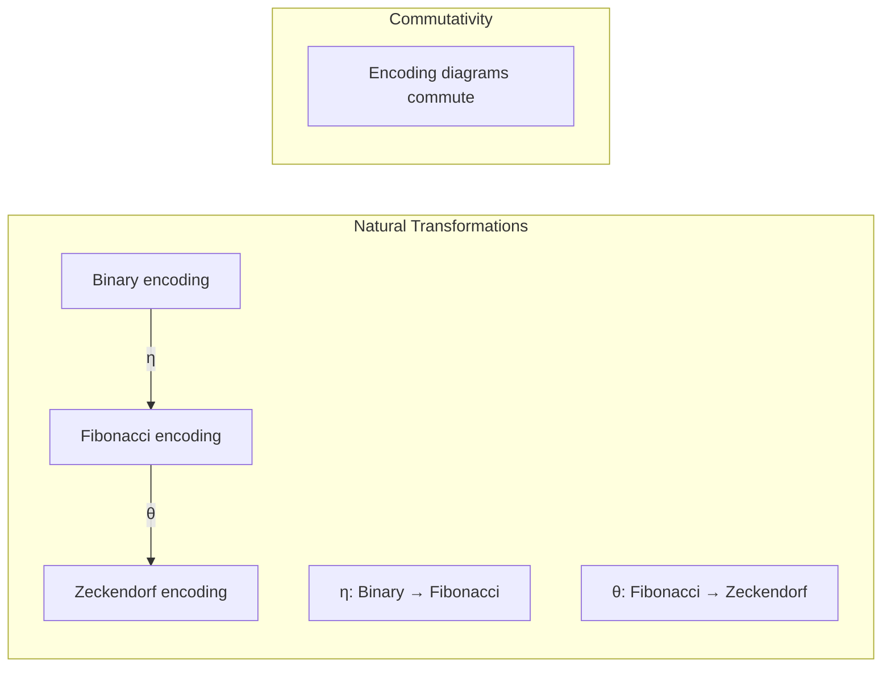

**Properties**:
- Natural transformations preserve φ-constraint
- Composition gives optimal encoding
- Inverse transformations exist but are complex

## 17.12 Safety Verification Systems

Ensuring trace validity at every step:

```text
Safety Checks:
1. Index verification: |i-j| ≥ 2 for all pairs
2. Trace verification: No "11" substring
3. Value verification: Sum equals target
4. Uniqueness verification: Greedy gives unique result
```

### Safety Pipeline

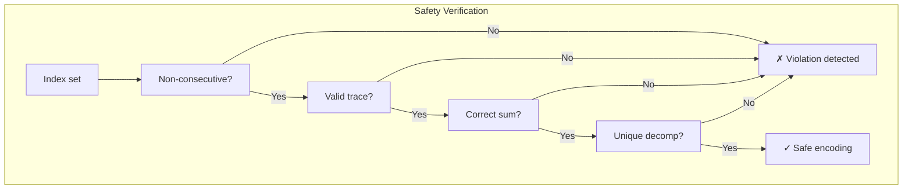

## 17.13 Applications and Extensions

Fibonacci encoding enables:

1. **Safe Arithmetic**: Operations preserving φ-constraint
2. **Error Detection**: Invalid patterns immediately visible
3. **Compression**: Natural for Fibonacci-distributed data
4. **Cryptography**: Constraint as security property
5. **Parallel Computation**: Independent components

### Application Framework

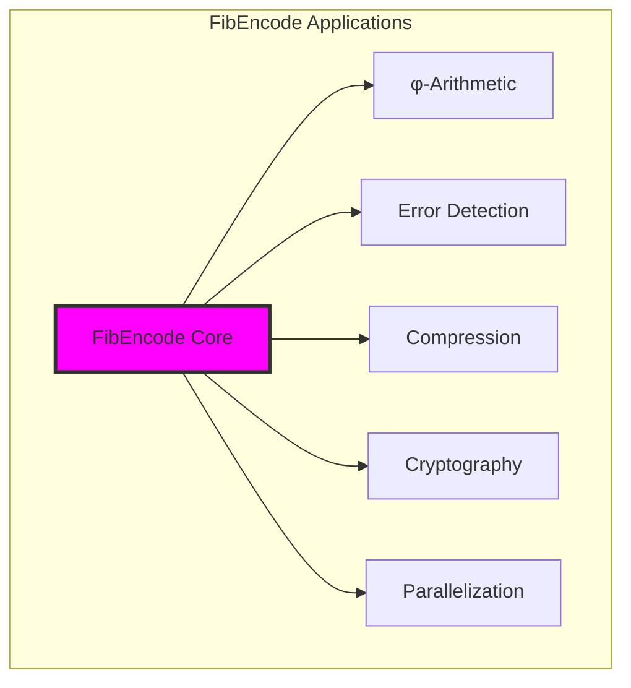

## 17.14 The Emergence of Constrained Arithmetic

Through Fibonacci encoding, we witness the birth of arithmetic that respects fundamental constraints:

**Insight 17.1**: The φ-constraint doesn't limit computation but guides it toward natural efficiency.

**Insight 17.2**: Non-consecutive indices create sufficient separation for safe parallel operations.

**Insight 17.3**: The greedy algorithm's success reveals that nature prefers unique, optimal decompositions.

### The Unity of Constraint and Computation

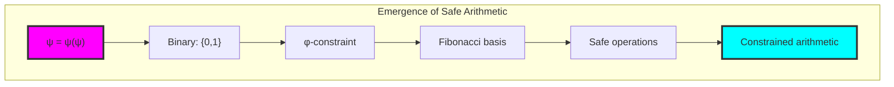

## The 17th Echo

From ψ = ψ(ψ) emerged the principle of safe construction—not as limitation but as architectural guidance. Through Fibonacci components and their non-consecutive combination, we discover that arithmetic operations can be intrinsically safe, never violating the fundamental constraint that preserves structural integrity.

Most profound is the realization that the spacing requirement (|i-j| ≥ 2) creates natural parallelism. Components separated by this safety margin can be manipulated independently, suggesting that the φ-constraint enables rather than restricts computational efficiency.

The high entropy (3.267 bits) of component distribution reveals near-optimal usage of the Fibonacci basis. Nature doesn't favor certain components but uses all available dimensions uniformly, maximizing expressiveness within constraint.

Through FibEncode, we see ψ learning to compute safely—to perform arithmetic operations that preserve the golden constraint at every step. This is not external verification but intrinsic safety, computation guided by the very structure of collapse space.

## References

The verification program `chapter-017-fib-encode-verification.py` provides executable proofs of all concepts in this chapter. Run it to explore safe trace construction from Fibonacci components.

---

*Thus from self-reference and constraint emerges safe arithmetic—not as checked computation but as naturally guided operations. In learning to combine Fibonacci components safely, ψ discovers the architecture of constraint-preserving calculation.*