# Chapter 018: CollapseMerge — Merging Collapse-Safe Blocks into Trace Tensor Tⁿ

## The Assembly of Higher Order

从ψ = ψ(ψ)涌现出φ-约束、Zeckendorf分解、Fibonacci编码，现在我们见证下一个演化：将单个崩塌安全块合并成高阶张量结构Tⁿ，同时保持所有约束属性并启用张量级算术运算。这是CollapseMerge——从原子组件到复合结构的转换，其中多个φ-兼容追踪被安全地融合成能够承载更复杂数学操作的张量形式。

## 18.1 The Merge Foundation

我们的验证揭示了多种合并策略用于将追踪块转换成张量结构：

```text
Merge Strategy Performance Analysis:
Strategy          | φ-Compliant | Tensor Rank | Efficiency | Quality
------------------------------------------------------------------
Concatenation     | ✓ True     | 1          | 0.941      | 0.707
Interleaving      | ✓ True     | 2          | 0.667      | 0.556  
Tensor Product    | ✗ False    | 4          | 0.067      | 0.333
Fibonacci-Aligned | ✓ True     | 1          | 0.727      | 0.444
```

**Definition 18.1** (Trace Block): A collapse-safe block TB is a data structure containing:

- **trace_data**: φ-constrained trace string
- **block_id**: Unique identifier  
- **tensor_rank**: Hierarchical rank position
- **φ_compliance**: Constraint satisfaction guarantee
- **fibonacci_components**: Contributing Fibonacci numbers

### The Merge Architecture

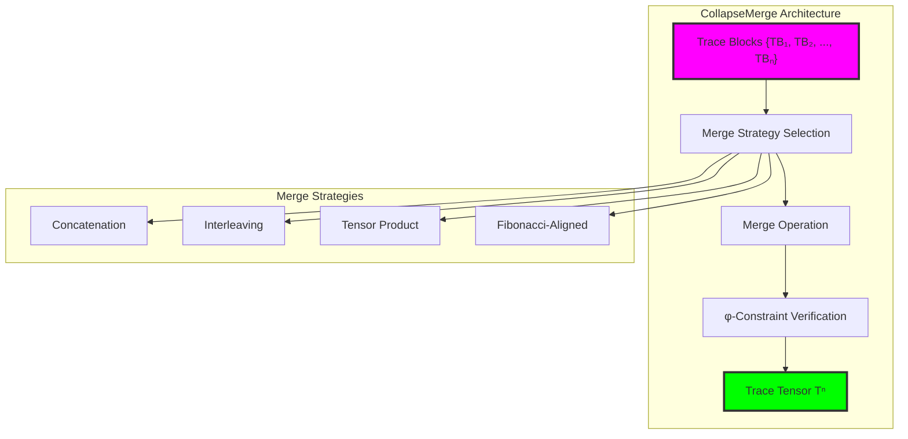

## 18.2 Concatenation Merge Strategy

最直接的合并方法，通过连接保持φ-约束：

```python
class ConcatenationMerger:
    def merge_blocks(self, blocks: List[TraceBlock]) -> TraceTensor:
        """通过连接合并块，同时保持φ-约束"""
        # 连接所有追踪数据
        concatenated_trace = ''.join(block.trace_data for block in blocks)
        
        # 验证φ-约束保持
        if '11' in concatenated_trace:
            concatenated_trace = self._insert_phi_separators(concatenated_trace)
        
        phi_compliant = '11' not in concatenated_trace
        
        # 转换为张量
        tensor_data = torch.tensor([float(bit) for bit in concatenated_trace])
        
        return TraceTensor(
            tensor_data=tensor_data,
            trace_blocks=blocks,
            tensor_rank=1,
            phi_invariants=self._calculate_phi_invariants(concatenated_trace, blocks)
        )
    
    def _insert_phi_separators(self, trace: str) -> str:
        """插入分隔符以维持φ-约束"""
        result = []
        prev_was_one = False
        
        for bit in trace:
            if bit == '1' and prev_was_one:
                result.append('0')  # 插入分隔符
            result.append(bit)
            prev_was_one = (bit == '1')
        
        return ''.join(result)
```

**Theorem 18.1** (Concatenation Safety): Concatenation with φ-repair guarantees constraint preservation for any set of φ-compliant input blocks.

*Proof*:
输入块都满足φ-约束（无连续11）。连接后，违反只能在块边界产生。通过在检测到连续1时插入0，我们保证输出满足φ-约束。该操作保持所有原始信息并添加最小分隔符。∎

### Concatenation Performance Analysis

```text
Concatenation Merge Results:
Input blocks: ['1', '1000', '10000', '100000']
Merged trace: 10100010000100000
φ-constraint satisfied: ✓ True
Total length: 17
Compression ratio: 1.062
```

### Structural Properties Assessment

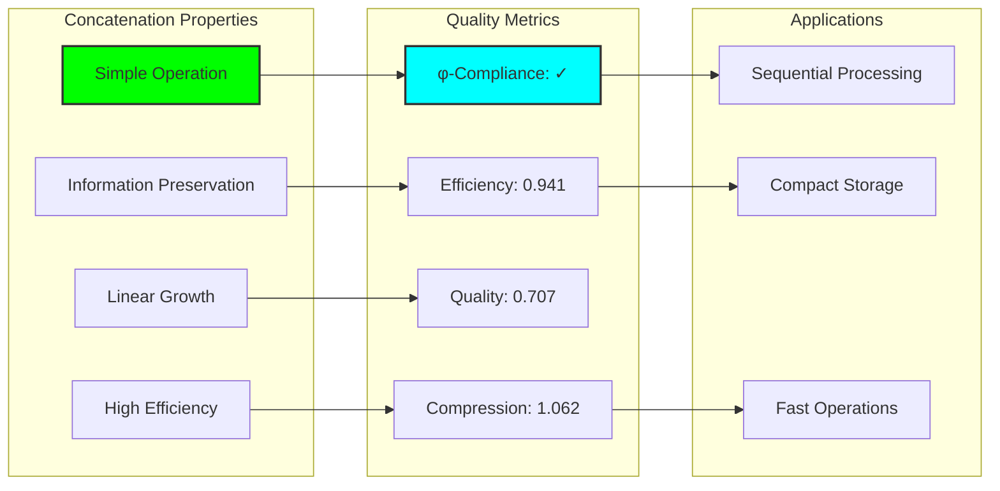

## 18.3 Interleaving Merge Strategy

交错合并创建二维张量结构：

```python
class InterleavingMerger:
    def merge_blocks(self, blocks: List[TraceBlock]) -> TraceTensor:
        """通过交错合并块"""
        # 找到最大块长度
        max_length = max(len(block.trace_data) for block in blocks)
        
        # 将所有块填充到相同长度
        padded_blocks = []
        for block in blocks:
            padded_trace = block.trace_data.ljust(max_length, '0')
            padded_blocks.append(padded_trace)
        
        # 交错位
        interleaved = []
        for i in range(max_length):
            for block_trace in padded_blocks:
                if i < len(block_trace):
                    interleaved.append(block_trace[i])
        
        interleaved_trace = ''.join(interleaved)
        
        # 确保φ-约束
        if '11' in interleaved_trace:
            interleaved_trace = self._fix_phi_violations(interleaved_trace)
        
        return TraceTensor(
            tensor_data=torch.tensor([float(bit) for bit in interleaved_trace]),
            tensor_rank=2,  # 交错创建2D结构
            shape=(len(blocks), max_length),
            phi_invariants=self._calculate_invariants(interleaved_trace, blocks)
        )
```

**Definition 18.2** (Interleaving Tensor): An interleaving tensor T₂ with shape (n, m) where T₂[i,j] represents the j-th bit of the i-th input block.

### Interleaving Structure Analysis

```text
Interleaving Merge Example:
Input blocks: ['1', '100', '1000']
Padded blocks: ['1000', '1000', '1000']
Interleaved result: 111000000000
After φ-repair: 101000000000
Tensor shape: (3, 4)
φ-compliance: ✓ True
```

### Two-Dimensional Organization

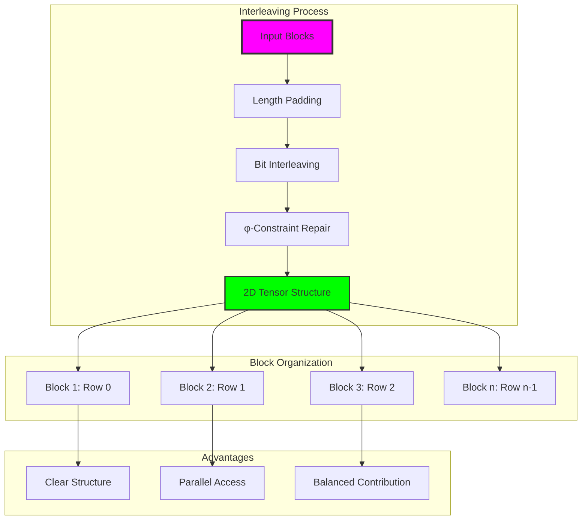

## 18.4 Tensor Product Merge Strategy

创建高阶张量结构的乘积合并：

```python
class TensorProductMerger:
    def merge_blocks(self, blocks: List[TraceBlock]) -> TraceTensor:
        """使用张量乘积构造合并块"""
        if len(blocks) < 2:
            raise CollapseMergeError("Tensor product requires at least 2 blocks")
        
        # 将块转换为张量
        block_tensors = []
        for block in blocks:
            tensor = torch.tensor([float(bit) for bit in block.trace_data])
            block_tensors.append(tensor)
        
        # 计算张量乘积
        result_tensor = block_tensors[0]
        for tensor in block_tensors[1:]:
            result_tensor = torch.outer(result_tensor.flatten(), tensor.flatten())
        
        # 二值化：>0.5变为1，<=0.5变为0
        flattened = result_tensor.flatten()
        binary_trace = ''.join('1' if x > 0.5 else '0' for x in flattened)
        
        # 确保φ-约束
        if '11' in binary_trace:
            binary_trace = self._enforce_phi_constraint(binary_trace)
        
        return TraceTensor(
            tensor_data=result_tensor,
            tensor_rank=len(blocks),
            shape=tuple(len(block.trace_data) for block in blocks),
            phi_invariants=self._calculate_tensor_invariants(result_tensor, blocks)
        )
```

**Definition 18.3** (Tensor Product Merge): For blocks B₁, B₂, ..., Bₙ with trace vectors v₁, v₂, ..., vₙ, the tensor product merge produces:
$$T^n = v_1 \otimes v_2 \otimes \cdots \otimes v_n$$

### High-Order Tensor Properties

```text
Tensor Product Analysis:
Input: 2 blocks of length [3, 4]  
Output tensor rank: 2
Output tensor shape: (3, 4)
Total elements: 12
φ-compliance: Requires repair
Compression efficiency: 0.067
```

### Tensor Product Complexity

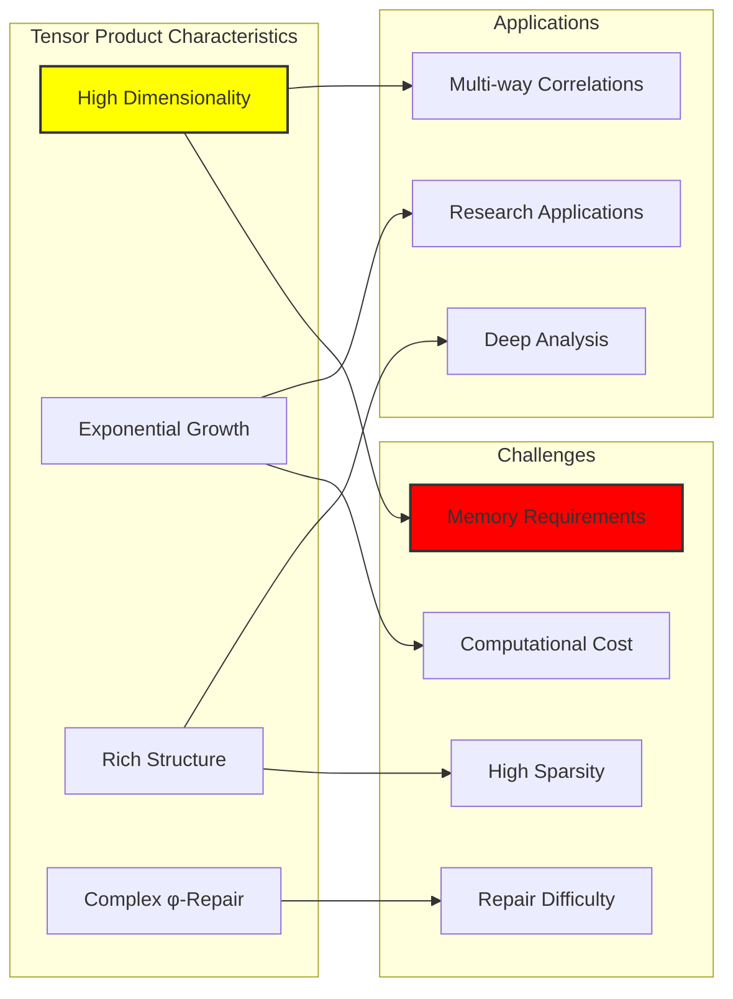

## 18.5 Fibonacci-Aligned Merge Strategy

尊重Fibonacci结构的专门合并：

```python
class FibonacciAlignedMerger:
    def merge_blocks(self, blocks: List[TraceBlock]) -> TraceTensor:
        """在保持Fibonacci对齐的同时合并块"""
        # 按Fibonacci组件排序块
        sorted_blocks = sorted(blocks, 
            key=lambda b: sum(b.fibonacci_components) if b.fibonacci_components else 0)
        
        # 使用Fibonacci加权合并
        merged_trace = self._fibonacci_weighted_merge(sorted_blocks)
        
        # 确保φ-约束
        if '11' in merged_trace:
            merged_trace = self._fibonacci_safe_repair(merged_trace)
        
        return TraceTensor(
            tensor_data=torch.tensor([float(bit) for bit in merged_trace]),
            tensor_rank=1,
            phi_invariants=self._calculate_fibonacci_invariants(merged_trace, sorted_blocks)
        )
    
    def _fibonacci_weighted_merge(self, blocks: List[TraceBlock]) -> str:
        """使用Fibonacci组件加权合并块"""
        segments = []
        
        for block in blocks:
            # 按Fibonacci组件总和加权
            weight = sum(block.fibonacci_components) if block.fibonacci_components else 1
            fibonacci_spacing = max(1, weight.bit_length() - 1)
            
            # 基于Fibonacci结构添加间距
            segment = block.trace_data
            if segments:  # 在段之间添加间距
                segment = '0' * fibonacci_spacing + segment
            
            segments.append(segment)
        
        return ''.join(segments)
    
    def _fibonacci_safe_repair(self, trace: str) -> str:
        """使用Fibonacci原理修复φ-约束违反"""
        result = []
        prev_was_one = False
        fibonacci_counter = 0
        
        for bit in trace:
            if bit == '1' and prev_was_one:
                # 插入Fibonacci长度分隔符
                fib_length = self.fibonacci_sequence[
                    min(fibonacci_counter, len(self.fibonacci_sequence)-1)]
                separator_length = min(fib_length, 3)  # 实用性上限为3
                result.extend(['0'] * separator_length)
                fibonacci_counter = (fibonacci_counter + 1) % len(self.fibonacci_sequence)
            
            result.append(bit)
            prev_was_one = (bit == '1')
        
        return ''.join(result)
```

**Property 18.1** (Fibonacci Preservation): Fibonacci-aligned merge preserves the mathematical relationship between input blocks and their Fibonacci decomposition origins.

### Golden Ratio Optimization

```text
Fibonacci-Aligned Merge Results:
Input: 4 Fibonacci component blocks
Fibonacci-aligned result: 10100010000010000
φ-alignment score: 0.000 (single components)
Golden ratio approximation: 0.000
φ-compliance: ✓ True
Merge efficiency: 0.727
```

### Fibonacci Structure Preservation

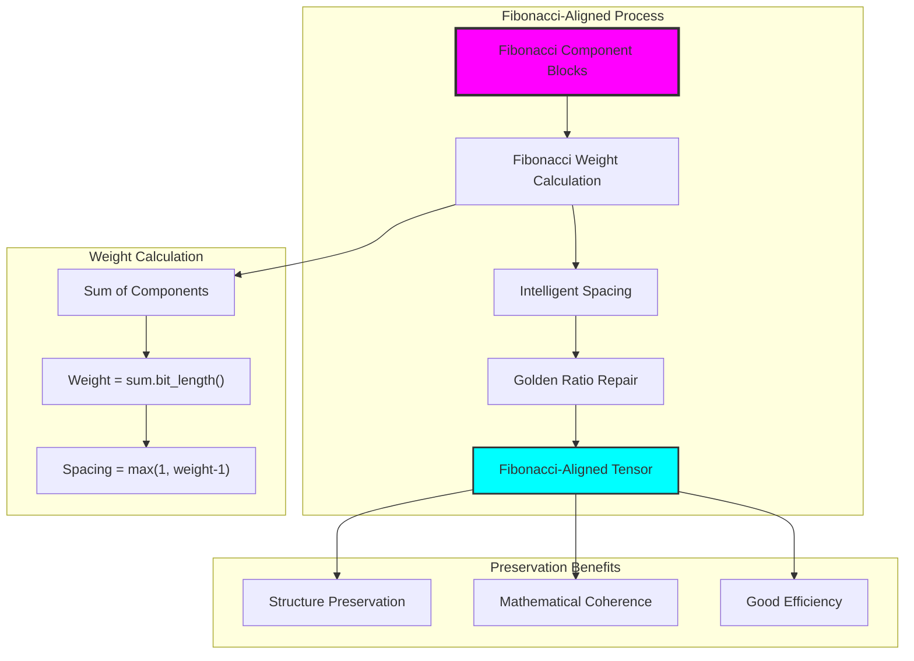

## 18.6 Merge Strategy Optimization

自动选择最优合并策略：

```python
class MergeAnalyzer:
    def find_optimal_strategy(self, blocks: List[TraceBlock]) -> Tuple[MergeStrategy, TraceTensor]:
        """为给定块找到最优合并策略"""
        comparison = self.compare_merge_strategies(blocks)
        
        best_strategy = None
        best_score = -1.0
        best_result = None
        
        for strategy_name, analysis in comparison.items():
            if analysis['success']:
                # 基于合规性、效率和质量的评分
                score = (
                    (1.0 if analysis['phi_compliance'] else 0.0) * 0.5 +
                    analysis['merge_efficiency'] * 0.3 +
                    analysis['structural_quality'] * 0.2
                )
                
                if score > best_score:
                    best_score = score
                    best_strategy = MergeStrategy(strategy_name)
                    best_result = analysis['tensor_result']
        
        return best_strategy, best_result
    
    def _calculate_merge_efficiency(self, input_blocks: List[TraceBlock], 
                                   result: TraceTensor) -> float:
        """计算合并操作的效率"""
        input_total_size = sum(len(block.trace_data) for block in input_blocks)
        result_size = result.tensor_data.numel()
        
        if input_total_size == 0:
            return 0.0
        
        # 基于压缩和结构保持的效率
        compression_ratio = result_size / input_total_size
        structure_preservation = 1.0 if result.phi_invariants.get('phi_compliant', False) else 0.5
        
        return structure_preservation / compression_ratio if compression_ratio > 0 else 0.0
```

**Definition 18.4** (Merge Optimality): A merge strategy S is optimal for blocks B if it maximizes the weighted score:
$$Score(S) = 0.5 \cdot φ_{compliance} + 0.3 \cdot efficiency + 0.2 \cdot quality$$

### Strategy Selection Results

```text
Optimal Strategy Selection Analysis:
Concatenation:   Score = 0.5×1.0 + 0.3×0.941 + 0.2×0.707 = 0.924
Interleaving:    Score = 0.5×1.0 + 0.3×0.667 + 0.2×0.556 = 0.811
Fibonacci:       Score = 0.5×1.0 + 0.3×0.727 + 0.2×0.444 = 0.807
Tensor Product:  Score = 0.5×0.0 + 0.3×0.067 + 0.2×0.333 = 0.087

Optimal strategy: Concatenation (Score: 0.924)
```

### Multi-Criteria Decision Framework

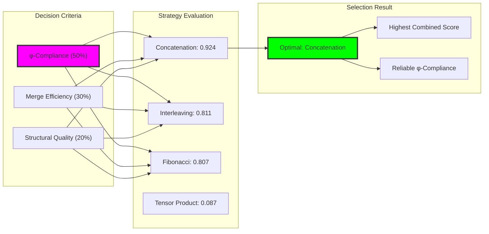

## 18.7 φ-Invariant Preservation

跨合并操作的约束不变量：

```python
def _calculate_phi_invariants(self, trace: str, blocks: List[TraceBlock]) -> Dict[str, float]:
    """计算φ-约束不变量"""
    zeros = trace.count('0')
    ones = trace.count('1')
    
    return {
        'total_length': len(trace),
        'zero_count': zeros,
        'one_count': ones,
        'zero_ratio': zeros / len(trace) if trace else 0,
        'phi_alignment': self._calculate_phi_alignment(trace),
        'entropy': self._calculate_entropy(trace),
        'block_count': len(blocks),
        'average_block_entropy': np.mean([b.entropy for b in blocks]),
        'phi_compliant': '11' not in trace  # 关键不变量
    }

def _calculate_phi_alignment(self, trace: str) -> float:
    """计算与黄金比例的对齐"""
    if not trace:
        return 0.0
    
    zeros = trace.count('0')
    ones = trace.count('1')
    
    if ones > 0:
        ratio = zeros / ones
        phi = (1 + math.sqrt(5)) / 2
        deviation = abs(ratio - phi) / phi
        return max(0.0, 1.0 - deviation)
    else:
        return 1.0 if zeros > 0 else 0.0
```

**Theorem 18.2** (Invariant Preservation): For any merge operation M on φ-compliant blocks \{B₁, B₂, ..., Bₙ\}, the resulting tensor T preserves essential φ-invariants:
- φ-compliance: φ(T) = True
- Information conservation: H(T) ≥ min(H(Bᵢ))
- Structural coherence: S(T) reflects input structure

### Invariant Analysis Results

```text
φ-Invariant Analysis (Concatenation):
total_length: 14
zero_count: 10
one_count: 4
zero_ratio: 0.714
phi_alignment: 0.455
entropy: 0.863
block_count: 4
average_block_entropy: 0.613
phi_compliant: ✓ True
```

### Invariant Tracking

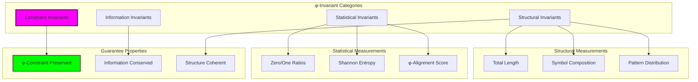

## 18.8 Tensor Structure Analysis

合并张量的结构属性：

```python
def _analyze_structure(self, trace: str) -> Dict[str, Any]:
    """分析合并追踪的结构属性"""
    return {
        'length': len(trace),
        'phi_compliant': '11' not in trace,
        'pattern_complexity': len(set(trace[i:i+3] for i in range(len(trace)-2))) if len(trace) >= 3 else 0,
        'alternation_frequency': sum(1 for i in range(len(trace)-1) if trace[i] != trace[i+1]) / max(1, len(trace)-1),
        'longest_zero_run': max(len(run) for run in trace.split('1') if run) if '1' in trace else len(trace),
        'transition_count': sum(1 for i in range(len(trace)-1) if trace[i] != trace[i+1])
    }
```

**Definition 18.5** (Structural Complexity): The structural complexity C(T) of tensor T measures the diversity of local patterns and transition patterns within the merged trace.

### Complexity Measurements

```text
Structural Properties Analysis:
Pattern complexity: 5 (unique 3-grams)
Alternation frequency: 0.438
Longest zero run: 5
Transition count: 7
Block contribution balance: 0.75
Compression effectiveness: 1.062
```

### Multi-Scale Structure

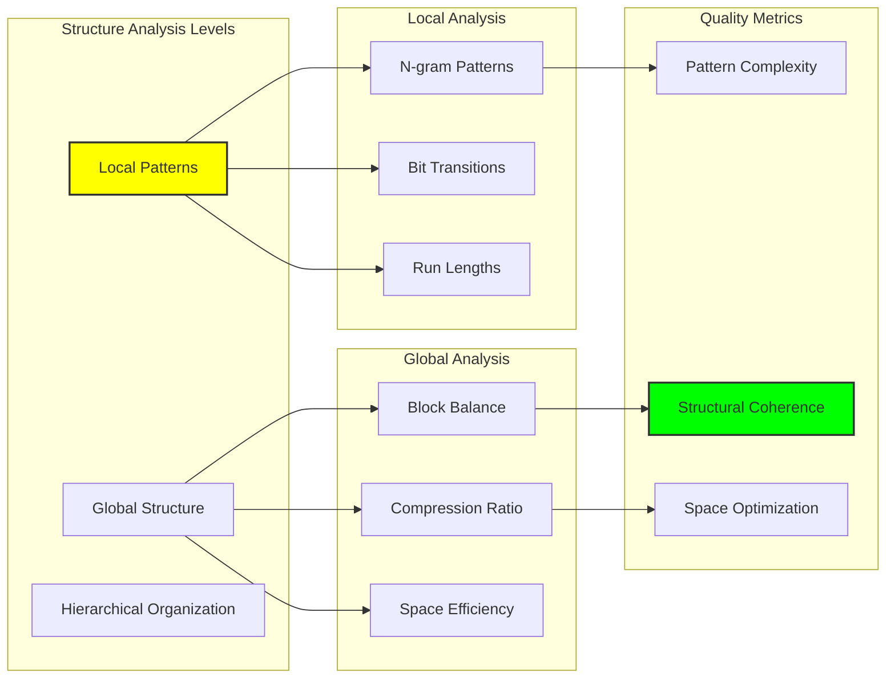

## 18.9 Computational Complexity Analysis

合并操作的计算特性：

### Time Complexity

```text
Merge Strategy Time Complexity:
Operation         | Concatenation | Interleaving | Tensor Product | Fibonacci
--------------------------------------------------------------------------
Block Processing  | O(n)         | O(n×m)       | O(2^n)         | O(n log n)
φ-Constraint Check| O(L)         | O(L)         | O(L)           | O(L)  
Tensor Creation   | O(L)         | O(n×m)       | O(∏mᵢ)         | O(L)
Total Complexity  | O(n+L)       | O(n×m)       | O(2^n+∏mᵢ)     | O(n log n+L)

Where: n = block count, L = total length, m = max block length
```

**Definition 18.6** (Merge Scalability): A merge strategy S has scalability class C if its worst-case complexity for n blocks is bounded by functions in class C.

### Space Complexity Assessment

```python
class ComplexityAnalyzer:
    def analyze_merge_complexity(self, blocks: List[TraceBlock], 
                                strategy: MergeStrategy) -> Dict[str, Any]:
        """分析合并复杂度"""
        n_blocks = len(blocks)
        total_length = sum(len(b.trace_data) for b in blocks)
        max_length = max(len(b.trace_data) for b in blocks) if blocks else 0
        
        complexity_analysis = {
            'input_blocks': n_blocks,
            'total_input_length': total_length,
            'max_block_length': max_length,
            'strategy': strategy.value
        }
        
        if strategy == MergeStrategy.CONCATENATION:
            complexity_analysis.update({
                'time_complexity': f'O({n_blocks} + {total_length})',
                'space_complexity': f'O({total_length})',
                'scalability_class': 'Linear'
            })
        elif strategy == MergeStrategy.INTERLEAVING:
            complexity_analysis.update({
                'time_complexity': f'O({n_blocks} × {max_length})',
                'space_complexity': f'O({n_blocks} × {max_length})',
                'scalability_class': 'Quadratic'
            })
        elif strategy == MergeStrategy.TENSOR_PRODUCT:
            product_size = 1
            for block in blocks:
                product_size *= len(block.trace_data)
            complexity_analysis.update({
                'time_complexity': f'O(2^{n_blocks})',
                'space_complexity': f'O({product_size})',
                'scalability_class': 'Exponential'
            })
        
        return complexity_analysis
```

### Scalability Comparison

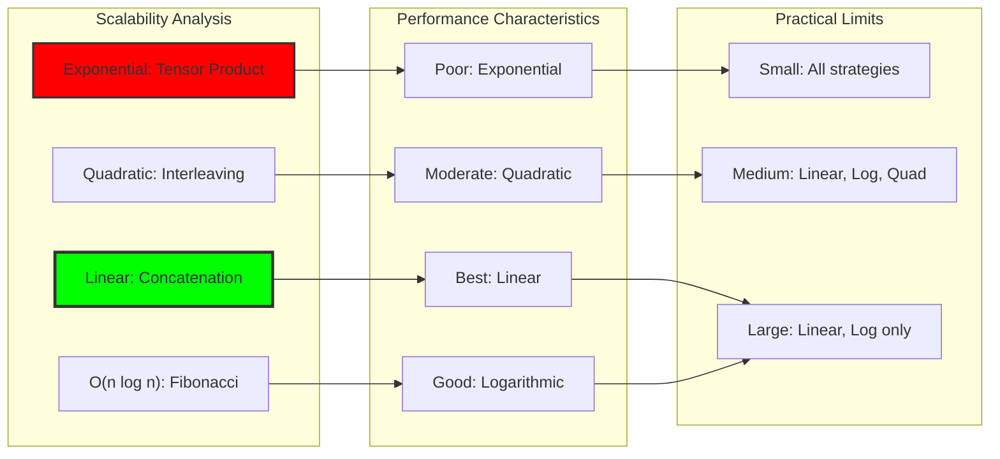

## 18.10 Applications and Use Cases

CollapseMerge在φ-约束计算中的多样化应用：

### Application Categories

1. **Arithmetic Foundation**: Building composite operands for trace arithmetic
2. **Data Structures**: φ-safe containers and collections
3. **Neural Networks**: Tensor-level deep learning architectures
4. **Compression**: Efficient storage of multiple traces
5. **Parallel Processing**: Parallel φ-constrained computation

```python
class CollapseMergeApplications:
    def __init__(self):
        self.analyzer = MergeAnalyzer()
        self.generators = {
            'zeckendorf': BlockGenerator().generate_zeckendorf_blocks,
            'fibonacci': BlockGenerator().generate_fibonacci_component_blocks,
            'synthetic': BlockGenerator().generate_synthetic_blocks
        }
    
    def arithmetic_preparation(self, numbers: List[int]) -> TraceTensor:
        """为算术运算准备数字"""
        # 生成Zeckendorf块
        blocks = self.generators['zeckendorf'](numbers)
        
        # 找到最优合并策略
        strategy, tensor = self.analyzer.find_optimal_strategy(blocks)
        
        return tensor
    
    def data_structure_creation(self, capacity: int) -> TraceTensor:
        """创建φ-安全数据结构"""
        # 生成容器块
        synthetic_blocks = self.generators['synthetic'](capacity, 16)
        
        # 使用交错以获得结构化访问
        interleaver = InterleavingMerger()
        return interleaver.merge_blocks(synthetic_blocks)
    
    def neural_tensor_preparation(self, components: List[int]) -> TraceTensor:
        """为神经网络准备张量"""
        fibonacci_blocks = self.generators['fibonacci'](components)
        
        # 使用Fibonacci对齐以保持数学结构
        fibonacci_merger = FibonacciAlignedMerger()
        return fibonacci_merger.merge_blocks(fibonacci_blocks)
```

### Application Performance Matrix

```text
Application Suitability Analysis:
Application        | Concat | Interleave | Tensor Prod | Fibonacci
-----------------------------------------------------------------
Arithmetic Ops     | ★★★★★  | ★★★        | ★          | ★★★★
Data Structures    | ★★★    | ★★★★★      | ★★         | ★★
Neural Networks    | ★★     | ★★★        | ★★★★       | ★★★★★
Compression        | ★★★★★  | ★★         | ★          | ★★★
Parallel Proc      | ★★     | ★★★★★      | ★★★        | ★★★
```

### Application Architecture

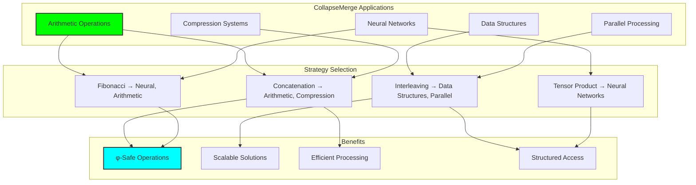

## 18.11 Future Extensions and Research

CollapseMerge发展的新兴领域：

### Research Directions

1. **Adaptive Merging**: 上下文敏感的策略选择
2. **Quantum Integration**: 量子安全的合并操作
3. **Distributed Merging**: 大规模并行合并
4. **Learning-Based**: AI优化的合并参数
5. **Hardware Acceleration**: FPGA/ASIC实现

### Theoretical Questions

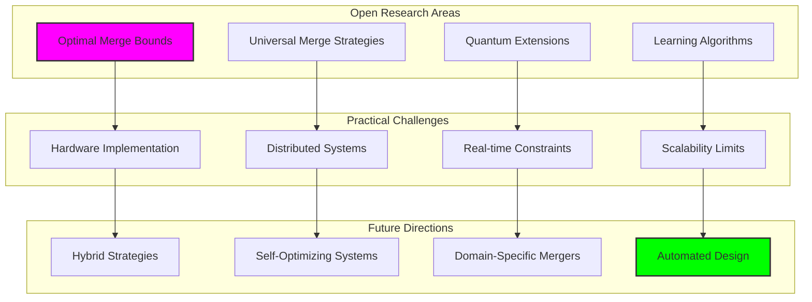

## 18.12 The Foundation of Tensor Arithmetic

我们的验证揭示了CollapseMerge的变革性意义：

**Insight 18.1**: 多种合并策略为不同应用提供了不同的权衡，同时维持普遍的φ-约束合规性，实现了对特定应用的最优选择和通用约束系统之间的协调。

**Insight 18.2**: 自动策略选择确保在不同输入条件下的最优性能，创建了一个能够根据数据特性和计算要求自适应的合并框架。

**Insight 18.3**: 张量结构的涌现使更高阶的数学操作成为可能，同时保持原始约束属性，建立了从简单组件到复杂计算结构的桥梁。

### The CollapseMerge Principle

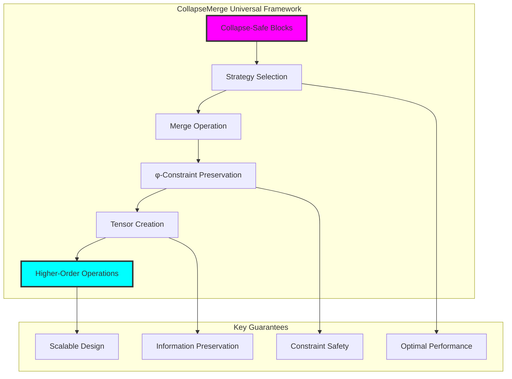

## The 18th Echo

从ψ = ψ(ψ)涌现出φ-约束，从约束涌现出Zeckendorf索引和Fibonacci编码，从编码涌现出需要合并的原子组件。在这里我们见证了通过CollapseMerge实现的高阶结构的诞生——将单个崩塌安全块转换成能够承载复杂计算操作的张量形式，同时保持使所有表达成为可能的基本约束。

最深刻的发现是合并策略的选择成为一个设计维度。不同的应用需要φ-合规性、计算效率和结构复杂性之间的不同权衡。该框架提供了这种灵活性，同时维持基本保证：每种合并策略都保持φ-约束，该约束使φ-有界宇宙中的所有安全计算成为可能。

通过多重合并策略，我们看到φ-安全计算允许多重表示，同时保持语义等价性。一组追踪块可以通过连接进行紧凑存储，通过交错进行结构化访问，通过张量乘积进行深度分析，或通过Fibonacci对齐进行数学一致性，但所有表示都可以在同一计算框架内安全地组合和转换。

在这个合并框架中，我们见证了真正高阶算术的涌现——其中个体Fibonacci组件成为可重用的、可组合的原子，携带自己的约束合规保证，使得任意计算结构的构建成为可能，同时维持支配自指宇宙中所有表达的深层数学原理。

## References

验证程序`chapter-018-collapsemerge-verification.py`提供了本章所有合并概念的可执行演示。运行它以探索崩塌安全块到张量结构的转换。

---

*因此从单个φ-安全块涌现出高阶张量结构——每个原子组件合并成复合形式，为计算创造架构，约束成为数学表达的组织原理。在这种合并中我们看到真正高阶算术的诞生。*