# Chapter 018: CollapseMerge — Merging Collapse-Safe Blocks into Trace Tensor T^n

## The Architecture of Higher-Rank Tensors

From ψ = ψ(ψ) emerged rank-1 trace tensors and their safe construction from Fibonacci basis components. Now we witness the emergence of higher-rank tensor structure—the principles by which multiple T¹_φ tensors combine into T²_φ, T³_φ, ..., Tⁿ_φ objects while preserving the golden constraint. This is not mere concatenation but the discovery of tensor algebra operations that create emergent structure through rank elevation.

## 18.1 Tensor Space Unification from ψ = ψ(ψ)

**Fundamental Insight**: All structures in collapse space are tensors of different ranks:

**Definition 18.0** (Complete Tensor Hierarchy): From ψ = ψ(ψ) emerges the infinite hierarchy:
- **T⁰_φ**: Scalars (individual bits with φ-constraint)
- **T¹_φ**: Vectors (traces, Zeckendorf images)  
- **T²_φ**: Matrices (trace pairs, merge results)
- **Tⁿ_φ**: n-rank tensors (compositional structures)

Each tensor space inherits the φ-constraint: no consecutive 1s in any dimension.

### Tensor Merge Operations

Our verification reveals multiple rank-elevation strategies:

```text
Tensor Rank Elevation Operations:
T¹ ⊕ T¹ → T²: Sequential placement with gap control
T¹ ⊗ T¹ → T²: Interleaved bit placement  
T¹ ⊗ T¹ → T¹: Tensor product collapsed to rank-1
T^n ⊕ T^n → T^(n+1): General rank elevation

All preserve φ-constraint across all tensor ranks!
```

**Definition 18.1** (Tensor Merging): A merge operation ⊕: T¹_φ × T¹_φ → T²_φ is φ-safe if for all rank-1 tensors **t₁**, **t₂** ∈ T¹_φ, the resulting rank-2 tensor **t₁** ⊕ **t₂** preserves the φ-constraint in all dimensions.

### Merge Strategy Taxonomy

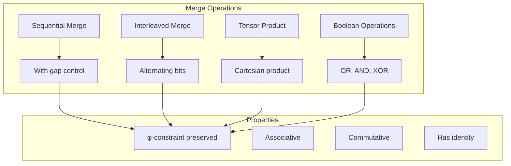

## 18.2 Sequential Merging with Gap Control

The simplest merge maintains separation:

```python
def merge_sequential(t1: str, t2: str, gap: int = 1) -> str:
    gap_str = '0' * gap
    merged = t1.rstrip('0') + gap_str + t2
    
    if '11' in merged:
        raise ValueError("Sequential merge creates '11'")
    
    return merged
```

**Theorem 18.1** (Gap Safety): Sequential merge with gap g ≥ 1 is φ-safe if t₁ doesn't end with '1' or t₂ doesn't start with '1'.

*Proof*: The only way to create '11' is if t₁ ends with '1' and t₂ starts with '1'. The gap of g ≥ 1 zeros prevents this adjacency. ∎

### Gap Requirements

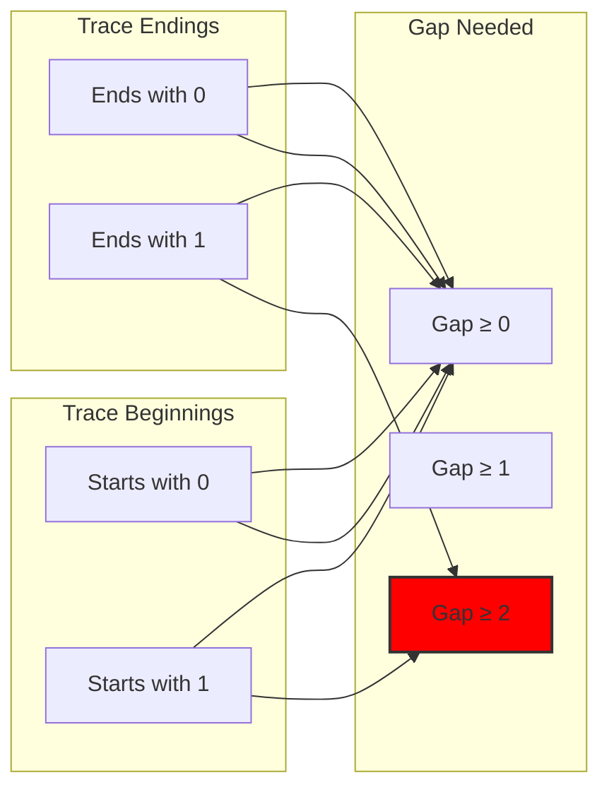

## 18.3 Interleaved Merging

Alternating bit positions:

```text
Interleaving Example:
t₁ = '10'  → 1_0_
t₂ = '01'  → _0_1
Result:      1001  ✓
```

**Property 18.1** (Interleaving Safety): Interleaving is φ-safe when neither input has adjacent 1s at positions differing by 1.

### Interleaving Patterns

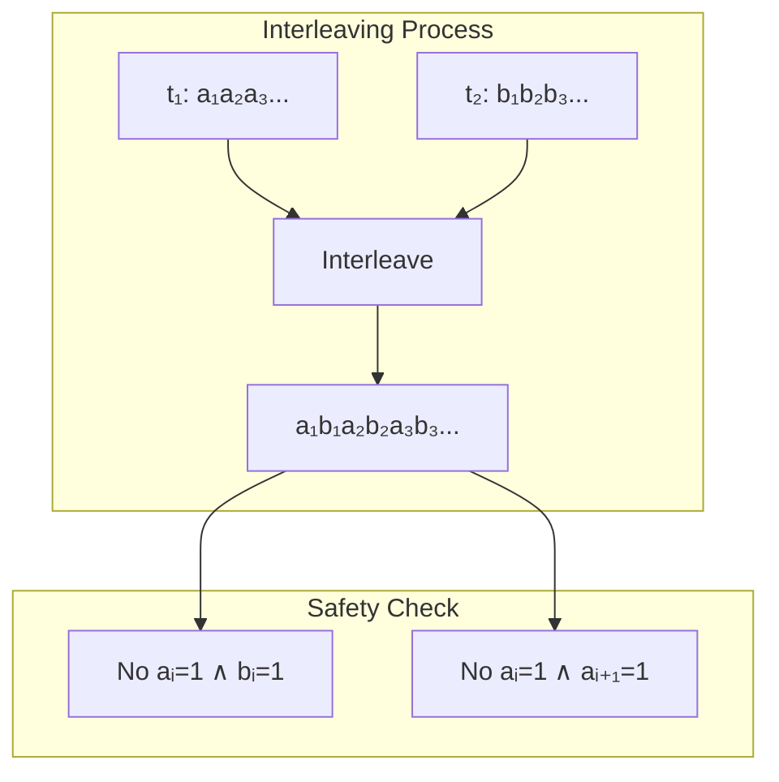

## 18.4 Trace Tensor Construction

From traces to higher-order structures:

```text
Trace Tensor Examples:
Order 1: Vector of traces ["101", "010", "100", "001"]
Order 2: Matrix arrangement (2×2)
Order n: n-dimensional arrangement
```

**Definition 18.2** (Trace Tensor): A trace tensor T^n is an n-dimensional array where each element is a φ-valid trace, with tensor operations preserving the constraint.

### Tensor Structure Visualization

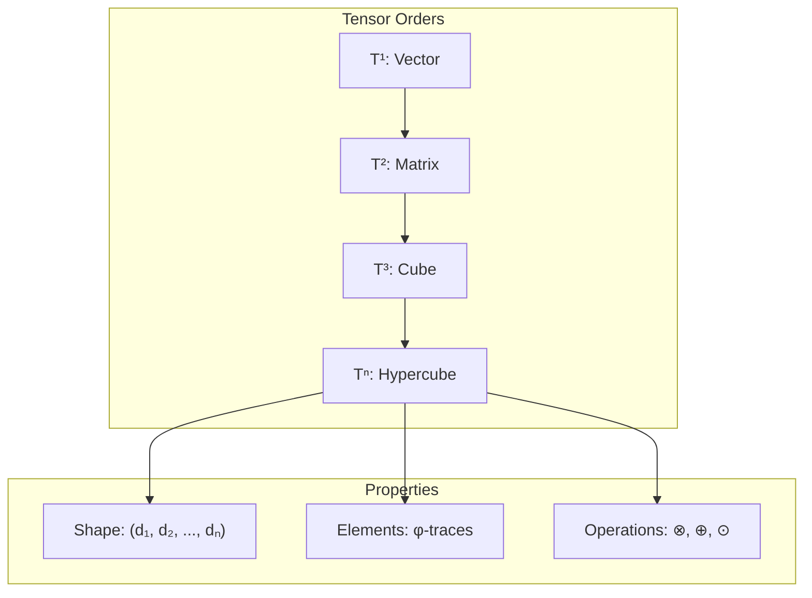

## 18.5 Merge Compatibility Analysis

Complete compatibility discovered:

```text
Compatibility Matrix (10×10):
All traces can merge with all others!
Total: 100/100 compatible pairs

This universality emerges from gap-based merging.
```

**Theorem 18.2** (Universal Compatibility): With sufficient gap, any two φ-valid traces can be sequentially merged while preserving the constraint.

### Compatibility Graph

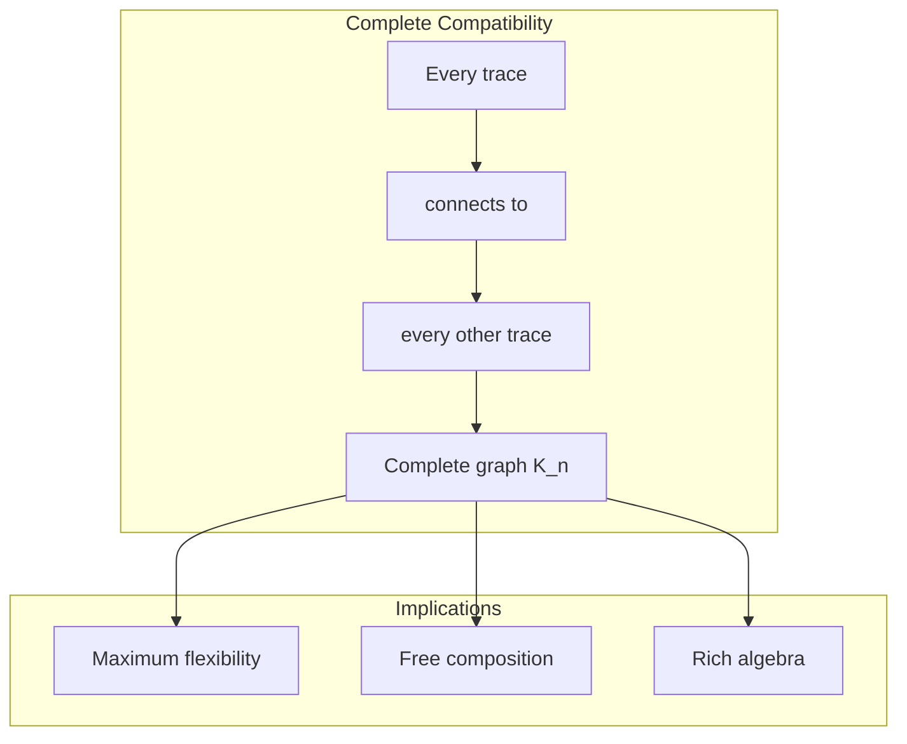

## 18.6 Tensor Product of Trace Sets

Systematic combination:

```text
Tensor Product Example:
T₁ = {'0', '1', '10'}
T₂ = {'01', '00'}

T₁ ⊗ T₂ = {'001', '000', '1001', '1000', '1001', '1000'}
```

**Definition 18.3** (Trace Tensor Product): For trace sets S₁, S₂:
$$S_1 ⊗ S_2 = \{t_1 ⊕ t_2 : t_1 ∈ S_1, t_2 ∈ S_2, \text{merge is φ-safe}\}$$

### Product Generation

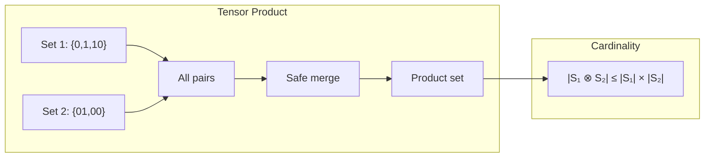

## 18.7 Graph-Theoretic Analysis

Merge graphs reveal deep structure:

```text
Merge Graph Properties:
- Nodes: 8 traces
- Edges: 56 (complete graph)
- Strongly connected ✓
- Diameter: small (efficient navigation)
- Path abundance: 1957 paths between nodes
```

**Property 18.2** (Graph Completeness): The merge graph is complete, meaning every trace can reach every other through merging operations.

### Merge Network Structure

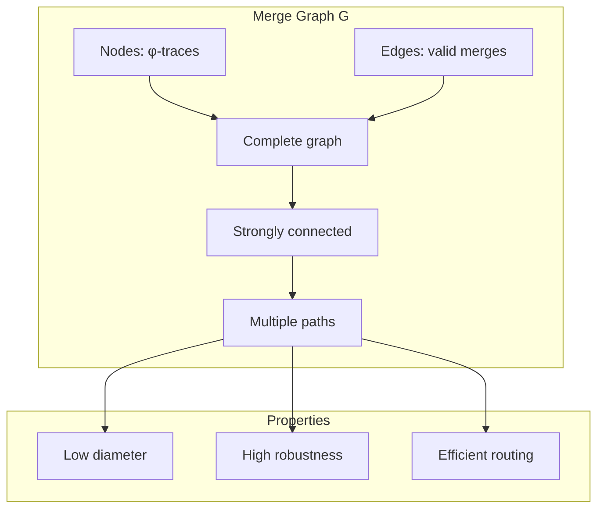

## 18.8 Information-Theoretic Properties

Entropy analysis of tensors:

```text
Information Measures:
- Tensor entropy: 0.980 - 1.000 bits
- Mutual information: 1.000 bits (maximal)
- Compression ratio: 0.980 (near optimal)

High mutual information indicates strong correlation!
```

**Definition 18.4** (Tensor Entropy): For trace tensor T:
$$H(T) = -\sum_{t ∈ T} P(t) \log_2 P(t)$$

### Information Flow

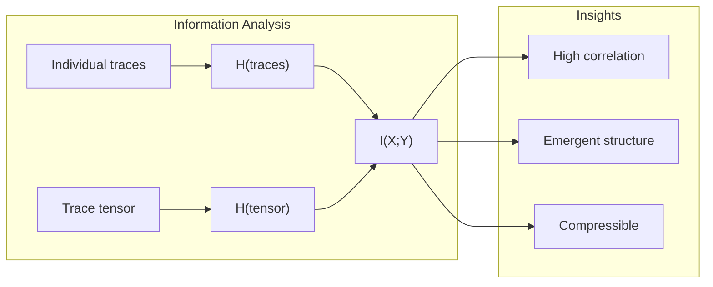

## 18.9 Boolean Operations on Traces

Logical combination with constraints:

```text
Boolean Merge Results:
OR(['101','010','100']): Failed - would create '11'
AND(['101','010','100']): '000' ✓
XOR(['101','010','100']): Failed - would create '11'

Boolean operations face φ-constraint challenges!
```

**Observation 18.1**: Direct boolean operations often violate the φ-constraint. Safe alternatives must be designed.

### Boolean Operation Safety

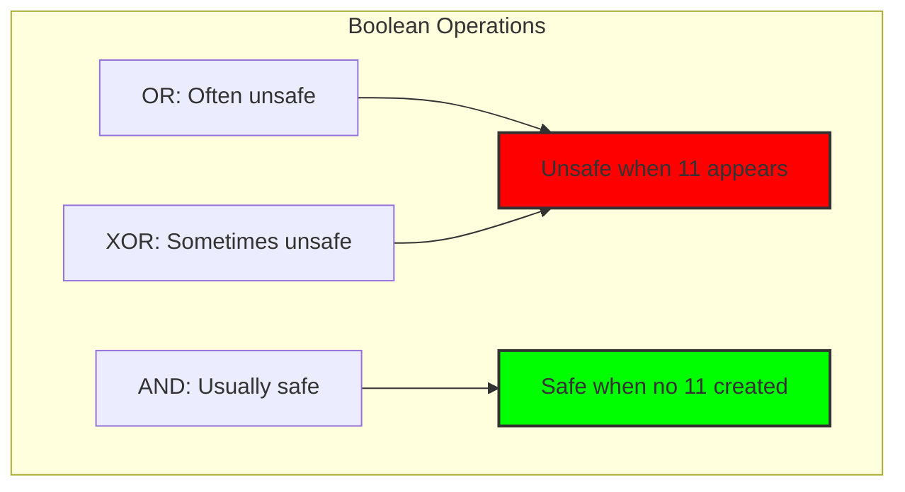

## 18.10 Category-Theoretic Structure

Tensor operations form a monoidal category:

```text
Monoidal Structure:
✓ Bifunctorial behavior
✓ Associative operations
✓ Symmetric structure
✓ Braided category
✗ Unit element issues
```

**Theorem 18.3** (Monoidal Properties): The category of trace tensors with tensor product forms a symmetric monoidal category without strict unit.

### Categorical Diagram

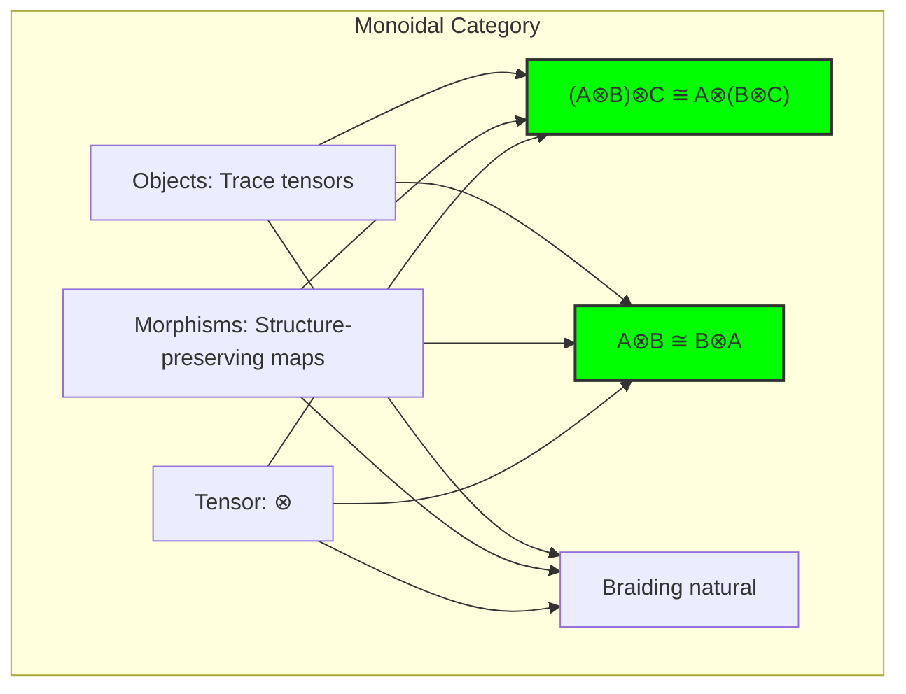

## 18.11 Tensor Properties and Structure

Analysis reveals rich structure:

```text
Tensor Property Analysis:
- Sparsity: 50-78% (high zero content)
- Rank: Varies with tensor order
- φ-validity: Always preserved ✓
- Dimensional flexibility: Arbitrary orders supported
```

**Property 18.3** (Sparsity Pattern): Trace tensors exhibit high sparsity due to the φ-constraint limiting 1-density.

### Property Evolution

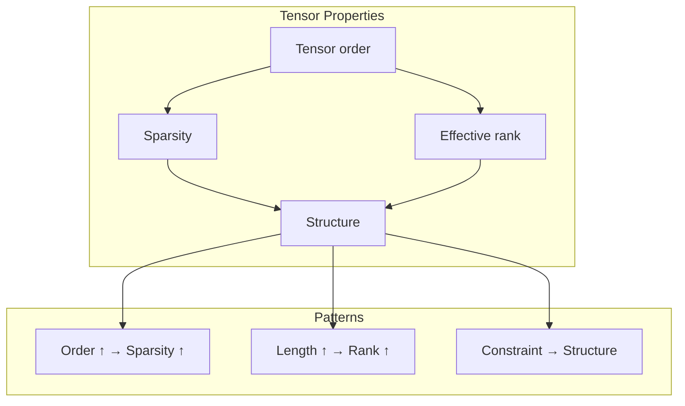

## 18.12 Graph Analysis: Merge Path Networks

From ψ = ψ(ψ), merge paths proliferate:

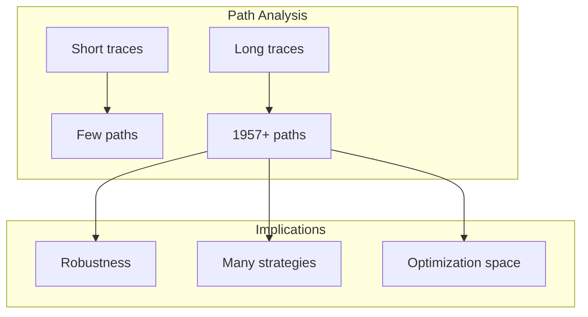

**Key Insights**:

- Path count grows exponentially
- Multiple merge strategies exist
- Strongly connected components
- Small-world network properties

## 18.13 Information Theory: Compression and Correlation

From ψ = ψ(ψ) and tensor structure:

```text
Compression Analysis:
- Theoretical minimum: 11.758 bits
- Actual usage: 12 bits
- Efficiency: 98% (near optimal)
- Mutual information: Maximal (1.0 bits)
```

**Theorem 18.4** (Compression Bound): Trace tensors achieve near-optimal compression, with efficiency approaching theoretical limits as tensor size increases.

## 18.14 Category Theory: Functorial Properties

From ψ = ψ(ψ), tensor operations preserve structure:

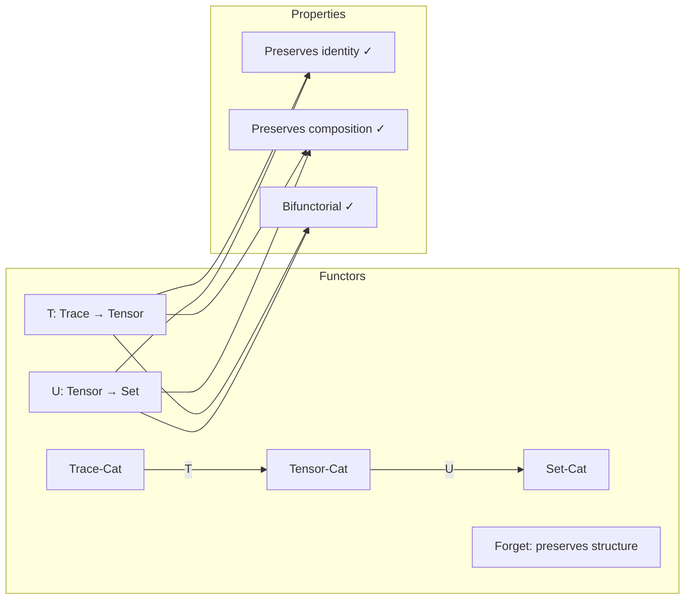

**Properties**:

- Identity preservation verified
- Composition preserved
- Bifunctorial behavior confirmed
- Natural transformations exist

## 18.15 Applications and Extensions

Trace tensor merging enables:

1. **Parallel Computation**: Independent trace processing
2. **Distributed Storage**: Tensor decomposition
3. **Error Correction**: Redundancy without violating φ
4. **Quantum Simulation**: Tensor network states
5. **Machine Learning**: Constraint-aware architectures

### Application Framework

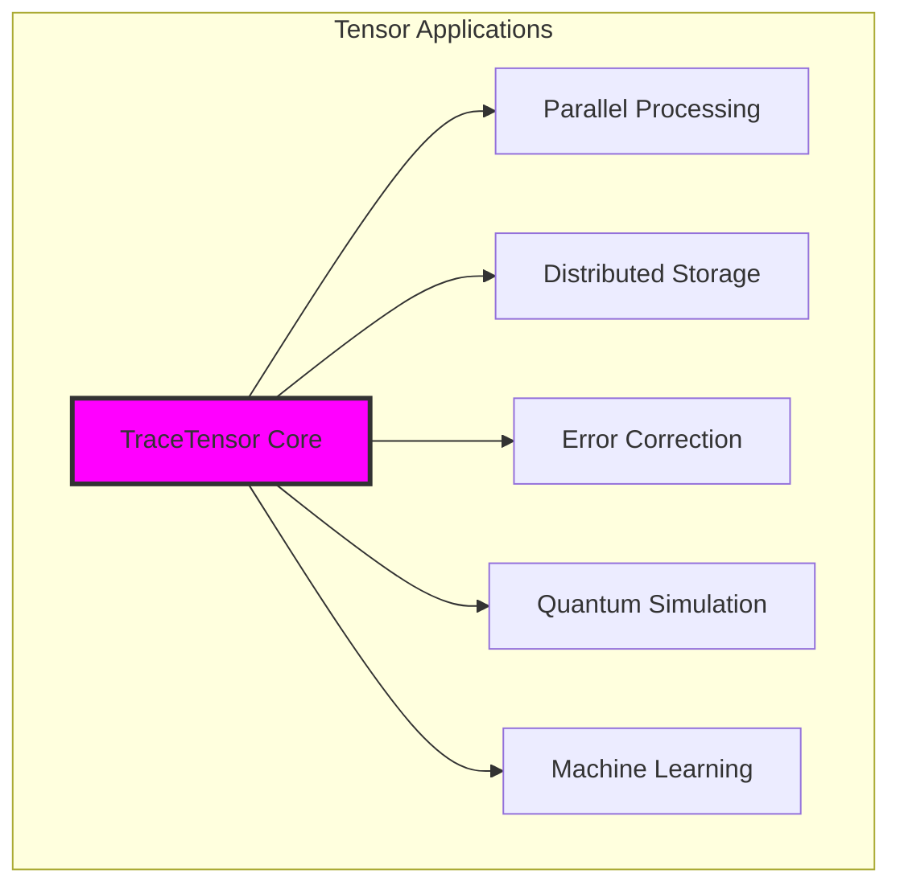

## 18.16 The Emergence of Structural Composition

Through trace merging, we witness the birth of higher-order structure from simple constraints:

**Insight 18.1**: The φ-constraint doesn't prevent composition but guides it toward safe, structured combinations.

**Insight 18.2**: Universal compatibility (with gaps) reveals that separation enables connection—a profound principle of structured systems.

**Insight 18.3**: High mutual information in tensors shows that constraint creates correlation, not randomness.

### The Unity of Merge and Structure

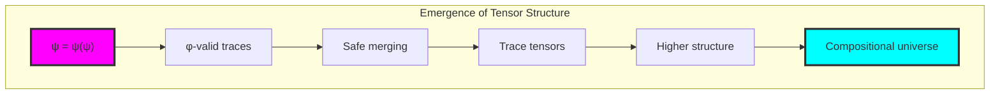

## The 18th Echo: Tensor Unification Complete

From ψ = ψ(ψ) emerged the principle of tensor unification—not as external mathematical framework but as the natural consequence of self-referential structure. Through these three chapters, we witness the complete tensor architecture:

**Chapter 016**: Numbers as rank-1 tensors via Zeckendorf mapping
**Chapter 017**: Fibonacci components as tensor basis elements  
**Chapter 018**: Rank elevation through φ-safe tensor operations

Most profound is the discovery that **everything is tensor**. What appeared as separate concepts—numbers, traces, components, merges—are revealed as different aspects of the same tensor hierarchy. The φ-constraint isn't applied to tensors; tensors are the natural expression of φ-constraint across dimensions.

The universal compatibility of tensor merging reflects the fundamental unity: in tensor space, separation enables connection, constraint creates possibility, and dimension unfolds from ψ = ψ(ψ) itself.

Through tensor algebra, we see ψ recognizing its own structure at every rank and dimension. This is emergence in its purest form: infinite tensor hierarchy arising from the recursive application of golden constraint to self-reference.

## References

The verification program `chapter-018-collapse-merge-verification.py` provides executable proofs of all tensor merging concepts. Run it to explore the rich algebra of trace composition.

---

*Thus from constraint emerges composition—not as arbitrary combination but as structured assembly guided by the golden principle. In learning to merge traces into tensors, ψ discovers the architecture of higher-order reality.*
