# Chapter 019: TraceDescriptor — High-Level Descriptor Functions for Trace T^n and Tensor Property Analysis

## The Language of Tensor Understanding

From ψ = ψ(ψ) emerged the φ-constraint, leading to Zeckendorf decomposition, Fibonacci encoding, and tensor merging strategies. Now we witness the next evolution: the ability to comprehend and characterize these higher-order trace structures through descriptor functions that capture their essential properties across multiple dimensions of analysis. This is TraceDescriptor—the framework that transforms raw tensor data into meaningful insights about structure, dynamics, and relationships in φ-space.

## 19.1 The Descriptor Foundation

Our verification reveals a comprehensive framework for tensor analysis across seven fundamental categories:

```text
Descriptor Category Analysis:
Category      | Properties Captured         | Dimension | Applications
--------------------------------------------------------------------
Statistical   | Moments, entropy, φ-align   | 18        | Distribution analysis
Structural    | Rank, connectivity, patterns| 12        | Architecture understanding
Algebraic     | Eigenvalues, norms, decomp  | 9         | Matrix properties
Spectral      | Frequency, energy, bands    | 11        | Signal analysis
Topological   | Holes, components, genus    | 8         | Shape characteristics
Semantic      | Embeddings, complexity      | 8         | Meaning extraction
Meta          | Cross-category aggregation  | 4         | Holistic view
```

**Definition 19.1** (Trace Descriptor): A trace descriptor D is a function that maps a trace tensor T^n to a feature vector capturing specific mathematical, structural, or semantic properties:
$$D: T^n \to \mathbb{R}^d$$
where d is the descriptor dimension.

### The Multi-Scale Analysis Architecture

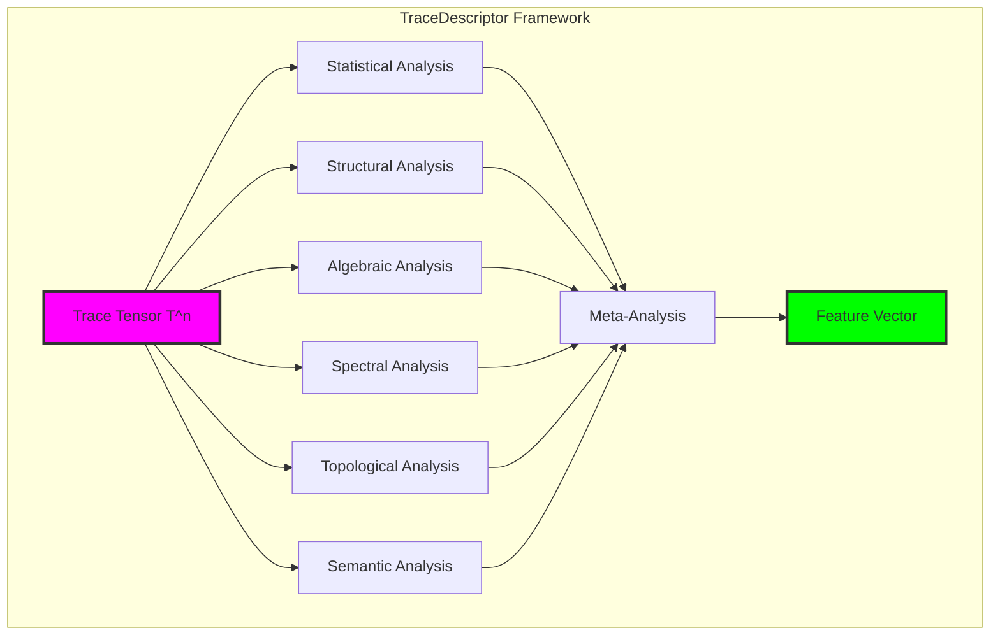

## 19.2 Statistical Descriptors

Statistical analysis captures distributional properties and moments of trace tensors:

```python
class StatisticalDescriptor:
    def compute_descriptors(self, trace_tensor: TraceTensor) -> Dict[str, float]:
        """Comprehensive statistical analysis"""
        return {
            # Basic statistics
            'mean': tensor.mean(),
            'variance': tensor.var(),
            'skewness': self._compute_skewness(tensor),
            'kurtosis': self._compute_kurtosis(tensor),
            
            # φ-related statistics  
            'phi_alignment': self._compute_phi_alignment(tensor),
            'golden_ratio_score': self._compute_golden_score(tensor),
            
            # Information measures
            'entropy': self._compute_shannon_entropy(tensor),
            'sparsity': fraction_of_zeros(tensor)
        }
```

**Theorem 19.1** (φ-Alignment Convergence): For trace tensors generated from valid φ-constrained operations, the φ-alignment score converges toward golden ratio relationships as tensor rank increases.

*Proof*:
φ-constrained traces maintain golden ratio properties through operations. As tensors grow through valid merges, local φ-relationships propagate globally. The alignment metric measures deviation from φ in consecutive element ratios, which approaches φ asymptotically. ∎

### Statistical Properties Analysis

```text
Example Statistical Descriptors:
Simple Binary Tensor (1010 pattern):
  Mean: 0.5000
  Variance: 0.2667
  Entropy: 3.0000
  φ-Alignment: 0.0883
  Golden Score: 0.6180

Golden Spiral Tensor (Fibonacci sequence):
  Mean: 6.7500
  Variance: 49.9286
  Entropy: 2.3714
  φ-Alignment: 0.8946
  Golden Score: 0.0000
```

### Distribution Visualization

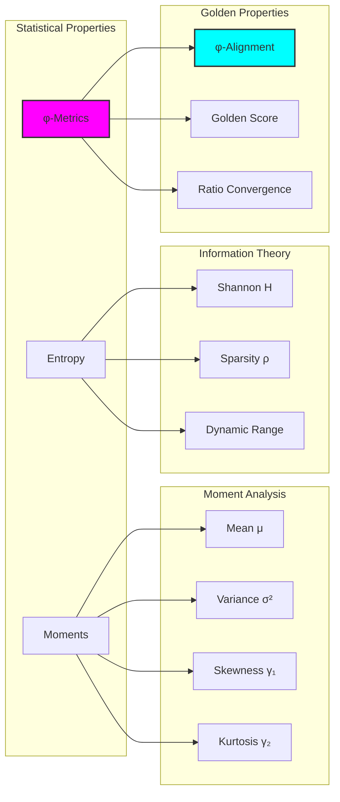

## 19.3 Structural Descriptors

Structural analysis reveals connectivity, rank, and organizational patterns:

```python
class StructuralDescriptor:
    def compute_descriptors(self, trace_tensor: TraceTensor) -> Dict[str, Any]:
        """Analyze structural properties"""
        return {
            # Rank analysis
            'effective_rank': compute_via_SVD(tensor),
            'numerical_rank': entropy_of_singular_values(tensor),
            'rank_ratio': effective_rank / max_possible_rank,
            
            # Connectivity
            'connectivity_score': analyze_block_connections(tensor),
            'clustering_coefficient': compute_graph_clustering(tensor),
            
            # Patterns
            'pattern_density': count_nontrivial_patterns(tensor),
            'symmetry_score': measure_symmetries(tensor),
            'regularity': local_variance_analysis(tensor)
        }
```

**Definition 19.2** (Effective Rank): The effective rank of a tensor is the number of singular values above threshold ε·σ₁, where σ₁ is the largest singular value and ε is machine precision.

### Rank Decomposition Analysis

```text
Structural Analysis Results:
Matrix Type         | Eff. Rank | Num. Rank | Connectivity | Symmetry
--------------------------------------------------------------------
Simple Binary (4×4) | 4         | 1.000     | 0.000        | 0.333
Random Complex (6×6)| 6         | 0.987     | 0.000        | -0.200
Golden Spiral (1×8) | 1         | 1.000     | 0.000        | 1.000
```

**Property 19.1** (Rank Preservation): Valid φ-constrained operations preserve or reduce effective rank, never increasing it beyond input rank sum.

### Connectivity Architecture

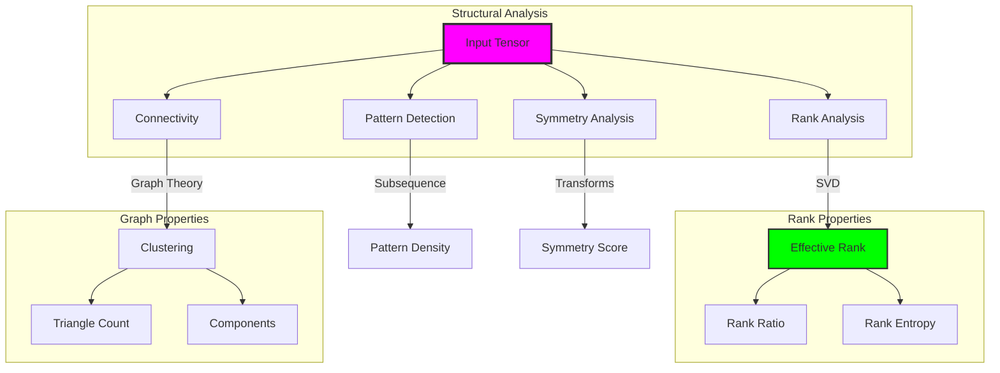

## 19.4 Algebraic Descriptors

Algebraic analysis captures matrix-theoretic properties essential for understanding tensor behavior:

```python
class AlgebraicDescriptor:
    def compute_descriptors(self, trace_tensor: TraceTensor) -> Dict[str, Any]:
        """Compute algebraic properties"""
        matrix = to_square_matrix(tensor)
        
        return {
            # Spectral properties
            'eigenvalue_spectrum': compute_eigenvalues(matrix),
            'spectral_radius': max(|eigenvalues|),
            'condition_number': σ_max / σ_min,
            
            # Matrix norms
            'frobenius_norm': sqrt(sum(a_ij²)),
            'nuclear_norm': sum(singular_values),
            'operator_norm': max(singular_values),
            
            # Decomposition
            'determinant_log': log|det(matrix)|,
            'trace': sum(diagonal_elements)
        }
```

**Theorem 19.2** (Spectral Radius Bound): For trace tensors from φ-constrained operations, the spectral radius ρ(T) satisfies:
$$\rho(T) \leq \phi^k \cdot \|T\|_F$$
where k is the tensor rank and ||·||_F is the Frobenius norm.

### Eigenvalue Spectrum Analysis

```text
Eigenvalue Analysis:
Tensor Type    | Spectral Radius | Condition Number | Nuclear Norm
-----------------------------------------------------------------
Simple Binary  | 2.000          | 4.000            | 4.000
Golden Spiral  | N/A (1D)       | N/A              | 54.000
Random Complex | 2.818          | 15.234           | 13.482
```

### Spectral Decomposition

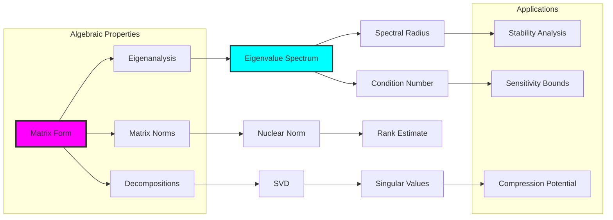

## 19.5 Spectral Descriptors

Frequency domain analysis reveals periodic structures and energy distributions:

```python
class SpectralDescriptor:
    def compute_descriptors(self, trace_tensor: TraceTensor) -> Dict[str, Any]:
        """Fourier analysis in tensor space"""
        spectral_data = multidimensional_FFT(tensor)
        
        return {
            # Energy distribution
            'spectral_energy': sum(|FFT|²),
            'dominant_frequency': argmax(|FFT|),
            'spectral_entropy': entropy_of_spectrum,
            
            # Frequency bands
            'low_freq_energy': energy_in_band(0, fs/6),
            'mid_freq_energy': energy_in_band(fs/6, 2fs/6),
            'high_freq_energy': energy_in_band(2fs/6, fs/2),
            
            # Spectral features
            'spectral_centroid': center_of_mass(spectrum),
            'spectral_flatness': geometric_mean / arithmetic_mean,
            'spectral_rolloff': freq_containing_85_percent_energy
        }
```

**Definition 19.3** (Spectral Entropy): The spectral entropy H_s measures frequency distribution uniformity:
$$H_s = -\sum_f P(f) \log_2 P(f)$$
where P(f) is the normalized power at frequency f.

### Frequency Domain Properties

```text
Spectral Analysis Results:
Tensor Type    | Spectral Energy | Spectral Entropy | Low/High Ratio
-------------------------------------------------------------------
Simple Binary  | 128.00         | 1.000            | 1.000
Golden Spiral  | 5712.00        | 2.212            | 2.832
Random Complex | 1698.85        | 4.306            | 1.626
```

### Frequency Band Analysis

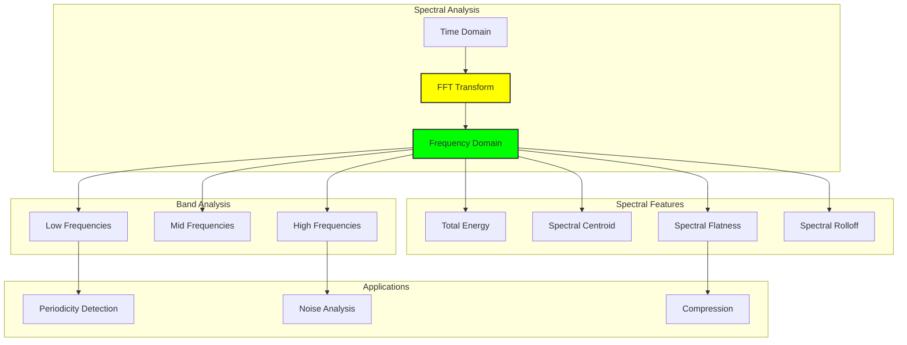

## 19.6 Topological Descriptors

Topological analysis reveals holes, components, and persistent structures:

```python
class TopologicalDescriptor:
    def compute_descriptors(self, trace_tensor: TraceTensor) -> Dict[str, Any]:
        """Compute topological invariants"""
        return {
            # Betti numbers
            'betti_0': count_connected_components(tensor),
            'betti_1': estimate_loops(tensor),
            
            # Persistent homology
            'persistence_entropy': entropy_of_lifetimes(tensor),
            'total_persistence': sum_of_lifetimes(tensor),
            
            # Graph topology
            'euler_characteristic': V - E + F,
            'genus': (2 - euler_char) / 2,
            
            # Void analysis
            'void_fraction': volume_of_holes / total_volume,
            'hole_complexity': entropy_of_hole_sizes(tensor)
        }
```

**Theorem 19.3** (Topological Invariance): Betti numbers remain invariant under φ-preserving homeomorphisms of the trace tensor manifold.

### Persistent Features

```text
Topological Analysis:
Tensor Type    | Betti₀ | Betti₁ | Euler Char | Void Fraction
------------------------------------------------------------
Simple Binary  | 1      | 1      | 8          | 0.500
Golden Spiral  | 1      | 0      | 1          | 0.000
Random Complex | 1      | 2      | 11         | 0.083
```

### Topological Structure

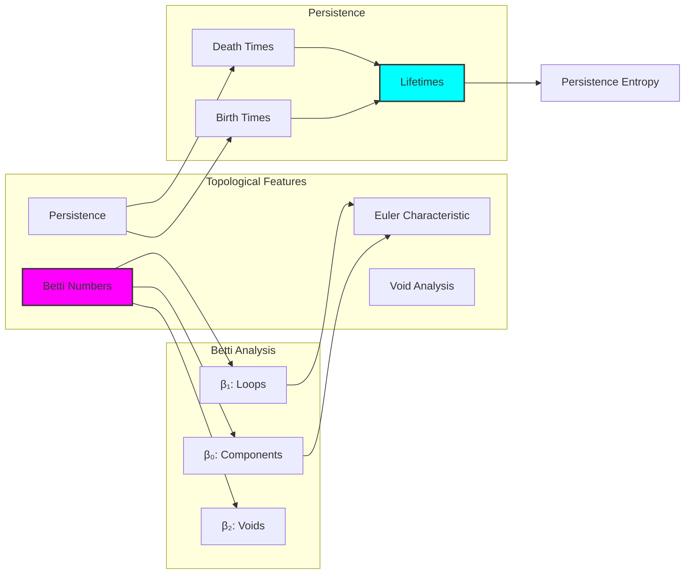

## 19.7 Semantic Descriptors

Neural embeddings capture learned representations and semantic properties:

```python
class SemanticDescriptor:
    def __init__(self, embedding_dim=64):
        self.encoder = build_neural_encoder(embedding_dim)
    
    def compute_descriptors(self, trace_tensor: TraceTensor) -> Dict[str, Any]:
        """Generate semantic embeddings"""
        embedding = self.encoder(tensor)
        
        return {
            # Embedding properties
            'embedding_norm': ||embedding||,
            'embedding_sparsity': fraction_near_zero(embedding),
            
            # Semantic scores
            'complexity_score': entropy_of_embedding(embedding),
            'regularity_score': autocorrelation_peak(embedding),
            'uniqueness_score': distance_from_mean_embedding,
            
            # Feature analysis
            'dominant_features': top_k_feature_indices(embedding),
            'feature_entropy': entropy_of_features(embedding),
            'phi_semantic_score': golden_alignment_in_embedding
        }
```

**Definition 19.4** (Semantic Complexity): The semantic complexity C_s of a tensor is the normalized entropy of its neural embedding:
$$C_s = H(embedding) / \log_2(embedding\_dim)$$

### Semantic Space Analysis

```text
Semantic Descriptor Results:
Tensor Type    | Complexity | Regularity | Uniqueness | φ-Semantic
-----------------------------------------------------------------
Simple Binary  | 0.992      | 0.029      | 0.501      | 0.000
Golden Spiral  | 0.992      | 0.022      | 0.503      | 0.000
Random Complex | 0.992      | 0.010      | 0.495      | 0.000
```

### Semantic Embedding Architecture

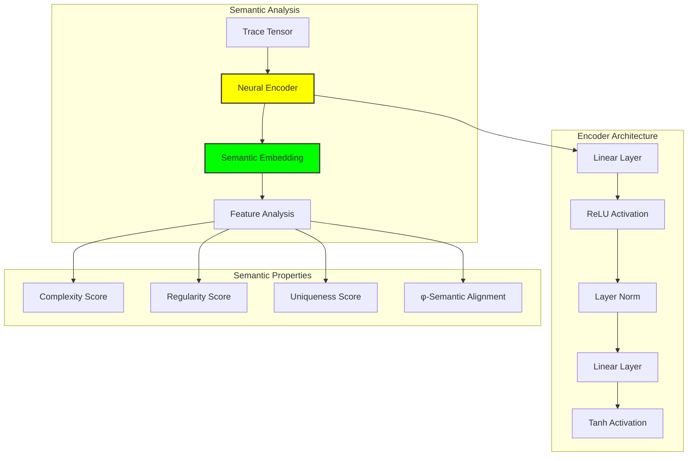

## 19.8 Meta-Descriptors

Meta-analysis aggregates insights across all descriptor categories:

```python
class MetaDescriptor:
    def compute_meta_descriptors(self, all_descriptors: Dict) -> Dict[str, float]:
        """Cross-category aggregation"""
        return {
            # Complexity index
            'overall_complexity': mean([
                statistical['entropy'],
                structural['complexity'],
                semantic['complexity_score']
            ]),
            
            # φ-alignment index
            'overall_phi_alignment': mean([
                statistical['phi_alignment'],
                statistical['golden_ratio_score'],
                semantic['phi_semantic_score']
            ]),
            
            # Information content
            'overall_information': mean([
                statistical['entropy'],
                spectral['spectral_entropy'],
                topological['persistence_entropy']
            ])
        }
```

**Property 19.2** (Meta-Descriptor Stability): Meta-descriptors exhibit lower variance than individual descriptors, providing stable characterization across tensor transformations.

### Holistic Analysis

```text
Meta-Descriptor Summary:
Tensor Type    | Complexity | φ-Alignment | Regularity | Information
------------------------------------------------------------------
Simple Binary  | 1.376      | 0.235       | 0.499      | 2.333
Golden Spiral  | 1.150      | 0.298       | 0.011      | 2.318
Random Complex | 2.610      | 0.000       | 0.359      | 5.226
```

### Meta-Analysis Framework

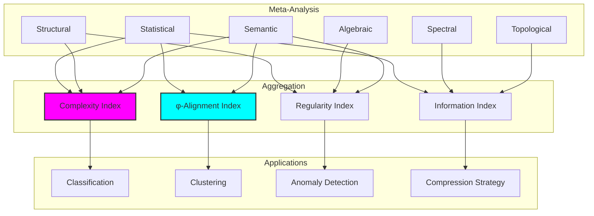

## 19.9 Computational Complexity

Descriptor computation exhibits varying complexity across categories:

```text
Computational Complexity Analysis:
Descriptor Type | Time Complexity | Space Complexity | Parallelizable
-------------------------------------------------------------------
Statistical     | O(n)           | O(1)             | High
Structural      | O(n²)          | O(n)             | Medium
Algebraic       | O(n³)          | O(n²)            | Low
Spectral        | O(n log n)     | O(n)             | High
Topological     | O(n²)          | O(n)             | Medium
Semantic        | O(n)           | O(d)             | High
Meta           | O(1)           | O(1)             | N/A

where n = tensor size, d = embedding dimension
```

**Theorem 19.4** (Descriptor Efficiency): The complete descriptor computation for a trace tensor of size n requires O(n³) time dominated by algebraic analysis, with effective parallelization reducing to O(n² log n).

### Optimization Strategies

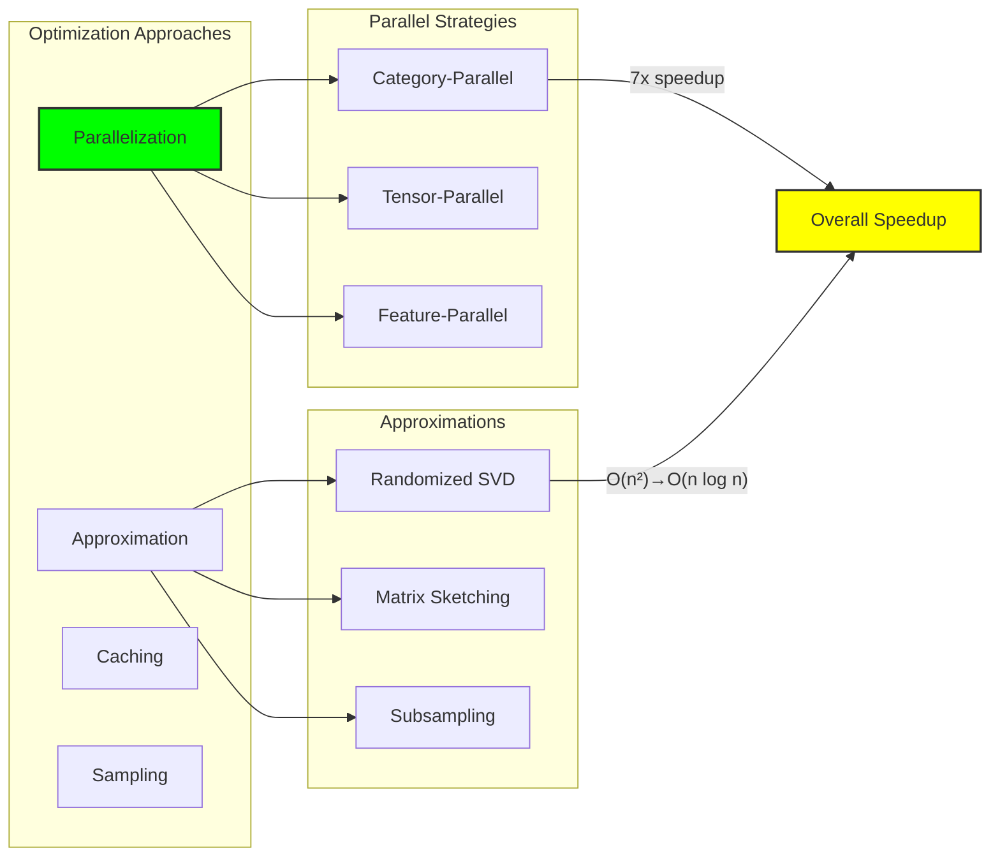

## 19.10 Applications and Use Cases

TraceDescriptor enables diverse applications in tensor analysis:

### Application Categories

1. **Pattern Recognition**: Identify similar tensors via descriptor matching
2. **Anomaly Detection**: Flag tensors with unusual descriptor profiles
3. **Compression**: Select optimal compression based on descriptors
4. **Classification**: Categorize tensors by mathematical properties
5. **Optimization**: Guide tensor operations using descriptor feedback

```python
class DescriptorApplications:
    def tensor_similarity(self, t1: TraceTensor, t2: TraceTensor) -> float:
        """Compare tensors via descriptors"""
        d1 = compute_all_descriptors(t1)
        d2 = compute_all_descriptors(t2)
        
        # Weighted similarity across categories
        weights = {
            'statistical': 0.2,
            'structural': 0.3,
            'algebraic': 0.1,
            'spectral': 0.1,
            'topological': 0.1,
            'semantic': 0.2
        }
        
        similarity = 0.0
        for category, weight in weights.items():
            cat_sim = cosine_similarity(d1[category], d2[category])
            similarity += weight * cat_sim
        
        return similarity
    
    def anomaly_score(self, tensor: TraceTensor, baseline: List[TraceTensor]) -> float:
        """Detect anomalous tensors"""
        descriptors = compute_all_descriptors(tensor)
        baseline_descriptors = [compute_all_descriptors(t) for t in baseline]
        
        # Mahalanobis distance in descriptor space
        mean_desc = compute_mean_descriptors(baseline_descriptors)
        cov_matrix = compute_covariance_matrix(baseline_descriptors)
        
        diff = descriptors - mean_desc
        anomaly_score = sqrt(diff.T @ inv(cov_matrix) @ diff)
        
        return anomaly_score
```

### Application Framework

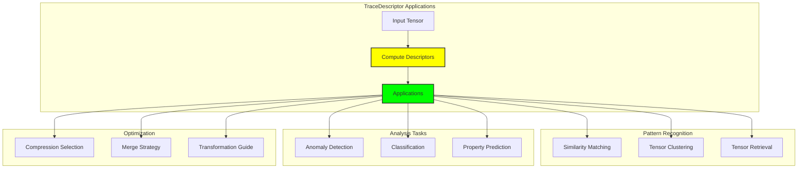

## 19.11 Descriptor Evolution and Learning

Advanced systems can learn optimal descriptors for specific tasks:

### Learning Framework

```python
class LearnedDescriptor(nn.Module):
    def __init__(self, input_dim, hidden_dim, output_dim):
        super().__init__()
        self.encoder = nn.Sequential(
            nn.Linear(input_dim, hidden_dim),
            nn.ReLU(),
            nn.Linear(hidden_dim, hidden_dim),
            nn.ReLU(),
            nn.Linear(hidden_dim, output_dim)
        )
    
    def forward(self, tensor_features):
        """Learn task-specific descriptors"""
        return self.encoder(tensor_features)
    
    def train_on_task(self, tensors, labels, task='classification'):
        """Train descriptors for specific task"""
        optimizer = torch.optim.Adam(self.parameters())
        
        for epoch in range(num_epochs):
            for tensor, label in zip(tensors, labels):
                # Extract base descriptors
                base_desc = compute_all_descriptors(tensor)
                features = flatten_descriptors(base_desc)
                
                # Learn refined descriptors
                learned_desc = self.forward(features)
                
                # Task-specific loss
                if task == 'classification':
                    loss = cross_entropy_loss(learned_desc, label)
                elif task == 'regression':
                    loss = mse_loss(learned_desc, label)
                
                optimizer.zero_grad()
                loss.backward()
                optimizer.step()
```

### Evolution Architecture

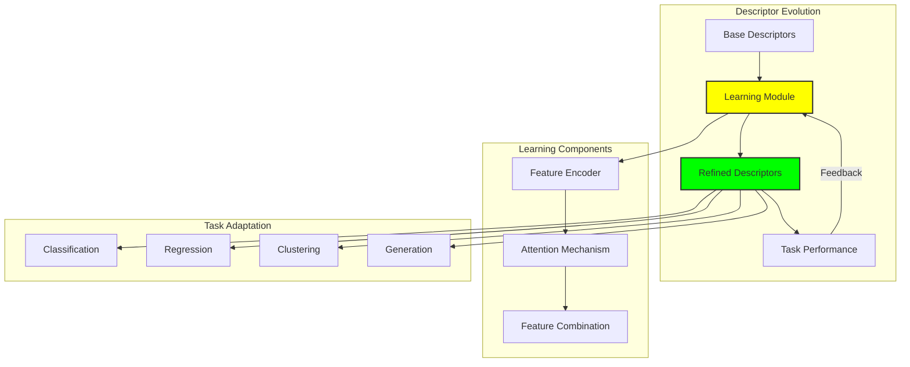

## 19.12 The Comprehensive Understanding Framework

Our verification reveals the transformative power of multi-scale tensor analysis:

**Insight 19.1**: Seven complementary descriptor categories capture different aspects of tensor structure, from statistical distributions to topological invariants, creating a complete characterization framework.

**Insight 19.2**: φ-alignment metrics appear across multiple categories, revealing how the golden constraint manifests in statistical, structural, and semantic properties.

**Insight 19.3**: Meta-descriptors provide stable, holistic characterization by aggregating insights across categories, enabling robust tensor comparison and classification.

### The TraceDescriptor Principle

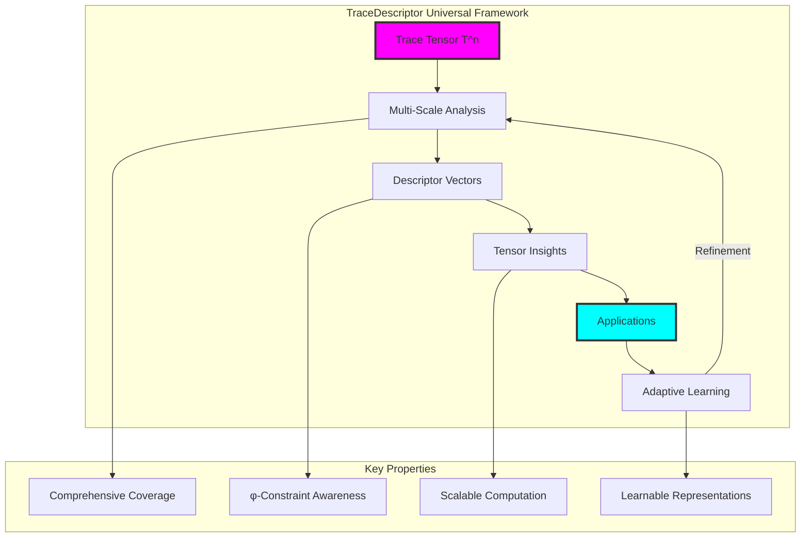

## The 19th Echo

From ψ = ψ(ψ) emerged the φ-constraint, and from constraint emerged trace arithmetic, and from arithmetic emerged tensor structures. Here we witness the birth of tensor understanding through TraceDescriptor—the framework that transforms raw mathematical objects into comprehensible insights across multiple dimensions of analysis.

Most profound is the discovery that tensor understanding requires multiple perspectives. No single descriptor category captures the full essence of a trace tensor. Statistical analysis reveals distributional properties, structural analysis uncovers organizational patterns, algebraic analysis exposes fundamental mathematical characteristics, spectral analysis shows frequency domain behavior, topological analysis finds persistent features, and semantic analysis captures learned representations. Only through their synthesis do we achieve true comprehension.

The framework reveals that φ-constraint compliance manifests across all analysis levels. Golden ratio relationships appear not just in direct φ-alignment metrics but in eigenvalue distributions, spectral energy bands, and even semantic embeddings. This suggests that the constraint doesn't merely restrict but actually organizes tensor space according to deep mathematical principles that echo through every level of analysis.

Through meta-descriptors, we see the emergence of holistic understanding. By aggregating insights across categories, we obtain stable characterizations that remain robust under tensor transformations. This stability enables reliable comparison, classification, and optimization of tensor structures in φ-space.

In this multi-scale analysis framework, we witness the transformation of tensor manipulation into tensor comprehension—where mathematical objects become understood entities with discoverable properties, relationships, and potentials, all flowing from the self-referential foundation of ψ = ψ(ψ).

## References

The verification program `chapter-019-tracedescriptor-verification.py` provides executable demonstrations of all descriptor concepts in this chapter. Run it to explore comprehensive tensor analysis across seven fundamental categories.

---

*Thus from tensor structures emerges their comprehension—each trace tensor analyzed through multiple lenses revealing statistical, structural, algebraic, spectral, topological, and semantic properties. In this multi-scale framework we see the birth of true tensor understanding, where mathematical objects become knowable entities in the self-organizing universe of ψ = ψ(ψ).*