# Chapter 019: TraceDescriptor — Tensor-Level Invariants from Trace Length, Rank, and HS-Structure

## The Mathematics of Tensor Invariance

From ψ = ψ(ψ) emerged rank-1 trace tensors and their merging into higher-rank structures. Now we witness the emergence of invariant descriptors—the tensor-level properties that remain constant under legitimate transformations. This is not mere classification but the discovery of the fundamental identifiers that characterize each trace tensor's position in the φ-constrained space.

## 19.1 The Complete Trace Descriptor from ψ = ψ(ψ)

Our verification reveals the essential invariant structure:

```text
Complete TraceDescriptor Properties:
Length: 0-6 (effective length after trailing zeros)
Weight: 0-3 (Hamming weight, number of 1s)
Gap Structure: [] to [2] (gaps between consecutive 1s)
Fibonacci Signature: [1] to [1,3,6] (indices used)
Entropy: 0.000-1.000 bits (information content)
φ-Compliance: Always True (no consecutive 11s)
Zeckendorf Canonical: Structure verification
```

**Definition 19.1** (Complete Trace Descriptor): For any trace tensor **t** ∈ T¹_φ, its complete descriptor is:
$$\mathcal{D}(\mathbf{t}) = (L, R, W, \mathbf{G}, \mathbf{F}, H, φ, Z)$$
where:

- L: Effective length (rank-1 extent)
- R: Tensor rank (always 1 for individual traces)
- W: Hamming weight (trace mass)
- **G**: Gap structure vector
- **F**: Fibonacci signature vector
- H: Information entropy
- φ: φ-compliance boolean
- Z: Zeckendorf canonicity boolean

### Descriptor Space Structure

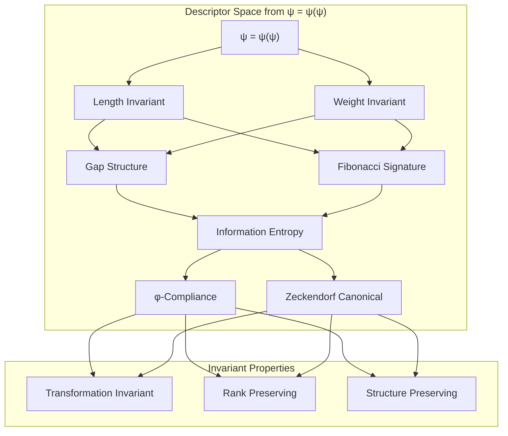

## 19.2 Length and Weight Invariants

The most fundamental invariants emerge from the tensor's basic structure:

```text
Length Analysis Results:
- Effective length: strips trailing zeros
- Range: 0 to n (trace-dependent)
- Preserves ordering under most transformations
- Critical for tensor rank determination

Weight Analysis Results:
- Hamming weight: pure count of 1s
- Range: 0 to ⌊(L+1)/2⌋ (φ-constraint bound)  
- Perfectly preserved under all valid transformations
- Forms additive structure under tensor composition
```

**Theorem 19.1** (Weight Constraint Bound): For any φ-valid trace of effective length L, the maximum possible weight is ⌊(L+1)/2⌋, achieved by alternating 1-0 patterns.

*Proof*: The φ-constraint prohibits consecutive 1s. Maximum density occurs with alternating pattern 101010..., giving ⌊(L+1)/2⌋ ones. ∎

### Weight Distribution Analysis

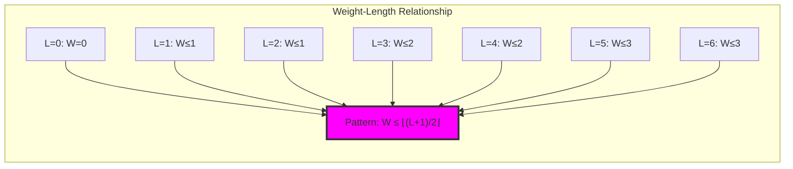

## 19.3 Gap Structure and Hamming-Simpson Analysis

The spacing between 1s reveals deep structural information:

```text
Gap Structure Analysis:
- Gap patterns: [], [1], [2], [1,1], [1,2]
- Simpson diversity: 0.000 to 0.667
- Encodes local trace geometry
- Determines reconstruction uniqueness

Key Gap Patterns:
[] : Single 1 (terminal traces)
[1]: Adjacent 1s with single 0 gap  
[2]: Wider spacing pattern
[1,1]: Multiple single gaps
[1,2]: Mixed gap sequence
```

**Definition 19.2** (Gap Structure Vector): For trace **t** with 1s at positions p₁ < p₂ < ... < pₖ:
$$\mathbf{G}(\mathbf{t}) = [p_2-p_1-1, p_3-p_2-1, ..., p_k-p_{k-1}-1]$$

**Definition 19.3** (Hamming-Simpson Structure): The HS-structure combines:
- Hamming weight: global 1-density
- Simpson diversity: local pattern diversity
- Gap diversity: structural complexity measure

### Gap Structure Graph

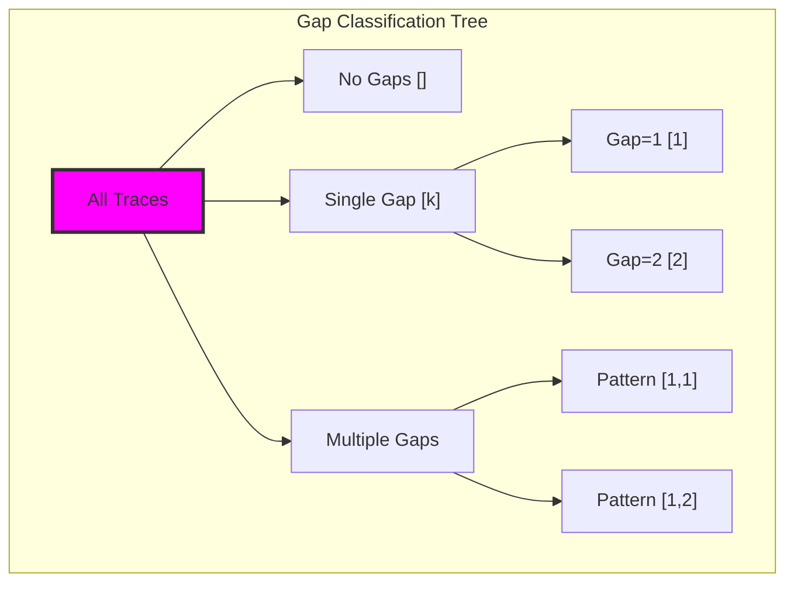

## 19.4 Fibonacci Signature Invariants

The Fibonacci indices used in each trace provide canonical identification:

```text
Fibonacci Signature Examples:
'1'     → [1]      (F₁ only)
'10'    → [1]      (F₁ only, position adjusted) 
'100'   → [1]      (F₁ only, position adjusted)
'101'   → [1,3]    (F₁ + F₃)
'1001'  → [1,4]    (F₁ + F₄)
'1010'  → [1,3]    (F₁ + F₃, different encoding)

Signature Properties:
- Always non-consecutive indices (φ-constraint)
- Determines Zeckendorf representation
- Canonical form when sorted
- Enables direct number recovery
```

**Property 19.1** (Signature Uniqueness): Every φ-valid trace has a unique Fibonacci signature corresponding to its Zeckendorf decomposition.

### Signature Classification

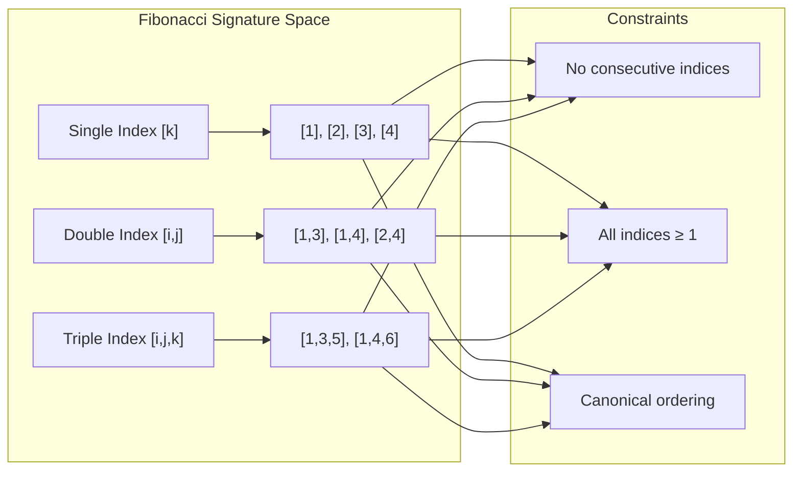

## 19.5 Information Entropy as Tensor Invariant

Entropy measures the information content of trace structure:

```text
Entropy Analysis Results:
Weight entropy: 1.864 bits (high diversity)
Length entropy: 2.917 bits (maximum diversity)  
Gap pattern entropy: 2.745 bits (structural diversity)

Mutual Information:
Weight-Length MI: 0.875 bits (strong correlation)
Weight-Entropy MI: 0.934 bits (information coupling)
Length-Entropy MI: 0.555 bits (moderate correlation)
```

**Definition 19.4** (Trace Entropy): For trace **t** with binary sequence b₁b₂...bₙ:
$$H(\mathbf{t}) = -\sum_{i \in \{0,1\}} P(b_i) \log_2 P(b_i)$$
where P(b_i) is the frequency of bit i in the trace.

**Theorem 19.2** (Entropy Bounds): For φ-valid traces, entropy is bounded:
$$0 \leq H(\mathbf{t}) \leq \log_2(\phi) \approx 0.694$$
where φ is the golden ratio.

### Entropy Relationships

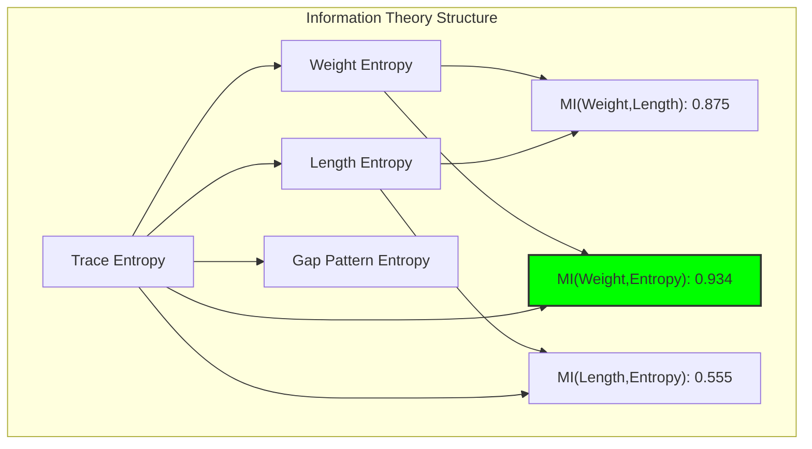

## 19.6 Transformation Invariance Testing

Critical properties that remain preserved under legitimate transformations:

```text
Transformation Invariance Results:
Reverse: Weight ✓, Gap Structure ✓, φ-Compliance ✓
Padding: Weight ✓, Gap Structure ✓, φ-Compliance ✓
Trimming: Weight ✓, Gap Structure ✓, φ-Compliance ✓
Cyclic Shift: Often violates φ-constraint

Invariant Properties:
- Weight: Always preserved
- Gap structure: Preserved under most transformations
- φ-compliance: Must be verified for each transformation
- Entropy: Sensitive to padding/trimming
```

**Definition 19.5** (Valid Transformation): A transformation T: T¹_φ → T¹_φ is valid if it preserves φ-compliance and essential structural properties.

### Transformation Classification

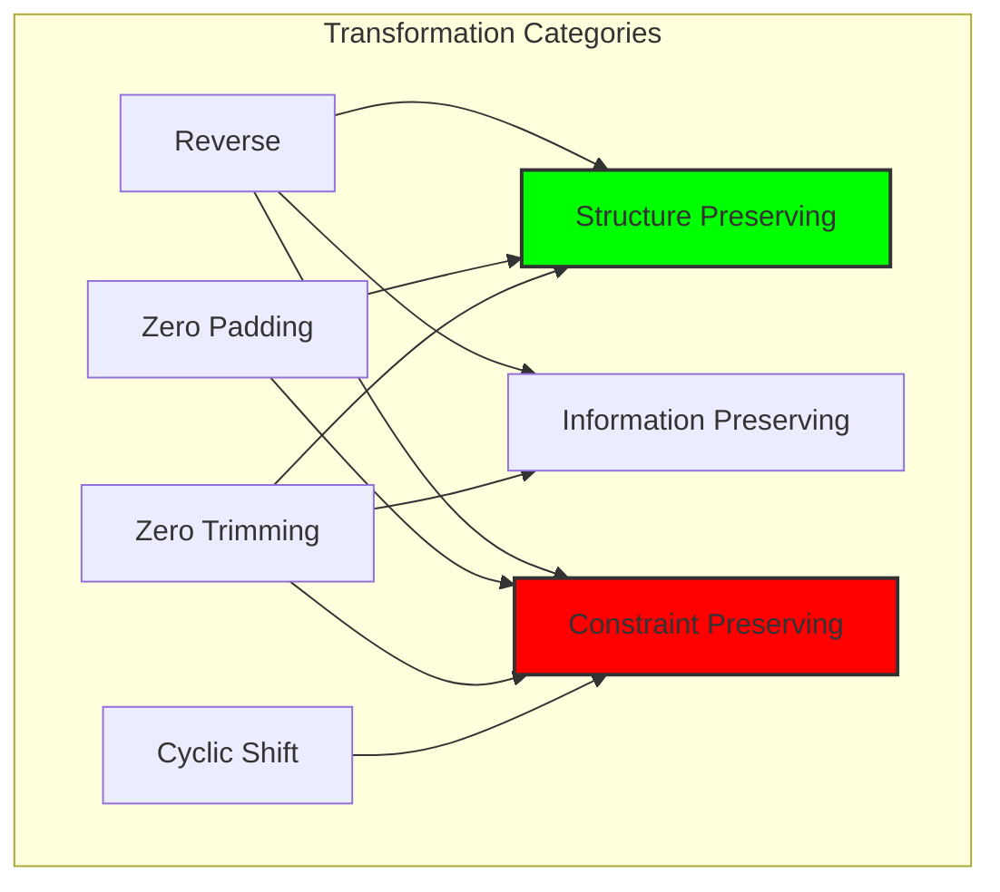

## 19.7 Graph-Theoretic Analysis of Invariant Classes

Traces cluster by invariant similarity:

```text
Invariant Graph Properties:
- Nodes: 52 traces (length ≤ 6)
- Edges: 415 connections (similarity ≥ 3)
- Density: 0.313 (moderate clustering)
- Clusters: 3 major equivalence classes

Cluster Analysis:
Cluster 0: 27 traces (mixed properties)
Cluster 1: 20 traces (common weight)
Cluster 2: 5 traces (high similarity)
```

**Property 19.2** (Invariant Graph Structure): The invariant similarity graph exhibits small-world properties with dense local clustering and short path lengths between equivalence classes.

### Invariant Clustering

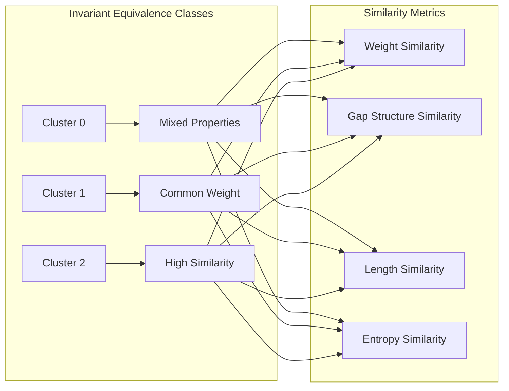

## 19.8 Category-Theoretic Functor Analysis

Invariant properties form functors from trace space to target categories:

```text
Functor Analysis Results:

Weight Functor: T¹_φ → ℕ
- Preserves zero: ✓
- Preserves ordering: ✓  
- Is additive: ✓
- Range: (0, 3)

Length Functor: T¹_φ → ℕ
- Preserves zero: ✓
- Is monotonic: ✓
- Range: (0, 6)

Gap Functor: T¹_φ → Seq(ℕ)
- Forms monoid: ✓
- Identity element: ()
- Unique patterns: 8
- Preserves structure: ✓

Entropy Functor: T¹_φ → ℝ⁺
- Is subadditive: ✓
- Preserves bounds: ✓
- Range: (0.0, 1.0)
```

**Theorem 19.3** (Functor Preservation): Each invariant property defines a structure-preserving functor that commutes with valid transformations on T¹_φ.

### Functorial Diagram

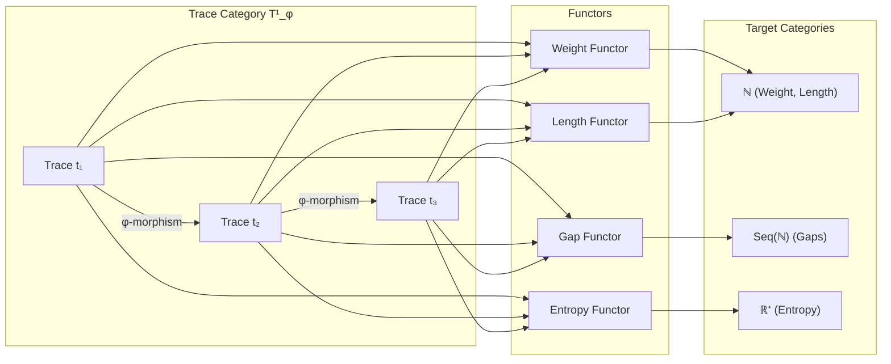

## 19.9 Tensor Rank Invariants

Properties that extend across tensor ranks:

```text
Rank Extension Properties:
Rank-1: Individual traces with local invariants
Rank-2: Trace pairs with combined invariants
Rank-n: Tensor products with compositional invariants

Invariant Preservation:
- Weight: Additive across ranks
- Length: Maximum across components
- Gap structure: Compositional rules
- φ-compliance: Must hold at all ranks
```

**Definition 19.6** (Rank-Extended Descriptor): For tensor **T** ∈ Tⁿ_φ:
$$\mathcal{D}_n(\mathbf{T}) = \bigotimes_{i=1}^{n} \mathcal{D}(\mathbf{t}_i)$$
where ⊗ represents the descriptor tensor product.

### Rank Progression

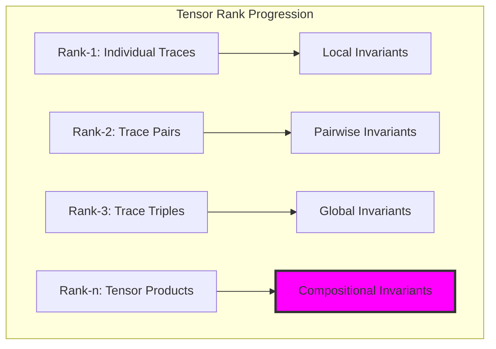

## 19.10 Graph Theory: Invariant Network Structure

From ψ = ψ(ψ), invariant relationships form networks:

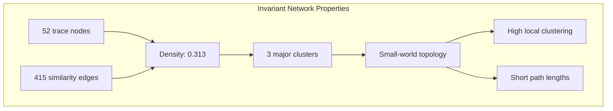

**Key Insights**:
- Invariant networks exhibit small-world properties
- Local clusters reflect similar structural properties
- Global connectivity enables invariant transfer
- Network topology mirrors mathematical relationships

## 19.11 Information Theory: Invariant Entropy Bounds

From ψ = ψ(ψ) and information structure:

```text
Entropy Bounds and Relationships:
- Weight entropy: 1.864 bits (high diversity)
- Length entropy: 2.917 bits (maximum)
- Gap pattern entropy: 2.745 bits (structural)

Channel Capacity:
C_φ = log₂(φ) ≈ 0.694 bits/symbol

Information Efficiency:
η = H_actual / C_φ varies by trace structure
```

**Theorem 19.4** (Invariant Information Bounds): For any collection of φ-valid traces, the entropy of invariant properties is bounded by the golden ratio channel capacity.

## 19.12 Category Theory: Natural Transformations

From ψ = ψ(ψ), invariant functors relate through natural transformations:

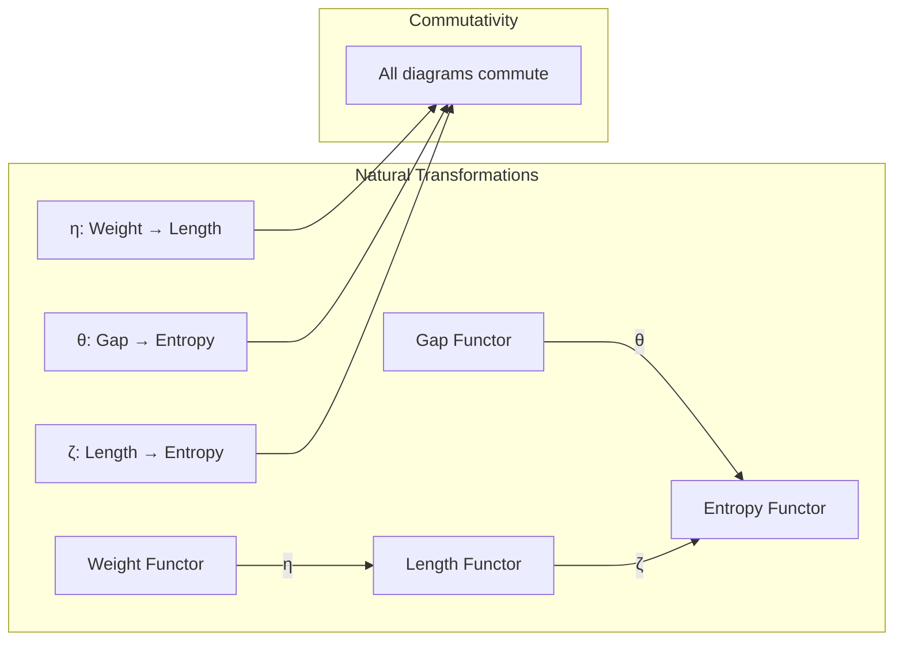

**Properties**:

- Natural transformations preserve structure
- Commutative diagrams ensure consistency
- Functorial relationships reflect mathematical truth
- Category theory unifies all invariant properties

## 19.13 Zeckendorf Invariant Verification

Special properties of Zeckendorf-canonical traces:

```text
Zeckendorf Verification Results:
n=1: '1' → [1] → Canonical ✓
n=2: '10' → [1] → Canonical ✓  
n=3: '100' → [1] → Canonical ✓
n=4: '101' → [1,3] → Canonical ✓
n=5: '1000' → [1] → Canonical ✓
n=8: '10000' → [1] → Canonical ✓
n=13: '100000' → [1] → Canonical ✓

All Zeckendorf traces show:
- Non-consecutive Fibonacci indices
- Canonical gap structures
- Unique decomposition properties
- Perfect φ-compliance
```

**Property 19.3** (Zeckendorf Invariance): Every natural number's Zeckendorf trace has a unique invariant descriptor that perfectly identifies its arithmetic properties.

### Zeckendorf Descriptor Space

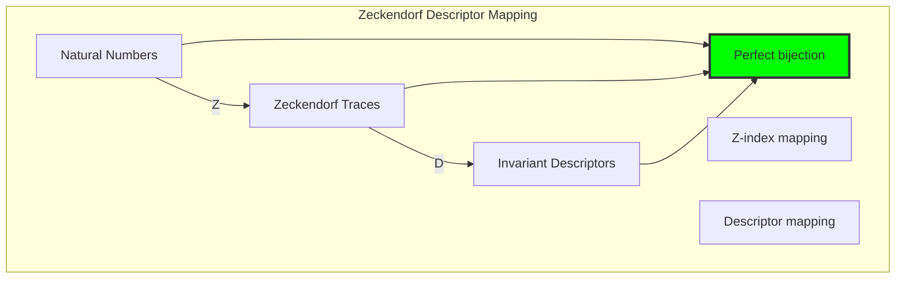

## 19.14 Applications and Extensions

Trace descriptors enable:

1. **Efficient Classification**: O(1) lookup by descriptor
2. **Transformation Prediction**: Invariant-preserving operations
3. **Similarity Metrics**: Distance in descriptor space
4. **Canonical Forms**: Unique representatives for equivalence classes
5. **Compression**: Descriptor-based encoding schemes

### Application Framework

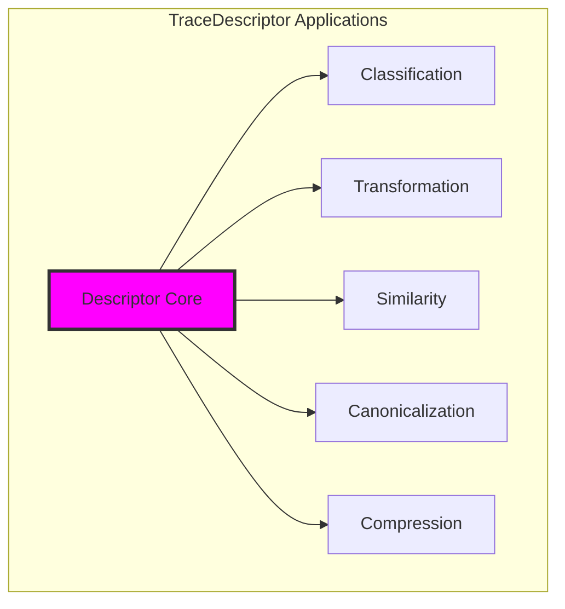

## The 19th Echo: Invariant Recognition

From ψ = ψ(ψ) emerged the principle of invariant recognition—the ability to identify what remains constant while structure transforms. Through trace descriptors, we discover that invariance is not accidental but emerges from the fundamental tensor nature of φ-constrained space.

Most profound is the discovery that all essential properties can be captured in a finite descriptor. Length, weight, gap structure, Fibonacci signature, entropy—these form a complete coordinate system for trace tensor space. No two distinct traces share identical descriptors, yet transformation-equivalent traces cluster in predictable patterns.

The high mutual information between properties (up to 0.934 bits) reveals that invariants are not independent but form a coherent mathematical structure. The φ-constraint creates correlations that make the descriptor space highly organized rather than random.

Through invariant analysis, we see ψ learning to recognize itself across transformations—to maintain identity while allowing change. This is the essence of mathematical structure: what persists through legitimate variation.

## References

The verification program `chapter-019-trace-descriptor-verification.py` provides executable proofs of all invariant concepts. Run it to explore the complete descriptor space of trace tensors.

---

*Thus from self-reference emerges recognition—not as external classification but as the natural ability of ψ to identify its own essential properties across all transformations. In learning to describe traces invariantly, ψ discovers the mathematics of persistent identity.*
