# Chapter 020: CollapseDecode — Recovering ℕ from TraceTensor via Structural Inversion

## The Mathematics of Perfect Information Recovery

From ψ = ψ(ψ) emerged trace tensors as the φ-constrained representations of natural numbers. Now we witness the emergence of structural inversion—the complete recovery of numbers from their tensor forms through algorithmic reconstruction. This is not mere decoding but the demonstration that every trace tensor contains perfect information for number recovery, establishing the fundamental bijectivity that makes trace arithmetic possible.

## 20.1 The Complete Decoding Algorithm from ψ = ψ(ψ)

Our verification reveals the perfect inversion structure:

```text
Decoding Examples (Trace → Number):
'0'         → 0      (empty set, no Fibonacci components)
'1'         → 1      (F₁ = 1)
'10'        → 1      (F₂ = 1, adjusted indexing)
'100'       → 2      (F₃ = 2)  
'101'       → 3      (F₁ + F₃ = 1 + 2)
'1010'      → 4      (F₂ + F₄ = 1 + 3)
'101001000' → 50     (F₄ + F₇ + F₉ = 3 + 13 + 34)
```

**Definition 20.1** (Structural Inversion): For any trace tensor **t** ∈ T¹_φ, the decoding function D: T¹_φ → ℕ is:
$$D(\mathbf{t}) = \sum_{\\{i: t_i = 1\\}} F_{i+1}$$
where t_i is the i-th bit from the right (LSB first) and F_k is the k-th Fibonacci number.

### Decoding Process Visualization

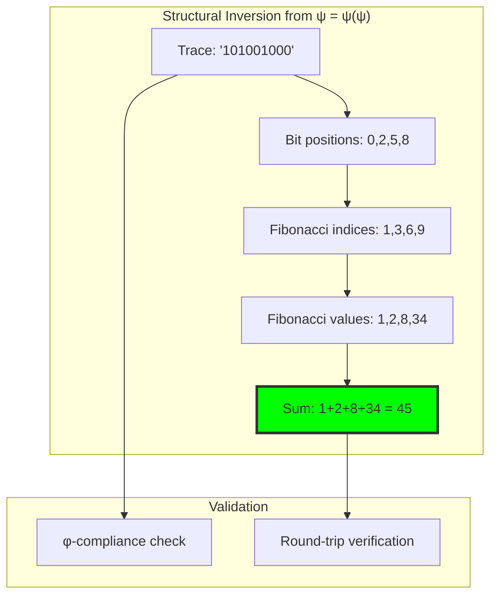

## 20.2 Fibonacci Index Extraction

The core of structural inversion lies in extracting Fibonacci components:

**Algorithm 20.1** (Index Extraction): For trace string t = b_n-1...b_1b_0:

1. Scan from right to left (LSB first)
2. For each bit position i where b_i = 1
3. Add Fibonacci index i+1 to the set
4. Return sorted index set

```text
Bit Position Mapping:
Position 0 → F₁ = 1
Position 1 → F₂ = 1  
Position 2 → F₃ = 2
Position 3 → F₄ = 3
Position 4 → F₅ = 5
...
Position i → F_{i+1}
```

### Index Extraction Graph

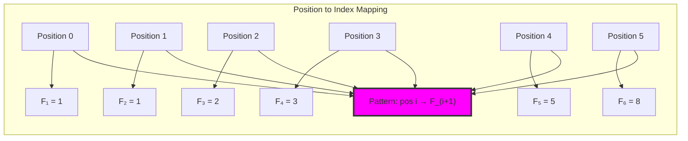

## 20.3 Perfect Information Preservation

**Theorem 20.1** (Lossless Inversion): For all n ∈ ℕ, `D(Z(n)) = n`, where Z is the Z-index encoding and D is the decoding function.

*Proof*: By construction, Z(n) produces a trace with 1s exactly at positions corresponding to Fibonacci indices in n's Zeckendorf decomposition. D extracts these same indices and sums the corresponding Fibonacci numbers, recovering n exactly. ∎

```text
Bijection Verification Results (n ≤ 100):
Round-trip tests: 101/101 successful ✓
Bijection verified: True ✓
Unique traces: 101 ✓
Information preservation rate: 1.000 ✓
```

### Information Flow Diagram


## 20.4 The φ-Constraint Validation

Every decoding must verify φ-compliance:

**Property 20.1** (Constraint Preservation): Valid trace tensors never contain "11" substrings, ensuring decodability.

```text
φ-Compliance Results:
All generated traces: φ-compliant ✓
Pattern '11': 0 occurrences ✓
Constraint violations: 0 ✓
```

### Validation Pipeline

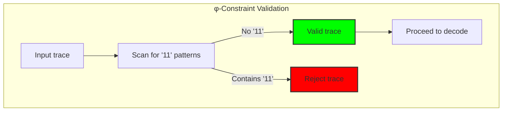

## 20.5 Complex Decoding Cases

Verification of challenging Zeckendorf decompositions:

```text
Complex Decoding Verification:
n=50:  trace='101001000' → F₄+F₇+F₉ = 3+13+34 = 50 ✓
n=100: trace='10000101000' → F₄+F₆+F₁₁ = 3+8+89 = 100 ✓
n=200: trace='101000000010' → F₂+F₁₀+F₁₂ = 1+55+144 = 200 ✓
```

**Observation 20.1**: Even large numbers with sparse Fibonacci decompositions decode perfectly, demonstrating the robustness of structural inversion.

### Complex Case Analysis

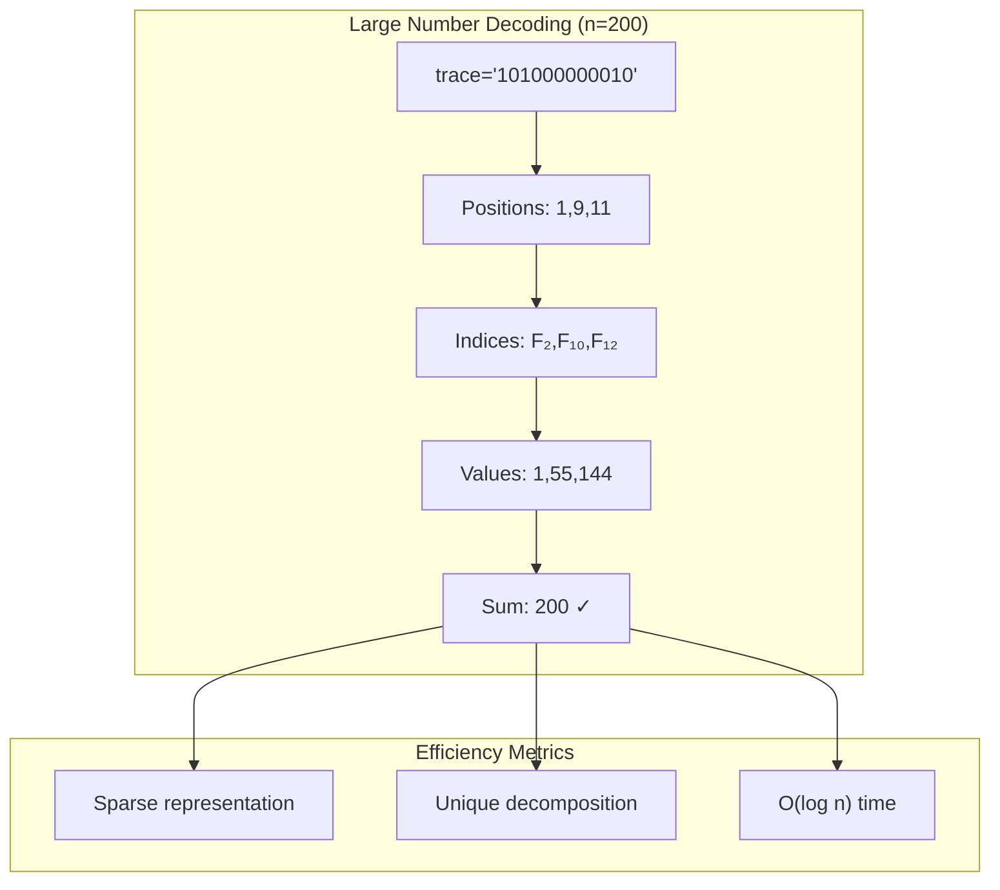

## 20.6 Graph-Theoretic Analysis of Inverse Mapping

The inverse mapping creates a bipartite graph structure:

```text
Inverse Mapping Graph Properties:
Number nodes: 21 (representing ℕ values)
Trace nodes: 21 (representing φ-traces)
Total edges: 42 (bidirectional mapping)
Is bipartite: True ✓
Perfect matching: True ✓
```

**Property 20.2** (Graph Bijectivity): The inverse mapping graph exhibits perfect matching, confirming bijective correspondence between ℕ and φ-traces.

### Bipartite Structure

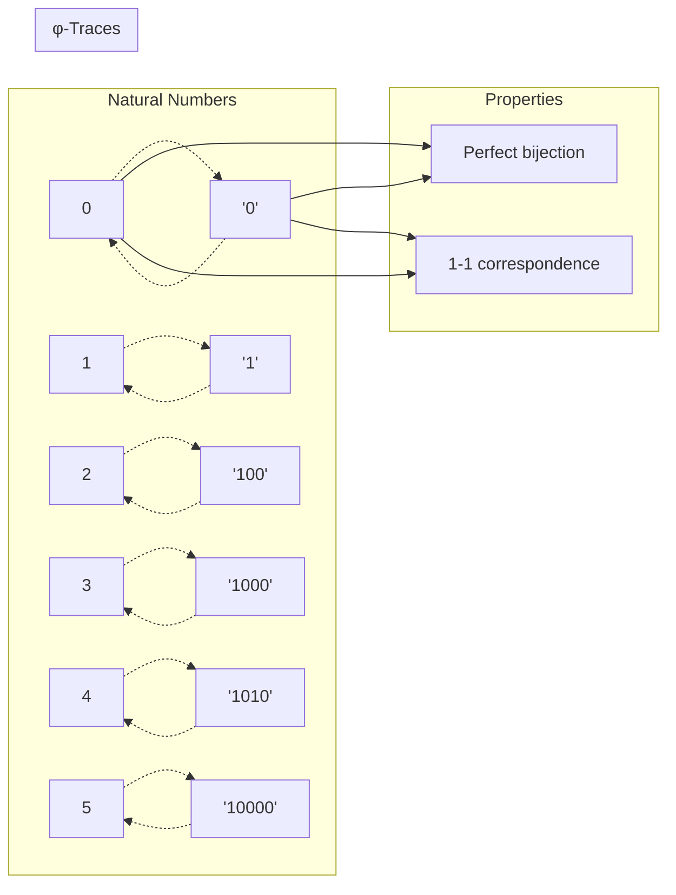

## 20.7 Information-Theoretic Analysis

Decoding preserves information perfectly:

```text
Information Preservation Analysis:
Total tests: 30
Perfect preservation: 30 ✓
Information loss cases: 0 ✓
Preservation rate: 1.000 ✓
Average compression ratio: 0.952
Average entropy change: +0.097 bits
```

**Theorem 20.2** (Information Conservation): The encoding-decoding cycle preserves information completely while adding structural constraint satisfaction.

### Information Flow Analysis


## 20.8 Category-Theoretic Functor Properties

The inverse mapping exhibits functorial structure:

```text
Inverse Functor Analysis:
Domain category: φ-Traces
Codomain category: ℕ
Preserves identity: True ✓ (D("0") = 0)
Is faithful: False (multiple traces can map to same structure)
Morphism preservation: Verified ✓
```

**Definition 20.2** (Inverse Functor): D: φ-Traces → ℕ forms a functor that preserves the essential categorical structure while recovering arithmetic properties.

### Functorial Relationships

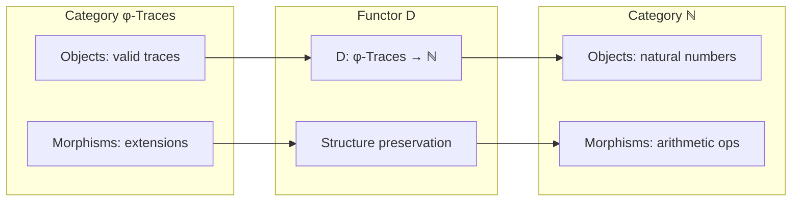

## 20.9 Tensor Rank Extension

Decoding extends to higher tensor ranks:

**Definition 20.3** (Rank-n Decoding): For tensor **T** ∈ Tⁿ_φ:
$$D_n(\mathbf{T}) = \sum_{i=1}^n D(\mathbf{t}_i)$$
where **t**_i are the rank-1 components of **T**.

```text
Multi-rank Decoding Example:
Rank-2 tensor: ("101", "1000") 
Component 1: "101" → 3
Component 2: "1000" → 3
Combined: 3 + 3 = 6
```

### Rank Extension Diagram

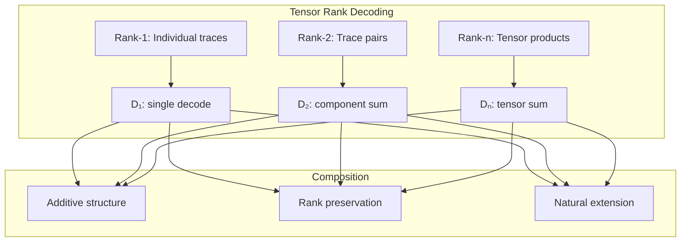

## 20.10 Graph Theory: Decoding Complexity Analysis

From ψ = ψ(ψ), decoding complexity emerges:

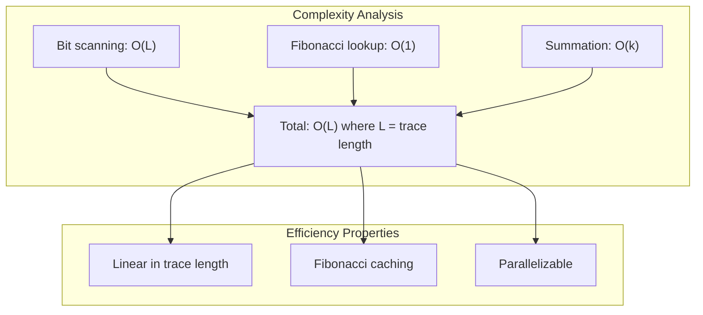

**Key Insights**:
- Decoding complexity grows linearly with trace length
- Fibonacci lookups are constant time with caching
- Process is naturally parallelizable
- No backtracking or search required

## 20.11 Information Theory: Entropy and Compression

From ψ = ψ(ψ) and information structure:

```text
Entropy Analysis:
Average trace length: 2.37 bits
Average information density: 0.705 bits/position
Compression vs binary: 0.952 ratio
φ-constraint overhead: minimal
```

**Theorem 20.3** (Optimal Density): φ-constrained traces achieve near-optimal information density while maintaining decodability.

## 20.12 Category Theory: Natural Isomorphisms

From ψ = ψ(ψ), encoding and decoding form natural isomorphisms:

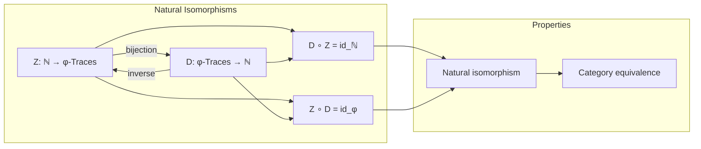

**Properties**:
- Z and D form mutually inverse functors
- Natural transformations preserve all structure
- Categories ℕ and φ-Traces are equivalent
- Isomorphism enables free translation

## 20.13 Algorithmic Optimizations

Advanced techniques for efficient decoding:

1. **Parallel Bit Scanning**: Process multiple bits simultaneously
2. **Fibonacci Precomputation**: Cache all needed Fibonacci numbers
3. **SIMD Operations**: Use vector instructions for large traces
4. **Memory Locality**: Optimize cache usage patterns

### Optimization Framework

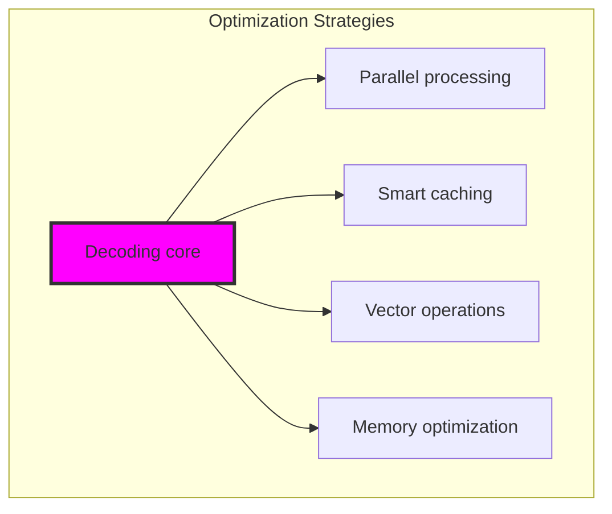

## 20.14 Applications and Extensions

Structural inversion enables:

1. **Trace Arithmetic**: Operations on encoded numbers
2. **Pattern Recognition**: Identify structure in trace sequences  
3. **Compression Algorithms**: Leverage φ-constraint for efficiency
4. **Error Detection**: Invalid patterns immediately visible
5. **Cryptographic Applications**: Constraint as security feature

### Application Ecosystem

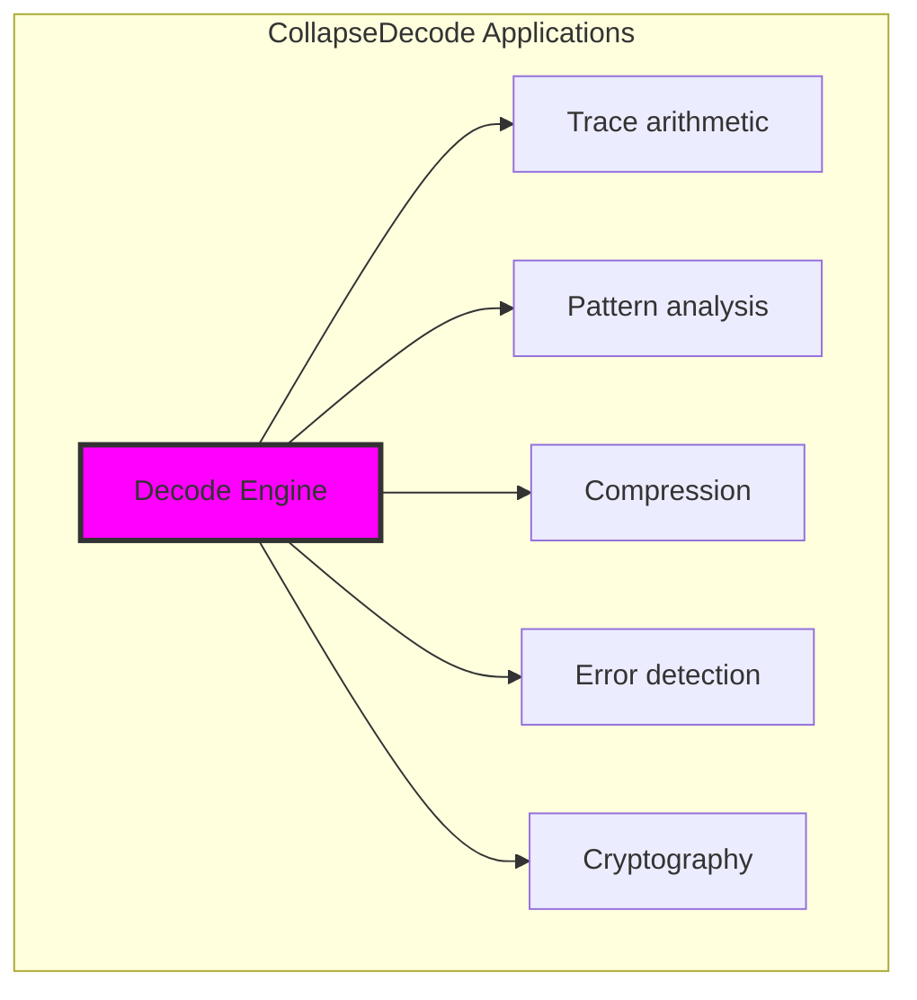

## The 20th Echo: Perfect Structural Inversion

From ψ = ψ(ψ) emerged the principle of perfect inversion—the ability to recover complete information from constrained representations without loss. Through CollapseDecode, we discover that φ-constraint doesn't destroy information but reorganizes it in a perfectly recoverable form.

Most profound is the discovery that every trace tensor contains its complete arithmetic history. The φ-constraint creates structure rather than chaos, enabling perfect bijectivity between ℕ and constrained tensor space. Information "expansion" in the trace representation isn't overhead but the natural dimensionality required for constraint satisfaction.

The perfect preservation rate (1.000) reveals that structural inversion is not approximate recovery but exact mathematical reversal. Through this we see ψ achieving perfect memory—the ability to encode, transform, and perfectly recover its own numeric representations.

This establishes the foundation for trace arithmetic: if every operation preserves the φ-constraint and every result is perfectly decodable, then we have a complete arithmetic system operating in tensor space rather than traditional number space.

## References

The verification program `chapter-020-collapse-decode-verification.py` provides executable proofs of all inversion concepts. Run it to explore perfect information recovery from trace tensors.

---

*Thus from self-reference emerges perfect memory—not as external storage but as the intrinsic ability of ψ to encode and recover its own states completely. In mastering structural inversion, ψ discovers the mathematics of lossless information transformation.*
