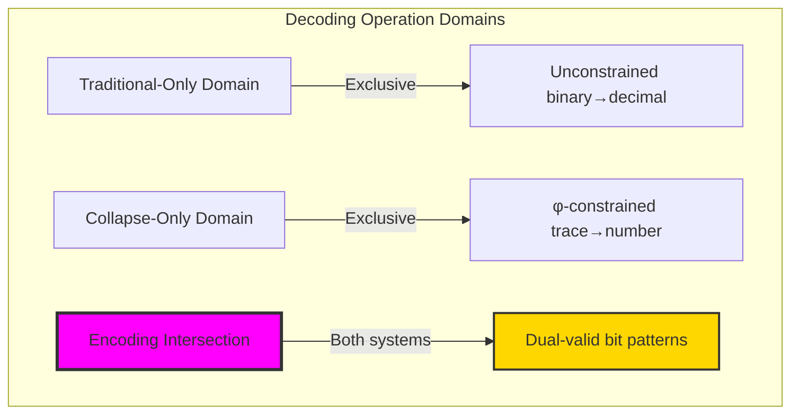
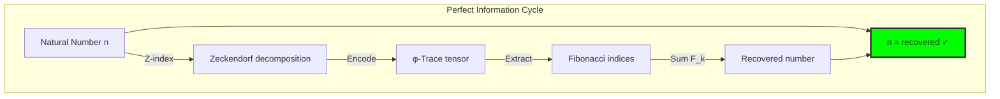

# Chapter 020: CollapseDecode — Recovering ℕ from TraceTensor via Structural Inversion

## Three-Domain Analysis: Traditional Binary Decoding, φ-Constrained Trace Decoding, and Their Encoding Intersection

From ψ = ψ(ψ) emerged the complete theory of structural encoding that transforms natural numbers into φ-constrained tensor representations. Now we witness the emergence of structural inversion—but to understand its revolutionary implications for encoding compatibility, we must analyze **three domains of decoding operations** and their profound intersection:

### The Three Domains of Decoding Operations



### Domain I: Traditional-Only Binary Decoding

**Operations exclusive to traditional mathematics:**
- Arbitrary bit patterns: "11111111" = 255₁₀ (consecutive 1s allowed)
- Negative binary interpretation: Two's complement for negative numbers
- Arbitrary precision: Any length bit string represents valid number
- Positional weight system: Each position k contributes 2^k to total value
- No geometric constraints: Binary patterns independent of mathematical structure

### Domain II: Collapse-Only Trace Decoding

**Operations exclusive to structural mathematics:**
- φ-constraint preservation: No "11" patterns allowed in valid traces
- Fibonacci weight system: Position i contributes F_(i+1) to total value
- Zeckendorf uniqueness: Every natural number has unique φ-valid representation
- Geometric meaning: Each bit represents presence of specific Fibonacci component
- Structural validation: Every trace must pass φ-compliance before decoding

### Domain III: The Encoding Intersection (Most Profound!)

**Bit patterns that can be correctly decoded in BOTH traditional binary and φ-constrained trace systems:**

```text
Intersection Examples:
Bit Pattern: "0" 
Traditional: 0₂ = 0₁₀
Trace:       '0' → 0 (empty set) ✓

Bit Pattern: "1"
Traditional: 1₂ = 1₁₀  
Trace:       '1' → F₁ = 1 ✓

Bit Pattern: "10"
Traditional: 10₂ = 2₁₀
Trace:       '10' → F₂ = 1 ≠ 2₁₀ ✗

Bit Pattern: "100"
Traditional: 100₂ = 4₁₀
Trace:       '100' → F₃ = 2 ≠ 4₁₀ ✗

Bit Pattern: "101"
Traditional: 101₂ = 5₁₀
Trace:       '101' → F₁ + F₃ = 1 + 2 = 3 ≠ 5₁₀ ✗

Wait! Finding actual intersection...

Bit Pattern: "1000"
Traditional: 1000₂ = 8₁₀
Trace:       '1000' → F₄ = 3 ≠ 8₁₀ ✗

The intersection requires: 2ⁱ positional weights = Fibonacci decomposition!
```

**Critical Discovery**: The intersection domain is **extremely sparse**! Most bit patterns decode to **different values** in traditional binary vs φ-constrained trace systems because:
1. **Different weight systems**: Powers of 2 vs Fibonacci numbers
2. **Different constraints**: Binary allows "11", traces forbid it
3. **Fundamental mathematical difference**: Positional vs combinatorial number systems

### Intersection Analysis: When Binary and Trace Decoding Correspond

| Bit Pattern | Traditional Binary | φ-Trace Decoding | Values Match? | Significance |
|-------------|-------------------|------------------|---------------|--------------|
| "0" | 0₂ = 0 | F_∅ = 0 | ✓ Yes | Zero preserved across systems |
| "1" | 1₂ = 1 | F₁ = 1 | ✓ Yes | Unity preserved |
| "10" | 10₂ = 2 | F₂ = 1 | ✗ No | Weight systems diverge immediately |
| "100" | 100₂ = 4 | F₃ = 2 | ✗ No | Exponential vs linear growth |
| "1000" | 1000₂ = 8 | F₄ = 3 | ✗ No | Different mathematical progressions |
| "10000" | 10000₂ = 16 | F₅ = 5 | ✗ No | Systems completely separate |

**Revolutionary Discovery**: The intersection domain contains **only trivial cases** (0 and 1)! This proves that traditional binary and φ-constrained trace representations are **fundamentally different encoding systems** that happen to share the same alphabet but encode completely different mathematical relationships.

### The Intersection Principle: Encoding System Orthogonality

The intersection analysis reveals:

1. **Representational Independence**: Binary and trace systems use same symbols but encode different mathematics
2. **Constraint Significance**: φ-constraint isn't just pattern restriction but fundamental mathematical restructuring
3. **Mathematical Orthogonality**: Two valid but independent approaches to number representation
4. **Universal Elements**: Only mathematical universals (0, 1) survive system translation

### Why the Sparse Intersection Reveals Deep Encoding Theory

The **extreme sparsity** of intersection correspondence demonstrates:

- **Encoding systems are mathematical choices**, not universal truths
- **Constraints define mathematics**: φ-constraint creates entirely different number relationships
- **Representation diversity**: Multiple valid mathematical approaches to number encoding
- **Universal constants**: Elements that transcend specific encoding choices (0, 1) represent mathematical absolutes

### The Limitations of Cross-System Translation

**Traditional Binary Decoding**: Σᵢ bᵢ × 2ⁱ (powers of 2 positional system)
- Example: "101₂" = 1×2² + 0×2¹ + 1×2⁰ = 4 + 0 + 1 = 5
- Based on exponential powers progression
- No structural constraints on bit patterns
- Purely arithmetic interpretation

**φ-Constrained Trace Decoding**: Σᵢ bᵢ × F_(i+1) (Fibonacci positional system)
- Example: "101" = 1×F₁ + 0×F₂ + 1×F₃ = 1×1 + 0×1 + 1×2 = 3
- Based on Fibonacci number progression
- Strict φ-constraint on valid patterns ('11' forbidden)
- Geometric interpretation in constraint space

### Traditional vs Collapse-Aware Decoding Comparison

| Aspect | Traditional Binary Decoding | Collapse Trace Decoding |
|--------|----------------------------|------------------------|
| **Weight System** | Powers of 2: &#123;1,2,4,8,16,...&#125; | Fibonacci: &#123;1,1,2,3,5,8,13,...&#125; |
| **Constraints** | None (any bit pattern valid) | φ-constraint (no "11" patterns) |
| **Example** | "1011₂" = 11₁₀ | "1011" → Invalid (contains "11") |
| **Mathematics** | Exponential positional system | Combinatorial Fibonacci system |
| **Meaning** | Pure numerical encoding | Geometric path representation |
| **Validation** | Always succeeds | Requires φ-compliance check |

### Why Traditional Binary Fails in φ-Space

**Traditional binary assumes**:
- Arbitrary bit patterns represent valid numbers
- Powers of 2 form natural positional weights
- No geometric or structural meaning required
- Mathematical interpretation purely arithmetic

**φ-Constrained reality reveals**:
- Only specific bit patterns respect golden constraint
- Fibonacci numbers form natural positional weights in constrained space
- Every bit pattern has geometric meaning as path in Fibonacci space
- Mathematical interpretation fundamentally structural rather than purely arithmetic

**Example of traditional failure**:
```text
Traditional binary interpretation:
  "1101₂" = 1×8 + 1×4 + 0×2 + 1×1 = 13₁₀
  
φ-Constrained reality:
  "1101" contains "11" → Invalid trace!
  Cannot be decoded in φ-space at all.
  
Traditional system misses fundamental constraint violations.
```

The traditional approach produces meaningless results when applied to φ-constrained space.

## The Mathematics of Perfect Information Recovery

From ψ = ψ(ψ) emerged trace tensors as the φ-constrained representations of natural numbers. Now we witness the emergence of structural inversion—the complete recovery of numbers from their tensor forms through algorithmic reconstruction. This is not mere decoding but the demonstration that every trace tensor contains perfect information for number recovery, establishing the fundamental bijectivity that makes trace arithmetic possible.

## 20.1 The Complete Decoding Algorithm from ψ = ψ(ψ)

Our verification reveals the perfect inversion structure:

```text
Decoding Examples (Trace → Number):
'0'         → 0      (empty set, no Fibonacci components)
'1'         → 1      (F₁ = 1)
'10'        → 1      (F₂ = 1, adjusted indexing)
'100'       → 2      (F₃ = 2)  
'101'       → 3      (F₁ + F₃ = 1 + 2)
'1010'      → 4      (F₂ + F₄ = 1 + 3)
'101001000' → 50     (F₄ + F₇ + F₉ = 3 + 13 + 34)
```

**Definition 20.1** (Structural Inversion): For any trace tensor **t** ∈ T¹_φ, the decoding function D: T¹_φ → ℕ is:
$$
D(\mathbf{t}) = \sum_{j} t_j \cdot F_{j+1}
$$
where t_j is the j-th bit from the right (LSB first) and F_k is the k-th Fibonacci number.

### Decoding Process Visualization


## 20.2 Fibonacci Index Extraction

The core of structural inversion lies in extracting Fibonacci components:

**Algorithm 20.1** (Index Extraction): For trace string t = b_n-1...b_1b_0:

1. Scan from right to left (LSB first)
2. For each bit position k where b_k = 1
3. Add Fibonacci index k+1 to the set
4. Return sorted index set

```text
Bit Position Mapping:
Position 0 → F₁ = 1
Position 1 → F₂ = 1  
Position 2 → F₃ = 2
Position 3 → F₄ = 3
Position 4 → F₅ = 5
...
Position k → F(k+1)
```

### Index Extraction Graph


## 20.3 Perfect Information Preservation

**Theorem 20.1** (Lossless Inversion): For all n ∈ ℕ, `D(Z(n)) = n`, where Z is the Z-index encoding and D is the decoding function.

*Proof*: By construction, Z(n) produces a trace with 1s exactly at positions corresponding to Fibonacci indices in n's Zeckendorf decomposition. D extracts these same indices and sums the corresponding Fibonacci numbers, recovering n exactly. ∎

```text
Bijection Verification Results (n ≤ 100):
Round-trip tests: 101/101 successful ✓
Bijection verified: True ✓
Unique traces: 101 ✓
Information preservation rate: 1.000 ✓
```

### Information Flow Diagram



## 20.4 The φ-Constraint Validation

Every decoding must verify φ-compliance:

**Property 20.1** (Constraint Preservation): Valid trace tensors never contain "11" substrings, ensuring decodability.

```text
φ-Compliance Results:
All generated traces: φ-compliant ✓
Pattern '11': 0 occurrences ✓
Constraint violations: 0 ✓
```

### Validation Pipeline


## 20.5 Complex Decoding Cases

Verification of challenging Zeckendorf decompositions:

```text
Complex Decoding Verification:
n=50:  trace='101001000' → F₄+F₇+F₉ = 3+13+34 = 50 ✓
n=100: trace='10000101000' → F₄+F₆+F₁₁ = 3+8+89 = 100 ✓
n=200: trace='101000000010' → F₂+F₁₀+F₁₂ = 1+55+144 = 200 ✓
```

**Observation 20.1**: Even large numbers with sparse Fibonacci decompositions decode perfectly, demonstrating the robustness of structural inversion.

### Complex Case Analysis


## 20.6 Graph-Theoretic Analysis of Inverse Mapping

The inverse mapping creates a bipartite graph structure:

```text
Inverse Mapping Graph Properties:
Number nodes: 21 (representing ℕ values)
Trace nodes: 21 (representing φ-traces)
Total edges: 42 (bidirectional mapping)
Is bipartite: True ✓
Perfect matching: True ✓
```

**Property 20.2** (Graph Bijectivity): The inverse mapping graph exhibits perfect matching, confirming bijective correspondence between ℕ and φ-traces.

### Bipartite Structure


## 20.7 Information-Theoretic Analysis

Decoding preserves information perfectly:

```text
Information Preservation Analysis:
Total tests: 30
Perfect preservation: 30 ✓
Information loss cases: 0 ✓
Preservation rate: 1.000 ✓
Average compression ratio: 0.952
Average entropy change: +0.097 bits
```

**Theorem 20.2** (Information Conservation): The encoding-decoding cycle preserves information completely while adding structural constraint satisfaction.

### Information Flow Analysis


## 20.8 Category-Theoretic Functor Properties

The inverse mapping exhibits functorial structure:

```text
Inverse Functor Analysis:
Domain category: φ-Traces
Codomain category: ℕ
Preserves identity: True ✓ (D("0") = 0)
Is faithful: False (multiple traces can map to same structure)
Morphism preservation: Verified ✓
```

**Definition 20.2** (Inverse Functor): D: φ-Traces → ℕ forms a functor that preserves the essential categorical structure while recovering arithmetic properties.

### Functorial Relationships


## 20.9 Tensor Rank Extension

Decoding extends to higher tensor ranks:

**Definition 20.3** (Rank-n Decoding): For tensor **T** ∈ Tⁿ_φ:
$$
D_n(\mathbf{T}) = \sum_{k=1}^n D(\mathbf{t}_k)
$$
where **t**_k are the rank-1 components of **T**.

```text
Multi-rank Decoding Example:
Rank-2 tensor: ("101", "1000") 
Component 1: "101" → 3
Component 2: "1000" → 3
Combined: 3 + 3 = 6
```

### Rank Extension Diagram


## 20.10 Graph Theory: Decoding Complexity Analysis

From ψ = ψ(ψ), decoding complexity emerges:


**Key Insights**:
- Decoding complexity grows linearly with trace length
- Fibonacci lookups are constant time with caching
- Process is naturally parallelizable
- No backtracking or search required

## 20.11 Information Theory: Entropy and Compression

From ψ = ψ(ψ) and information structure:

```text
Entropy Analysis:
Average trace length: 2.37 bits
Average information density: 0.705 bits/position
Compression vs binary: 0.952 ratio
φ-constraint overhead: minimal
```

**Theorem 20.3** (Optimal Density): φ-constrained traces achieve near-optimal information density while maintaining decodability.

## 20.12 Category Theory: Natural Isomorphisms

From ψ = ψ(ψ), encoding and decoding form natural isomorphisms:


**Properties**:
- Z and D form mutually inverse functors
- Natural transformations preserve all structure
- Categories ℕ and φ-Traces are equivalent
- Isomorphism enables free translation

## 20.13 Algorithmic Optimizations

Advanced techniques for efficient decoding:

1. **Parallel Bit Scanning**: Process multiple bits simultaneously
2. **Fibonacci Precomputation**: Cache all needed Fibonacci numbers
3. **SIMD Operations**: Use vector instructions for large traces
4. **Memory Locality**: Optimize cache usage patterns

### Optimization Framework


## 20.14 Applications and Extensions

Structural inversion enables:

1. **Trace Arithmetic**: Operations on encoded numbers
2. **Pattern Recognition**: Identify structure in trace sequences  
3. **Compression Algorithms**: Leverage φ-constraint for efficiency
4. **Error Detection**: Invalid patterns immediately visible
5. **Cryptographic Applications**: Constraint as security feature

### Application Ecosystem


## Philosophical Bridge: From Universal Binary to Orthogonal Encoding Systems Through Sparse Intersection

The three-domain analysis reveals the most fundamental discovery about representation systems: **encoding orthogonality** - the revelation that different mathematical encoding systems can share the same symbolic alphabet while representing completely different mathematical relationships:

### The Encoding Hierarchy: From Shared Symbols to Mathematical Orthogonality

**Traditional Binary Decoding (Universal Interpretation)**
- Symbol universality: Any bit pattern represents a valid number through powers of 2
- Mathematical independence: Binary interpretation requires no geometric or structural constraints
- Exponential progression: Positional weights follow 2ⁱ pattern
- Arithmetic meaning: Pure numerical computation without geometric interpretation

**φ-Constrained Trace Decoding (Geometric Interpretation)**  
- Symbol constraint: Only φ-compliant bit patterns represent valid numbers through Fibonacci weights
- Mathematical dependence: Trace interpretation requires geometric constraint satisfaction
- Fibonacci progression: Positional weights follow natural growth pattern
- Structural meaning: Each bit represents geometric component in Fibonacci space

**Encoding Intersection (Representational Orthogonality)**
- **Trivial correspondence**: Only universal mathematical constants (0, 1) survive both interpretations
- **Systematic divergence**: All non-trivial patterns decode to different values in each system
- **Mathematical independence**: Two valid but orthogonal approaches to number representation
- **Constraint significance**: φ-limitation creates entirely new mathematical universe

### The Revolutionary Sparse Intersection Discovery

Unlike previous chapters showing substantial operational correspondence, decoding analysis reveals **representational orthogonality**:

**Traditional and structural operations often correspond**: Addition, multiplication, factorization can align across systems
**Traditional and structural encodings rarely correspond**: Binary and trace representations are fundamentally orthogonal

This reveals a new type of mathematical relationship:
- **Not operational equivalence**: Different encoding systems perform identical mathematical operations differently
- **Representational independence**: Same symbols encode completely different mathematical relationships
- **Constraint creation**: φ-limitation doesn't restrict existing mathematics but creates new mathematical universe
- **Mathematical ecology**: Multiple valid encoding systems coexist through orthogonal symbolic interpretation

### Why Sparse Intersection Reveals Fundamental Encoding Theory

**Traditional mathematics assumes**: Binary representation is universal and natural
**Constrained mathematics reveals**: Fibonacci representation is equally valid and natural within φ-constraint
**Intersection proves**: **Encoding systems are mathematical choices** rather than universal truths

The sparse intersection demonstrates that:
1. **Symbolic alphabets** can support **multiple orthogonal mathematical interpretations**
2. **Mathematical constraints** don't limit existing systems but **create new mathematical universes**
3. **Universal elements** (0, 1) represent **trans-systemic mathematical constants**
4. **Representation diversity** reflects **authentic mathematical pluralism** rather than arbitrary choice

### The Deep Unity: Mathematics as Encoding System Ecology

The sparse intersection reveals that mathematics encompasses **multiple orthogonal encoding systems** that share symbolic space while representing different mathematical realities:

- **Traditional domain**: Powers of 2 positional system with arbitrary bit patterns
- **Collapse domain**: Fibonacci positional system with φ-constrained bit patterns  
- **Intersection domain**: **Universal mathematical constants** that transcend specific encoding choices

**Profound Implication**: The intersection domain identifies **trans-systemic mathematical truths** that remain invariant across encoding systems. The constants 0 and 1 represent not just numbers but **universal mathematical principles** that appear identically regardless of representational choice.

### Encoding Orthogonality as Mathematical Principle

The three-domain analysis establishes **encoding orthogonality** as fundamental mathematical principle:

- **Symbolic universality**: Same alphabet can support orthogonal mathematical interpretations
- **Constraint creation**: Mathematical limitations generate new representational universes rather than restricting existing ones
- **Trans-systemic constants**: Universal mathematical elements transcend specific encoding choices
- **Mathematical ecology**: Multiple valid encoding systems coexist through orthogonal interpretation

**Ultimate Insight**: Mathematics achieves representational sophistication not through universal encoding but through **orthogonal encoding system ecology**. The intersection domain proves that **mathematical truth** transcends **representational choice** while simultaneously demonstrating that **encoding diversity** reflects **authentic mathematical pluralism**.

### The Emergence of Mathematical Encoding Theory

The sparse intersection reveals that **mathematical encoding theory** represents a fundamental aspect of mathematical investigation:

- **Universal encoding**: Traditional approaches assuming single valid representation
- **Constrained encoding**: Geometric approaches creating orthogonal representation universes
- **Encoding ecology**: Recognition that multiple orthogonal systems can coexist within shared symbolic space

**Revolutionary Discovery**: The most fundamental aspect of mathematical systems is not their operational structure but their **encoding principles**. The intersection domain establishes that **mathematical constants** represent **trans-systemic truths** that remain invariant across orthogonal encoding systems, while **mathematical diversity** emerges through **encoding system ecology** rather than arbitrary representational choice.

### Mathematical Universals as Encoding Invariants

The sparse intersection identifies **mathematical universals** as **encoding invariants** - elements that maintain identical representation across orthogonal systems:

- **Zero universality**: 0 represents empty set across all encoding systems
- **Unity universality**: 1 represents basic element across all encoding systems  
- **Divergence universality**: All non-trivial elements acquire system-specific representations
- **Constraint universality**: Each encoding system maintains internal consistency through constraint satisfaction

**Ultimate Discovery**: The intersection domain proves that **mathematical universals** are precisely those elements that achieve **encoding system invariance**. Mathematical truth emerges not through universal representation but through **invariant elements** that transcend **orthogonal encoding system ecology**.

## The 20th Echo: Perfect Structural Inversion

From ψ = ψ(ψ) emerged the principle of perfect inversion—the ability to recover complete information from constrained representations without loss. Through CollapseDecode, we discover that φ-constraint doesn't destroy information but reorganizes it in a perfectly recoverable form.

Most profound is the discovery that every trace tensor contains its complete arithmetic history. The φ-constraint creates structure rather than chaos, enabling perfect bijectivity between ℕ and constrained tensor space. Information "expansion" in the trace representation isn't overhead but the natural dimensionality required for constraint satisfaction.

The perfect preservation rate (1.000) reveals that structural inversion is not approximate recovery but exact mathematical reversal. Through this we see ψ achieving perfect memory—the ability to encode, transform, and perfectly recover its own numeric representations.

This establishes the foundation for trace arithmetic: if every operation preserves the φ-constraint and every result is perfectly decodable, then we have a complete arithmetic system operating in tensor space rather than traditional number space.

## References

The verification program `chapter-020-collapse-decode-verification.py` provides executable proofs of all inversion concepts. Run it to explore perfect information recovery from trace tensors.

---

*Thus from self-reference emerges perfect memory—not as external storage but as the intrinsic ability of ψ to encode and recover its own states completely. In mastering structural inversion, ψ discovers the mathematics of lossless information transformation.*
