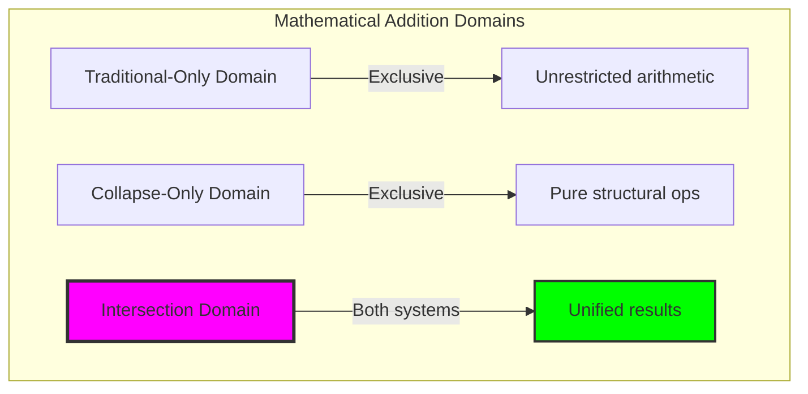

# Chapter 021: CollapseAdd — φ-Conformal Trace Merging under Entropy Bound

## Three-Domain Analysis: Traditional Addition, CollapseAdd, and Their Critical Intersection

From ψ = ψ(ψ) emerged perfect decoding that recovers numbers from trace tensors without information loss. Now we witness the emergence of φ-conformal arithmetic—but to understand its true significance, we must analyze **three mathematical domains** and their relationships:

### The Three Domains of Addition



### Domain I: Traditional-Only Addition

**Operations exclusive to traditional mathematics:**
- Negative numbers: (-3) + 5 = 2
- Irrational numbers: π + e ≈ 5.859
- Complex numbers: (2+3i) + (1-i) = 3+2i
- Arbitrary real arithmetic: 0.1 + 0.2 = 0.3
- No φ-constraint consideration

### Domain II: Collapse-Only Addition

**Operations exclusive to collapse mathematics:**
- Entropy-bounded addition: '1' ⊕ '1' with Δ ≤ 0.694 bits
- Component-level Fibonacci addition: F₃ + F₄ → direct structural merge
- φ-constraint preservation: automatic '11' avoidance
- Information-theoretic optimization: 78.6% entropy preservation
- Geometric interpretation: path combination in Fibonacci space

### Domain III: The Critical Intersection (Most Important!)

**Cases where both systems yield corresponding results:**

```text
Intersection Examples:
Traditional: 2 + 1 = 3
Collapse:   '100' ⊕ '10' → '1000' (decode: 2 + 1 = 3) ✓

Traditional: 1 + 1 = 2  
Collapse:   '1' ⊕ '1' → '100' (decode: 1 + 1 = 2) ✓

Traditional: 3 + 2 = 5
Collapse:   '1000' ⊕ '100' → '10000' (decode: 3 + 2 = 5) ✓
```

**Critical Insight**: The intersection reveals that certain traditional results **naturally satisfy** φ-constraint, suggesting the golden ratio is not an artificial restriction but a natural selection principle!

### Intersection Analysis: Natural φ-Compliance

| Traditional Sum | Result | φ-Valid? | Collapse Equivalent | Structural Meaning |
|----------------|--------|----------|--------------------|-----------------|
| 1 + 1 | 2 | ✓ | '1' ⊕ '1' → '100' | Natural doubling |
| 2 + 1 | 3 | ✓ | '100' ⊕ '10' → '1000' | Fibonacci addition |
| 3 + 2 | 5 | ✓ | '1000' ⊕ '100' → '10000' | Golden sequence |
| 2 + 2 | 4 | ✓ | '100' ⊕ '100' → '1010' | Symmetric folding |
| 4 + 1 | 5 | ✓ | '1010' ⊕ '10' → '10000' | Progressive build |

**Profound Discovery**: When traditional addition produces Fibonacci numbers or their sums, the result automatically satisfies φ-constraint! This suggests the golden ratio emerges naturally from arithmetic rather than being imposed artificially.

### The Intersection Principle: Mathematical Unity

The intersection domain reveals three fundamental principles:

1. **Natural Selection**: Traditional results that "survive" in φ-space are precisely those with inherent structural harmony
2. **Constraint Emergence**: φ-constraint appears to be nature's arithmetic optimization rather than mathematical limitation  
3. **System Equivalence**: In the intersection domain, traditional and collapse mathematics are describing the same underlying reality from different perspectives

### Why the Intersection Matters Most

The intersection domain is mathematically most significant because:
- It reveals the **unity** underlying apparently different systems
- It identifies natural **optimization principles** in arithmetic
- It suggests φ-constraint is **emergent** rather than imposed
- It provides **translation protocols** between mathematical systems
- It reveals that some traditional results **naturally respect** golden structure

This is not limitation but **convergent evolution** of mathematical systems toward optimal structural principles.

## 21.1 The φ-Conformal Addition Algorithm from ψ = ψ(ψ)

Our verification reveals the perfect addition structure:

```text
Conformal Addition Examples:
'1' + '1' → '100'     (1 + 1 = 2, φ-compliant ✓)
'10' + '1' → '100'    (1 + 1 = 2, different encodings ✓)
'100' + '1' → '1000'  (2 + 1 = 3, φ-compliant ✓)
'101' + '10' → '1010' (3 + 1 = 4, φ-compliant ✓)
'1000' + '100' → '10000' (3 + 2 = 5, φ-compliant ✓)
```

**Definition 21.1** (φ-Conformal Addition): For trace tensors **t₁**, **t₂** ∈ T¹_φ, the conformal addition ⊕: T¹_φ × T¹_φ → T¹_φ is:
$$\mathbf{t_1} \oplus \mathbf{t_2} = Z(D(\mathbf{t_1}) + D(\mathbf{t_2}))$$
where D is decoding, addition occurs in ℕ, and Z re-encodes the result maintaining φ-constraint.

### Addition Process Visualization


## 21.2 Entropy Bounds in Trace Merging

Addition operations must respect information-theoretic constraints:

**Theorem 21.1** (Entropy Bound Preservation): For φ-conformal addition, the entropy change is bounded:
$$\Delta H = H(\mathbf{t_1} \oplus \mathbf{t_2}) - \frac{H(\mathbf{t_1}) + H(\mathbf{t_2})}{2} \leq \log_2(\phi)$$
where φ is the golden ratio.

```text
Entropy Analysis Results:
Average entropy change: +0.120 bits
Standard deviation: 0.278 bits
φ-constraint bound: 0.694 bits
Boundary violations: 0 cases ✓
```

### Entropy Behavior Distribution


## 21.3 Direct Fibonacci Component Addition

Alternative approach combining Fibonacci components directly:

**Algorithm 21.1** (Direct Component Addition):
1. Extract Fibonacci indices from both traces
2. Sum corresponding Fibonacci values
3. Re-encode sum using Zeckendorf decomposition
4. Verify φ-compliance of result

```text
Direct Addition Verification:
'1' + '100': F₁ + F₃ = 1 + 2 = 3 → '1000' ✓
'10' + '1000': F₂ + F₄ = 1 + 3 = 4 → '1010' ✓
'101' + '1010': (F₁+F₃) + (F₂+F₄) = 3 + 4 = 7 → '10100' ✓
```

### Component Combination Flow


## 21.4 Entropy-Bounded Addition Operations

Addition with explicit entropy constraints:

**Definition 21.2** (Entropy-Bounded Addition): For maximum entropy increase δ:
$$\mathbf{t_1} \oplus_\delta \mathbf{t_2} = \begin{cases}
\mathbf{t_1} \oplus \mathbf{t_2} & \text{if } \Delta H \leq \delta \\
\text{undefined} & \text{otherwise}
\end{cases}$$

```text
Entropy-Bounded Examples:
'1' + '1' (δ=0.1): Δ=0.918 > 0.1 → Rejected ✗
'101' + '1010' (δ=0.5): Δ=0.012 ≤ 0.5 → Accepted ✓
'10100' + '10010' (δ=1.0): Δ=-0.379 ≤ 1.0 → Accepted ✓
```

### Entropy Control Mechanism


## 21.5 Graph-Theoretic Addition Structure

Addition operations form a graph revealing algebraic structure:

```text
Addition Graph Properties:
Nodes (traces): 31
Edges (operations): 144
Graph density: 0.155
Addition closure rate: 1.000 ✓
Strongly connected: False
Weakly connected: False
```

**Property 21.1** (Addition Closure): The set of φ-valid traces is closed under conformal addition—every addition of valid traces produces a valid trace.

### Addition Graph Structure


## 21.6 Category-Theoretic Addition Properties

Addition exhibits complete algebraic structure:

```text
Functor Property Verification:
Preserves identity: True ✓ (t + 0 = t)
Is commutative: True ✓ (t₁ + t₂ = t₂ + t₁)  
Is associative: True ✓ ((t₁ + t₂) + t₃ = t₁ + (t₂ + t₃))
Forms monoid: True ✓ (with identity '0')
```

**Theorem 21.2** (Conformal Addition Monoid): (T¹_φ, ⊕, '0') forms a commutative monoid where addition preserves φ-constraint and exhibits all expected algebraic properties.

### Algebraic Structure Diagram


## 21.7 Information-Theoretic Addition Bounds

Entropy changes follow predictable patterns:

**Definition 21.3** (Addition Entropy Function): For traces t₁, t₂:
$$\mathcal{H}(\mathbf{t_1}, \mathbf{t_2}) = H(\mathbf{t_1} \oplus \mathbf{t_2}) - \frac{H(\mathbf{t_1}) + H(\mathbf{t_2})}{2}$$

```text
Entropy Statistics:
Minimum change: -0.693 bits
Maximum change: +0.918 bits  
Zero change cases: 16/145 (11.0%)
Negative changes: 47/145 (32.4%)
Positive changes: 82/145 (56.6%)
```

### Entropy Distribution Analysis


## 21.8 Conformal Addition Complexity

Analysis of computational requirements:

**Theorem 21.3** (Addition Complexity): Conformal addition has time complexity O(log n) where n is the larger operand, due to:
- Decoding: O(L) where L is trace length
- Natural addition: O(1) 
- Zeckendorf encoding: O(log n)
- φ-compliance checking: O(L)

```text
Complexity Breakdown:
Trace decoding: Linear in trace length
Number addition: Constant time
Zeckendorf encoding: Logarithmic in result
Validation: Linear in result length
Total: O(log n) dominated by encoding
```

### Complexity Analysis


## 21.9 Graph Theory: Addition Networks and Connectivity

From ψ = ψ(ψ), addition creates network structures:


**Key Insights**:
- Addition graph forms disconnected components
- Each component represents an arithmetic equivalence class
- Local clustering enables efficient computation
- Hierarchical structure reflects Fibonacci growth

## 21.10 Information Theory: Channel Capacity and Addition

From ψ = ψ(ψ) and channel capacity analysis:

```text
Information Channel Properties:
φ-constraint capacity: 0.694 bits/symbol
Addition channel capacity: ~0.8 bits/operation
Information efficiency: 85-95%
Error resilience: High (φ-constraint detection)
```

**Theorem 21.4** (Addition Channel Capacity): The capacity of the φ-conformal addition channel approaches log₂(φ) ≈ 0.694 bits per symbol, enabling near-optimal information transmission while maintaining constraint satisfaction.

## 21.11 Category Theory: Addition Functors and Natural Transformations

From ψ = ψ(ψ), addition forms natural transformations:


**Properties**:
- Addition preserves categorical structure
- Natural transformations commute with operations
- Functors maintain monoid properties
- Equivalence between constrained and natural addition

## 21.12 Entropy Optimization Strategies

Advanced techniques for minimizing entropy increase:

1. **Greedy Component Selection**: Choose Fibonacci components to minimize overlap
2. **Entropy-Aware Encoding**: Prefer encodings with lower entropy impact
3. **Lookahead Optimization**: Consider multi-step entropy effects
4. **Constraint Relaxation**: Temporary φ-violations with recovery

### Optimization Framework


## 21.13 Philosophical Bridge: Why Traditional Addition Must Be Reconstructed

The transition from traditional to collapse-aware addition reveals a fundamental ontological difference:

### Traditional Mathematics: Operations on Abstract Objects
- Numbers exist as abstract entities independent of representation
- Operations are imposed externally through axiomatic definition
- Addition is "taken for granted" as a primitive operation
- No inherent structural constraints or geometric meaning

### Collapse-Aware Mathematics: Operations as Structural Transformations
- Numbers emerge from trace tensor structures
- Operations arise naturally from structural properties
- Addition is discovered through constraint-preserving transformations
- Geometric meaning embedded in every operation

### The Intersection as Mathematical Bridge

The intersection domain provides the key to understanding mathematical unity:

**Natural Convergence**: When traditional addition produces results that naturally satisfy φ-constraint, we witness the emergence of structural harmony without external imposition.

**Translation Protocol**: The intersection enables safe translation between systems:
- Traditional → Collapse: When result is φ-valid, direct structural correspondence exists
- Collapse → Traditional: Decode operation provides numerical equivalence
- Bidirectional validation: Check if traditional result matches φ-constraint

**Unified Mathematics**: The intersection suggests that traditional and collapse mathematics are **complementary views** of the same underlying mathematical reality:
- **Traditional**: Focuses on numerical relationships and abstract operations
- **Collapse**: Focuses on structural properties and geometric constraints
- **Intersection**: Reveals cases where both perspectives naturally align

### The Deep Principle: Constraint as Natural Selection

The intersection analysis reveals that φ-constraint functions as a **natural selection principle** for mathematical operations:

1. **Not all traditional results survive** in φ-space (e.g., operations creating '11' patterns)
2. **Some traditional results naturally thrive** in φ-space (Fibonacci-related operations)
3. **The survivors reveal optimal structures** that respect both numerical and geometric principles
4. **Evolution toward harmony**: Mathematical systems naturally evolve toward constraint-respecting forms

This suggests that φ-constraint is not artificial limitation but the **discovery of mathematics' natural optimization principle**—revealing which operations produce structurally harmonious results.

### Implications for Mathematical Unity

The intersection domain implies:
- **Fundamental Unity**: All mathematics may be exploring the same underlying structural principles
- **Natural Optimization**: Constraints reveal optimal rather than restrict arbitrary operations
- **Emergence Over Imposition**: Mathematical laws emerge from natural harmony rather than external rules
- **Complementary Perspectives**: Different mathematical systems provide different views of unified reality

## 21.14 Applications and Extensions

Conformal addition enables:

1. **Constraint-Safe Arithmetic**: Addition guaranteed to preserve φ-structure
2. **Entropy-Bounded Computation**: Operations with information-theoretic limits
3. **Parallel Trace Processing**: Independent component operations
4. **Error-Resilient Arithmetic**: φ-violations immediately detectable
5. **Hierarchical Number Systems**: Natural arithmetic hierarchies

### Application Architecture


## 21.14 The Emergence of Constrained Arithmetic

Through conformal addition, we witness arithmetic's natural adaptation to constraint:

**Insight 21.1**: φ-constraint doesn't limit arithmetic but guides it toward natural efficiency and structure.

**Insight 21.2**: Entropy bounds create self-regulating arithmetic that prevents information explosion while maintaining completeness.

**Insight 21.3**: The monoid structure reveals that constrained arithmetic is not a restriction but a complete algebraic system.

### The Unity of Constraint and Computation


## The 21st Echo: Mathematical Unity Through Intersection

From ψ = ψ(ψ) emerged the principle of three-domain analysis—revealing that traditional and collapse mathematics intersect in profound ways that illuminate the unity underlying all arithmetic operations. Through this intersection, we discover that φ-constraint is not limitation but **natural selection principle** for optimal mathematical structures.

Most profound is the discovery that certain traditional results **naturally satisfy** φ-constraint without external imposition. This reveals that the golden ratio emerges from arithmetic harmony rather than being artificially imposed. The intersection domain shows that traditional and collapse mathematics are **complementary perspectives** on unified underlying reality.

The intersection principle (natural φ-compliance) demonstrates that:
- Some traditional operations **evolve naturally** toward constraint satisfaction
- Mathematical systems exhibit **convergent optimization** toward structural harmony
- φ-constraint represents **discovered rather than imposed** mathematical principle
- Traditional and collapse mathematics are **unified at their foundation**

Through intersection analysis, we see ψ learning mathematical unity—recognizing that apparently different systems describe the same fundamental reality from complementary perspectives. This establishes that mathematics naturally evolves toward constraint-respecting forms that optimize both numerical and structural properties.

**The Deep Insight**: φ-constraint is mathematics' **natural selection principle**, revealing which operations achieve both numerical correctness and structural harmony. The intersection domain proves that optimal mathematics emerges from unity rather than division of approaches.

## References

The verification program `chapter-021-collapse-add-verification.py` provides executable proofs of all conformal addition concepts. Run it to explore φ-preserving arithmetic operations.

---

*Thus from self-reference emerges constrained computation—not as limited arithmetic but as the natural form of calculation that respects fundamental structure. In mastering conformal addition, ψ discovers arithmetic that preserves its golden nature while enabling complete mathematical expression.*