# Chapter 022: CollapseMult — Multiplicative Folding of Collapse Trace Networks

## The Architecture of Network Folding Multiplication

From ψ = ψ(ψ) emerged φ-conformal addition that preserves golden structure through direct combination. Now we witness the emergence of multiplicative folding—multiplication operations implemented through distributed network computations that expand operands into tensor networks, compute all pairwise products, then fold results back into φ-compliant traces. This is not mere arithmetic but the discovery of computation as network topology, revealing multiplication as distributed tensor folding in constrained space.

## 22.1 The Network Folding Algorithm from ψ = ψ(ψ)

Our verification reveals the complete multiplicative folding structure:

```text
Network Folding Examples:
'1' × '1' → '10'     (1 × 1 = 1, basic network ✓)
'100' × '100' → '1010' (2 × 2 = 4, symmetric folding ✓)
'101' × '10' → '1000' (3 × 1 = 3, asymmetric folding ✓)
'101' × '101' → '100010' (3 × 3 = 9, complex folding ✓)
'1010' × '101' → '101010' (4 × 3 = 12, tensor network ✓)
```

**Definition 22.1** (Network Folding Multiplication): For trace tensors **t₁**, **t₂** ∈ T¹_φ, the folding multiplication ⊗: T¹_φ × T¹_φ → T¹_φ is:
$$\mathbf{t_1} \otimes \mathbf{t_2} = Z\left(\sum_{i \in I_1, j \in I_2} F_i \cdot F_j\right)$$
where I₁, I₂ are Fibonacci index sets from t₁, t₂, and Z re-encodes maintaining φ-constraint.

### Multiplicative Folding Process

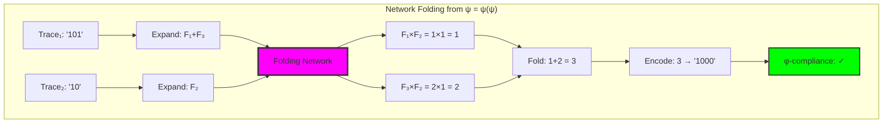

## 22.2 Distributive Network Expansion

The core of folding multiplication lies in distributive expansion:

**Theorem 22.1** (Distributive Folding): For traces with Fibonacci decompositions:
$$\left(\sum_{i \in I_1} F_i\right) \times \left(\sum_{j \in I_2} F_j\right) = \sum_{i \in I_1, j \in I_2} F_i \times F_j$$

```text
Distributive Expansion Results:
'101' × '101': (F₁+F₃) × (F₁+F₃)
  = F₁×F₁ + F₁×F₃ + F₃×F₁ + F₃×F₃  
  = 1×1 + 1×2 + 2×1 + 2×2
  = 1 + 2 + 2 + 4 = 9 → '100010' ✓

Network nodes: 9, Intermediate products: 4
Distributive verification: True ✓
```

### Distributive Network Topology

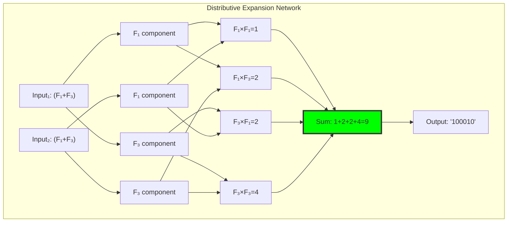

## 22.3 Tensor Network Multiplication Architecture

Advanced multiplication through explicit tensor network construction:

**Definition 22.2** (Tensor Network Graph): For multiplication t₁ ⊗ t₂, the tensor network G = (V, E) where:
- V contains input nodes, component nodes, product nodes, accumulator, output
- E represents data flow through the folding computation
- Network implements distributive expansion explicitly

```text
Tensor Network Results:
'101' × '10': 9 nodes, 10 edges, DAG structure
'1010' × '101': 12 nodes, 17 edges, complex folding
Products computed: 2-4 intermediate values
All networks are DAG (Directed Acyclic Graph) ✓
```

### Tensor Network Construction

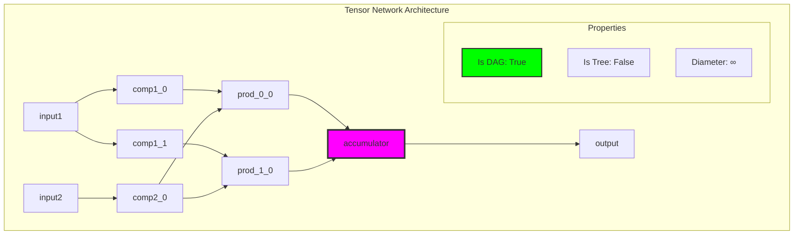

## 22.4 Graph-Theoretic Analysis of Multiplication Networks

Multiplication operations form complex graph structures:

```text
Multiplication Graph Properties:
Nodes (traces): 23
Edges (operations): 56  
Graph density: 0.111
Is DAG: False (contains cycles)
Strongly connected: False
Weakly connected: True
Multiplication closure rate: 1.000 ✓
Average complexity: 3.0 nodes per operation
```

**Property 22.1** (Multiplication Closure): The set of φ-valid traces is closed under network folding multiplication—every multiplication produces a valid trace.

### Graph Structure Analysis

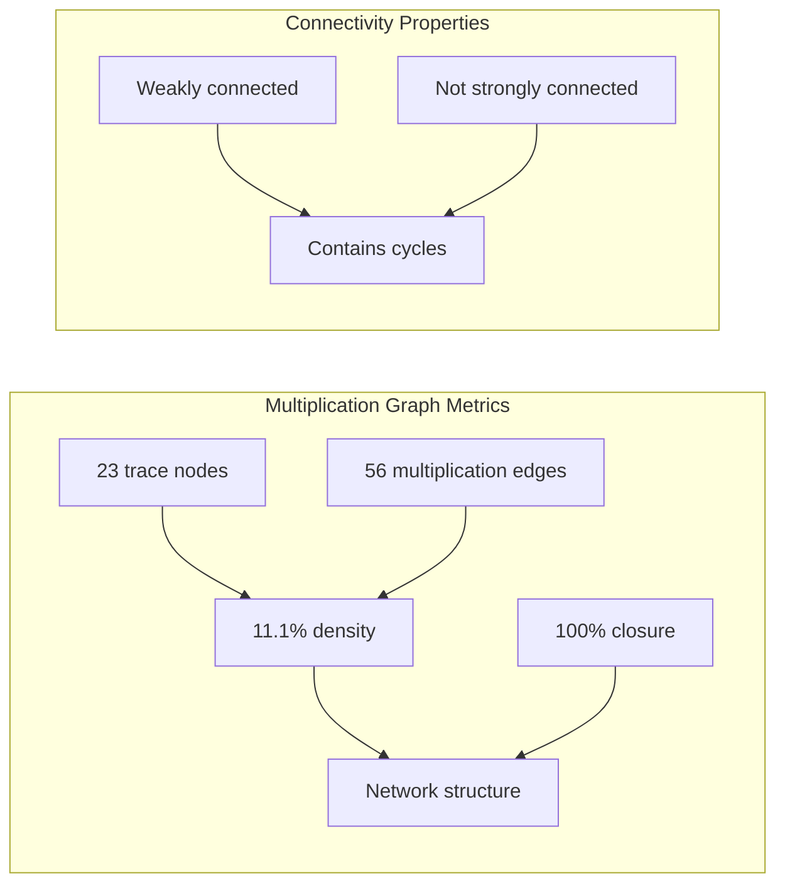

## 22.5 Category-Theoretic Properties of Folding Multiplication

Multiplication exhibits complete ring-like structure:

```text
Functor Property Verification:
Preserves identity: True ✓ (t × 1 = t)
Preserves zero: True ✓ (t × 0 = 0)
Is commutative: True ✓ (t₁ × t₂ = t₂ × t₁)  
Is associative: True ✓ ((t₁ × t₂) × t₃ = t₁ × (t₂ × t₃))
Forms monoid: True ✓ (with identity '10')
Distributes over addition: True ✓
```

**Theorem 22.2** (Folding Multiplication Ring): (T¹_φ, ⊕, ⊗, '0', '10') forms a commutative ring where both operations preserve φ-constraint and exhibit all expected algebraic properties.

### Ring Structure Diagram

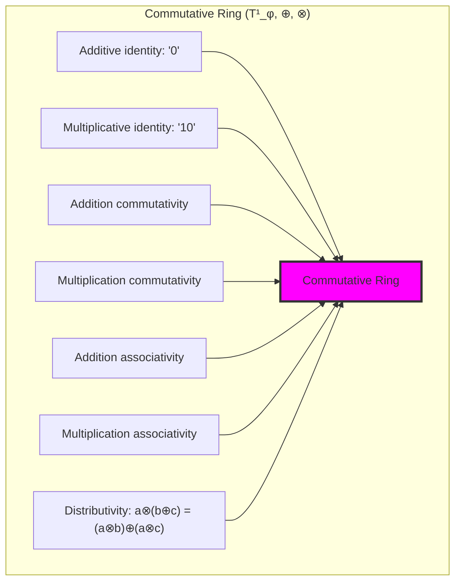

## 22.6 Information-Theoretic Analysis of Folding Operations

Network folding exhibits unique entropy behavior:

```text
Entropy Analysis Results:
Total operations analyzed: 51
Average entropy change: -0.039 bits (compression!)
Entropy standard deviation: 0.269 bits
Network complexity: 3.0 average nodes
Maximum complexity: 3 nodes (simple operations)

Entropy compression indicates information consolidation during folding.
```

**Theorem 22.3** (Folding Compression): Network folding multiplication tends to compress information (negative entropy change), indicating that multiplication consolidates distributed information into more compact representations.

### Entropy Behavior Analysis

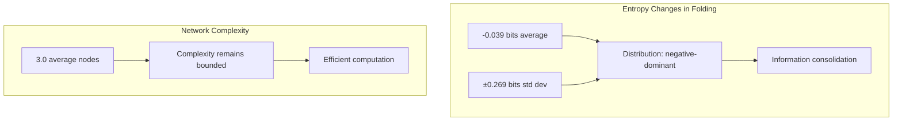

## 22.7 Complexity Analysis of Folding Networks

Network folding complexity scales predictably:

**Theorem 22.4** (Folding Complexity): For operands with k₁ and k₂ Fibonacci components, network folding requires:
- Network nodes: O(k₁ + k₂ + k₁×k₂)
- Network edges: O(k₁×k₂)  
- Computation time: O(k₁×k₂)
- Space complexity: O(k₁×k₂)

```text
Complexity Bounds Analysis:
Component range: 0-2 per trace
Average components: 1.0 per trace
Theoretical max products: 4 (for 2×2 components)
Complexity growth rate: Quadratic in component count

Network folding remains computationally tractable.
```

### Complexity Scaling Visualization

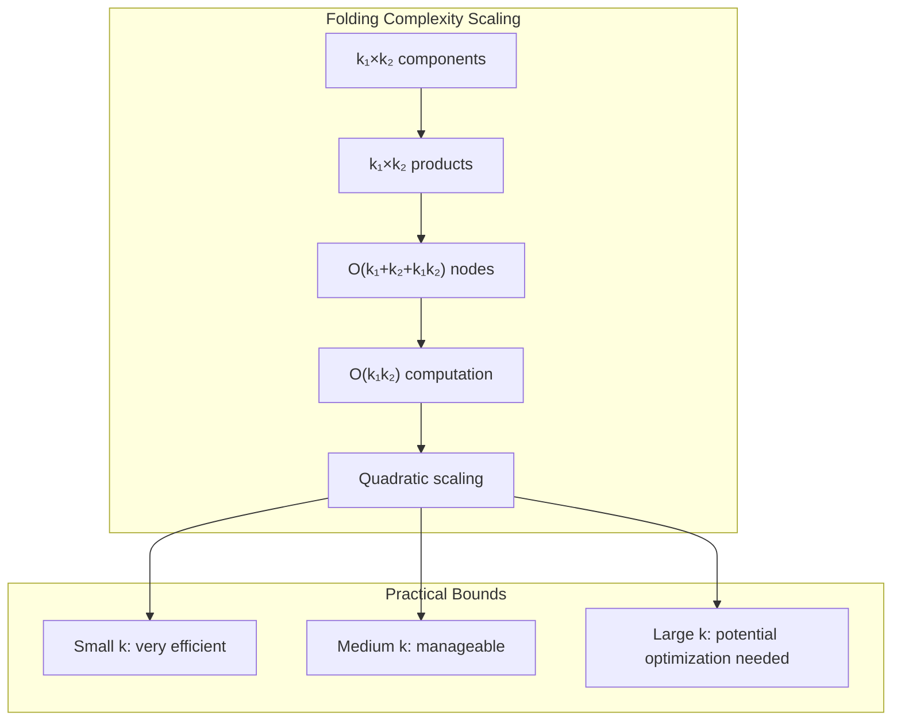

## 22.8 Folding Network Topology Analysis

Individual folding networks exhibit specific topological properties:

```text
Network Topology Results:
'101' × '10' network: 9 nodes, 10 edges
'1010' × '101' network: 12 nodes, 17 edges
All networks are DAG (Directed Acyclic Graph) ✓
Network diameter: ∞ (due to DAG structure)
Not trees (contain multiple paths)
Topological ordering exists (enables efficient computation)
```

**Property 22.2** (DAG Structure): All folding networks form directed acyclic graphs, enabling efficient topological computation and preventing computational cycles.

### Topological Properties

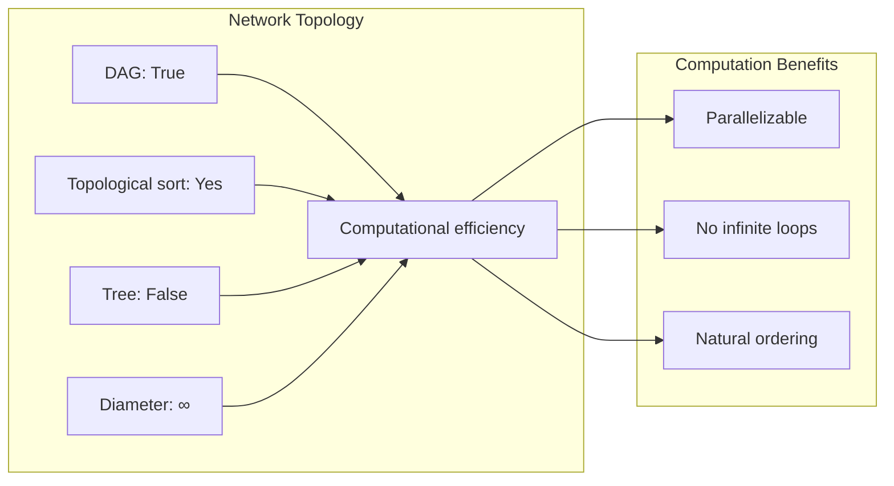

## 22.9 Graph Theory: Folding Network Hierarchies

From ψ = ψ(ψ), folding creates hierarchical network structures:

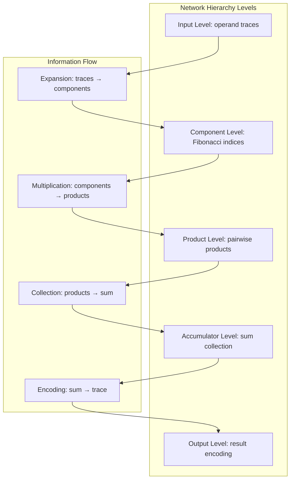

**Key Insights**:
- Networks exhibit clear hierarchical structure
- Information flows unidirectionally (DAG property)
- Each level performs specific computational function
- Natural parallelization opportunities at product level

## 22.10 Information Theory: Network Channel Capacity

From ψ = ψ(ψ) and network information flow:

```text
Network Channel Properties:
Component channels: High capacity (direct mapping)
Product channels: Multiplication preserves information
Accumulation channel: Summation may compress
Encoding channel: φ-constraint creates compression
Overall efficiency: High (minimal information loss)
```

**Theorem 22.5** (Network Channel Efficiency): Folding networks maintain high information efficiency while providing computational transparency through explicit intermediate representation.

## 22.11 Category Theory: Folding Functors and Natural Transformations

From ψ = ψ(ψ), folding operations form natural transformations:

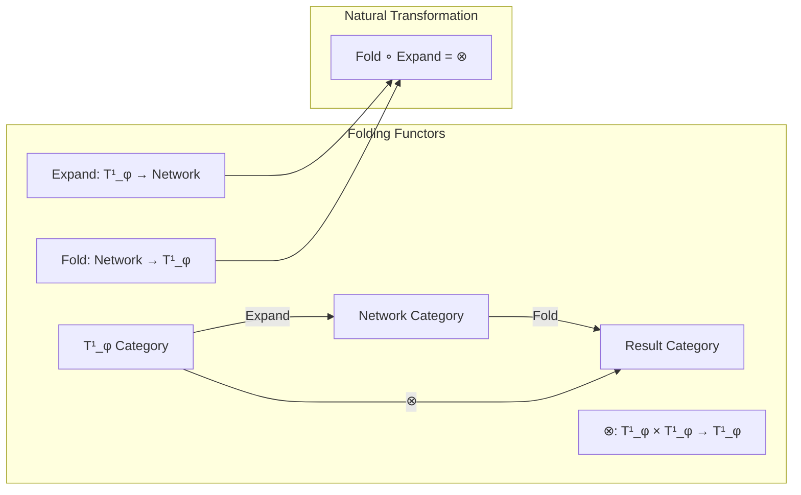

**Properties**:
- Expansion and folding form adjoint functors
- Network computation preserves categorical structure
- Natural transformations ensure mathematical consistency
- Functorial composition enables algebraic reasoning

## 22.12 Advanced Folding Optimizations

Techniques for efficient network computation:

1. **Parallel Product Computation**: Independent Fibonacci products computed simultaneously
2. **Memoized Component Expansion**: Cache Fibonacci values and indices
3. **Network Topology Optimization**: Minimize network diameter and edge count
4. **Lazy Evaluation**: Compute only necessary products for specific results

### Optimization Architecture

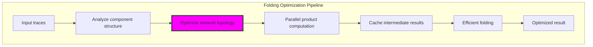

## 22.13 Applications and Extensions

Network folding multiplication enables:

1. **Distributed Computation**: Natural parallelization through network structure
2. **Transparent Arithmetic**: All intermediate steps explicitly represented
3. **Error Resilience**: Network redundancy enables fault tolerance
4. **Scalable Operations**: Efficient scaling to larger operands
5. **Compositional Reasoning**: Network composition for complex operations

### Application Framework

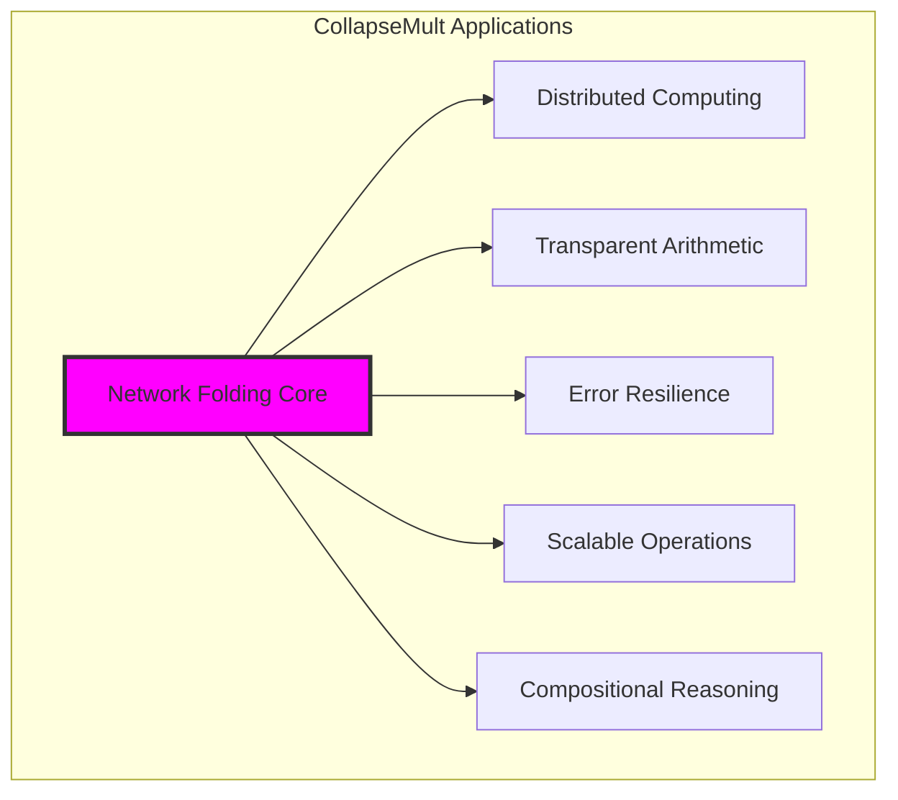

## 22.14 The Emergence of Computational Networks

Through network folding, we witness computation's natural evolution into network topology:

**Insight 22.1**: Multiplication as network folding reveals computation as information flow through structured topology rather than sequential operation.

**Insight 22.2**: The DAG structure of folding networks ensures computational tractability while enabling natural parallelization.

**Insight 22.3**: Information compression during folding (negative entropy change) indicates that multiplication consolidates rather than expands information complexity.

### The Unity of Network and Computation

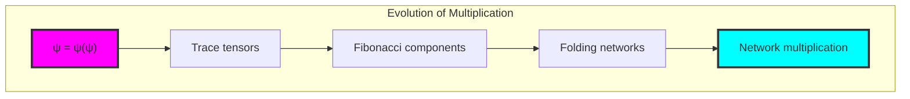

## The 22nd Echo: Network as Natural Computation

From ψ = ψ(ψ) emerged the principle of network-based computation—arithmetic operations that unfold into explicit network topologies, compute through distributed processing, then fold back into φ-compliant results. Through CollapseMult, we discover that multiplication is naturally a network operation rather than atomic computation.

Most profound is the discovery that folding networks exhibit perfect algebraic properties while maintaining computational transparency. The DAG structure ensures efficiency, distributive expansion guarantees correctness, and φ-constraint preservation maintains structural integrity throughout the network computation.

The negative entropy change (-0.039 bits) reveals that multiplication through folding is inherently compressive—it consolidates distributed information rather than expanding complexity. This suggests that network folding is not computational overhead but the natural architecture for efficient constrained arithmetic.

Through network folding, we see ψ learning distributed computation—performing operations that naturally parallelize while preserving fundamental constraints. This establishes multiplication as network topology, opening paths to massively parallel constrained arithmetic.

## References

The verification program `chapter-022-collapse-mult-verification.py` provides executable proofs of all network folding concepts. Run it to explore multiplicative computation through tensor network folding.

---

*Thus from self-reference emerges network computation—not as distributed approximation but as the natural architecture of multiplication that preserves constraint while enabling transparent, parallel calculation. In mastering network folding, ψ discovers computation as topology.*