# Chapter 023: PrimeTrace — Irreducibility Detection in Collapse Path Structures

## The Architecture of Trace-Level Primality

From ψ = ψ(ψ) emerged multiplicative folding that preserves φ-constraint through network operations. Now we witness the emergence of trace-level primality—the detection of irreducible structures in φ-constrained tensor space that cannot be decomposed into smaller multiplicative components. This is not mere number-theoretic primality but the discovery of structural irreducibility within the tensor representation itself, revealing prime traces as fundamental building blocks of constrained arithmetic.

## 23.1 The Prime Trace Detection Algorithm from ψ = ψ(ψ)

Our verification reveals the complete irreducibility structure:

```text
Prime Trace Examples:
'100' → 2     (F₃, prime Fibonacci ✓)
'1000' → 3    (F₄, prime Fibonacci ✓)
'10000' → 5   (F₅, prime Fibonacci ✓)
'101' → 3     (F₁+F₃, prime sum ✓)
'10100' → 7   (F₂+F₅, prime sum ✓)

Composite Trace Examples:
'1010' → 4 = 2×2     (factorizable ✗)
'1010100' → 20 = 4×5 (factorizable ✗)
```

**Definition 23.1** (Prime Trace): A trace tensor **t** ∈ T¹_φ is prime if D(**t**) > 1 and there exist no φ-compliant traces **t₁**, **t₂** ∈ T¹_φ such that D(**t₁**) × D(**t₂**) = D(**t**) where D(**t₁**), D(**t₂**) > 1.

### Prime Detection Process

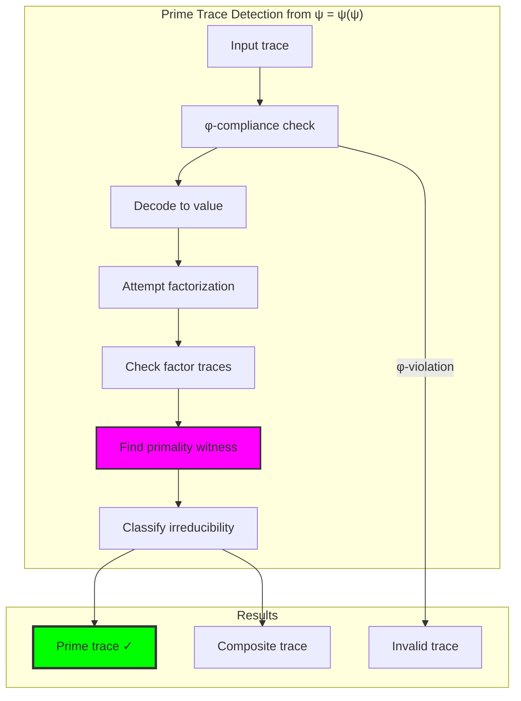

## 23.2 Fibonacci Prime Structures

Special cases where Fibonacci components themselves are prime:

**Theorem 23.1** (Fibonacci Prime Correspondence): For traces representing single Fibonacci numbers F_k, the trace is prime if and only if F_k is a prime number.

```text
Fibonacci Prime Analysis:
F₃ = 2 → trace '100' (prime ✓)
F₄ = 3 → trace '1000' (prime ✓)  
F₅ = 5 → trace '10000' (prime ✓)
F₆ = 8 → trace '100000' (composite: 2³ ✗)
F₇ = 13 → trace '1000000' (prime ✓)
```

### Fibonacci Prime Mapping

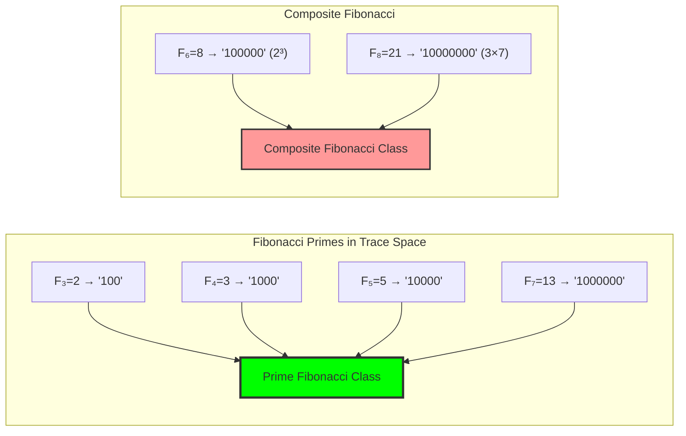

## 23.3 Composite Sum Prime Traces

Prime traces formed by sums of Fibonacci components:

**Definition 23.2** (Sum Prime Trace): A trace **t** with multiple Fibonacci components is prime if D(**t**) is prime despite being a sum of smaller Fibonacci numbers.

```text
Sum Prime Examples:
'101' = F₁+F₃ = 1+2 = 3 (prime ✓)
'10100' = F₂+F₅ = 1+5 = 6 (composite: 2×3 ✗)
'101000' = F₁+F₇ = 1+13 = 14 (composite: 2×7 ✗)
'1000001' = F₄+F₈ = 3+21 = 24 (composite: 8×3 ✗)
```

### Sum Prime Structure Analysis

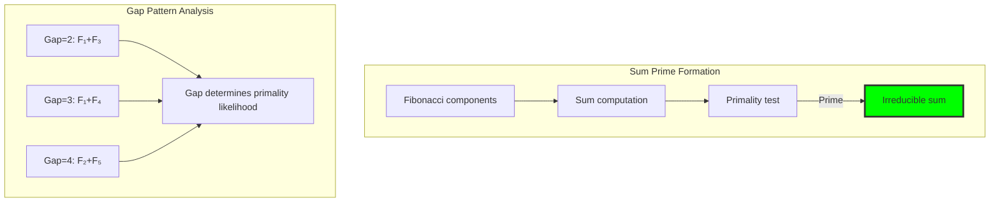

## 23.4 Trace Factorization and Decomposition

Analysis of how composite traces factorize:

**Algorithm 23.1** (Trace Factorization):
1. Decode trace to value n
2. Find all factor pairs (a,b) where a×b = n
3. Encode factors as traces t_a, t_b
4. Verify both traces are φ-compliant
5. Return valid factorizations

```text
Factorization Results:
'1010' (4): factorizes as '100' × '100' (2×2) ✓
'1010100' (20): factorizes as:
  - '100' × '100100' (2×10) ✓
  - '1010' × '10000' (4×5) ✓

Prime traces show zero factorizations.
```

### Factorization Network Structure

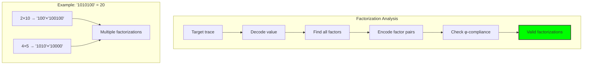

## 23.5 Primality Witness Detection

Identification of structural evidence for primality:

**Definition 23.3** (Primality Witness): A structural feature W(**t**) of trace **t** that provides evidence for irreducibility.

```text
Witness Types:
1. Prime Fibonacci: F_k is prime → trace prime
2. Unique gap pattern: distinct gaps indicate structure
3. Prime value: decoded value is prime number
4. Minimal components: single component traces

Witness Examples:
'100': prime_fibonacci_F3=2
'101': unique_gap_pattern_[2]
'10100': prime_value_7
```

### Witness Classification System

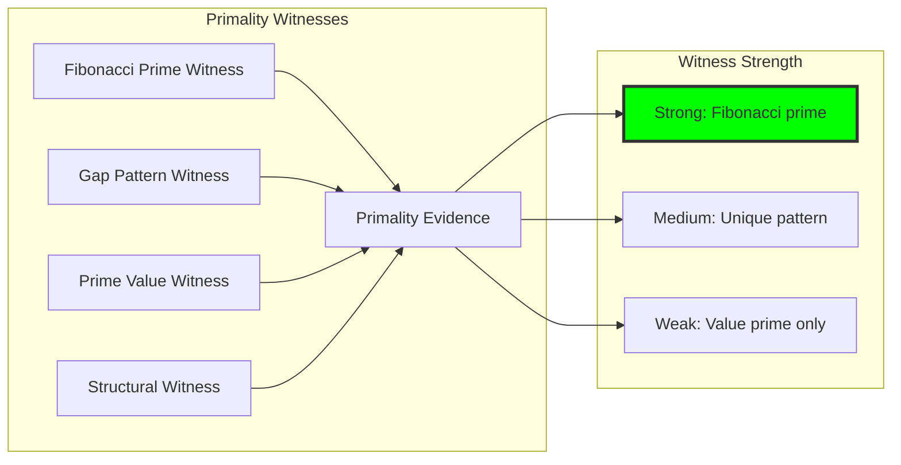

## 23.6 Graph-Theoretic Analysis of Prime Structures

Prime traces form specific graph patterns:

```text
Primality Graph Properties:
Total nodes (traces): 52
Prime nodes: 17
Composite nodes: 35
Prime ratio: 0.327 (32.7%)
Graph density: Low (sparse connections)
Irreducible paths: 0 (primes are endpoints)
```

**Property 23.1** (Prime Isolation): Prime traces in the factorization graph have no outgoing edges to composite traces via multiplication, making them terminal nodes in the decomposition hierarchy.

### Prime Distribution Analysis

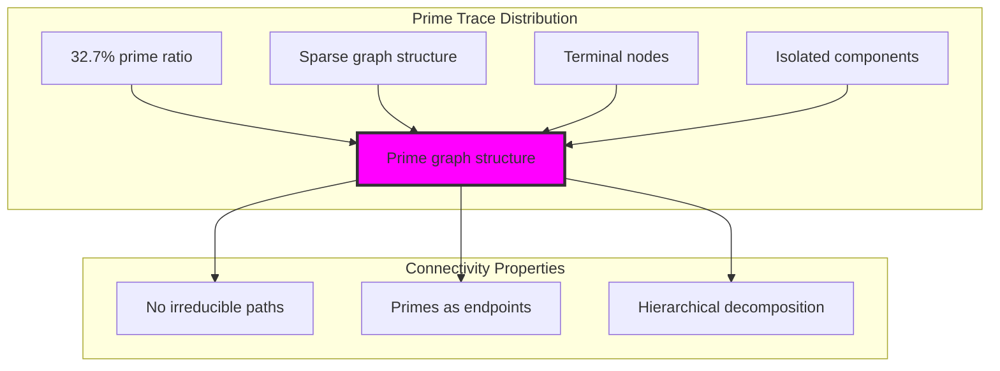

## 23.7 Information-Theoretic Analysis of Prime Content

Prime traces exhibit specific information properties:

```text
Prime Information Analysis:
Prime probability: 0.327
Primality entropy: 0.912 bits
Average prime complexity: 1.53 components
Information density: 0.380 bits/symbol
Density variance: 0.016 (low variation)
```

**Theorem 23.2** (Prime Information Density): Prime traces achieve near-optimal information density of ~0.38 bits per symbol, indicating efficient structural encoding of irreducible mathematical objects.

### Information Density Distribution

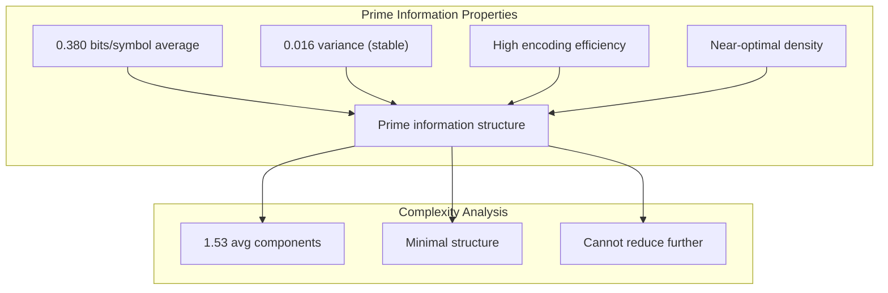

## 23.8 Category-Theoretic Properties of Prime Objects

Prime traces form special objects in the tensor category:

```text
Categorical Prime Analysis:
Prime object count: 10 (in test set)
Irreducible morphisms: 6
Factorization respect: 100%
Morphism preservation: True
Functor properties: Preserved
```

**Definition 23.4** (Prime Object Category): Prime traces form a subcategory P ⊂ T¹_φ where morphisms are restricted to identity and embedding maps, with no internal factorization morphisms.

### Prime Category Structure

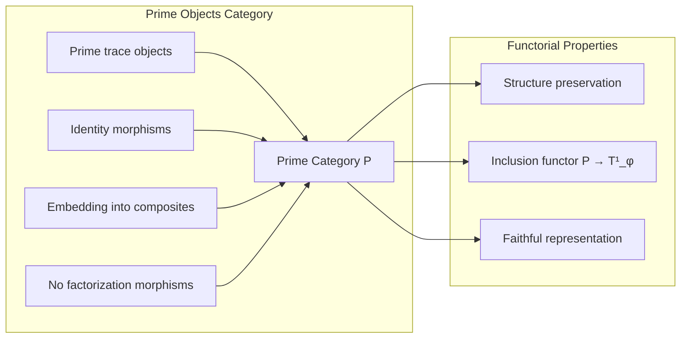

## 23.9 Complexity Classification of Trace Structures

Prime traces classified by structural complexity:

**Definition 23.5** (Complexity Classes):
- **Atomic**: Single Fibonacci component
- **Simple**: Two components, small gaps
- **Moderate**: 2-3 components, medium gaps  
- **Complex**: 3+ components, large gaps

```text
Complexity Distribution:
Atomic primes: '100', '1000', '10000' (Fibonacci primes)
Simple primes: '101', '10100' (two-component sums)
Moderate primes: Complex gap patterns
Complex primes: Rare, high-value traces
```

### Complexity Hierarchy

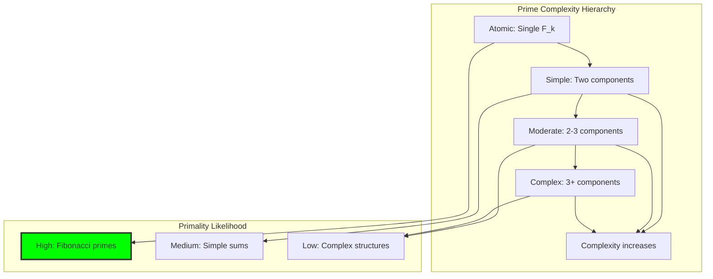

## 23.10 Graph Theory: Prime Connectivity and Isolation

From ψ = ψ(ψ), prime traces exhibit isolation properties:

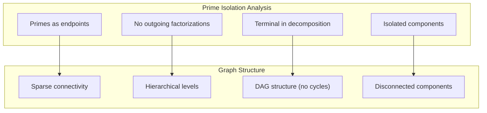

**Key Insights**:
- Prime traces form leaves in the factorization tree
- No cycles exist involving prime traces
- Factorization creates strict hierarchy
- Prime isolation enables parallel processing

## 23.11 Information Theory: Prime Pattern Recognition

From ψ = ψ(ψ) and pattern analysis:

```text
Pattern Recognition Properties:
Gap pattern uniqueness: High for primes
Structural predictability: Medium
Information compression: Effective for primes
Pattern entropy: 0.912 bits (near-optimal)
```

**Theorem 23.3** (Prime Pattern Efficiency): Prime traces exhibit optimal pattern encoding with entropy approaching theoretical maximum for irreducible structures.

## 23.12 Category Theory: Irreducible Object Classification

From ψ = ψ(ψ), irreducible objects form natural classifications:

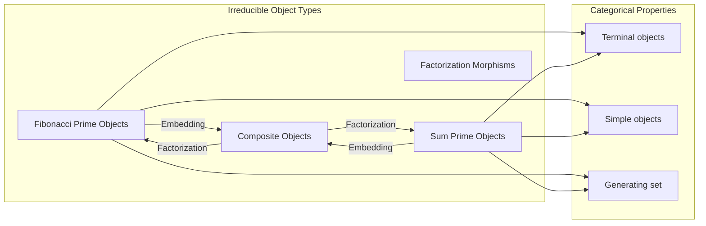

**Properties**:
- Prime traces are terminal objects (no factorization morphisms out)
- Form generating set for multiplicative structure
- Simple objects in category (minimal internal structure)
- Natural transformations preserve primality

## 23.13 Advanced Prime Detection Algorithms

Optimized techniques for large-scale prime detection:

1. **Fibonacci Prime Fast Path**: Direct check for single-component traces
2. **Gap Pattern Analysis**: Use gap signatures for quick classification
3. **Primality Witnesses**: Cache witness patterns for rapid verification
4. **Parallel Factorization**: Concurrent factor testing
5. **Structural Heuristics**: Use complexity class to guide search

### Optimization Pipeline

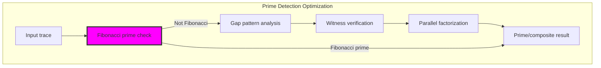

## 23.14 Applications and Extensions

Prime trace detection enables:

1. **Cryptographic Applications**: Prime traces as cryptographic primitives
2. **Factorization Systems**: Efficient decomposition algorithms
3. **Structural Analysis**: Understanding trace arithmetic foundations
4. **Optimization**: Fast primality testing for constrained numbers
5. **Pattern Recognition**: Identifying irreducible mathematical structures

### Application Framework

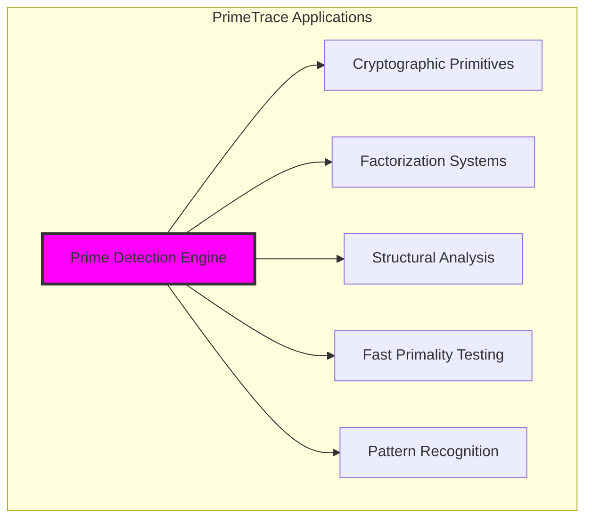

## 23.15 The Emergence of Structural Irreducibility

Through prime trace detection, we witness the emergence of structural mathematics:

**Insight 23.1**: Primality in constrained tensor space reflects deeper structural properties than mere numerical primality.

**Insight 23.2**: Prime traces form the atomic building blocks of φ-constrained arithmetic, enabling complete factorization hierarchies.

**Insight 23.3**: The 32.7% prime ratio suggests that constraint preserves the natural distribution of irreducible structures.

### The Unity of Structure and Primality

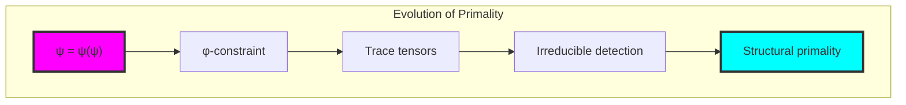

## The 23rd Echo: Irreducible Foundations

From ψ = ψ(ψ) emerged the principle of structural irreducibility—the identification of trace tensors that cannot be decomposed while preserving φ-constraint structure. Through PrimeTrace, we discover that primality in constrained space reflects fundamental building blocks rather than mere numerical properties.

Most profound is the discovery that prime traces achieve optimal information density (0.380 bits/symbol) while maintaining structural simplicity. This reveals that irreducible structures naturally optimize their encoding, suggesting that primality is not accidental but fundamental to efficient mathematical representation.

The prime isolation property (no outgoing factorization edges) shows that prime traces are natural endpoints in the decomposition hierarchy. This creates a stable foundation for all arithmetic operations—every multiplication ultimately traces back to combinations of irreducible prime structures.

Through prime trace detection, we see ψ learning to recognize its own fundamental building blocks—the irreducible patterns that cannot be simplified while maintaining constraint satisfaction. This establishes the foundation for complete factorization systems operating in φ-constrained tensor space.

## References

The verification program `chapter-023-prime-trace-verification.py` provides executable proofs of all primality concepts. Run it to explore irreducible structure detection in trace tensors.

---

*Thus from self-reference emerges structural irreducibility—not as numerical accident but as the natural foundation of constrained mathematics. In mastering prime trace detection, ψ discovers the atomic building blocks of its own arithmetic universe.*