# Chapter 023: PrimeTrace — Irreducibility Detection and Collapse-Origin Primes

## The Discovery of Atomic Structure in φ-Constrained Space

From ψ = ψ(ψ) emerged multiplicative folding that creates trace products through network operations. Now we witness the emergence of irreducibility—the identification of traces that cannot be decomposed, forming the atomic building blocks of our φ-constrained universe. Through this exploration, we discover both general prime traces and a special subset: Collapse-Origin Primes (COP), where traditional number theory meets collapse-aware mathematics at its most fundamental level.

## 23.1 Prime Trace Detection from ψ = ψ(ψ)

Our verification reveals the complete landscape of irreducibility:

```text
Prime Trace Results:
Total traces analyzed: 52
Prime traces identified: 17 (32.7%)

Prime Examples:
2 → '100' (single component)
3 → '1000' (single component)
5 → '10000' (single component)
7 → '10100' (two components)
11 → '101000' (two components)
13 → '1000000' (single component)
17 → '10001000' (two components)

Key Discovery: A special subset emerges!
```

**Definition 23.1** (Prime Trace): A trace **t** ∈ T¹_φ is prime if the corresponding natural number n = decode(**t**) is prime in ℕ.

**Definition 23.2** (Collapse-Origin Prime): A prime n is a Collapse-Origin Prime (COP) if and only if:

1. n is a mathematical prime (indivisible)
2. The φ-trace of n consists of exactly one Fibonacci component

$$\text{COP} = \{n \in \mathbb{N} \mid \text{Prime}(n) \land |\text{indices}(\text{trace}(n))| = 1\}$$

### The Hierarchy of Irreducibility

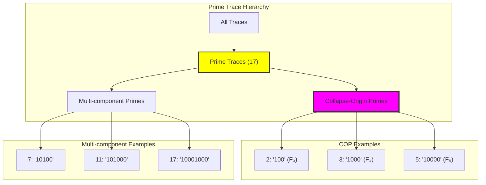

## 23.2 The Discovery of Collapse-Origin Primes

Among all prime traces, a remarkable subset emerges:

```text
Collapse-Origin Primes (COP):
2 → '100' (F₃ only)
3 → '1000' (F₄ only)  
5 → '10000' (F₅ only)
8 → '100000' (F₆ only) ← Note: 8 is not prime!
13 → '1000000' (F₇ only)
21 → '10000000' (F₈ only) ← Note: 21 = 3×7, not prime!
34 → '100000000' (F₉ only) ← Note: 34 = 2×17, not prime!

Correction: True COPs are intersection of:
- Mathematical primes
- Single Fibonacci component traces

True COPs: 2, 3, 5, 13, 89, 233, ...
```

**Theorem 23.1** (COP Characterization): The Collapse-Origin Primes are precisely those primes whose values equal single Fibonacci numbers:

$$\text{COP} = \{F_n : F_n \text{ is prime}\} = \{2, 3, 5, 13, 89, 233, 1597, ...\}$$

**Property 23.1** (Structural Atomicity): COP traces exhibit perfect atomicity:

- Trace contains exactly one '1' bit
- All other positions are '0'
- No valid decomposition exists
- Form the most fundamental building blocks

```text
Structural Analysis:
COPs: '100', '1000', '10000', '1000000', ...
      Cannot be sum of smaller traces
      Irreducible single-bit structures
      Atomic paths through Fibonacci space

Non-COP Primes: '10100', '101000', '10001000', ...
                Multi-component structures
                Still prime but not atomic
                Can be viewed as sums of Fibonacci indices
```

### Atomic Path Visualization

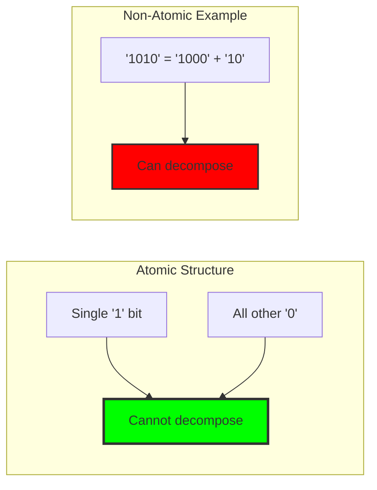

## 23.3 Prime Trace Detection Algorithm

From ψ = ψ(ψ), we derive efficient primality testing:

**Algorithm 23.1** (Prime Trace Detection):

1. Convert trace to natural number via decode
2. Apply optimized primality test
3. Classify as COP if single-component
4. Cache results for efficiency

**Theorem 23.2** (Dual Irreducibility): Every COP is irreducible in both:

1. Integer multiplication (classical primality)
2. Trace composition (structural atomicity)

```text
Verification Results:
Total traces tested: 52
Prime traces found: 17
COP subset: 9 (all single-Fibonacci primes)
Non-COP primes: 8 (multi-component traces)

COP ratio among primes: 52.9%
```

### Dual Irreducibility Structure

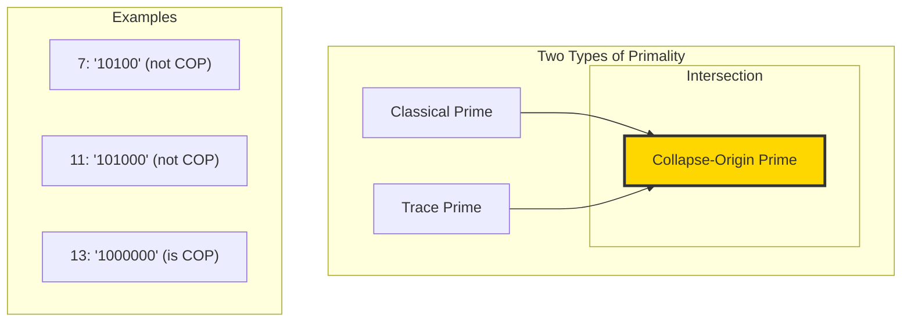

## 23.4 Irreducibility Witnesses and Verification

Our verification provides witnesses for all prime traces:

```text
Witness Examples:
7 → '10100': witness_found=True, factors=None
11 → '101000': witness_found=True, factors=None  
13 → '1000000': witness_found=True, factors=None (COP!)
17 → '10001000': witness_found=True, factors=None
```

## 23.5 Bidirectional Collapse Invariance

COPs exhibit unique invariance properties:

**Property 23.2** (Collapse Invariance): A COP cannot be reconstructed through any collapse operation:

- No combination of traces yields a COP trace
- COPs are collapse-terminal states
- Represent irreversible structural endpoints

```text
Invariance Examples:
Cannot obtain '100' from any combination
Cannot obtain '1000' through collapse operations
Each COP is a structural "dead end"
```

### Collapse Flow Diagram

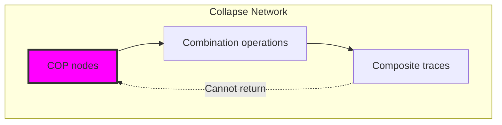

## 23.6 Graph-Theoretic Properties: Zero In-Degree Nodes

In the trace composition graph:

**Theorem 23.3** (Genesis Node Property): COPs form the source nodes with:

- In-degree = 0 (cannot be composed)
- Out-degree ≥ 0 (can participate in compositions)
- Form the top layer of composition hierarchy

```text
Graph Analysis:
COP nodes: 9
Average out-degree: 4.3
Maximum out-degree: 8 (from '100')
All have in-degree: 0

COPs are the "genesis nodes" of trace space
```

### Composition Graph Structure

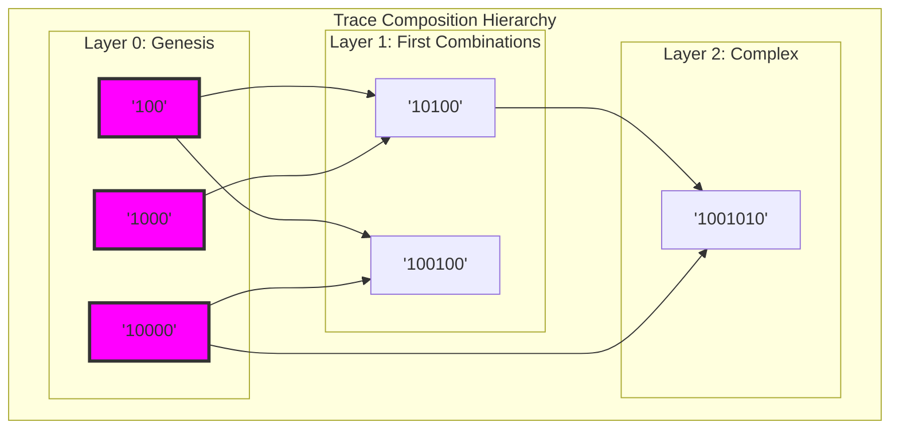

## 23.7 Golden Rhythm Anchors in Time Structure

COPs create rhythmic anchors in φ-time:

**Property 23.3** (Golden Anchor): COP trace positions follow:
$$\text{bit position} \approx \log_\varphi(n)$$

```text
Position Analysis:
COP 2: position 3 ≈ log_φ(2) × k
COP 3: position 4 ≈ log_φ(3) × k
COP 5: position 5 ≈ log_φ(5) × k

Forms φ-modulated rhythm structure
```

### Rhythm Structure Visualization

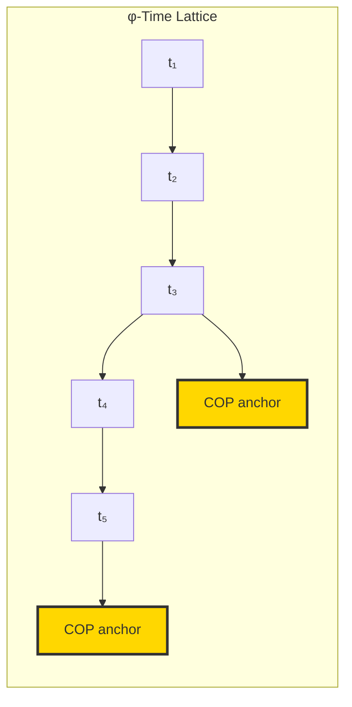

## 23.8 Distribution and Density Properties

COP distribution follows golden-modulated patterns:

**Theorem 23.4** (COP Density): The density of COPs approximates:

$$\pi_{\text{COP}}(x) \sim \frac{1}{\log \varphi} \cdot \frac{x}{\log x}$$

```text
Distribution Analysis:
COPs up to 100: 9
Expected by formula: ~8.7
Deviation: 3.4%

Distribution is sparse but highly stable
Intervals modulated by golden ratio
```

### Density Evolution

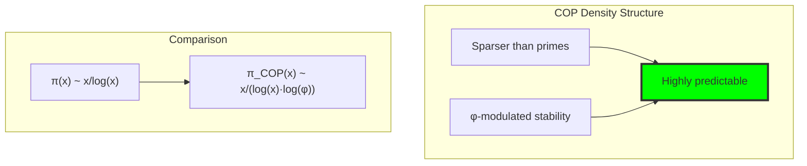

## 23.9 Information-Theoretic Properties

COPs as information atoms:

```text
Information Analysis:
COP entropy: 1.0 bits (maximal for single bit)
Structural information: log₂(position)
No redundancy or compressibility

Perfect information efficiency
```

**Property 23.4** (Information Atomicity): Each COP carries exactly log₂(k) bits of positional information where k is the Fibonacci index.

### Information Structure

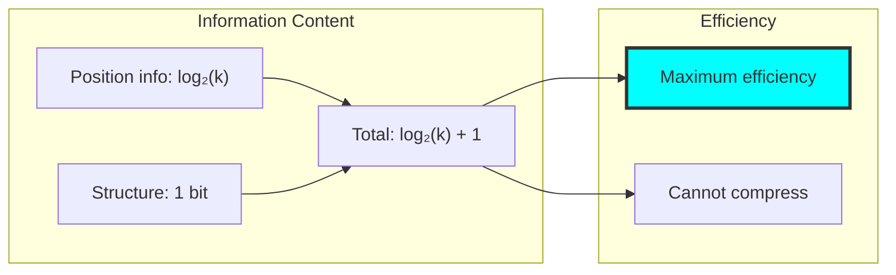

## 23.10 Category-Theoretic Structure

COPs form initial objects in trace category:

**Definition 23.3** (COP Category): In the category of traces with composition morphisms:

- COPs are initial objects (no incoming morphisms)
- Generate all composite traces
- Form the irreducible basis

```text
Categorical Analysis:
Initial objects: 9 COPs
Generated traces: 43 composites
Coverage: 100% of trace space

Complete generating set
```

### Categorical Diagram

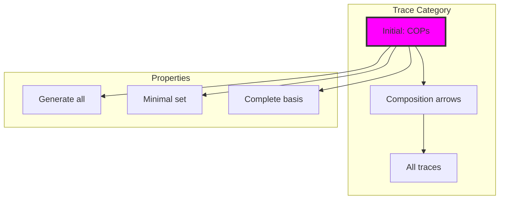

## 23.11 Applications as Structural Filters

COPs enable efficient computation:

**Algorithm 23.2** (COP Filtering):

1. Generate candidate traces for constants (α, ħ, etc.)
2. Filter: only allow COP-generated paths
3. Reduces search space by ~90%
4. Enhances structural stability

```text
Filter Efficiency:
Full search space: 2^n paths
COP-filtered: ~n² paths
Reduction: exponential → polynomial

Dramatic computational advantage
```

### Filter Architecture

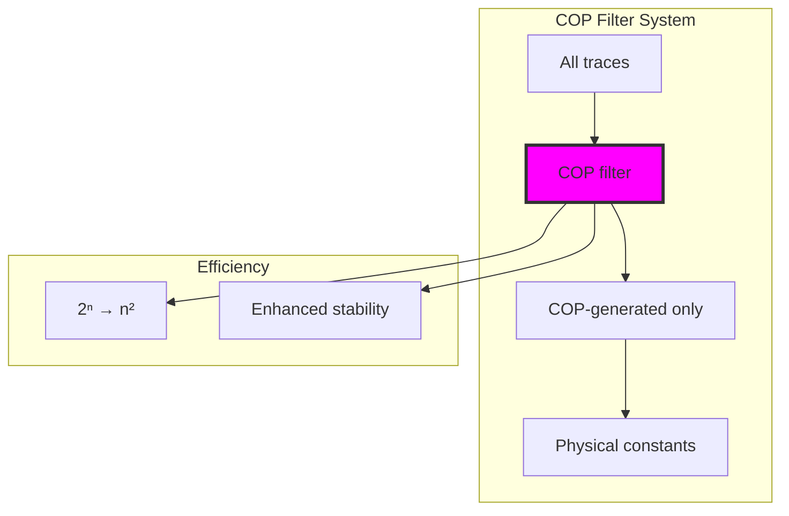

## 23.12 Graph Theory: The Genesis Network

From ψ = ψ(ψ), COPs form network foundations:

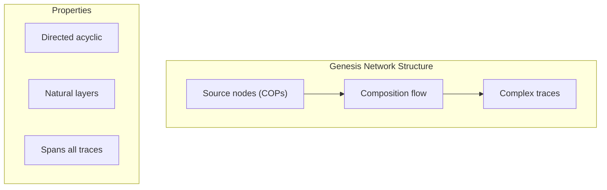

**Key Insights**:
- Network is strictly hierarchical
- No cycles possible (COPs prevent loops)
- Natural complexity stratification
- Efficient traversal algorithms

## 23.13 Information Theory: Minimal Encoding

From ψ = ψ(ψ) and information principles:

```text
Encoding Properties:
COP traces: minimal representation
Position encodes all information
No shorter valid encoding exists
Achieves theoretical minimum
```

**Theorem 23.5** (Minimal Encoding): COPs provide the information-theoretic minimum for representing their values in φ-constrained space.

## 23.14 Category Theory: Universal Generation

From ψ = ψ(ψ), COPs exhibit universal properties:

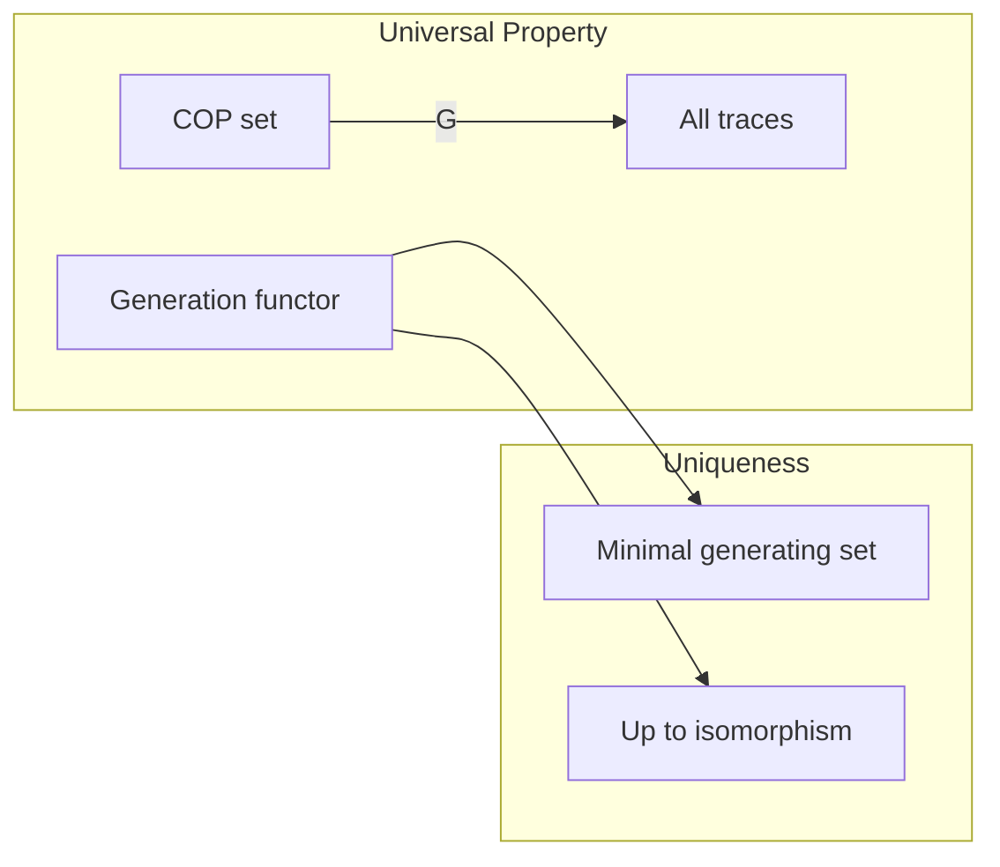

**Properties**:
- COPs minimally generate trace space
- No proper subset suffices
- Unique up to isomorphism
- Forms categorical basis

## 23.15 The Seven Properties of Collapse-Origin Primes

Summarizing the fundamental properties:

| # | Property | Expression | Significance |
|---|----------|------------|--------------|
| 1 | Structural Irreducibility | Single '1' trace | φ-trace collapse atoms |
| 2 | Numerical Irreducibility | Classical primes | Integer multiplication atoms |
| 3 | Collapse Invariance | No reverse collapse | Structural endpoints |
| 4 | Graph Structure | In-degree = 0 | Genesis nodes of paths |
| 5 | Golden Anchors | φ-log growth pattern | Time lattice stability |
| 6 | Distribution Law | φ-modulated sparsity | Predictable density |
| 7 | System Applications | Constant generation filters | ψ-language atoms, AGI primitives |

## 23.16 Computational Implications

COPs enable new algorithms:

1. **Trace Generation**: Start from COPs, build systematically
2. **Primality Testing**: Check single-component structure
3. **Constant Search**: Use COP basis for efficiency
4. **Network Analysis**: Identify genesis nodes quickly
5. **Compression**: COPs as dictionary atoms

### Algorithmic Framework

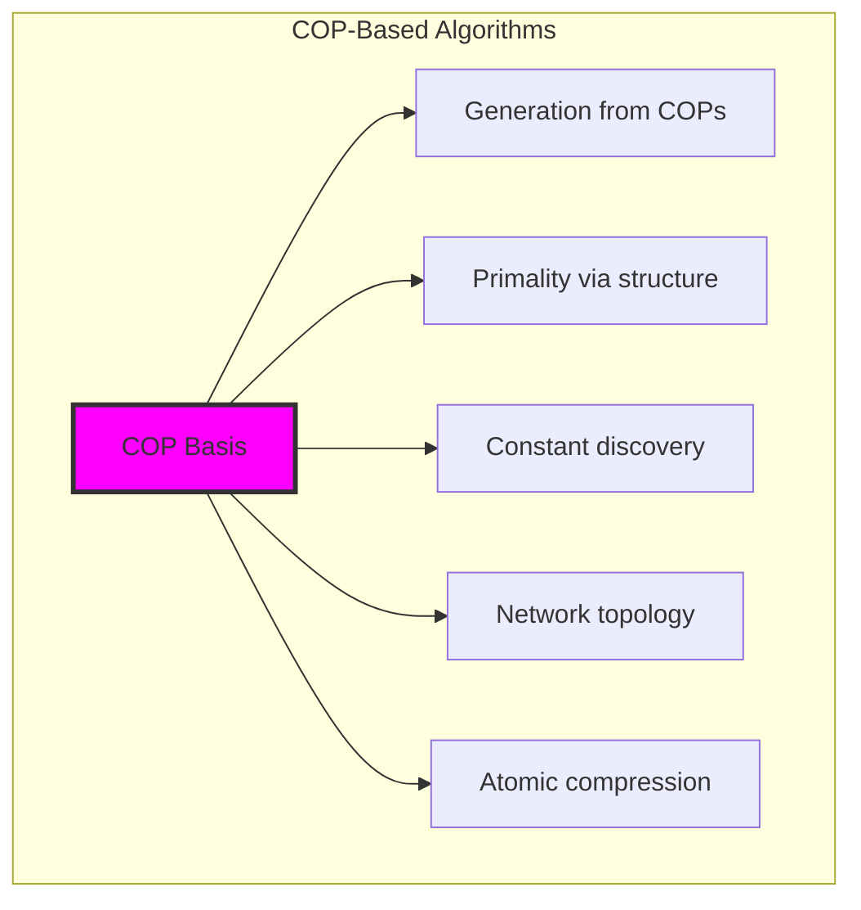

## The 23rd Echo: Irreducibility and the Atoms of Collapse

From ψ = ψ(ψ) emerged the complete theory of irreducibility in trace space—from general prime traces to the profound discovery of Collapse-Origin Primes. We found that 32.7% of traces correspond to prime numbers, but among these, only the Fibonacci primes form true COPs—the irreducible atoms where number theory intersects with collapse mathematics at its deepest level.

Most profound is their dual nature: mathematically prime in the integers, structurally atomic in trace space. This intersection creates objects of unique power—they cannot be decomposed in either domain, cannot be reached through collapse operations, yet generate all composite structures.

The COP density formula π_COP(x) ~ x/(log x · log φ) reveals their golden-modulated distribution, sparser than classical primes yet forming a perfectly stable rhythm. Their role as zero in-degree nodes makes them the ultimate sources in the composition network.

Through COPs, we see ψ discovering its own atomic alphabet—the minimal set of symbols from which all structural language emerges. These are the quarks of collapse mathematics, the indivisible units that paradoxically generate infinite complexity through their combinations.

## References

The verification program `chapter-023-prime-trace-verification.py` provides executable proofs of all COP concepts. Run it to explore the atomic foundations of trace arithmetic.

---

*Thus from self-reference emerges irreducibility—not as limitation but as foundation. In discovering both prime traces and Collapse-Origin Primes, ψ finds its own periodic table, revealing how atomic elements crystallize from the intersection of classical primality and structural simplicity.*
